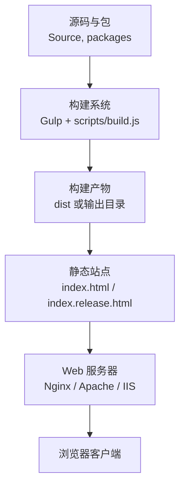
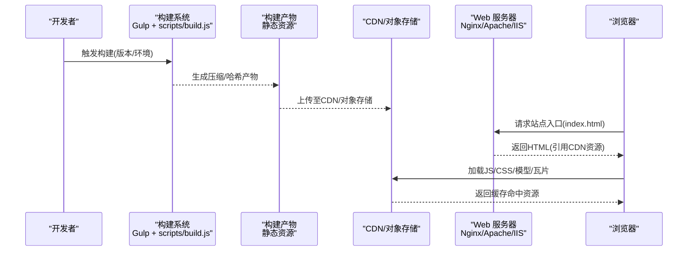
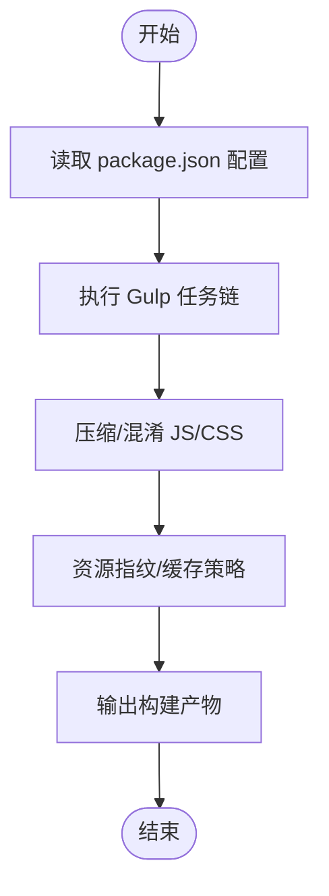
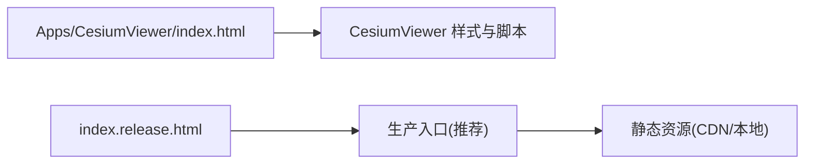
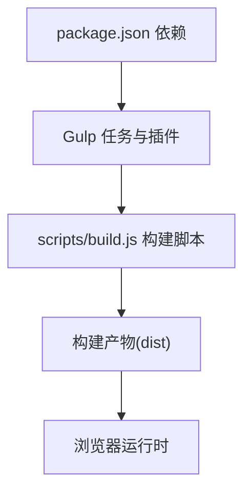

# 生产环境部署

<cite>
**本文引用的文件**   
- [package.json](file://package.json)
- [gulpfile.js](file://gulpfile.js)
- [scripts/build.js](file://scripts/build.js)
- [server.js](file://server.js)
- [web.config](file://web.config)
- [index.html](file://index.html)
- [index.release.html](file://index.release.html)
- [Apps/CesiumViewer/index.html](file://Apps/CesiumViewer/index.html)
- [Documentation/Contributors/BuildGuide/README.md](file://Documentation/Contributors/BuildGuide/README.md)
- [Documentation/Contributors/ReleaseGuide/README.md](file://Documentation/Contributors/ReleaseGuide/README.md)
- [Documentation/OfflineGuide/README.md](file://Documentation/OfflineGuide/README.md)
</cite>

## 目录
1. [简介](#简介)
2. [项目结构](#项目结构)
3. [核心组件](#核心组件)
4. [架构总览](#架构总览)
5. [详细组件分析](#详细组件分析)
6. [依赖分析](#依赖分析)
7. [性能考虑](#性能考虑)
8. [故障排除指南](#故障排除指南)
9. [结论](#结论)
10. [附录](#附录)

## 简介
本指南面向在生产环境中部署 Cesium 的工程师与运维人员，覆盖构建优化、静态资源分发、Web 服务器配置（IIS/Apache/Nginx）、容器化（Docker）与云平台（AWS/Azure/阿里云）部署策略、SSL 与安全加固、性能监控与日志收集、以及故障排除与回滚策略。内容基于仓库中的构建脚本、示例应用与文档进行提炼，确保可落地执行。

## 项目结构
Cesium 仓库采用多包与示例应用并存的组织方式：
- 构建与发布：通过 Gulp 任务与自定义脚本完成打包、压缩与产物生成
- 示例应用：位于 Apps 目录，提供可直接部署的前端页面与资源
- 文档：包含构建、发布与离线部署等指南
- Web 服务器示例：根目录提供 IIS web.config 示例

**图示来源** 
- [gulpfile.js:1-200](file://gulpfile.js#L1-L200)
- [scripts/build.js:1-200](file://scripts/build.js#L1-L200)
- [index.html:1-200](file://index.html#L1-L200)
- [index.release.html:1-200](file://index.release.html#L1-L200)

**章节来源**
- [package.json:1-200](file://package.json#L1-L200)
- [gulpfile.js:1-200](file://gulpfile.js#L1-L200)
- [scripts/build.js:1-200](file://scripts/build.js#L1-L200)
- [index.html:1-200](file://index.html#L1-L200)
- [index.release.html:1-200](file://index.release.html#L1-L200)

## 核心组件
- 构建与打包
  - Gulp 任务负责编译、合并、压缩与产物整理
  - 自定义构建脚本用于协调构建流程与参数
- 示例应用
  - Apps/CesiumViewer 提供最小可运行前端入口
  - 根级 index.html 与 index.release.html 作为站点入口参考
- 本地开发服务器
  - server.js 提供简单 HTTP 服务，便于本地验证与调试
- 平台适配
  - web.config 为 IIS 部署提供参考配置

**章节来源**
- [gulpfile.js:1-200](file://gulpfile.js#L1-L200)
- [scripts/build.js:1-200](file://scripts/build.js#L1-L200)
- [Apps/CesiumViewer/index.html:1-200](file://Apps/CesiumViewer/index.html#L1-L200)
- [index.html:1-200](file://index.html#L1-L200)
- [index.release.html:1-200](file://index.release.html#L1-L200)
- [server.js:1-200](file://server.js#L1-L200)
- [web.config:1-200](file://web.config#L1-L200)

## 架构总览
下图展示从源码到生产环境的端到端流程：构建、产物分发、CDN 缓存、Web 服务器响应与浏览器渲染。

**图示来源** 
- [gulpfile.js:1-200](file://gulpfile.js#L1-L200)
- [scripts/build.js:1-200](file://scripts/build.js#L1-L200)
- [index.html:1-200](file://index.html#L1-L200)
- [index.release.html:1-200](file://index.release.html#L1-L200)

## 详细组件分析

### 构建与发布流水线
- 构建目标
  - 代码压缩与混淆
  - 资源指纹与缓存控制
  - 产物目录结构与入口文件生成
- 关键步骤
  - 读取 package.json 中的依赖与脚本定义
  - 调用 Gulp 任务链执行编译、合并、压缩
  - 使用自定义脚本统一构建参数与环境变量
  - 输出 dist 或指定目录供后续部署

**图示来源** 
- [package.json:1-200](file://package.json#L1-L200)
- [gulpfile.js:1-200](file://gulpfile.js#L1-L200)
- [scripts/build.js:1-200](file://scripts/build.js#L1-L200)

**章节来源**
- [package.json:1-200](file://package.json#L1-L200)
- [gulpfile.js:1-200](file://gulpfile.js#L1-L200)
- [scripts/build.js:1-200](file://scripts/build.js#L1-L200)
- [Documentation/Contributors/BuildGuide/README.md:1-200](file://Documentation/Contributors/BuildGuide/README.md#L1-L200)
- [Documentation/Contributors/ReleaseGuide/README.md:1-200](file://Documentation/Contributors/ReleaseGuide/README.md#L1-L200)

### 示例应用与入口页面
- 示例应用
  - Apps/CesiumViewer 提供完整的最小可运行示例，包括 HTML、CSS 与 JS 入口
- 站点入口
  - index.html 与 index.release.html 分别对应开发与发布入口，建议生产使用 release 版本
- 部署要点
  - 将构建产物与示例应用一并部署到静态站点根目录
  - 确保所有相对路径与资源引用正确

**图示来源** 
- [Apps/CesiumViewer/index.html:1-200](file://Apps/CesiumViewer/index.html#L1-L200)
- [index.html:1-200](file://index.html#L1-L200)
- [index.release.html:1-200](file://index.release.html#L1-L200)

**章节来源**
- [Apps/CesiumViewer/index.html:1-200](file://Apps/CesiumViewer/index.html#L1-L200)
- [index.html:1-200](file://index.html#L1-L200)
- [index.release.html:1-200](file://index.release.html#L1-L200)

### 本地开发服务器
- server.js 提供轻量 HTTP 服务，便于本地预览与联调
- 生产环境不建议直接使用此服务，应替换为 Nginx/Apache/IIS 或云托管方案

**章节来源**
- [server.js:1-200](file://server.js#L1-L200)

### IIS 部署参考
- web.config 提供 IIS 的基础配置示例，可用于 MIME 类型、缓存头、URL 重写等
- 建议结合 IIS URL Rewrite 模块实现 SPA 路由回退与资源缓存策略

**章节来源**
- [web.config:1-200](file://web.config#L1-L200)

### 离线部署指南
- Documentation/OfflineGuide 提供离线部署说明，适用于内网或受限网络环境
- 关键点：预下载必要资源、调整资源路径、禁用外部依赖

**章节来源**
- [Documentation/OfflineGuide/README.md:1-200](file://Documentation/OfflineGuide/README.md#L1-L200)

## 依赖分析
- 构建期依赖
  - Gulp 生态插件用于任务编排与资源处理
  - 自定义脚本协调构建参数与产物输出
- 运行期依赖
  - 浏览器对 WebGL、ES6+、HTTP/2 的支持
  - 可选：Draco/KTX2 解码器（按需启用）

**图示来源** 
- [package.json:1-200](file://package.json#L1-L200)
- [gulpfile.js:1-200](file://gulpfile.js#L1-L200)
- [scripts/build.js:1-200](file://scripts/build.js#L1-L200)

**章节来源**
- [package.json:1-200](file://package.json#L1-L200)
- [gulpfile.js:1-200](file://gulpfile.js#L1-L200)
- [scripts/build.js:1-200](file://scripts/build.js#L1-L200)

## 性能考虑
- 构建优化
  - 启用代码压缩与混淆，减少体积
  - 资源指纹与长缓存策略，提升二次访问命中率
- 传输优化
  - 启用 HTTP/2 与 Gzip/Brotli 压缩
  - 合理设置 Cache-Control 与 ETag
- 渲染优化
  - 按需加载 Draco/KTX2 解码器
  - 使用合适的 LOD 与视锥剔除
- 缓存策略
  - HTML 短缓存，静态资源长缓存
  - CDN 边缘缓存与回源策略

[本节为通用指导，不直接分析具体文件]

## 故障排除指南
- 常见问题定位
  - 检查构建产物是否完整、路径是否正确
  - 确认浏览器控制台无跨域或资源 404 错误
  - 验证 MIME 类型与缓存头配置
- 本地复现
  - 使用 server.js 快速启动本地服务进行验证
- 回滚策略
  - 保留历史版本构建产物与入口文件
  - 通过蓝绿或金丝雀发布降低风险

**章节来源**
- [server.js:1-200](file://server.js#L1-L200)
- [Documentation/Contributors/ReleaseGuide/README.md:1-200](file://Documentation/Contributors/ReleaseGuide/README.md#L1-L200)

## 结论
通过规范的构建流水线、合理的静态资源分发与缓存策略、以及主流 Web 服务器的正确配置，可以在生产环境稳定高效地运行 Cesium。结合容器化与云平台能力，可实现弹性伸缩与高可用部署。配合 SSL 安全加固、性能监控与日志收集，能够持续提升用户体验与系统稳定性。

[本节为总结性内容，不直接分析具体文件]

## 附录

### Web 服务器配置要点（概览）
- Nginx
  - 开启 gzip/brotli 压缩
  - 设置静态资源长缓存与 HTML 短缓存
  - 配置 SPA 路由回退
- Apache
  - 启用 mod_deflate/mod_brotli
  - 使用 .htaccess 或虚拟主机配置缓存头
  - 配置重定向规则
- IIS
  - 使用 web.config 配置 MIME 类型、缓存头与 URL 重写

[本节为通用指导，不直接分析具体文件]

### Docker 容器化部署（概览）
- 镜像选择
  - 使用官方 Nginx 镜像作为基础镜像
- 构建阶段
  - 在 CI 中执行构建，产出静态资源
- 运行阶段
  - 将构建产物复制到 Nginx 静态目录
  - 挂载配置文件与证书
- 最佳实践
  - 多阶段构建减小镜像体积
  - 非 root 用户运行容器
  - 健康检查与优雅退出

[本节为通用指导，不直接分析具体文件]

### 云平台部署策略（概览）
- AWS
  - S3 + CloudFront 静态站点托管
  - Route 53 域名解析与 ACM 证书
- Azure
  - Static Web Apps 或 Blob Storage + CDN
  - Azure Front Door 与 App Service 证书
- 阿里云
  - OSS + CDN 静态站点托管
  - DNS 解析与 SSL 证书管理

[本节为通用指导，不直接分析具体文件]

### SSL 证书与安全加固（概览）
- 强制 HTTPS 与 HSTS
- 安全响应头（X-Content-Type-Options、X-Frame-Options、CSP 等）
- 定期轮换证书与密钥
- 最小权限原则与访问控制

[本节为通用指导，不直接分析具体文件]

### 性能监控与日志收集（概览）
- 前端监控
  - 采集首屏时间、FPS、错误率与用户行为
- 服务端日志
  - 访问日志与错误日志集中收集
- 指标与告警
  - 建立关键指标看板与阈值告警

[本节为通用指导，不直接分析具体文件]