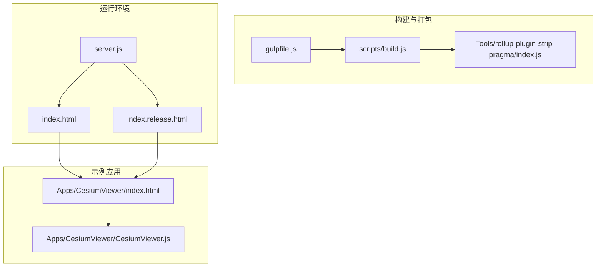
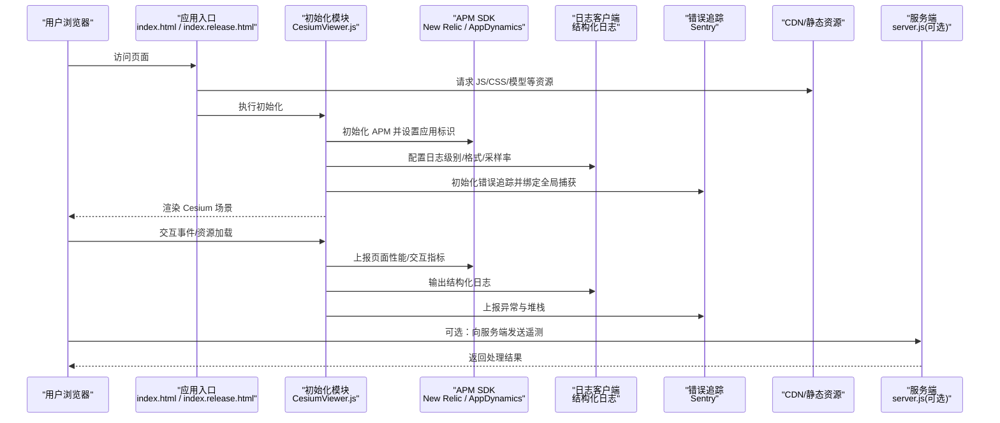
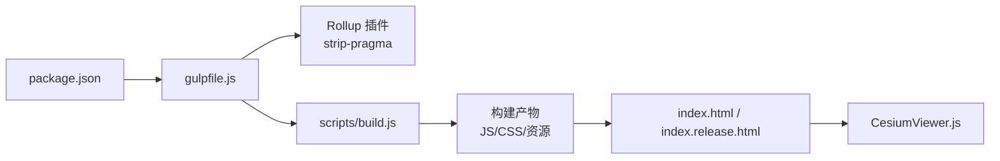

# 监控与日志

<cite>
**本文引用的文件**   
- [README.md](file://README.md)
- [package.json](file://package.json)
- [server.js](file://server.js)
- [index.html](file://index.html)
- [index.release.html](file://index.release.html)
- [Apps/CesiumViewer/index.html](file://Apps/CesiumViewer/index.html)
- [Apps/CesiumViewer/CesiumViewer.js](file://Apps/CesiumViewer/CesiumViewer.js)
- [gulpfile.js](file://gulpfile.js)
- [scripts/build.js](file://scripts/build.js)
- [Tools/rollup-plugin-strip-pragma/index.js](file://Tools/rollup-plugin-strip-pragma/index.js)
- [launches/runServer.launch](file://launches/runServer.launch)
- [launches/runPublicServer.launch](file://launches/runPublicServer.launch)
</cite>

## 目录
1. [简介](#简介)
2. [项目结构](#项目结构)
3. [核心组件](#核心组件)
4. [架构总览](#架构总览)
5. [详细组件分析](#详细组件分析)
6. [依赖分析](#依赖分析)
7. [性能考虑](#性能考虑)
8. [故障排查指南](#故障排查指南)
9. [结论](#结论)
10. [附录](#附录)

## 简介
本指南面向在 Cesium 生产环境中落地“监控与日志”的工程团队，目标是提供一套可操作的方案，覆盖应用性能监控（APM）、结构化日志、错误追踪、前端性能指标采集、自定义业务指标、告警与通知、以及日志分析与故障诊断。由于仓库未内置第三方 APM/日志/错误追踪 SDK，本文基于仓库现有构建与运行脚本，给出最小侵入的集成路径与最佳实践，确保在不改变核心渲染逻辑的前提下完成观测能力接入。

## 项目结构
Cesium 仓库采用多包与示例应用组织方式：
- 核心引擎与 UI 组件位于 packages 下；
- 示例应用位于 Apps 下，其中 CesiumViewer 是典型的前端入口；
- 构建与打包由 Gulp + Rollup 驱动，相关脚本位于 gulpfile.js 与 scripts 目录；
- 本地开发服务器由 server.js 提供；
- 发布产物通过 index.html 与 index.release.html 暴露。

图表来源
- [Apps/CesiumViewer/index.html](file://Apps/CesiumViewer/index.html)
- [Apps/CesiumViewer/CesiumViewer.js](file://Apps/CesiumViewer/CesiumViewer.js)
- [gulpfile.js](file://gulpfile.js)
- [scripts/build.js](file://scripts/build.js)
- [Tools/rollup-plugin-strip-pragma/index.js](file://Tools/rollup-plugin-strip-pragma/index.js)
- [server.js](file://server.js)
- [index.html](file://index.html)
- [index.release.html](file://index.release.html)

章节来源
- [README.md](file://README.md)
- [package.json](file://package.json)
- [server.js](file://server.js)
- [index.html](file://index.html)
- [index.release.html](file://index.release.html)
- [Apps/CesiumViewer/index.html](file://Apps/CesiumViewer/index.html)
- [Apps/CesiumViewer/CesiumViewer.js](file://Apps/CesiumViewer/CesiumViewer.js)
- [gulpfile.js](file://gulpfile.js)
- [scripts/build.js](file://scripts/build.js)
- [Tools/rollup-plugin-strip-pragma/index.js](file://Tools/rollup-plugin-strip-pragma/index.js)

## 核心组件
- 构建与打包管线
  - Gulp 任务编排与 Rollup 插件集成，负责将源码打包为浏览器可用的资源；
  - 通过 rollup-plugin-strip-pragma 支持条件编译开关，便于在生产环境启用或关闭观测代码。
- 运行与服务
  - 本地开发服务器 server.js 用于静态资源服务；
  - 发布页面 index.html 与 index.release.html 作为应用入口。
- 示例应用
  - CesiumViewer 作为演示入口，展示如何加载 Cesium 并初始化场景，适合作为观测点注入位置。

章节来源
- [gulpfile.js](file://gulpfile.js)
- [scripts/build.js](file://scripts/build.js)
- [Tools/rollup-plugin-strip-pragma/index.js](file://Tools/rollup-plugin-strip-pragma/index.js)
- [server.js](file://server.js)
- [index.html](file://index.html)
- [index.release.html](file://index.release.html)
- [Apps/CesiumViewer/index.html](file://Apps/CesiumViewer/index.html)
- [Apps/CesiumViewer/CesiumViewer.js](file://Apps/CesiumViewer/CesiumViewer.js)

## 架构总览
下图展示了在 Cesium 应用中接入 APM、结构化日志与错误追踪的整体流程：SDK 在应用启动阶段初始化，随后在关键生命周期与异常捕获点上报数据至各平台，最终在统一平台进行聚合与分析。

图表来源
- [index.html](file://index.html)
- [index.release.html](file://index.release.html)
- [Apps/CesiumViewer/index.html](file://Apps/CesiumViewer/index.html)
- [Apps/CesiumViewer/CesiumViewer.js](file://Apps/CesiumViewer/CesiumViewer.js)
- [server.js](file://server.js)

## 详细组件分析

### APM 集成（New Relic / AppDynamics）
- 集成目标
  - 采集页面加载时间、首屏渲染、网络请求耗时、GPU/CPU 使用趋势、交互延迟等；
  - 关联业务上下文（如用户会话、设备信息、地理区域）。
- 接入步骤
  - 在应用入口（index.html 或 index.release.html）引入 APM 提供的探针脚本；
  - 在初始化模块（CesiumViewer.js）中完成应用标识与环境参数设置；
  - 对关键操作（如加载地形、瓦片、模型）埋点上报自定义指标；
  - 利用条件编译开关控制是否启用 APM，避免影响开发体验。
- 建议
  - 开启采样以降低开销；
  - 过滤内部健康检查与静默请求；
  - 将 Cesium 版本、WebGL 特性、设备类型作为维度标签。

章节来源
- [index.html](file://index.html)
- [index.release.html](file://index.release.html)
- [Apps/CesiumViewer/index.html](file://Apps/CesiumViewer/index.html)
- [Apps/CesiumViewer/CesiumViewer.js](file://Apps/CesiumViewer/CesiumViewer.js)
- [Tools/rollup-plugin-strip-pragma/index.js](file://Tools/rollup-plugin-strip-pragma/index.js)

### 结构化日志（级别、格式化、轮转）
- 设计要点
  - 统一日志格式：包含时间戳、级别、模块、消息、上下文键值对；
  - 分级策略：开发环境 DEBUG/INFO，生产环境 WARN/ERROR；
  - 采样与限流：高频日志按阈值采样，避免风暴；
  - 轮转策略：按大小/时间切分，保留周期与压缩归档。
- 接入位置
  - 在初始化模块集中创建日志实例，并在关键路径输出结构化日志；
  - 结合条件编译，在构建时剔除调试日志。
- 存储与传输
  - 浏览器端：优先上报到日志收集服务（HTTP/Beacon），必要时落盘 IndexedDB 做离线缓冲；
  - 服务端：若自建日志网关，可在 server.js 增加接收端点。

章节来源
- [Apps/CesiumViewer/CesiumViewer.js](file://Apps/CesiumViewer/CesiumViewer.js)
- [server.js](file://server.js)
- [Tools/rollup-plugin-strip-pragma/index.js](file://Tools/rollup-plugin-strip-pragma/index.js)

### 错误追踪与异常报告（Sentry 等）
- 接入步骤
  - 在应用入口引入错误追踪 SDK；
  - 在初始化模块设置 DSN、环境、版本、用户上下文；
  - 捕获未处理异常、Promise 拒绝、资源加载失败；
  - 附加 Cesium 相关上下文（场景状态、当前视图、资源 URL）。
- 降噪与去重
  - 忽略已知非关键错误；
  - 基于堆栈指纹去重；
  - 限制上报频率与样本量。
- 与 APM/日志联动
  - 通过 traceId/spanId 关联一次请求的全链路数据。

章节来源
- [index.html](file://index.html)
- [index.release.html](file://index.release.html)
- [Apps/CesiumViewer/index.html](file://Apps/CesiumViewer/index.html)
- [Apps/CesiumViewer/CesiumViewer.js](file://Apps/CesiumViewer/CesiumViewer.js)

### 前端性能监控（页面加载、渲染、用户行为）
- 页面加载
  - 使用 Performance API 记录导航、DNS、TCP、TLS、TTFB、DOM 解析、资源加载；
  - 统计关键资源（JS/CSS/字体/模型）的体积与耗时。
- 渲染性能
  - 采集 FPS、帧时长分布、绘制调用次数、纹理上传耗时；
  - 针对大场景与复杂材质进行专项监控。
- 用户行为
  - 记录关键交互（缩放、平移、点击要素、切换图层）；
  - 关联业务指标（如搜索响应时间、标注创建成功率）。

章节来源
- [Apps/CesiumViewer/CesiumViewer.js](file://Apps/CesiumViewer/CesiumViewer.js)
- [index.html](file://index.html)
- [index.release.html](file://index.release.html)

### 自定义指标与关键业务指标
- 指标分类
  - 基础设施：CPU/GPU/内存/网络；
  - 渲染：FPS、Draw Calls、Overdraw、显存占用；
  - 业务：瓦片加载成功率、模型加载耗时、查询响应时间、用户活跃。
- 实现建议
  - 在初始化模块定义指标命名规范与维度标签；
  - 通过 APM 或日志客户端上报；
  - 使用条件编译控制指标粒度。

章节来源
- [Apps/CesiumViewer/CesiumViewer.js](file://Apps/CesiumViewer/CesiumViewer.js)
- [Tools/rollup-plugin-strip-pragma/index.js](file://Tools/rollup-plugin-strip-pragma/index.js)

### 告警规则与通知机制
- 规则设计
  - 基于错误率、P95/P99 延迟、FPS 低于阈值、资源加载失败率等设定阈值；
  - 区分环境（开发/预发/生产）与业务域（地图/模型/矢量）。
- 通知渠道
  - 邮件、IM、电话、工单系统；
  - 与变更事件联动，降低误报。
- 闭环管理
  - 告警→定位→修复→验证→复盘。

章节来源
- [index.html](file://index.html)
- [index.release.html](file://index.release.html)
- [Apps/CesiumViewer/CesiumViewer.js](file://Apps/CesiumViewer/CesiumViewer.js)

### 日志分析与故障诊断工具
- 浏览器侧
  - 开发者工具的性能面板、网络面板、控制台；
  - 资源瀑布图与帧时序分析。
- 服务端
  - 访问日志、错误日志、慢请求日志；
  - 结合 APM 的分布式追踪定位瓶颈。
- 平台侧
  - 在 APM/日志/错误追踪平台中进行多维检索、聚合与可视化。

章节来源
- [server.js](file://server.js)
- [index.html](file://index.html)
- [index.release.html](file://index.release.html)

## 依赖分析
- 构建依赖
  - Gulp 任务与 Rollup 插件共同决定产物结构与优化选项；
  - 条件编译插件可用于裁剪观测代码，减少生产包体。
- 运行依赖
  - 本地服务器仅用于开发调试；
  - 生产部署通常由反向代理或静态站点托管提供服务。

图表来源
- [package.json](file://package.json)
- [gulpfile.js](file://gulpfile.js)
- [scripts/build.js](file://scripts/build.js)
- [Tools/rollup-plugin-strip-pragma/index.js](file://Tools/rollup-plugin-strip-pragma/index.js)
- [index.html](file://index.html)
- [index.release.html](file://index.release.html)
- [Apps/CesiumViewer/CesiumViewer.js](file://Apps/CesiumViewer/CesiumViewer.js)

章节来源
- [package.json](file://package.json)
- [gulpfile.js](file://gulpfile.js)
- [scripts/build.js](file://scripts/build.js)
- [Tools/rollup-plugin-strip-pragma/index.js](file://Tools/rollup-plugin-strip-pragma/index.js)

## 性能考虑
- 采样与节流
  - 对高频指标与日志进行采样，避免阻塞主线程；
  - 合并上报批次，降低网络开销。
- 资源与缓存
  - 合理设置缓存头，复用共享库与模型；
  - 对大资源进行分片与懒加载。
- 条件编译
  - 使用 strip-pragma 在生产构建中移除调试与高开销观测代码；
  - 通过环境变量控制不同环境的观测强度。

章节来源
- [Tools/rollup-plugin-strip-pragma/index.js](file://Tools/rollup-plugin-strip-pragma/index.js)
- [gulpfile.js](file://gulpfile.js)
- [scripts/build.js](file://scripts/build.js)

## 故障排查指南
- 快速定位
  - 使用浏览器开发者工具查看控制台错误与网络失败；
  - 在 APM 平台检索对应 traceId 的全链路详情。
- 常见问题
  - 资源跨域：检查 CORS 与 CDN 配置；
  - WebGL 不支持：检测浏览器兼容性与降级策略；
  - 大场景卡顿：分析 Draw Calls 与纹理上传耗时。
- 日志与错误
  - 确认日志级别与采样率；
  - 校验错误追踪的上下文是否完整。

章节来源
- [server.js](file://server.js)
- [index.html](file://index.html)
- [index.release.html](file://index.release.html)
- [Apps/CesiumViewer/CesiumViewer.js](file://Apps/CesiumViewer/CesiumViewer.js)

## 结论
通过在应用入口与初始化模块中集中接入 APM、结构化日志与错误追踪，并结合条件编译与采样策略，可以在不侵入核心渲染逻辑的前提下，为 Cesium 生产环境建立完善的观测体系。配合合理的告警与诊断流程，能够显著提升问题定位效率与用户体验稳定性。

## 附录
- 本地运行与调试
  - 使用本地服务器启动应用，便于在浏览器中调试观测能力；
  - 参考以下启动脚本以快速运行。

章节来源
- [launches/runServer.launch](file://launches/runServer.launch)
- [launches/runPublicServer.launch](file://launches/runPublicServer.launch)
- [server.js](file://server.js)