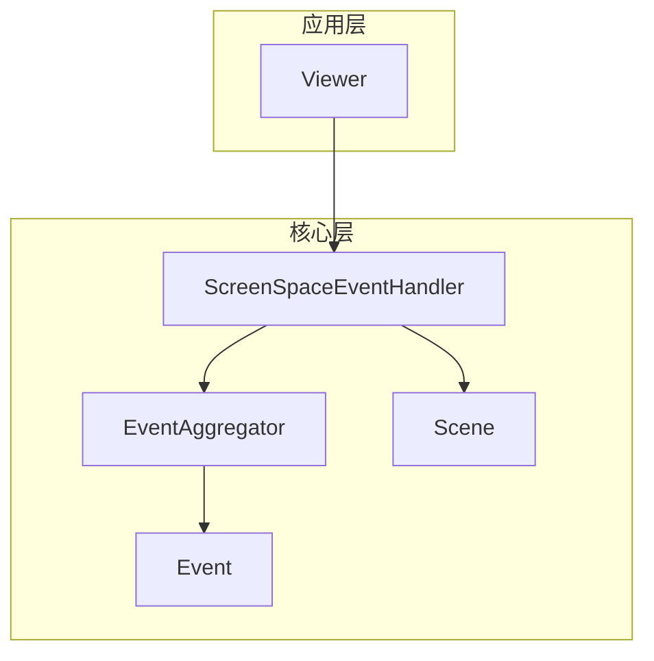
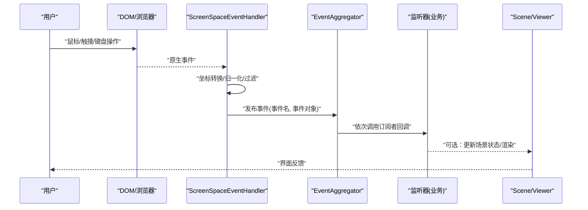
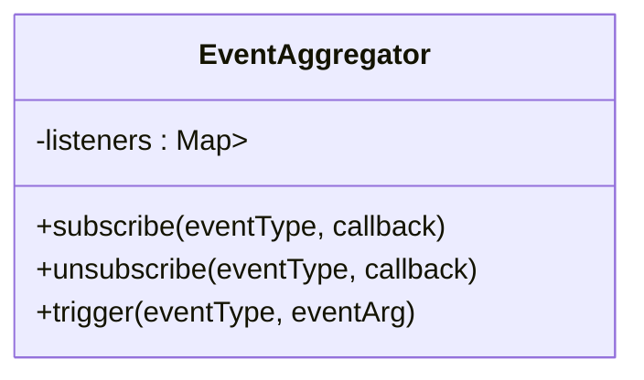
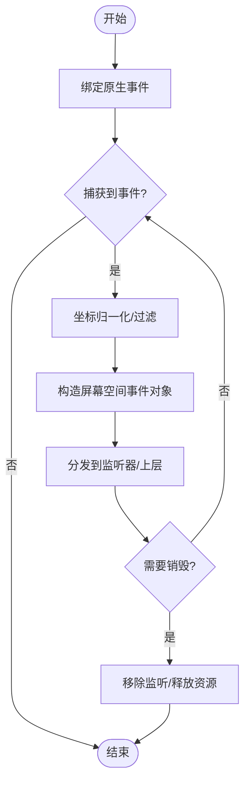
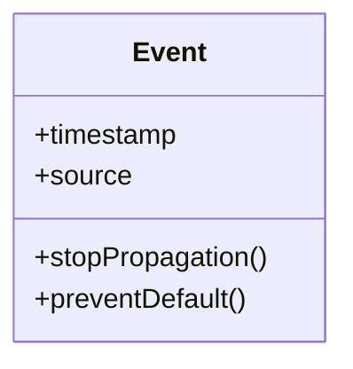
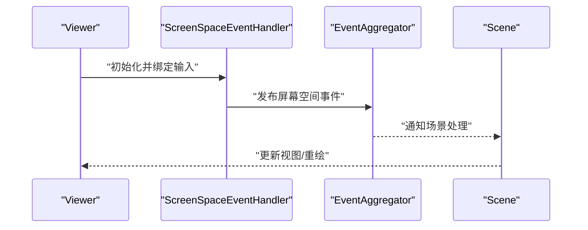
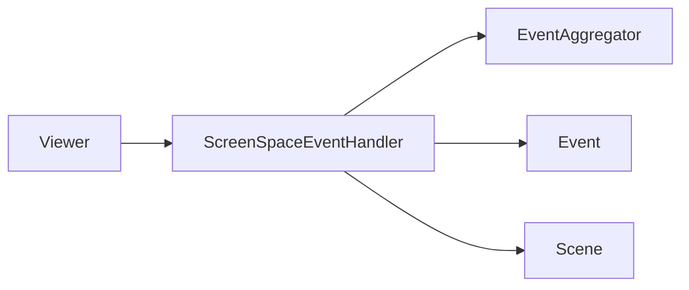

# 事件驱动架构

<cite>
**本文引用的文件**   
- [EventAggregator.js](file://Source/Core/EventAggregator.js)
- [ScreenSpaceEventHandler.js](file://Source/Core/ScreenSpaceEventHandler.js)
- [Event.js](file://Source/Core/Event.js)
- [Viewer.js](file://Source/Widgets/Viewer/Viewer.js)
- [Scene.js](file://Source/Scene/Scene.js)
</cite>

## 目录
1. [简介](#简介)
2. [项目结构](#项目结构)
3. [核心组件](#核心组件)
4. [架构总览](#架构总览)
5. [详细组件分析](#详细组件分析)
6. [依赖分析](#依赖分析)
7. [性能考虑](#性能考虑)
8. [故障排查指南](#故障排查指南)
9. [结论](#结论)
10. [附录](#附录)

## 简介
本技术文档聚焦于 Cesium 的事件驱动架构，围绕以下目标展开：
- 深入解释事件聚合器（EventAggregator）的设计模式与消息分发机制
- 阐述事件监听器的注册、触发与销毁生命周期
- 说明屏幕空间事件处理器的工作原理，包括鼠标、触摸和键盘事件的捕获与处理
- 解释异步事件处理与错误传播机制
- 提供自定义事件系统的开发指南，包括事件类型定义、事件对象设计与性能优化策略
- 包含事件调试技巧与常见问题解决方案

## 项目结构
Cesium 的核心事件能力由若干模块协同完成：
- 事件总线与聚合：通过事件聚合器统一管理事件订阅与发布
- 屏幕空间输入：将浏览器原生输入事件转换为 Cesium 语义化的屏幕空间事件
- 场景与视图集成：在 Viewer 与 Scene 中接入事件流，驱动交互逻辑

图表来源
- [Viewer.js](file://Source/Widgets/Viewer/Viewer.js)
- [ScreenSpaceEventHandler.js](file://Source/Core/ScreenSpaceEventHandler.js)
- [EventAggregator.js](file://Source/Core/EventAggregator.js)
- [Event.js](file://Source/Core/Event.js)
- [Scene.js](file://Source/Scene/Scene.js)

章节来源
- [Viewer.js](file://Source/Widgets/Viewer/Viewer.js)
- [ScreenSpaceEventHandler.js](file://Source/Core/ScreenSpaceEventHandler.js)
- [EventAggregator.js](file://Source/Core/EventAggregator.js)
- [Event.js](file://Source/Core/Event.js)
- [Scene.js](file://Source/Scene/Scene.js)

## 核心组件
- 事件聚合器（EventAggregator）
  - 职责：集中管理事件类型的订阅者集合，提供统一的订阅、取消订阅与触发接口；支持按事件类型路由到对应监听器。
  - 关键特性：
    - 订阅/取消订阅：维护事件名到回调列表的映射
    - 触发：遍历并调用所有已注册的监听器
    - 生命周期：随宿主对象创建与销毁而初始化与清理
- 屏幕空间事件处理器（ScreenSpaceEventHandler）
  - 职责：桥接浏览器原生输入事件（鼠标、触摸、键盘）与 Cesium 屏幕空间事件模型；负责坐标转换、事件去抖与节流、冒泡控制等。
  - 关键特性：
    - 事件绑定与解绑：根据配置绑定/移除 DOM 事件
    - 事件转换：将原生事件转换为 Cesium 语义化事件对象
    - 调度：将转换后的事件投递给上层（如 Scene/Viewer）或内部处理链
- 事件基类（Event）
  - 职责：定义事件对象的通用结构与行为，作为具体事件类型的基类或工厂
  - 关键特性：
    - 标准化属性：时间戳、来源、上下文等
    - 扩展点：为特定事件类型提供额外字段

章节来源
- [EventAggregator.js](file://Source/Core/EventAggregator.js)
- [ScreenSpaceEventHandler.js](file://Source/Core/ScreenSpaceEventHandler.js)
- [Event.js](file://Source/Core/Event.js)

## 架构总览
下图展示了从用户输入到事件分发的整体流程，以及各组件之间的协作关系。

图表来源
- [ScreenSpaceEventHandler.js](file://Source/Core/ScreenSpaceEventHandler.js)
- [EventAggregator.js](file://Source/Core/EventAggregator.js)
- [Scene.js](file://Source/Scene/Scene.js)
- [Viewer.js](file://Source/Widgets/Viewer/Viewer.js)

## 详细组件分析

### 事件聚合器（EventAggregator）
- 设计要点
  - 以“事件名 -> 回调数组”为核心数据结构，实现简单高效的发布/订阅
  - 提供订阅、取消订阅、触发三类 API，确保在遍历期间安全地增删监听器
- 典型方法
  - 订阅：将回调加入指定事件名的队列
  - 取消订阅：从队列中移除指定回调
  - 触发：按顺序执行所有订阅者，可传递事件参数
- 复杂度与性能
  - 订阅/取消：O(n) 查找与插入/删除（n 为同事件监听器数量）
  - 触发：O(n) 线性遍历
  - 建议：对高频事件减少监听器数量，必要时使用批处理或节流
- 错误处理
  - 单个监听器抛错不应影响其他监听器执行
  - 建议在触发时包裹 try/catch，记录错误上下文

图表来源
- [EventAggregator.js](file://Source/Core/EventAggregator.js)

章节来源
- [EventAggregator.js](file://Source/Core/EventAggregator.js)

### 屏幕空间事件处理器（ScreenSpaceEventHandler）
- 工作原理
  - 绑定/解绑：根据配置在容器元素上注册/移除原生事件监听
  - 事件转换：将原生事件转换为 Cesium 屏幕空间事件对象（含坐标、按钮、修饰键等）
  - 分发策略：将转换后的事件交由上层（如 Scene/Viewer）或内部处理链进行消费
- 关键流程
  - 注册阶段：确定要监听的事件类型与目标元素
  - 捕获阶段：拦截原生事件，进行坐标变换与有效性校验
  - 派发阶段：构造事件对象并通过事件聚合器或内部分发器广播
  - 销毁阶段：移除所有 DOM 监听，释放引用，避免内存泄漏
- 性能考量
  - 对高频事件（mousemove/touchmove）采用节流/防抖
  - 批量处理：合并多次更新，降低主线程压力
  - 最小化事件对象分配：复用对象或池化

图表来源
- [ScreenSpaceEventHandler.js](file://Source/Core/ScreenSpaceEventHandler.js)

章节来源
- [ScreenSpaceEventHandler.js](file://Source/Core/ScreenSpaceEventHandler.js)

### 事件基类（Event）
- 作用
  - 统一事件对象的结构与元数据，便于跨模块识别与处理
- 常见属性
  - 时间戳、来源、上下文、是否被阻止等
- 扩展方式
  - 派生具体事件类型，增加领域相关字段（如点击位置、拾取结果等）

图表来源
- [Event.js](file://Source/Core/Event.js)

章节来源
- [Event.js](file://Source/Core/Event.js)

### 与场景/视图的集成
- 集成点
  - Viewer 通常持有 ScreenSpaceEventHandler 实例，并将其与 Scene 的交互管线对接
  - Scene 在每帧或交互循环中消费事件，驱动相机、拾取、高亮等逻辑
- 典型序列
  - 用户输入 -> 屏幕空间处理器 -> 事件聚合器 -> 场景/视图 -> 渲染更新

图表来源
- [Viewer.js](file://Source/Widgets/Viewer/Viewer.js)
- [ScreenSpaceEventHandler.js](file://Source/Core/ScreenSpaceEventHandler.js)
- [EventAggregator.js](file://Source/Core/EventAggregator.js)
- [Scene.js](file://Source/Scene/Scene.js)

章节来源
- [Viewer.js](file://Source/Widgets/Viewer/Viewer.js)
- [Scene.js](file://Source/Scene/Scene.js)

## 依赖分析
- 组件耦合
  - ScreenSpaceEventHandler 依赖 EventAggregator 进行事件分发
  - ScreenSpaceEventHandler 与 Scene/Viewer 存在集成关系，用于消费与响应事件
  - Event 作为基础类型被多处复用
- 外部依赖
  - 浏览器 DOM 事件（鼠标、触摸、键盘）
  - 渲染循环（requestAnimationFrame 或内部帧循环）

图表来源
- [ScreenSpaceEventHandler.js](file://Source/Core/ScreenSpaceEventHandler.js)
- [EventAggregator.js](file://Source/Core/EventAggregator.js)
- [Event.js](file://Source/Core/Event.js)
- [Scene.js](file://Source/Scene/Scene.js)
- [Viewer.js](file://Source/Widgets/Viewer/Viewer.js)

章节来源
- [ScreenSpaceEventHandler.js](file://Source/Core/ScreenSpaceEventHandler.js)
- [EventAggregator.js](file://Source/Core/EventAggregator.js)
- [Event.js](file://Source/Core/Event.js)
- [Scene.js](file://Source/Scene/Scene.js)
- [Viewer.js](file://Source/Widgets/Viewer/Viewer.js)

## 性能考虑
- 事件频率控制
  - 对高频事件（移动、滚轮）采用节流/防抖，降低回调执行次数
- 监听器规模
  - 避免在同一事件上注册过多监听器；必要时合并逻辑或使用单一聚合回调
- 对象分配
  - 减少事件对象频繁创建，可复用或池化；避免在回调中产生大对象
- 异步处理
  - 将耗时任务放入微任务或 Worker，避免阻塞主线程与渲染循环
- 内存管理
  - 及时取消订阅与移除监听，防止闭包导致的内存泄漏

[本节为通用指导，不直接分析具体文件]

## 故障排查指南
- 常见问题
  - 事件未触发：检查是否正确绑定目标元素与事件类型；确认未被 preventDefault 或 stopPropagation 阻断
  - 重复触发：排查是否存在多实例绑定或未正确解绑
  - 性能抖动：定位高频事件回调中的重计算或大量 DOM 操作
  - 内存泄漏：确认销毁路径是否移除了所有监听与引用
- 调试技巧
  - 在事件聚合器触发处添加日志，打印事件名与参数
  - 在屏幕空间处理器入口输出原始事件与转换后事件
  - 使用浏览器性能面板分析回调耗时与分配热点
- 错误传播
  - 单个监听器异常不应中断其余监听器；在触发处包裹异常捕获并上报
  - 对于异步回调，确保错误能被上层捕获与展示

章节来源
- [EventAggregator.js](file://Source/Core/EventAggregator.js)
- [ScreenSpaceEventHandler.js](file://Source/Core/ScreenSpaceEventHandler.js)

## 结论
Cesium 的事件驱动架构通过事件聚合器与屏幕空间事件处理器实现了清晰的解耦与可扩展性。合理设计事件类型与对象、严格控制事件频率与监听器规模、完善错误处理与销毁路径，是构建高性能交互体验的关键。

[本节为总结性内容，不直接分析具体文件]

## 附录

### 自定义事件系统开发指南
- 事件类型定义
  - 明确事件命名规范与分类（如 UI、地理、数据）
  - 为每个事件定义最小必要属性集，避免过度膨胀
- 事件对象设计
  - 继承统一基类，保证元数据一致
  - 提供只读访问器与不可变语义，避免副作用
- 生命周期管理
  - 注册：在合适时机（如组件挂载）订阅
  - 触发：仅在状态变更或用户交互时发布
  - 销毁：在组件卸载或页面关闭前取消订阅
- 性能优化策略
  - 节流/防抖：针对高频事件
  - 批处理：合并多次更新
  - 对象池：复用事件对象
- 异步与错误传播
  - 使用 Promise/async-await 表达异步流程
  - 在关键节点捕获并上报错误，避免静默失败

[本节为概念性指导，不直接分析具体文件]