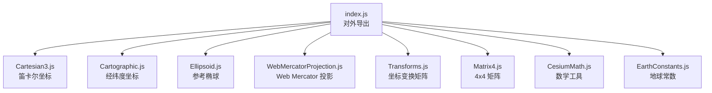
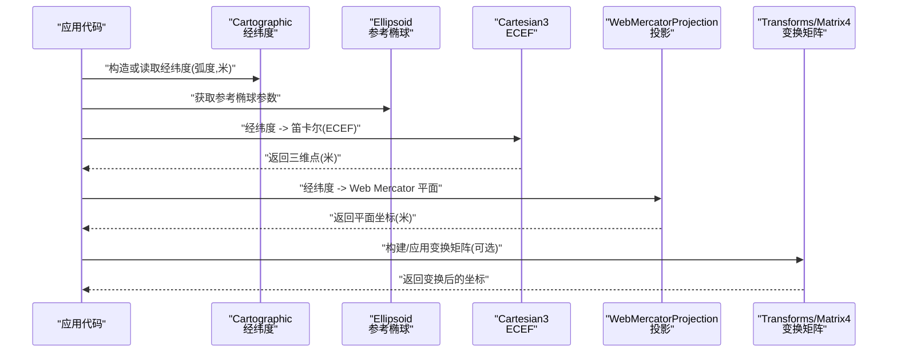
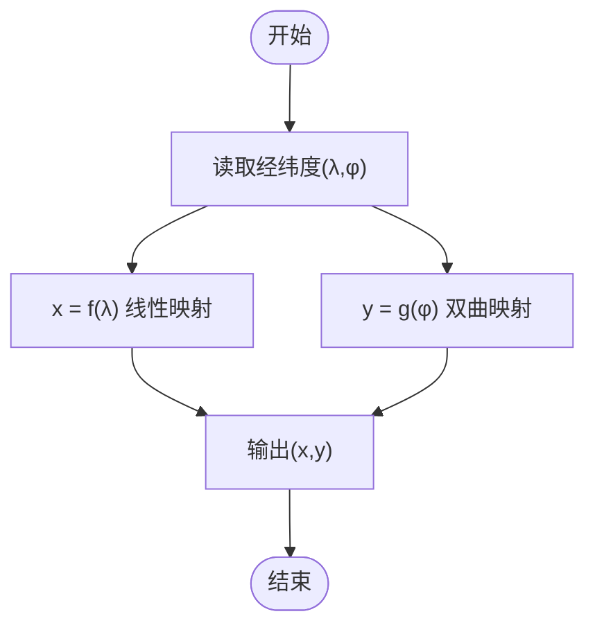
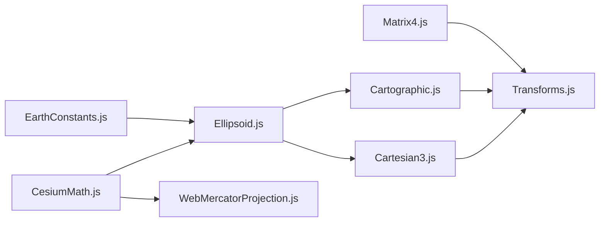

# 坐标系统与投影

<cite>
**本文引用的文件**   
- [index.js](file://index.js)
- [Cartesian3.js](file://Source/Core/Cartesian3.js)
- [Cartographic.js](file://Source/Core/Cartographic.js)
- [Ellipsoid.js](file://Source/Core/Ellipsoid.js)
- [EllipsoidGeodesic.js](file://Source/Core/EllipsoidGeodesic.js)
- [WebMercatorProjection.js](file://Source/Core/WebMercatorProjection.js)
- [EarthConstants.js](file://Source/Core/EarthConstants.js)
- [Matrix4.js](file://Source/Core/Matrix4.js)
- [Transforms.js](file://Source/Core/Transforms.js)
- [CesiumMath.js](file://Source/Core/CesiumMath.js)
</cite>

## 目录
1. [简介](#简介)
2. [项目结构](#项目结构)
3. [核心组件](#核心组件)
4. [架构总览](#架构总览)
5. [详细组件分析](#详细组件分析)
6. [依赖关系分析](#依赖关系分析)
7. [性能考虑](#性能考虑)
8. [故障排查指南](#故障排查指南)
9. [结论](#结论)
10. [附录](#附录) 

## 简介
本技术文档聚焦于 Cesium 的坐标系统与投影机制，系统阐述 WGS84 地理坐标系、Web Mercator 投影与 ECEF（地心固定坐标系）的原理与转换方法。重点解释 Cartesian3 笛卡尔坐标与 Cartographic 经纬度坐标之间的转换算法，说明椭球体模型、基准面定义与坐标转换公式在地球可视化中的作用。文档同时提供批量转换、精度控制与性能优化的实践建议，帮助读者在实际工程中高效、准确地处理多源坐标数据。

## 项目结构
Cesium 的核心坐标与投影能力集中在 Source/Core 目录下：
- 坐标类型：Cartesian3（三维笛卡尔）、Cartographic（经纬度）
- 参考椭球与常数：Ellipsoid、EarthConstants
- 投影：WebMercatorProjection
- 变换矩阵与工具：Matrix4、Transforms、CesiumMath
- 导出入口：index.js 聚合对外 API

图表来源 
- [index.js](file://index.js)
- [Cartesian3.js](file://Source/Core/Cartesian3.js)
- [Cartographic.js](file://Source/Core/Cartographic.js)
- [Ellipsoid.js](file://Source/Core/Ellipsoid.js)
- [WebMercatorProjection.js](file://Source/Core/WebMercatorProjection.js)
- [Transforms.js](file://Source/Core/Transforms.js)
- [Matrix4.js](file://Source/Core/Matrix4.js)
- [CesiumMath.js](file://Source/Core/CesiumMath.js)
- [EarthConstants.js](file://Source/Core/EarthConstants.js)

章节来源
- [index.js](file://index.js)

## 核心组件
- Cartesian3：表示地心固定坐标系（ECEF）中的三维点，单位通常为米。用于几何计算、渲染管线与空间查询。
- Cartographic：表示基于参考椭球的经纬度与高度，单位为弧度与米。常用于地理数据输入输出与地图标注。
- Ellipsoid：定义参考椭球参数（长半轴、短半轴、扁率等），是地理与笛卡尔坐标互转的基础。
- WebMercatorProjection：实现 WGS84 经纬度到 Web Mercator 平面坐标的投影与反投影。
- Transforms：提供不同参考系间的变换矩阵（如 ECEF 与局部东北上ENU、世界坐标与屏幕坐标等）。
- Matrix4：通用 4x4 齐次变换矩阵，支撑旋转、平移、缩放与复合变换。
- EarthConstants：提供标准地球常数（如 WGS84 长半轴、扁率等）。
- CesiumMath：常用数学工具（角度换算、归一化、数值稳定等）。

章节来源
- [Cartesian3.js](file://Source/Core/Cartesian3.js)
- [Cartographic.js](file://Source/Core/Cartographic.js)
- [Ellipsoid.js](file://Source/Core/Ellipsoid.js)
- [WebMercatorProjection.js](file://Source/Core/WebMercatorProjection.js)
- [Transforms.js](file://Source/Core/Transforms.js)
- [Matrix4.js](file://Source/Core/Matrix4.js)
- [EarthConstants.js](file://Source/Core/EarthConstants.js)
- [CesiumMath.js](file://Source/Core/CesiumMath.js)

## 架构总览
下图展示了从地理坐标到笛卡尔坐标再到投影平面的典型流程，以及关键模块的职责边界。

图表来源 
- [Cartographic.js](file://Source/Core/Cartographic.js)
- [Ellipsoid.js](file://Source/Core/Ellipsoid.js)
- [Cartesian3.js](file://Source/Core/Cartesian3.js)
- [WebMercatorProjection.js](file://Source/Core/WebMercatorProjection.js)
- [Transforms.js](file://Source/Core/Transforms.js)
- [Matrix4.js](file://Source/Core/Matrix4.js)

## 详细组件分析

### 参考椭球与地球常数
- 作用：为所有地理相关计算提供统一的形状与尺寸基准。WGS84 是最常用的基准面，定义了长半轴与扁率。
- 关键点：
  - 长半轴 a、短半轴 b、扁率 f 决定子午圈曲率半径与卯酉圈曲率半径的计算。
  - 高度 h 通常定义为沿法线方向到椭球面的距离。
- 常见用途：经纬度与笛卡尔坐标互转、大地线计算、投影正算与反算。

章节来源
- [Ellipsoid.js](file://Source/Core/Ellipsoid.js)
- [EarthConstants.js](file://Source/Core/EarthConstants.js)

### 经纬度与笛卡尔坐标互转（Cartographic ↔ Cartesian3）
- 正向（Cartographic → Cartesian3）：
  - 依据椭球参数计算子午圈与卯酉圈曲率半径。
  - 将经度 λ、纬度 φ、高度 h 转换为法线向量并乘以 (N+h)，得到 ECEF 坐标。
- 反向（Cartesian3 → Cartographic）：
  - 通过迭代或解析近似求解纬度与高度，确保数值稳定性。
- 复杂度与精度：
  - 单次转换 O(1)。
  - 高精度场景建议使用库提供的专用函数，避免手工推导带来的舍入误差。

图表来源 
- [Cartographic.js](file://Source/Core/Cartographic.js)
- [Ellipsoid.js](file://Source/Core/Ellipsoid.js)
- [Cartesian3.js](file://Source/Core/Cartesian3.js)

章节来源
- [Cartographic.js](file://Source/Core/Cartographic.js)
- [Ellipsoid.js](file://Source/Core/Ellipsoid.js)
- [Cartesian3.js](file://Source/Core/Cartesian3.js)

### Web Mercator 投影
- 适用性：全球范围、近赤道精度较好、高纬度存在拉伸；广泛用于在线地图服务。
- 正算（经纬度 → 平面）：
  - 经度线性映射至 x。
  - 纬度采用双曲函数进行非线性映射至 y，保证保角特性。
- 反算（平面 → 经纬度）：
  - x 线性还原经度。
  - y 通过反函数还原纬度。
- 注意事项：
  - 极区不可达或需裁剪。
  - 平面距离与面积在高纬度失真明显，应避免直接度量。

图表来源 
- [WebMercatorProjection.js](file://Source/Core/WebMercatorProjection.js)
- [CesiumMath.js](file://Source/Core/CesiumMath.js)

章节来源
- [WebMercatorProjection.js](file://Source/Core/WebMercatorProjection.js)
- [CesiumMath.js](file://Source/Core/CesiumMath.js)

### 变换矩阵与参考系
- Transforms 提供多种参考系间变换矩阵，例如：
  - ECEF 到局部东北上（ENU）
  - 世界坐标到屏幕坐标
  - 任意两参考系间的相对变换
- Matrix4 作为基础数据结构，支持组合、求逆、分解等操作。
- 使用建议：
  - 优先使用库内预置变换，减少自定义矩阵错误。
  - 对频繁使用的变换可缓存矩阵对象，避免重复计算。

章节来源
- [Transforms.js](file://Source/Core/Transforms.js)
- [Matrix4.js](file://Source/Core/Matrix4.js)

### 示例路径与用法指引
以下为常见操作的“代码片段路径”指引（不展示具体代码内容）：
- 经纬度转笛卡尔（ECEF）
  - 参考路径：[Cartographic.js](file://Source/Core/Cartographic.js)、[Ellipsoid.js](file://Source/Core/Ellipsoid.js)、[Cartesian3.js](file://Source/Core/Cartesian3.js)
- 笛卡尔转经纬度
  - 参考路径：[Cartesian3.js](file://Source/Core/Cartesian3.js)、[Ellipsoid.js](file://Source/Core/Ellipsoid.js)
- 经纬度转 Web Mercator 平面
  - 参考路径：[WebMercatorProjection.js](file://Source/Core/WebMercatorProjection.js)
- 平面转经纬度
  - 参考路径：[WebMercatorProjection.js](file://Source/Core/WebMercatorProjection.js)
- 构建 ENU 局部坐标系
  - 参考路径：[Transforms.js](file://Source/Core/Transforms.js)、[Matrix4.js](file://Source/Core/Matrix4.js)
- 批量转换（数组级）
  - 参考路径：[Cartesian3.js](file://Source/Core/Cartesian3.js)、[Cartographic.js](file://Source/Core/Cartographic.js)

章节来源
- [Cartesian3.js](file://Source/Core/Cartesian3.js)
- [Cartographic.js](file://Source/Core/Cartographic.js)
- [Ellipsoid.js](file://Source/Core/Ellipsoid.js)
- [WebMercatorProjection.js](file://Source/Core/WebMercatorProjection.js)
- [Transforms.js](file://Source/Core/Transforms.js)
- [Matrix4.js](file://Source/Core/Matrix4.js)

## 依赖关系分析
- 低耦合高内聚：
  - Cartographic/Cartesian3 仅依赖 Ellipsoid 与基础数学工具。
  - WebMercatorProjection 独立于 ECEF 体系，专注投影正/反算。
  - Transforms 以 Matrix4 为基础，向上提供语义化变换接口。
- 外部依赖：
  - 地球常数由 EarthConstants 集中管理，便于统一维护。
  - 数值稳定性由 CesiumMath 提供辅助函数。

图表来源 
- [EarthConstants.js](file://Source/Core/EarthConstants.js)
- [Ellipsoid.js](file://Source/Core/Ellipsoid.js)
- [CesiumMath.js](file://Source/Core/CesiumMath.js)
- [WebMercatorProjection.js](file://Source/Core/WebMercatorProjection.js)
- [Cartographic.js](file://Source/Core/Cartographic.js)
- [Cartesian3.js](file://Source/Core/Cartesian3.js)
- [Matrix4.js](file://Source/Core/Matrix4.js)
- [Transforms.js](file://Source/Core/Transforms.js)

章节来源
- [index.js](file://index.js)

## 性能考虑
- 批量转换
  - 优先使用库提供的批量接口，减少对象创建与 GC 压力。
  - 复用中间对象（如临时向量、矩阵），避免每点分配新内存。
- 精度控制
  - 在大规模点云或密集采样时，注意浮点累积误差；必要时采用更高精度常量或分段计算。
  - 对极端纬度（接近极点）的投影与反投影，应检查输入合法性与数值稳定性。
- 缓存策略
  - 对固定参考点的局部变换矩阵（如 ENU）进行缓存，避免重复构建。
- 并行与异步
  - 大量转换可在 Worker 中执行，主线程仅负责结果合并与渲染。
- 投影选择
  - 若涉及大范围面积/距离量测，避免直接使用 Web Mercator 平面坐标，应在地理域或 ECEF 中进行计算。

[本节为通用指导，无需特定文件引用]

## 故障排查指南
- 经纬度越界
  - 经度超出 [-π, π] 或纬度超出 [-π/2, π/2] 会导致投影异常或 NaN。
  - 建议在输入阶段进行归一化与裁剪。
- 极区问题
  - Web Mercator 在极区发散，需限制可视范围或改用其他投影。
- 高度定义不一致
  - 确认高度是相对于椭球面还是平均海平面（EGM96 等），否则会产生系统性偏差。
- 矩阵奇异或退化
  - 检查变换矩阵是否包含零缩放或非法旋转；必要时进行正则化。
- 数值不稳定
  - 在接近奇点（如极点）时，使用库内置的稳定实现而非手写公式。

章节来源
- [WebMercatorProjection.js](file://Source/Core/WebMercatorProjection.js)
- [Ellipsoid.js](file://Source/Core/Ellipsoid.js)
- [Transforms.js](file://Source/Core/Transforms.js)
- [CesiumMath.js](file://Source/Core/CesiumMath.js)

## 结论
Cesium 的坐标与投影体系以参考椭球为核心，围绕 Cartographic 与 Cartesian3 两类坐标展开，并通过 Transforms 与 Matrix4 提供灵活的参考系切换。Web Mercator 投影满足在线地图的广泛需求，但在高纬度的度量失真需要开发者谨慎处理。遵循批量转换、对象复用与缓存策略，可在保证精度的前提下显著提升性能。

[本节为总结性内容，无需特定文件引用]

## 附录
- 术语速查
  - WGS84：世界大地测量系统 1984，定义椭球与基准面。
  - ECEF：地心固定坐标系，原点在地心，Z 轴指向北极。
  - ENU：局部东北上坐标系，常用于站点附近的小范围定位。
  - 投影：将球面坐标映射到平面，保持某些几何性质（如保角、等积）。
- 进一步阅读
  - 椭球大地测量学基础
  - 地图投影理论与实践
  - 三维图形学中的齐次坐标与变换矩阵

[本节为概念性内容，无需特定文件引用]