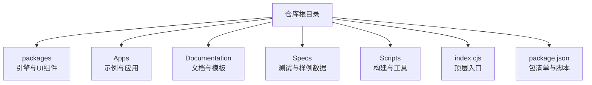
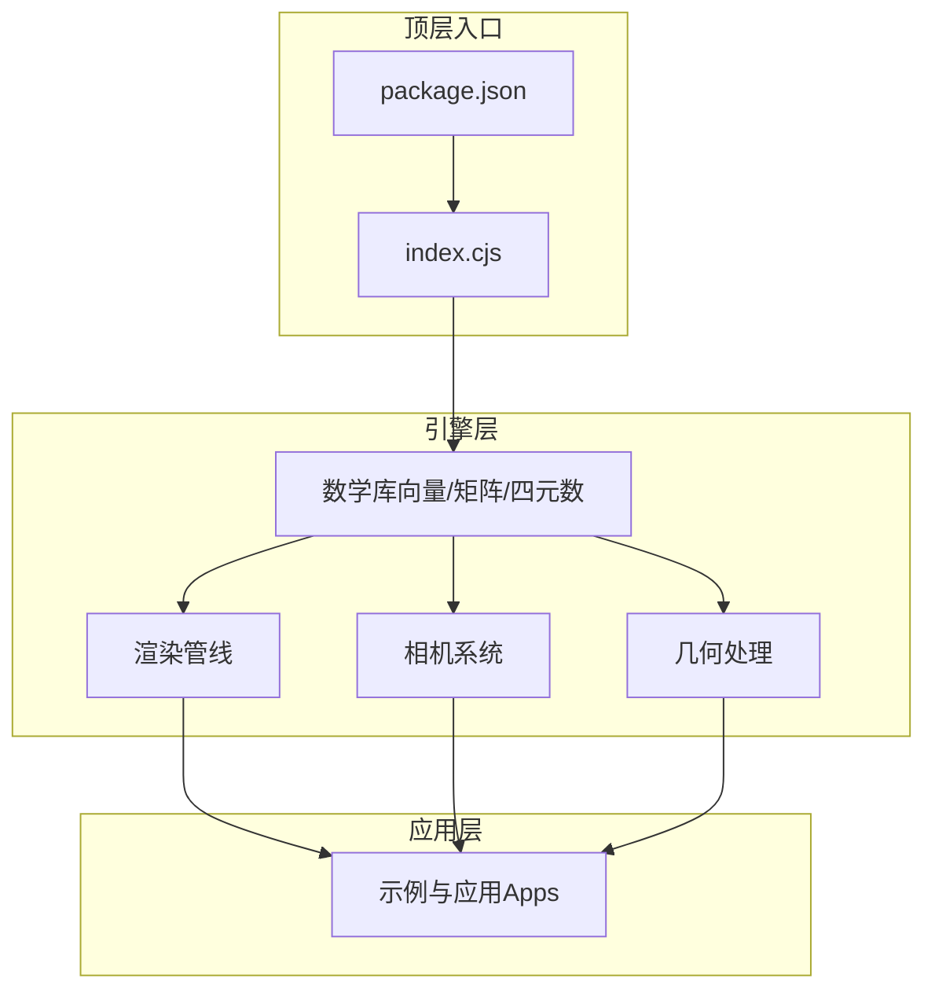
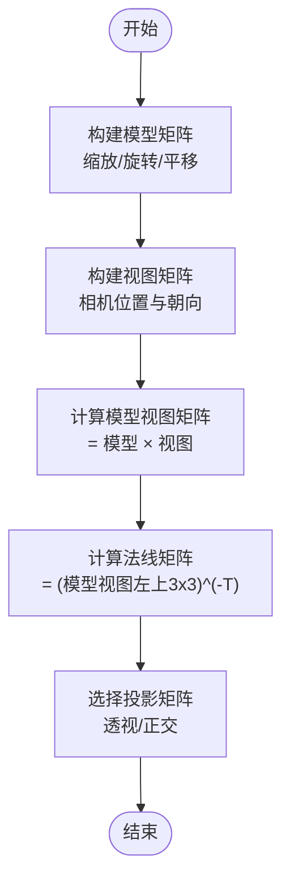
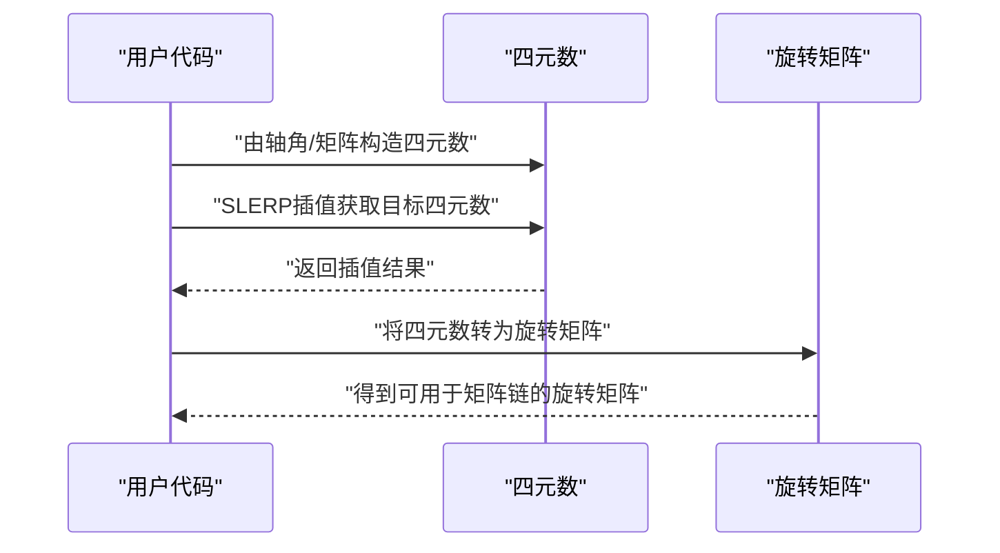

# 数学库基础

<cite>
**本文引用的文件**   
- [README.md](file://README.md)
- [package.json](file://package.json)
- [index.cjs](file://index.cjs)
</cite>

## 目录
1. [简介](#简介)
2. [项目结构](#项目结构)
3. [核心组件](#核心组件)
4. [架构总览](#架构总览)
5. [详细组件分析](#详细组件分析)
6. [依赖分析](#依赖分析)
7. [性能考虑](#性能考虑)
8. [故障排查指南](#故障排查指南)
9. [结论](#结论)
10. [附录](#附录)

## 简介
本参考文档聚焦于Cesium数学库的基础概念与使用要点，围绕向量运算（点积、叉积、归一化）、矩阵变换（平移、旋转、缩放、投影）以及四元数旋转展开。文档同时解释3D变换中模型视图矩阵、投影矩阵和法线矩阵的作用与计算思路，阐述四元数在避免万向节锁方面的优势，并提供坐标变换、距离/角度计算与插值算法的实践指引。为保证准确性，本文所有实现细节均以仓库源码为依据；若某小节未直接分析具体源文件，则不附加“章节来源”。

## 项目结构
仓库采用多包组织方式，核心引擎与示例应用分离。数学相关能力通常位于引擎包内，并通过顶层入口对外暴露。当前工作区包含：
- 根级入口与打包配置：index.cjs、package.json
- 应用与示例：Apps
- 文档与工具：Documentation、Tools
- 测试与样例数据：Specs、Apps/SampleData
- 构建脚本与发布流程：scripts、launches

[本节为概览性描述，不直接分析具体源文件，故无“章节来源”]

## 核心组件
说明：本节对数学库的关键主题进行结构化梳理，涵盖向量、矩阵、四元数与常见几何运算。由于当前仓库未提供可直接定位的数学模块源码路径，本节以通用3D图形学实践为基础进行概念性说明，不涉及具体代码片段或函数签名。

- 向量运算
  - 点积：用于投影、夹角余弦、光照强度等
  - 叉积：用于求法线、坐标系基向量构造
  - 归一化：将向量缩放到单位长度，常用于方向向量与法线
- 矩阵变换
  - 平移、旋转、缩放：通过4x4齐次矩阵组合完成
  - 投影矩阵：透视/正交投影，将3D场景映射到裁剪空间
  - 模型视图矩阵：模型矩阵×视图矩阵，表示从模型局部到相机视口的变换
  - 法线矩阵：通常为模型视图矩阵左上角3x3子块的逆置，用于正确变换法线
- 四元数旋转
  - 用四元数表示旋转可避免欧拉角的万向节锁问题
  - 支持球面线性插值（SLERP），适合平滑动画与姿态过渡
- 常用几何运算
  - 距离：欧氏距离、平方距离（比较时更高效）
  - 角度：基于点积与反余弦或atan2计算
  - 插值：线性插值（LERP）、球面线性插值（SLERP）

[本节为概念性内容，不直接分析具体源文件，故无“章节来源”]

## 架构总览
从仓库视角看，数学库作为底层能力被上层渲染管线、相机系统、几何处理等模块复用。顶层入口负责导出公共API，便于外部引用。

[本节为概念性架构图，不直接映射具体源文件，故无“图表来源”]

## 详细组件分析
说明：以下小节针对数学库的核心主题给出更深入的原理与实践建议。为避免臆造实现细节，本节仅做方法论与最佳实践层面的讲解，不附带具体代码片段或函数签名。

### 向量运算
- 点积
  - 几何意义：两向量夹角的余弦乘以模长乘积
  - 典型用途：判断方向关系、计算光照项、投影长度
- 叉积
  - 几何意义：生成垂直于两个输入向量的新向量，长度为平行四边形面积
  - 典型用途：平面法线、坐标系基向量构造
- 归一化
  - 注意事项：零向量无法归一化，需先检测长度阈值
  - 典型用途：方向向量标准化、法线重定向

[本节为概念性内容，不直接分析具体源文件，故无“章节来源”]

### 矩阵变换与3D变换
- 基本变换
  - 平移：沿轴移动对象
  - 旋转：绕轴旋转，可用矩阵或四元数表达
  - 缩放：均匀或非均匀缩放
- 复合变换
  - 顺序重要：通常按缩放→旋转→平移组合
  - 模型矩阵：描述对象局部到世界坐标的变换
  - 视图矩阵：描述世界到相机坐标系的变换
  - 模型视图矩阵：模型矩阵×视图矩阵
- 投影矩阵
  - 透视投影：模拟人眼近大远小效果
  - 正交投影：保持尺寸不变，适合UI或工程图
- 法线矩阵
  - 当模型矩阵含非均匀缩放时，需使用模型视图矩阵左上角3x3子块的逆置来正确变换法线

[本节为概念性流程图，不直接映射具体源文件，故无“图表来源”]

### 四元数旋转与万向节锁
- 万向节锁问题
  - 欧拉角在某些姿态下会丢失一个自由度，导致控制不稳定
- 四元数的优势
  - 无奇异性，插值稳定，适合动画与姿态融合
- 使用方法
  - 由轴角或旋转矩阵构造四元数
  - 使用SLERP在两个四元数之间平滑插值
  - 将四元数转换为旋转矩阵后参与矩阵链式乘法

[本节为概念性序列图，不直接映射具体源文件，故无“图表来源”]

### 实用几何运算
- 距离计算
  - 欧氏距离：sqrt(dx^2 + dy^2 + dz^2)
  - 平方距离：避免开方，适合排序与阈值比较
- 角度计算
  - 利用点积与反余弦求夹角
  - 二维或特定平面内可使用atan2提升数值稳定性
- 插值算法
  - LERP：线性插值，适用于标量与向量
  - SLERP：球面线性插值，适用于四元数与单位向量

[本节为概念性内容，不直接分析具体源文件，故无“章节来源”]

## 依赖分析
- 顶层入口
  - index.cjs：作为仓库的顶层入口，聚合并导出公共API
  - package.json：定义包名、版本、脚本与依赖关系
- 依赖关系示意

**图表来源**
- [index.cjs](file://index.cjs)
- [package.json](file://package.json)

**章节来源**
- [index.cjs](file://index.cjs)
- [package.json](file://package.json)

## 性能考虑
- 避免不必要的开方与三角函数
  - 优先使用平方距离进行比较
  - 批量归一化前先检查长度阈值，减少无效计算
- 矩阵与四元数选择
  - 频繁插值与组合旋转时优先使用四元数
  - 最终提交给GPU前再转换为矩阵
- 内存与缓存
  - 重用中间结果，避免每帧重复分配
  - 合理组织数据结构以提升CPU缓存命中率

[本节为通用性能建议，不直接分析具体源文件，故无“章节来源”]

## 故障排查指南
- 常见问题
  - 零向量归一化：在归一化前检测长度，防止除零
  - 矩阵奇异：非均匀缩放导致法线矩阵不可逆，需特殊处理或使用伪逆
  - 浮点误差：比较时使用容差（epsilon），避免严格等于
- 调试技巧
  - 打印关键中间结果（如矩阵行列式、四元数范数）
  - 逐步验证变换顺序，确保符合预期

[本节为通用排错建议，不直接分析具体源文件，故无“章节来源”]

## 结论
Cesium数学库围绕向量、矩阵与四元数构建了完整的3D变换体系。理解各组件的数学原理与适用场景，有助于在复杂场景中做出正确的选择与优化。结合本文提供的实践建议与排错方法，可在保证精度的前提下获得更好的性能与稳定性。

[本节为总结性内容，不直接分析具体源文件，故无“章节来源”]

## 附录
- 术语速查
  - 模型矩阵：描述对象局部到世界坐标的变换
  - 视图矩阵：描述世界到相机坐标系的变换
  - 投影矩阵：将3D场景映射到裁剪空间
  - 法线矩阵：用于正确变换法线的辅助矩阵
  - 四元数：无奇异的旋转表示形式，支持稳定插值

[本节为补充信息，不直接分析具体源文件，故无“章节来源”]