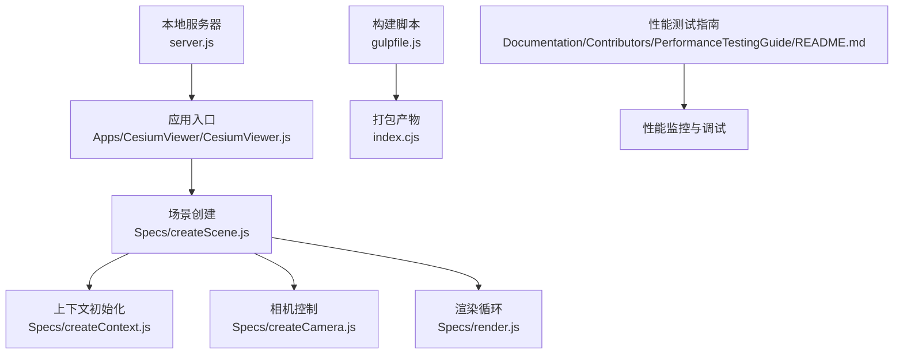
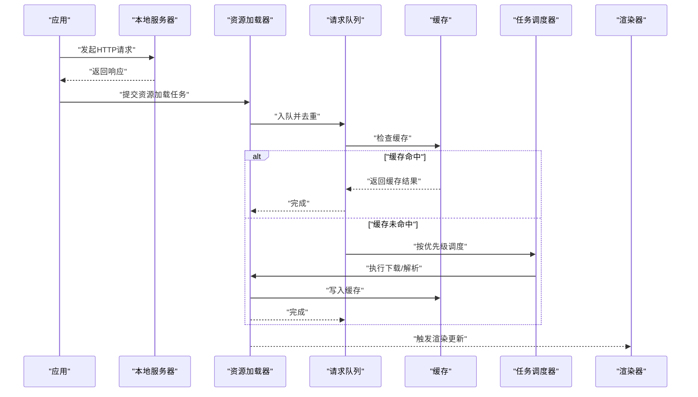
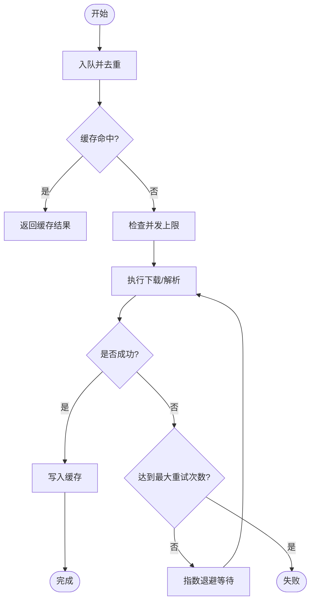
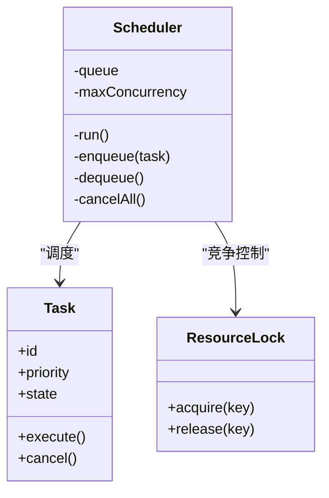
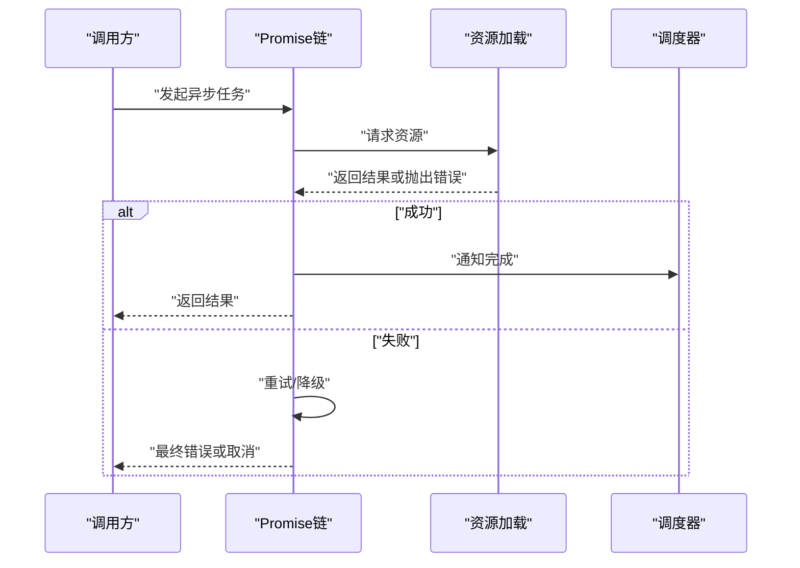
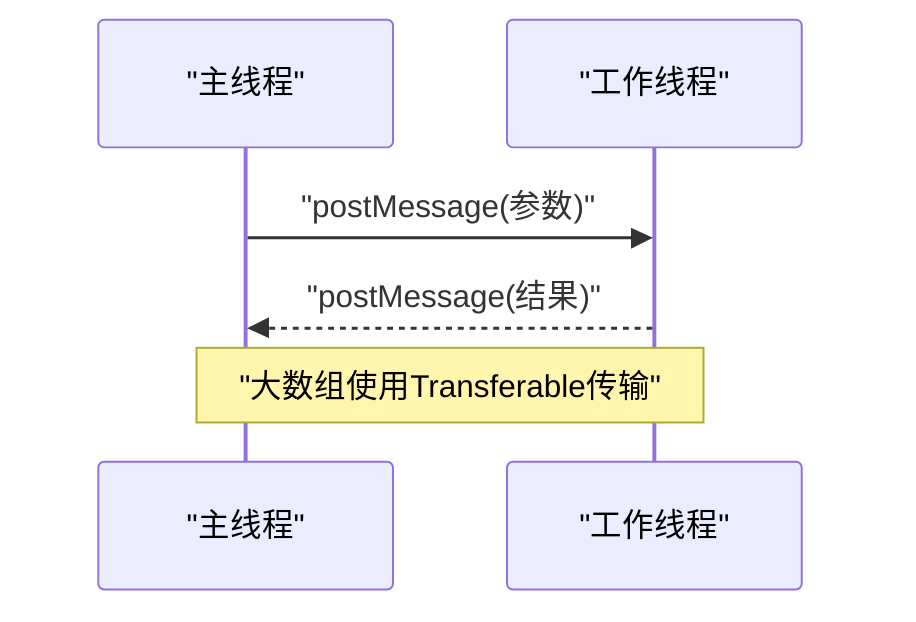
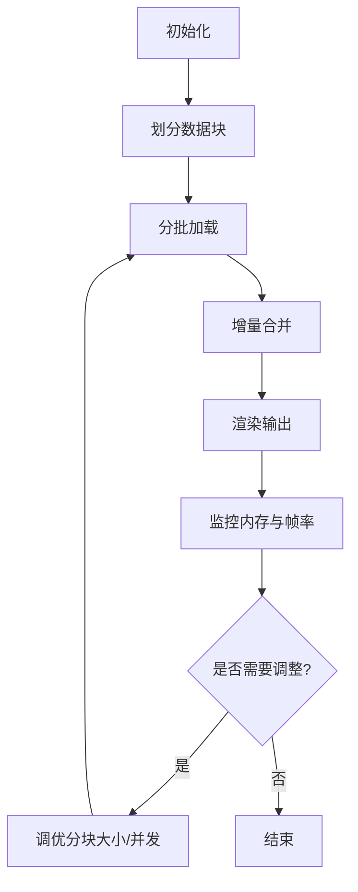
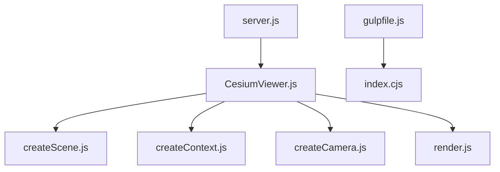

# 数据流模式

<cite>
**本文引用的文件**   
- [README.md](file://README.md)
- [package.json](file://package.json)
- [server.js](file://server.js)
- [gulpfile.js](file://gulpfile.js)
- [index.cjs](file://index.cjs)
- [Apps/CesiumViewer/CesiumViewer.js](file://Apps/CesiumViewer/CesiumViewer.js)
- [Apps/HelloWorld.html](file://Apps/HelloWorld.html)
- [Specs/createScene.js](file://Specs/createScene.js)
- [Specs/createContext.js](file://Specs/createContext.js)
- [Specs/createCamera.js](file://Specs/createCamera.js)
- [Specs/render.js](file://Specs/render.js)
- [Specs/runLater.js](file://Specs/runLater.js)
- [Specs/pollToPromise.js](file://Specs/pollToPromise.js)
- [Specs/pollWhilePromise.js](file://Specs/pollWhilePromise.js)
- [Specs/TestWorkers/returnByteLength.js](file://Specs/TestWorkers/returnByteLength.js)
- [Specs/TestWorkers/transferArrayBuffer.js](file://Specs/TestWorkers/transferArrayBuffer.js)
- [Specs/TestWorkers/throwError.js](file://Specs/TestWorkers/throwError.js)
- [Specs/TestWorkers/returnNonCloneable.js](file://Specs/TestWorkers/returnNonCloneable.js)
- [Specs/TestWorkers/returnParameters.js](file://Specs/TestWorkers/returnParameters.js)
- [Specs/TestWorkers/returnWasmConfig.js](file://Specs/TestWorkers/returnWasmConfig.js)
- [Specs/TerrainTileProcessor.js](file://Specs/TerrainTileProcessor.js)
- [Documentation/Contributors/PerformanceTestingGuide/README.md](file://Documentation/Contributors/PerformanceTestingGuide/README.md)
</cite>

## 目录
1. [简介](#简介)
2. [项目结构](#项目结构)
3. [核心组件](#核心组件)
4. [架构总览](#架构总览)
5. [详细组件分析](#详细组件分析)
6. [依赖分析](#依赖分析)
7. [性能考虑](#性能考虑)
8. [故障排查指南](#故障排查指南)
9. [结论](#结论)
10. [附录](#附录)

## 简介
本技术文档聚焦于Cesium的数据流模式，围绕资源加载生命周期、任务调度器设计、Promise异步编程模式、Web Worker使用模式以及大数据处理实践展开。文档旨在帮助读者理解从请求入队、缓存命中、错误重试到渲染落地的完整链路，并提供可操作的监控与调试建议。

## 项目结构
仓库采用多包与示例分离的组织方式：
- Source与packages为引擎与UI组件源码（本仓库中未直接展示具体实现文件）
- Apps包含示例应用与演示页面
- Specs提供测试用例、测试工具与Worker样例
- Documentation提供贡献与性能测试指南
- 构建脚本位于根目录与Tools下

图表来源
- [Apps/CesiumViewer/CesiumViewer.js](file://Apps/CesiumViewer/CesiumViewer.js)
- [Specs/createScene.js](file://Specs/createScene.js)
- [Specs/createContext.js](file://Specs/createContext.js)
- [Specs/createCamera.js](file://Specs/createCamera.js)
- [Specs/render.js](file://Specs/render.js)
- [server.js](file://server.js)
- [gulpfile.js](file://gulpfile.js)
- [index.cjs](file://index.cjs)
- [Documentation/Contributors/PerformanceTestingGuide/README.md](file://Documentation/Contributors/PerformanceTestingGuide/README.md)

章节来源
- [README.md](file://README.md)
- [package.json](file://package.json)
- [server.js](file://server.js)
- [gulpfile.js](file://gulpfile.js)
- [index.cjs](file://index.cjs)
- [Apps/CesiumViewer/CesiumViewer.js](file://Apps/CesiumViewer/CesiumViewer.js)
- [Apps/HelloWorld.html](file://Apps/HelloWorld.html)

## 核心组件
本节概述与数据流相关的关键模块及其职责：
- 资源加载与请求队列：负责将资源请求入队、去重、并发控制、缓存命中与失败重试
- 任务调度器：管理任务优先级、并发上限、资源竞争与取消
- Promise异步模式：链式调用、错误传播、取消信号与超时控制
- Web Worker：主线程与工作线程通信、结构化克隆与Transferable对象传输
- 大数据处理：分块加载、增量更新、内存优化策略
- 性能监控与调试：指标采集、日志输出、可视化面板

章节来源
- [Documentation/Contributors/PerformanceTestingGuide/README.md](file://Documentation/Contributors/PerformanceTestingGuide/README.md)

## 架构总览
下图展示了从应用启动到资源加载、任务调度、渲染输出的整体数据流。

图表来源
- [Apps/CesiumViewer/CesiumViewer.js](file://Apps/CesiumViewer/CesiumViewer.js)
- [Specs/createScene.js](file://Specs/createScene.js)
- [Specs/render.js](file://Specs/render.js)
- [server.js](file://server.js)

## 详细组件分析

### 资源加载生命周期管理
- 请求入队与去重：相同URL或资源的请求在入队阶段进行合并，避免重复网络开销
- 并发控制：通过全局或域名的并发上限限制同时进行的请求数量
- 缓存策略：支持内存缓存与可选的持久化缓存；命中时直接返回，未命中则走下载流程
- 错误重试：对瞬时错误（如网络抖动、服务端限流）实施指数退避重试，设置最大重试次数与超时时间
- 生命周期钩子：提供开始、成功、失败、取消等事件回调，便于监控与统计

章节来源
- [Documentation/Contributors/PerformanceTestingGuide/README.md](file://Documentation/Contributors/PerformanceTestingGuide/README.md)

### 任务调度器设计原理
- 任务优先级：根据可见性、几何误差、用户交互等因素计算优先级，优先调度高价值任务
- 并发控制：基于令牌桶或滑动窗口算法限制并发度，防止CPU与I/O过载
- 资源竞争处理：对共享资源（如纹理、缓冲区）加锁或序列化访问，避免竞态条件
- 取消机制：支持任务级取消与批量取消，及时释放已分配资源
- 背压策略：当渲染帧率下降时自动降低任务吞吐，保障交互流畅

图表来源
- [Documentation/Contributors/PerformanceTestingGuide/README.md](file://Documentation/Contributors/PerformanceTestingGuide/README.md)

### Promise异步编程模式
- 链式调用：通过then/catch/finally组织异步流程，确保错误向上传播
- 错误处理：统一错误类型与消息，结合重试与降级策略
- 取消机制：引入AbortController或自定义取消信号，中断长时间运行的Promise
- 超时控制：包装Promise以超时拒绝，避免悬挂任务
- 组合模式：all/any/race等组合方法用于协调多个异步任务

章节来源
- [Specs/pollToPromise.js](file://Specs/pollToPromise.js)
- [Specs/pollWhilePromise.js](file://Specs/pollWhilePromise.js)
- [Specs/runLater.js](file://Specs/runLater.js)

### Web Worker使用模式
- 主线程与工作线程通信：通过postMessage发送消息，onmessage接收响应
- 数据结构传递：使用结构化克隆传递普通对象；大数组使用Transferable对象提升性能
- 错误处理：工作线程抛出的异常需捕获并转换为消息回传主线程
- 内存共享：谨慎使用SharedArrayBuffer，注意同步原语与浏览器安全上下文要求
- 典型用例：地形瓦片处理、模型解析、图像解码等耗时操作

图表来源
- [Specs/TestWorkers/returnByteLength.js](file://Specs/TestWorkers/returnByteLength.js)
- [Specs/TestWorkers/transferArrayBuffer.js](file://Specs/TestWorkers/transferArrayBuffer.js)
- [Specs/TestWorkers/throwError.js](file://Specs/TestWorkers/throwError.js)
- [Specs/TestWorkers/returnNonCloneable.js](file://Specs/TestWorkers/returnNonCloneable.js)
- [Specs/TestWorkers/returnParameters.js](file://Specs/TestWorkers/returnParameters.js)
- [Specs/TestWorkers/returnWasmConfig.js](file://Specs/TestWorkers/returnWasmConfig.js)

章节来源
- [Specs/TestWorkers/returnByteLength.js](file://Specs/TestWorkers/returnByteLength.js)
- [Specs/TestWorkers/transferArrayBuffer.js](file://Specs/TestWorkers/transferArrayBuffer.js)
- [Specs/TestWorkers/throwError.js](file://Specs/TestWorkers/throwError.js)
- [Specs/TestWorkers/returnNonCloneable.js](file://Specs/TestWorkers/returnNonCloneable.js)
- [Specs/TestWorkers/returnParameters.js](file://Specs/TestWorkers/returnParameters.js)
- [Specs/TestWorkers/returnWasmConfig.js](file://Specs/TestWorkers/returnWasmConfig.js)

### 大数据处理实践
- 分块加载：将大型数据集切分为小块，按需加载与渲染，降低首屏压力
- 增量更新：监听数据源变更，仅拉取差异部分并合并到现有视图
- 内存优化：使用TypedArray、对象池、弱引用与及时释放；避免不必要的深拷贝
- 可视化管理：提供进度条、占位符与降级显示，提升用户体验

章节来源
- [Specs/TerrainTileProcessor.js](file://Specs/TerrainTileProcessor.js)
- [Documentation/Contributors/PerformanceTestingGuide/README.md](file://Documentation/Contributors/PerformanceTestingGuide/README.md)

## 依赖分析
- 应用层依赖：示例应用依赖场景、上下文、相机与渲染模块
- 构建与运行：本地服务器用于静态资源服务，构建脚本生成打包产物
- 测试与工具：测试用例覆盖Promise辅助函数与Worker行为

图表来源
- [Apps/CesiumViewer/CesiumViewer.js](file://Apps/CesiumViewer/CesiumViewer.js)
- [Specs/createScene.js](file://Specs/createScene.js)
- [Specs/createContext.js](file://Specs/createContext.js)
- [Specs/createCamera.js](file://Specs/createCamera.js)
- [Specs/render.js](file://Specs/render.js)
- [server.js](file://server.js)
- [gulpfile.js](file://gulpfile.js)
- [index.cjs](file://index.cjs)

章节来源
- [Apps/CesiumViewer/CesiumViewer.js](file://Apps/CesiumViewer/CesiumViewer.js)
- [Specs/createScene.js](file://Specs/createScene.js)
- [Specs/createContext.js](file://Specs/createContext.js)
- [Specs/createCamera.js](file://Specs/createCamera.js)
- [Specs/render.js](file://Specs/render.js)
- [server.js](file://server.js)
- [gulpfile.js](file://gulpfile.js)
- [index.cjs](file://index.cjs)

## 性能考虑
- 合理设置并发上限与优先级，避免资源争用导致卡顿
- 启用缓存与去重，减少重复网络请求与解析开销
- 使用Transferable对象传输大数组，降低复制成本
- 监控帧率与内存占用，动态调整任务吞吐与分块大小
- 对关键路径添加计时与日志，定位瓶颈

章节来源
- [Documentation/Contributors/PerformanceTestingGuide/README.md](file://Documentation/Contributors/PerformanceTestingGuide/README.md)

## 故障排查指南
- 常见错误类型：网络超时、权限跨域、Worker不可用、结构化克隆失败
- 定位步骤：
  - 检查网络请求状态码与响应体
  - 查看控制台错误堆栈与Worker日志
  - 验证Transferable对象是否可转移
  - 确认AbortController是否正确取消任务
- 恢复策略：
  - 重试与降级：对瞬时错误实施重试，失败时回退到低分辨率或占位数据
  - 资源清理：取消未完成的任务，释放已分配的缓冲与纹理
  - 隔离问题：将复杂逻辑迁移至Worker，避免阻塞主线程

章节来源
- [Specs/TestWorkers/throwError.js](file://Specs/TestWorkers/throwError.js)
- [Specs/TestWorkers/returnNonCloneable.js](file://Specs/TestWorkers/returnNonCloneable.js)
- [Specs/TestWorkers/transferArrayBuffer.js](file://Specs/TestWorkers/transferArrayBuffer.js)

## 结论
Cesium的数据流模式围绕“请求入队—缓存—调度—渲染”的主线展开，通过优先级与并发控制保证系统稳定性，借助Promise与Worker提升异步与并行能力。配合分块加载与增量更新，可在大数据场景下维持良好性能与用户体验。完善的监控与调试手段有助于快速定位与解决问题。

## 附录
- 示例页面：HelloWorld.html可用于快速验证基础功能
- 本地开发：使用server.js启动静态服务器，便于调试资源加载与Worker通信

章节来源
- [Apps/HelloWorld.html](file://Apps/HelloWorld.html)
- [server.js](file://server.js)