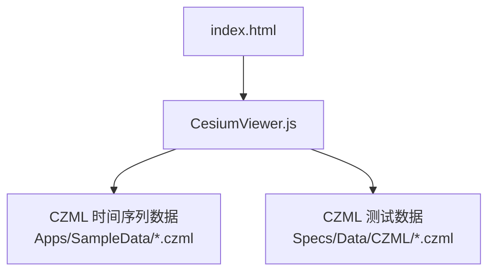
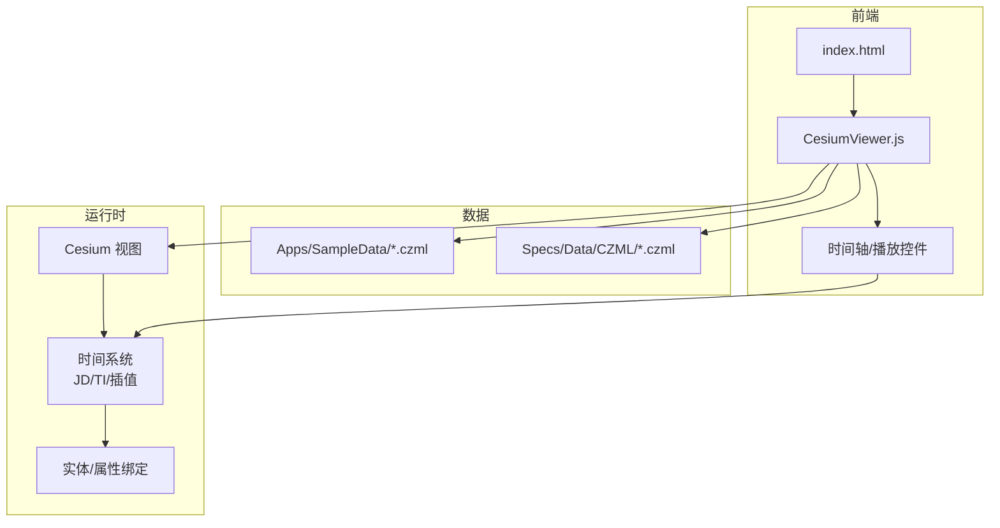
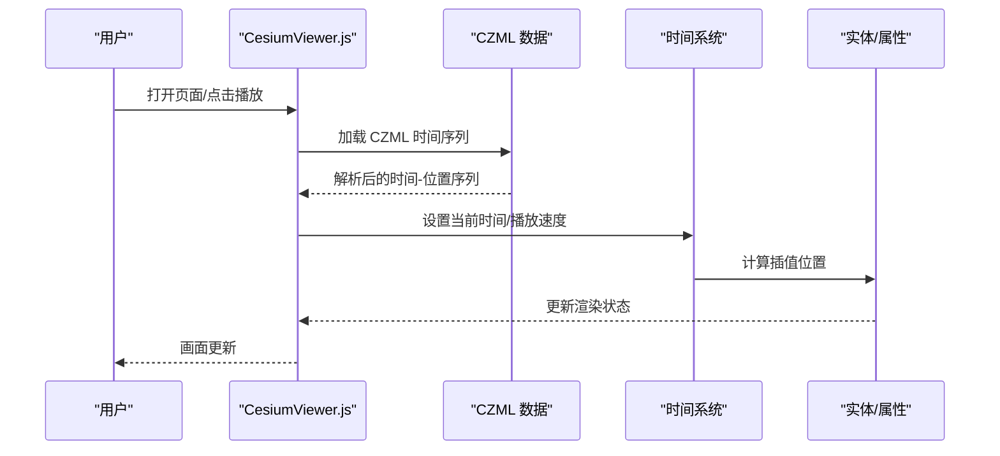
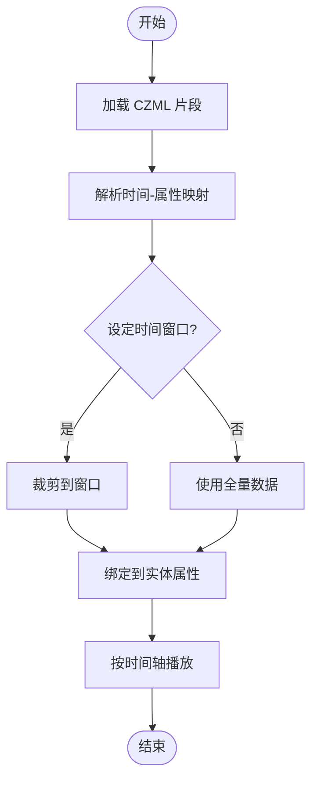
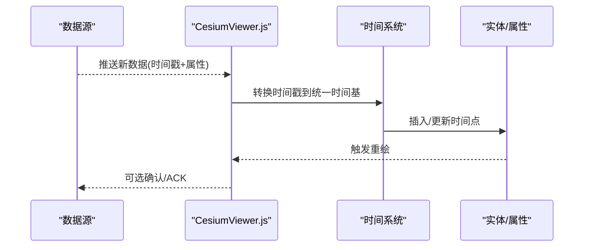
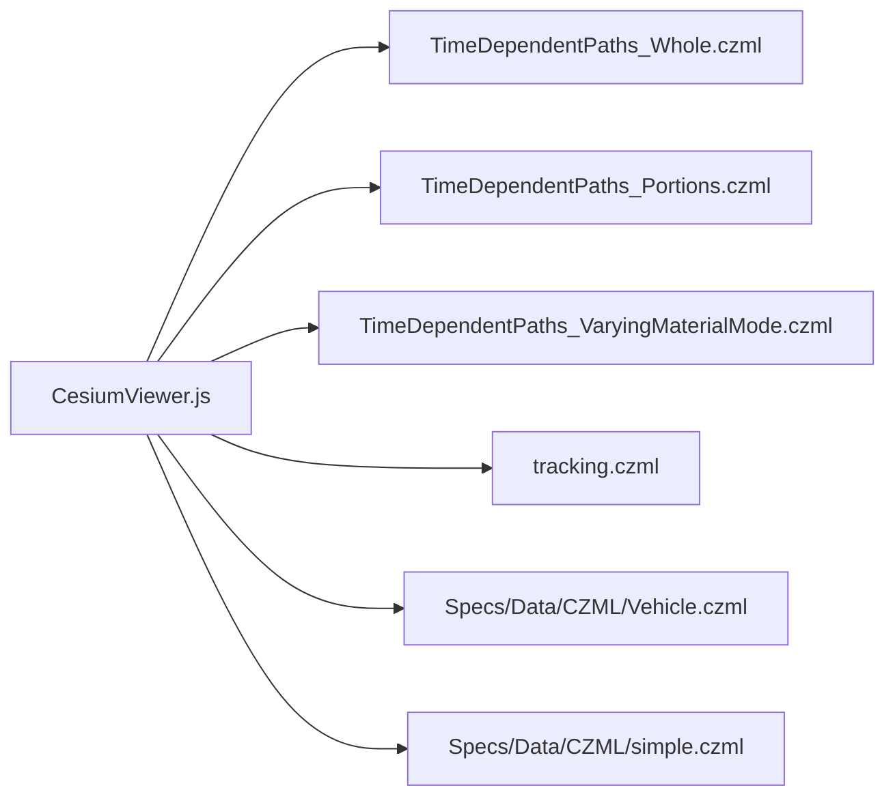

# 时间管理系统

<cite>
**本文引用的文件**   
- [README.md](file://README.md)
- [index.html](file://index.html)
- [Apps/CesiumViewer/CesiumViewer.js](file://Apps/CesiumViewer/CesiumViewer.js)
- [Apps/SampleData/TimeDependentPaths_Whole.czml](file://Apps/SampleData/TimeDependentPaths_Whole.czml)
- [Apps/SampleData/TimeDependentPaths_Portions.czml](file://Apps/SampleData/TimeDependentPaths_Portions.czml)
- [Apps/SampleData/TimeDependentPaths_VaryingMaterialMode.czml](file://Apps/SampleData/TimeDependentPaths_VaryingMaterialMode.czml)
- [Apps/SampleData/tracking.czml](file://Apps/SampleData/tracking.czml)
- [Specs/Data/CZML/Vehicle.czml](file://Specs/Data/CZML/Vehicle.czml)
- [Specs/Data/CZML/simple.czml](file://Specs/Data/CZML/simple.czml)
</cite>

## 目录
1. [简介](#简介)
2. [项目结构](#项目结构)
3. [核心组件](#核心组件)
4. [架构总览](#架构总览)
5. [详细组件分析](#详细组件分析)
6. [依赖分析](#依赖分析)
7. [性能考虑](#性能考虑)
8. [故障排查指南](#故障排查指南)
9. [结论](#结论)
10. [附录](#附录) 

## 简介
本技术文档围绕 Cesium 的时间管理系统展开，重点覆盖以下主题：
- 儒略日（Julian Date）的概念、计算方法及其在天文计算中的应用
- 时间间隔（TimeInterval）的定义、查询与操作接口
- 时间动态属性的实现机制，包括插值算法与数据绑定方式
- 时间范围查询、时间动画控制与时间同步机制
- 时间序列数据处理实战示例：轨迹动画、历史数据回放、实时数据更新
- 时区处理、日期格式化与性能优化建议

为便于读者理解，文档在概念层面向非专业读者提供循序渐进的说明，并在需要时给出与源码相关的“章节来源”和“图示来源”。

## 项目结构
仓库采用多包与示例分离的组织方式。与时间系统直接相关的关键位置包括：
- 应用入口与演示页面：index.html、Apps/CesiumViewer/CesiumViewer.js
- CZML 时间序列样例：Apps/SampleData/*.czml、Specs/Data/CZML/*.czml

**图示来源** 
- [index.html](file://index.html)
- [Apps/CesiumViewer/CesiumViewer.js](file://Apps/CesiumViewer/CesiumViewer.js)
- [Apps/SampleData/TimeDependentPaths_Whole.czml](file://Apps/SampleData/TimeDependentPaths_Whole.czml)
- [Specs/Data/CZML/Vehicle.czml](file://Specs/Data/CZML/Vehicle.czml)

**章节来源**
- [README.md](file://README.md)
- [index.html](file://index.html)
- [Apps/CesiumViewer/CesiumViewer.js](file://Apps/CesiumViewer/CesiumViewer.js)

## 核心组件
本节从概念与使用层面梳理时间系统的核心能力，帮助读者建立整体认知。

- 儒略日（Julian Date, JD）
  - 定义：自公元前 4713 年 1 月 1 日正午起连续计数的天数，常用于天文计算中统一时间尺度。
  - 用途：消除历法差异带来的边界问题，便于进行长时间跨度的数学运算（如轨道传播、星历表）。
  - 转换要点：公历到儒略日的转换需考虑闰年规则与小数部分（以天为单位的小数表示时刻）。

- 时间间隔（TimeInterval）
  - 定义：由起始时间与结束时间界定的时间段，支持包含/不包含端点的语义。
  - 常用操作：判断某时刻是否属于区间、合并/分割区间、查询重叠区间等。
  - 典型场景：属性有效窗口、可见性控制、采样窗口选择。

- 时间动态属性
  - 概念：属性值随时间变化，通过“时间点-属性值”或“时间段-插值函数”描述。
  - 插值策略：线性、样条、四元数球面线性插值（Slerp）等，依据数据类型选择合适方法。
  - 数据绑定：将时间轴与渲染管线中的属性（位置、颜色、材质等）绑定，驱动可视化更新。

- 时间范围查询与动画控制
  - 范围查询：根据当前时间快速定位对应属性快照或插值结果。
  - 动画控制：播放/暂停、倍速、循环、跳转至指定时刻。
  - 同步机制：确保多个图层/实体在同一时间基准下保持一致。

- 实战示例
  - 轨迹动画：基于时间戳序列驱动点/线移动。
  - 历史回放：加载历史 CZML 数据，按时间轴回放。
  - 实时更新：订阅流式数据源，增量更新属性并平滑过渡。

[本节为概念性概述，不直接分析具体源码文件]

## 架构总览
下图展示时间系统在应用层面的总体交互关系：页面入口加载 Cesium 视图，解析 CZML 时间序列数据，驱动实体属性随时间变化，并通过 UI 控件控制时间轴播放。

**图示来源** 
- [index.html](file://index.html)
- [Apps/CesiumViewer/CesiumViewer.js](file://Apps/CesiumViewer/CesiumViewer.js)
- [Apps/SampleData/TimeDependentPaths_Whole.czml](file://Apps/SampleData/TimeDependentPaths_Whole.czml)
- [Specs/Data/CZML/Vehicle.czml](file://Specs/Data/CZML/Vehicle.czml)

## 详细组件分析

### 儒略日（Julian Date）与天文计算
- 概念与意义
  - 儒略日为连续时间尺度，避免公历闰年与月份长度不一致导致的边界问题。
  - 天文计算中广泛用于星历表、轨道积分、观测时间归算等。
- 计算方法（思路）
  - 输入：公历年、月、日、时、分、秒（含小数秒）。
  - 步骤：
    - 调整年份与月份（若月份≤2则视为上一年13/14月）。
    - 计算整数日与小数日两部分。
    - 累加常数偏移得到儒略日。
  - 输出：浮点数（天），小数部分表示一天内的时刻。
- 精度与误差
  - 双精度浮点可满足大多数地球科学应用；极高精度需求可引入更精细的 UT1/TAI 修正。
- 常见陷阱
  - 时区与 UTC 混淆：儒略日通常基于 UTC。
  - 负时间（公元前）与边界条件处理。

[本节为通用知识说明，不直接分析具体源码文件]

### 时间间隔（TimeInterval）接口与行为
- 基本定义
  - 由 start 与 stop 界定，支持 open/closed 端点语义。
- 常用操作
  - contains(time)：判断时刻是否在区间内。
  - intersects(other)：判断两区间是否相交。
  - merge()/subtract()：合并或差集运算。
  - getInterpolatedProperty(time)：在区间内对属性进行插值。
- 复杂度与性能
  - 单区间判定 O(1)。
  - 批量查询可通过排序+二分查找降至 O(log n)。
- 典型用法
  - 控制属性生效窗口、裁剪无效数据段、构建时间索引。

[本节为通用知识说明，不直接分析具体源码文件]

### 时间动态属性与插值算法
- 数据模型
  - 时间点列表 + 对应属性值，或时间段 + 插值器。
- 插值策略
  - 标量/向量：线性、分段线性、样条。
  - 方向/姿态：四元数球面线性插值（Slerp）保证旋转连续性。
  - 颜色/材质：逐通道线性或带缓动的曲线。
- 数据绑定
  - 将时间轴与实体属性（position、orientation、color 等）绑定，每帧根据 currentTime 计算目标值。
- 性能优化
  - 预计算关键帧、缓存最近一次插值结果、按需刷新。

[本节为通用知识说明，不直接分析具体源码文件]

### 时间范围查询、动画控制与同步
- 范围查询
  - 给定时间范围 [t0, t1]，返回该范围内所有有效片段与属性快照。
- 动画控制
  - 播放/暂停、倍速、循环、跳转到指定时刻。
  - 与渲染循环同步，确保帧率稳定与时间推进一致。
- 同步机制
  - 多实体共享同一时钟源，避免漂移。
  - 外部数据源（WebSocket/轮询）与内部时钟对齐，必要时做速率限制与去抖。

[本节为通用知识说明，不直接分析具体源码文件]

### 实战示例一：轨迹动画（基于 CZML）
- 数据准备
  - 使用 CZML 定义时间戳与位置序列，形成轨迹。
- 流程
  - 加载 CZML → 解析时间序列 → 绑定到实体位置属性 → 驱动动画。
- 参考样例
  - Apps/SampleData/TimeDependentPaths_Whole.czml
  - Apps/SampleData/TimeDependentPaths_Portions.czml
  - Apps/SampleData/TimeDependentPaths_VaryingMaterialMode.czml

**图示来源** 
- [Apps/CesiumViewer/CesiumViewer.js](file://Apps/CesiumViewer/CesiumViewer.js)
- [Apps/SampleData/TimeDependentPaths_Whole.czml](file://Apps/SampleData/TimeDependentPaths_Whole.czml)
- [Apps/SampleData/TimeDependentPaths_Portions.czml](file://Apps/SampleData/TimeDependentPaths_Portions.czml)
- [Apps/SampleData/TimeDependentPaths_VaryingMaterialMode.czml](file://Apps/SampleData/TimeDependentPaths_VaryingMaterialMode.czml)

**章节来源**
- [Apps/CesiumViewer/CesiumViewer.js](file://Apps/CesiumViewer/CesiumViewer.js)
- [Apps/SampleData/TimeDependentPaths_Whole.czml](file://Apps/SampleData/TimeDependentPaths_Whole.czml)
- [Apps/SampleData/TimeDependentPaths_Portions.czml](file://Apps/SampleData/TimeDependentPaths_Portions.czml)
- [Apps/SampleData/TimeDependentPaths_VaryingMaterialMode.czml](file://Apps/SampleData/TimeDependentPaths_VaryingMaterialMode.czml)

### 实战示例二：历史数据回放（CZML 片段）
- 目标
  - 回放一段时间内的历史轨迹或事件。
- 关键点
  - 使用片段化 CZML（portions）提升加载效率。
  - 合理设置时间窗口与采样频率，避免卡顿。
- 参考样例
  - Apps/SampleData/TimeDependentPaths_Portions.czml

**图示来源** 
- [Apps/SampleData/TimeDependentPaths_Portions.czml](file://Apps/SampleData/TimeDependentPaths_Portions.czml)

**章节来源**
- [Apps/SampleData/TimeDependentPaths_Portions.czml](file://Apps/SampleData/TimeDependentPaths_Portions.czml)

### 实战示例三：实时数据更新（流式接入）
- 目标
  - 接收实时数据（如 WebSocket），增量更新属性并保持动画流畅。
- 关键点
  - 时间对齐：将服务器时间转换为统一时间基准（UTC/儒略日）。
  - 平滑过渡：使用插值避免跳变。
  - 节流与去抖：控制更新频率，降低 CPU/GPU 压力。
- 参考样例
  - Apps/SampleData/tracking.czml（可作为时间序列模板）

**图示来源** 
- [Apps/SampleData/tracking.czml](file://Apps/SampleData/tracking.czml)

**章节来源**
- [Apps/SampleData/tracking.czml](file://Apps/SampleData/tracking.czml)

### 时区处理与日期格式化
- 时区处理
  - 统一使用 UTC 作为内部时间基准，显示时再转换为目标时区。
  - 注意夏令时切换与闰秒的影响（高精度场景）。
- 日期格式化
  - 输入：ISO 8601、Unix 时间戳、本地字符串。
  - 输出：可读格式（YYYY-MM-DD HH:mm:ss）与机器可读格式（UTC/儒略日）。
- 最佳实践
  - 明确标注时区信息，避免歧义。
  - 在日志与调试输出中包含 UTC 与本地时间对照。

[本节为通用知识说明，不直接分析具体源码文件]

## 依赖分析
时间系统与 CZML 数据之间的依赖关系如下：

**图示来源** 
- [Apps/CesiumViewer/CesiumViewer.js](file://Apps/CesiumViewer/CesiumViewer.js)
- [Apps/SampleData/TimeDependentPaths_Whole.czml](file://Apps/SampleData/TimeDependentPaths_Whole.czml)
- [Apps/SampleData/TimeDependentPaths_Portions.czml](file://Apps/SampleData/TimeDependentPaths_Portions.czml)
- [Apps/SampleData/TimeDependentPaths_VaryingMaterialMode.czml](file://Apps/SampleData/TimeDependentPaths_VaryingMaterialMode.czml)
- [Apps/SampleData/tracking.czml](file://Apps/SampleData/tracking.czml)
- [Specs/Data/CZML/Vehicle.czml](file://Specs/Data/CZML/Vehicle.czml)
- [Specs/Data/CZML/simple.czml](file://Specs/Data/CZML/simple.czml)

**章节来源**
- [Apps/CesiumViewer/CesiumViewer.js](file://Apps/CesiumViewer/CesiumViewer.js)
- [Apps/SampleData/TimeDependentPaths_Whole.czml](file://Apps/SampleData/TimeDependentPaths_Whole.czml)
- [Apps/SampleData/TimeDependentPaths_Portions.czml](file://Apps/SampleData/TimeDependentPaths_Portions.czml)
- [Apps/SampleData/TimeDependentPaths_VaryingMaterialMode.czml](file://Apps/SampleData/TimeDependentPaths_VaryingMaterialMode.czml)
- [Apps/SampleData/tracking.czml](file://Apps/SampleData/tracking.czml)
- [Specs/Data/CZML/Vehicle.czml](file://Specs/Data/CZML/Vehicle.czml)
- [Specs/Data/CZML/simple.czml](file://Specs/Data/CZML/simple.czml)

## 性能考虑
- 数据侧
  - 使用片段化 CZML 与时间窗口裁剪，减少内存占用与解析开销。
  - 对高频数据采用降采样或关键帧压缩。
- 计算侧
  - 插值结果缓存与惰性求值，避免重复计算。
  - 批量更新属性，减少渲染调用次数。
- 渲染侧
  - 控制每帧更新数量，必要时使用离屏缓冲或异步任务。
  - 合理设置视锥剔除与 LOD，降低绘制负担。
- 网络侧
  - 对实时数据源进行节流与去抖，避免突发流量导致卡顿。

[本节为通用指导，不直接分析具体源码文件]

## 故障排查指南
- 常见问题
  - 时间不同步：检查各数据源的时区与 UTC 转换是否正确。
  - 插值异常：确认相邻时间点顺序与数据类型匹配（如四元数需单位化）。
  - 回放卡顿：评估数据量与采样频率，启用片段化与缓存。
- 定位手段
  - 在关键路径打印时间戳与插值结果，对比预期。
  - 使用浏览器开发者工具的性能面板分析热点。
- 修复建议
  - 统一时间基准，增加边界校验与容错逻辑。
  - 对异常数据点进行过滤或回退到上一有效值。

[本节为通用指导，不直接分析具体源码文件]

## 结论
Cesium 的时间管理系统以儒略日为统一时间尺度，结合时间间隔与动态属性插值，实现了高效、灵活的时间驱动可视化。通过 CZML 数据模型与示例工程，可以快速构建轨迹动画、历史回放与实时更新的场景。遵循统一的时区策略、合理的插值与缓存策略，可在保证精度的同时获得良好的性能表现。

[本节为总结性内容，不直接分析具体源码文件]

## 附录
- 术语
  - 儒略日（JD）、时间间隔（TimeInterval）、插值（Interpolation）、CZML
- 参考样例清单
  - 完整轨迹：Apps/SampleData/TimeDependentPaths_Whole.czml
  - 片段化轨迹：Apps/SampleData/TimeDependentPaths_Portions.czml
  - 材质变化轨迹：Apps/SampleData/TimeDependentPaths_VaryingMaterialMode.czml
  - 跟踪数据模板：Apps/SampleData/tracking.czml
  - 测试数据：Specs/Data/CZML/Vehicle.czml、Specs/Data/CZML/simple.czml

[本节为补充信息，不直接分析具体源码文件]