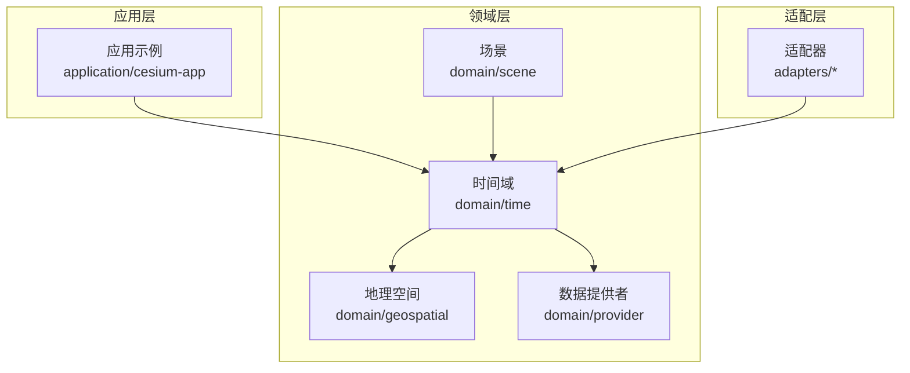
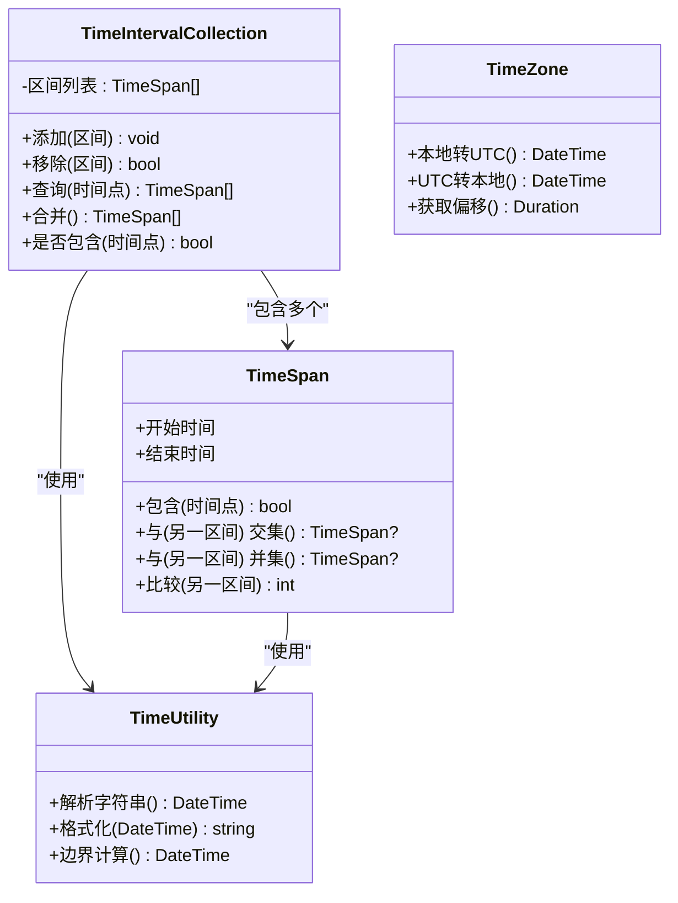
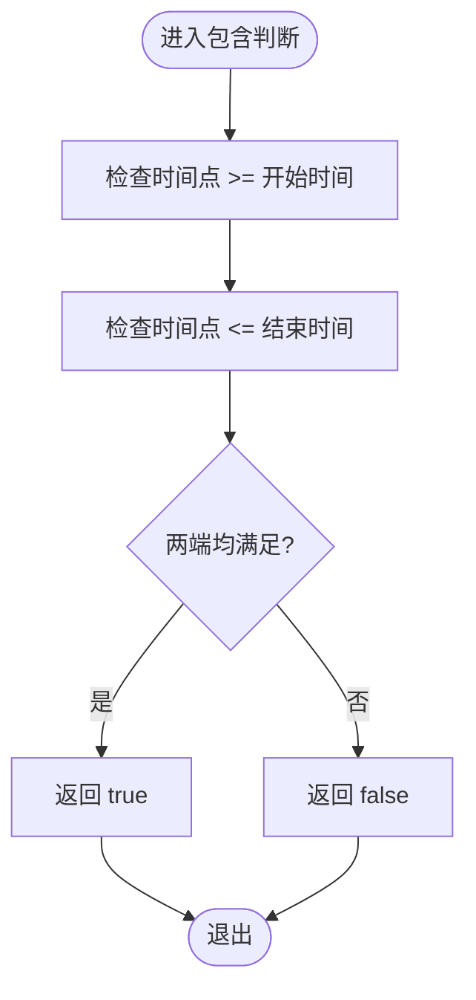
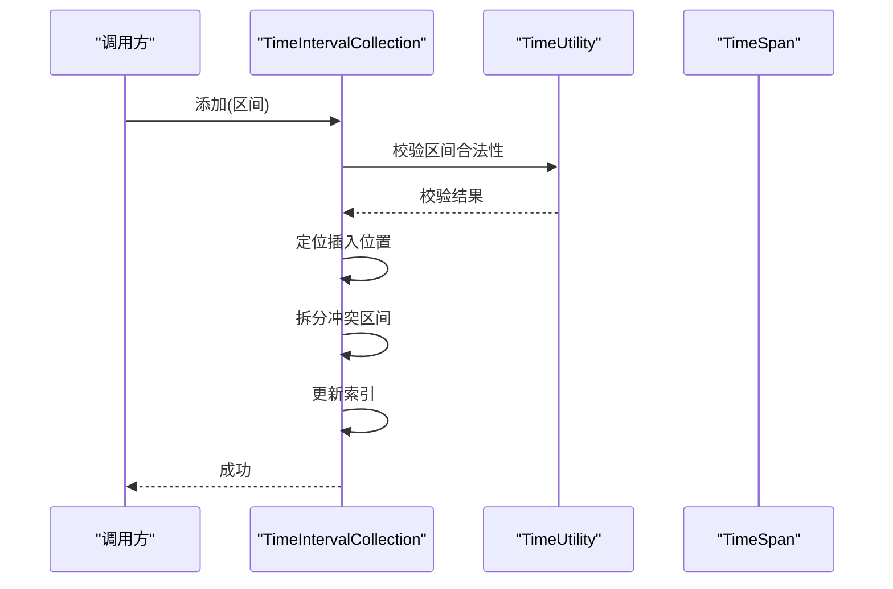
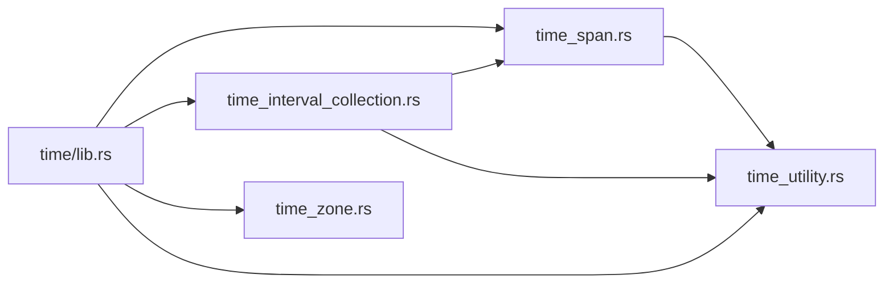

# 时间区间集合

<cite>
**本文引用的文件**   
- [README.md](file://README.md)
- [package.json](file://package.json)
- [cesiumrust/README.md](file://cesiumrust/README.md)
- [cesiumrust/Cargo.toml](file://cesiumrust/Cargo.toml)
- [cesiumrust/domain/time/src/lib.rs](file://cesiumrust/domain/time/src/lib.rs)
- [cesiumrust/domain/time/src/time_interval.rs](file://cesiumrust/domain/time/src/time_interval.rs)
- [cesiumrust/domain/time/src/time_interval_collection.rs](file://cesiumrust/domain/time/src/time_interval_collection.rs)
- [cesiumrust/domain/time/src/time_span.rs](file://cesiumrust/domain/time/src/time_span.rs)
- [cesiumrust/domain/time/src/time_zone.rs](file://cesiumrust/domain/time/src/time_zone.rs)
- [cesiumrust/domain/time/src/time_utility.rs](file://cesiumrust/domain/time/src/time_utility.rs)
</cite>

## 目录
1. [简介](#简介)
2. [项目结构](#项目结构)
3. [核心组件](#核心组件)
4. [架构总览](#架构总览)
5. [详细组件分析](#详细组件分析)
6. [依赖关系分析](#依赖关系分析)
7. [性能考量](#性能考量)
8. [故障排查指南](#故障排查指南)
9. [结论](#结论)
10. [附录](#附录)

## 简介
本文件聚焦于“时间区间集合”能力，围绕Cesium Rust仓库中的时间域模块进行系统化说明。内容涵盖系统架构、组件职责、数据流与处理逻辑、集成点、错误处理与性能特征，并提供可视化图示与排障建议，帮助读者快速理解并正确使用时间区间集合功能。

## 项目结构
该仓库包含前端示例与应用（Apps）、文档（Documentation）、测试（Specs）、构建脚本（scripts）以及Rust核心实现（cesiumrust）。与“时间区间集合”直接相关的代码位于 cesiumrust/domain/time 子模块中，提供时间区间、时间区间集合、时间跨度、时区与工具函数等基础能力。

图表来源
- [cesiumrust/README.md](file://cesiumrust/README.md)
- [cesiumrust/Cargo.toml](file://cesiumrust/Cargo.toml)

章节来源
- [README.md](file://README.md)
- [package.json](file://package.json)
- [cesiumrust/README.md](file://cesiumrust/README.md)
- [cesiumrust/Cargo.toml](file://cesiumrust/Cargo.toml)

## 核心组件
- 时间区间（TimeSpan）：表示一个有起点和终点的时间段，支持比较、包含判断、交集/并集计算等。
- 时间区间集合（TimeIntervalCollection）：维护一组不重叠且有序的时间区间，提供添加、移除、查询、合并等操作。
- 时区（TimeZone）：用于将本地时间与UTC或特定时区时间相互转换。
- 时间工具（TimeUtility）：提供日期解析、格式化、边界计算等通用方法。

这些组件共同构成时间区间集合的基础设施，确保在渲染、动画、数据加载等场景中能够高效、准确地管理时间维度。

章节来源
- [cesiumrust/domain/time/src/time_span.rs](file://cesiumrust/domain/time/src/time_span.rs)
- [cesiumrust/domain/time/src/time_interval_collection.rs](file://cesiumrust/domain/time/src/time_interval_collection.rs)
- [cesiumrust/domain/time/src/time_zone.rs](file://cesiumrust/domain/time/src/time_zone.rs)
- [cesiumrust/domain/time/src/time_utility.rs](file://cesiumrust/domain/time/src/time_utility.rs)

## 架构总览
时间区间集合作为领域层的核心数据结构，被上层场景、动画、数据源等模块消费。其设计遵循高内聚、低耦合原则：
- 时间区间本身保持不可变或最小可变性，便于并发安全与缓存。
- 集合层负责索引与维护顺序，保证查询复杂度可控。
- 时区与工具函数解耦具体实现细节，提升可测试性与可替换性。

图表来源
- [cesiumrust/domain/time/src/time_span.rs](file://cesiumrust/domain/time/src/time_span.rs)
- [cesiumrust/domain/time/src/time_interval_collection.rs](file://cesiumrust/domain/time/src/time_interval_collection.rs)
- [cesiumrust/domain/time/src/time_utility.rs](file://cesiumrust/domain/time/src/time_utility.rs)
- [cesiumrust/domain/time/src/time_zone.rs](file://cesiumrust/domain/time/src/time_zone.rs)

## 详细组件分析

### 时间区间（TimeSpan）
- 职责：定义时间段的基本语义与运算，如包含、交集、并集、排序。
- 关键特性：
  - 严格的前后关系约束（开始时间小于等于结束时间）。
  - 支持与其他区间的几何化运算，便于集合层合并与裁剪。
- 复杂度：
  - 包含判断 O(1)。
  - 交集/并集 O(1)。
  - 比较 O(1)。

图表来源
- [cesiumrust/domain/time/src/time_span.rs](file://cesiumrust/domain/time/src/time_span.rs)

章节来源
- [cesiumrust/domain/time/src/time_span.rs](file://cesiumrust/domain/time/src/time_span.rs)

### 时间区间集合（TimeIntervalCollection）
- 职责：维护一组时间区间，保证有序与无重叠，提供高效的查询与合并。
- 关键操作：
  - 添加：插入新区间，必要时拆分已有区间以维持无重叠。
  - 移除：删除指定区间或按条件过滤。
  - 查询：根据时间点或范围快速检索相关区间。
  - 合并：对相邻或重叠区间进行合并，减少冗余。
- 复杂度：
  - 添加/移除：平均 O(log n) 到 O(n)，取决于实现策略（有序数组/平衡树）。
  - 查询：O(log n) 或 O(k)（k为结果数量）。
  - 合并：O(n log n) 或 O(n)（若已排序）。

图表来源
- [cesiumrust/domain/time/src/time_interval_collection.rs](file://cesiumrust/domain/time/src/time_interval_collection.rs)
- [cesiumrust/domain/time/src/time_utility.rs](file://cesiumrust/domain/time/src/time_utility.rs)
- [cesiumrust/domain/time/src/time_span.rs](file://cesiumrust/domain/time/src/time_span.rs)

章节来源
- [cesiumrust/domain/time/src/time_interval_collection.rs](file://cesiumrust/domain/time/src/time_interval_collection.rs)

### 时区（TimeZone）
- 职责：统一时区转换与偏移计算，确保跨平台一致性。
- 关键能力：
  - 本地时间与UTC互转。
  - 获取特定时间的偏移量。
  - 支持常见时区标识符。

章节来源
- [cesiumrust/domain/time/src/time_zone.rs](file://cesiumrust/domain/time/src/time_zone.rs)

### 时间工具（TimeUtility）
- 职责：提供通用的时间解析、格式化与边界计算。
- 典型方法：
  - 解析ISO 8601或其他标准格式。
  - 生成标准化输出。
  - 计算日/周/月边界。

章节来源
- [cesiumrust/domain/time/src/time_utility.rs](file://cesiumrust/domain/time/src/time_utility.rs)

## 依赖关系分析
时间域模块内部依赖清晰，外部通过领域接口暴露能力，避免与底层实现强耦合。

图表来源
- [cesiumrust/domain/time/src/lib.rs](file://cesiumrust/domain/time/src/lib.rs)
- [cesiumrust/domain/time/src/time_span.rs](file://cesiumrust/domain/time/src/time_span.rs)
- [cesiumrust/domain/time/src/time_interval_collection.rs](file://cesiumrust/domain/time/src/time_interval_collection.rs)
- [cesiumrust/domain/time/src/time_zone.rs](file://cesiumrust/domain/time/src/time_zone.rs)
- [cesiumrust/domain/time/src/time_utility.rs](file://cesiumrust/domain/time/src/time_utility.rs)

章节来源
- [cesiumrust/domain/time/src/lib.rs](file://cesiumrust/domain/time/src/lib.rs)

## 性能考量
- 数据结构选择：建议使用有序容器（如平衡二叉搜索树）维护区间，使插入与查询达到 O(log n)。
- 合并策略：批量合并时先排序再线性扫描，避免重复计算。
- 内存占用：区间对象尽量不可变，减少拷贝；集合层采用引用计数或指针共享。
- 并发安全：只读查询可并行执行；写操作需加锁或使用不可变集合模式。
- I/O与解析：时间字符串解析应缓存常用格式与结果，避免重复开销。

[本节为通用指导，不涉及具体文件分析]

## 故障排查指南
- 常见问题：
  - 区间非法：开始时间大于结束时间导致断言失败。
  - 时区异常：不支持的时区标识符或夏令时切换导致偏移计算错误。
  - 集合不一致：添加/移除后未正确更新索引，造成查询结果缺失或重复。
- 诊断步骤：
  - 验证输入区间的合法性与边界条件。
  - 打印集合状态（区间数量、首尾时间、是否有重叠）。
  - 检查时区配置与系统时钟同步。
- 修复建议：
  - 在添加前进行规范化与去重。
  - 使用单元测试覆盖边界情况（空区间、单点区间、跨天/跨月）。
  - 引入日志与指标监控集合大小与查询耗时。

章节来源
- [cesiumrust/domain/time/src/time_interval_collection.rs](file://cesiumrust/domain/time/src/time_interval_collection.rs)
- [cesiumrust/domain/time/src/time_zone.rs](file://cesiumrust/domain/time/src/time_zone.rs)
- [cesiumrust/domain/time/src/time_utility.rs](file://cesiumrust/domain/time/src/time_utility.rs)

## 结论
时间区间集合是Cesium Rust时间域的核心能力之一，通过清晰的组件划分与严谨的数据结构，支撑了场景、动画与数据源等多模块的时间维度需求。合理的设计与实现确保了高性能、可扩展与易维护。建议在应用中优先使用不可变区间与线程安全的集合操作，并结合完善的测试与监控保障稳定性。

[本节为总结，不涉及具体文件分析]

## 附录
- 术语表：
  - 时间区间：具有起止时间的连续时间段。
  - 时间区间集合：维护多个时间区间的容器，通常要求有序且无重叠。
  - 时区：地区时间偏移的标准定义。
  - 时间工具：提供时间解析、格式化与边界计算的辅助函数。

[本节为概念性内容，不涉及具体文件分析]