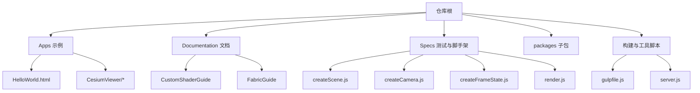
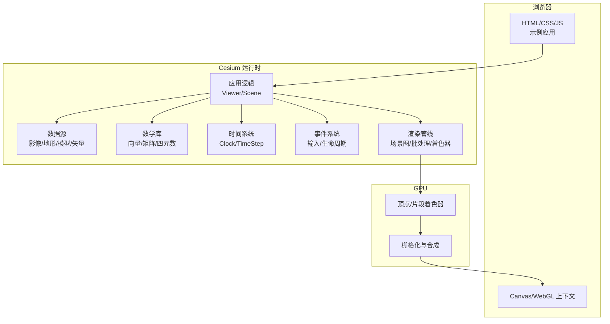
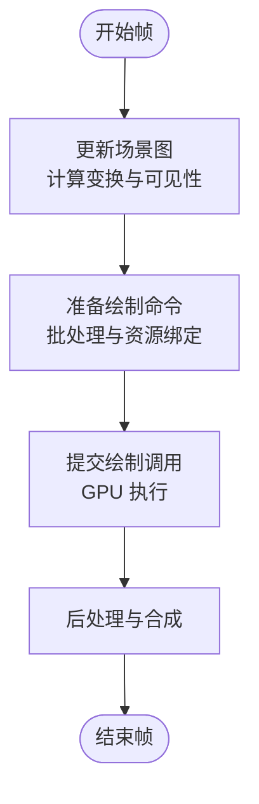
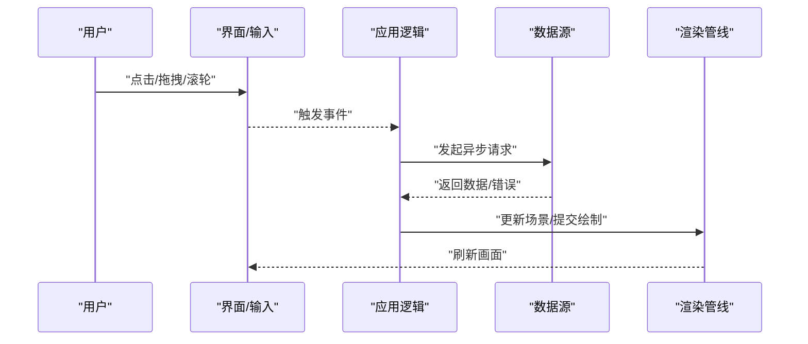
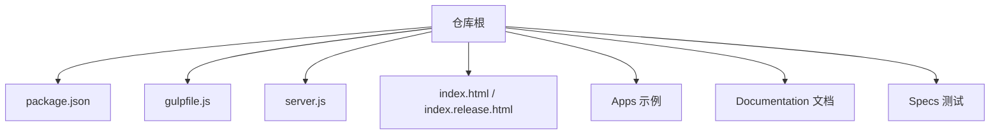

# 核心概念

<cite>
**本文引用的文件**   
- [README.md](file://README.md)
- [index.html](file://index.html)
- [index.release.html](file://index.release.html)
- [server.js](file://server.js)
- [package.json](file://package.json)
- [gulpfile.js](file://gulpfile.js)
- [Apps/HelloWorld.html](file://Apps/HelloWorld.html)
- [Apps/CesiumViewer/CesiumViewer.js](file://Apps/CesiumViewer/CesiumViewer.js)
- [Apps/CesiumViewer/index.html](file://Apps/CesiumViewer/index.html)
- [Documentation/CustomShaderGuide/README.md](file://Documentation/CustomShaderGuide/README.md)
- [Documentation/FabricGuide/README.md](file://Documentation/FabricGuide/README.md)
- [Specs/createScene.js](file://Specs/createScene.js)
- [Specs/createCamera.js](file://Specs/createCamera.js)
- [Specs/createFrameState.js](file://Specs/createFrameState.js)
- [Specs/render.js](file://Specs/render.js)
</cite>

## 目录
1. [简介](#简介)
2. [项目结构](#项目结构)
3. [核心组件](#核心组件)
4. [架构总览](#架构总览)
5. [详细组件分析](#详细组件分析)
6. [依赖关系分析](#依赖关系分析)
7. [性能考量](#性能考量)
8. [故障排查指南](#故障排查指南)
9. [结论](#结论)
10. [附录](#附录)

## 简介
本文件面向希望深入理解 Cesium 内部工作机制的开发者，围绕以下核心主题展开：
- 坐标系统与投影：WGS84、Web Mercator 及其变换关系
- 时间处理机制：时钟、时间步长与插值
- 渲染管线与场景图：从数据到像素的关键阶段
- 数学库基础：向量、矩阵、四元数在三维变换中的作用
- 事件驱动与异步数据处理：资源加载、帧循环与回调编排
- 实践示例：通过仓库中的示例与测试脚手架快速上手

说明：由于当前工作区未包含 Source 下的核心实现源码，本文以仓库顶层入口、示例应用、文档与测试脚手架为依据进行架构与流程层面的解读，并给出可复现的实践路径。

## 项目结构
Cesium 仓库采用多包与示例分离的组织方式：
- 顶层入口与构建脚本：提供本地开发服务器、打包与发布流程
- Apps：示例应用（HelloWorld、CesiumViewer）用于演示常见用法
- Documentation：官方文档与指南（着色器、Fabric 材质等）
- Specs：测试与脚手架（创建场景、相机、帧状态、渲染等）
- packages：引擎、小部件与 Sandcastle 等子包（具体实现位于各包内）

图表来源
- [package.json:1-200](file://package.json#L1-L200)
- [gulpfile.js:1-200](file://gulpfile.js#L1-L200)
- [server.js:1-200](file://server.js#L1-L200)
- [Apps/HelloWorld.html:1-200](file://Apps/HelloWorld.html#L1-L200)
- [Apps/CesiumViewer/CesiumViewer.js:1-200](file://Apps/CesiumViewer/CesiumViewer.js#L1-L200)
- [Documentation/CustomShaderGuide/README.md:1-200](file://Documentation/CustomShaderGuide/README.md#L1-L200)
- [Documentation/FabricGuide/README.md:1-200](file://Documentation/FabricGuide/README.md#L1-L200)
- [Specs/createScene.js:1-200](file://Specs/createScene.js#L1-L200)
- [Specs/createCamera.js:1-200](file://Specs/createCamera.js#L1-L200)
- [Specs/createFrameState.js:1-200](file://Specs/createFrameState.js#L1-L200)
- [Specs/render.js:1-200](file://Specs/render.js#L1-L200)

章节来源
- [README.md:1-200](file://README.md#L1-L200)
- [package.json:1-200](file://package.json#L1-L200)
- [gulpfile.js:1-200](file://gulpfile.js#L1-L200)
- [server.js:1-200](file://server.js#L1-L200)

## 核心组件
- 示例应用
  - HelloWorld：最小化入门示例，展示如何初始化 Viewer 并添加基本图层
  - CesiumViewer：更完整的示例，演示常用交互与数据加载
- 文档与指南
  - 自定义着色器指南：介绍如何在 Cesium 中编写与集成自定义着色器
  - Fabric 材质指南：描述基于 Fabric 的材质定义与组合方式
- 测试与脚手架
  - createScene：创建 Scene 实例与基础配置
  - createCamera：设置相机初始位置与姿态
  - createFrameState：构造帧状态对象，驱动渲染循环
  - render：执行一次渲染调用，输出到画布

章节来源
- [Apps/HelloWorld.html:1-200](file://Apps/HelloWorld.html#L1-L200)
- [Apps/CesiumViewer/CesiumViewer.js:1-200](file://Apps/CesiumViewer/CesiumViewer.js#L1-L200)
- [Documentation/CustomShaderGuide/README.md:1-200](file://Documentation/CustomShaderGuide/README.md#L1-L200)
- [Documentation/FabricGuide/README.md:1-200](file://Documentation/FabricGuide/README.md#L1-L200)
- [Specs/createScene.js:1-200](file://Specs/createScene.js#L1-L200)
- [Specs/createCamera.js:1-200](file://Specs/createCamera.js#L1-L200)
- [Specs/createFrameState.js:1-200](file://Specs/createFrameState.js#L1-L200)
- [Specs/render.js:1-200](file://Specs/render.js#L1-L200)

## 架构总览
下图展示了从浏览器到 GPU 的高层数据流与关键组件协作关系。该图为概念性示意，不直接映射到具体源码文件。

[此图为概念性架构图，无需图表来源]

## 详细组件分析

### 坐标系统与投影
- WGS84 地理坐标系
  - 使用经度、纬度、高度表示地球表面点
  - 适用于全球范围的数据存储与交换
- Web Mercator 投影
  - 将经纬度映射为平面坐标，便于瓦片切分与地图显示
  - 适合在线地图服务与切片数据
- 投影变换
  - 在渲染前将 WGS84 坐标转换为 Web Mercator 或局部笛卡尔坐标
  - 涉及椭球体参数、投影中心与缩放因子

实践建议
- 统一数据源坐标参考，避免混合不同坐标系导致错位
- 对大范围场景优先使用 WGS84，对局部高精度场景考虑局部投影

章节来源
- [README.md:1-200](file://README.md#L1-L200)
- [Apps/HelloWorld.html:1-200](file://Apps/HelloWorld.html#L1-L200)
- [Apps/CesiumViewer/CesiumViewer.js:1-200](file://Apps/CesiumViewer/CesiumViewer.js#L1-L200)

### 时间处理机制
- 时钟与时步
  - Clock 控制模拟时间与真实时间的同步
  - TimeStep 决定每帧的时间增量与插值策略
- 时间相关数据
  - 动态轨迹、动画与属性随时间变化
  - 通过插值在帧间平滑过渡

实践建议
- 合理设置时间步长，平衡精度与性能
- 对长时间运行场景启用节流与暂停恢复

章节来源
- [Specs/createFrameState.js:1-200](file://Specs/createFrameState.js#L1-L200)
- [Specs/render.js:1-200](file://Specs/render.js#L1-L200)

### 渲染管线与场景图
- 场景图
  - 节点组织实体、几何体、材质与变换
  - 支持层级结构与批量合并
- 渲染阶段
  - 更新：计算世界矩阵、裁剪与可见性
  - 准备：生成绘制命令、绑定资源
  - 提交：调用 WebGL 绘制 API
  - 后处理：叠加效果与合成

[此图为概念性流程图，无需图表来源]

章节来源
- [Specs/createScene.js:1-200](file://Specs/createScene.js#L1-L200)
- [Specs/render.js:1-200](file://Specs/render.js#L1-L200)

### 数学库核心概念
- 向量
  - 表示方向与位移，常用于法线、速度与位置差
- 矩阵
  - 表示平移、旋转与缩放，组合为模型视图投影矩阵
- 四元数
  - 表示旋转，避免万向节锁，适合插值与连续旋转

实践建议
- 尽量复用中间结果，减少重复计算
- 注意数值稳定性，避免极端尺度导致的精度损失

章节来源
- [Documentation/CustomShaderGuide/README.md:1-200](file://Documentation/CustomShaderGuide/README.md#L1-L200)
- [Documentation/FabricGuide/README.md:1-200](file://Documentation/FabricGuide/README.md#L1-L200)

### 事件驱动与异步数据处理
- 事件驱动
  - 用户输入、相机控制与生命周期事件
  - 通过订阅与分发解耦模块职责
- 异步数据
  - 资源加载、网络请求与解码过程
  - 使用 Promise/回调管理完成状态与错误处理

[此图为概念性序列图，无需图表来源]

章节来源
- [Apps/CesiumViewer/CesiumViewer.js:1-200](file://Apps/CesiumViewer/CesiumViewer.js#L1-L200)
- [Specs/createScene.js:1-200](file://Specs/createScene.js#L1-L200)

### 实践示例与代码片段路径
- 最小化示例
  - 打开 HelloWorld 页面，查看初始化与基本图层添加流程
  - 参考路径：[Apps/HelloWorld.html](file://Apps/HelloWorld.html)
- 完整示例
  - 启动 CesiumViewer，观察交互与数据加载
  - 参考路径：[Apps/CesiumViewer/index.html](file://Apps/CesiumViewer/index.html)、[Apps/CesiumViewer/CesiumViewer.js](file://Apps/CesiumViewer/CesiumViewer.js)
- 测试脚手架
  - 创建场景与相机：[Specs/createScene.js](file://Specs/createScene.js)、[Specs/createCamera.js](file://Specs/createCamera.js)
  - 帧状态与渲染：[Specs/createFrameState.js](file://Specs/createFrameState.js)、[Specs/render.js](file://Specs/render.js)
- 文档指南
  - 自定义着色器：[Documentation/CustomShaderGuide/README.md](file://Documentation/CustomShaderGuide/README.md)
  - Fabric 材质：[Documentation/FabricGuide/README.md](file://Documentation/FabricGuide/README.md)

章节来源
- [Apps/HelloWorld.html:1-200](file://Apps/HelloWorld.html#L1-L200)
- [Apps/CesiumViewer/index.html:1-200](file://Apps/CesiumViewer/index.html#L1-L200)
- [Apps/CesiumViewer/CesiumViewer.js:1-200](file://Apps/CesiumViewer/CesiumViewer.js#L1-L200)
- [Specs/createScene.js:1-200](file://Specs/createScene.js#L1-L200)
- [Specs/createCamera.js:1-200](file://Specs/createCamera.js#L1-L200)
- [Specs/createFrameState.js:1-200](file://Specs/createFrameState.js#L1-L200)
- [Specs/render.js:1-200](file://Specs/render.js#L1-L200)
- [Documentation/CustomShaderGuide/README.md:1-200](file://Documentation/CustomShaderGuide/README.md#L1-L200)
- [Documentation/FabricGuide/README.md:1-200](file://Documentation/FabricGuide/README.md#L1-L200)

## 依赖关系分析
- 顶层入口与页面
  - index.html 与 index.release.html 作为默认入口，引用构建产物
- 开发与调试
  - server.js 提供本地静态服务
  - gulpfile.js 定义构建任务与流水线
- 示例与文档
  - Apps 与 Documentation 依赖构建产物与资源路径

图表来源
- [package.json:1-200](file://package.json#L1-L200)
- [gulpfile.js:1-200](file://gulpfile.js#L1-L200)
- [server.js:1-200](file://server.js#L1-L200)
- [index.html:1-200](file://index.html#L1-L200)
- [index.release.html:1-200](file://index.release.html#L1-L200)

章节来源
- [package.json:1-200](file://package.json#L1-L200)
- [gulpfile.js:1-200](file://gulpfile.js#L1-L200)
- [server.js:1-200](file://server.js#L1-L200)
- [index.html:1-200](file://index.html#L1-L200)
- [index.release.html:1-200](file://index.release.html#L1-L200)

## 性能考量
- 数据分层与按需加载
  - 使用瓦片与 LOD 降低带宽与内存占用
- 批处理与合并
  - 减少绘制调用次数，提升 GPU 利用率
- 时间步长与节流
  - 根据设备能力调整帧率与插值精度
- 资源复用
  - 共享纹理、几何体与材质，避免重复分配

[本节为通用指导，无需章节来源]

## 故障排查指南
- 常见问题定位
  - 检查本地服务器是否正常运行（端口占用、跨域限制）
  - 确认资源路径与构建产物是否正确引用
  - 查看控制台错误日志与网络请求状态
- 调试技巧
  - 使用浏览器开发者工具监控帧率与绘制调用
  - 逐步注释示例代码，缩小问题范围
  - 利用测试脚手架快速验证场景与相机配置

章节来源
- [server.js:1-200](file://server.js#L1-L200)
- [index.html:1-200](file://index.html#L1-L200)
- [index.release.html:1-200](file://index.release.html#L1-L200)

## 结论
通过对仓库入口、示例应用、文档与测试脚手架的系统梳理，我们构建了 Cesium 核心概念的概览式理解：
- 坐标系统与投影是空间数据的基础
- 时间系统支撑动态可视化
- 渲染管线与场景图连接数据与 GPU
- 数学库提供变换与插值的基石
- 事件与异步模式确保可扩展性与健壮性

结合示例与测试脚手架，开发者可以快速搭建实验环境，逐步深入 Cesium 的内部机制。

[本节为总结性内容，无需章节来源]

## 附录
- 快速开始
  - 安装依赖并启动本地服务器
  - 打开 index.html 或 Apps/HelloWorld.html 体验基础功能
- 进一步学习
  - 阅读 CustomShaderGuide 与 FabricGuide 了解高级定制
  - 参考 Specs 中的脚手架扩展自己的测试用例

章节来源
- [README.md:1-200](file://README.md#L1-L200)
- [Apps/HelloWorld.html:1-200](file://Apps/HelloWorld.html#L1-L200)
- [Documentation/CustomShaderGuide/README.md:1-200](file://Documentation/CustomShaderGuide/README.md#L1-L200)
- [Documentation/FabricGuide/README.md:1-200](file://Documentation/FabricGuide/README.md#L1-L200)