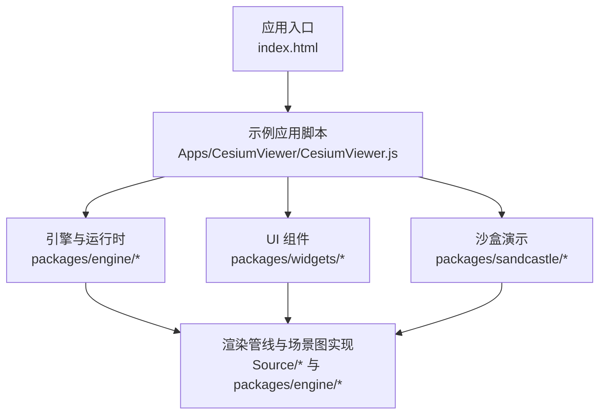
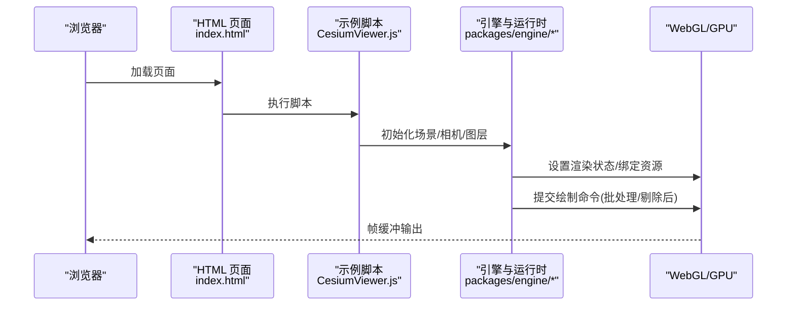
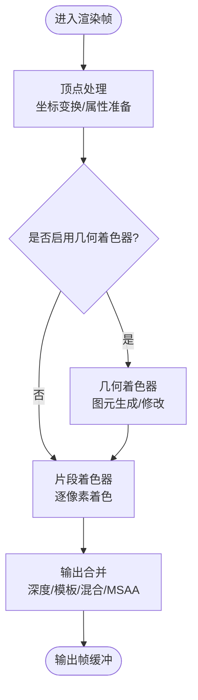
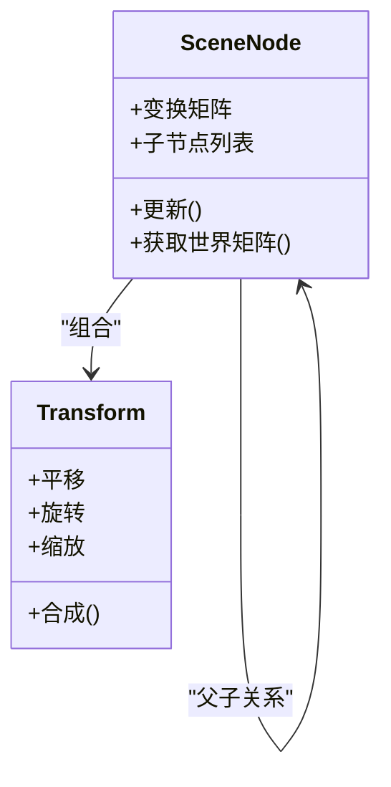
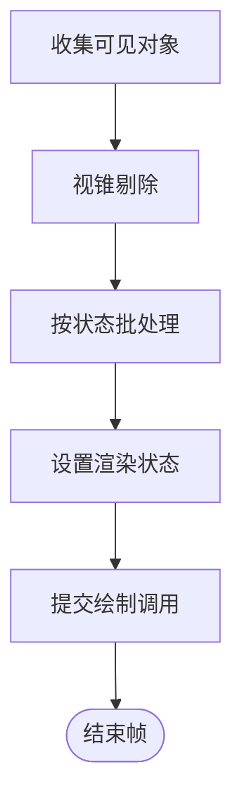
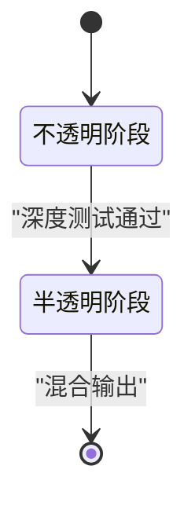
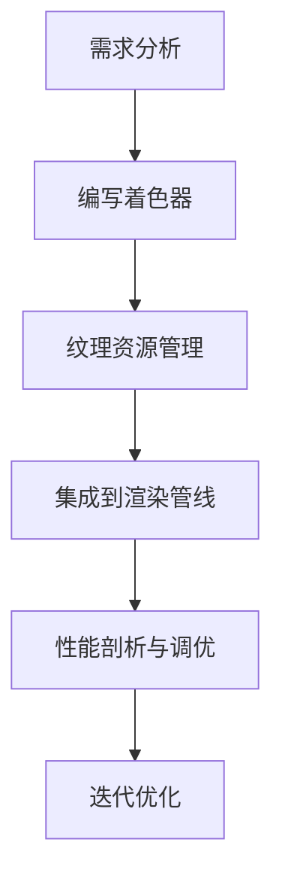
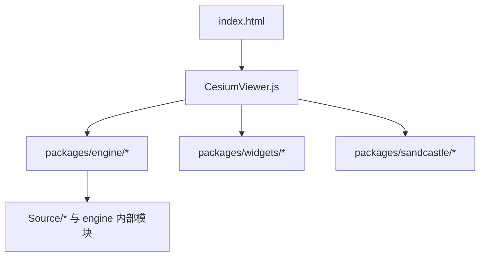

# 渲染管线与场景图

<cite>
**本文引用的文件**   
- [README.md](file://README.md)
- [index.html](file://index.html)
- [CesiumViewer.js](file://Apps/CesiumViewer/CesiumViewer.js)
- [CustomShaderGuide/README.md](file://Documentation/CustomShaderGuide/README.md)
- [FabricGuide/README.md](file://Documentation/FabricGuide/README.md)
- [PerformanceTestingGuide/README.md](file://Documentation/Contributors/PerformanceTestingGuide/README.md)
</cite>

## 目录
1. [简介](#简介)
2. [项目结构](#项目结构)
3. [核心组件](#核心组件)
4. [架构总览](#架构总览)
5. [详细组件分析](#详细组件分析)
6. [依赖分析](#依赖分析)
7. [性能考量](#性能考量)
8. [故障排查指南](#故障排查指南)
9. [结论](#结论)
10. [附录](#附录)

## 简介
本技术文档围绕 Cesium 的渲染管线与场景图架构，系统阐述 WebGL 渲染各阶段（顶点处理、几何着色器、片段着色器、输出合并）在 Cesium 中的组织方式；说明场景图的层次结构与变换矩阵计算；解释渲染状态管理、批处理优化与视锥剔除机制；并给出渲染优先级、深度测试与透明度混合的实现要点。同时提供自定义渲染器的开发指南（着色器编写、纹理管理与内存优化），以及性能分析与调试技巧。

## 项目结构
仓库采用多包与示例分离的组织方式：
- 应用示例位于 Apps 目录，包含最小可运行示例与大量数据资源。
- 文档位于 Documentation 目录，涵盖自定义着色器、Fabric 材质系统与性能测试等专题。
- 源码核心位于 Source 与 packages 目录（engine、sandcastle、widgets）。
- 测试与工具位于 Specs 与 Tools 目录。

图表来源
- [index.html:1-200](file://index.html#L1-L200)
- [CesiumViewer.js:1-200](file://Apps/CesiumViewer/CesiumViewer.js#L1-L200)

章节来源
- [README.md:1-200](file://README.md#L1-L200)
- [index.html:1-200](file://index.html#L1-L200)
- [CesiumViewer.js:1-200](file://Apps/CesiumViewer/CesiumViewer.js#L1-L200)

## 核心组件
本节聚焦与渲染管线和场景图直接相关的核心能力与概念，结合仓库文档与示例进行说明：
- 渲染管线阶段：顶点处理、几何着色器、片段着色器、输出合并。
- 场景图：节点层次、继承关系、变换矩阵计算。
- 渲染状态：深度测试、透明度混合、渲染顺序与优先级。
- 批处理与视锥剔除：减少绘制调用、提升吞吐。
- 自定义渲染器：着色器扩展、纹理管理、内存优化。
- 性能分析与调试：定位瓶颈、验证优化效果。

章节来源
- [CustomShaderGuide/README.md:1-200](file://Documentation/CustomShaderGuide/README.md#L1-L200)
- [FabricGuide/README.md:1-200](file://Documentation/FabricGuide/README.md#L1-L200)
- [PerformanceTestingGuide/README.md:1-200](file://Documentation/Contributors/PerformanceTestingGuide/README.md#L1-L200)

## 架构总览
下图展示从页面加载到渲染输出的关键路径，强调浏览器、Cesium 示例脚本与引擎之间的交互。

图表来源
- [index.html:1-200](file://index.html#L1-L200)
- [CesiumViewer.js:1-200](file://Apps/CesiumViewer/CesiumViewer.js#L1-L200)

## 详细组件分析

### WebGL 渲染管线阶段
- 顶点处理：将模型空间顶点经模型-视图-投影矩阵转换至裁剪空间，完成属性插值准备。
- 几何着色器：可选阶段，用于生成或修改图元（如点精灵、线带），在 Cesium 中通过特定管线或扩展启用。
- 片段着色器：逐像素计算颜色与深度，采样纹理、执行光照与材质逻辑。
- 输出合并：执行深度/模板测试、混合（透明度）、多重目标输出与后处理。

章节来源
- [CustomShaderGuide/README.md:1-200](file://Documentation/CustomShaderGuide/README.md#L1-L200)

### 场景图层次与变换矩阵
- 层次结构：场景以树形节点组织，父子节点共享局部坐标系，便于层级动画与批量更新。
- 继承关系：子节点继承父节点的变换（平移、旋转、缩放），最终世界矩阵为链式相乘结果。
- 矩阵计算：每帧遍历场景图，自顶向下累积变换矩阵，供后续管线阶段使用。

章节来源
- [FabricGuide/README.md:1-200](file://Documentation/FabricGuide/README.md#L1-L200)

### 渲染状态管理、批处理与视锥剔除
- 渲染状态：统一封装深度测试、混合模式、面剔除、模板操作等，避免频繁切换。
- 批处理：将相同材质/状态的几何体合并绘制，降低驱动开销。
- 视锥剔除：基于相机视锥对节点/瓦片/图元进行快速剔除，减少无效绘制。

章节来源
- [PerformanceTestingGuide/README.md:1-200](file://Documentation/Contributors/PerformanceTestingGuide/README.md#L1-L200)

### 渲染优先级、深度测试与透明度混合
- 渲染优先级：根据语义（不透明先绘、半透明后绘）与距离排序，确保正确叠加。
- 深度测试：控制像素写入与遮挡判断，避免不必要的片段着色。
- 透明度混合：启用混合函数与深度写关闭策略，保证视觉正确性。

章节来源
- [CustomShaderGuide/README.md:1-200](file://Documentation/CustomShaderGuide/README.md#L1-L200)

### 自定义渲染器开发指南
- 着色器编写：遵循 Cesium 的着色器约定，合理组织 uniform、attribute、varying，利用内置常量与函数。
- 纹理管理：复用纹理、按需加载、及时释放，避免重复创建与带宽浪费。
- 内存优化：减少临时对象分配、复用缓冲区、压缩纹理格式、控制 LOD。

章节来源
- [CustomShaderGuide/README.md:1-200](file://Documentation/CustomShaderGuide/README.md#L1-L200)

### 实际的性能分析与调试技巧
- 指标采集：关注绘制调用次数、三角形数量、纹理切换、CPU/GPU 耗时。
- 断点与日志：在关键管线阶段插入日志，观察状态变化与异常。
- 对比实验：开启/关闭批处理、视锥剔除、不同混合策略，量化收益。

章节来源
- [PerformanceTestingGuide/README.md:1-200](file://Documentation/Contributors/PerformanceTestingGuide/README.md#L1-L200)

## 依赖分析
从应用入口到引擎的依赖关系如下：

图表来源
- [index.html:1-200](file://index.html#L1-L200)
- [CesiumViewer.js:1-200](file://Apps/CesiumViewer/CesiumViewer.js#L1-L200)

章节来源
- [index.html:1-200](file://index.html#L1-L200)
- [CesiumViewer.js:1-200](file://Apps/CesiumViewer/CesiumViewer.js#L1-L200)

## 性能考量
- 减少绘制调用：通过批处理与实例化合并几何体。
- 降低状态切换：尽量保持材质与渲染状态一致。
- 合理使用 LOD：远距离使用低精度模型与简化材质。
- 纹理与内存：优先使用压缩纹理、复用资源、避免峰值内存。
- 异步与分帧：大资源加载与复杂计算拆分到多帧。

[本节为通用指导，无需具体文件引用]

## 故障排查指南
- 常见问题：
  - 渲染错位：检查模型-视图-投影矩阵链与坐标系约定。
  - 透明错误：确认混合模式与深度写设置。
  - 性能抖动：定位高频状态切换与未批处理的几何体。
- 调试手段：
  - 在关键阶段打印统计信息（绘制调用、三角形数、纹理切换）。
  - 逐步禁用特性（如阴影、后处理）验证影响范围。
  - 使用浏览器开发者工具与 GPU 分析器定位瓶颈。

章节来源
- [PerformanceTestingGuide/README.md:1-200](file://Documentation/Contributors/PerformanceTestingGuide/README.md#L1-L200)

## 结论
通过对 Cesium 渲染管线与场景图的系统梳理，明确了从顶点处理到输出合并的关键流程，场景图层次与矩阵计算的职责边界，以及批处理、视锥剔除、渲染优先级与混合策略的实践要点。配合自定义渲染器指南与性能分析技巧，可在保证视觉效果的同时显著提升渲染效率。

[本节为总结性内容，无需具体文件引用]

## 附录
- 参考文档：
  - 自定义着色器指南：[CustomShaderGuide/README.md](file://Documentation/CustomShaderGuide/README.md)
  - Fabric 材质系统指南：[FabricGuide/README.md](file://Documentation/FabricGuide/README.md)
  - 性能测试指南：[PerformanceTestingGuide/README.md](file://Documentation/Contributors/PerformanceTestingGuide/README.md)
- 示例入口：
  - 页面入口：[index.html](file://index.html)
  - 示例脚本：[CesiumViewer.js](file://Apps/CesiumViewer/CesiumViewer.js)