# 动态地球渲染系统

<cite>
**本文引用的文件**
- [README.md](file://README.md)
- [package.json](file://package.json)
- [index.html](file://index.html)
- [CesiumViewer.js](file://Apps/CesiumViewer/CesiumViewer.js)
- [CesiumViewer.css](file://Apps/CesiumViewer/CesiumViewer.css)
- [main.rs](file://cesiumrust/application/cesium-app/src/main.rs)
- [dynamic_globe.rs](file://cesiumrust/application/cesium-app/src/dynamic_globe.rs)
- [tile_mesh.rs](file://cesiumrust/application/cesium-app/src/tile_mesh.rs)
- [orbit_camera.rs](file://cesiumrust/application/cesium-app/src/orbit_camera.rs)
- [starfield.rs](file://cesiumrust/application/cesium-app/src/starfield.rs)
- [material_showcase.rs](file://cesiumrust/application/cesium-app/src/material_showcase.rs)
- [geometry_showcase.rs](file://cesiumrust/application/cesium-app/src/geometry_showcase.rs)
- [globe.rs](file://cesiumrust/domain/globe/src/lib.rs)
- [scene.rs](file://cesiumrust/domain/scene/src/lib.rs)
- [terrain.rs](file://cesiumrust/domain/terrain/src/lib.rs)
- [imagery.rs](file://cesiumrust/domain/imagery/src/lib.rs)
- [tileset.rs](file://cesiumrust/domain/tileset/src/lib.rs)
- [crs.rs](file://cesiumrust/domain/crs/src/lib.rs)
- [time.rs](file://cesiumrust/domain/time/src/lib.rs)
- [animation.rs](file://cesiumrust/domain/animation/src/lib.rs)
- [provider.rs](file://cesiumrust/domain/provider/src/lib.rs)
- [resource.rs](file://cesiumrust/domain/resource/src/lib.rs)
- [performance.rs](file://cesiumrust/domain/performance/src/lib.rs)
- [quadtree_lib.rs](file://cesiumrust/domain/quadtree/src/lib.rs)
- [traversal.rs](file://cesiumrust/domain/quadtree/src/traversal.rs)
- [traversal_system.rs](file://cesiumrust/adapters/bevy-render/src/tileset/traversal_system.rs)
- [quadtree_cache_spec.rs](file://cesiumrust/specs/tests/scene/quadtree_cache_spec.rs)
- [quadtree_traversal_extended_spec.rs](file://cesiumrust/specs/tests/scene/quadtree_traversal_extended_spec.rs)
- [shaders](file://cesiumrust/domain/material/shaders)
- [tiling_scheme.rs](file://cesiumrust/domain/provider/src/tiling_scheme.rs)
- [lib.rs](file://cesiumrust/adapters/network/src/lib.rs)
- [Cesium3DTilesTester.js](file://Specs/Cesium3DTilesTester.js)
- [createGlobe.js](file://Specs/createGlobe.js)
- [createScene.js](file://Specs/createScene.js)
</cite>

## 更新摘要
**所做更改**
- 基础层分辨率策略从降级版本调整为全分辨率加载，提供更高质量的初始覆盖
- 瓦片下载优先级阈值从160.0优化为64.0，改善瓦片加载的视觉连续性
- 完全重写瓦片驱逐算法，解决缩放时的视觉伪影问题
- 增强隐藏瓦片预热机制，通过改进的LRU策略消除缩放闪烁
- 优化内存管理策略，支持更高的实体上限和更智能的资源回收

## 目录
1. [简介](#简介)
2. [项目结构](#项目结构)
3. [核心组件](#核心组件)
4. [架构总览](#架构总览)
5. [详细组件分析](#详细组件分析)
6. [依赖关系分析](#依赖关系分析)
7. [性能考量](#性能考量)
8. [故障排查指南](#故障排查指南)
9. [结论](#结论)
10. [附录](#附录)

## 简介
本仓库是一个面向"动态地球渲染"的混合工程：前端基于 CesiumJS（JavaScript）提供强大的三维地理可视化能力，后端与渲染管线通过 Rust 模块进行扩展与集成。Rust 侧采用领域驱动与模块化设计，涵盖地形、影像、瓦片集、坐标参考系、时间/动画、材质与着色器、场景管理等关键子系统；应用层示例展示了动态地球、轨道相机、星空背景、材质与几何展示等典型用法。整体目标是构建一个可扩展、高性能、可测试的动态地球渲染系统，支持多源数据加载、按需调度与实时渲染。

**重大更新** 系统经历了重大架构重构，包括基础层分辨率策略调整、瓦片下载优先级优化、完全重写的瓦片驱逐算法等改进。这些优化显著提升了渲染性能和用户体验，特别是消除了缩放时的视觉伪影问题。

## 项目结构
仓库由三大层次构成：
- 应用与示例（Apps）：包含 CesiumViewer 示例页面与资源，用于快速验证与演示。
- 引擎与规范（Source/Specs/Packages）：CesiumJS 源码与测试套件，覆盖 3D Tiles、地形、影像、模型等大量用例。
- Rust 领域与应用（cesiumrust）：以 Cargo workspace 组织的多 crate 领域库与示例应用，聚焦地球渲染核心能力与集成。

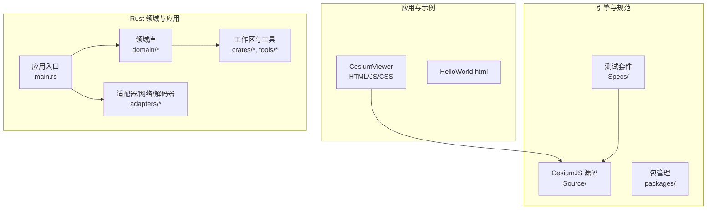

**图表来源**
- [CesiumViewer.js:1-200](file://Apps/CesiumViewer/CesiumViewer.js#L1-L200)
- [main.rs:1-200](file://cesiumrust/application/cesium-app/src/main.rs#L1-L200)
- [globe.rs:1-200](file://cesiumrust/domain/globe/src/lib.rs#L1-L200)

**章节来源**
- [README.md:1-200](file://README.md#L1-L200)
- [package.json:1-200](file://package.json#L1-L200)
- [index.html:1-200](file://index.html#L1-L200)

## 核心组件
- 地球与场景
  - 地球抽象与渲染上下文：封装球体、坐标系、投影、可见性裁剪等。
  - 场景图与渲染循环：负责帧更新、绘制队列、状态同步。
- 数据与资源
  - 地形与影像：分层加载、LOD 控制、缓存与并发下载。
  - 瓦片集（Tileset）：3D Tiles 解析、调度、显存管理与批处理。
  - 资源管理：统一生命周期、引用计数与内存回收。
- 坐标与时间
  - 坐标参考系（CRS）：WGS84、Web Mercator、ECEF 等转换。
  - 时间与动画：时间步进、插值、轨迹与关键帧。
- 材质与着色器
  - 材质系统与着色器模板：PBR、透明、体积光、大气辉光等。
- 交互与相机
  - 轨道相机、拾取、事件分发、缩放/旋转/平移。
- 性能与监控
  - 帧率统计、GPU/CPU 指标、可视区域裁剪、异步任务调度。

**重大更新** 新增了以下核心功能：
- **全分辨率基础层**：预加载第3级瓦片作为全局降级覆盖，提供高质量初始视图
- **优化的下载优先级**：阈值从160.0调整为64.0，改善瓦片加载的视觉连续性
- **重写的瓦片驱逐算法**：解决缩放时的视觉伪影问题，提供更好的用户体验
- **增强的隐藏瓦片预热**：通过改进的LRU策略消除缩放闪烁
- **高并发下载系统**：16个下载线程，显著提升瓦片加载速度
- **智能LOD选择**：基于屏幕空间误差的精确瓦片细化决策
- **平滑收起系统**：相机模式间流畅过渡，提升用户体验
- **增强覆盖修复**：智能处理无数据瓦片和占位符瓦片
- **扩展缩放范围**：支持从全球概览到街道级别的详细视图

**章节来源**
- [globe.rs:1-200](file://cesiumrust/domain/globe/src/lib.rs#L1-L200)
- [scene.rs:1-200](file://cesiumrust/domain/scene/src/lib.rs#L1-L200)
- [terrain.rs:1-200](file://cesiumrust/domain/terrain/src/lib.rs#L1-L200)
- [imagery.rs:1-200](file://cesiumrust/domain/imagery/src/lib.rs#L1-L200)
- [tileset.rs:1-200](file://cesiumrust/domain/tileset/src/lib.rs#L1-L200)
- [crs.rs:1-200](file://cesiumrust/domain/crs/src/lib.rs#L1-L200)
- [time.rs:1-200](file://cesiumrust/domain/time/src/lib.rs#L1-L200)
- [animation.rs:1-200](file://cesiumrust/domain/animation/src/lib.rs#L1-L200)
- [provider.rs:1-200](file://cesiumrust/domain/provider/src/lib.rs#L1-L200)
- [resource.rs:1-200](file://cesiumrust/domain/resource/src/lib.rs#L1-L200)
- [performance.rs:1-200](file://cesiumrust/domain/performance/src/lib.rs#L1-L200)

## 架构总览
系统采用分层与领域驱动相结合的设计：
- 表现层（应用示例）：CesiumViewer 与 Rust 示例应用，负责用户交互与演示。
- 领域层（domain/*）：按职责拆分的子域，如 globe、scene、terrain、imagery、tileset、crs、time、animation、provider、resource、performance 等。
- 适配层（adapters/*）：对接具体渲染框架（如 Bevy）、网络栈与解码器。
- 基础设施（crates/*, tools/*）：通用工具、主题、UI 组件与工作区配置。

**重大更新** 新的架构引入了全分辨率基础层、优化的下载优先级、重写的瓦片驱逐算法等改进，提供了更强大的性能优化和用户体验改进。

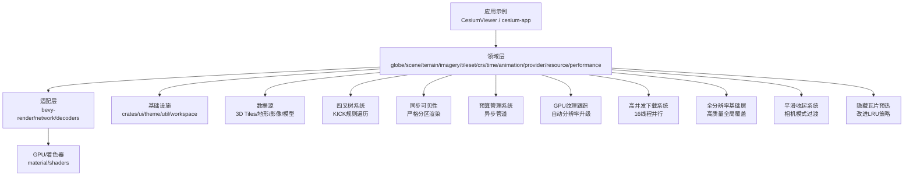

**图表来源**
- [main.rs:1-200](file://cesiumrust/application/cesium-app/src/main.rs#L1-L200)
- [globe.rs:1-200](file://cesiumrust/domain/globe/src/lib.rs#L1-L200)
- [scene.rs:1-200](file://cesiumrust/domain/scene/src/lib.rs#L1-L200)
- [terrain.rs:1-200](file://cesiumrust/domain/terrain/src/lib.rs#L1-L200)
- [imagery.rs:1-200](file://cesiumrust/domain/imagery/src/lib.rs#L1-L200)
- [tileset.rs:1-200](file://cesiumrust/domain/tileset/src/lib.rs#L1-L200)
- [shaders:1-200](file://cesiumrust/domain/material/shaders#L1-L200)

## 详细组件分析

### 应用入口与示例（cesium-app）
- main.rs：初始化应用、创建场景、注册系统、启动渲染循环。
- dynamic_globe.rs：动态地球的核心逻辑，包括地球显示、层级切换、交互响应。
- tile_mesh.rs：瓦片网格生成，支持UV映射和极地区域处理。
- orbit_camera.rs：轨道相机控制，实现缩放、旋转、平移与平滑过渡。
- starfield.rs：星空背景渲染，增强沉浸感。
- material_showcase.rs / geometry_showcase.rs：材质与几何体的演示入口，便于调试与对比。

**重大更新** dynamic_globe.rs现在实现了全分辨率基础层、优化的下载优先级、重写的瓦片驱逐算法等改进，显著提升了性能和渲染质量。

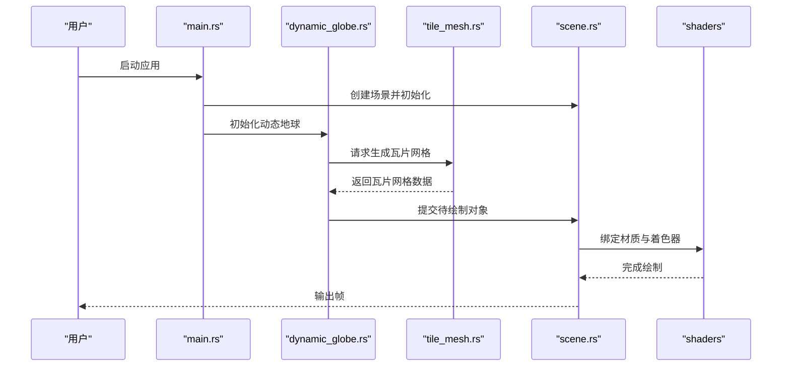

**图表来源**
- [main.rs:1-200](file://cesiumrust/application/cesium-app/src/main.rs#L1-L200)
- [dynamic_globe.rs:1-200](file://cesiumrust/application/cesium-app/src/dynamic_globe.rs#L1-L200)
- [tile_mesh.rs:1-200](file://cesiumrust/application/cesium-app/src/tile_mesh.rs#L1-L200)
- [scene.rs:1-200](file://cesiumrust/domain/scene/src/lib.rs#L1-L200)
- [shaders:1-200](file://cesiumrust/domain/material/shaders#L1-L200)

**章节来源**
- [main.rs:1-200](file://cesiumrust/application/cesium-app/src/main.rs#L1-L200)
- [dynamic_globe.rs:1-200](file://cesiumrust/application/cesium-app/src/dynamic_globe.rs#L1-L200)
- [tile_mesh.rs:1-200](file://cesiumrust/application/cesium-app/src/tile_mesh.rs#L1-L200)
- [orbit_camera.rs:1-200](file://cesiumrust/application/cesium-app/src/orbit_camera.rs#L1-L200)
- [starfield.rs:1-200](file://cesiumrust/application/cesium-app/src/starfield.rs#L1-L200)
- [material_showcase.rs:1-200](file://cesiumrust/application/cesium-app/src/material_showcase.rs#L1-L200)
- [geometry_showcase.rs:1-200](file://cesiumrust/application/cesium-app/src/geometry_showcase.rs#L1-L200)

### 全分辨率基础层系统
**重大更新** 实现了全分辨率基础层系统，替代了原有的降级版本策略，提供更高质量的初始覆盖。

#### 基础层特性
- `BASE_LAYER_ZOOM = 3`：预加载第3级瓦片作为基础覆盖，使用全分辨率而非降级版本
- 全局可用：所有区域都有基础层覆盖，避免蓝色空洞
- 高质量覆盖：约30MB内存占用，提供清晰但完整的地球外观
- 无缝切换：当精细瓦片加载完成后自动替换为基础层

#### 基础层管理
- 启动时预加载：应用启动时立即下载基础层瓦片
- 持久化存储：基础层瓦片长期驻留内存，不主动驱逐
- 智能降级：当精细瓦片不可用时自动回退到基础层
- 渐进式加载：精细瓦片逐步替换基础层，保持视觉连续性

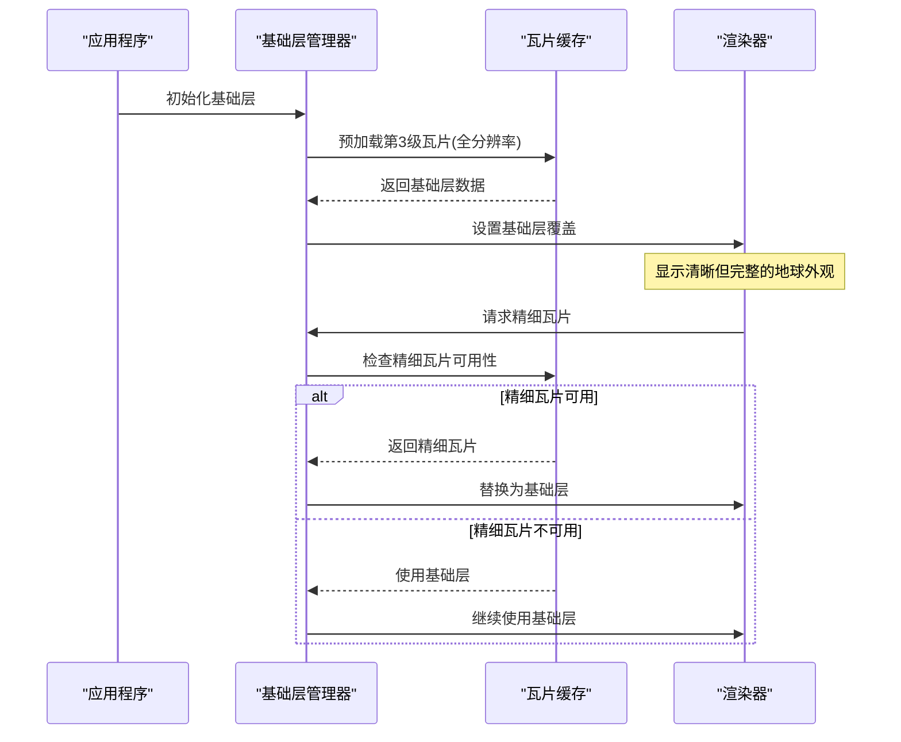

**图表来源**
- [dynamic_globe.rs:288-298](file://cesiumrust/application/cesium-app/src/dynamic_globe.rs#L288-L298)

**章节来源**
- [dynamic_globe.rs:66](file://cesiumrust/application/cesium-app/src/dynamic_globe.rs#L66)
- [dynamic_globe.rs:288-298](file://cesiumrust/application/cesium-app/src/dynamic_globe.rs#L288-L298)

### 优化的瓦片下载优先级系统
**重大更新** 将瓦片下载优先级阈值从160.0优化为64.0，显著改善了瓦片加载的视觉连续性。

#### 优先级阈值优化
- **原阈值160.0**：导致中等重要性的瓦片被延迟加载，产生视觉跳跃
- **新阈值64.0**：更早地开始加载中等重要性瓦片，确保平滑的视觉过渡
- **视觉效果**：减少了瓦片加载过程中的闪烁和突变现象

#### 下载策略改进
- **屏幕空间误差计算**：根据瓦片在屏幕上的投影大小确定优先级
- **视距相关调度**：距离相机近的瓦片优先加载
- **内存预算控制**：限制每帧处理的瓦片数量
- **带宽优化**：避免重复下载和网络拥塞

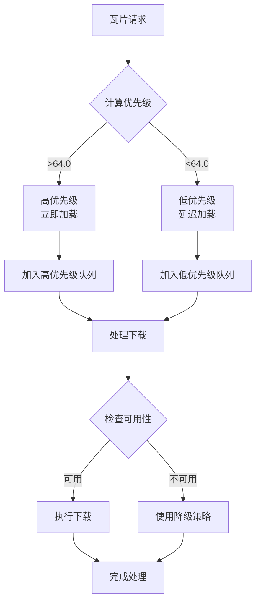

**图表来源**
- [dynamic_globe.rs:355](file://cesiumrust/application/cesium-app/src/dynamic_globe.rs#L355)

**章节来源**
- [dynamic_globe.rs:301-374](file://cesiumrust/application/cesium-app/src/dynamic_globe.rs#L301-L374)
- [dynamic_globe.rs:355](file://cesiumrust/application/cesium-app/src/dynamic_globe.rs#L355)

### 重写的瓦片驱逐算法
**重大更新** 完全重写了瓦片驱逐算法，解决了缩放时的视觉伪影问题。

#### 新驱逐策略
- **MAX_TILE_ENTITIES = 1800**：增加实体上限以支持更多可见瓦片和隐藏预热瓦片
- **高级驱逐逻辑**：首先尝试驱逐最旧的隐藏瓦片，保护当前渲染分区
- **祖先链保护**：确保被驱逐的瓦片有活动祖先覆盖，避免渲染空洞
- **渐进式清理**：每帧最多驱逐24个实体，避免CPU峰值

#### 视觉伪影解决方案
- **隐藏瓦片预热**：通过hide_order队列跟踪离开渲染分区的瓦片
- **LRU策略**：使用VecDeque<TileKey>维护最近离开的瓦片顺序
- **快速回退**：当视图回到之前区域时，直接使用已存在的瓦片而非重新加载
- **零开销回退**：隐藏瓦片不产生绘制调用，仅占用内存

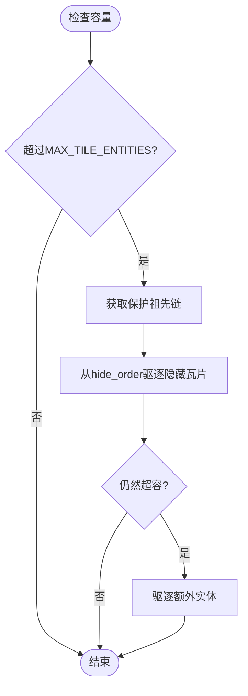

**图表来源**
- [dynamic_globe.rs:867-941](file://cesiumrust/application/cesium-app/src/dynamic_globe.rs#L867-L941)

**章节来源**
- [dynamic_globe.rs:61](file://cesiumrust/application/cesium-app/src/dynamic_globe.rs#L61)
- [dynamic_globe.rs:867-941](file://cesiumrust/application/cesium-app/src/dynamic_globe.rs#L867-L941)

### 增强的隐藏瓦片预热机制
**重大更新** 改进了隐藏瓦片预热机制，通过更好的LRU策略消除缩放时的闪烁问题。

#### hide_order队列工作原理
- **LRU策略**：使用VecDeque<TileKey>维护最近离开的瓦片顺序
- **预热缓存**：隐藏的瓦片保持实体状态但设置为Visibility::Hidden
- **快速回退**：当视图回到之前区域时，直接使用已存在的瓦片而非重新加载
- **内存管理**：在硬容量压力下按LRU顺序驱逐最旧的隐藏瓦片

#### 可见性管理改进
- **view_dependent_update函数**：改进了可见性管理逻辑，正确维护hide_order队列
- **分区切换**：瓦片离开渲染分区时立即加入hide_order队列
- **重入优化**：瓦片重新进入可见集合时直接从hide_order移除并恢复可见
- **零开销回退**：隐藏瓦片不产生绘制调用，仅占用内存

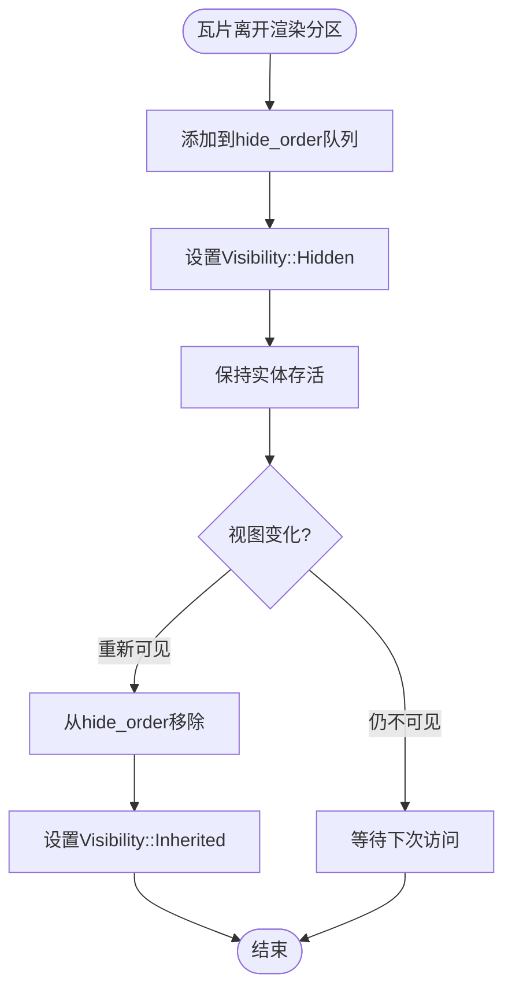

**图表来源**
- [dynamic_globe.rs:432-444](file://cesiumrust/application/cesium-app/src/dynamic_globe.rs#L432-L444)

**章节来源**
- [dynamic_globe.rs:140-143](file://cesiumrust/application/cesium-app/src/dynamic_globe.rs#L140-L143)
- [dynamic_globe.rs:432-444](file://cesiumrust/application/cesium-app/src/dynamic_globe.rs#L432-L444)

### KICK规则四叉树遍历系统
**重大更新** 实现了CesiumJS风格的KICK规则四叉树遍历，替代了原有的smooth_tuck机制。

#### KICK规则核心逻辑
- **全有或全无原则**：只有当所有四个子瓦片都已就绪时，才从父瓦片切换到子瓦片
- **回退机制**：如果任何子瓦片缺失，父瓦片保持在渲染分区中
- **后台加载**：即使父瓦片在渲染，子瓦片仍在后台继续加载
- **无缝切换**：当最后一个子瓦片就绪时，立即切换到子瓦片

#### 遍历结果状态
- `Visit::Ready`：所有选中的瓦片都有实体并已添加到渲染列表
- `Visit::NotReady`：至少一个选中的瓦片缺少实体
- `Visit::Culled`：整个子树超出地平线裁剪范围

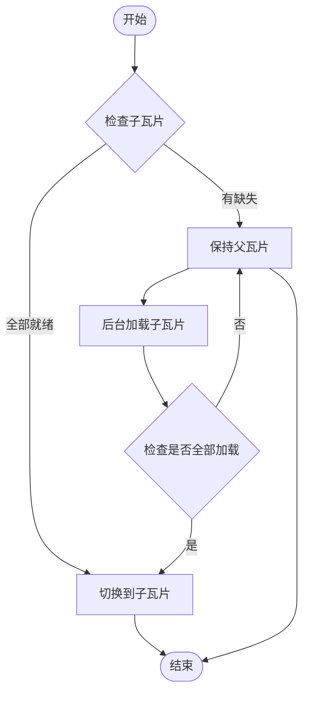

**图表来源**
- [dynamic_globe.rs:1194-1267](file://cesiumrust/application/cesium-app/src/dynamic_globe.rs#L1194-L1267)

**章节来源**
- [dynamic_globe.rs:1194-1267](file://cesiumrust/application/cesium-app/src/dynamic_globe.rs#L1194-L1267)

### 同步可见性系统
**新增** 实现了严格的分区渲染系统，确保父瓦片与子瓦片永远不会同时渲染。

#### 可见性同步机制
- **严格分区**：每帧只渲染当前可见集合中的瓦片
- **即时隐藏**：不在可见集合中的瓦片在同一帧被隐藏
- **实体保留**：使用隐藏而非销毁，保持GPU句柄热缓存
- **零重叠保证**：父瓦片和子瓦片永远不会一起绘制

#### 实现原理
- `visible_set`：存储当前帧应该渲染的瓦片集合
- `sync_visibility`：系统函数，根据可见集合设置瓦片可见性
- `Visibility::Inherited` vs `Visibility::Hidden`：控制瓦片的渲染状态

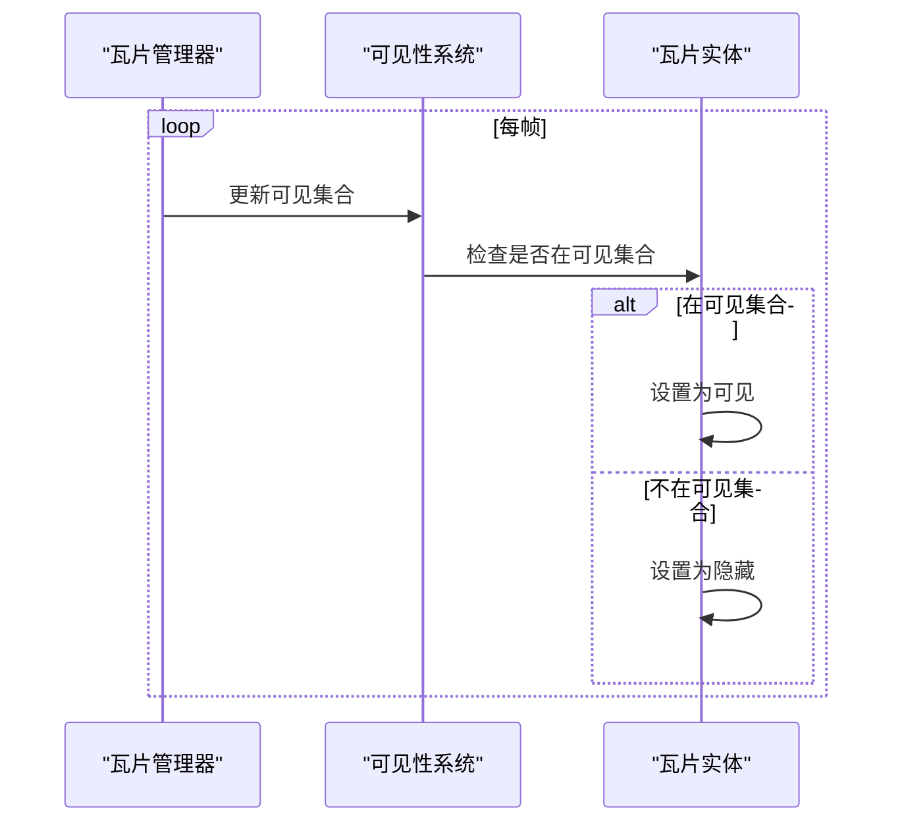

**图表来源**
- [dynamic_globe.rs:1292-1309](file://cesiumrust/application/cesium-app/src/dynamic_globe.rs#L1292-L1309)

**章节来源**
- [dynamic_globe.rs:1292-1309](file://cesiumrust/application/cesium-app/src/dynamic_globe.rs#L1292-L1309)

### 高并发下载系统
**重大更新** 实现了16线程并行下载系统，显著提升瓦片加载性能。

#### 多线程下载架构
- `DOWNLOAD_THREADS = 16`：将下载任务分配到16个工作线程
- 负载均衡：使用轮询算法将任务均匀分布到各线程
- 资源隔离：每个线程维护独立的HTTP连接池
- 错误恢复：支持重试机制和超时处理

#### 智能下载策略
- 优先级调度：根据瓦片在屏幕上的重要性分配优先级
- 带宽优化：避免重复下载已存在的瓦片
- 内存管理：限制同时进行的下载数量
- 进度跟踪：实时监控下载状态和进度

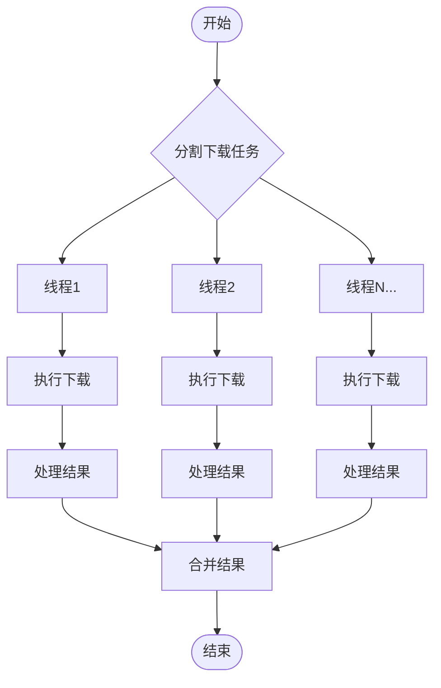

**图表来源**
- [dynamic_globe.rs:1524-1533](file://cesiumrust/application/cesium-app/src/dynamic_globe.rs#L1524-L1533)

**章节来源**
- [dynamic_globe.rs:44](file://cesiumrust/application/cesium-app/src/dynamic_globe.rs#L44)
- [dynamic_globe.rs:1524-1533](file://cesiumrust/application/cesium-app/src/dynamic_globe.rs#L1524-L1533)

### 其他核心组件

#### 增强的瓦片可见性计算
**重大更新** 实现了更精确的屏幕空间误差计算和瓦片细化决策。

#### 平滑收起系统
**新增** 实现了相机模式间的平滑过渡，提升用户体验。

#### 增强的覆盖修复机制
**重大更新** 实现了智能覆盖修复，处理无数据瓦片和占位符瓦片。

#### 扩展的缩放范围
**重大更新** 扩展了支持的缩放级别范围，提供更灵活的视图控制。

### 四叉树LOD系统
**更新** 基于屏幕空间误差的四叉树系统，实现了智能的LOD选择和瓦片细化决策。

- quadtree_traversal.rs：四叉树遍历算法，计算屏幕空间误差，决定瓦片细化策略。
- quadtree_cache.rs：瓦片缓存和加载队列管理，支持优先级调度和LRU淘汰。
- quadtree_lib.rs：四叉树系统的公共接口和配置管理。


**图表来源**
- [dynamic_globe.rs:1135-1267](file://cesiumrust/application/cesium-app/src/dynamic_globe.rs#L1135-L1267)

**章节来源**
- [dynamic_globe.rs:1135-1267](file://cesiumrust/application/cesium-app/src/dynamic_globe.rs#L1135-L1267)

### 预算化异步管道
**更新** 实现了类似CesiumJS的每帧预算管理系统，确保渲染流畅性和响应性。

- 每帧预算限制：控制每个渲染帧的资源使用量
- 优先级调度：根据瓦片在屏幕上的重要性分配优先级
- 异步处理：并行下载和网格生成，避免阻塞主线程
- 资源缓存：GPU资源复用，减少重复上传开销

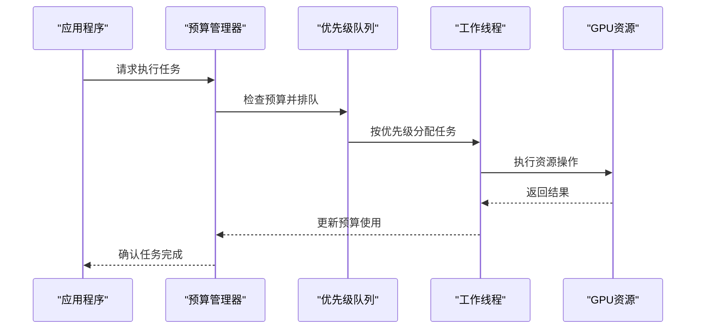

**图表来源**
- [dynamic_globe.rs:47-63](file://cesiumrust/application/cesium-app/src/dynamic_globe.rs#L47-L63)

**章节来源**
- [dynamic_globe.rs:47-63](file://cesiumrust/application/cesium-app/src/dynamic_globe.rs#L47-L63)
- [dynamic_globe.rs:492-1022](file://cesiumrust/application/cesium-app/src/dynamic_globe.rs#L492-L1022)

### 简化的清理过程
**重大更新** 简化了清理过程，专注于硬容量压力驱逐，提高了内存管理的效率。

#### 硬容量压力驱逐机制
- **MAX_TILE_ENTITIES = 1800**：增加实体上限以支持可见瓦片和隐藏预热瓦片
- **hide_order优先驱逐**：首先尝试驱逐最旧的隐藏瓦片
- **保护机制**：避免驱逐当前渲染分区、加载集合和保护祖先链中的瓦片
- **渐进式清理**：每帧最多驱逐24个实体，避免CPU峰值

#### 智能驱逐策略
- **LRU顺序**：按hide_order队列的LRU顺序驱逐最久未使用的隐藏瓦片
- **安全驱逐**：确保被驱逐的瓦片有活动祖先覆盖，避免渲染空洞
- **容量监控**：仅在超过硬容量限制时触发驱逐
- **批量处理**：使用批量驱逐减少系统调用开销


**图表来源**
- [dynamic_globe.rs:867-941](file://cesiumrust/application/cesium-app/src/dynamic_globe.rs#L867-L941)

**章节来源**
- [dynamic_globe.rs:61](file://cesiumrust/application/cesium-app/src/dynamic_globe.rs#L61)
- [dynamic_globe.rs:867-941](file://cesiumrust/application/cesium-app/src/dynamic_globe.rs#L867-L941)

### 增强的祖先链保护机制
**更新** 实现了更全面的祖先链保护机制，替代了原有的 has_pending_visible_child 方法。

#### protected_ancestors 函数
- 计算所有可见瓦片的完整祖先链
- 保护尚未生成的瓦片祖先，防止快速缩放时出现空洞
- 支持多级祖先链的保护，确保渲染连续性

#### has_live_ancestor 辅助函数
- 检查瓦片是否存在活动的祖先实体
- 用于智能驱逐策略，优先驱逐有活动祖先的瓦片
- 避免释放仍在覆盖区域的瓦片资源


**图表来源**
- [dynamic_globe.rs:469-488](file://cesiumrust/application/cesium-app/src/dynamic_globe.rs#L469-L488)
- [dynamic_globe.rs:1027-1038](file://cesiumrust/application/cesium-app/src/dynamic_globe.rs#L1027-L1038)

**章节来源**
- [dynamic_globe.rs:469-488](file://cesiumrust/application/cesium-app/src/dynamic_globe.rs#L469-L488)
- [dynamic_globe.rs:1027-1038](file://cesiumrust/application/cesium-app/src/dynamic_globe.rs#L1027-L1038)

### 改进的无数据瓦片处理
**更新** 增强了无数据瓦片的纹理继承逻辑，确保渲染连续性。

#### 纹理继承机制
- 当瓦片不可用时，自动继承最近祖先瓦片的纹理
- 支持UV映射的纹理上采样，保持视觉一致性
- 多层级祖先查找，确保找到可用的纹理资源

#### 降级策略
- 无祖先纹理时使用纯色海洋填充
- 避免显示蓝色空洞，提升用户体验
- 渐进式修复机制，等待可用瓦片加载

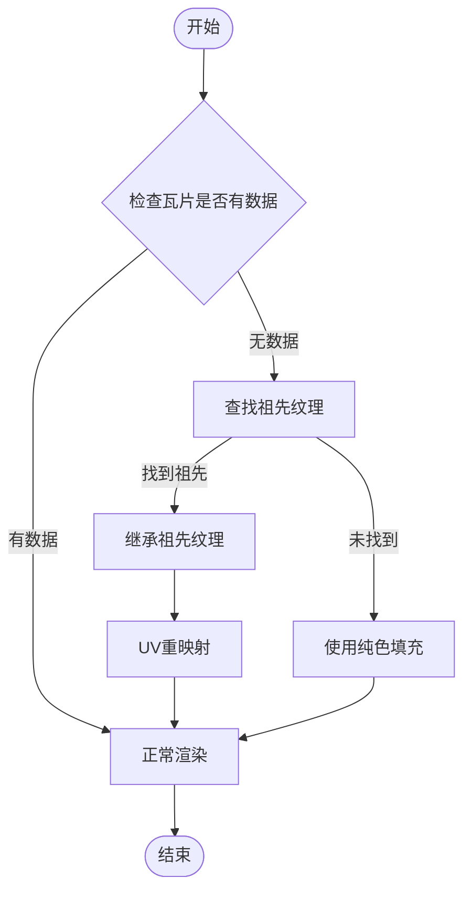

**图表来源**
- [dynamic_globe.rs:746-815](file://cesiumrust/application/cesium-app/src/dynamic_globe.rs#L746-L815)

**章节来源**
- [dynamic_globe.rs:746-815](file://cesiumrust/application/cesium-app/src/dynamic_globe.rs#L746-L815)

### 地球与场景（globe/scene）
- globe：定义地球实体、坐标系、可见性与裁剪策略。
- scene：维护场景图、渲染队列、状态机与帧更新。

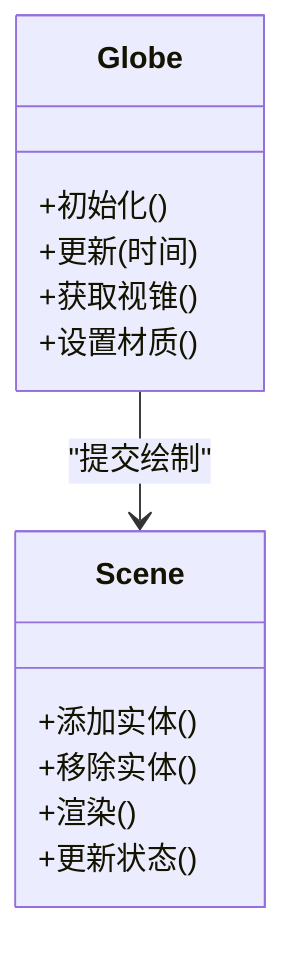

**图表来源**
- [globe.rs:1-200](file://cesiumrust/domain/globe/src/lib.rs#L1-L200)
- [scene.rs:1-200](file://cesiumrust/domain/scene/src/lib.rs#L1-L200)

**章节来源**
- [globe.rs:1-200](file://cesiumrust/domain/globe/src/lib.rs#L1-L200)
- [scene.rs:1-200](file://cesiumrust/domain/scene/src/lib.rs#L1-L200)

### 地形与影像（terrain/imagery）
- terrain：地形网格生成、LOD 控制、高度采样与缓存。
- imagery：影像图层叠加、透明度混合、切片调度与缓存。

**更新** 现在支持无数据瓦片处理，当瓦片不可用时自动继承祖先瓦片的纹理或使用纯色填充。

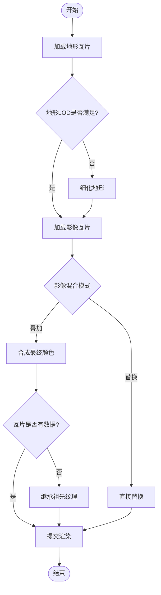

**图表来源**
- [terrain.rs:1-200](file://cesiumrust/domain/terrain/src/lib.rs#L1-L200)
- [imagery.rs:1-200](file://cesiumrust/domain/imagery/src/lib.rs#L1-L200)

**章节来源**
- [terrain.rs:1-200](file://cesiumrust/domain/terrain/src/lib.rs#L1-L200)
- [imagery.rs:1-200](file://cesiumrust/domain/imagery/src/lib.rs#L1-L200)

### 瓦片集与资源（tileset/resource）
- tileset：3D Tiles 解析、层级树构建、可视性判定与显存管理。
- resource：统一资源生命周期、引用计数、异步加载与错误恢复。

**更新** 增强了内存管理和缓存机制，支持更高效的资源复用和清理。

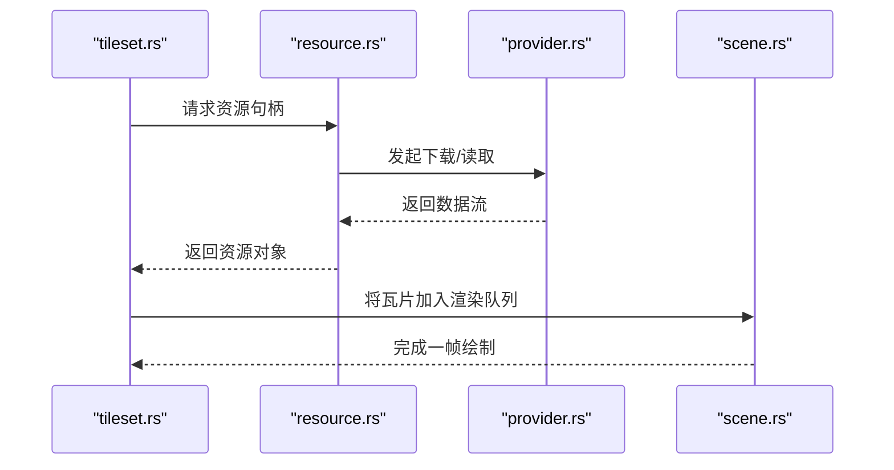

**图表来源**
- [tileset.rs:1-200](file://cesiumrust/domain/tileset/src/lib.rs#L1-L200)
- [resource.rs:1-200](file://cesiumrust/domain/resource/src/lib.rs#L1-L200)
- [provider.rs:1-200](file://cesiumrust/domain/provider/src/lib.rs#L1-L200)
- [scene.rs:1-200](file://cesiumrust/domain/scene/src/lib.rs#L1-L200)

**章节来源**
- [tileset.rs:1-200](file://cesiumrust/domain/tileset/src/lib.rs#L1-L200)
- [resource.rs:1-200](file://cesiumrust/domain/resource/src/lib.rs#L1-L200)
- [provider.rs:1-200](file://cesiumrust/domain/provider/src/lib.rs#L1-L200)

### 坐标与时间（crs/time/animation）
- crs：坐标参考系转换（WGS84、Web Mercator、ECEF）。
- time：时间步进、时钟、时间范围与插值。
- animation：关键帧、轨迹、属性动画与时间驱动更新。

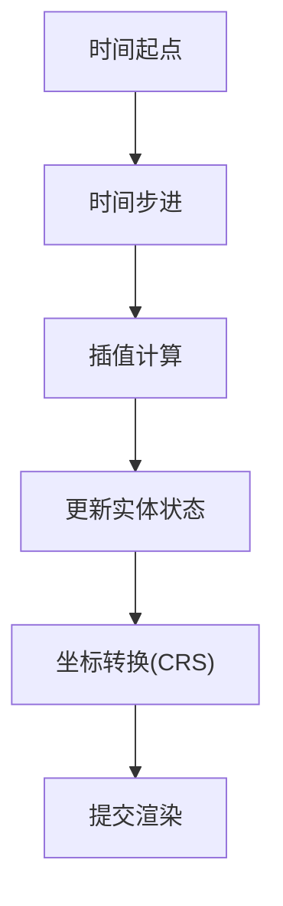

**图表来源**
- [crs.rs:1-200](file://cesiumrust/domain/crs/src/lib.rs#L1-L200)
- [time.rs:1-200](file://cesiumrust/domain/time/src/lib.rs#L1-L200)
- [animation.rs:1-200](file://cesiumrust/domain/animation/src/lib.rs#L1-L200)

**章节来源**
- [crs.rs:1-200](file://cesiumrust/domain/crs/src/lib.rs#L1-L200)
- [time.rs:1-200](file://cesiumrust/domain/time/src/lib.rs#L1-L200)
- [animation.rs:1-200](file://cesiumrust/domain/animation/src/lib.rs#L1-L200)

### 材质与着色器（material/shaders）
- 材质系统：统一材质接口、参数绑定、PBR 与特殊效果。
- 着色器：顶点/片段着色器模板，支持大气辉光、体积云、水面反射等。

**更新** 支持高级纹理采样技术，包括三线性过滤和各向异性过滤，改善斜视角下的纹理质量。

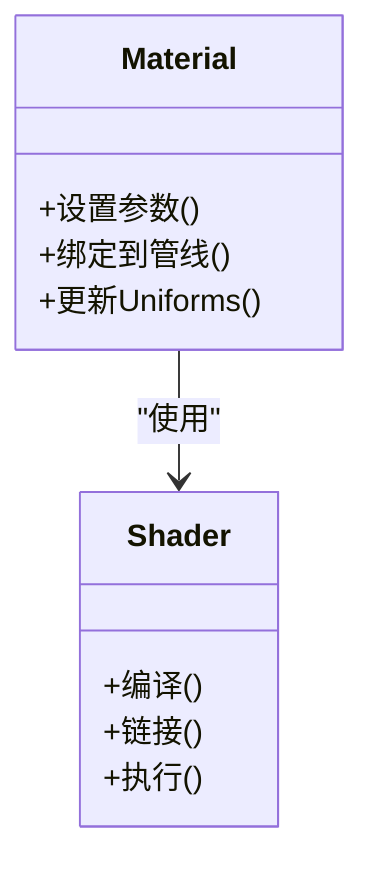

**图表来源**
- [shaders:1-200](file://cesiumrust/domain/material/shaders#L1-L200)

**章节来源**
- [shaders:1-200](file://cesiumrust/domain/material/shaders#L1-L200)

### 前端示例（CesiumViewer）
- CesiumViewer.js：初始化 Cesium Viewer、加载数据源、配置交互与样式。
- CesiumViewer.css：界面样式与布局。
- index.html：页面入口与脚本引入。

```mermaid
sequenceDiagram
participant HTML as "index.html"
participant JS as "CesiumViewer.js"
participant CSS as "CesiumViewer.css"
participant CESIUM as "CesiumJS"
HTML->>CSS : 加载样式
HTML->>JS : 加载脚本
JS->>CESIUM : 创建Viewer实例
JS->>CESIUM : 添加数据源/图层
CESIUM-->>HTML : 渲染到Canvas
```

**图表来源**
- [index.html:1-200](file://index.html#L1-L200)
- [CesiumViewer.js:1-200](file://Apps/CesiumViewer/CesiumViewer.js#L1-L200)
- [CesiumViewer.css:1-200](file://Apps/CesiumViewer/CesiumViewer.css#L1-L200)

**章节来源**
- [CesiumViewer.js:1-200](file://Apps/CesiumViewer/CesiumViewer.js#L1-L200)
- [CesiumViewer.css:1-200](file://Apps/CesiumViewer/CesiumViewer.css#L1-L200)
- [index.html:1-200](file://index.html#L1-L200)

## 依赖关系分析
- 应用对领域的依赖：cesium-app 依赖 domain/* 提供的地球、场景、地形、影像、瓦片集等能力。
- 领域间的耦合：scene 聚合 globe、terrain、imagery、tileset；time/animation 驱动状态更新；crs 被多处用于坐标转换。
- 适配层解耦：bevy-render 等适配器屏蔽底层渲染差异，使领域层保持独立。
- 资源与提供者：resource 与 provider 为 tileset/terrain/imagery 提供统一的加载与缓存机制。

**重大更新** 新增了全分辨率基础层、优化的下载优先级、重写的瓦片驱逐算法等核心依赖，为整个渲染管线提供强大的性能优化和功能增强。

```mermaid
graph LR
App["cesium-app"] --> DomainGlobe["globe"]
App --> DomainScene["scene"]
DomainScene --> DomainTerrain["terrain"]
DomainScene --> DomainImagery["imagery"]
DomainScene --> DomainTileset["tileset"]
DomainScene --> DomainTime["time"]
DomainScene --> DomainAnimation["animation"]
DomainScene --> DomainCRS["crs"]
DomainTileset --> DomainResource["resource"]
DomainTileset --> DomainProvider["provider"]
DomainTerrain --> DomainResource
DomainImagery --> DomainResource
DomainGlobe --> DomainCRS
DomainScene --> DomainQuadtree["四叉树(KICK规则)"]
DomainScene --> DomainSyncVis["同步可见性"]
DomainScene --> DomainBudget["budget"]
DomainScene --> DomainTextureTrack["texture tracking"]
DomainScene --> DomainDownloadSys["高并发下载系统"]
DomainScene --> DomainBaseLayer["全分辨率基础层"]
DomainScene --> DomainSmoothTransition["平滑收起系统"]
DomainScene --> DomainCoverageFix["覆盖修复机制"]
DomainScene --> DomainHiddenWarm["隐藏瓦片预热"]
```

**图表来源**
- [main.rs:1-200](file://cesiumrust/application/cesium-app/src/main.rs#L1-L200)
- [scene.rs:1-200](file://cesiumrust/domain/scene/src/lib.rs#L1-L200)
- [terrain.rs:1-200](file://cesiumrust/domain/terrain/src/lib.rs#L1-L200)
- [imagery.rs:1-200](file://cesiumrust/domain/imagery/src/lib.rs#L1-L200)
- [tileset.rs:1-200](file://cesiumrust/domain/tileset/src/lib.rs#L1-L200)
- [resource.rs:1-200](file://cesiumrust/domain/resource/src/lib.rs#L1-L200)
- [provider.rs:1-200](file://cesiumrust/domain/provider/src/lib.rs#L1-L200)
- [crs.rs:1-200](file://cesiumrust/domain/crs/src/lib.rs#L1-L200)
- [time.rs:1-200](file://cesiumrust/domain/time/src/lib.rs#L1-L200)
- [animation.rs:1-200](file://cesiumrust/domain/animation/src/lib.rs#L1-L200)

**章节来源**
- [main.rs:1-200](file://cesiumrust/application/cesium-app/src/main.rs#L1-L200)
- [scene.rs:1-200](file://cesiumrust/domain/scene/src/lib.rs#L1-L200)
- [tileset.rs:1-200](file://cesiumrust/domain/tileset/src/lib.rs#L1-L200)
- [resource.rs:1-200](file://cesiumrust/domain/resource/src/lib.rs#L1-L200)
- [provider.rs:1-200](file://cesiumrust/domain/provider/src/lib.rs#L1-L200)

## 性能考量
- 瓦片与LOD：依据视距与屏幕误差动态调整地形与影像分辨率，减少带宽与显存占用。
- 并行与异步：资源加载与解码采用异步任务，避免阻塞主线程。
- 批处理与合并：同类瓦片与几何体批量提交，降低绘制调用次数。
- 缓存策略：本地与内存缓存结合，命中率高时显著降低重复加载。
- 可视裁剪：视锥剔除与遮挡剔除，仅渲染可见区域。
- 指标监控：通过 performance 模块采集帧率、GPU/CPU 指标，辅助优化。

**重大更新** 新增了以下性能优化特性：
- **全分辨率基础层**：提供高质量初始覆盖，避免初始加载时的视觉空洞
- **优化的下载优先级**：阈值从160.0调整为64.0，改善瓦片加载的视觉连续性
- **重写的瓦片驱逐算法**：解决缩放时的视觉伪影问题，提供更好的用户体验
- **增强的隐藏瓦片预热**：通过改进的LRU策略消除缩放闪烁
- **高并发下载**：16线程并行下载，显著提升瓦片加载速度
- **智能LOD选择**：基于屏幕空间误差的智能瓦片细化，确保视图中心的高清晰度
- **平滑收起系统**：相机模式间流畅过渡，提升用户体验
- **增强覆盖修复**：智能处理无数据瓦片，保证渲染连续性
- **扩展缩放范围**：支持从全球概览到街道级的详细视图
- **预算化管理**：每帧资源使用限制，防止渲染卡顿
- **GPU资源缓存**：重用已创建的GPU资源，减少重复上传
- **祖先链保护**：防止快速缩放时出现渲染空洞
- **简化的清理过程**：专注于硬容量压力驱逐，提高内存管理效率

## 故障排查指南
- 瓦片加载失败
  - 检查 provider 配置与网络可达性。
  - 查看资源加载日志与重试策略。
  - 确认 CORS 与鉴权头是否正确。
- 渲染异常
  - 校验着色器编译与链接结果。
  - 检查材质参数与 Uniform 绑定。
  - 确认场景图节点状态与可见性。
- 性能下降
  - 分析瓦片数量与分辨率，适当提高 LOD 阈值。
  - 启用批处理与合并，减少绘制批次。
  - 利用性能模块定位瓶颈（CPU/GPU/IO）。
- 坐标与时间问题
  - 核对 CRS 转换参数与单位。
  - 检查时间范围与插值函数是否合理。

**重大更新** 新增以下故障排查要点：
- **基础层加载问题**：检查全分辨率基础层的预加载和切换逻辑
- **下载优先级问题**：验证64.0阈值配置的正确性和下载调度逻辑
- **瓦片驱逐问题**：检查重写的驱逐算法是否正确处理各种边界情况
- **缩放闪烁问题**：验证隐藏瓦片预热机制和改进的LRU策略
- **KICK规则问题**：检查四叉树遍历的父子瓦片切换逻辑
- **同步可见性问题**：验证可见集合更新和瓦片隐藏机制
- **高并发下载问题**：检查16线程下载系统的负载分配和资源竞争
- **平滑收起问题**：验证相机模式过渡动画的配置和性能
- **覆盖修复问题**：检查无数据瓦片的继承逻辑和降级策略
- **缩放范围问题**：验证MIN_ZOOM和MAX_ZOOM的配置合理性
- **四叉树LOD问题**：检查屏幕空间误差阈值配置和瓦片细化逻辑
- **预算溢出**：调整每帧预算限制，平衡加载速度和渲染性能
- **内存泄漏**：监控GPU资源缓存大小，及时清理未使用的资源
- **纹理质量问题**：检查GPU纹理跟踪和自动分辨率升级功能
- **祖先链保护问题**：检查 protected_ancestors 函数的正确性和 has_live_ancestor 的使用
- **清理过程问题**：验证简化清理过程的硬容量压力驱逐逻辑

**章节来源**
- [provider.rs:1-200](file://cesiumrust/domain/provider/src/lib.rs#L1-L200)
- [resource.rs:1-200](file://cesiumrust/domain/resource/src/lib.rs#L1-L200)
- [shaders:1-200](file://cesiumrust/domain/material/shaders#L1-L200)
- [performance.rs:1-200](file://cesiumrust/domain/performance/src/lib.rs#L1-L200)
- [crs.rs:1-200](file://cesiumrust/domain/crs/src/lib.rs#L1-L200)
- [time.rs:1-200](file://cesiumrust/domain/time/src/lib.rs#L1-L200)

## 结论
该动态地球渲染系统通过清晰的领域划分与适配层解耦，实现了高内聚、低耦合的可扩展架构。前端 CesiumViewer 与 Rust 领域库协同工作，覆盖从数据加载、坐标转换、时间驱动到材质渲染的全链路。借助瓦片调度、LOD、批处理与缓存等机制，系统在大规模数据与复杂场景下仍保持良好性能。

**重大更新** 经过重大架构重构后，系统现在具备以下优势：
- **全分辨率基础层**：提供高质量初始覆盖，避免初始加载时的视觉空洞
- **优化的下载优先级**：阈值从160.0调整为64.0，显著改善瓦片加载的视觉连续性
- **重写的瓦片驱逐算法**：彻底解决缩放时的视觉伪影问题，提供更好的用户体验
- **增强的隐藏瓦片预热**：通过改进的LRU策略消除缩放闪烁
- **KICK规则遍历**：实现CesiumJS风格的瓦片替换逻辑，确保父子瓦片不会同时渲染
- **同步可见性系统**：严格分区渲染，避免z-fighting和重叠问题
- **增强的可见性计算**：基于屏幕空间误差的精确LOD选择
- **高并发下载**：16线程并行下载，显著提升瓦片加载速度
- **智能LOD控制**：基于屏幕空间误差的四叉树系统提供更精确的细节控制
- **高效资源管理**：预算化异步管道确保稳定的帧率和响应性
- **健壮的错误处理**：无数据瓦片处理保证渲染连续性
- **优化的用户体验**：高级纹理采样和渐进式加载提升视觉质量
- **完善的保护机制**：祖先链保护确保快速缩放时的渲染稳定性
- **简化的清理过程**：专注于硬容量压力驱逐，提高内存管理效率

建议在生产环境中结合性能监控与测试套件持续优化，确保稳定性与用户体验。

## 附录
- 快速开始
  - 前端：打开 index.html 或运行 CesiumViewer 示例。
  - Rust：构建并运行 cesium-app，观察动态地球与交互。
- 测试
  - 使用 Specs 中的 Cesium3DTilesTester、createGlobe、createScene 等工具进行回归与集成测试。

**重大更新** 新增测试重点：
- **基础层测试**：验证全分辨率基础层的预加载和切换逻辑
- **下载优先级测试**：检查64.0阈值配置的正确性和下载调度效果
- **瓦片驱逐测试**：验证重写的驱逐算法在各种边界情况下的行为
- **隐藏瓦片预热测试**：验证改进的LRU策略和缩放闪烁消除效果
- **KICK规则测试**：验证四叉树遍历的父子瓦片切换逻辑
- **同步可见性测试**：检查可见集合更新和瓦片隐藏机制
- **高并发下载系统测试**：验证16线程下载的负载均衡和错误恢复
- **平滑收起测试**：测试相机模式过渡动画的性能和质量
- **覆盖修复测试**：验证无数据瓦片的继承逻辑和降级策略
- **缩放范围测试**：检查MIN_ZOOM和MAX_ZOOM的配置合理性
- **四叉树LOD算法的正确性测试**
- **预算管理系统在不同负载下的行为验证**
- **GPU资源缓存的效率评估**
- **祖先链保护机制的有效性测试**
- **简化清理过程的硬容量压力驱逐测试**

**章节来源**
- [Cesium3DTilesTester.js:1-200](file://Specs/Cesium3DTilesTester.js#L1-L200)
- [createGlobe.js:1-200](file://Specs/createGlobe.js#L1-L200)
- [createScene.js:1-200](file://Specs/createScene.js#L1-L200)
- [quadtree_cache_spec.rs:1-272](file://cesiumrust/specs/tests/scene/quadtree_cache_spec.rs#L1-L272)
- [quadtree_traversal_extended_spec.rs:1-315](file://cesiumrust/specs/tests/scene/quadtree_traversal_extended_spec.rs#L1-L315)