# 动态地球渲染系统

<cite>
**本文引用的文件**
- [README.md](file://README.md)
- [package.json](file://package.json)
- [index.html](file://index.html)
- [CesiumViewer.js](file://Apps/CesiumViewer/CesiumViewer.js)
- [CesiumViewer.css](file://Apps/CesiumViewer/CesiumViewer.css)
- [main.rs](file://cesiumrust/application/cesium-app/src/main.rs)
- [dynamic_globe.rs](file://cesiumrust/application/cesium-app/src/dynamic_globe.rs)
- [tile_mesh.rs](file://cesiumrust/application/cesium-app/src/tile_mesh.rs)
- [orbit_camera.rs](file://cesiumrust/application/cesium-app/src/orbit_camera.rs)
- [starfield.rs](file://cesiumrust/application/cesium-app/src/starfield.rs)
- [material_showcase.rs](file://cesiumrust/application/cesium-app/src/material_showcase.rs)
- [geometry_showcase.rs](file://cesiumrust/application/cesium-app/src/geometry_showcase.rs)
- [globe.rs](file://cesiumrust/domain/globe/src/lib.rs)
- [scene.rs](file://cesiumrust/domain/scene/src/lib.rs)
- [terrain.rs](file://cesiumrust/domain/terrain/src/lib.rs)
- [imagery.rs](file://cesiumrust/domain/imagery/src/lib.rs)
- [tileset.rs](file://cesiumrust/domain/tileset/src/lib.rs)
- [crs.rs](file://cesiumrust/domain/crs/src/lib.rs)
- [time.rs](file://cesiumrust/domain/time/src/lib.rs)
- [animation.rs](file://cesiumrust/domain/animation/src/lib.rs)
- [provider.rs](file://cesiumrust/domain/provider/src/lib.rs)
- [resource.rs](file://cesiumrust/domain/resource/src/lib.rs)
- [performance.rs](file://cesiumrust/domain/performance/src/lib.rs)
- [quadtree_lib.rs](file://cesiumrust/domain/quadtree/src/lib.rs)
- [quadtree_traversal.rs](file://cesiumrust/domain/quadtree/src/traversal.rs)
- [quadtree_cache.rs](file://cesiumrust/domain/quadtree/src/cache.rs)
- [shaders](file://cesiumrust/domain/material/shaders)
- [Cesium3DTilesTester.js](file://Specs/Cesium3DTilesTester.js)
- [createGlobe.js](file://Specs/createGlobe.js)
- [createScene.js](file://Specs/createScene.js)
</cite>

## 更新摘要
**所做更改**
- 增强了瓦片管理系统，实现了GPU纹理跟踪、自动分辨率升级和相机自适应LOD过渡
- 改进了内存管理中的驱逐逻辑，支持更高效的GPU资源缓存和清理
- 新增了智能的无数据瓦片处理机制，确保渲染连续性
- 优化了预算化异步管道，提供更稳定的帧率和响应性

## 目录
1. [简介](#简介)
2. [项目结构](#项目结构)
3. [核心组件](#核心组件)
4. [架构总览](#架构总览)
5. [详细组件分析](#详细组件分析)
6. [依赖关系分析](#依赖关系分析)
7. [性能考量](#性能考量)
8. [故障排查指南](#故障排查指南)
9. [结论](#结论)
10. [附录](#附录)

## 简介
本仓库是一个面向"动态地球渲染"的混合工程：前端基于 CesiumJS（JavaScript）提供强大的三维地理可视化能力，后端与渲染管线通过 Rust 模块进行扩展与集成。Rust 侧采用领域驱动与模块化设计，涵盖地形、影像、瓦片集、坐标参考系、时间/动画、材质与着色器、场景管理等关键子系统；应用层示例展示了动态地球、轨道相机、星空背景、材质与几何展示等典型用法。整体目标是构建一个可扩展、高性能、可测试的动态地球渲染系统，支持多源数据加载、按需调度与实时渲染。

**更新** 系统经历了重大架构重构，从简单的缩放级别瓦片管理器转变为基于屏幕空间误差(SSE)的复杂四叉树LOD系统，新增了预算化异步管道架构、高级纹理采样、优先级请求调度、每帧预算管理、GPU资源缓存和无数据瓦片处理等核心功能。最新的更新进一步增强了GPU纹理跟踪、自动分辨率升级、相机自适应LOD过渡和改进的驱逐逻辑。

## 项目结构
仓库由三大层次构成：
- 应用与示例（Apps）：包含 CesiumViewer 示例页面与资源，用于快速验证与演示。
- 引擎与规范（Source/Specs/Packages）：CesiumJS 源码与测试套件，覆盖 3D Tiles、地形、影像、模型等大量用例。
- Rust 领域与应用（cesiumrust）：以 Cargo workspace 组织的多 crate 领域库与示例应用，聚焦地球渲染核心能力与集成。

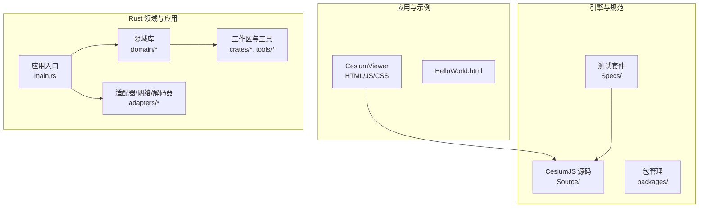

图表来源
- [CesiumViewer.js:1-200](file://Apps/CesiumViewer/CesiumViewer.js#L1-L200)
- [main.rs:1-200](file://cesiumrust/application/cesium-app/src/main.rs#L1-L200)
- [globe.rs:1-200](file://cesiumrust/domain/globe/src/lib.rs#L1-L200)

章节来源
- [README.md:1-200](file://README.md#L1-L200)
- [package.json:1-200](file://package.json#L1-L200)
- [index.html:1-200](file://index.html#L1-L200)

## 核心组件
- 地球与场景
  - 地球抽象与渲染上下文：封装球体、坐标系、投影、可见性裁剪等。
  - 场景图与渲染循环：负责帧更新、绘制队列、状态同步。
- 数据与资源
  - 地形与影像：分层加载、LOD 控制、缓存与并发下载。
  - 瓦片集（Tileset）：3D Tiles 解析、调度、显存管理与批处理。
  - 资源管理：统一生命周期、引用计数与内存回收。
- 坐标与时间
  - 坐标参考系（CRS）：WGS84、Web Mercator、ECEF 等转换。
  - 时间与动画：时间步进、插值、轨迹与关键帧。
- 材质与着色器
  - 材质系统与着色器模板：PBR、透明、体积光、大气辉光等。
- 交互与相机
  - 轨道相机、拾取、事件分发、缩放/旋转/平移。
- 性能与监控
  - 帧率统计、GPU/CPU 指标、可视区域裁剪、异步任务调度。

**更新** 新增了基于屏幕空间误差的四叉树LOD系统，实现了更精细的视距相关细节控制，并增强了GPU纹理跟踪和自动分辨率升级功能。

章节来源
- [globe.rs:1-200](file://cesiumrust/domain/globe/src/lib.rs#L1-L200)
- [scene.rs:1-200](file://cesiumrust/domain/scene/src/lib.rs#L1-L200)
- [terrain.rs:1-200](file://cesiumrust/domain/terrain/src/lib.rs#L1-L200)
- [imagery.rs:1-200](file://cesiumrust/domain/imagery/src/lib.rs#L1-L200)
- [tileset.rs:1-200](file://cesiumrust/domain/tileset/src/lib.rs#L1-L200)
- [crs.rs:1-200](file://cesiumrust/domain/crs/src/lib.rs#L1-L200)
- [time.rs:1-200](file://cesiumrust/domain/time/src/lib.rs#L1-L200)
- [animation.rs:1-200](file://cesiumrust/domain/animation/src/lib.rs#L1-L200)
- [provider.rs:1-200](file://cesiumrust/domain/provider/src/lib.rs#L1-L200)
- [resource.rs:1-200](file://cesiumrust/domain/resource/src/lib.rs#L1-L200)
- [performance.rs:1-200](file://cesiumrust/domain/performance/src/lib.rs#L1-L200)

## 架构总览
系统采用分层与领域驱动相结合的设计：
- 表现层（应用示例）：CesiumViewer 与 Rust 示例应用，负责用户交互与演示。
- 领域层（domain/*）：按职责拆分的子域，如 globe、scene、terrain、imagery、tileset、crs、time、animation、provider、resource、performance 等。
- 适配层（adapters/*）：对接具体渲染框架（如 Bevy）、网络栈与解码器。
- 基础设施（crates/*, tools/*）：通用工具、主题、UI 组件与工作区配置。

**更新** 新的架构引入了基于屏幕空间误差的四叉树遍历系统和预算化的异步处理管道，提供了更智能的LOD选择、GPU纹理跟踪和资源管理能力。

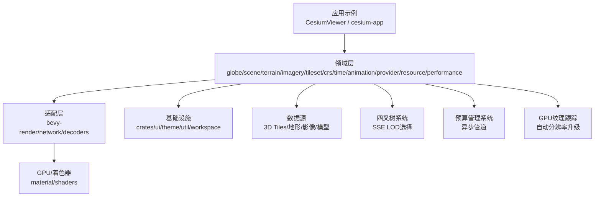

图表来源
- [main.rs:1-200](file://cesiumrust/application/cesium-app/src/main.rs#L1-L200)
- [globe.rs:1-200](file://cesiumrust/domain/globe/src/lib.rs#L1-L200)
- [scene.rs:1-200](file://cesiumrust/domain/scene/src/lib.rs#L1-L200)
- [terrain.rs:1-200](file://cesiumrust/domain/terrain/src/lib.rs#L1-L200)
- [imagery.rs:1-200](file://cesiumrust/domain/imagery/src/lib.rs#L1-L200)
- [tileset.rs:1-200](file://cesiumrust/domain/tileset/src/lib.rs#L1-L200)
- [shaders:1-200](file://cesiumrust/domain/material/shaders#L1-L200)

## 详细组件分析

### 应用入口与示例（cesium-app）
- main.rs：初始化应用、创建场景、注册系统、启动渲染循环。
- dynamic_globe.rs：动态地球的核心逻辑，包括地球显示、层级切换、交互响应。
- tile_mesh.rs：瓦片网格生成，支持UV映射和极地区域处理。
- orbit_camera.rs：轨道相机控制，实现缩放、旋转、平移与平滑过渡。
- starfield.rs：星空背景渲染，增强沉浸感。
- material_showcase.rs / geometry_showcase.rs：材质与几何体的演示入口，便于调试与对比。

**更新** dynamic_globe.rs现在实现了基于屏幕空间误差的四叉树LOD系统，支持预算化的异步处理、GPU纹理跟踪、自动分辨率升级和相机自适应LOD过渡。

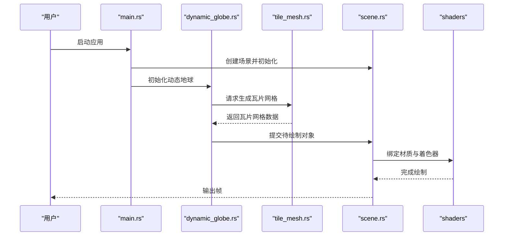

图表来源
- [main.rs:1-200](file://cesiumrust/application/cesium-app/src/main.rs#L1-L200)
- [dynamic_globe.rs:1-200](file://cesiumrust/application/cesium-app/src/dynamic_globe.rs#L1-L200)
- [tile_mesh.rs:1-200](file://cesiumrust/application/cesium-app/src/tile_mesh.rs#L1-L200)
- [scene.rs:1-200](file://cesiumrust/domain/scene/src/lib.rs#L1-L200)
- [shaders:1-200](file://cesiumrust/domain/material/shaders#L1-L200)

章节来源
- [main.rs:1-200](file://cesiumrust/application/cesium-app/src/main.rs#L1-L200)
- [dynamic_globe.rs:1-200](file://cesiumrust/application/cesium-app/src/dynamic_globe.rs#L1-L200)
- [tile_mesh.rs:1-200](file://cesiumrust/application/cesium-app/src/tile_mesh.rs#L1-L200)
- [orbit_camera.rs:1-200](file://cesiumrust/application/cesium-app/src/orbit_camera.rs#L1-L200)
- [starfield.rs:1-200](file://cesiumrust/application/cesium-app/src/starfield.rs#L1-L200)
- [material_showcase.rs:1-200](file://cesiumrust/application/cesium-app/src/material_showcase.rs#L1-L200)
- [geometry_showcase.rs:1-200](file://cesiumrust/application/cesium-app/src/geometry_showcase.rs#L1-L200)

### 增强的瓦片管理系统
**新增** 实现了全面的GPU纹理跟踪、自动分辨率升级和相机自适应LOD过渡功能。

#### GPU纹理跟踪
- `gpu_textures`：存储已创建的GPU纹理句柄，避免重复上传
- `gpu_tex_size`：记录每个纹理的源分辨率，支持自动分辨率升级
- `effective_tex`：维护瓦片的实际显示纹理（自身或继承祖先纹理）
- `gpu_tex_order`：FIFO顺序跟踪，用于LRU淘汰策略

#### 自动分辨率升级
- 检测小分辨率瓦片在投影变大时的需求
- 自动重新下载全分辨率纹理
- 无缝替换现有纹理，无需重新生成实体

#### 相机自适应LOD过渡
- `adaptive_tuck_step`：根据相机距离动态调整瓦片径向收缩步长
- `level_tuck`：为不同LOD级别计算合适的径向偏移
- 防止LOD边界处的接缝和z-fighting问题

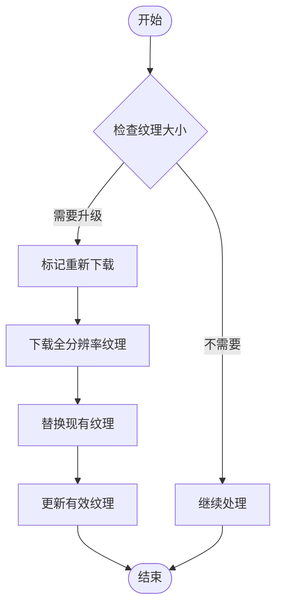

图表来源
- [dynamic_globe.rs:287-298](file://cesiumrust/application/cesium-app/src/dynamic_globe.rs#L287-L298)
- [dynamic_globe.rs:790-807](file://cesiumrust/application/cesium-app/src/dynamic_globe.rs#L790-L807)

章节来源
- [dynamic_globe.rs:78-132](file://cesiumrust/application/cesium-app/src/dynamic_globe.rs#L78-L132)
- [dynamic_globe.rs:287-298](file://cesiumrust/application/cesium-app/src/dynamic_globe.rs#L287-L298)
- [dynamic_globe.rs:790-807](file://cesiumrust/application/cesium-app/src/dynamic_globe.rs#L790-L807)
- [dynamic_globe.rs:1114-1123](file://cesiumrust/application/cesium-app/src/dynamic_globe.rs#L1114-L1123)

### 改进的驱逐逻辑
**新增** 实现了更智能的GPU资源缓存管理和内存驱逐策略。

#### 智能驱逐算法
- `evict_gpu_cache`：FIFO淘汰最旧的GPU句柄
- 保护活动实体的资源：避免释放仍在使用的GPU内存
- 分级驱逐策略：优先驱逐有活动祖先的瓦片

#### 内存管理优化
- `MAX_TILE_ENTITIES`：限制同时存在的瓦片实体数量（1100个）
- `MAX_GPU_CACHE_ENTRIES`：限制GPU缓存条目数量（3000个）
- 渐进式清理：每帧最多驱逐24个实体，避免CPU峰值

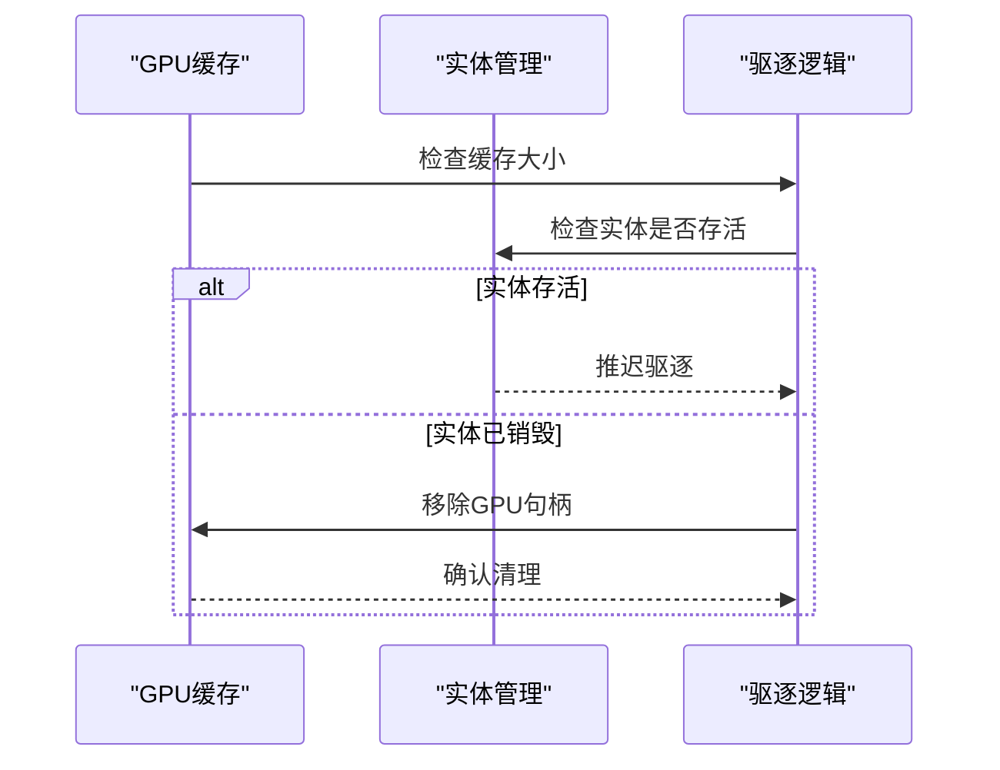

图表来源
- [dynamic_globe.rs:952-978](file://cesiumrust/application/cesium-app/src/dynamic_globe.rs#L952-L978)

章节来源
- [dynamic_globe.rs:952-978](file://cesiumrust/application/cesium-app/src/dynamic_globe.rs#L952-L978)
- [dynamic_globe.rs:842-906](file://cesiumrust/application/cesium-app/src/dynamic_globe.rs#L842-L906)

### 四叉树LOD系统
**新增** 基于屏幕空间误差的四叉树系统，实现了智能的LOD选择和瓦片细化决策。

- quadtree_traversal.rs：四叉树遍历算法，计算屏幕空间误差，决定瓦片细化策略。
- quadtree_cache.rs：瓦片缓存和加载队列管理，支持优先级调度和LRU淘汰。
- quadtree_lib.rs：四叉树系统的公共接口和配置管理。

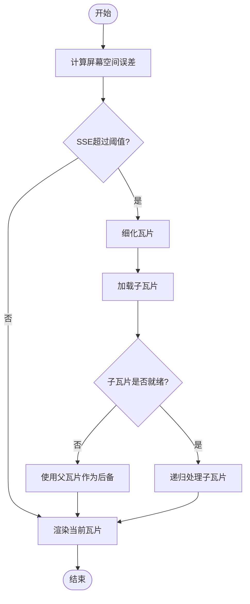

图表来源
- [dynamic_globe.rs:998-1072](file://cesiumrust/application/cesium-app/src/dynamic_globe.rs#L998-L1072)

章节来源
- [dynamic_globe.rs:998-1072](file://cesiumrust/application/cesium-app/src/dynamic_globe.rs#L998-L1072)

### 预算化异步管道
**新增** 实现了类似CesiumJS的每帧预算管理系统，确保渲染流畅性和响应性。

- 每帧预算限制：控制每个渲染帧的资源使用量
- 优先级调度：根据瓦片在屏幕上的重要性分配优先级
- 异步处理：并行下载和网格生成，避免阻塞主线程
- 资源缓存：GPU资源复用，减少重复上传开销

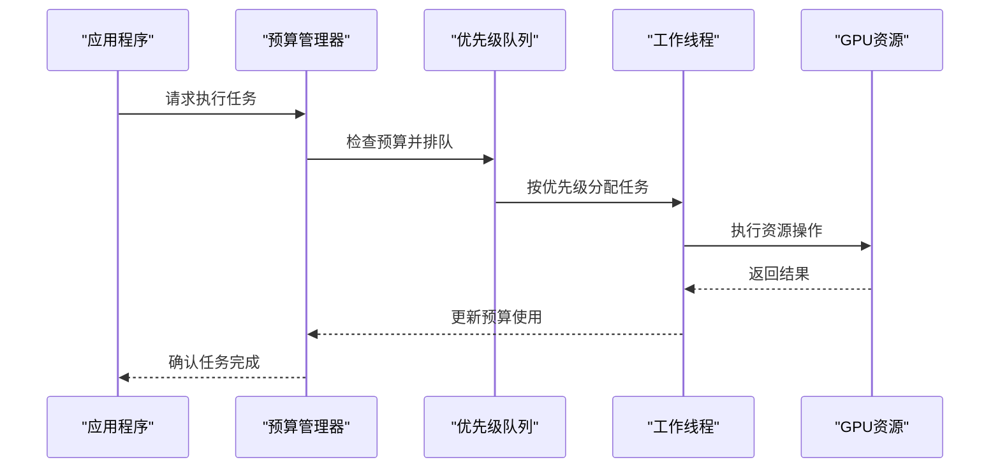

图表来源
- [dynamic_globe.rs:47-63](file://cesiumrust/application/cesium-app/src/dynamic_globe.rs#L47-L63)

章节来源
- [dynamic_globe.rs:47-63](file://cesiumrust/application/cesium-app/src/dynamic_globe.rs#L47-L63)
- [dynamic_globe.rs:476-934](file://cesiumrust/application/cesium-app/src/dynamic_globe.rs#L476-L934)

### 地球与场景（globe/scene）
- globe：定义地球实体、坐标系、可见性与裁剪策略。
- scene：维护场景图、渲染队列、状态机与帧更新。

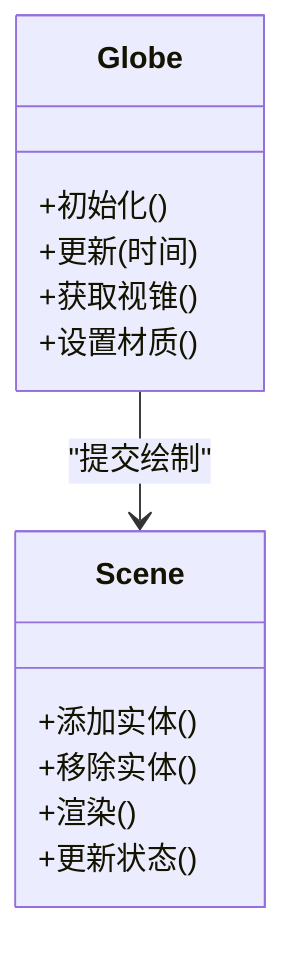

图表来源
- [globe.rs:1-200](file://cesiumrust/domain/globe/src/lib.rs#L1-L200)
- [scene.rs:1-200](file://cesiumrust/domain/scene/src/lib.rs#L1-L200)

章节来源
- [globe.rs:1-200](file://cesiumrust/domain/globe/src/lib.rs#L1-L200)
- [scene.rs:1-200](file://cesiumrust/domain/scene/src/lib.rs#L1-L200)

### 地形与影像（terrain/imagery）
- terrain：地形网格生成、LOD 控制、高度采样与缓存。
- imagery：影像图层叠加、透明度混合、切片调度与缓存。

**更新** 现在支持无数据瓦片处理，当瓦片不可用时自动继承祖先瓦片的纹理或使用纯色填充。

图表来源
- [terrain.rs:1-200](file://cesiumrust/domain/terrain/src/lib.rs#L1-L200)
- [imagery.rs:1-200](file://cesiumrust/domain/imagery/src/lib.rs#L1-L200)

章节来源
- [terrain.rs:1-200](file://cesiumrust/domain/terrain/src/lib.rs#L1-L200)
- [imagery.rs:1-200](file://cesiumrust/domain/imagery/src/lib.rs#L1-L200)

### 瓦片集与资源（tileset/resource）
- tileset：3D Tiles 解析、层级树构建、可视性判定与显存管理。
- resource：统一资源生命周期、引用计数、异步加载与错误恢复。

**更新** 增强了内存管理和缓存机制，支持更高效的资源复用和清理。

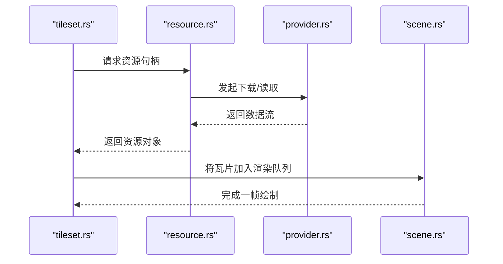

图表来源
- [tileset.rs:1-200](file://cesiumrust/domain/tileset/src/lib.rs#L1-L200)
- [resource.rs:1-200](file://cesiumrust/domain/resource/src/lib.rs#L1-L200)
- [provider.rs:1-200](file://cesiumrust/domain/provider/src/lib.rs#L1-L200)
- [scene.rs:1-200](file://cesiumrust/domain/scene/src/lib.rs#L1-L200)

章节来源
- [tileset.rs:1-200](file://cesiumrust/domain/tileset/src/lib.rs#L1-L200)
- [resource.rs:1-200](file://cesiumrust/domain/resource/src/lib.rs#L1-L200)
- [provider.rs:1-200](file://cesiumrust/domain/provider/src/lib.rs#L1-L200)

### 坐标与时间（crs/time/animation）
- crs：坐标参考系转换（WGS84、Web Mercator、ECEF）。
- time：时间步进、时钟、时间范围与插值。
- animation：关键帧、轨迹、属性动画与时间驱动更新。

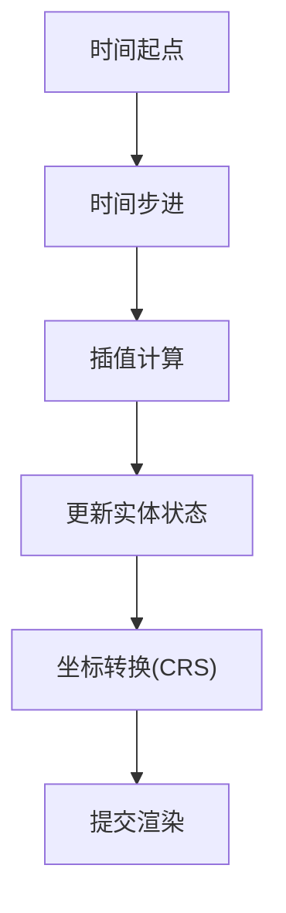

图表来源
- [crs.rs:1-200](file://cesiumrust/domain/crs/src/lib.rs#L1-L200)
- [time.rs:1-200](file://cesiumrust/domain/time/src/lib.rs#L1-L200)
- [animation.rs:1-200](file://cesiumrust/domain/animation/src/lib.rs#L1-L200)

章节来源
- [crs.rs:1-200](file://cesiumrust/domain/crs/src/lib.rs#L1-L200)
- [time.rs:1-200](file://cesiumrust/domain/time/src/lib.rs#L1-L200)
- [animation.rs:1-200](file://cesiumrust/domain/animation/src/lib.rs#L1-L200)

### 材质与着色器（material/shaders）
- 材质系统：统一材质接口、参数绑定、PBR 与特殊效果。
- 着色器：顶点/片段着色器模板，支持大气辉光、体积云、水面反射等。

**更新** 支持高级纹理采样技术，包括三线性过滤和各向异性过滤，改善斜视角下的纹理质量。

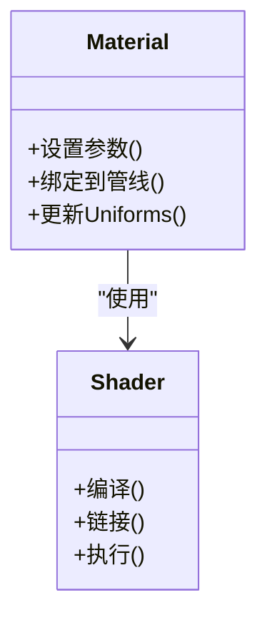

图表来源
- [shaders:1-200](file://cesiumrust/domain/material/shaders#L1-L200)

章节来源
- [shaders:1-200](file://cesiumrust/domain/material/shaders#L1-L200)

### 前端示例（CesiumViewer）
- CesiumViewer.js：初始化 Cesium Viewer、加载数据源、配置交互与样式。
- CesiumViewer.css：界面样式与布局。
- index.html：页面入口与脚本引入。

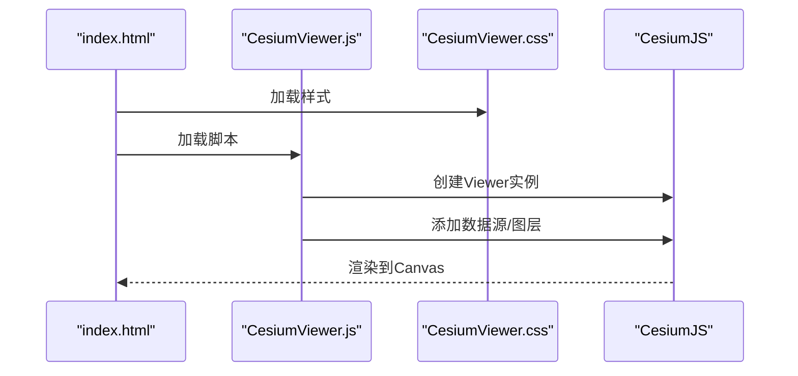

图表来源
- [index.html:1-200](file://index.html#L1-L200)
- [CesiumViewer.js:1-200](file://Apps/CesiumViewer/CesiumViewer.js#L1-L200)
- [CesiumViewer.css:1-200](file://Apps/CesiumViewer/CesiumViewer.css#L1-L200)

章节来源
- [CesiumViewer.js:1-200](file://Apps/CesiumViewer/CesiumViewer.js#L1-L200)
- [CesiumViewer.css:1-200](file://Apps/CesiumViewer/CesiumViewer.css#L1-L200)
- [index.html:1-200](file://index.html#L1-L200)

## 依赖关系分析
- 应用对领域的依赖：cesium-app 依赖 domain/* 提供的地球、场景、地形、影像、瓦片集等能力。
- 领域间的耦合：scene 聚合 globe、terrain、imagery、tileset；time/animation 驱动状态更新；crs 被多处用于坐标转换。
- 适配层解耦：bevy-render 等适配器屏蔽底层渲染差异，使领域层保持独立。
- 资源与提供者：resource 与 provider 为 tileset/terrain/imagery 提供统一的加载与缓存机制。

**更新** 新增了四叉树系统、预算管理系统和GPU纹理跟踪作为核心依赖，为整个渲染管线提供LOD控制、资源管理和纹理优化能力。

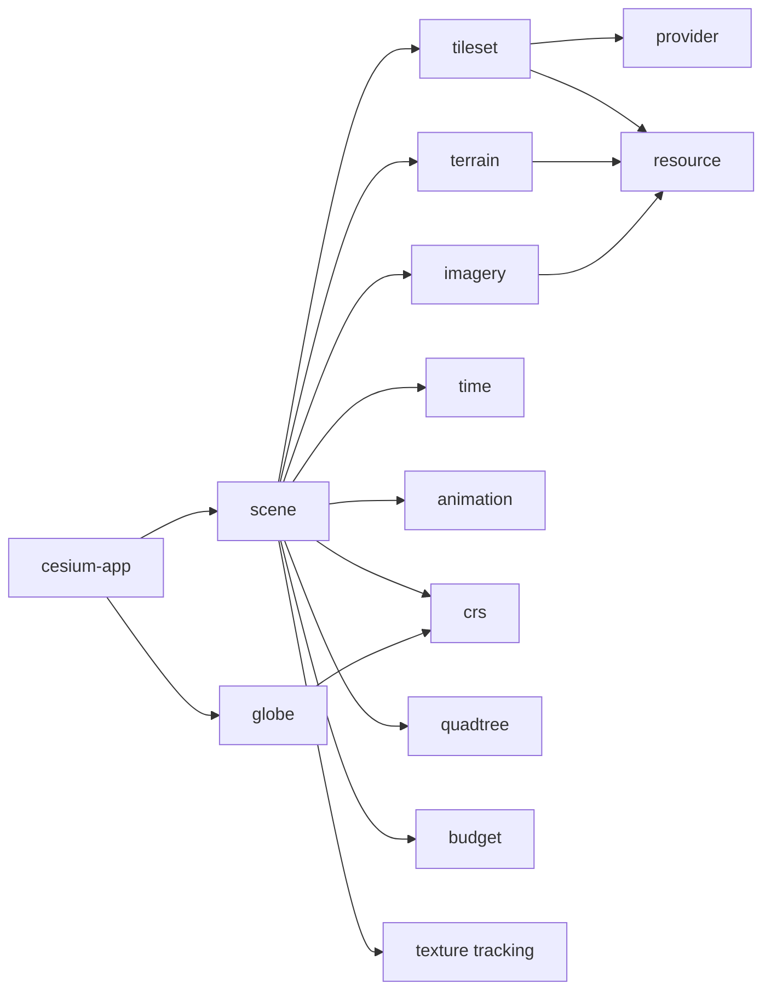

图表来源
- [main.rs:1-200](file://cesiumrust/application/cesium-app/src/main.rs#L1-L200)
- [scene.rs:1-200](file://cesiumrust/domain/scene/src/lib.rs#L1-L200)
- [terrain.rs:1-200](file://cesiumrust/domain/terrain/src/lib.rs#L1-L200)
- [imagery.rs:1-200](file://cesiumrust/domain/imagery/src/lib.rs#L1-L200)
- [tileset.rs:1-200](file://cesiumrust/domain/tileset/src/lib.rs#L1-L200)
- [resource.rs:1-200](file://cesiumrust/domain/resource/src/lib.rs#L1-L200)
- [provider.rs:1-200](file://cesiumrust/domain/provider/src/lib.rs#L1-L200)
- [crs.rs:1-200](file://cesiumrust/domain/crs/src/lib.rs#L1-L200)
- [time.rs:1-200](file://cesiumrust/domain/time/src/lib.rs#L1-L200)
- [animation.rs:1-200](file://cesiumrust/domain/animation/src/lib.rs#L1-L200)

章节来源
- [main.rs:1-200](file://cesiumrust/application/cesium-app/src/main.rs#L1-L200)
- [scene.rs:1-200](file://cesiumrust/domain/scene/src/lib.rs#L1-L200)
- [tileset.rs:1-200](file://cesiumrust/domain/tileset/src/lib.rs#L1-L200)
- [resource.rs:1-200](file://cesiumrust/domain/resource/src/lib.rs#L1-L200)
- [provider.rs:1-200](file://cesiumrust/domain/provider/src/lib.rs#L1-L200)

## 性能考量
- 瓦片与LOD：依据视距与屏幕误差动态调整地形与影像分辨率，减少带宽与显存占用。
- 并行与异步：资源加载与解码采用异步任务，避免阻塞主线程。
- 批处理与合并：同类瓦片与几何体批量提交，降低绘制调用次数。
- 缓存策略：本地与内存缓存结合，命中率高时显著降低重复加载。
- 可视裁剪：视锥剔除与遮挡剔除，仅渲染可见区域。
- 指标监控：通过 performance 模块采集帧率、GPU/CPU 指标，辅助优化。

**更新** 新增了以下性能优化特性：
- **屏幕空间误差LOD**：基于SSE的智能瓦片细化，确保视图中心的高清晰度
- **预算化管理**：每帧资源使用限制，防止渲染卡顿
- **优先级调度**：根据瓦片重要性和距离优化加载顺序
- **GPU资源缓存**：重用已创建的GPU资源，减少重复上传
- **无数据瓦片处理**：优雅降级，避免渲染空洞
- **GPU纹理跟踪**：智能纹理复用和自动分辨率升级
- **相机自适应LOD**：动态调整瓦片位置，消除LOD边界问题

## 故障排查指南
- 瓦片加载失败
  - 检查 provider 配置与网络可达性。
  - 查看资源加载日志与重试策略。
  - 确认 CORS 与鉴权头是否正确。
- 渲染异常
  - 校验着色器编译与链接结果。
  - 检查材质参数与 Uniform 绑定。
  - 确认场景图节点状态与可见性。
- 性能下降
  - 分析瓦片数量与分辨率，适当提高 LOD 阈值。
  - 启用批处理与合并，减少绘制批次。
  - 利用性能模块定位瓶颈（CPU/GPU/IO）。
- 坐标与时间问题
  - 核对 CRS 转换参数与单位。
  - 检查时间范围与插值函数是否合理。

**更新** 新增以下故障排查要点：
- **四叉树LOD问题**：检查屏幕空间误差阈值配置和瓦片细化逻辑
- **预算溢出**：调整每帧预算限制，平衡加载速度和渲染性能
- **内存泄漏**：监控GPU资源缓存大小，及时清理未使用的资源
- **无数据瓦片**：检查瓦片数据可用性，配置适当的降级策略
- **纹理质量问题**：检查GPU纹理跟踪和自动分辨率升级功能
- **LOD边界问题**：验证相机自适应LOD过渡参数设置

章节来源
- [provider.rs:1-200](file://cesiumrust/domain/provider/src/lib.rs#L1-L200)
- [resource.rs:1-200](file://cesiumrust/domain/resource/src/lib.rs#L1-L200)
- [shaders:1-200](file://cesiumrust/domain/material/shaders#L1-L200)
- [performance.rs:1-200](file://cesiumrust/domain/performance/src/lib.rs#L1-L200)
- [crs.rs:1-200](file://cesiumrust/domain/crs/src/lib.rs#L1-L200)
- [time.rs:1-200](file://cesiumrust/domain/time/src/lib.rs#L1-L200)

## 结论
该动态地球渲染系统通过清晰的领域划分与适配层解耦，实现了高内聚、低耦合的可扩展架构。前端 CesiumViewer 与 Rust 领域库协同工作，覆盖从数据加载、坐标转换、时间驱动到材质渲染的全链路。借助瓦片调度、LOD、批处理与缓存等机制，系统在大规模数据与复杂场景下仍保持良好性能。

**更新** 经过重大架构重构后，系统现在具备以下优势：
- **智能LOD控制**：基于屏幕空间误差的四叉树系统提供更精确的细节控制
- **高效资源管理**：预算化异步管道确保稳定的帧率和响应性
- **健壮的错误处理**：无数据瓦片处理保证渲染连续性
- **优化的用户体验**：高级纹理采样和渐进式加载提升视觉质量
- **先进的纹理管理**：GPU纹理跟踪和自动分辨率升级确保最佳图像质量
- **自适应渲染**：相机自适应LOD过渡消除渲染边界问题

建议在生产环境中结合性能监控与测试套件持续优化，确保稳定性与用户体验。

## 附录
- 快速开始
  - 前端：打开 index.html 或运行 CesiumViewer 示例。
  - Rust：构建并运行 cesium-app，观察动态地球与交互。
- 测试
  - 使用 Specs 中的 Cesium3DTilesTester、createGlobe、createScene 等工具进行回归与集成测试。

**更新** 新增测试重点：
- 四叉树LOD算法的正确性测试
- 预算管理系统在不同负载下的行为验证
- 无数据瓦片处理的兼容性测试
- GPU资源缓存的效率评估
- GPU纹理跟踪和自动分辨率升级功能测试
- 相机自适应LOD过渡效果验证

章节来源
- [Cesium3DTilesTester.js:1-200](file://Specs/Cesium3DTilesTester.js#L1-L200)
- [createGlobe.js:1-200](file://Specs/createGlobe.js#L1-L200)
- [createScene.js:1-200](file://Specs/createScene.js#L1-L200)