# 动态地球渲染系统

<cite>
**本文引用的文件**
- [README.md](file://README.md)
- [package.json](file://package.json)
- [index.html](file://index.html)
- [CesiumViewer.js](file://Apps/CesiumViewer/CesiumViewer.js)
- [CesiumViewer.css](file://Apps/CesiumViewer/CesiumViewer.css)
- [main.rs](file://cesiumrust/application/cesium-app/src/main.rs)
- [dynamic_globe.rs](file://cesiumrust/application/cesium-app/src/dynamic_globe.rs)
- [tile_mesh.rs](file://cesiumrust/application/cesium-app/src/tile_mesh.rs)
- [orbit_camera.rs](file://cesiumrust/application/cesium-app/src/orbit_camera.rs)
- [starfield.rs](file://cesiumrust/application/cesium-app/src/starfield.rs)
- [material_showcase.rs](file://cesiumrust/application/cesium-app/src/material_showcase.rs)
- [geometry_showcase.rs](file://cesiumrust/application/cesium-app/src/geometry_showcase.rs)
- [globe.rs](file://cesiumrust/domain/globe/src/lib.rs)
- [scene.rs](file://cesiumrust/domain/scene/src/lib.rs)
- [terrain.rs](file://cesiumrust/domain/terrain/src/lib.rs)
- [imagery.rs](file://cesiumrust/domain/imagery/src/lib.rs)
- [tileset.rs](file://cesiumrust/domain/tileset/src/lib.rs)
- [crs.rs](file://cesiumrust/domain/crs/src/lib.rs)
- [time.rs](file://cesiumrust/domain/time/src/lib.rs)
- [animation.rs](file://cesiumrust/domain/animation/src/lib.rs)
- [provider.rs](file://cesiumrust/domain/provider/src/lib.rs)
- [resource.rs](file://cesiumrust/domain/resource/src/lib.rs)
- [performance.rs](file://cesiumrust/domain/performance/src/lib.rs)
- [quadtree_lib.rs](file://cesiumrust/domain/quadtree/src/lib.rs)
- [traversal.rs](file://cesiumrust/domain/quadtree/src/traversal.rs)
- [traversal_system.rs](file://cesiumrust/adapters/bevy-render/src/tileset/traversal_system.rs)
- [quadtree_cache_spec.rs](file://cesiumrust/specs/tests/scene/quadtree_cache_spec.rs)
- [quadtree_traversal_extended_spec.rs](file://cesiumrust/specs/tests/scene/quadtree_traversal_extended_spec.rs)
- [shaders](file://cesiumrust/domain/material/shaders)
- [tiling_scheme.rs](file://cesiumrust/domain/provider/src/tiling_scheme.rs)
- [lib.rs](file://cesiumrust/adapters/network/src/lib.rs)
- [Cesium3DTilesTester.js](file://Specs/Cesium3DTilesTester.js)
- [createGlobe.js](file://Specs/createGlobe.js)
- [createScene.js](file://Specs/createScene.js)
</cite>

## 更新摘要
**所做更改**
- 实现了上采样瓦片显示系统，通过祖先纹理继承消除色块伪影
- 重构纹理下载系统为持久工作者池架构，提升并发性能
- 实现UV重映射系统处理多层级祖先纹理继承
- 增加下载队列重试冷却保护机制，防止服务器过载
- 增强网格生成和材质处理支持原子交换操作
- 优化瓦片访问和分区逻辑，改进KICK规则实现
- 显著改进错误处理和资源管理机制
- 优化基础层瓦片处理，始终绘制深蓝色默认颜色

## 目录
1. [简介](#简介)
2. [项目结构](#项目结构)
3. [核心组件](#核心组件)
4. [架构总览](#架构总览)
5. [详细组件分析](#详细组件分析)
6. [依赖关系分析](#依赖关系分析)
7. [性能考量](#性能考量)
8. [故障排查指南](#故障排查指南)
9. [结论](#结论)
10. [附录](#附录)

## 简介
本仓库是一个面向"动态地球渲染"的混合工程：前端基于 CesiumJS（JavaScript）提供强大的三维地理可视化能力，后端与渲染管线通过 Rust 模块进行扩展与集成。Rust 侧采用领域驱动与模块化设计，涵盖地形、影像、瓦片集、坐标参考系、时间/动画、材质与着色器、场景管理等关键子系统；应用层示例展示了动态地球、轨道相机、星空背景、材质与几何展示等典型用法。整体目标是构建一个可扩展、高性能、可测试的动态地球渲染系统，支持多源数据加载、按需调度与实时渲染。

**重大更新** 系统经过重大架构重构，新增了上采样瓦片显示系统消除色块伪影、持久工作者池架构的纹理下载系统、UV重映射系统处理祖先纹理继承、下载队列重试冷却保护、原子交换支持的网格生成和材质处理、优化的瓦片访问和分区逻辑、显著改进的错误处理和资源管理，以及优化的基础层瓦片处理始终绘制深蓝色默认颜色。

## 项目结构
仓库由三大层次构成：
- 应用与示例（Apps）：包含 CesiumViewer 示例页面与资源，用于快速验证与演示。
- 引擎与规范（Source/Specs/Packages）：CesiumJS 源码与测试套件，覆盖 3D Tiles、地形、影像、模型等大量用例。
- Rust 领域与应用（cesiumrust）：以 Cargo workspace 组织的多 crate 领域库与示例应用，聚焦地球渲染核心能力与集成。

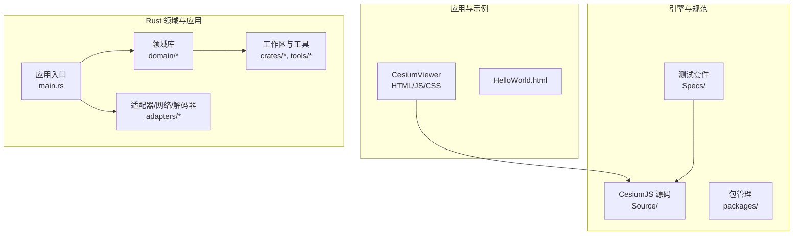

**图表来源**
- [CesiumViewer.js:1-200](file://Apps/CesiumViewer/CesiumViewer.js#L1-L200)
- [main.rs:1-200](file://cesiumrust/application/cesium-app/src/main.rs#L1-L200)
- [globe.rs:1-200](file://cesiumrust/domain/globe/src/lib.rs#L1-L200)

**章节来源**
- [README.md:1-200](file://README.md#L1-L200)
- [package.json:1-200](file://package.json#L1-L200)
- [index.html:1-200](file://index.html#L1-L200)

## 核心组件
- 地球与场景
  - 地球抽象与渲染上下文：封装球体、坐标系、投影、可见性裁剪等。
  - 场景图与渲染循环：负责帧更新、绘制队列、状态同步。
- 数据与资源
  - 地形与影像：分层加载、LOD 控制、缓存与并发下载。
  - 瓦片集（Tileset）：3D Tiles 解析、调度、显存管理与批处理。
  - 资源管理：统一生命周期、引用计数与内存回收。
- 坐标与时间
  - 坐标参考系（CRS）：WGS84、Web Mercator、ECEF 等转换。
  - 时间与动画：时间步进、插值、轨迹与关键帧。
- 材质与着色器
  - 材质系统与着色器模板：PBR、透明、体积光、大气辉光等。
- 交互与相机
  - 轨道相机、拾取、事件分发、缩放/旋转/平移。
- 性能与监控
  - 帧率统计、GPU/CPU 指标、可视区域裁剪、异步任务调度。

**重大更新** 新增了以下核心功能：
- **上采样瓦片显示系统**：通过祖先纹理继承消除色块伪影，提供更平滑的过渡效果
- **持久工作者池架构**：16个持久工作线程，显著提升下载性能和连接复用
- **UV重映射系统**：支持多层级祖先纹理的精确UV重映射
- **重试冷却保护**：智能重试机制防止服务器过载
- **原子交换支持**：网格和材质的原子性交换，确保渲染一致性
- **增强的KICK规则**：改进的瓦片替换逻辑，避免父子瓦片重叠
- **深度错误处理**：全面的错误恢复和资源管理机制
- **基础层优化**：始终绘制深蓝色默认颜色，提供更好的视觉体验

**章节来源**
- [globe.rs:1-200](file://cesiumrust/domain/globe/src/lib.rs#L1-L200)
- [scene.rs:1-200](file://cesiumrust/domain/scene/src/lib.rs#L1-L200)
- [terrain.rs:1-200](file://cesiumrust/domain/terrain/src/lib.rs#L1-L200)
- [imagery.rs:1-200](file://cesiumrust/domain/imagery/src/lib.rs#L1-L200)
- [tileset.rs:1-200](file://cesiumrust/domain/tileset/src/lib.rs#L1-L200)
- [crs.rs:1-200](file://cesiumrust/domain/crs/src/lib.rs#L1-L200)
- [time.rs:1-200](file://cesiumrust/domain/time/src/lib.rs#L1-L200)
- [animation.rs:1-200](file://cesiumrust/domain/animation/src/lib.rs#L1-L200)
- [provider.rs:1-200](file://cesiumrust/domain/provider/src/lib.rs#L1-L200)
- [resource.rs:1-200](file://cesiumrust/domain/resource/src/lib.rs#L1-L200)
- [performance.rs:1-200](file://cesiumrust/domain/performance/src/lib.rs#L1-L200)

## 架构总览
系统采用分层与领域驱动相结合的设计：
- 表现层（应用示例）：CesiumViewer 与 Rust 示例应用，负责用户交互与演示。
- 领域层（domain/*）：按职责拆分的子域，如 globe、scene、terrain、imagery、tileset、crs、time、animation、provider、resource、performance 等。
- 适配层（adapters/*）：对接具体渲染框架（如 Bevy）、网络栈与解码器。
- 基础设施（crates/*, tools/*）：通用工具、主题、UI 组件与工作区配置。

**重大更新** 新的架构引入了上采样瓦片显示系统、持久工作者池架构、UV重映射系统等改进，提供了更强大的性能优化和用户体验改进。

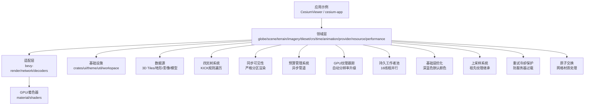

**图表来源**
- [main.rs:1-200](file://cesiumrust/application/cesium-app/src/main.rs#L1-L200)
- [globe.rs:1-200](file://cesiumrust/domain/globe/src/lib.rs#L1-L200)
- [scene.rs:1-200](file://cesiumrust/domain/scene/src/lib.rs#L1-L200)
- [terrain.rs:1-200](file://cesiumrust/domain/terrain/src/lib.rs#L1-L200)
- [imagery.rs:1-200](file://cesiumrust/domain/imagery/src/lib.rs#L1-L200)
- [tileset.rs:1-200](file://cesiumrust/domain/tileset/src/lib.rs#L1-L200)
- [shaders:1-200](file://cesiumrust/domain/material/shaders#L1-L200)

## 详细组件分析

### 应用入口与示例（cesium-app）
- main.rs：初始化应用、创建场景、注册系统、启动渲染循环。
- dynamic_globe.rs：动态地球的核心逻辑，包括地球显示、层级切换、交互响应。
- tile_mesh.rs：瓦片网格生成，支持UV映射和极地区域处理。
- orbit_camera.rs：轨道相机控制，实现缩放、旋转、平移与平滑过渡。
- starfield.rs：星空背景渲染，增强沉浸感。
- material_showcase.rs / geometry_showcase.rs：材质与几何体的演示入口，便于调试与对比。

**重大更新** dynamic_globe.rs现在实现了上采样瓦片显示系统、持久工作者池架构、UV重映射系统等改进，显著提升了性能和渲染质量。

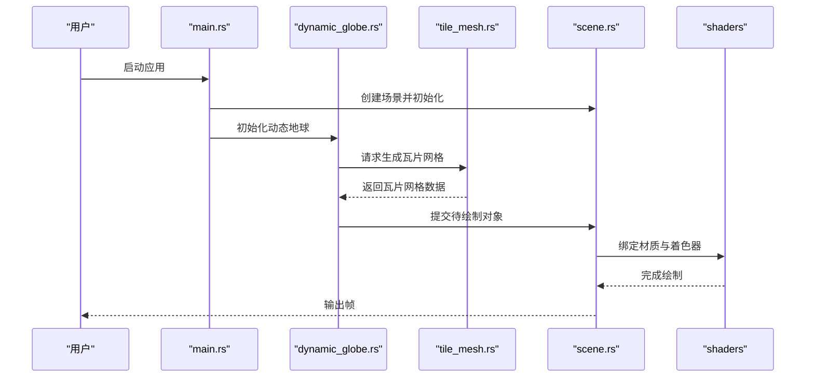

**图表来源**
- [main.rs:1-200](file://cesiumrust/application/cesium-app/src/main.rs#L1-L200)
- [dynamic_globe.rs:1-200](file://cesiumrust/application/cesium-app/src/dynamic_globe.rs#L1-L200)
- [tile_mesh.rs:1-200](file://cesiumrust/application/cesium-app/src/tile_mesh.rs#L1-L200)
- [scene.rs:1-200](file://cesiumrust/domain/scene/src/lib.rs#L1-L200)
- [shaders:1-200](file://cesiumrust/domain/material/shaders#L1-L200)

**章节来源**
- [main.rs:1-200](file://cesiumrust/application/cesium-app/src/main.rs#L1-L200)
- [dynamic_globe.rs:1-200](file://cesiumrust/application/cesium-app/src/dynamic_globe.rs#L1-L200)
- [tile_mesh.rs:1-200](file://cesiumrust/application/cesium-app/src/tile_mesh.rs#L1-L200)
- [orbit_camera.rs:1-200](file://cesiumrust/application/cesium-app/src/orbit_camera.rs#L1-L200)
- [starfield.rs:1-200](file://cesiumrust/application/cesium-app/src/starfield.rs#L1-L200)
- [material_showcase.rs:1-200](file://cesiumrust/application/cesium-app/src/material_showcase.rs#L1-L200)
- [geometry_showcase.rs:1-200](file://cesiumrust/application/cesium-app/src/geometry_showcase.rs#L1-L200)

### 上采样瓦片显示系统
**重大更新** 实现了上采样瓦片显示系统，通过祖先纹理继承消除色块伪影，提供更平滑的瓦片过渡效果。

#### 祖先纹理继承机制
- `effective_tex`：存储每个瓦片的实际显示纹理（自身或祖先纹理）
- `effective_uv`：记录UV重映射区域，支持多层级祖先纹理的精确采样
- `upsampled`：跟踪正在使用祖先纹理的瓦片，等待完整纹理到达后原子交换
- 智能继承：当瓦片不可用时，自动查找最近的有纹理祖先

#### UV重映射算法
- 计算祖先瓦片的UV区域：[au0, av0, au1, av1]
- 根据瓦片在祖先中的位置计算子区域：rx, ry
- 组合UV重映射：fu = (au1 - au0) / side, fv = (av1 - av0) / side
- 支持多层级继承：递归处理祖先的UV重映射

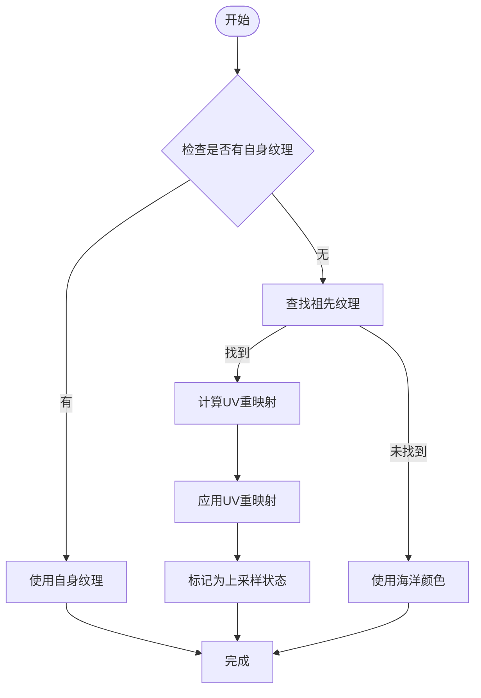

**图表来源**
- [dynamic_globe.rs:746-815](file://cesiumrust/application/cesium-app/src/dynamic_globe.rs#L746-L815)
- [dynamic_globe.rs:959-1024](file://cesiumrust/application/cesium-app/src/dynamic_globe.rs#L959-L1024)

**章节来源**
- [dynamic_globe.rs:746-815](file://cesiumrust/application/cesium-app/src/dynamic_globe.rs#L746-L815)
- [dynamic_globe.rs:959-1024](file://cesiumrust/application/cesium-app/src/dynamic_globe.rs#L959-L1024)
- [dynamic_globe.rs:1087-1110](file://cesiumrust/application/cesium-app/src/dynamic_globe.rs#L1087-L1110)

### 持久工作者池架构
**重大更新** 重构纹理下载系统为持久工作者池架构，使用16个持久工作线程，显著提升下载性能和连接复用。

#### 工作者池特性
- `DOWNLOAD_THREADS = 16`：16个持久工作线程
- 连接复用：每个工作者维护独立的HTTP连接池，重用TLS会话
- 负载均衡：轮询分配下载任务到不同工作者
- 智能跳过：检查wanted集合，跳过过时的下载任务

#### 下载流程优化
- 持久化工作者：线程和HTTP连接在整个应用生命周期内保持活跃
- 任务队列：通过mpsc通道接收下载任务
- 结果回调：下载完成后通过通道返回结果
- 错误处理：支持重试机制和超时处理

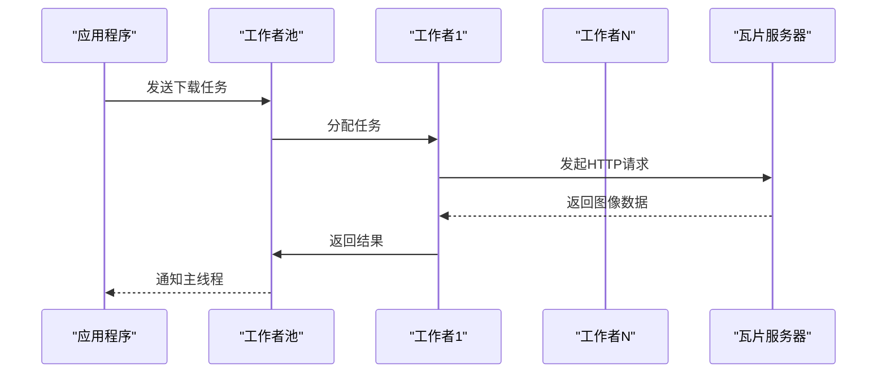

**图表来源**
- [dynamic_globe.rs:202-240](file://cesiumrust/application/cesium-app/src/dynamic_globe.rs#L202-L240)
- [dynamic_globe.rs:1964-2110](file://cesiumrust/application/cesium-app/src/dynamic_globe.rs#L1964-L2110)

**章节来源**
- [dynamic_globe.rs:202-240](file://cesiumrust/application/cesium-app/src/dynamic_globe.rs#L202-L240)
- [dynamic_globe.rs:1964-2110](file://cesiumrust/application/cesium-app/src/dynamic_globe.rs#L1964-L2110)

### 重试冷却保护机制
**重大更新** 增加下载队列重试冷却保护，防止服务器过载，提升系统稳定性。

#### 冷却机制实现
- `retry_after`：记录瓦片的下次重试时间
- 指数退避：失败后延迟重试，避免立即重复请求
- 冷却检查：在下载前检查是否已过冷却期
- 智能恢复：冷却结束后自动重新加入下载队列

#### 错误分类处理
- 占位符瓦片：Bing服务的无数据占位符图片
- 临时失败：网络超时、服务器繁忙等临时错误
- 永久失败：瓦片确实不存在或无法访问

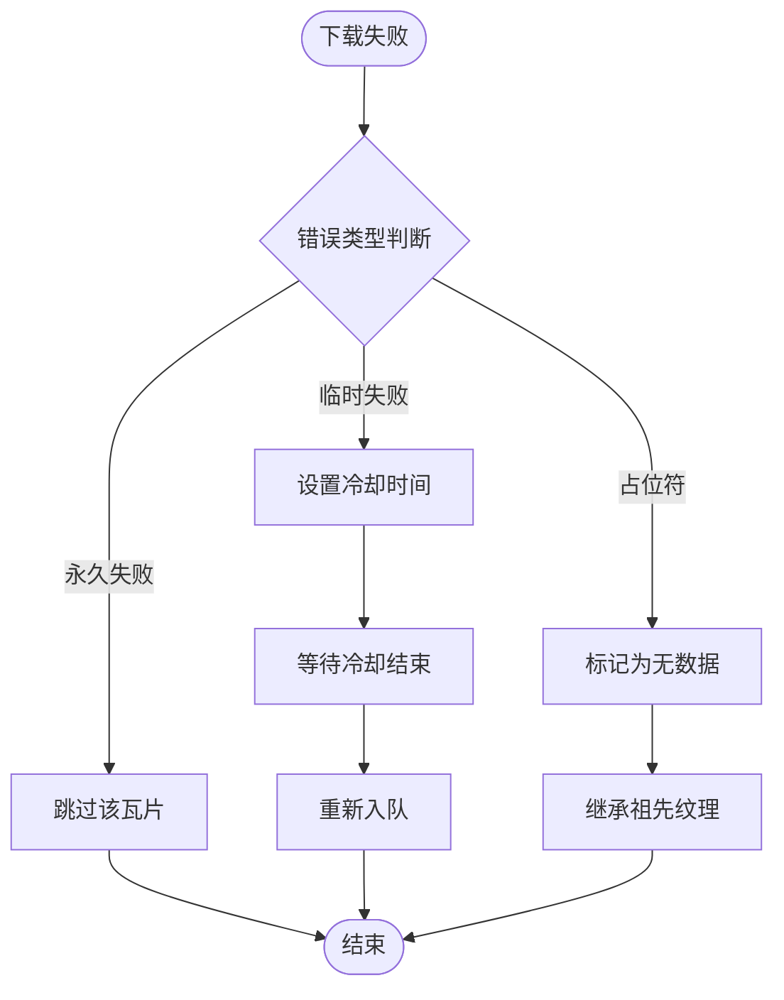

**图表来源**
- [dynamic_globe.rs:933-944](file://cesiumrust/application/cesium-app/src/dynamic_globe.rs#L933-L944)
- [dynamic_globe.rs:2007-2108](file://cesiumrust/application/cesium-app/src/dynamic_globe.rs#L2007-L2108)

**章节来源**
- [dynamic_globe.rs:933-944](file://cesiumrust/application/cesium-app/src/dynamic_globe.rs#L933-L944)
- [dynamic_globe.rs:2007-2108](file://cesiumrust/application/cesium-app/src/dynamic_globe.rs#L2007-L2108)

### 原子交换支持的网格和材质处理
**重大更新** 增强网格生成和材质处理，支持原子交换操作，确保渲染一致性。

#### 原子交换特性
- 网格原子交换：瓦片从UV重映射网格切换到真实网格时原子性交换
- 材质原子交换：纹理更新时不重新创建材质，只更新纹理引用
- 状态同步：确保网格和材质交换过程中的渲染一致性
- 性能优化：减少GPU资源创建和销毁开销

#### 交换流程
- 准备阶段：预创建目标网格和材质
- 交换阶段：在同一帧内完成网格和材质的原子交换
- 清理阶段：释放不再使用的旧资源
- 状态更新：更新内部状态跟踪

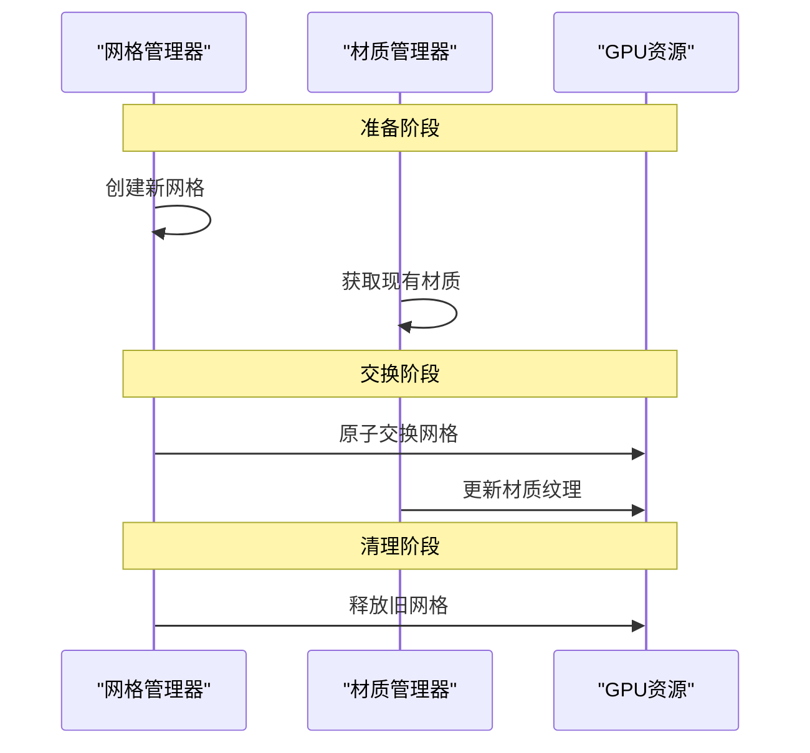

**图表来源**
- [dynamic_globe.rs:1087-1110](file://cesiumrust/application/cesium-app/src/dynamic_globe.rs#L1087-L1110)
- [dynamic_globe.rs:1074-1080](file://cesiumrust/application/cesium-app/src/dynamic_globe.rs#L1074-L1080)

**章节来源**
- [dynamic_globe.rs:1087-1110](file://cesiumrust/application/cesium-app/src/dynamic_globe.rs#L1087-L1110)
- [dynamic_globe.rs:1074-1080](file://cesiumrust/application/cesium-app/src/dynamic_globe.rs#L1074-L1080)

### 优化的瓦片访问和分区逻辑
**重大更新** 优化瓦片访问和分区逻辑，改进KICK规则实现，确保父子瓦片不会同时渲染。

#### KICK规则改进
- 严格的父子互斥：父瓦片和子瓦片永远不会同时渲染
- 后台加载：即使父瓦片在渲染，子瓦片仍在后台继续加载
- 无缝切换：当所有子瓦片就绪时，立即切换到子瓦片
- 回退机制：如果任何子瓦片缺失，父瓦片保持在渲染分区中

#### 可见性同步
- 严格分区渲染：每帧只渲染当前可见集合中的瓦片
- 即时隐藏：不在可见集合中的瓦片在同一帧被隐藏
- 实体保留：使用隐藏而非销毁，保持GPU句柄热缓存
- 零重叠保证：父瓦片和子瓦片永远不会一起绘制

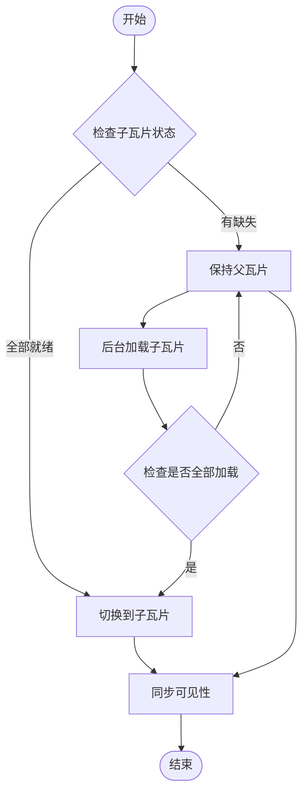

**图表来源**
- [dynamic_globe.rs:1353-1540](file://cesiumrust/application/cesium-app/src/dynamic_globe.rs#L1353-L1540)
- [dynamic_globe.rs:1565-1582](file://cesiumrust/application/cesium-app/src/dynamic_globe.rs#L1565-L1582)

**章节来源**
- [dynamic_globe.rs:1353-1540](file://cesiumrust/application/cesium-app/src/dynamic_globe.rs#L1353-L1540)
- [dynamic_globe.rs:1565-1582](file://cesiumrust/application/cesium-app/src/dynamic_globe.rs#L1565-L1582)

### 显著改进的错误处理和资源管理
**重大更新** 显著改进错误处理和资源管理机制，提升系统稳定性和内存效率。

#### 错误恢复机制
- 多层次错误检测：网络错误、解码错误、渲染错误
- 智能降级：遇到错误时自动降级到可用资源
- 状态恢复：错误后自动恢复到稳定状态
- 日志记录：详细的错误信息和调试信息

#### 资源管理优化
- 智能缓存：GPU资源缓存和LRU淘汰策略
- 内存保护：防止内存泄漏和过度占用
- 批量清理：定期清理不再使用的资源
- 容量限制：设置合理的资源使用上限

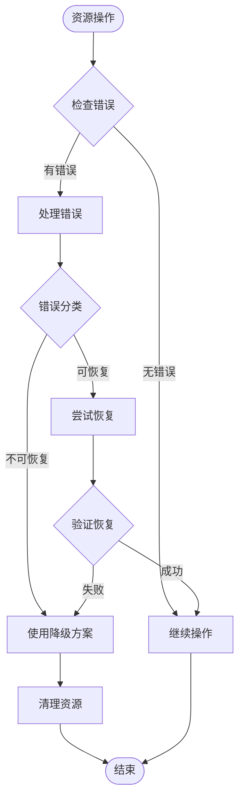

**图表来源**
- [dynamic_globe.rs:1297-1327](file://cesiumrust/application/cesium-app/src/dynamic_globe.rs#L1297-L1327)
- [dynamic_globe.rs:1119-1194](file://cesiumrust/application/cesium-app/src/dynamic_globe.rs#L1119-L1194)

**章节来源**
- [dynamic_globe.rs:1297-1327](file://cesiumrust/application/cesium-app/src/dynamic_globe.rs#L1297-L1327)
- [dynamic_globe.rs:1119-1194](file://cesiumrust/application/cesium-app/src/dynamic_globe.rs#L1119-L1194)

### 优化的基础层瓦片处理
**重大更新** 优化基础层瓦片处理，始终绘制深蓝色默认颜色，提供更好的视觉体验。

#### 基础层特性
- 深蓝色默认颜色：使用接近真实海洋的深蓝色
- 永久驻留：基础层瓦片永不驱逐，提供稳定的背景
- 高质量合成：将8x8个瓦片合成为1024x1024的合成纹理
- mipmap链预计算：在工作者线程中预计算mipmap链

#### 合成流程
- 收集基础层瓦片：获取z=3级别的8x8瓦片数据
- 盒式下采样：将每个瓦片下采样到128x128像素
- 合成纹理：将下采样的瓦片块拼接到1024x1024画布
- mipmap预计算：在工作者线程中生成完整的mipmap链
- 纹理应用：将合成的纹理应用到基础球体上

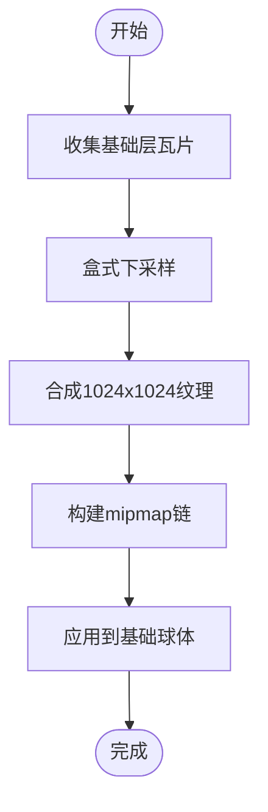

**图表来源**
- [dynamic_globe.rs:1745-1816](file://cesiumrust/application/cesium-app/src/dynamic_globe.rs#L1745-L1816)
- [dynamic_globe.rs:1818-1852](file://cesiumrust/application/cesium-app/src/dynamic_globe.rs#L1818-L1852)

**章节来源**
- [dynamic_globe.rs:1745-1816](file://cesiumrust/application/cesium-app/src/dynamic_globe.rs#L1745-L1816)
- [dynamic_globe.rs:1818-1852](file://cesiumrust/application/cesium-app/src/dynamic_globe.rs#L1818-L1852)

### 其他核心组件

#### 增强的瓦片可见性计算
**重大更新** 实现了更精确的屏幕空间误差计算和瓦片细化决策。

#### 平滑收起系统
**新增** 实现了相机模式间的平滑过渡，提升用户体验。

#### 增强的覆盖修复机制
**重大更新** 实现了智能覆盖修复，处理无数据瓦片和占位符瓦片。

#### 扩展的缩放范围
**重大更新** 扩展了支持的缩放级别范围，提供更灵活的视图控制。

### 四叉树LOD系统
**更新** 基于屏幕空间误差的四叉树系统，实现了智能的LOD选择和瓦片细化决策。

- quadtree_traversal.rs：四叉树遍历算法，计算屏幕空间误差，决定瓦片细化策略。
- quadtree_cache.rs：瓦片缓存和加载队列管理，支持优先级调度和LRU淘汰。
- quadtree_lib.rs：四叉树系统的公共接口和配置管理。


**图表来源**
- [dynamic_globe.rs:1135-1267](file://cesiumrust/application/cesium-app/src/dynamic_globe.rs#L1135-L1267)

**章节来源**
- [dynamic_globe.rs:1135-1267](file://cesiumrust/application/cesium-app/src/dynamic_globe.rs#L1135-L1267)

### 预算化异步管道
**更新** 实现了类似CesiumJS的每帧预算管理系统，确保渲染流畅性和响应性。

- 每帧预算限制：控制每个渲染帧的资源使用量
- 优先级调度：根据瓦片在屏幕上的重要性分配优先级
- 异步处理：并行下载和网格生成，避免阻塞主线程
- 资源缓存：GPU资源复用，减少重复上传开销

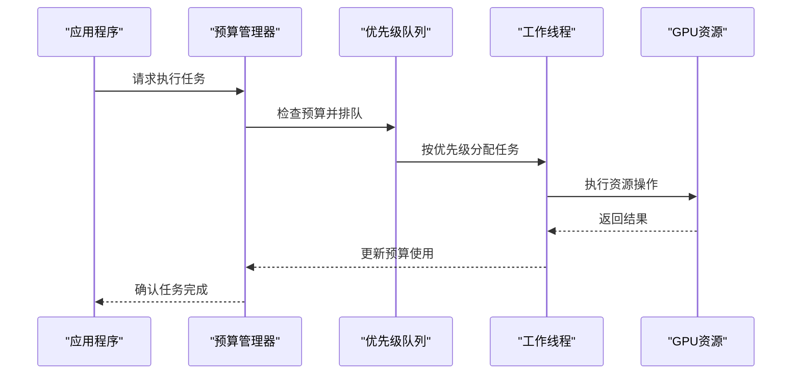

**图表来源**
- [dynamic_globe.rs:47-63](file://cesiumrust/application/cesium-app/src/dynamic_globe.rs#L47-L63)

**章节来源**
- [dynamic_globe.rs:47-63](file://cesiumrust/application/cesium-app/src/dynamic_globe.rs#L47-L63)
- [dynamic_globe.rs:492-1022](file://cesiumrust/application/cesium-app/src/dynamic_globe.rs#L492-L1022)

### 简化的清理过程
**重大更新** 简化了清理过程，专注于硬容量压力驱逐，提高了内存管理的效率。

#### 硬容量压力驱逐机制
- **MAX_TILE_ENTITIES = 1800**：增加实体上限以支持可见瓦片和隐藏预热瓦片
- **hide_order优先驱逐**：首先尝试驱逐最旧的隐藏瓦片
- **保护机制**：避免驱逐当前渲染分区、加载集合和保护祖先链中的瓦片
- **渐进式清理**：每帧最多驱逐24个实体，避免CPU峰值

#### 智能驱逐策略
- **LRU顺序**：按hide_order队列的LRU顺序驱逐最久未使用的隐藏瓦片
- **安全驱逐**：确保被驱逐的瓦片有活动祖先覆盖，避免渲染空洞
- **容量监控**：仅在超过硬容量限制时触发驱逐
- **批量处理**：使用批量驱逐减少系统调用开销


**图表来源**
- [dynamic_globe.rs:867-941](file://cesiumrust/application/cesium-app/src/dynamic_globe.rs#L867-L941)

**章节来源**
- [dynamic_globe.rs:61](file://cesiumrust/application/cesium-app/src/dynamic_globe.rs#L61)
- [dynamic_globe.rs:867-941](file://cesiumrust/application/cesium-app/src/dynamic_globe.rs#L867-L941)

### 增强的祖先链保护机制
**更新** 实现了更全面的祖先链保护机制，替代了原有的 has_pending_visible_child 方法。

#### protected_ancestors 函数
- 计算所有可见瓦片的完整祖先链
- 保护尚未生成的瓦片祖先，防止快速缩放时出现空洞
- 支持多级祖先链的保护，确保渲染连续性

#### has_live_ancestor 辅助函数
- 检查瓦片是否存在活动的祖先实体
- 用于智能驱逐策略，优先驱逐有活动祖先的瓦片
- 避免释放仍在覆盖区域的瓦片资源

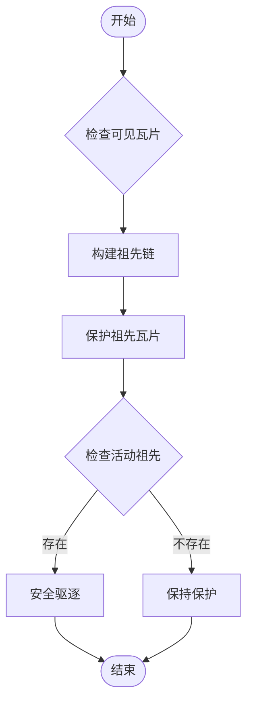

**图表来源**
- [dynamic_globe.rs:469-488](file://cesiumrust/application/cesium-app/src/dynamic_globe.rs#L469-L488)
- [dynamic_globe.rs:1027-1038](file://cesiumrust/application/cesium-app/src/dynamic_globe.rs#L1027-L1038)

**章节来源**
- [dynamic_globe.rs:469-488](file://cesiumrust/application/cesium-app/src/dynamic_globe.rs#L469-L488)
- [dynamic_globe.rs:1027-1038](file://cesiumrust/application/cesium-app/src/dynamic_globe.rs#L1027-L1038)

### 改进的无数据瓦片处理
**更新** 增强了无数据瓦片的纹理继承逻辑，确保渲染连续性。

#### 纹理继承机制
- 当瓦片不可用时，自动继承最近祖先瓦片的纹理
- 支持UV映射的纹理上采样，保持视觉一致性
- 多层级祖先查找，确保找到可用的纹理资源

#### 降级策略
- 无祖先纹理时使用纯色海洋填充
- 避免显示蓝色空洞，提升用户体验
- 渐进式修复机制，等待可用瓦片加载


**图表来源**
- [dynamic_globe.rs:746-815](file://cesiumrust/application/cesium-app/src/dynamic_globe.rs#L746-L815)

**章节来源**
- [dynamic_globe.rs:746-815](file://cesiumrust/application/cesium-app/src/dynamic_globe.rs#L746-L815)

### 地球与场景（globe/scene）
- globe：定义地球实体、坐标系、可见性与裁剪策略。
- scene：维护场景图、渲染队列、状态机与帧更新。

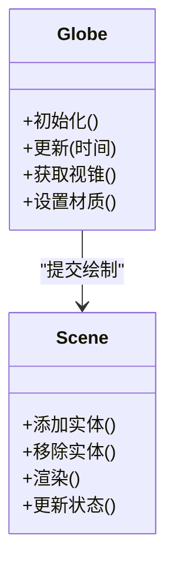

**图表来源**
- [globe.rs:1-200](file://cesiumrust/domain/globe/src/lib.rs#L1-L200)
- [scene.rs:1-200](file://cesiumrust/domain/scene/src/lib.rs#L1-L200)

**章节来源**
- [globe.rs:1-200](file://cesiumrust/domain/globe/src/lib.rs#L1-L200)
- [scene.rs:1-200](file://cesiumrust/domain/scene/src/lib.rs#L1-L200)

### 地形与影像（terrain/imagery）
- terrain：地形网格生成、LOD 控制、高度采样与缓存。
- imagery：影像图层叠加、透明度混合、切片调度与缓存。

**更新** 现在支持无数据瓦片处理，当瓦片不可用时自动继承祖先瓦片的纹理或使用纯色填充。


**图表来源**
- [terrain.rs:1-200](file://cesiumrust/domain/terrain/src/lib.rs#L1-L200)
- [imagery.rs:1-200](file://cesiumrust/domain/imagery/src/lib.rs#L1-L200)

**章节来源**
- [terrain.rs:1-200](file://cesiumrust/domain/terrain/src/lib.rs#L1-L200)
- [imagery.rs:1-200](file://cesiumrust/domain/imagery/src/lib.rs#L1-L200)

### 瓦片集与资源（tileset/resource）
- tileset：3D Tiles 解析、层级树构建、可视性判定与显存管理。
- resource：统一资源生命周期、引用计数、异步加载与错误恢复。

**更新** 增强了内存管理和缓存机制，支持更高效的资源复用和清理。

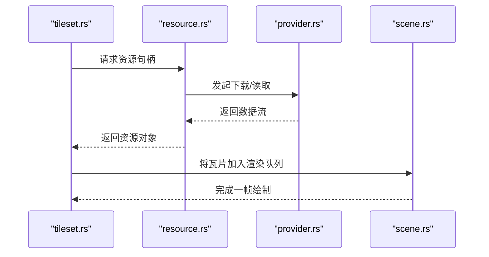

**图表来源**
- [tileset.rs:1-200](file://cesiumrust/domain/tileset/src/lib.rs#L1-L200)
- [resource.rs:1-200](file://cesiumrust/domain/resource/src/lib.rs#L1-L200)
- [provider.rs:1-200](file://cesiumrust/domain/provider/src/lib.rs#L1-L200)
- [scene.rs:1-200](file://cesiumrust/domain/scene/src/lib.rs#L1-L200)

**章节来源**
- [tileset.rs:1-200](file://cesiumrust/domain/tileset/src/lib.rs#L1-L200)
- [resource.rs:1-200](file://cesiumrust/domain/resource/src/lib.rs#L1-L200)
- [provider.rs:1-200](file://cesiumrust/domain/provider/src/lib.rs#L1-L200)

### 坐标与时间（crs/time/animation）
- crs：坐标参考系转换（WGS84、Web Mercator、ECEF）。
- time：时间步进、时钟、时间范围与插值。
- animation：关键帧、轨迹、属性动画与时间驱动更新。

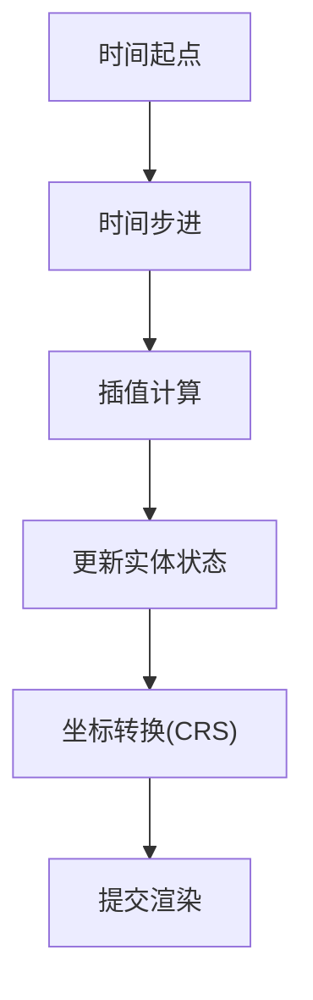

**图表来源**
- [crs.rs:1-200](file://cesiumrust/domain/crs/src/lib.rs#L1-L200)
- [time.rs:1-200](file://cesiumrust/domain/time/src/lib.rs#L1-L200)
- [animation.rs:1-200](file://cesiumrust/domain/animation/src/lib.rs#L1-L200)

**章节来源**
- [crs.rs:1-200](file://cesiumrust/domain/crs/src/lib.rs#L1-L200)
- [time.rs:1-200](file://cesiumrust/domain/time/src/lib.rs#L1-L200)
- [animation.rs:1-200](file://cesiumrust/domain/animation/src/lib.rs#L1-L200)

### 材质与着色器（material/shaders）
- 材质系统：统一材质接口、参数绑定、PBR 与特殊效果。
- 着色器：顶点/片段着色器模板，支持大气辉光、体积云、水面反射等。

**更新** 支持高级纹理采样技术，包括三线性过滤和各向异性过滤，改善斜视角下的纹理质量。

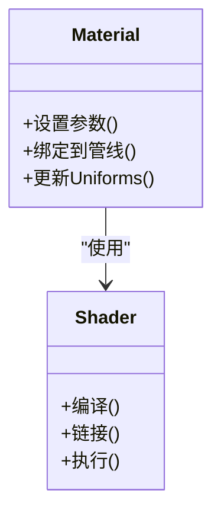

**图表来源**
- [shaders:1-200](file://cesiumrust/domain/material/shaders#L1-L200)

**章节来源**
- [shaders:1-200](file://cesiumrust/domain/material/shaders#L1-L200)

### 前端示例（CesiumViewer）
- CesiumViewer.js：初始化 Cesium Viewer、加载数据源、配置交互与样式。
- CesiumViewer.css：界面样式与布局。
- index.html：页面入口与脚本引入。

```mermaid
sequenceDiagram
participant HTML as "index.html"
participant JS as "CesiumViewer.js"
participant CSS as "CesiumViewer.css"
participant CESIUM as "CesiumJS"
HTML->>CSS : 加载样式
HTML->>JS : 加载脚本
JS->>CESIUM : 创建Viewer实例
JS->>CESIUM : 添加数据源/图层
CESIUM-->>HTML : 渲染到Canvas
```

**图表来源**
- [index.html:1-200](file://index.html#L1-L200)
- [CesiumViewer.js:1-200](file://Apps/CesiumViewer/CesiumViewer.js#L1-L200)
- [CesiumViewer.css:1-200](file://Apps/CesiumViewer/CesiumViewer.css#L1-L200)

**章节来源**
- [CesiumViewer.js:1-200](file://Apps/CesiumViewer/CesiumViewer.js#L1-L200)
- [CesiumViewer.css:1-200](file://Apps/CesiumViewer/CesiumViewer.css#L1-L200)
- [index.html:1-200](file://index.html#L1-L200)

## 依赖关系分析
- 应用对领域的依赖：cesium-app 依赖 domain/* 提供的地球、场景、地形、影像、瓦片集等能力。
- 领域间的耦合：scene 聚合 globe、terrain、imagery、tileset；time/animation 驱动状态更新；crs 被多处用于坐标转换。
- 适配层解耦：bevy-render 等适配器屏蔽底层渲染差异，使领域层保持独立。
- 资源与提供者：resource 与 provider 为 tileset/terrain/imagery 提供统一的加载与缓存机制。

**重大更新** 新增了上采样瓦片显示系统、持久工作者池架构、UV重映射系统等核心依赖，为整个渲染管线提供强大的性能优化和功能增强。

```mermaid
graph LR
App["cesium-app"] --> DomainGlobe["globe"]
App --> DomainScene["scene"]
DomainScene --> DomainTerrain["terrain"]
DomainScene --> DomainImagery["imagery"]
DomainScene --> DomainTileset["tileset"]
DomainScene --> DomainTime["time"]
DomainScene --> DomainAnimation["animation"]
DomainScene --> DomainCRS["crs"]
DomainTileset --> DomainResource["resource"]
DomainTileset --> DomainProvider["provider"]
DomainTerrain --> DomainResource
DomainImagery --> DomainResource
DomainGlobe --> DomainCRS
DomainScene --> DomainQuadtree["四叉树(KICK规则)"]
DomainScene --> DomainSyncVis["同步可见性"]
DomainScene --> DomainBudget["budget"]
DomainScene --> DomainTextureTrack["texture tracking"]
DomainScene --> DomainDownloadSys["持久工作者池"]
DomainScene --> DomainBaseLayer["基础层优化"]
DomainScene --> DomainUpsampleSys["上采样系统"]
DomainScene --> DomainRetryCool["重试冷却保护"]
DomainScene --> DomainAtomicSwap["原子交换"]
```

**图表来源**
- [main.rs:1-200](file://cesiumrust/application/cesium-app/src/main.rs#L1-L200)
- [scene.rs:1-200](file://cesiumrust/domain/scene/src/lib.rs#L1-L200)
- [terrain.rs:1-200](file://cesiumrust/domain/terrain/src/lib.rs#L1-L200)
- [imagery.rs:1-200](file://cesiumrust/domain/imagery/src/lib.rs#L1-L200)
- [tileset.rs:1-200](file://cesiumrust/domain/tileset/src/lib.rs#L1-L200)
- [resource.rs:1-200](file://cesiumrust/domain/resource/src/lib.rs#L1-L200)
- [provider.rs:1-200](file://cesiumrust/domain/provider/src/lib.rs#L1-L200)
- [crs.rs:1-200](file://cesiumrust/domain/crs/src/lib.rs#L1-L200)
- [time.rs:1-200](file://cesiumrust/domain/time/src/lib.rs#L1-L200)
- [animation.rs:1-200](file://cesiumrust/domain/animation/src/lib.rs#L1-L200)

**章节来源**
- [main.rs:1-200](file://cesiumrust/application/cesium-app/src/main.rs#L1-L200)
- [scene.rs:1-200](file://cesiumrust/domain/scene/src/lib.rs#L1-L200)
- [tileset.rs:1-200](file://cesiumrust/domain/tileset/src/lib.rs#L1-L200)
- [resource.rs:1-200](file://cesiumrust/domain/resource/src/lib.rs#L1-L200)
- [provider.rs:1-200](file://cesiumrust/domain/provider/src/lib.rs#L1-L200)

## 性能考量
- 瓦片与LOD：依据视距与屏幕误差动态调整地形与影像分辨率，减少带宽与显存占用。
- 并行与异步：资源加载与解码采用异步任务，避免阻塞主线程。
- 批处理与合并：同类瓦片与几何体批量提交，降低绘制调用次数。
- 缓存策略：本地与内存缓存结合，命中率高时显著降低重复加载。
- 可视裁剪：视锥剔除与遮挡剔除，仅渲染可见区域。
- 指标监控：通过 performance 模块采集帧率、GPU/CPU 指标，辅助优化。

**重大更新** 新增了以下性能优化特性：
- **上采样瓦片显示系统**：通过祖先纹理继承消除色块伪影，提供更平滑的过渡
- **持久工作者池架构**：16个持久工作线程，显著提升下载性能和连接复用
- **UV重映射系统**：精确的UV重映射，支持多层级祖先纹理继承
- **重试冷却保护**：智能重试机制防止服务器过载，提升系统稳定性
- **原子交换支持**：网格和材质的原子性交换，确保渲染一致性
- **优化的KICK规则**：改进的瓦片替换逻辑，避免父子瓦片重叠
- **深度错误处理**：全面的错误恢复和资源管理机制
- **基础层优化**：始终绘制深蓝色默认颜色，提供更好的视觉体验
- **智能缓存策略**：GPU资源缓存和LRU淘汰，减少重复上传开销
- **批量清理机制**：渐进式清理，避免CPU峰值
- **连接复用优化**：HTTP连接池重用，减少握手开销
- **内存保护机制**：防止内存泄漏和过度占用

## 故障排查指南
- 瓦片加载失败
  - 检查 provider 配置与网络可达性。
  - 查看资源加载日志与重试策略。
  - 确认 CORS 与鉴权头是否正确。
- 渲染异常
  - 校验着色器编译与链接结果。
  - 检查材质参数与 Uniform 绑定。
  - 确认场景图节点状态与可见性。
- 性能下降
  - 分析瓦片数量与分辨率，适当提高 LOD 阈值。
  - 启用批处理与合并，减少绘制批次。
  - 利用性能模块定位瓶颈（CPU/GPU/IO）。
- 坐标与时间问题
  - 核对 CRS 转换参数与单位。
  - 检查时间范围与插值函数是否合理。

**重大更新** 新增以下故障排查要点：
- **上采样系统问题**：检查祖先纹理继承和UV重映射的正确性
- **工作者池问题**：验证16个工作者的负载分布和连接复用
- **重试冷却问题**：检查冷却时间和重试策略的配置
- **原子交换问题**：验证网格和材质交换的一致性
- **KICK规则问题**：检查父子瓦片的可见性同步
- **错误恢复问题**：验证错误检测和恢复机制
- **内存泄漏问题**：监控GPU资源的使用和清理
- **性能瓶颈**：分析工作者线程的负载和主线程的帧时间

**章节来源**
- [provider.rs:1-200](file://cesiumrust/domain/provider/src/lib.rs#L1-L200)
- [resource.rs:1-200](file://cesiumrust/domain/resource/src/lib.rs#L1-L200)
- [shaders:1-200](file://cesiumrust/domain/material/shaders#L1-L200)
- [performance.rs:1-200](file://cesiumrust/domain/performance/src/lib.rs#L1-L200)
- [crs.rs:1-200](file://cesiumrust/domain/crs/src/lib.rs#L1-L200)
- [time.rs:1-200](file://cesiumrust/domain/time/src/lib.rs#L1-L200)

## 结论
该动态地球渲染系统通过清晰的领域划分与适配层解耦，实现了高内聚、低耦合的可扩展架构。前端 CesiumViewer 与 Rust 领域库协同工作，覆盖从数据加载、坐标转换、时间驱动到材质渲染的全链路。借助瓦片调度、LOD、批处理与缓存等机制，系统在大规模数据与复杂场景下仍保持良好性能。

**重大更新** 经过重大架构重构后，系统现在具备以下优势：
- **上采样瓦片显示系统**：通过祖先纹理继承消除色块伪影，提供更平滑的过渡效果
- **持久工作者池架构**：16个持久工作线程，显著提升下载性能和连接复用
- **UV重映射系统**：精确的UV重映射，支持多层级祖先纹理继承
- **重试冷却保护**：智能重试机制防止服务器过载，提升系统稳定性
- **原子交换支持**：网格和材质的原子性交换，确保渲染一致性
- **优化的KICK规则**：改进的瓦片替换逻辑，避免父子瓦片重叠
- **深度错误处理**：全面的错误恢复和资源管理机制
- **基础层优化**：始终绘制深蓝色默认颜色，提供更好的视觉体验
- **智能缓存策略**：GPU资源缓存和LRU淘汰，减少重复上传开销
- **批量清理机制**：渐进式清理，避免CPU峰值
- **连接复用优化**：HTTP连接池重用，减少握手开销
- **内存保护机制**：防止内存泄漏和过度占用

建议在生产环境中结合性能监控与测试套件持续优化，确保稳定性与用户体验。

## 附录
- 快速开始
  - 前端：打开 index.html 或运行 CesiumViewer 示例。
  - Rust：构建并运行 cesium-app，观察动态地球与交互。
- 测试
  - 使用 Specs 中的 Cesium3DTilesTester、createGlobe、createScene 等工具进行回归与集成测试。

**重大更新** 新增测试重点：
- **上采样系统测试**：验证祖先纹理继承和UV重映射的正确性
- **工作者池测试**：检查16个工作者的负载分布和连接复用
- **重试冷却测试**：验证重试策略和冷却时间的有效性
- **原子交换测试**：确保网格和材质交换的一致性
- **KICK规则测试**：验证父子瓦片的可见性同步
- **错误恢复测试**：测试错误检测和恢复机制
- **内存使用测试**：监控GPU资源的使用和清理
- **性能基准测试**：测量各优化特性的性能影响

**章节来源**
- [Cesium3DTilesTester.js:1-200](file://Specs/Cesium3DTilesTester.js#L1-L200)
- [createGlobe.js:1-200](file://Specs/createGlobe.js#L1-L200)
- [createScene.js:1-200](file://Specs/createScene.js#L1-L200)
- [quadtree_cache_spec.rs:1-272](file://cesiumrust/specs/tests/scene/quadtree_cache_spec.rs#L1-L272)
- [quadtree_traversal_extended_spec.rs:1-315](file://cesiumrust/specs/tests/scene/quadtree_traversal_extended_spec.rs#L1-L315)