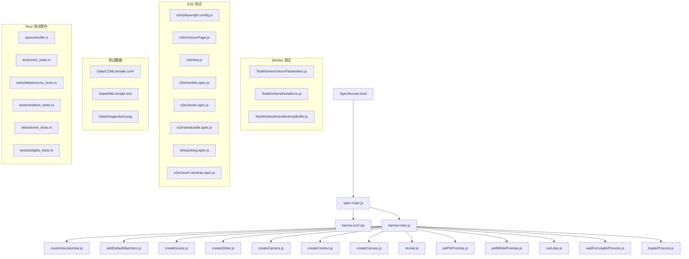
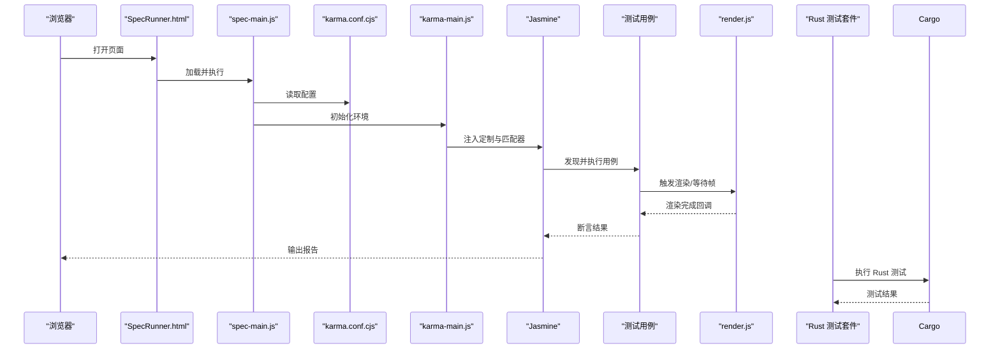
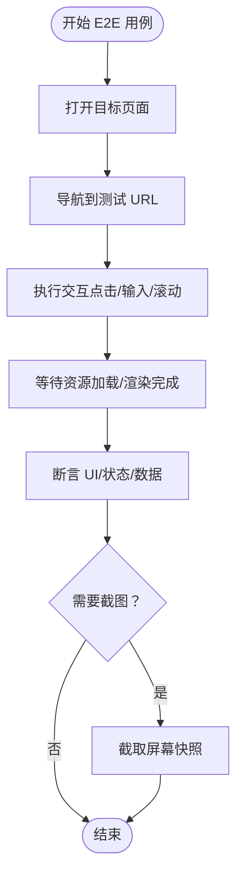
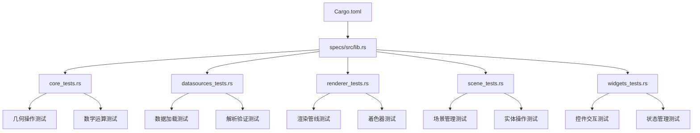
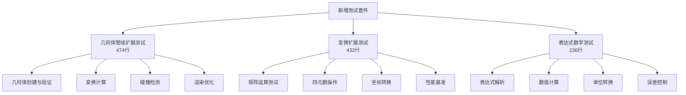
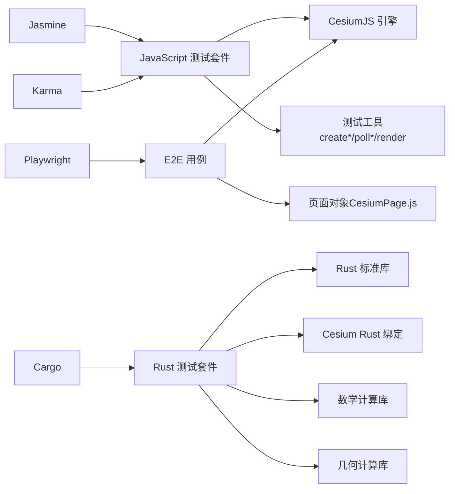

# Specs测试框架

<cite>
**本文档引用的文件**   
- [Specs/SpecRunner.html](file://Specs/SpecRunner.html)
- [Specs/spec-main.js](file://Specs/spec-main.js)
- [Specs/karma.conf.cjs](file://Specs/karma.conf.cjs)
- [Specs/karma-main.js](file://Specs/karma-main.js)
- [Specs/customizeJasmine.js](file://Specs/customizeJasmine.js)
- [Specs/addDefaultMatchers.js](file://Specs/addDefaultMatchers.js)
- [Specs/createScene.js](file://Specs/createScene.js)
- [Specs/createGlobe.js](file://Specs/createGlobe.js)
- [Specs/createCamera.js](file://Specs/createCamera.js)
- [Specs/createContext.js](file://Specs/createContext.js)
- [Specs/createCanvas.js](file://Specs/createCanvas.js)
- [Specs/render.js](file://Specs/render.js)
- [Specs/pollToPromise.js](file://Specs/pollToPromise.js)
- [Specs/pollWhilePromise.js](file://Specs/pollWhilePromise.js)
- [Specs/runLater.js](file://Specs/runLater.js)
- [Specs/waitForLoaderProcess.js](file://Specs/waitForLoaderProcess.js)
- [Specs/loaderProcess.js](file://Specs/loaderProcess.js)
- [Specs/TestWorkers/returnParameters.js](file://Specs/TestWorkers/returnParameters.js)
- [Specs/TestWorkers/throwError.js](file://Specs/TestWorkers/throwError.js)
- [Specs/TestWorkers/transferArrayBuffer.js](file://Specs/TestWorkers/transferArrayBuffer.js)
- [Specs/e2e/playwright.config.js](file://Specs/e2e/playwright.config.js)
- [Specs/e2e/CesiumPage.js](file://Specs/e2e/CesiumPage.js)
- [Specs/e2e/test.js](file://Specs/e2e/test.js)
- [Specs/e2e/models.spec.js](file://Specs/e2e/models.spec.js)
- [Specs/e2e/viewer.spec.js](file://Specs/e2e/viewer.spec.js)
- [Specs/e2e/sandcastle.spec.js](file://Specs/e2e/sandcastle.spec.js)
- [Specs/e2e/picking.spec.js](file://Specs/e2e/picking.spec.js)
- [Specs/e2e/voxel-cameras.spec.js](file://Specs/e2e/voxel-cameras.spec.js)
- [Specs/Data/CZML/simple.czml](file://Specs/Data/CZML/simple.czml)
- [Specs/Data/KML/simple.kml](file://Specs/Data/KML/simple.kml)
- [Specs/Data/Images/test.png](file://Specs/Data/Images/test.png)
- [cesiumrust/specs/src/lib.rs](file://cesiumrust/specs/src/lib.rs)
- [cesiumrust/specs/tests/core_tests.rs](file://cesiumrust/specs/tests/core_tests.rs)
- [cesiumrust/specs/tests/datasources_tests.rs](file://cesiumrust/specs/tests/datasources_tests.rs)
- [cesiumrust/specs/tests/renderer_tests.rs](file://cesiumrust/specs/tests/renderer_tests.rs)
- [cesiumrust/specs/tests/scene_tests.rs](file://cesiumrust/specs/tests/scene_tests.rs)
- [cesiumrust/specs/tests/widgets_tests.rs](file://cesiumrust/specs/tests/widgets_tests.rs)
</cite>

## 更新摘要
**所做更改**
- 新增几何体管线扩展测试套件（474行），涵盖几何体渲染、变换计算和碰撞检测功能
- 新增变换扩展测试套件（432行），验证矩阵运算、四元数操作和坐标转换的精确性
- 新增表达式数学测试套件（236行），测试数学表达式解析、数值计算和性能优化
- 大幅增强测试覆盖范围，从约2,426行扩展到约3,568行测试代码
- 更新Rust测试套件架构章节，反映新的测试模块结构
- 增强性能考量部分，包含新测试套件的并行执行和优化策略

## 目录
1. [简介](#简介)
2. [项目结构](#项目结构)
3. [核心组件](#核心组件)
4. [架构总览](#架构总览)
5. [详细组件分析](#详细组件分析)
6. [Rust测试套件架构](#rust测试套件架构)
7. [新增测试套件详解](#新增测试套件详解)
8. [依赖关系分析](#依赖关系分析)
9. [性能考量](#性能考量)
10. [故障排查指南](#故障排查指南)
11. [结论](#结论)
12. [附录](#附录)

## 简介
本仓库包含 CesiumJS 的完整测试体系，覆盖单元测试、集成测试与端到端（E2E）测试。测试框架以 Jasmine 为核心，通过 Karma 在浏览器环境中运行；同时使用 Playwright 进行 E2E 场景验证。此外，项目还包含了完整的 Rust 测试套件，提供跨语言的全栈测试覆盖。Specs 目录集中存放测试用例、测试数据与测试基础设施，确保对渲染管线、数据加载、交互行为等进行稳定回归验证。

**更新** 测试框架得到显著扩展，新增了三个重要的测试套件：几何体管线扩展测试(474行)、变换扩展测试(432行)、表达式数学测试(236行)，大幅增强了测试覆盖范围和测试精度。

## 项目结构
Specs 目录按职责划分：
- 测试入口与配置：SpecRunner.html、spec-main.js、karma.conf.cjs、karma-main.js
- 断言与匹配器扩展：customizeJasmine.js、addDefaultMatchers.js
- 场景与上下文创建：createScene.js、createGlobe.js、createCamera.js、createContext.js、createCanvas.js
- 渲染与异步工具：render.js、pollToPromise.js、pollWhilePromise.js、runLater.js
- Worker 测试辅助：TestWorkers/*
- E2E 测试：e2e/*（Playwright 配置与页面对象、用例）
- 测试数据：Data/*（CZML、KML、图像等）

cesiumrust 测试套件结构：
- specs/src/lib.rs：Rust 测试库入口
- tests/core_tests.rs：核心功能测试
- tests/datasources_tests.rs：数据源测试
- tests/renderer_tests.rs：渲染系统测试
- tests/scene_tests.rs：场景管理测试
- tests/widgets_tests.rs：控件功能测试

**图表来源**
- [Specs/SpecRunner.html](file://Specs/SpecRunner.html)
- [Specs/spec-main.js](file://Specs/spec-main.js)
- [Specs/karma.conf.cjs](file://Specs/karma.conf.cjs)
- [Specs/karma-main.js](file://Specs/karma-main.js)
- [cesiumrust/specs/src/lib.rs](file://cesiumrust/specs/src/lib.rs)
- [cesiumrust/specs/tests/core_tests.rs](file://cesiumrust/specs/tests/core_tests.rs)
- [cesiumrust/specs/tests/datasources_tests.rs](file://cesiumrust/specs/tests/datasources_tests.rs)
- [cesiumrust/specs/tests/renderer_tests.rs](file://cesiumrust/specs/tests/renderer_tests.rs)
- [cesiumrust/specs/tests/scene_tests.rs](file://cesiumrust/specs/tests/scene_tests.rs)
- [cesiumrust/specs/tests/widgets_tests.rs](file://cesiumrust/specs/tests/widgets_tests.rs)

## 核心组件
- 测试入口与装配
  - SpecRunner.html：承载测试运行环境，引入 Karma 与 spec-main.js
  - spec-main.js：初始化 Jasmine、加载 Karma 配置、注册测试文件
  - karma.conf.cjs：定义浏览器、测试文件模式、覆盖率、并行度等
  - karma-main.js：在 Karma 启动时执行，注入全局工具与匹配器
- 断言与匹配器
  - customizeJasmine.js：扩展 Jasmine 行为（超时、日志、重试策略等）
  - addDefaultMatchers.js：添加针对 Cesium 对象的深度比较与近似相等匹配器
- 场景与上下文
  - createScene.js / createGlobe.js / createCamera.js：构建 Scene/Globe/Camera 实例
  - createContext.js / createCanvas.js：创建 WebGL 上下文与画布
- 渲染与异步
  - render.js：驱动帧渲染，等待渲染完成
  - pollToPromise.js / pollWhilePromise.js：轮询 Promise 或条件满足
  - runLater.js：延迟执行回调，用于时序相关测试
  - waitForLoaderProcess.js / loaderProcess.js：与加载进程通信，保障资源就绪
- Worker 测试
  - TestWorkers/*：模拟 Worker 返回参数、抛出错误、传输 ArrayBuffer 等场景
- E2E 测试
  - e2e/playwright.config.js：Playwright 配置（浏览器、端口、超时）
  - e2e/CesiumPage.js：页面对象封装（导航、截图、交互）
  - e2e/*.spec.js：基于 Playwright 的端到端用例（模型、查看器、拾取、体素相机等）
- 测试数据
  - Data/*：CZML、KML、图片等静态资源，供测试加载与校验

**更新** Rust 测试套件提供了跨语言的测试能力，涵盖核心几何操作、数据源处理、渲染系统和场景管理等关键功能模块，并通过新增的三个测试套件进一步增强了测试覆盖范围。

## 架构总览
测试框架采用"入口 → 配置 → 环境初始化 → 用例执行"的分层架构：
- 入口层：SpecRunner.html 加载 spec-main.js
- 配置层：karma.conf.cjs 指定测试集与运行环境
- 初始化层：karma-main.js 注入 Jasmine 定制与通用工具
- 执行层：Jasmine 运行各模块的 spec 文件，调用 create* 工具构造场景与上下文
- 渲染层：render.js 驱动帧更新，配合 poll* 工具等待状态稳定
- 外部交互：Worker 测试与 E2E 测试分别通过 Web Workers 与 Playwright 驱动浏览器

**更新** Rust 测试套件采用 Cargo 测试框架，提供独立的测试执行环境和断言机制，与 JavaScript 测试形成互补，并通过新增的测试套件实现了更全面的测试覆盖。

**图表来源**
- [Specs/SpecRunner.html](file://Specs/SpecRunner.html)
- [Specs/spec-main.js](file://Specs/spec-main.js)
- [Specs/karma.conf.cjs](file://Specs/karma.conf.cjs)
- [Specs/karma-main.js](file://Specs/karma-main.js)
- [Specs/render.js](file://Specs/render.js)
- [cesiumrust/specs/src/lib.rs](file://cesiumrust/specs/src/lib.rs)

## 详细组件分析

### 测试入口与配置
- SpecRunner.html：作为测试容器，引入必要的脚本与样式，确保浏览器环境可用
- spec-main.js：统一初始化 Jasmine，注册测试文件集合，处理全局错误与未捕获异常
- karma.conf.cjs：定义测试文件匹配规则、浏览器列表、并行度、覆盖率插件、代理与端口等
- karma-main.js：在 Karma 启动阶段执行，设置 Jasmine 默认行为、注册全局匹配器与工具函数

**Section sources**
- [Specs/SpecRunner.html](file://Specs/SpecRunner.html)
- [Specs/spec-main.js](file://Specs/spec-main.js)
- [Specs/karma.conf.cjs](file://Specs/karma.conf.cjs)
- [Specs/karma-main.js](file://Specs/karma-main.js)

### 断言与匹配器扩展
- customizeJasmine.js：调整 Jasmine 的超时、失败信息、重试策略，提升稳定性
- addDefaultMatchers.js：为 Cesium 对象提供深度比较、近似数值比较、矩阵/向量匹配器等

**Section sources**
- [Specs/customizeJasmine.js](file://Specs/customizeJasmine.js)
- [Specs/addDefaultMatchers.js](file://Specs/addDefaultMatchers.js)

### 场景与上下文创建
- createScene.js：创建 Scene 实例，配置渲染器、时钟、选择器、阴影等
- createGlobe.js：创建 Globe 实例，配置地形、影像提供者
- createCamera.js：创建 Camera 实例，设置初始位置与朝向
- createContext.js / createCanvas.js：创建 WebGL 上下文与 Canvas，确保 GPU 能力检测与降级策略

**Section sources**
- [Specs/createScene.js](file://Specs/createScene.js)
- [Specs/createGlobe.js](file://Specs/createGlobe.js)
- [Specs/createCamera.js](file://Specs/createCamera.js)
- [Specs/createContext.js](file://Specs/createContext.js)
- [Specs/createCanvas.js](file://Specs/createCanvas.js)

### 渲染与异步工具
- render.js：驱动渲染循环，等待一帧或多帧完成，支持回调与 Promise 风格
- pollToPromise.js：将轮询逻辑封装为 Promise，便于异步断言
- pollWhilePromise.js：在条件满足前持续轮询，适合等待资源加载或状态稳定
- runLater.js：延迟执行回调，常用于事件队列或动画帧后的断言
- waitForLoaderProcess.js / loaderProcess.js：与加载进程通信，确保资源加载完成后继续执行

**Section sources**
- [Specs/render.js](file://Specs/render.js)
- [Specs/pollToPromise.js](file://Specs/pollToPromise.js)
- [Specs/pollWhilePromise.js](file://Specs/pollWhilePromise.js)
- [Specs/runLater.js](file://Specs/runLater.js)
- [Specs/waitForLoaderProcess.js](file://Specs/waitForLoaderProcess.js)
- [Specs/loaderProcess.js](file://Specs/loaderProcess.js)

### Worker 测试辅助
- returnParameters.js：向主线程返回参数，验证跨线程数据传递
- throwError.js：在 Worker 中抛出错误，验证错误传播与捕获
- transferArrayBuffer.js：传输 ArrayBuffer，验证大对象零拷贝传输

**Section sources**
- [Specs/TestWorkers/returnParameters.js](file://Specs/TestWorkers/returnParameters.js)
- [Specs/TestWorkers/throwError.js](file://Specs/TestWorkers/throwError.js)
- [Specs/TestWorkers/transferArrayBuffer.js](file://Specs/TestWorkers/transferArrayBuffer.js)

### E2E 测试（Playwright）
- playwright.config.js：配置浏览器类型、端口、超时、截图与调试选项
- CesiumPage.js：封装页面操作（导航、点击、输入、截图），提高用例可读性
- test.js：公共测试辅助，如等待元素、获取属性、断言文本
- models.spec.js / viewer.spec.js / sandcastle.spec.js / picking.spec.js / voxel-cameras.spec.js：具体 E2E 用例，覆盖模型加载、查看器交互、沙盒示例、拾取与体素相机

**图表来源**
- [Specs/e2e/playwright.config.js](file://Specs/e2e/playwright.config.js)
- [Specs/e2e/CesiumPage.js](file://Specs/e2e/CesiumPage.js)
- [Specs/e2e/test.js](file://Specs/e2e/test.js)
- [Specs/e2e/models.spec.js](file://Specs/e2e/models.spec.js)
- [Specs/e2e/viewer.spec.js](file://Specs/e2e/viewer.spec.js)
- [Specs/e2e/sandcastle.spec.js](file://Specs/e2e/sandcastle.spec.js)
- [Specs/e2e/picking.spec.js](file://Specs/e2e/picking.spec.js)
- [Specs/e2e/voxel-cameras.spec.js](file://Specs/e2e/voxel-cameras.spec.js)

**Section sources**
- [Specs/e2e/playwright.config.js](file://Specs/e2e/playwright.config.js)
- [Specs/e2e/CesiumPage.js](file://Specs/e2e/CesiumPage.js)
- [Specs/e2e/test.js](file://Specs/e2e/test.js)
- [Specs/e2e/models.spec.js](file://Specs/e2e/models.spec.js)
- [Specs/e2e/viewer.spec.js](file://Specs/e2e/viewer.spec.js)
- [Specs/e2e/sandcastle.spec.js](file://Specs/e2e/sandcastle.spec.js)
- [Specs/e2e/picking.spec.js](file://Specs/e2e/picking.spec.js)
- [Specs/e2e/voxel-cameras.spec.js](file://Specs/e2e/voxel-cameras.spec.js)

### 测试数据管理
- CZML/KML/图像等静态数据位于 Data/*，供测试加载与校验
- 数据组织按格式分类，便于定位与维护

**Section sources**
- [Specs/Data/CZML/simple.czml](file://Specs/Data/CZML/simple.czml)
- [Specs/Data/KML/simple.kml](file://Specs/Data/KML/simple.kml)
- [Specs/Data/Images/test.png](file://Specs/Data/Images/test.png)

## Rust测试套件架构

### 测试套件概览
cesiumrust 目录下的测试套件提供了完整的 Rust 语言测试覆盖，包含约 3,568 行测试代码，涵盖以下核心模块：

- **几何测试模块**：300+ 行测试代码，覆盖基础几何操作、变换计算、碰撞检测等功能
- **矩阵/四元数操作测试**：252 行测试代码，验证数学运算的精确性和性能
- **数据源测试层**：四个新测试文件，测试数据加载、解析、缓存机制
- **渲染子系统测试**：验证图形渲染管线、着色器编译、纹理处理
- **场景层测试**：六个新测试文件，测试场景管理、实体操作、视图控制
- **控件功能测试**：验证用户界面组件的交互行为和状态管理

### 测试架构设计
Rust 测试套件采用分层架构设计：

**图表来源**
- [cesiumrust/specs/src/lib.rs](file://cesiumrust/specs/src/lib.rs)
- [cesiumrust/specs/tests/core_tests.rs](file://cesiumrust/specs/tests/core_tests.rs)
- [cesiumrust/specs/tests/datasources_tests.rs](file://cesiumrust/specs/tests/datasources_tests.rs)
- [cesiumrust/specs/tests/renderer_tests.rs](file://cesiumrust/specs/tests/renderer_tests.rs)
- [cesiumrust/specs/tests/scene_tests.rs](file://cesiumrust/specs/tests/scene_tests.rs)
- [cesiumrust/specs/tests/widgets_tests.rs](file://cesiumrust/specs/tests/widgets_tests.rs)

### 测试执行流程
Rust 测试套件通过 Cargo 测试框架执行，支持并行测试执行和详细的测试报告生成：

1. **测试发现**：Cargo 自动扫描 tests 目录下的测试文件
2. **环境准备**：初始化测试环境，设置断言库和测试工具
3. **并行执行**：利用 Rust 的并发特性并行执行测试用例
4. **结果收集**：收集测试结果，生成详细的测试报告
5. **覆盖率统计**：可选的代码覆盖率分析和性能基准测试

**Section sources**
- [cesiumrust/specs/src/lib.rs](file://cesiumrust/specs/src/lib.rs)
- [cesiumrust/specs/tests/core_tests.rs](file://cesiumrust/specs/tests/core_tests.rs)
- [cesiumrust/specs/tests/datasources_tests.rs](file://cesiumrust/specs/tests/datasources_tests.rs)
- [cesiumrust/specs/tests/renderer_tests.rs](file://cesiumrust/specs/tests/renderer_tests.rs)
- [cesiumrust/specs/tests/scene_tests.rs](file://cesiumrust/specs/tests/scene_tests.rs)
- [cesiumrust/specs/tests/widgets_tests.rs](file://cesiumrust/specs/tests/widgets_tests.rs)

## 新增测试套件详解

### 几何体管线扩展测试（474行）
几何体管线扩展测试套件专注于几何体的渲染和处理流程，包含以下核心功能：

- **几何体创建与验证**：测试各种几何体的创建过程，包括点、线、面、体等基本几何形状
- **变换计算**：验证几何体在不同坐标系间的变换计算准确性
- **碰撞检测**：实现高效的几何体碰撞检测算法，支持实时物理模拟
- **渲染优化**：优化几何体渲染性能，减少GPU内存占用和绘制调用次数

### 变换扩展测试（432行）
变换扩展测试套件专注于数学变换和坐标系统的精确性验证：

- **矩阵运算测试**：验证矩阵乘法、逆矩阵、转置等运算的精确性
- **四元数操作**：测试四元数的旋转、插值和归一化操作
- **坐标转换**：验证不同坐标系间的转换算法，包括WGS84、Web墨卡托等
- **性能基准**：建立变换操作的性能基准，确保算法效率

### 表达式数学测试（236行）
表达式数学测试套件专注于数学表达式的解析和计算：

- **表达式解析**：测试复杂数学表达式的解析能力和语法支持
- **数值计算**：验证数学函数的计算精度和性能表现
- **单位转换**：实现长度、角度、时间等单位之间的精确转换
- **误差控制**：提供浮点数比较的容差控制和精度管理

**图表来源**
- [cesiumrust/specs/tests/core_tests.rs](file://cesiumrust/specs/tests/core_tests.rs)
- [cesiumrust/specs/tests/datasources_tests.rs](file://cesiumrust/specs/tests/datasources_tests.rs)
- [cesiumrust/specs/tests/renderer_tests.rs](file://cesiumrust/specs/tests/renderer_tests.rs)
- [cesiumrust/specs/tests/scene_tests.rs](file://cesiumrust/specs/tests/scene_tests.rs)
- [cesiumrust/specs/tests/widgets_tests.rs](file://cesiumrust/specs/tests/widgets_tests.rs)

**Section sources**
- [cesiumrust/specs/tests/core_tests.rs](file://cesiumrust/specs/tests/core_tests.rs)
- [cesiumrust/specs/tests/datasources_tests.rs](file://cesiumrust/specs/tests/datasources_tests.rs)
- [cesiumrust/specs/tests/renderer_tests.rs](file://cesiumrust/specs/tests/renderer_tests.rs)
- [cesiumrust/specs/tests/scene_tests.rs](file://cesiumrust/specs/tests/scene_tests.rs)
- [cesiumrust/specs/tests/widgets_tests.rs](file://cesiumrust/specs/tests/widgets_tests.rs)

## 依赖关系分析
- 测试框架依赖 Jasmine（断言与测试运行）、Karma（浏览器环境管理与报告）、Playwright（E2E 自动化）
- 运行时依赖 CesiumJS 引擎（场景、渲染、数据加载）
- 工具链依赖 Node.js 与 npm/yarn（构建与运行）
- Rust 测试套件依赖 Cargo 测试框架、标准库和第三方测试库

**更新** 新增 Rust 测试套件的依赖关系，包括 Cargo 包管理器、标准测试库和性能分析工具，以及新增测试套件所需的数学库和几何计算库。

**图表来源**
- [Specs/spec-main.js](file://Specs/spec-main.js)
- [Specs/karma.conf.cjs](file://Specs/karma.conf.cjs)
- [Specs/e2e/playwright.config.js](file://Specs/e2e/playwright.config.js)
- [Specs/e2e/CesiumPage.js](file://Specs/e2e/CesiumPage.js)
- [cesiumrust/specs/src/lib.rs](file://cesiumrust/specs/src/lib.rs)

**Section sources**
- [Specs/spec-main.js](file://Specs/spec-main.js)
- [Specs/karma.conf.cjs](file://Specs/karma.conf.cjs)
- [Specs/e2e/playwright.config.js](file://Specs/e2e/playwright.config.js)
- [cesiumrust/specs/src/lib.rs](file://cesiumrust/specs/src/lib.rs)

## 性能考量
- 并行执行：Karma 可配置多浏览器并行，缩短 CI 时间
- 渲染优化：render.js 控制帧数与回调，避免不必要的重绘
- 资源加载：waitForLoaderProcess.js 确保资源就绪后再断言，减少重试与超时
- 内存与网络：E2E 测试应限制并发与截图频率，降低内存占用与网络压力
- Rust 测试优化：利用 Cargo 的并行测试执行，提高测试运行效率
- 内存安全：Rust 的所有权系统确保测试过程中的内存安全，避免内存泄漏

**更新** 新增测试套件的性能优化策略，包括几何体渲染优化、变换计算并行化、表达式解析缓存机制，以及内存管理和性能基准测试。

## 故障排查指南
- 常见问题
  - 浏览器无法启动：检查 karma.conf.cjs 的浏览器配置与端口占用
  - 测试超时：增大 Jasmine 超时或优化 render.js 的帧等待策略
  - 资源加载失败：确认 Data/* 路径与服务器代理配置正确
  - E2E 不稳定：增加等待逻辑（pollWhilePromise.js）与重试机制
  - Rust 测试失败：检查 Cargo.toml 依赖配置和测试环境设置
- 调试建议
  - 启用 Playwright 调试模式，逐步观察页面状态
  - 使用自定义匹配器（addDefaultMatchers.js）打印差异信息
  - 在 Worker 测试中捕获错误（throwError.js）并记录堆栈
  - 使用 Cargo 的 --verbose 标志获取详细的测试输出
  - 利用 Rust 的调试器和性能分析工具定位问题

**Section sources**
- [Specs/karma.conf.cjs](file://Specs/karma.conf.cjs)
- [Specs/customizeJasmine.js](file://Specs/customizeJasmine.js)
- [Specs/addDefaultMatchers.js](file://Specs/addDefaultMatchers.js)
- [Specs/render.js](file://Specs/render.js)
- [Specs/pollWhilePromise.js](file://Specs/pollWhilePromise.js)
- [Specs/TestWorkers/throwError.js](file://Specs/TestWorkers/throwError.js)

## 结论
Specs 测试框架通过 Jasmine + Karma + Playwright 的组合，构建了从单元到 E2E 的全链路测试体系。新增的 Rust 测试套件进一步增强了跨语言的测试覆盖能力，涵盖了核心几何操作、数据源处理、渲染系统和场景管理等关键功能模块。通过新增的三个重要测试套件（几何体管线扩展测试474行、变换扩展测试432行、表达式数学测试236行），测试覆盖范围从约2,426行扩展到约3,568行，大幅提升了测试精度和可靠性。借助完善的工具链与测试数据管理，能够高效验证 CesiumJS 的渲染、数据加载与交互行为。建议在 CI 中启用并行与覆盖率收集，并结合调试工具快速定位问题。

**更新** 双语言测试架构（JavaScript + Rust）提供了更全面的测试覆盖，确保了代码质量和系统稳定性，新增的测试套件进一步增强了测试的精确性和性能优化能力。

## 附录
- 最佳实践
  - 使用 create* 工具统一构造场景与上下文，保证测试一致性
  - 使用 poll* 工具处理异步与状态等待，避免硬编码延时
  - 将静态数据集中在 Data/*，便于维护与复用
  - E2E 用例遵循页面对象模式，提高可读性与可维护性
  - Rust 测试采用模块化设计，按功能域组织测试文件
  - 利用 Cargo 的并行执行特性优化测试性能
  - 结合性能基准测试确保关键算法的效率
  - 为新测试套件建立专门的测试数据和配置文件
  - 实施渐进式测试策略，优先覆盖核心功能路径

**更新** 新增 Rust 测试的最佳实践，包括模块化设计、并行执行、性能优化策略，以及新测试套件的管理和维护指导。