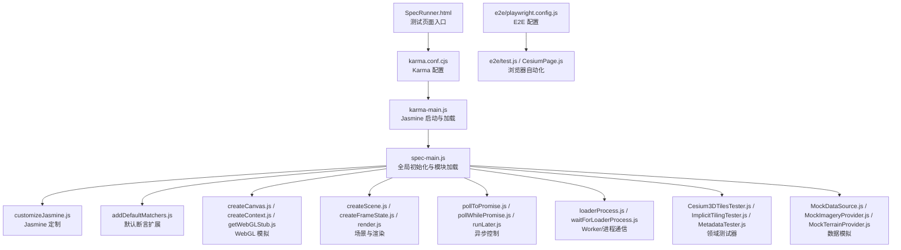
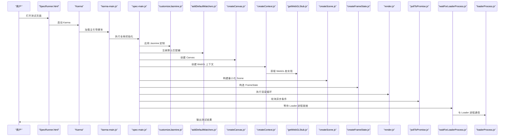
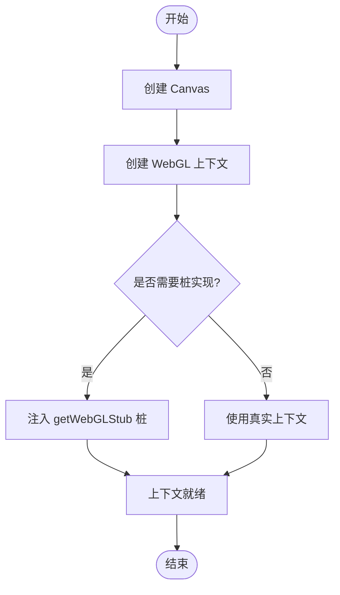
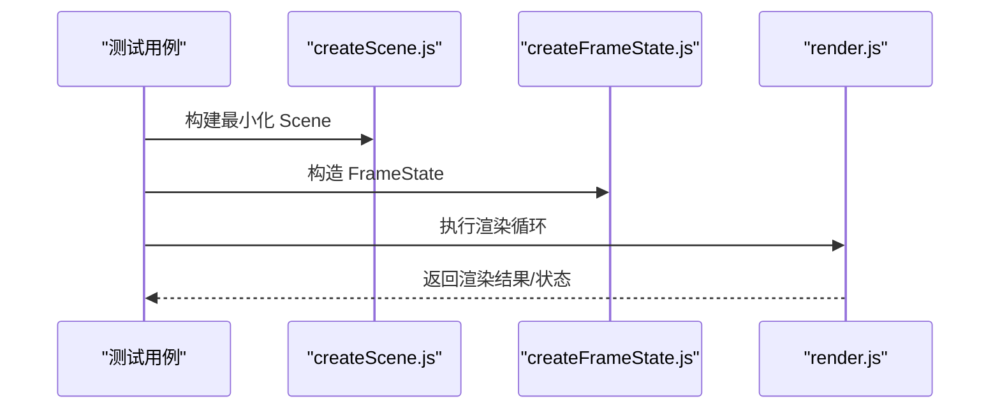
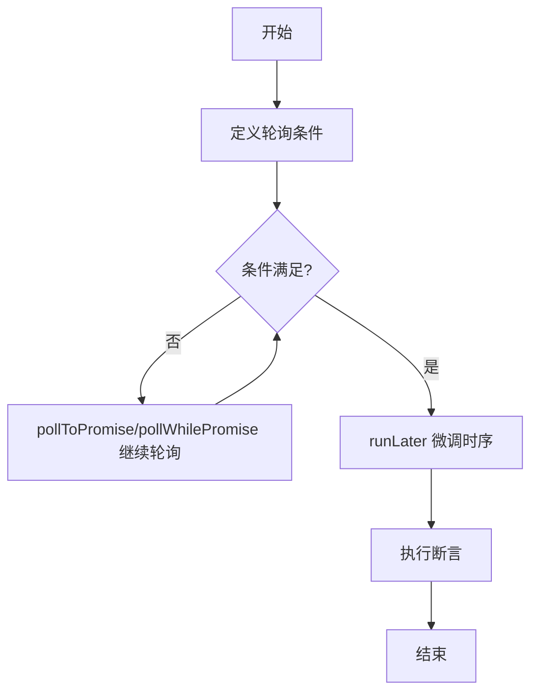
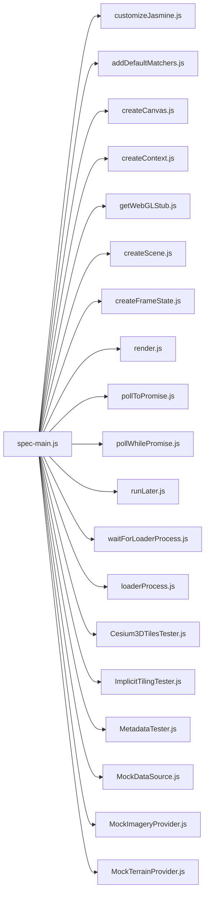

# 单元测试

<cite>
**本文引用的文件**   
- [SpecRunner.html](file://Specs/SpecRunner.html)
- [karma.conf.cjs](file://Specs/karma.conf.cjs)
- [karma-main.js](file://Specs/karma-main.js)
- [spec-main.js](file://Specs/spec-main.js)
- [customizeJasmine.js](file://Specs/customizeJasmine.js)
- [addDefaultMatchers.js](file://Specs/addDefaultMatchers.js)
- [createCanvas.js](file://Specs/createCanvas.js)
- [createContext.js](file://Specs/createContext.js)
- [getWebGLStub.js](file://Specs/getWebGLStub.js)
- [createScene.js](file://Specs/createScene.js)
- [createFrameState.js](file://Specs/createFrameState.js)
- [render.js](file://Specs/render.js)
- [pollToPromise.js](file://Specs/pollToPromise.js)
- [pollWhilePromise.js](file://Specs/pollWhilePromise.js)
- [runLater.js](file://Specs/runLater.js)
- [waitForLoaderProcess.js](file://Specs/waitForLoaderProcess.js)
- [loaderProcess.js](file://Specs/loaderProcess.js)
- [test.mjs](file://Specs/test.mjs)
- [test.cjs](file://Specs/test.cjs)
- [Cesium3DTilesTester.js](file://Specs/Cesium3DTilesTester.js)
- [ImplicitTilingTester.js](file://Specs/ImplicitTilingTester.js)
- [MetadataTester.js](file://Specs/MetadataTester.js)
- [TerrainTileProcessor.js](file://Specs/TerrainTileProcessor.js)
- [ViewportPrimitive.js](file://Specs/ViewportPrimitive.js)
- [MockDataSource.js](file://Specs/MockDataSource.js)
- [MockImageryProvider.js](file://Specs/MockImageryProvider.js)
- [MockTerrainProvider.js](file://Specs/MockTerrainProvider.js)
- [concatTypedArrays.js](file://Specs/concatTypedArrays.js)
- [dataUriToBuffer.js](file://Specs/dataUriToBuffer.js)
- [generateJsonBuffer.js](file://Specs/generateJsonBuffer.js)
- [pick.js](file://Specs/pick.js)
- [absolutize.js](file://Specs/absolutize.js)
- [e2e/playwright.config.js](file://Specs/e2e/playwright.config.js)
- [e2e/test.js](file://Specs/e2e/test.js)
- [e2e/CesiumPage.js](file://Specs/e2e/CesiumPage.js)
</cite>

## 目录
1. [简介](#简介)
2. [项目结构](#项目结构)
3. [核心组件](#核心组件)
4. [架构总览](#架构总览)
5. [详细组件分析](#详细组件分析)
6. [依赖分析](#依赖分析)
7. [性能考虑](#性能考虑)
8. [故障排查指南](#故障排查指南)
9. [结论](#结论)
10. [附录](#附录)（如有需要）

## 简介
本指南面向在 Cesium 项目中编写与运行单元测试的工程师，聚焦于基于 Jasmine 的测试框架配置、3D 渲染场景的测试方法、异步操作测试策略、测试数据与 Mock 管理，以及性能相关测试用例的编写技巧。文档以仓库中现有的测试基础设施为依据，提供从环境搭建到复杂场景验证的完整路径。

## 项目结构
Cesium 的测试体系位于 Specs 目录下，包含：
- 浏览器端测试入口与 Karma 配置
- Jasmine 定制与默认匹配器
- WebGL 上下文与 Canvas 模拟工具
- 场景、帧状态与渲染辅助
- 异步轮询与等待工具
- Loader 进程通信与 Worker 测试支持
- 针对 3DTiles、隐式瓦片、元数据等子系统的专用测试器
- E2E 端到端测试（Playwright）

**图表来源**
- [SpecRunner.html](file://Specs/SpecRunner.html)
- [karma.conf.cjs](file://Specs/karma.conf.cjs)
- [karma-main.js](file://Specs/karma-main.js)
- [spec-main.js](file://Specs/spec-main.js)
- [customizeJasmine.js](file://Specs/customizeJasmine.js)
- [addDefaultMatchers.js](file://Specs/addDefaultMatchers.js)
- [createCanvas.js](file://Specs/createCanvas.js)
- [createContext.js](file://Specs/createContext.js)
- [getWebGLStub.js](file://Specs/getWebGLStub.js)
- [createScene.js](file://Specs/createScene.js)
- [createFrameState.js](file://Specs/createFrameState.js)
- [render.js](file://Specs/render.js)
- [pollToPromise.js](file://Specs/pollToPromise.js)
- [pollWhilePromise.js](file://Specs/pollWhilePromise.js)
- [runLater.js](file://Specs/runLater.js)
- [loaderProcess.js](file://Specs/loaderProcess.js)
- [waitForLoaderProcess.js](file://Specs/waitForLoaderProcess.js)
- [Cesium3DTilesTester.js](file://Specs/Cesium3DTilesTester.js)
- [ImplicitTilingTester.js](file://Specs/ImplicitTilingTester.js)
- [MetadataTester.js](file://Specs/MetadataTester.js)
- [MockDataSource.js](file://Specs/MockDataSource.js)
- [MockImageryProvider.js](file://Specs/MockImageryProvider.js)
- [MockTerrainProvider.js](file://Specs/MockTerrainProvider.js)
- [e2e/playwright.config.js](file://Specs/e2e/playwright.config.js)
- [e2e/test.js](file://Specs/e2e/test.js)
- [e2e/CesiumPage.js](file://Specs/e2e/CesiumPage.js)

**章节来源**
- [SpecRunner.html](file://Specs/SpecRunner.html)
- [karma.conf.cjs](file://Specs/karma.conf.cjs)
- [karma-main.js](file://Specs/karma-main.js)
- [spec-main.js](file://Specs/spec-main.js)

## 核心组件
- 测试入口与运行器
  - SpecRunner.html：浏览器端测试页面，负责引入 Karma 与测试脚本。
  - karma.conf.cjs：Karma 配置文件，指定浏览器、预处理器、文件匹配与插件。
  - karma-main.js：Jasmine 启动与测试文件加载逻辑。
  - spec-main.js：全局初始化、模块加载顺序与测试前/后处理。
- Jasmine 定制与断言
  - customizeJasmine.js：对 Jasmine 行为进行定制（如超时、日志、报告）。
  - addDefaultMatchers.js：为常见对象类型添加深度比较与近似相等匹配器。
- WebGL 与 Canvas 模拟
  - createCanvas.js：创建用于测试的 Canvas 元素。
  - createContext.js：创建并注入 WebGL 上下文。
  - getWebGLStub.js：生成最小可用的 WebGL 桩实现，避免真实 GPU 依赖。
- 场景与渲染
  - createScene.js：构建最小化 Scene 实例，便于单元级渲染测试。
  - createFrameState.js：构造 FrameState，驱动渲染管线。
  - render.js：执行一次或多次渲染循环，捕获帧结果。
- 异步控制
  - pollToPromise.js / pollWhilePromise.js：将回调/Promise 包装为可轮询的 Promise。
  - runLater.js：延迟执行，配合事件循环稳定异步断言。
  - waitForLoaderProcess.js / loaderProcess.js：与 Loader 进程通信，等待 Worker 就绪。
- 领域测试器与数据模拟
  - Cesium3DTilesTester.js / ImplicitTilingTester.js / MetadataTester.js：封装常用 3D 场景断言。
  - MockDataSource.js / MockImageryProvider.js / MockTerrainProvider.js：提供轻量数据源与地形/影像提供者。
- E2E 测试
  - e2e/playwright.config.js：Playwright 配置。
  - e2e/test.js / e2e/CesiumPage.js：浏览器自动化与页面交互封装。

**章节来源**
- [SpecRunner.html](file://Specs/SpecRunner.html)
- [karma.conf.cjs](file://Specs/karma.conf.cjs)
- [karma-main.js](file://Specs/karma-main.js)
- [spec-main.js](file://Specs/spec-main.js)
- [customizeJasmine.js](file://Specs/customizeJasmine.js)
- [addDefaultMatchers.js](file://Specs/addDefaultMatchers.js)
- [createCanvas.js](file://Specs/createCanvas.js)
- [createContext.js](file://Specs/createContext.js)
- [getWebGLStub.js](file://Specs/getWebGLStub.js)
- [createScene.js](file://Specs/createScene.js)
- [createFrameState.js](file://Specs/createFrameState.js)
- [render.js](file://Specs/render.js)
- [pollToPromise.js](file://Specs/pollToPromise.js)
- [pollWhilePromise.js](file://Specs/pollWhilePromise.js)
- [runLater.js](file://Specs/runLater.js)
- [waitForLoaderProcess.js](file://Specs/waitForLoaderProcess.js)
- [loaderProcess.js](file://Specs/loaderProcess.js)
- [Cesium3DTilesTester.js](file://Specs/Cesium3DTilesTester.js)
- [ImplicitTilingTester.js](file://Specs/ImplicitTilingTester.js)
- [MetadataTester.js](file://Specs/MetadataTester.js)
- [MockDataSource.js](file://Specs/MockDataSource.js)
- [MockImageryProvider.js](file://Specs/MockImageryProvider.js)
- [MockTerrainProvider.js](file://Specs/MockTerrainProvider.js)
- [e2e/playwright.config.js](file://Specs/e2e/playwright.config.js)
- [e2e/test.js](file://Specs/e2e/test.js)
- [e2e/CesiumPage.js](file://Specs/e2e/CesiumPage.js)

## 架构总览
下图展示了从测试页面到具体测试执行的调用链与关键依赖关系。

**图表来源**
- [SpecRunner.html](file://Specs/SpecRunner.html)
- [karma.conf.cjs](file://Specs/karma.conf.cjs)
- [karma-main.js](file://Specs/karma-main.js)
- [spec-main.js](file://Specs/spec-main.js)
- [customizeJasmine.js](file://Specs/customizeJasmine.js)
- [addDefaultMatchers.js](file://Specs/addDefaultMatchers.js)
- [createCanvas.js](file://Specs/createCanvas.js)
- [createContext.js](file://Specs/createContext.js)
- [getWebGLStub.js](file://Specs/getWebGLStub.js)
- [createScene.js](file://Specs/createScene.js)
- [createFrameState.js](file://Specs/createFrameState.js)
- [render.js](file://Specs/render.js)
- [pollToPromise.js](file://Specs/pollToPromise.js)
- [waitForLoaderProcess.js](file://Specs/waitForLoaderProcess.js)
- [loaderProcess.js](file://Specs/loaderProcess.js)

## 详细组件分析

### 测试环境与 Jasmine 配置
- 测试入口与运行器
  - 通过 SpecRunner.html 加载 Karma，由 karma.conf.cjs 指定浏览器与测试文件集合。
  - karma-main.js 负责启动 Jasmine 并加载测试脚本；spec-main.js 完成全局初始化与模块加载顺序。
- Jasmine 定制与断言
  - customizeJasmine.js 调整 Jasmine 行为（例如超时、日志、报告格式）。
  - addDefaultMatchers.js 扩展匹配器，便于对复杂对象进行近似相等与深度比较。
- 最佳实践
  - 将耗时操作放入 afterAll/beforeAll，确保每个测试用例保持幂等与隔离。
  - 使用自定义匹配器统一浮点误差容忍度，减少不稳定断言。

**章节来源**
- [SpecRunner.html](file://Specs/SpecRunner.html)
- [karma.conf.cjs](file://Specs/karma.conf.cjs)
- [karma-main.js](file://Specs/karma-main.js)
- [spec-main.js](file://Specs/spec-main.js)
- [customizeJasmine.js](file://Specs/customizeJasmine.js)
- [addDefaultMatchers.js](file://Specs/addDefaultMatchers.js)

### WebGL 上下文与 Canvas 模拟
- 创建 Canvas 与 WebGL 上下文
  - createCanvas.js 提供最小化的 Canvas 元素。
  - createContext.js 创建 WebGL 上下文，结合 getWebGLStub.js 提供的桩实现，避免真实 GPU 依赖。
- 使用建议
  - 在 beforeAll 中一次性创建上下文，在 afterAll 中释放资源。
  - 对于特定特性缺失的环境，使用条件跳过测试。

**图表来源**
- [createCanvas.js](file://Specs/createCanvas.js)
- [createContext.js](file://Specs/createContext.js)
- [getWebGLStub.js](file://Specs/getWebGLStub.js)

**章节来源**
- [createCanvas.js](file://Specs/createCanvas.js)
- [createContext.js](file://Specs/createContext.js)
- [getWebGLStub.js](file://Specs/getWebGLStub.js)

### 3D 渲染场景与帧状态
- 场景与帧状态
  - createScene.js 构建最小化 Scene，便于单元级渲染测试。
  - createFrameState.js 构造 FrameState，驱动渲染管线。
  - render.js 执行渲染循环，可用于断言绘制调用次数、缓冲区内容或状态变化。
- 典型流程
  - 初始化场景与帧状态 -> 设置相机/光源/材质 -> 触发渲染 -> 断言结果。

**图表来源**
- [createScene.js](file://Specs/createScene.js)
- [createFrameState.js](file://Specs/createFrameState.js)
- [render.js](file://Specs/render.js)

**章节来源**
- [createScene.js](file://Specs/createScene.js)
- [createFrameState.js](file://Specs/createFrameState.js)
- [render.js](file://Specs/render.js)

### 异步操作测试策略
- Promise 与回调
  - pollToPromise.js 将回调/Promise 包装为可轮询的 Promise，适合等待外部状态稳定。
  - pollWhilePromise.js 持续轮询直到条件满足，适用于动态加载或网络请求。
  - runLater.js 延迟执行，配合事件循环确保异步断言时机正确。
- Loader 进程与 Worker
  - waitForLoaderProcess.js 与 loaderProcess.js 协同，等待 Loader 进程就绪后再执行后续测试。
- 推荐模式
  - 使用 async/await 包裹轮询函数，结合 Jasmine 的 done 或返回 Promise 的方式保证测试生命周期。

**图表来源**
- [pollToPromise.js](file://Specs/pollToPromise.js)
- [pollWhilePromise.js](file://Specs/pollWhilePromise.js)
- [runLater.js](file://Specs/runLater.js)
- [waitForLoaderProcess.js](file://Specs/waitForLoaderProcess.js)
- [loaderProcess.js](file://Specs/loaderProcess.js)

**章节来源**
- [pollToPromise.js](file://Specs/pollToPromise.js)
- [pollWhilePromise.js](file://Specs/pollWhilePromise.js)
- [runLater.js](file://Specs/runLater.js)
- [waitForLoaderProcess.js](file://Specs/waitForLoaderProcess.js)
- [loaderProcess.js](file://Specs/loaderProcess.js)

### 测试数据准备与管理
- 数据与缓冲
  - generateJsonBuffer.js 生成 JSON 缓冲，用于快速构造测试载荷。
  - dataUriToBuffer.js 将 Data URI 转换为 Buffer，便于二进制数据处理。
  - concatTypedArrays.js 拼接 TypedArray，组合几何或纹理数据。
- 资源与路径
  - absolutize.js 规范化资源路径，确保跨平台一致性。
  - pick.js 选择测试数据，按标签或维度筛选数据集。
- 使用建议
  - 将大型数据放在独立文件，按需加载，避免阻塞测试启动。
  - 使用缓存机制复用已解析的数据，提高测试稳定性与速度。

**章节来源**
- [generateJsonBuffer.js](file://Specs/generateJsonBuffer.js)
- [dataUriToBuffer.js](file://Specs/dataUriToBuffer.js)
- [concatTypedArrays.js](file://Specs/concatTypedArrays.js)
- [absolutize.js](file://Specs/absolutize.js)
- [pick.js](file://Specs/pick.js)

### 领域测试器与 Mock 对象
- 领域测试器
  - Cesium3DTilesTester.js：封装 3DTiles 加载、更新与可视化的常用断言。
  - ImplicitTilingTester.js：针对隐式瓦片的加载与细节层次切换进行测试。
  - MetadataTester.js：校验元数据的结构与语义。
- Mock 对象
  - MockDataSource.js：模拟数据源，控制数据更新节奏与返回值。
  - MockImageryProvider.js：模拟影像提供者，返回固定图块或错误。
  - MockTerrainProvider.js：模拟地形提供者，提供可控高度数据。
- 使用建议
  - 将 Mock 对象作为依赖注入，避免耦合真实网络与磁盘 IO。
  - 在 beforeEach 重置 Mock 状态，确保测试间隔离。

**章节来源**
- [Cesium3DTilesTester.js](file://Specs/Cesium3DTilesTester.js)
- [ImplicitTilingTester.js](file://Specs/ImplicitTilingTester.js)
- [MetadataTester.js](file://Specs/MetadataTester.js)
- [MockDataSource.js](file://Specs/MockDataSource.js)
- [MockImageryProvider.js](file://Specs/MockImageryProvider.js)
- [MockTerrainProvider.js](file://Specs/MockTerrainProvider.js)

### 端到端（E2E）测试
- Playwright 配置与页面封装
  - e2e/playwright.config.js：浏览器与视口配置、并行度与重试策略。
  - e2e/test.js：测试入口，组织用例与断言。
  - e2e/CesiumPage.js：封装页面交互（点击、拖拽、截图），简化 E2E 用例编写。
- 适用场景
  - 集成渲染、交互与第三方服务联调。
  - 回归视觉对比与跨浏览器兼容性验证。

**章节来源**
- [e2e/playwright.config.js](file://Specs/e2e/playwright.config.js)
- [e2e/test.js](file://Specs/e2e/test.js)
- [e2e/CesiumPage.js](file://Specs/e2e/CesiumPage.js)

## 依赖分析
测试模块之间的依赖关系如下：

**图表来源**
- [spec-main.js](file://Specs/spec-main.js)
- [customizeJasmine.js](file://Specs/customizeJasmine.js)
- [addDefaultMatchers.js](file://Specs/addDefaultMatchers.js)
- [createCanvas.js](file://Specs/createCanvas.js)
- [createContext.js](file://Specs/createContext.js)
- [getWebGLStub.js](file://Specs/getWebGLStub.js)
- [createScene.js](file://Specs/createScene.js)
- [createFrameState.js](file://Specs/createFrameState.js)
- [render.js](file://Specs/render.js)
- [pollToPromise.js](file://Specs/pollToPromise.js)
- [pollWhilePromise.js](file://Specs/pollWhilePromise.js)
- [runLater.js](file://Specs/runLater.js)
- [waitForLoaderProcess.js](file://Specs/waitForLoaderProcess.js)
- [loaderProcess.js](file://Specs/loaderProcess.js)
- [Cesium3DTilesTester.js](file://Specs/Cesium3DTilesTester.js)
- [ImplicitTilingTester.js](file://Specs/ImplicitTilingTester.js)
- [MetadataTester.js](file://Specs/MetadataTester.js)
- [MockDataSource.js](file://Specs/MockDataSource.js)
- [MockImageryProvider.js](file://Specs/MockImageryProvider.js)
- [MockTerrainProvider.js](file://Specs/MockTerrainProvider.js)

**章节来源**
- [spec-main.js](file://Specs/spec-main.js)

## 性能考虑
- 渲染与帧状态
  - 使用 createFrameState.js 精确控制渲染步长，避免不必要的重绘。
  - 在 render.js 中限制渲染次数，仅断言必要状态，降低测试开销。
- 数据与内存
  - 使用 generateJsonBuffer.js 与 dataUriToBuffer.js 减少重复解析。
  - 利用 concatTypedArrays.js 批量处理数组，避免频繁分配。
- 异步与调度
  - 合理设置轮询间隔与最大重试次数，防止测试长时间挂起。
  - 使用 runLater.js 微调时序，减少竞态条件导致的抖动。
- 覆盖率与基准
  - 结合 Karma 覆盖率插件统计关键路径覆盖。
  - 对热点函数编写基准用例，监控回归。

[本节为通用指导，不直接分析具体文件]

## 故障排查指南
- WebGL 上下文不可用
  - 检查 createCanvas.js 与 createContext.js 是否正确创建与注入上下文。
  - 确认 getWebGLStub.js 的桩实现是否满足最小 API 需求。
- 异步测试不稳定
  - 使用 pollToPromise.js 与 pollWhilePromise.js 替代硬编码延时。
  - 借助 runLater.js 在断言前让出事件循环，确保状态同步。
- Loader 进程未就绪
  - 使用 waitForLoaderProcess.js 等待进程就绪，再执行后续测试。
  - 检查 loaderProcess.js 的通信协议与错误处理。
- 资源路径问题
  - 使用 absolutize.js 规范化路径，避免跨平台差异。
  - 通过 pick.js 选择合适的数据集，减少无关资源干扰。

**章节来源**
- [createCanvas.js](file://Specs/createCanvas.js)
- [createContext.js](file://Specs/createContext.js)
- [getWebGLStub.js](file://Specs/getWebGLStub.js)
- [pollToPromise.js](file://Specs/pollToPromise.js)
- [pollWhilePromise.js](file://Specs/pollWhilePromise.js)
- [runLater.js](file://Specs/runLater.js)
- [waitForLoaderProcess.js](file://Specs/waitForLoaderProcess.js)
- [loaderProcess.js](file://Specs/loaderProcess.js)
- [absolutize.js](file://Specs/absolutize.js)
- [pick.js](file://Specs/pick.js)

## 结论
通过合理利用 Jasmine 定制、WebGL 模拟、场景与帧状态工具、异步轮询与 Loader 进程等待机制，以及领域测试器与 Mock 对象，可以在 Cesium 项目中建立稳定高效的单元测试体系。遵循本文的最佳实践与故障排查建议，能够显著提升核心功能的正确性与稳定性，并为后续性能优化与回归测试奠定基础。

[本节为总结性内容，不直接分析具体文件]

## 附录
- Node 端测试入口
  - test.mjs / test.cjs：Node 环境下运行测试的入口脚本，便于 CI 集成与批处理。
- 其他辅助工具
  - TerrainTileProcessor.js：地形瓦片处理辅助。
  - ViewportPrimitive.js：视口原语，用于渲染区域控制。

**章节来源**
- [test.mjs](file://Specs/test.mjs)
- [test.cjs](file://Specs/test.cjs)
- [TerrainTileProcessor.js](file://Specs/TerrainTileProcessor.js)
- [ViewportPrimitive.js](file://Specs/ViewportPrimitive.js)