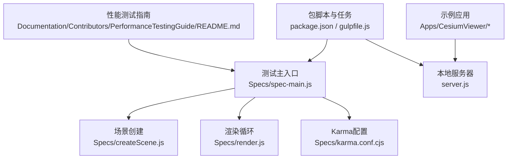
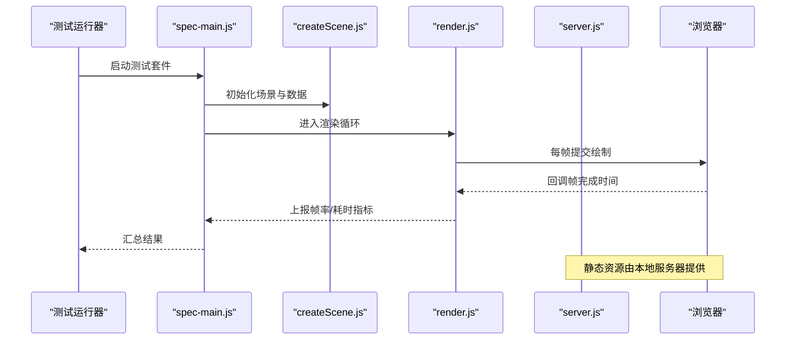
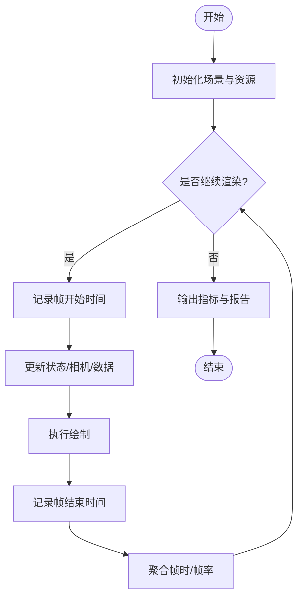
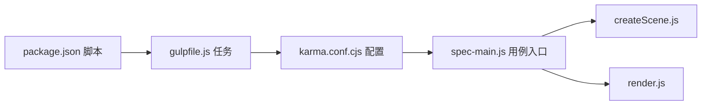
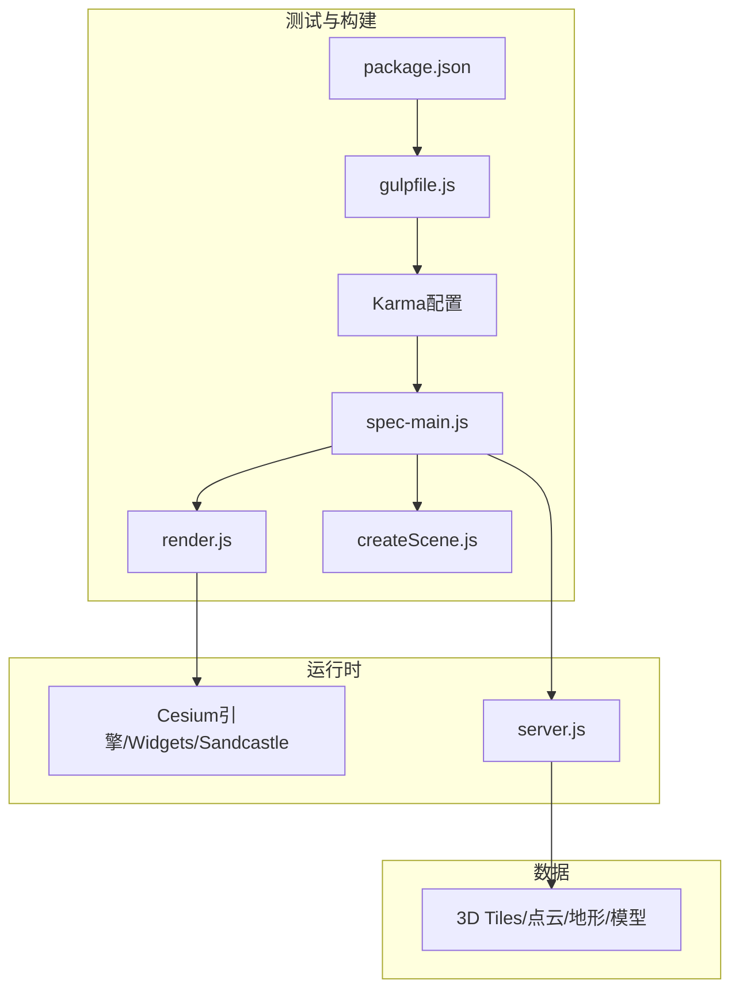

# 性能测试

<cite>
**本文引用的文件**   
- [PerformanceTestingGuide/README.md](file://Documentation/Contributors/PerformanceTestingGuide/README.md)
- [Specs/createScene.js](file://Specs/createScene.js)
- [Specs/render.js](file://Specs/render.js)
- [Specs/spec-main.js](file://Specs/spec-main.js)
- [Specs/karma.conf.cjs](file://Specs/karma.conf.cjs)
- [package.json](file://package.json)
- [gulpfile.js](file://gulpfile.js)
- [server.js](file://server.js)
- [Apps/CesiumViewer/CesiumViewer.js](file://Apps/CesiumViewer/CesiumViewer.js)
- [Apps/CesiumViewer/index.html](file://Apps/CesiumViewer/index.html)
</cite>

## 目录
1. [简介](#简介)
2. [项目结构](#项目结构)
3. [核心组件](#核心组件)
4. [架构总览](#架构总览)
5. [详细组件分析](#详细组件分析)
6. [依赖分析](#依赖分析)
7. [性能考量](#性能考量)
8. [故障排查指南](#故障排查指南)
9. [结论](#结论)
10. [附录](#附录)

## 简介
本文件面向Cesium项目的性能测试，覆盖基准测试构建与实施、帧率监控、内存使用分析与渲染性能评估；说明如何使用Chrome DevTools进行火焰图、内存快照比较和网络请求优化；阐述大规模数据场景（3D Tiles加载、点云渲染、内存管理）的性能测试策略；并提供性能回归测试、压力与负载测试的设计思路，确保代码变更不会导致性能退化。

## 项目结构
仓库中与性能测试相关的核心位置包括：
- 贡献者文档中的性能测试指南
- Specs下的场景创建、渲染循环与Karma配置
- 根级构建脚本与服务器启动入口
- Apps示例应用用于手动验证与演示

图表来源
- [PerformanceTestingGuide/README.md](file://Documentation/Contributors/PerformanceTestingGuide/README.md)
- [Specs/createScene.js](file://Specs/createScene.js)
- [Specs/render.js](file://Specs/render.js)
- [Specs/spec-main.js](file://Specs/spec-main.js)
- [Specs/karma.conf.cjs](file://Specs/karma.conf.cjs)
- [package.json](file://package.json)
- [gulpfile.js](file://gulpfile.js)
- [server.js](file://server.js)
- [Apps/CesiumViewer/CesiumViewer.js](file://Apps/CesiumViewer/CesiumViewer.js)
- [Apps/CesiumViewer/index.html](file://Apps/CesiumViewer/index.html)

章节来源
- [PerformanceTestingGuide/README.md](file://Documentation/Contributors/PerformanceTestingGuide/README.md)
- [Specs/spec-main.js](file://Specs/spec-main.js)
- [Specs/createScene.js](file://Specs/createScene.js)
- [Specs/render.js](file://Specs/render.js)
- [Specs/karma.conf.cjs](file://Specs/karma.conf.cjs)
- [package.json](file://package.json)
- [gulpfile.js](file://gulpfile.js)
- [server.js](file://server.js)
- [Apps/CesiumViewer/CesiumViewer.js](file://Apps/CesiumViewer/CesiumViewer.js)
- [Apps/CesiumViewer/index.html](file://Apps/CesiumViewer/index.html)

## 核心组件
- 性能测试指南：定义测试目标、指标与流程规范，作为基准测试的权威参考。
- 场景与渲染：通过统一入口创建场景并驱动渲染循环，便于在自动化测试中采集帧率与渲染耗时。
- Karma与包脚本：提供浏览器端测试运行环境与构建任务，支撑可重复执行的基准用例。
- 本地服务器：为静态资源与测试数据提供服务，保证网络层行为稳定可控。
- 示例应用：用于手工验证与演示，配合DevTools进行深度分析。

章节来源
- [PerformanceTestingGuide/README.md](file://Documentation/Contributors/PerformanceTestingGuide/README.md)
- [Specs/spec-main.js](file://Specs/spec-main.js)
- [Specs/createScene.js](file://Specs/createScene.js)
- [Specs/render.js](file://Specs/render.js)
- [Specs/karma.conf.cjs](file://Specs/karma.conf.cjs)
- [package.json](file://package.json)
- [gulpfile.js](file://gulpfile.js)
- [server.js](file://server.js)
- [Apps/CesiumViewer/CesiumViewer.js](file://Apps/CesiumViewer/CesiumViewer.js)
- [Apps/CesiumViewer/index.html](file://Apps/CesiumViewer/index.html)

## 架构总览
下图展示了从测试入口到渲染循环的关键路径，以及Karma与本地服务器的协作关系。

图表来源
- [Specs/spec-main.js](file://Specs/spec-main.js)
- [Specs/createScene.js](file://Specs/createScene.js)
- [Specs/render.js](file://Specs/render.js)
- [server.js](file://server.js)

## 详细组件分析

### 性能测试指南与指标体系
- 目标与范围：明确基准测试应覆盖的维度（帧率、内存、渲染管线热点、网络I/O）。
- 指标定义：建议以P50/P95/P99分位统计帧时，记录JS堆大小、GPU内存占用、首帧时间与长任务占比。
- 环境约束：固定设备、浏览器版本、GPU驱动与网络条件，减少噪声。
- 基线维护：建立基线数据集与阈值，任何回归需触发告警。

章节来源
- [PerformanceTestingGuide/README.md](file://Documentation/Contributors/PerformanceTestingGuide/README.md)

### 场景与渲染循环（基准数据采集）
- 场景初始化：在统一入口中创建场景、加载必要资源，避免随机性。
- 渲染循环：在每帧回调中记录开始/结束时间，计算帧时并聚合统计。
- 指标上报：将帧率、渲染耗时、资源加载耗时等指标输出至测试报告或外部系统。

图表来源
- [Specs/createScene.js](file://Specs/createScene.js)
- [Specs/render.js](file://Specs/render.js)

章节来源
- [Specs/createScene.js](file://Specs/createScene.js)
- [Specs/render.js](file://Specs/render.js)

### 测试运行与Karma集成
- 测试主入口：组织基准用例、控制生命周期与指标收集。
- Karma配置：指定浏览器、并行度、超时与覆盖率开关，确保稳定执行。
- 包脚本与Gulp：封装常用命令，如构建、运行测试、启动本地服务器。

图表来源
- [package.json](file://package.json)
- [gulpfile.js](file://gulpfile.js)
- [Specs/karma.conf.cjs](file://Specs/karma.conf.cjs)
- [Specs/spec-main.js](file://Specs/spec-main.js)
- [Specs/createScene.js](file://Specs/createScene.js)
- [Specs/render.js](file://Specs/render.js)

章节来源
- [Specs/spec-main.js](file://Specs/spec-main.js)
- [Specs/karma.conf.cjs](file://Specs/karma.conf.cjs)
- [package.json](file://package.json)
- [gulpfile.js](file://gulpfile.js)

### 本地服务器与静态资源
- 作用：为测试与示例应用提供稳定的HTTP服务，避免文件系统协议差异导致的缓存与跨域问题。
- 建议：开启压缩、合理设置缓存头，固定端口与根路径，便于CI复用。

章节来源
- [server.js](file://server.js)

### 示例应用（手工验证与演示）
- 用途：快速加载典型场景，结合DevTools进行火焰图、内存快照与网络面板分析。
- 建议：提供多组预设（小/中/大场景），便于对比不同配置与数据规模的影响。

章节来源
- [Apps/CesiumViewer/CesiumViewer.js](file://Apps/CesiumViewer/CesiumViewer.js)
- [Apps/CesiumViewer/index.html](file://Apps/CesiumViewer/index.html)

## 依赖分析
- 测试框架与运行器：Karma负责浏览器端执行，配合包脚本与Gulp任务形成完整流水线。
- 运行时依赖：Cesium引擎与Widgets、Sandcastle等包提供渲染与交互能力。
- 外部资源：3D Tiles、点云、地形与模型等资源位于Apps/Specs/Data下，供基准用例加载。

图表来源
- [Specs/karma.conf.cjs](file://Specs/karma.conf.cjs)
- [Specs/spec-main.js](file://Specs/spec-main.js)
- [Specs/render.js](file://Specs/render.js)
- [Specs/createScene.js](file://Specs/createScene.js)
- [gulpfile.js](file://gulpfile.js)
- [package.json](file://package.json)
- [server.js](file://server.js)

章节来源
- [Specs/karma.conf.cjs](file://Specs/karma.conf.cjs)
- [Specs/spec-main.js](file://Specs/spec-main.js)
- [Specs/render.js](file://Specs/render.js)
- [Specs/createScene.js](file://Specs/createScene.js)
- [gulpfile.js](file://gulpfile.js)
- [package.json](file://package.json)
- [server.js](file://server.js)

## 性能考量
- 帧率监控
  - 使用每帧时间戳计算帧时，统计P50/P95/P99，关注抖动与长尾。
  - 区分CPU侧（JS）与GPU侧（绘制调用）瓶颈，必要时拆分统计。
- 内存使用分析
  - 记录JS堆大小、DOM节点数、纹理与缓冲区占用，观察泄漏趋势。
  - 对大数据集采用增量加载与显存回收策略，避免峰值过高。
- 渲染性能评估
  - 统计draw call数量、顶点/索引量、着色器编译次数与时长。
  - 利用批处理、实例化与LOD降低渲染开销。
- 网络与I/O
  - 合并请求、启用压缩与缓存，限制并发以避免拥塞。
  - 对3D Tiles与点云采用按需加载与视锥剔除。

[本节为通用指导，不直接分析具体文件]

## 故障排查指南
- 常见问题定位
  - 帧率骤降：检查是否有阻塞式操作、频繁重建几何体或材质、未释放对象。
  - 内存持续增长：确认是否存在闭包引用、事件监听未移除、纹理未销毁。
  - 首帧过慢：排查资源体积过大、解码耗时高、同步解析逻辑。
- 工具与技巧
  - Chrome DevTools：使用Performance面板录制火焰图，Memory面板做堆快照对比，Network面板分析请求时序与体积。
  - GPU Profiler：定位着色器热点与过度绘制。
  - 日志与埋点：在关键路径插入轻量计时，输出到控制台或测试报告。
- 回归检测
  - 将关键指标纳入自动化用例，设定阈值，失败即阻断合并。

章节来源
- [PerformanceTestingGuide/README.md](file://Documentation/Contributors/PerformanceTestingGuide/README.md)
- [Specs/spec-main.js](file://Specs/spec-main.js)
- [Specs/render.js](file://Specs/render.js)

## 结论
通过统一的场景与渲染循环、Karma驱动的自动化执行、以及DevTools的深度分析，可以构建覆盖帧率、内存与渲染性能的完整基准体系。结合3D Tiles与点云的大规模数据场景，持续监控与回归检测能有效保障性能稳定性与用户体验。

[本节为总结性内容，不直接分析具体文件]

## 附录

### 使用Chrome DevTools进行性能分析
- 火焰图分析
  - 打开Performance面板，录制交互过程，聚焦长任务与函数调用栈，识别热点。
- 内存快照比较
  - 在关键操作前后分别抓取Heap Snapshot，对比对象增长与保留树，定位泄漏源。
- 网络请求优化
  - 查看Waterfall与Size/Time分布，优先优化首屏与热路径资源，启用缓存与压缩。

[本节为通用指导，不直接分析具体文件]

### 大规模数据场景的性能测试策略
- 3D Tiles加载性能
  - 按视距与几何误差动态加载，控制并发与队列长度，避免突发IO。
- 点云渲染效率
  - 使用批处理与压缩格式，合理设置可视半径与采样密度，减少无效绘制。
- 内存管理优化
  - 实现显存与内存的分级缓存，及时释放不可见资源，避免碎片化。

[本节为通用指导，不直接分析具体文件]

### 性能回归测试的实现方法
- 设计要点
  - 固定数据集与环境，定义明确的指标与阈值，输出结构化报告。
  - 将关键用例纳入CI，失败即阻断，附带差异摘要与截图/视频。
- 落地步骤
  - 在测试入口编排场景与操作序列，在渲染循环中采集指标，最终汇总到报告。

章节来源
- [Specs/spec-main.js](file://Specs/spec-main.js)
- [Specs/render.js](file://Specs/render.js)

### 压力测试与负载测试设计思路
- 压力测试
  - 逐步增加场景复杂度（对象数量、纹理分辨率、阴影质量），直至出现卡顿或崩溃，记录临界点。
- 负载测试
  - 模拟多用户并发访问同一资源，观察服务器吞吐、带宽与延迟变化，调整缓存与限流策略。
- 稳定性验证
  - 长时间运行（如24小时）监控内存与帧率漂移，发现潜在泄漏与退化。

[本节为通用指导，不直接分析具体文件]