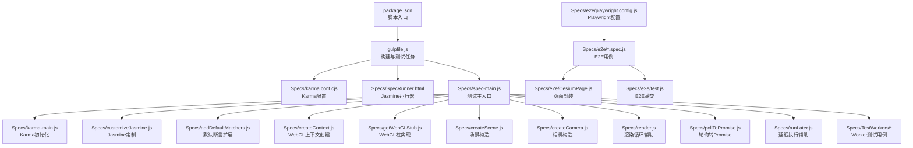
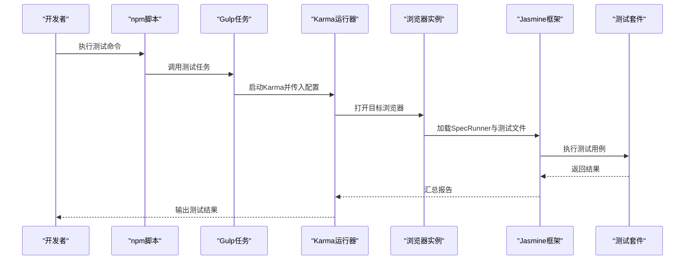
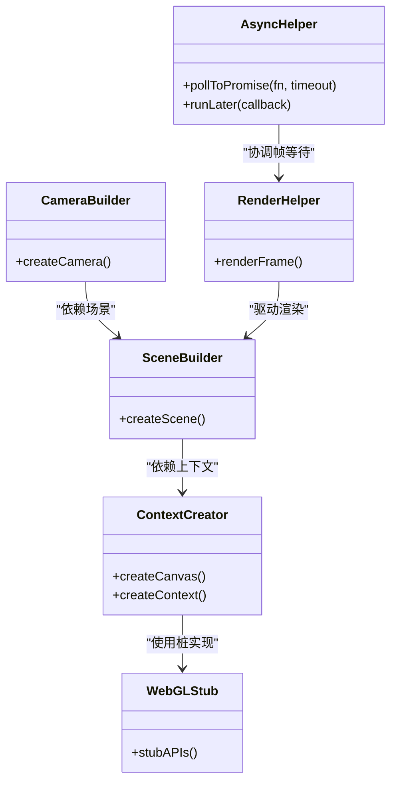
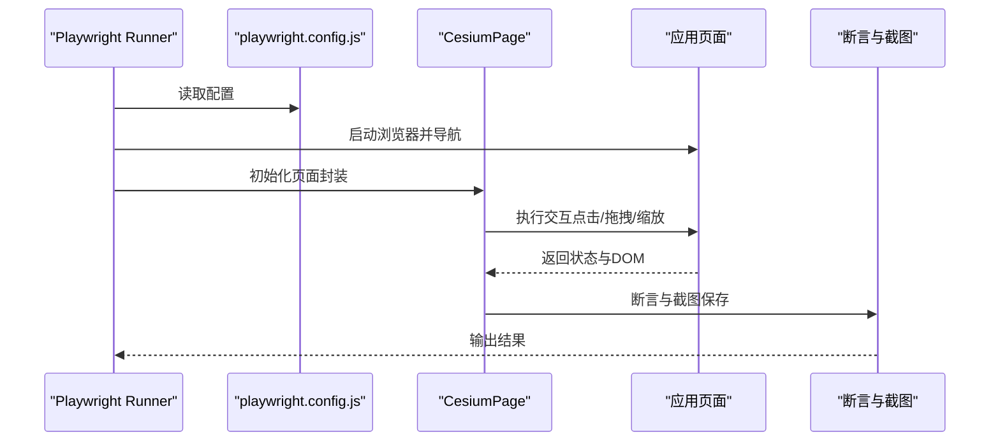
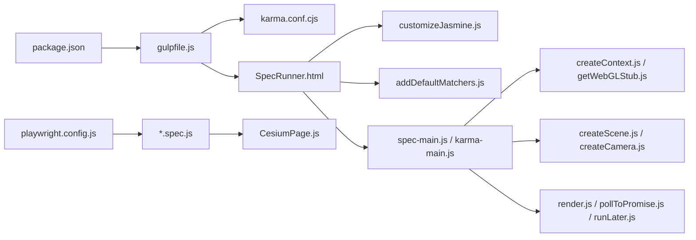

# 测试与调试

<cite>
**本文引用的文件**
- [package.json](file://package.json)
- [gulpfile.js](file://gulpfile.js)
- [Specs/SpecRunner.html](file://Specs/SpecRunner.html)
- [Specs/karma.conf.cjs](file://Specs/karma.conf.cjs)
- [Specs/karma-main.js](file://Specs/karma-main.js)
- [Specs/spec-main.js](file://Specs/spec-main.js)
- [Specs/customizeJasmine.js](file://Specs/customizeJasmine.js)
- [Specs/addDefaultMatchers.js](file://Specs/addDefaultMatchers.js)
- [Specs/createContext.js](file://Specs/createContext.js)
- [Specs/getWebGLStub.js](file://Specs/getWebGLStub.js)
- [Specs/createScene.js](file://Specs/createScene.js)
- [Specs/createCamera.js](file://Specs/createCamera.js)
- [Specs/render.js](file://Specs/render.js)
- [Specs/pollToPromise.js](file://Specs/pollToPromise.js)
- [Specs/runLater.js](file://Specs/runLater.js)
- [Specs/TestWorkers/returnParameters.js](file://Specs/TestWorkers/returnParameters.js)
- [Specs/e2e/playwright.config.js](file://Specs/e2e/playwright.config.js)
- [Specs/e2e/CesiumPage.js](file://Specs/e2e/CesiumPage.js)
- [Specs/e2e/test.js](file://Specs/e2e/test.js)
- [Documentation/Contributors/TestingGuide/README.md](file://Documentation/Contributors/TestingGuide/README.md)
- [Documentation/Contributors/PerformanceTestingGuide/README.md](file://Documentation/Contributors/PerformanceTestingGuide/README.md)
</cite>

## 目录
1. [简介](#简介)
2. [项目结构](#项目结构)
3. [核心组件](#核心组件)
4. [架构总览](#架构总览)
5. [详细组件分析](#详细组件分析)
6. [依赖分析](#依赖分析)
7. [性能考虑](#性能考虑)
8. [故障排查指南](#故障排查指南)
9. [结论](#结论)
10. [附录](#附录)

## 简介
本指南面向Cesium项目的测试与调试，覆盖单元测试、端到端测试、渲染相关测试技巧、调试工具与性能测试策略。内容基于仓库中现有的测试基础设施与文档，帮助读者快速搭建并高效使用Jasmine+Karma的单元测试环境，以及基于Playwright的浏览器自动化测试；同时提供针对3D渲染场景的测试方法（模拟WebGL上下文、异步操作）和性能测试建议。

## 项目结构
Cesium的测试体系主要分布在以下位置：
- Specs：单元测试与E2E测试代码、测试数据、Karma配置、Jasmine定制、渲染辅助等
- Documentation/Contributors/TestingGuide：官方测试指南
- Documentation/Contributors/PerformanceTestingGuide：性能测试指南
- package.json/gulpfile.js：构建与脚本入口，包含测试任务定义

图表来源
- [package.json](file://package.json)
- [gulpfile.js](file://gulpfile.js)
- [Specs/karma.conf.cjs](file://Specs/karma.conf.cjs)
- [Specs/SpecRunner.html](file://Specs/SpecRunner.html)
- [Specs/spec-main.js](file://Specs/spec-main.js)
- [Specs/karma-main.js](file://Specs/karma-main.js)
- [Specs/customizeJasmine.js](file://Specs/customizeJasmine.js)
- [Specs/addDefaultMatchers.js](file://Specs/addDefaultMatchers.js)
- [Specs/createContext.js](file://Specs/createContext.js)
- [Specs/getWebGLStub.js](file://Specs/getWebGLStub.js)
- [Specs/createScene.js](file://Specs/createScene.js)
- [Specs/createCamera.js](file://Specs/createCamera.js)
- [Specs/render.js](file://Specs/render.js)
- [Specs/pollToPromise.js](file://Specs/pollToPromise.js)
- [Specs/runLater.js](file://Specs/runLater.js)
- [Specs/TestWorkers/returnParameters.js](file://Specs/TestWorkers/returnParameters.js)
- [Specs/e2e/playwright.config.js](file://Specs/e2e/playwright.config.js)
- [Specs/e2e/CesiumPage.js](file://Specs/e2e/CesiumPage.js)
- [Specs/e2e/test.js](file://Specs/e2e/test.js)

章节来源
- [package.json](file://package.json)
- [gulpfile.js](file://gulpfile.js)
- [Documentation/Contributors/TestingGuide/README.md](file://Documentation/Contributors/TestingGuide/README.md)

## 核心组件
- Jasmine测试框架：通过SpecRunner.html加载测试套件，支持describe/it等语法
- Karma测试运行器：在真实浏览器环境中运行Jasmine测试，支持多浏览器并行
- WebGL上下文模拟：createContext.js与getWebGLStub.js提供最小可用的WebGL能力，满足3D渲染逻辑的测试需求
- 场景与相机构造：createScene.js与createCamera.js用于快速搭建可测的3D场景
- 渲染与异步辅助：render.js、pollToPromise.js、runLater.js用于驱动渲染帧与处理异步时序
- Worker测试：TestWorkers目录下的脚本用于验证Web Worker通信与参数传递
- E2E测试：基于Playwright，配合CesiumPage封装与test基类进行跨浏览器自动化测试

章节来源
- [Specs/SpecRunner.html](file://Specs/SpecRunner.html)
- [Specs/karma.conf.cjs](file://Specs/karma.conf.cjs)
- [Specs/createContext.js](file://Specs/createContext.js)
- [Specs/getWebGLStub.js](file://Specs/getWebGLStub.js)
- [Specs/createScene.js](file://Specs/createScene.js)
- [Specs/createCamera.js](file://Specs/createCamera.js)
- [Specs/render.js](file://Specs/render.js)
- [Specs/pollToPromise.js](file://Specs/pollToPromise.js)
- [Specs/runLater.js](file://Specs/runLater.js)
- [Specs/TestWorkers/returnParameters.js](file://Specs/TestWorkers/returnParameters.js)
- [Specs/e2e/playwright.config.js](file://Specs/e2e/playwright.config.js)
- [Specs/e2e/CesiumPage.js](file://Specs/e2e/CesiumPage.js)
- [Specs/e2e/test.js](file://Specs/e2e/test.js)

## 架构总览
下图展示了从构建脚本到测试运行的整体流程，包括单元测试与E2E两条路径。

图表来源
- [package.json](file://package.json)
- [gulpfile.js](file://gulpfile.js)
- [Specs/karma.conf.cjs](file://Specs/karma.conf.cjs)
- [Specs/SpecRunner.html](file://Specs/SpecRunner.html)

## 详细组件分析

### 单元测试框架配置与使用（Jasmine + Karma）
- 运行入口
  - SpecRunner.html作为Jasmine运行器，负责加载测试文件与自定义匹配器
  - karma.conf.cjs定义浏览器、文件匹配、插件与覆盖率等
  - spec-main.js为测试主入口，负责初始化环境与加载测试模块
  - karma-main.js在Karma环境下完成必要的初始化工作
- 关键定制
  - customizeJasmine.js对Jasmine行为进行扩展（如超时、全局钩子）
  - addDefaultMatchers.js添加常用断言匹配器，提升可读性与稳定性
- 典型用法
  - 使用describe/it组织测试用例
  - 结合createScene/createCamera快速搭建3D场景
  - 使用pollToPromise/runLater处理异步与渲染帧等待

图表来源
- [Specs/SpecRunner.html](file://Specs/SpecRunner.html)
- [Specs/karma.conf.cjs](file://Specs/karma.conf.cjs)
- [Specs/spec-main.js](file://Specs/spec-main.js)
- [Specs/karma-main.js](file://Specs/karma-main.js)
- [Specs/customizeJasmine.js](file://Specs/customizeJasmine.js)
- [Specs/addDefaultMatchers.js](file://Specs/addDefaultMatchers.js)
- [Specs/pollToPromise.js](file://Specs/pollToPromise.js)
- [Specs/runLater.js](file://Specs/runLater.js)

章节来源
- [Specs/SpecRunner.html](file://Specs/SpecRunner.html)
- [Specs/karma.conf.cjs](file://Specs/karma.conf.cjs)
- [Specs/spec-main.js](file://Specs/spec-main.js)
- [Specs/karma-main.js](file://Specs/karma-main.js)
- [Specs/customizeJasmine.js](file://Specs/customizeJasmine.js)
- [Specs/addDefaultMatchers.js](file://Specs/addDefaultMatchers.js)

### 3D渲染场景测试（WebGL上下文与异步）
- WebGL上下文模拟
  - createContext.js提供最小可用Canvas与WebGL上下文
  - getWebGLStub.js提供必要的WebGL API桩实现，避免真实GPU依赖
- 场景与相机
  - createScene.js创建可测的Scene实例
  - createCamera.js创建稳定的Camera实例，便于定位与断言
- 渲染驱动与异步
  - render.js驱动渲染循环，确保资源加载与绘制完成
  - pollToPromise.js将轮询逻辑转为Promise，简化异步断言
  - runLater.js用于在下一帧或微任务后执行回调

图表来源
- [Specs/createContext.js](file://Specs/createContext.js)
- [Specs/getWebGLStub.js](file://Specs/getWebGLStub.js)
- [Specs/createScene.js](file://Specs/createScene.js)
- [Specs/createCamera.js](file://Specs/createCamera.js)
- [Specs/render.js](file://Specs/render.js)
- [Specs/pollToPromise.js](file://Specs/pollToPromise.js)
- [Specs/runLater.js](file://Specs/runLater.js)

章节来源
- [Specs/createContext.js](file://Specs/createContext.js)
- [Specs/getWebGLStub.js](file://Specs/getWebGLStub.js)
- [Specs/createScene.js](file://Specs/createScene.js)
- [Specs/createCamera.js](file://Specs/createCamera.js)
- [Specs/render.js](file://Specs/render.js)
- [Specs/pollToPromise.js](file://Specs/pollToPromise.js)
- [Specs/runLater.js](file://Specs/runLater.js)

### Web Worker测试
- 目的：验证Worker线程间的数据传递、序列化与错误处理
- 示例：TestWorkers/returnParameters.js用于向Worker发送参数并校验返回值
- 建议：在单元测试中隔离网络与GPU，仅关注Worker逻辑与边界条件

章节来源
- [Specs/TestWorkers/returnParameters.js](file://Specs/TestWorkers/returnParameters.js)

### 端到端测试（Playwright）
- 配置：playwright.config.js定义浏览器、视口、超时与截图等
- 页面封装：CesiumPage封装常见交互（点击、拖拽、缩放、截图）
- 基类：test.js提供通用E2E测试基类，统一启动浏览器与清理
- 用例组织：按功能域拆分.spec.js文件，聚焦用户旅程与关键路径

图表来源
- [Specs/e2e/playwright.config.js](file://Specs/e2e/playwright.config.js)
- [Specs/e2e/CesiumPage.js](file://Specs/e2e/CesiumPage.js)
- [Specs/e2e/test.js](file://Specs/e2e/test.js)

章节来源
- [Specs/e2e/playwright.config.js](file://Specs/e2e/playwright.config.js)
- [Specs/e2e/CesiumPage.js](file://Specs/e2e/CesiumPage.js)
- [Specs/e2e/test.js](file://Specs/e2e/test.js)

### 测试数据准备与管理
- 静态数据：Specs/Data下包含大量3DTiles、模型、地形、矢量等测试数据
- 小样本优先：优先使用轻量数据集，保证测试速度
- 数据版本化：保持数据与用例同步更新，避免破坏性变更
- 本地缓存：必要时在CI中缓存数据目录以减少下载时间

章节来源
- [Specs/Data](file://Specs/Data)

## 依赖分析
- 构建与脚本
  - package.json定义测试脚本入口
  - gulpfile.js编排Karma与Jasmine任务
- 运行时依赖
  - Karma与Jasmine在浏览器中执行测试
  - Playwright在E2E阶段控制真实浏览器
- 内部依赖
  - 测试套件依赖createContext/getWebGLStub以屏蔽GPU差异
  - 场景与相机构造依赖渲染管线的基础设施

图表来源
- [package.json](file://package.json)
- [gulpfile.js](file://gulpfile.js)
- [Specs/karma.conf.cjs](file://Specs/karma.conf.cjs)
- [Specs/SpecRunner.html](file://Specs/SpecRunner.html)
- [Specs/customizeJasmine.js](file://Specs/customizeJasmine.js)
- [Specs/addDefaultMatchers.js](file://Specs/addDefaultMatchers.js)
- [Specs/spec-main.js](file://Specs/spec-main.js)
- [Specs/karma-main.js](file://Specs/karma-main.js)
- [Specs/createContext.js](file://Specs/createContext.js)
- [Specs/getWebGLStub.js](file://Specs/getWebGLStub.js)
- [Specs/createScene.js](file://Specs/createScene.js)
- [Specs/createCamera.js](file://Specs/createCamera.js)
- [Specs/render.js](file://Specs/render.js)
- [Specs/pollToPromise.js](file://Specs/pollToPromise.js)
- [Specs/runLater.js](file://Specs/runLater.js)
- [Specs/e2e/playwright.config.js](file://Specs/e2e/playwright.config.js)
- [Specs/e2e/CesiumPage.js](file://Specs/e2e/CesiumPage.js)

章节来源
- [package.json](file://package.json)
- [gulpfile.js](file://gulpfile.js)

## 性能考虑
- 单元测试
  - 使用最小数据集与轻量场景，减少I/O与渲染开销
  - 合理设置超时与重试，避免偶发性失败
  - 利用Karma并行执行，缩短反馈周期
- E2E测试
  - 控制并发度，避免CI资源争用
  - 使用固定视口与分辨率，降低渲染波动
  - 截图对比时采用容差阈值，兼顾稳定性与敏感性
- 性能基准
  - 参考性能测试指南，建立回归基线
  - 在关键路径引入帧率与内存监控指标

章节来源
- [Documentation/Contributors/PerformanceTestingGuide/README.md](file://Documentation/Contributors/PerformanceTestingGuide/README.md)

## 故障排查指南
- 常见问题
  - WebGL不可用：检查createContext与getWebGLStub是否正确注入
  - 异步未等待：确认使用pollToPromise/runLater处理帧与事件
  - 浏览器兼容：核对karma.conf与playwright配置的浏览器列表
- 调试技巧
  - 使用浏览器开发者工具的Console与Network面板定位问题
  - 在E2E中启用截图与日志，复现场景
  - 逐步缩小范围，先验证基础渲染再叠加业务逻辑
- 错误追踪
  - 在Jasmine中增加beforeEach/afterEach钩子打印上下文
  - 在Karma中开启详细日志，捕获加载与执行异常

章节来源
- [Specs/karma.conf.cjs](file://Specs/karma.conf.cjs)
- [Specs/customizeJasmine.js](file://Specs/customizeJasmine.js)
- [Specs/pollToPromise.js](file://Specs/pollToPromise.js)
- [Specs/runLater.js](file://Specs/runLater.js)
- [Specs/e2e/playwright.config.js](file://Specs/e2e/playwright.config.js)

## 结论
通过Jasmine+Karma的单元测试与Playwright的E2E测试，结合WebGL上下文模拟与异步辅助工具，Cesium项目能够在稳定可控的环境中验证3D渲染逻辑与用户交互。遵循本文的配置与最佳实践，可有效提升代码质量与应用稳定性，并为持续集成与性能回归提供坚实基础。

## 附录
- 官方测试指南：参见TestingGuide，了解贡献者层面的测试规范与流程
- 性能测试指南：参见PerformanceTestingGuide，掌握基准与回归策略

章节来源
- [Documentation/Contributors/TestingGuide/README.md](file://Documentation/Contributors/TestingGuide/README.md)
- [Documentation/Contributors/PerformanceTestingGuide/README.md](file://Documentation/Contributors/PerformanceTestingGuide/README.md)