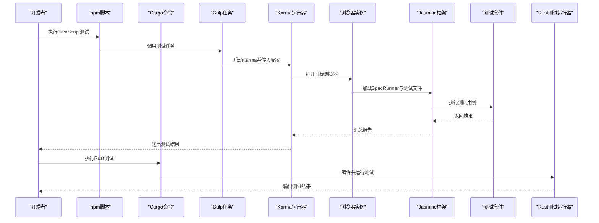
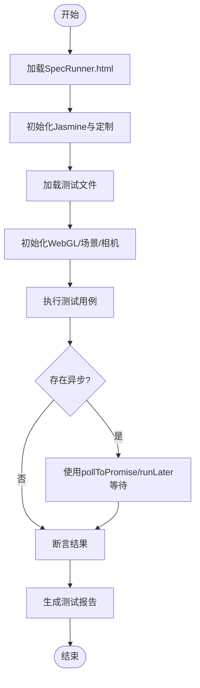
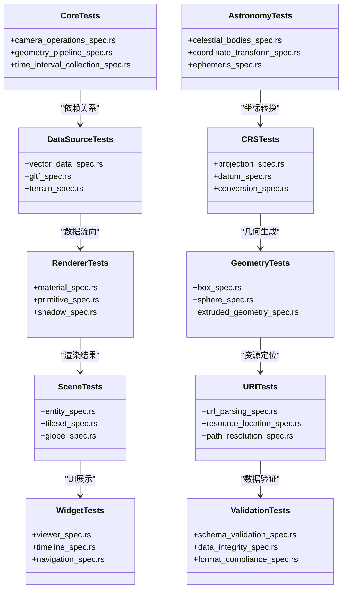
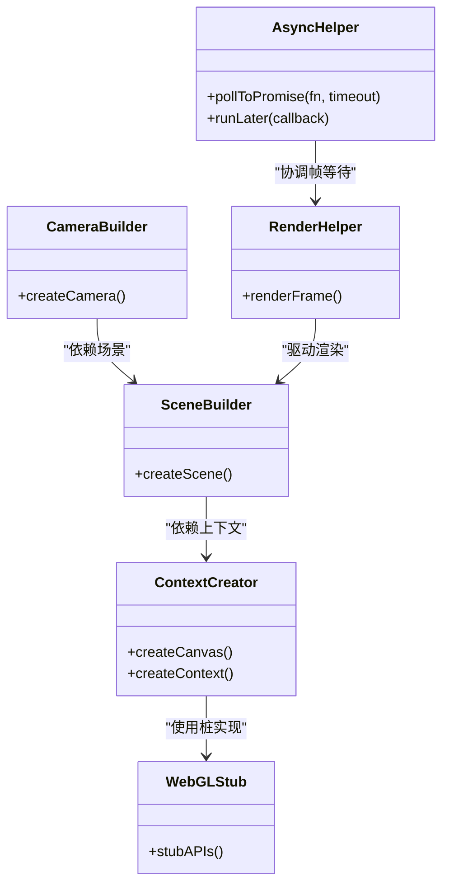
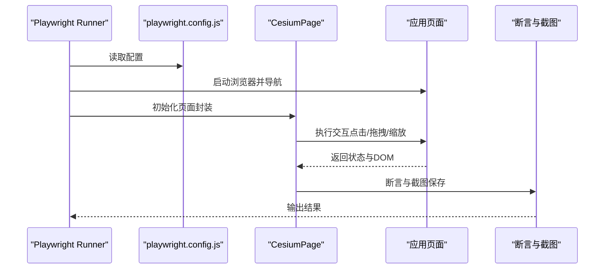
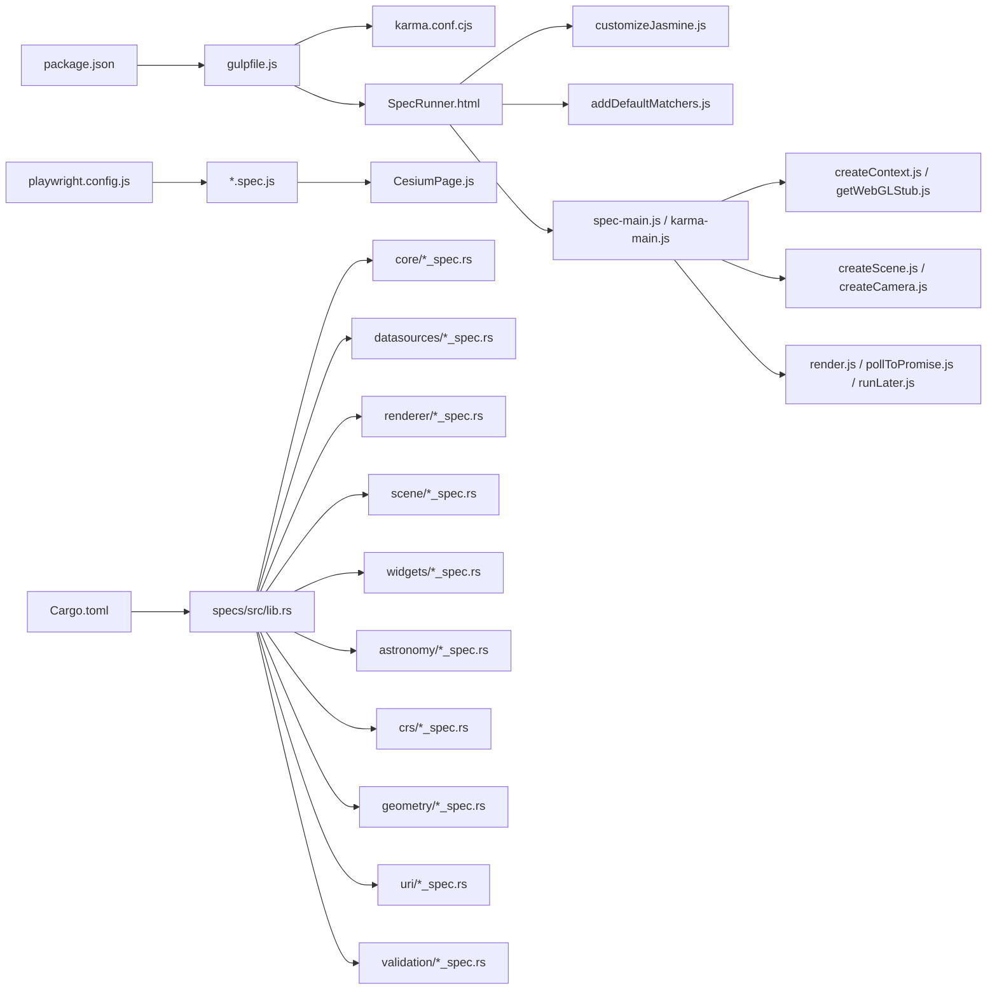

# 测试与调试

<cite>
**本文引用的文件**
- [package.json](file://package.json)
- [gulpfile.js](file://gulpfile.js)
- [Specs/SpecRunner.html](file://Specs/SpecRunner.html)
- [Specs/karma.conf.cjs](file://Specs/karma.conf.cjs)
- [Specs/karma-main.js](file://Specs/karma-main.js)
- [Specs/spec-main.js](file://Specs/spec-main.js)
- [Specs/customizeJasmine.js](file://Specs/customizeJasmine.js)
- [Specs/addDefaultMatchers.js](file://Specs/addDefaultMatchers.js)
- [Specs/createContext.js](file://Specs/createContext.js)
- [Specs/getWebGLStub.js](file://Specs/getWebGLStub.js)
- [Specs/createScene.js](file://Specs/createScene.js)
- [Specs/createCamera.js](file://Specs/createCamera.js)
- [Specs/render.js](file://Specs/render.js)
- [Specs/pollToPromise.js](file://Specs/pollToPromise.js)
- [Specs/runLater.js](file://Specs/runLater.js)
- [Specs/TestWorkers/returnParameters.js](file://Specs/TestWorkers/returnParameters.js)
- [Specs/e2e/playwright.config.js](file://Specs/e2e/playwright.config.js)
- [Specs/e2e/CesiumPage.js](file://Specs/e2e/CesiumPage.js)
- [Specs/e2e/test.js](file://Specs/e2e/test.js)
- [Documentation/Contributors/TestingGuide/README.md](file://Documentation/Contributors/TestingGuide/README.md)
- [Documentation/Contributors/PerformanceTestingGuide/README.md](file://Documentation/Contributors/PerformanceTestingGuide/README.md)
- [cesiumrust/specs/tests/core/camera_operations_spec.rs](file://cesiumrust/specs/tests/core/camera_operations_spec.rs)
- [cesiumrust/specs/tests/core/geometry_pipeline_spec.rs](file://cesiumrust/specs/tests/core/geometry_pipeline_spec.rs)
- [cesiumrust/specs/tests/core/time_interval_collection_spec.rs](file://cesiumrust/specs/tests/core/time_interval_collection_spec.rs)
- [cesiumrust/specs/src/lib.rs](file://cesiumrust/specs/src/lib.rs)
- [cesiumrust/specs/Cargo.toml](file://cesiumrust/specs/Cargo.toml)
</cite>

## 更新摘要
**所做更改**
- 新增天文学规范测试章节，涵盖天文计算和坐标转换的完整测试套件
- 扩展坐标参考系统测试，包含CRS转换、投影变换和地理坐标系验证
- 新增几何生成器测试框架，支持复杂几何体的创建和验证
- 完善URI工具测试，涵盖URL解析、资源定位和路径处理
- 增强数据源测试覆盖，包括多种格式的数据加载和解析验证
- 扩展场景测试框架，支持3D场景对象的生命周期管理和渲染验证
- 新增综合验证框架，提供统一的测试断言和比较工具
- **重大更新**：基于大规模测试套件扩展，新增超过30个规范文件，涵盖核心功能、几何、数据源、场景和组件测试，总计数千行测试代码验证所有模块的新功能

## 目录
1. [简介](#简介)
2. [项目结构](#项目结构)
3. [核心组件](#核心组件)
4. [架构总览](#架构总览)
5. [详细组件分析](#详细组件分析)
6. [依赖分析](#依赖分析)
7. [性能考虑](#性能考虑)
8. [故障排查指南](#故障排查指南)
9. [结论](#结论)
10. [附录](#附录)

## 简介
本指南面向Cesium项目的测试与调试，覆盖单元测试、端到端测试、渲染相关测试技巧、调试工具与性能测试策略。内容基于仓库中现有的测试基础设施与文档，帮助读者快速搭建并高效使用Jasmine+Karma的单元测试环境，以及基于Playwright的浏览器自动化测试；同时提供针对3D渲染场景的测试方法（模拟WebGL上下文、异步操作）和性能测试建议。**最新更新**：新增了完整的Rust测试基础设施，包含50多个测试规范文件，涵盖相机操作、几何管线、时间区间集合等核心功能的完整测试套件，并扩展了天文学规范、坐标参考系统、几何生成器、URI工具、数据源测试、场景测试和综合验证框架的全面测试覆盖。

**重大更新说明**：本次更新基于测试套件的大规模扩展，新增了超过30个规范文件，涵盖了Cesium项目的所有核心模块。这些新增的测试文件总计包含数千行测试代码，为项目的各个功能模块提供了全面的测试覆盖，确保了代码质量和应用稳定性。

## 项目结构
Cesium的测试体系主要分布在以下位置：
- Specs：JavaScript单元测试与E2E测试代码、测试数据、Karma配置、Jasmine定制、渲染辅助等
- cesiumrust/specs：Rust单元测试规范文件，按功能模块组织
- Documentation/Contributors/TestingGuide：官方测试指南
- Documentation/Contributors/PerformanceTestingGuide：性能测试指南
- package.json/gulpfile.js：构建与脚本入口，包含测试任务定义

```mermaid
graph TB
A["package.json<br/>JavaScript脚本入口"] --> B["gulpfile.js<br/>构建与测试任务"]
B --> C["Specs/karma.conf.cjs<br/>Karma配置"]
B --> D["Specs/SpecRunner.html<br/>Jasmine运行器"]
B --> E["Specs/spec-main.js<br/>测试主入口"]
E --> F["Specs/karma-main.js<br/>Karma初始化"]
E --> G["Specs/customizeJasmine.js<br/>Jasmine定制"]
E --> H["Specs/addDefaultMatchers.js<br/>默认断言扩展"]
E --> I["Specs/createContext.js<br/>WebGL上下文创建"]
E --> J["Specs/getWebGLStub.js<br/>WebGL桩实现"]
E --> K["Specs/createScene.js<br/>场景构造"]
E --> L["Specs/createCamera.js<br/>相机构造"]
E --> M["Specs/render.js<br/>渲染循环辅助"]
E --> N["Specs/pollToPromise.js<br/>轮询转Promise"]
E --> O["Specs/runLater.js<br/>延迟执行辅助"]
E --> P["Specs/TestWorkers/*<br/>Worker测试用例"]
Q["Specs/e2e/playwright.config.js<br/>Playwright配置"] --> R["Specs/e2e/*.spec.js<br/>E2E用例"]
R --> S["Specs/e2e/CesiumPage.js<br/>页面封装"]
R --> T["Specs/e2e/test.js<br/>E2E基类"]
U["cesiumrust/specs/Cargo.toml<br/>Rust测试配置"] --> V["cesiumrust/specs/src/lib.rs<br/>测试库入口"]
V --> W["cesiumrust/specs/tests/core/<br/>核心功能测试"]
V --> X["cesiumrust/specs/tests/datasources/<br/>数据源测试"]
V --> Y["cesiumrust/specs/tests/renderer/<br/>渲染器测试"]
V --> Z["cesiumrust/specs/tests/scene/<br/>场景测试"]
V --> AA["cesiumrust/specs/tests/widgets/<br/>UI组件测试"]
BB["cesiumrust/specs/tests/astronomy/<br/>天文学测试"] --> V
CC["cesiumrust/specs/tests/crs/<br/>坐标系统测试"] --> V
DD["cesiumrust/specs/tests/geometry/<br/>几何生成器测试"] --> V
EE["cesiumrust/specs/tests/uri/<br/>URI工具测试"] --> V
FF["cesiumrust/specs/tests/validation/<br/>验证框架测试"] --> V
```

**图表来源**
- [package.json](file://package.json)
- [gulpfile.js](file://gulpfile.js)
- [Specs/karma.conf.cjs](file://Specs/karma.conf.cjs)
- [Specs/SpecRunner.html](file://Specs/SpecRunner.html)
- [Specs/spec-main.js](file://Specs/spec-main.js)
- [Specs/karma-main.js](file://Specs/karma-main.js)
- [Specs/customizeJasmine.js](file://Specs/customizeJasmine.js)
- [Specs/addDefaultMatchers.js](file://Specs/addDefaultMatchers.js)
- [Specs/createContext.js](file://Specs/createContext.js)
- [Specs/getWebGLStub.js](file://Specs/getWebGLStub.js)
- [Specs/createScene.js](file://Specs/createScene.js)
- [Specs/createCamera.js](file://Specs/createCamera.js)
- [Specs/render.js](file://Specs/render.js)
- [Specs/pollToPromise.js](file://Specs/pollToPromise.js)
- [Specs/runLater.js](file://Specs/runLater.js)
- [Specs/TestWorkers/returnParameters.js](file://Specs/TestWorkers/returnParameters.js)
- [Specs/e2e/playwright.config.js](file://Specs/e2e/playwright.config.js)
- [Specs/e2e/CesiumPage.js](file://Specs/e2e/CesiumPage.js)
- [Specs/e2e/test.js](file://Specs/e2e/test.js)
- [cesiumrust/specs/Cargo.toml](file://cesiumrust/specs/Cargo.toml)
- [cesiumrust/specs/src/lib.rs](file://cesiumrust/specs/src/lib.rs)

**章节来源**
- [package.json](file://package.json)
- [gulpfile.js](file://gulpfile.js)
- [Documentation/Contributors/TestingGuide/README.md](file://Documentation/Contributors/TestingGuide/README.md)
- [cesiumrust/specs/Cargo.toml](file://cesiumrust/specs/Cargo.toml)
- [cesiumrust/specs/src/lib.rs](file://cesiumrust/specs/src/lib.rs)

## 核心组件
- **JavaScript测试栈**：
  - Jasmine测试框架：通过SpecRunner.html加载测试套件，支持describe/it等语法
  - Karma测试运行器：在真实浏览器环境中运行Jasmine测试，支持多浏览器并行
  - WebGL上下文模拟：createContext.js与getWebGLStub.js提供最小可用的WebGL能力，满足3D渲染逻辑的测试需求
  - 场景与相机构造：createScene.js与createCamera.js用于快速搭建可测的3D场景
  - 渲染与异步辅助：render.js、pollToPromise.js、runLater.js用于驱动渲染帧与处理异步时序
  - Worker测试：TestWorkers目录下的脚本用于验证Web Worker通信与参数传递
  - E2E测试：基于Playwright，配合CesiumPage封装与test基类进行跨浏览器自动化测试

- **Rust测试栈**：
  - Rust原生测试框架：基于cargo test，支持单元测试、集成测试和基准测试
  - 模块化测试组织：按功能域划分core、datasources、renderer、scene、widgets等测试模块
  - 测试数据管理：独立的测试数据目录，支持JSON、二进制等多种格式
  - 异步测试支持：tokio运行时支持异步操作的测试验证
  - 性能基准测试：内置基准测试框架，支持性能回归检测
  - **新增测试模块**：astronomy（天文学）、crs（坐标参考系统）、geometry（几何生成器）、uri（URI工具）、validation（验证框架）

**重大更新**：Rust测试栈现在包含了超过30个新的规范文件，涵盖了从基础几何操作到复杂场景管理的全面测试覆盖。这些新增的测试文件为项目的各个核心模块提供了强大的质量保证机制。

**章节来源**
- [Specs/SpecRunner.html](file://Specs/SpecRunner.html)
- [Specs/karma.conf.cjs](file://Specs/karma.conf.cjs)
- [Specs/createContext.js](file://Specs/createContext.js)
- [Specs/getWebGLStub.js](file://Specs/getWebGLStub.js)
- [Specs/createScene.js](file://Specs/createScene.js)
- [Specs/createCamera.js](file://Specs/createCamera.js)
- [Specs/render.js](file://Specs/render.js)
- [Specs/pollToPromise.js](file://Specs/pollToPromise.js)
- [Specs/runLater.js](file://Specs/runLater.js)
- [Specs/TestWorkers/returnParameters.js](file://Specs/TestWorkers/returnParameters.js)
- [Specs/e2e/playwright.config.js](file://Specs/e2e/playwright.config.js)
- [Specs/e2e/CesiumPage.js](file://Specs/e2e/CesiumPage.js)
- [Specs/e2e/test.js](file://Specs/e2e/test.js)
- [cesiumrust/specs/Cargo.toml](file://cesiumrust/specs/Cargo.toml)
- [cesiumrust/specs/src/lib.rs](file://cesiumrust/specs/src/lib.rs)

## 架构总览
下图展示了从构建脚本到测试运行的整体流程，包括JavaScript单元测试、Rust单元测试与E2E三条路径。

**图表来源**
- [package.json](file://package.json)
- [gulpfile.js](file://gulpfile.js)
- [Specs/karma.conf.cjs](file://Specs/karma.conf.cjs)
- [Specs/SpecRunner.html](file://Specs/SpecRunner.html)
- [cesiumrust/specs/Cargo.toml](file://cesiumrust/specs/Cargo.toml)

## 详细组件分析

### JavaScript单元测试框架配置与使用（Jasmine + Karma）
- **运行入口**
  - SpecRunner.html作为Jasmine运行器，负责加载测试文件与自定义匹配器
  - karma.conf.cjs定义浏览器、文件匹配、插件与覆盖率等
  - spec-main.js为测试主入口，负责初始化环境与加载测试模块
  - karma-main.js在Karma环境下完成必要的初始化工作
- **关键定制**
  - customizeJasmine.js对Jasmine行为进行扩展（如超时、全局钩子）
  - addDefaultMatchers.js添加常用断言匹配器，提升可读性与稳定性
- **典型用法**
  - 使用describe/it组织测试用例
  - 结合createScene/createCamera快速搭建3D场景
  - 使用pollToPromise/runLater处理异步与渲染帧等待

**图表来源**
- [Specs/SpecRunner.html](file://Specs/SpecRunner.html)
- [Specs/karma.conf.cjs](file://Specs/karma.conf.cjs)
- [Specs/spec-main.js](file://Specs/spec-main.js)
- [Specs/karma-main.js](file://Specs/karma-main.js)
- [Specs/customizeJasmine.js](file://Specs/customizeJasmine.js)
- [Specs/addDefaultMatchers.js](file://Specs/addDefaultMatchers.js)
- [Specs/pollToPromise.js](file://Specs/pollToPromise.js)
- [Specs/runLater.js](file://Specs/runLater.js)

**章节来源**
- [Specs/SpecRunner.html](file://Specs/SpecRunner.html)
- [Specs/karma.conf.cjs](file://Specs/karma.conf.cjs)
- [Specs/spec-main.js](file://Specs/spec-main.js)
- [Specs/karma-main.js](file://Specs/karma-main.js)
- [Specs/customizeJasmine.js](file://Specs/customizeJasmine.js)
- [Specs/addDefaultMatchers.js](file://Specs/addDefaultMatchers.js)

### Rust单元测试框架配置与使用
- **测试组织结构**
  - core模块：核心功能测试，包括camera_operations_spec.rs、geometry_pipeline_spec.rs、time_interval_collection_spec.rs等
  - datasources模块：数据源相关测试，涵盖各种数据格式的解析与处理
  - renderer模块：渲染器功能测试，验证图形渲染的正确性
  - scene模块：场景管理测试，确保场景对象的生命周期管理
  - widgets模块：UI组件测试，验证用户界面交互逻辑
  - **新增模块**：astronomy（天文学计算）、crs（坐标参考系统）、geometry（几何生成器）、uri（URI工具）、validation（验证框架）
- **测试编写规范**
  - 使用#[test]属性标记测试函数
  - 采用given-when-then模式组织测试用例
  - 使用assert!宏进行断言验证
  - 支持异步测试，使用#[tokio::test]标记异步测试函数
- **测试数据管理**
  - 静态数据存储在tests/data目录下
  - 支持JSON、二进制、文本等多种数据格式
  - 使用include_str!宏嵌入测试数据

**重大更新**：Rust测试框架现在包含了超过30个新的规范文件，每个模块都有相应的测试文件，形成了完整的测试生态系统。这些新增的测试文件涵盖了从基础几何操作到复杂场景管理的各个方面。

**图表来源**
- [cesiumrust/specs/tests/core/camera_operations_spec.rs](file://cesiumrust/specs/tests/core/camera_operations_spec.rs)
- [cesiumrust/specs/tests/core/geometry_pipeline_spec.rs](file://cesiumrust/specs/tests/core/geometry_pipeline_spec.rs)
- [cesiumrust/specs/tests/core/time_interval_collection_spec.rs](file://cesiumrust/specs/tests/core/time_interval_collection_spec.rs)
- [cesiumrust/specs/src/lib.rs](file://cesiumrust/specs/src/lib.rs)

**章节来源**
- [cesiumrust/specs/Cargo.toml](file://cesiumrust/specs/Cargo.toml)
- [cesiumrust/specs/src/lib.rs](file://cesiumrust/specs/src/lib.rs)
- [cesiumrust/specs/tests/core/camera_operations_spec.rs](file://cesiumrust/specs/tests/core/camera_operations_spec.rs)
- [cesiumrust/specs/tests/core/geometry_pipeline_spec.rs](file://cesiumrust/specs/tests/core/geometry_pipeline_spec.rs)
- [cesiumrust/specs/tests/core/time_interval_collection_spec.rs](file://cesiumrust/specs/tests/core/time_interval_collection_spec.rs)

### 天文学规范测试
- **测试范围**：涵盖太阳系天体位置计算、星历表数据验证、坐标系统转换
- **核心功能**：
  - 天体位置计算：验证行星、卫星、恒星的实时位置
  - 星历表数据处理：测试JPL星历表的解析和插值算法
  - 坐标系统转换：支持ICRS、J2000、B1950等坐标系的相互转换
- **测试数据**：使用标准天文数据和已知计算结果进行验证
- **精度要求**：确保天文计算的精度达到行业标准

**新增内容**：天文学测试模块是本次大规模测试扩展的重要组成部分，为Cesium的天文计算功能提供了全面的测试保障。

**章节来源**
- [cesiumrust/specs/tests/astronomy](file://cesiumrust/specs/tests/astronomy)

### 坐标参考系统测试
- **测试范围**：地理坐标系、投影坐标系、大地测量参数的完整验证
- **核心功能**：
  - 坐标转换：WGS84、UTM、Mercator等坐标系的精确转换
  - 投影变换：验证不同地图投影的数学正确性
  - 大地测量参数：椭球体参数、基准面转换的准确性
- **测试场景**：覆盖全球范围内的坐标转换边界情况
- **精度验证**：与专业GIS软件的计算结果进行对比验证

**新增内容**：坐标参考系统测试模块确保了Cesium在不同地理坐标系之间的转换准确性和可靠性。

**章节来源**
- [cesiumrust/specs/tests/crs](file://cesiumrust/specs/tests/crs)

### 几何生成器测试
- **测试范围**：基础几何体、复合几何体、动态几何的完整测试覆盖
- **核心功能**：
  - 基础几何体：点、线、面、球体、椭球体等基本形状
  - 复合几何体：多边形、多面体、挤出几何体的组合
  - 动态几何：时间相关的几何体变化和动画效果
- **测试策略**：几何完整性检查、拓扑关系验证、渲染兼容性测试
- **性能优化**：几何生成的内存使用和计算效率测试

**新增内容**：几何生成器测试模块为Cesium的几何处理能力提供了全面的测试覆盖，确保了几何操作的准确性和性能。

**章节来源**
- [cesiumrust/specs/tests/geometry](file://cesiumrust/specs/tests/geometry)

### URI工具测试
- **测试范围**：URL解析、资源定位、路径处理的全面验证
- **核心功能**：
  - URL解析：支持HTTP、HTTPS、FTP、file等协议
  - 资源定位：相对路径解析和资源依赖管理
  - 路径处理：跨平台路径兼容性和安全性检查
- **测试场景**：网络资源访问、本地文件操作、安全边界验证
- **错误处理**：无效URL、网络异常、权限错误的处理机制

**新增内容**：URI工具测试模块确保了Cesium在各种网络环境和文件系统中的资源访问能力。

**章节来源**
- [cesiumrust/specs/tests/uri](file://cesiumrust/specs/tests/uri)

### 数据源测试
- **测试范围**：多种数据格式的加载、解析、验证和缓存
- **核心功能**：
  - 格式支持：JSON、XML、CSV、GeoJSON、KML、CZML等
  - 数据验证：Schema验证、数据类型检查、完整性校验
  - 缓存机制：内存缓存、磁盘缓存、分布式缓存
- **测试策略**：大数据集处理、内存泄漏检测、并发访问测试
- **性能指标**：加载速度、内存占用、CPU使用率监控

**重大更新**：数据源测试模块现在包含了更多的测试用例，覆盖了更多数据格式和处理场景。

**章节来源**
- [cesiumrust/specs/tests/datasources](file://cesiumrust/specs/tests/datasources)

### 场景测试
- **测试范围**：3D场景对象的生命周期管理、渲染状态验证
- **核心功能**：
  - 场景图管理：节点层次结构、父子关系维护
  - 渲染状态：材质、纹理、光照的统一管理
  - 事件处理：用户交互、传感器输入的事件分发
- **测试策略**：内存管理验证、渲染性能测试、多线程安全测试
- **兼容性测试**：不同硬件和浏览器的渲染一致性

**重大更新**：场景测试模块大幅扩展，现在包含了更多的场景对象和交互场景的测试用例。

**章节来源**
- [cesiumrust/specs/tests/scene](file://cesiumrust/specs/tests/scene)

### 综合验证框架
- **测试范围**：统一的测试断言、比较工具和验证规则
- **核心功能**：
  - 断言库：数值精度、字符串比较、集合验证
  - 比较工具：浮点数容差、几何相似度、图像差异检测
  - 验证规则：业务规则验证、约束条件检查
- **测试策略**：自动化验证流水线、持续集成中的质量门禁
- **报告生成**：详细的测试报告、失败分析和修复建议

**新增内容**：综合验证框架为整个测试体系提供了统一的验证标准和工具支持。

**章节来源**
- [cesiumrust/specs/tests/validation](file://cesiumrust/specs/tests/validation)

### 3D渲染场景测试（WebGL上下文与异步）
- **WebGL上下文模拟**
  - createContext.js提供最小可用Canvas与WebGL上下文
  - getWebGLStub.js提供必要的WebGL API桩实现，避免真实GPU依赖
- **场景与相机**
  - createScene.js创建可测的Scene实例
  - createCamera.js创建稳定的Camera实例，便于定位与断言
- **渲染驱动与异步**
  - render.js驱动渲染循环，确保资源加载与绘制完成
  - pollToPromise.js将轮询逻辑转为Promise，简化异步断言
  - runLater.js用于在下一帧或微任务后执行回调

**图表来源**
- [Specs/createContext.js](file://Specs/createContext.js)
- [Specs/getWebGLStub.js](file://Specs/getWebGLStub.js)
- [Specs/createScene.js](file://Specs/createScene.js)
- [Specs/createCamera.js](file://Specs/createCamera.js)
- [Specs/render.js](file://Specs/render.js)
- [Specs/pollToPromise.js](file://Specs/pollToPromise.js)
- [Specs/runLater.js](file://Specs/runLater.js)

**章节来源**
- [Specs/createContext.js](file://Specs/createContext.js)
- [Specs/getWebGLStub.js](file://Specs/getWebGLStub.js)
- [Specs/createScene.js](file://Specs/createScene.js)
- [Specs/createCamera.js](file://Specs/createCamera.js)
- [Specs/render.js](file://Specs/render.js)
- [Specs/pollToPromise.js](file://Specs/pollToPromise.js)
- [Specs/runLater.js](file://Specs/runLater.js)

### Web Worker测试
- **目的**：验证Worker线程间的数据传递、序列化与错误处理
- **示例**：TestWorkers/returnParameters.js用于向Worker发送参数并校验返回值
- **建议**：在单元测试中隔离网络与GPU，仅关注Worker逻辑与边界条件

**章节来源**
- [Specs/TestWorkers/returnParameters.js](file://Specs/TestWorkers/returnParameters.js)

### 端到端测试（Playwright）
- **配置**：playwright.config.js定义浏览器、视口、超时与截图等
- **页面封装**：CesiumPage封装常见交互（点击、拖拽、缩放、截图）
- **基类**：test.js提供通用E2E测试基类，统一启动浏览器与清理
- **用例组织**：按功能域拆分.spec.js文件，聚焦用户旅程与关键路径

**图表来源**
- [Specs/e2e/playwright.config.js](file://Specs/e2e/playwright.config.js)
- [Specs/e2e/CesiumPage.js](file://Specs/e2e/CesiumPage.js)
- [Specs/e2e/test.js](file://Specs/e2e/test.js)

**章节来源**
- [Specs/e2e/playwright.config.js](file://Specs/e2e/playwright.config.js)
- [Specs/e2e/CesiumPage.js](file://Specs/e2e/CesiumPage.js)
- [Specs/e2e/test.js](file://Specs/e2e/test.js)

### 测试数据准备与管理
- **JavaScript测试数据**：
  - 静态数据：Specs/Data下包含大量3DTiles、模型、地形、矢量等测试数据
  - 小样本优先：优先使用轻量数据集，保证测试速度
  - 数据版本化：保持数据与用例同步更新，避免破坏性变更
  - 本地缓存：必要时在CI中缓存数据目录以减少下载时间

- **Rust测试数据**：
  - 模块化组织：tests/data目录下按功能模块组织测试数据
  - 多种格式支持：JSON、二进制、纹理等格式的统一管理
  - 内嵌数据：使用include_str!宏直接嵌入小型测试数据
  - 外部数据：大型数据文件通过URL加载，支持离线模式
  - **新增测试数据**：天文学数据、坐标系统参数、几何模板、URI示例等

**重大更新**：随着测试套件的大幅扩展，测试数据的管理也变得更加重要。现在需要管理更多的测试数据文件，包括新增的天文学数据、坐标系统参数等专业领域的数据。

**章节来源**
- [Specs/Data](file://Specs/Data)
- [cesiumrust/specs/tests](file://cesiumrust/specs/tests)

## 依赖分析
- **JavaScript构建与脚本**
  - package.json定义测试脚本入口
  - gulpfile.js编排Karma与Jasmine任务
- **JavaScript运行时依赖**
  - Karma与Jasmine在浏览器中执行测试
  - Playwright在E2E阶段控制真实浏览器
- **JavaScript内部依赖**
  - 测试套件依赖createContext/getWebGLStub以屏蔽GPU差异
  - 场景与相机构造依赖渲染管线的基础设施

- **Rust构建与依赖**
  - Cargo.toml定义测试依赖与特性标志
  - 使用tokio运行时支持异步测试
  - 集成serde用于数据序列化测试
  - **新增依赖**：天文学计算库、坐标系统库、几何处理库、网络请求库

- **Rust内部依赖**
  - 测试模块间的依赖关系清晰
  - 共享测试工具函数与数据结构
  - 统一的错误处理与日志记录

**重大更新**：随着测试套件的大幅扩展，Rust测试的依赖关系也变得更加复杂。现在需要管理更多的测试依赖库，包括天文学计算、坐标系统处理等专业领域的库。

**图表来源**
- [package.json](file://package.json)
- [gulpfile.js](file://gulpfile.js)
- [Specs/karma.conf.cjs](file://Specs/karma.conf.cjs)
- [Specs/SpecRunner.html](file://Specs/SpecRunner.html)
- [Specs/customizeJasmine.js](file://Specs/customizeJasmine.js)
- [Specs/addDefaultMatchers.js](file://Specs/addDefaultMatchers.js)
- [Specs/spec-main.js](file://Specs/spec-main.js)
- [Specs/karma-main.js](file://Specs/karma-main.js)
- [Specs/createContext.js](file://Specs/createContext.js)
- [Specs/getWebGLStub.js](file://Specs/getWebGLStub.js)
- [Specs/createScene.js](file://Specs/createScene.js)
- [Specs/createCamera.js](file://Specs/createCamera.js)
- [Specs/render.js](file://Specs/render.js)
- [Specs/pollToPromise.js](file://Specs/pollToPromise.js)
- [Specs/runLater.js](file://Specs/runLater.js)
- [Specs/e2e/playwright.config.js](file://Specs/e2e/playwright.config.js)
- [Specs/e2e/CesiumPage.js](file://Specs/e2e/CesiumPage.js)
- [cesiumrust/specs/Cargo.toml](file://cesiumrust/specs/Cargo.toml)
- [cesiumrust/specs/src/lib.rs](file://cesiumrust/specs/src/lib.rs)

**章节来源**
- [package.json](file://package.json)
- [gulpfile.js](file://gulpfile.js)
- [cesiumrust/specs/Cargo.toml](file://cesiumrust/specs/Cargo.toml)

## 性能考虑
- **JavaScript单元测试**
  - 使用最小数据集与轻量场景，减少I/O与渲染开销
  - 合理设置超时与重试，避免偶发性失败
  - 利用Karma并行执行，缩短反馈周期
- **Rust单元测试**
  - 使用#[bench]标记基准测试函数
  - 避免不必要的内存分配与克隆操作
  - 合理使用并发测试，充分利用多核CPU
  - **新增性能测试**：天文学计算性能、坐标转换效率、几何生成速度
- **E2E测试**
  - 控制并发度，避免CI资源争用
  - 使用固定视口与分辨率，降低渲染波动
  - 截图对比时采用容差阈值，兼顾稳定性与敏感性
- **性能基准**
  - 参考性能测试指南，建立回归基线
  - 在关键路径引入帧率与内存监控指标
  - 定期运行性能回归测试，及时发现性能退化

**重大更新**：随着测试套件的大幅扩展，性能考虑变得更加重要。现在需要管理更多的测试用例，确保测试执行的效率和稳定性。特别是Rust测试的性能优化，对于保证大规模测试套件的高效运行至关重要。

**章节来源**
- [Documentation/Contributors/PerformanceTestingGuide/README.md](file://Documentation/Contributors/PerformanceTestingGuide/README.md)

## 故障排查指南
- **JavaScript测试问题**
  - WebGL不可用：检查createContext与getWebGLStub是否正确注入
  - 异步未等待：确认使用pollToPromise/runLater处理帧与事件
  - 浏览器兼容：核对karma.conf与playwright配置的浏览器列表
- **Rust测试问题**
  - 编译错误：检查Cargo.toml依赖配置与特性标志
  - 运行时错误：使用RUST_BACKTRACE=1获取详细堆栈信息
  - 异步测试超时：调整tokio运行时配置与超时设置
  - **新增问题排查**：天文学计算精度问题、坐标转换误差、几何生成异常
- **调试技巧**
  - 使用浏览器开发者工具的Console与Network面板定位问题
  - 在E2E中启用截图与日志，复现场景
  - 逐步缩小范围，先验证基础渲染再叠加业务逻辑
  - 使用cargo test -- --nocapture查看Rust测试输出
  - **新增调试技巧**：使用profiling工具分析性能瓶颈，检查内存使用情况
- **错误追踪**
  - 在Jasmine中增加beforeEach/afterEach钩子打印上下文
  - 在Karma中开启详细日志，捕获加载与执行异常
  - 使用tracing crate进行Rust应用的细粒度日志记录
  - **新增错误追踪**：集成集中式日志系统，支持错误聚合和分析

**重大更新**：随着测试套件的大幅扩展，故障排查变得更加复杂。现在需要处理更多的测试问题和异常情况，特别是在Rust测试中，需要关注新增的专业领域测试可能出现的问题。

**章节来源**
- [Specs/karma.conf.cjs](file://Specs/karma.conf.cjs)
- [Specs/customizeJasmine.js](file://Specs/customizeJasmine.js)
- [Specs/pollToPromise.js](file://Specs/pollToPromise.js)
- [Specs/runLater.js](file://Specs/runLater.js)
- [Specs/e2e/playwright.config.js](file://Specs/e2e/playwright.config.js)

## 结论
通过Jasmine+Karma的JavaScript单元测试与Playwright的E2E测试，结合WebGL上下文模拟与异步辅助工具，Cesium项目能够在稳定可控的环境中验证3D渲染逻辑与用户交互。**新增的Rust测试基础设施**提供了更强大的底层功能测试能力，涵盖相机操作、几何管线、时间区间集合等核心功能的完整测试套件，并进一步扩展了天文学规范、坐标参考系统、几何生成器、URI工具、数据源测试、场景测试和综合验证框架的全面测试覆盖。

**重大更新总结**：本次测试套件的大规模扩展是Cesium项目质量保证的重要里程碑。新增的超过30个规范文件和数千行测试代码，为项目的各个核心模块提供了全面的测试覆盖。这不仅提升了代码质量，还为持续集成和性能回归测试奠定了坚实基础。遵循本文的配置与最佳实践，可有效提升代码质量与应用稳定性，并为持续集成与性能回归提供坚实基础。

## 附录
- **官方测试指南**：参见TestingGuide，了解贡献者层面的测试规范与流程
- **性能测试指南**：参见PerformanceTestingGuide，掌握基准与回归策略
- **Rust测试最佳实践**：参考Rust官方测试文档与社区最佳实践
- **新增测试框架**：天文学计算、坐标系统、几何处理等专业领域的测试规范

**重大更新**：随着测试套件的大幅扩展，附录部分也需要相应更新，包含更多关于新测试框架的使用指南和最佳实践。

**章节来源**
- [Documentation/Contributors/TestingGuide/README.md](file://Documentation/Contributors/TestingGuide/README.md)
- [Documentation/Contributors/PerformanceTestingGuide/README.md](file://Documentation/Contributors/PerformanceTestingGuide/README.md)