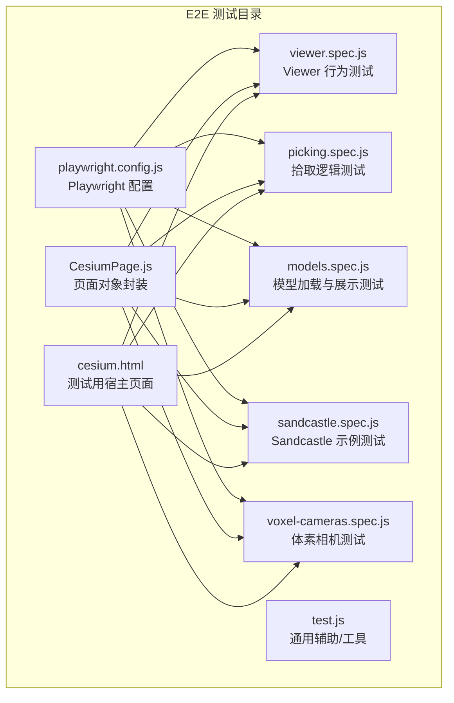
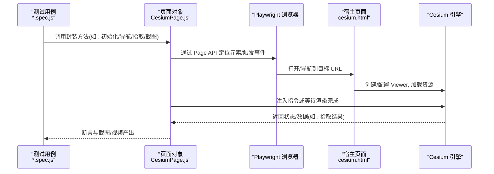
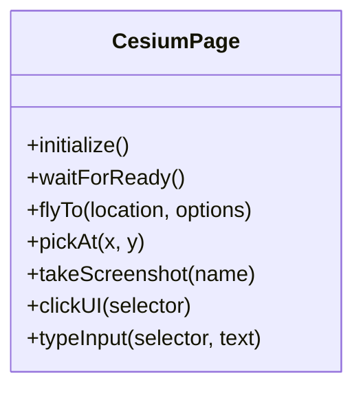
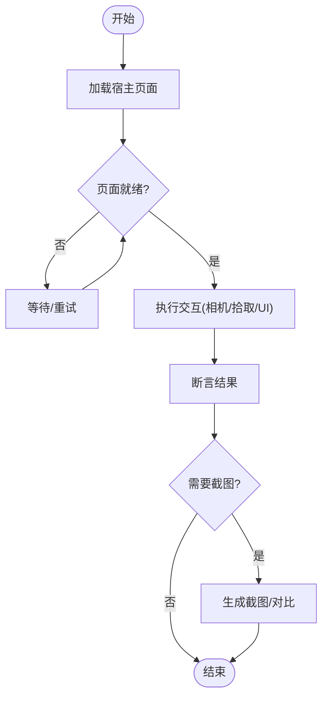
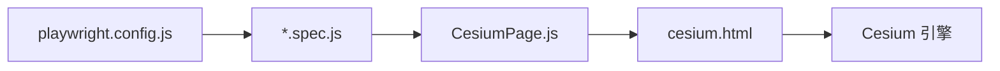

# 端到端测试

<cite>
**本文引用的文件**   
- [playwright.config.js](file://Specs/e2e/playwright.config.js)
- [CesiumPage.js](file://Specs/e2e/CesiumPage.js)
- [cesium.html](file://Specs/e2e/cesium.html)
- [viewer.spec.js](file://Specs/e2e/viewer.spec.js)
- [picking.spec.js](file://Specs/e2e/picking.spec.js)
- [models.spec.js](file://Specs/e2e/models.spec.js)
- [sandcastle.spec.js](file://Specs/e2e/sandcastle.spec.js)
- [voxel-cameras.spec.js](file://Specs/e2e/voxel-cameras.spec.js)
- [test.js](file://Specs/e2e/test.js)
</cite>

## 目录
1. [简介](#简介)
2. [项目结构](#项目结构)
3. [核心组件](#核心组件)
4. [架构总览](#架构总览)
5. [详细组件分析](#详细组件分析)
6. [依赖关系分析](#依赖关系分析)
7. [性能考虑](#性能考虑)
8. [故障排查指南](#故障排查指南)
9. [结论](#结论)
10. [附录](#附录)

## 简介
本指南面向在 Cesium 项目中构建端到端（E2E）测试的工程师，聚焦于使用 Playwright 进行浏览器自动化与跨浏览器兼容性验证。文档涵盖：
- Playwright 配置与多浏览器运行策略
- 用户交互场景建模：相机控制、模型拾取、UI 操作
- 页面对象模式封装复杂流程与断言
- 跨浏览器与跨平台测试策略
- 截图对比与视觉回归测试方法

## 项目结构
E2E 测试位于 Specs/e2e 目录，包含 Playwright 配置文件、页面对象、HTML 宿主页面以及若干测试用例。

图示来源
- [playwright.config.js](file://Specs/e2e/playwright.config.js)
- [CesiumPage.js](file://Specs/e2e/CesiumPage.js)
- [cesium.html](file://Specs/e2e/cesium.html)
- [viewer.spec.js](file://Specs/e2e/viewer.spec.js)
- [picking.spec.js](file://Specs/e2e/picking.spec.js)
- [models.spec.js](file://Specs/e2e/models.spec.js)
- [sandcastle.spec.js](file://Specs/e2e/sandcastle.spec.js)
- [voxel-cameras.spec.js](file://Specs/e2e/voxel-cameras.spec.js)
- [test.js](file://Specs/e2e/test.js)

章节来源
- [playwright.config.js](file://Specs/e2e/playwright.config.js)
- [CesiumPage.js](file://Specs/e2e/CesiumPage.js)
- [cesium.html](file://Specs/e2e/cesium.html)
- [viewer.spec.js](file://Specs/e2e/viewer.spec.js)
- [picking.spec.js](file://Specs/e2e/picking.spec.js)
- [models.spec.js](file://Specs/e2e/models.spec.js)
- [sandcastle.spec.js](file://Specs/e2e/sandcastle.spec.js)
- [voxel-cameras.spec.js](file://Specs/e2e/voxel-cameras.spec.js)
- [test.js](file://Specs/e2e/test.js)

## 核心组件
- Playwright 配置：定义浏览器类型、视口、超时、并行度、重试、截图/视频等能力，支撑多浏览器与跨平台执行。
- 页面对象（CesiumPage）：封装对 cesium.html 中 Cesium Viewer 的常用操作，如初始化、导航、拾取、截图等，降低用例复杂度并提升可维护性。
- 宿主页面（cesium.html）：提供最小化的 Cesium 应用入口，供测试驱动。
- 测试用例：围绕 Viewer 行为、拾取、模型加载、Sandcastle 示例、体素相机等场景组织。

章节来源
- [playwright.config.js](file://Specs/e2e/playwright.config.js)
- [CesiumPage.js](file://Specs/e2e/CesiumPage.js)
- [cesium.html](file://Specs/e2e/cesium.html)

## 架构总览
下图展示了从测试脚本到浏览器、宿主页面与 Cesium 引擎的调用链路，以及页面对象如何抽象底层交互。

图示来源
- [viewer.spec.js](file://Specs/e2e/viewer.spec.js)
- [picking.spec.js](file://Specs/e2e/picking.spec.js)
- [models.spec.js](file://Specs/e2e/models.spec.js)
- [sandcastle.spec.js](file://Specs/e2e/sandcastle.spec.js)
- [voxel-cameras.spec.js](file://Specs/e2e/voxel-cameras.spec.js)
- [CesiumPage.js](file://Specs/e2e/CesiumPage.js)
- [cesium.html](file://Specs/e2e/cesium.html)

## 详细组件分析

### Playwright 配置（多浏览器与跨平台）
- 关键职责
  - 声明浏览器集（Chromium/Firefox/WebKit），用于跨浏览器矩阵测试
  - 设置全局视口、超时、重试、并发度
  - 开启截图/视频收集，便于失败回放与视觉回归
  - 可选：网络拦截、环境变量注入、CI 适配
- 建议实践
  - 将耗时任务（大模型加载）与短用例拆分，合理设置超时与重试
  - 在 CI 中按浏览器矩阵并行执行，缩短反馈时间
  - 使用固定视口与设备像素比，减少渲染抖动导致的视觉差异

章节来源
- [playwright.config.js](file://Specs/e2e/playwright.config.js)

### 页面对象模式（CesiumPage）
- 设计目标
  - 将复杂的 Cesium 交互（相机控制、拾取、截图、等待渲染）封装为稳定、可读的方法
  - 统一错误处理与日志记录，屏蔽底层细节
- 典型能力
  - 初始化与等待就绪：确保 Viewer 创建完成、资源加载稳定
  - 相机控制：平移、缩放、旋转、飞行至坐标
  - 拾取：基于屏幕坐标获取命中对象属性
  - UI 操作：点击按钮、输入文本、选择菜单项
  - 截图与对比：生成基准图与当前图，输出差异报告
- 实现要点
  - 使用稳定的选择器与显式等待，避免脆弱断言
  - 对异步渲染采用“等待条件”而非固定延时
  - 将业务语义暴露给用例，隐藏 Playwright 内部 API

图示来源
- [CesiumPage.js](file://Specs/e2e/CesiumPage.js)

章节来源
- [CesiumPage.js](file://Specs/e2e/CesiumPage.js)

### 宿主页面（cesium.html）
- 作用
  - 作为被测应用的承载页面，引入必要的 Cesium 资源与样式
  - 提供最小化配置，使测试专注于交互与断言
- 注意事项
  - 避免在页面内放置过多业务逻辑，保持“薄页面、厚测试”
  - 如需动态参数，可通过 URL 查询字符串或注入变量方式传入

章节来源
- [cesium.html](file://Specs/e2e/cesium.html)

### 测试用例集合
- viewer.spec.js：验证 Viewer 基本行为（初始化、基础交互、UI 联动）
- picking.spec.js：验证拾取逻辑（点击/悬停命中、属性读取）
- models.spec.js：验证模型加载与展示（gltf/glb、批处理、点云等）
- sandcastle.spec.js：验证 Sandcastle 示例页面的稳定性
- voxel-cameras.spec.js：验证体素数据的相机行为与渲染正确性
- test.js：通用辅助函数（如等待、断言增强、工具方法）

图示来源
- [viewer.spec.js](file://Specs/e2e/viewer.spec.js)
- [picking.spec.js](file://Specs/e2e/picking.spec.js)
- [models.spec.js](file://Specs/e2e/models.spec.js)
- [sandcastle.spec.js](file://Specs/e2e/sandcastle.spec.js)
- [voxel-cameras.spec.js](file://Specs/e2e/voxel-cameras.spec.js)
- [test.js](file://Specs/e2e/test.js)

章节来源
- [viewer.spec.js](file://Specs/e2e/viewer.spec.js)
- [picking.spec.js](file://Specs/e2e/picking.spec.js)
- [models.spec.js](file://Specs/e2e/models.spec.js)
- [sandcastle.spec.js](file://Specs/e2e/sandcastle.spec.js)
- [voxel-cameras.spec.js](file://Specs/e2e/voxel-cameras.spec.js)
- [test.js](file://Specs/e2e/test.js)

## 依赖关系分析
- 用例对页面对象的依赖：所有 *.spec.js 均通过 CesiumPage 访问宿主页面能力，降低耦合度
- 页面对象对宿主页面的依赖：通过选择器与 DOM 事件与 cesium.html 交互
- 宿主页面与 Cesium 引擎：由 cesium.html 负责引入与初始化
- Playwright 配置对所有用例生效，决定执行环境与产物

图示来源
- [playwright.config.js](file://Specs/e2e/playwright.config.js)
- [CesiumPage.js](file://Specs/e2e/CesiumPage.js)
- [cesium.html](file://Specs/e2e/cesium.html)
- [viewer.spec.js](file://Specs/e2e/viewer.spec.js)
- [picking.spec.js](file://Specs/e2e/picking.spec.js)
- [models.spec.js](file://Specs/e2e/models.spec.js)
- [sandcastle.spec.js](file://Specs/e2e/sandcastle.spec.js)
- [voxel-cameras.spec.js](file://Specs/e2e/voxel-cameras.spec.js)

章节来源
- [playwright.config.js](file://Specs/e2e/playwright.config.js)
- [CesiumPage.js](file://Specs/e2e/CesiumPage.js)
- [cesium.html](file://Specs/e2e/cesium.html)
- [viewer.spec.js](file://Specs/e2e/viewer.spec.js)
- [picking.spec.js](file://Specs/e2e/picking.spec.js)
- [models.spec.js](file://Specs/e2e/models.spec.js)
- [sandcastle.spec.js](file://Specs/e2e/sandcastle.spec.js)
- [voxel-cameras.spec.js](file://Specs/e2e/voxel-cameras.spec.js)

## 性能考虑
- 资源预热：首次运行前预缓存常用模型与瓦片，减少网络抖动影响
- 视口与分辨率：固定视口与设备像素比，避免不同环境下的渲染差异
- 并行与隔离：按功能域拆分用例，合理设置并发；必要时禁用共享上下文
- 超时与重试：针对大模型加载场景提高超时阈值，结合重试提升稳定性
- 截图与视频：仅在失败时启用或按需采样，避免 IO 瓶颈

[本节为通用指导，不直接分析具体文件]

## 故障排查指南
- 常见问题
  - 页面未就绪：检查等待条件是否覆盖关键渲染阶段
  - 选择器不稳定：改用更稳定的标识（data-testid、ARIA 标签）
  - 随机失败：增加重试、延长超时、减少并发
  - 视觉差异：确认字体、系统 DPI、GPU 驱动一致性
- 诊断手段
  - 查看截图与视频回放
  - 打印控制台日志与网络请求
  - 缩小范围：最小化用例复现问题

章节来源
- [test.js](file://Specs/e2e/test.js)

## 结论
通过将 Playwright 配置、页面对象与宿主页面解耦，并以用例为中心组织交互与断言，可在 Cesium 项目中建立稳健的端到端测试体系。配合跨浏览器矩阵、截图对比与合理的性能调优，能够显著提升应用在多环境下的稳定性与一致性。

[本节为总结性内容，不直接分析具体文件]

## 附录
- 快速上手
  - 安装依赖后，运行 Playwright 以指定浏览器执行全部或单个用例
  - 在本地启动静态服务器，确保 cesium.html 可被访问
- 最佳实践清单
  - 使用页面对象封装复杂流程
  - 显式等待替代固定延时
  - 固定视口与像素比
  - 失败自动截图/视频
  - 按功能域拆分用例，合理并行

[本节为补充信息，不直接分析具体文件]