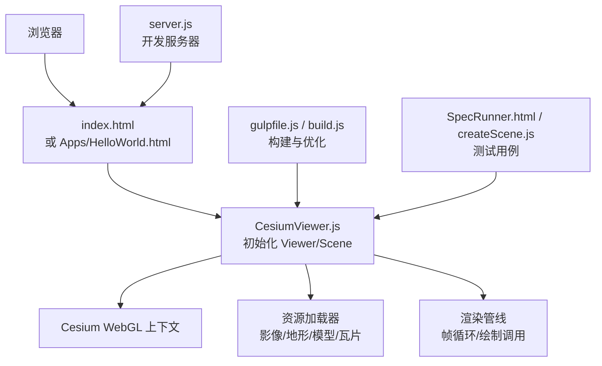
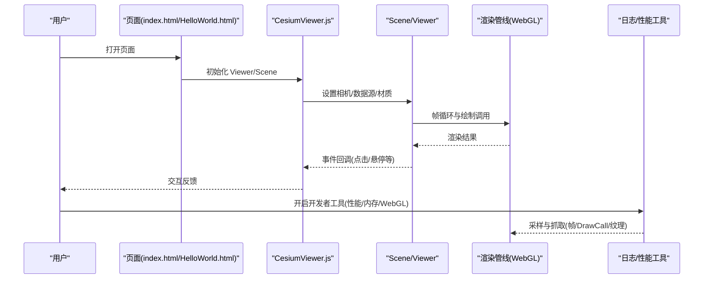
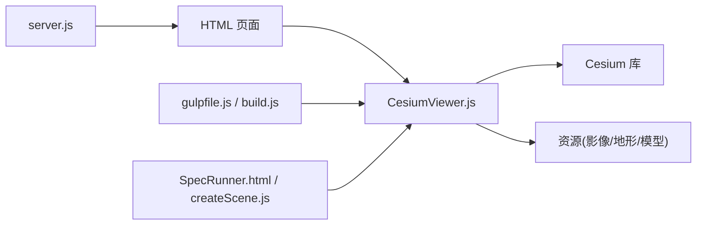

# 调试工具与技巧

<cite>
**本文引用的文件**   
- [index.html](file://index.html)
- [HelloWorld.html](file://Apps/HelloWorld.html)
- [CesiumViewer.js](file://Apps/CesiumViewer/CesiumViewer.js)
- [CesiumViewer.css](file://Apps/CesiumViewer/CesiumViewer.css)
- [server.js](file://server.js)
- [gulpfile.js](file://gulpfile.js)
- [build.js](file://scripts/build.js)
- [SpecRunner.html](file://Specs/SpecRunner.html)
- [createScene.js](file://Specs/createScene.js)
- [karma.conf.cjs](file://Specs/karma.conf.cjs)
- [PerformanceTestingGuide.md](file://Documentation/Contributors/PerformanceTestingGuide/README.md)
- [MobileGuide.md](file://Documentation/Contributors/MobileGuide/README.md)
- [VSCodeGuide.md](file://Documentation/Contributors/VSCodeGuide/README.md)
- [package.json](file://package.json)
</cite>

## 目录
1. [简介](#简介)
2. [项目结构](#项目结构)
3. [核心组件](#核心组件)
4. [架构总览](#架构总览)
5. [详细组件分析](#详细组件分析)
6. [依赖分析](#依赖分析)
7. [性能考虑](#性能考虑)
8. [故障排查指南](#故障排查指南)
9. [结论](#结论)
10. [附录](#附录)

## 简介
本指南面向使用 Cesium 的开发者，系统梳理在浏览器端进行调试与排障的工具与方法。内容覆盖：
- 浏览器开发者工具的进阶用法（WebGL 调试、性能分析、内存泄漏检测）
- Cesium 内置调试选项与可视化统计（渲染统计、事件追踪、性能监控）
- 常见问题定位与解决（渲染异常、内存问题、性能瓶颈）
- 日志记录与错误上报最佳实践（自定义日志系统与错误报告机制）
- 远程调试与移动端调试技巧（确保多环境可排查）

## 项目结构
仓库包含示例应用、测试套件、构建脚本与文档。与调试相关的关键入口包括：
- 示例页面：用于本地运行与观察渲染效果
- 服务端与构建脚本：用于启动开发服务器与打包产物
- 测试套件：提供场景创建与断言能力，便于复现问题
- 文档：性能与移动端的官方指导

图表来源 
- [index.html:1-200](file://index.html#L1-L200)
- [HelloWorld.html:1-200](file://Apps/HelloWorld.html#L1-L200)
- [CesiumViewer.js:1-200](file://Apps/CesiumViewer/CesiumViewer.js#L1-L200)
- [server.js:1-200](file://server.js#L1-L200)
- [gulpfile.js:1-200](file://gulpfile.js#L1-L200)
- [build.js:1-200](file://scripts/build.js#L1-L200)
- [SpecRunner.html:1-200](file://Specs/SpecRunner.html#L1-L200)
- [createScene.js:1-200](file://Specs/createScene.js#L1-L200)

章节来源
- [index.html:1-200](file://index.html#L1-L200)
- [HelloWorld.html:1-200](file://Apps/HelloWorld.html#L1-L200)
- [CesiumViewer.js:1-200](file://Apps/CesiumViewer/CesiumViewer.js#L1-L200)
- [server.js:1-200](file://server.js#L1-L200)
- [gulpfile.js:1-200](file://gulpfile.js#L1-L200)
- [build.js:1-200](file://scripts/build.js#L1-L200)
- [SpecRunner.html:1-200](file://Specs/SpecRunner.html#L1-L200)
- [createScene.js:1-200](file://Specs/createScene.js#L1-L200)

## 核心组件
- 示例页面与入口
  - index.html 与 HelloWorld.html 作为最小可运行页面，便于快速验证渲染与交互
  - CesiumViewer.js 负责初始化 Viewer、Scene 及基础配置，是调试的切入点
- 开发与构建
  - server.js 提供本地开发服务，支持热更新与静态资源托管
  - gulpfile.js 与 build.js 控制构建流程与产物优化
- 测试与复现
  - SpecRunner.html 与 createScene.js 提供测试场景构造能力，适合复现与隔离问题

章节来源
- [index.html:1-200](file://index.html#L1-L200)
- [HelloWorld.html:1-200](file://Apps/HelloWorld.html#L1-L200)
- [CesiumViewer.js:1-200](file://Apps/CesiumViewer/CesiumViewer.js#L1-L200)
- [server.js:1-200](file://server.js#L1-L200)
- [gulpfile.js:1-200](file://gulpfile.js#L1-L200)
- [build.js:1-200](file://scripts/build.js#L1-L200)
- [SpecRunner.html:1-200](file://Specs/SpecRunner.html#L1-L200)
- [createScene.js:1-200](file://Specs/createScene.js#L1-L200)

## 架构总览
下图展示从页面到渲染管线的关键路径，以及调试工具介入点。

图表来源 
- [index.html:1-200](file://index.html#L1-L200)
- [HelloWorld.html:1-200](file://Apps/HelloWorld.html#L1-L200)
- [CesiumViewer.js:1-200](file://Apps/CesiumViewer/CesiumViewer.js#L1-L200)

## 详细组件分析

### 浏览器开发者工具进阶用法
- WebGL 调试
  - 使用“图形”面板捕获帧，检查 Draw Call、着色器编译状态、纹理大小与格式
  - 通过“GPU 时间线”识别耗时片段，结合着色器变量查看中间结果
  - 针对 Cesium 的 Tileset/阴影/后处理，逐层关闭以定位瓶颈
- 性能分析
  - “性能”面板录制主线程，关注长任务、布局抖动与 JS 执行热点
  - 结合 FPS 与帧时长分布，评估动画与数据更新频率是否合理
- 内存泄漏检测
  - 使用“堆快照”对比不同操作前后对象增长，定位未释放引用
  - 关注 Scene 中几何体、材质、纹理与数据源的销毁与清理
  - 对 Worker 与 Transferable 对象进行生命周期审计

章节来源
- [CesiumViewer.js:1-200](file://Apps/CesiumViewer/CesiumViewer.js#L1-L200)
- [SpecRunner.html:1-200](file://Specs/SpecRunner.html#L1-L200)
- [createScene.js:1-200](file://Specs/createScene.js#L1-L200)

### Cesium 内置调试选项与工具
- 渲染统计
  - 启用统计面板，观察帧率、绘制调用数、顶点数、纹理数量与显存占用
  - 通过统计变化判断数据加载、LOD 切换与后处理的影响
- 事件追踪
  - 监听鼠标、触摸与键盘事件，结合选择器与拾取逻辑定位交互问题
- 性能监控
  - 利用内部计数器与回调钩子，统计关键阶段耗时（如瓦片调度、几何合并）

章节来源
- [CesiumViewer.js:1-200](file://Apps/CesiumViewer/CesiumViewer.js#L1-L200)
- [SpecRunner.html:1-200](file://Specs/SpecRunner.html#L1-L200)

### 常见问题诊断方法
- 渲染问题
  - 现象：黑屏、闪烁、错位、阴影缺失
  - 步骤：禁用后处理/阴影/深度测试，逐步恢复；检查坐标系与投影矩阵；确认纹理尺寸与压缩格式
- 内存问题
  - 现象：长时间运行后卡顿或崩溃
  - 步骤：堆快照对比，查找未释放的 Geometry/Material/Texture；确认数据源与图层的 dispose
- 性能瓶颈
  - 现象：低帧率、掉帧明显
  - 步骤：降低绘制复杂度（减少面片/纹理/实例化批次），限制视锥裁剪范围，优化瓦片加载策略

章节来源
- [CesiumViewer.js:1-200](file://Apps/CesiumViewer/CesiumViewer.js#L1-L200)
- [SpecRunner.html:1-200](file://Specs/SpecRunner.html#L1-L200)

### 日志记录与错误追踪最佳实践
- 自定义日志系统
  - 按模块划分日志级别（debug/info/warn/error），避免生产环境输出过多
  - 统一格式化输出，包含时间戳、模块名、上下文信息（如相机位置、帧号）
- 错误报告机制
  - 捕获全局异常与 Promise 拒绝，上报至后端或监控平台
  - 附带设备信息、浏览器版本、Cesium 版本与关键参数，便于复现

章节来源
- [CesiumViewer.js:1-200](file://Apps/CesiumViewer/CesiumViewer.js#L1-L200)
- [SpecRunner.html:1-200](file://Specs/SpecRunner.html#L1-L200)

### 远程调试与移动端调试技巧
- 远程调试
  - 使用 Chrome DevTools Remote 连接 Android 设备，实时查看控制台、网络与性能
  - 在 iOS 上使用 Safari 远程调试，注意 WKWebView 的限制
- 移动端优化与排查
  - 降低分辨率与像素比，减少过绘与带宽压力
  - 使用 GPU 性能分析工具（如 Snapdragon Profiler、Xcode Instruments）定位驱动级问题

章节来源
- [MobileGuide.md:1-200](file://Documentation/Contributors/MobileGuide/README.md#L1-L200)
- [SpecRunner.html:1-200](file://Specs/SpecRunner.html#L1-L200)

## 依赖分析
- 页面与脚本
  - index.html/HelloWorld.html 引入 CesiumViewer.js，后者初始化 Viewer/Scene
- 构建与服务
  - gulpfile.js 与 build.js 控制构建流程；server.js 提供本地服务
- 测试与场景
  - SpecRunner.html 与 createScene.js 提供测试场景，便于隔离问题

图表来源 
- [index.html:1-200](file://index.html#L1-L200)
- [HelloWorld.html:1-200](file://Apps/HelloWorld.html#L1-L200)
- [CesiumViewer.js:1-200](file://Apps/CesiumViewer/CesiumViewer.js#L1-L200)
- [gulpfile.js:1-200](file://gulpfile.js#L1-L200)
- [build.js:1-200](file://scripts/build.js#L1-L200)
- [server.js:1-200](file://server.js#L1-L200)
- [SpecRunner.html:1-200](file://Specs/SpecRunner.html#L1-L200)
- [createScene.js:1-200](file://Specs/createScene.js#L1-L200)

章节来源
- [package.json:1-200](file://package.json#L1-L200)
- [gulpfile.js:1-200](file://gulpfile.js#L1-L200)
- [build.js:1-200](file://scripts/build.js#L1-L200)
- [server.js:1-200](file://server.js#L1-L200)

## 性能考虑
- 渲染层面
  - 控制绘制调用次数与批次合并，减少状态切换
  - 合理使用 LOD、视锥裁剪与遮挡剔除，降低无效绘制
- 资源层面
  - 纹理压缩与共享，避免重复加载；按需加载瓦片与模型
- 计算层面
  - 将重计算移至 Worker；减少主线程阻塞任务
- 监控与度量
  - 持续采集 FPS、Draw Call、内存峰值与网络吞吐，建立基线与告警

章节来源
- [PerformanceTestingGuide.md:1-200](file://Documentation/Contributors/PerformanceTestingGuide/README.md#L1-L200)
- [CesiumViewer.js:1-200](file://Apps/CesiumViewer/CesiumViewer.js#L1-L200)

## 故障排查指南
- 快速定位清单
  - 确认 WebGL 上下文可用与扩展支持
  - 检查资源路径与跨域策略
  - 关闭非必要特性（阴影、后处理、高精度）
  - 使用最小场景复现问题
- 常用命令与工具
  - 性能面板录制与分析
  - 堆快照对比与内存火焰图
  - 图形面板逐帧分析与着色器变量检查
- 日志与上报
  - 统一日志格式与级别
  - 错误上报携带上下文与环境信息

章节来源
- [SpecRunner.html:1-200](file://Specs/SpecRunner.html#L1-L200)
- [createScene.js:1-200](file://Specs/createScene.js#L1-L200)
- [CesiumViewer.js:1-200](file://Apps/CesiumViewer/CesiumViewer.js#L1-L200)

## 结论
通过系统化的浏览器开发者工具与 Cesium 内置调试能力，结合合理的日志与错误上报机制，可以在多种环境下高效定位并解决渲染、内存与性能问题。建议在生产环境中保持最小化调试开销，同时保留关键指标采集，以便持续优化用户体验。

## 附录
- 参考文档
  - 性能测试指南：[PerformanceTestingGuide.md](file://Documentation/Contributors/PerformanceTestingGuide/README.md)
  - 移动端指南：[MobileGuide.md](file://Documentation/Contributors/MobileGuide/README.md)
  - VS Code 指南：[VSCodeGuide.md](file://Documentation/Contributors/VSCodeGuide/README.md)
- 构建与运行
  - 包管理：[package.json](file://package.json)
  - 构建脚本：[gulpfile.js](file://gulpfile.js)、[build.js](file://scripts/build.js)
  - 本地服务：[server.js](file://server.js)