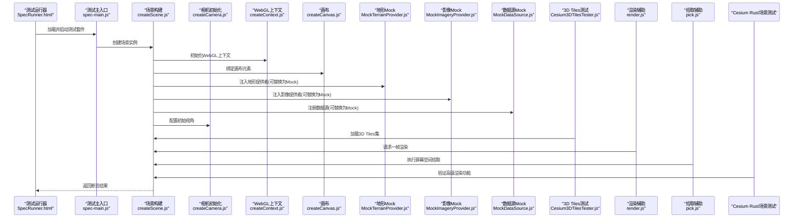
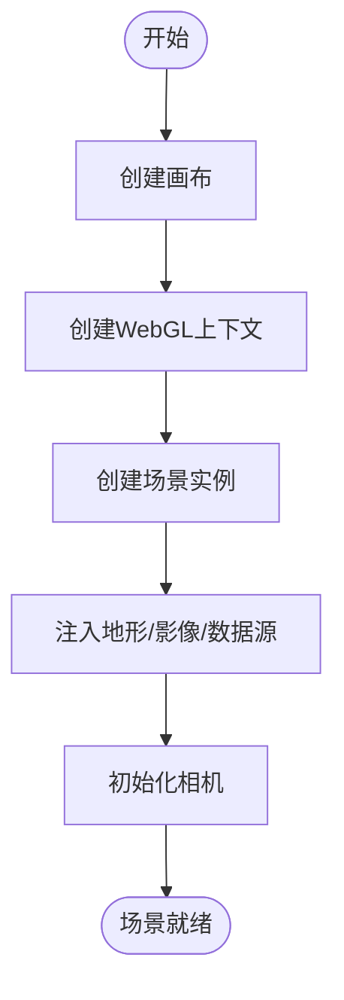
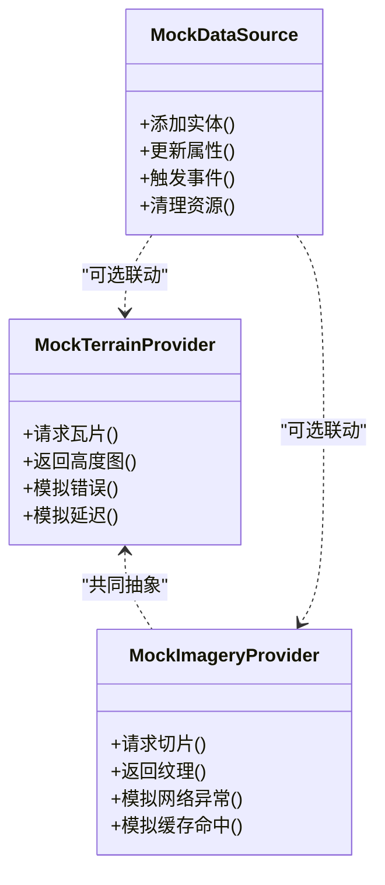
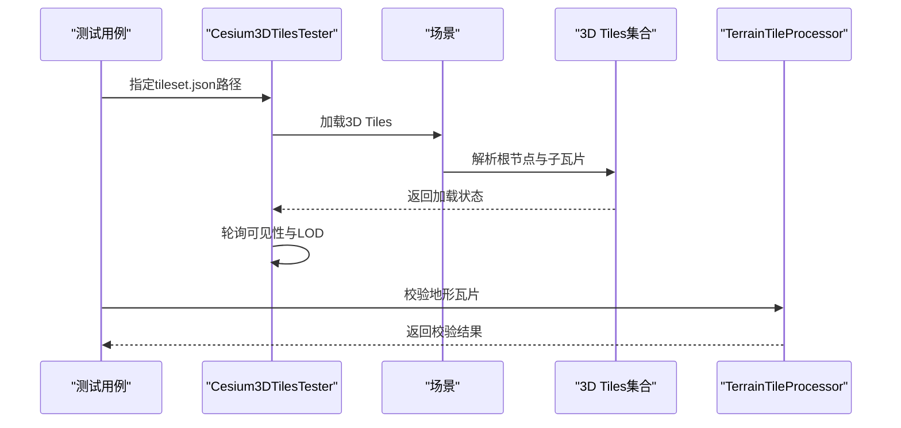
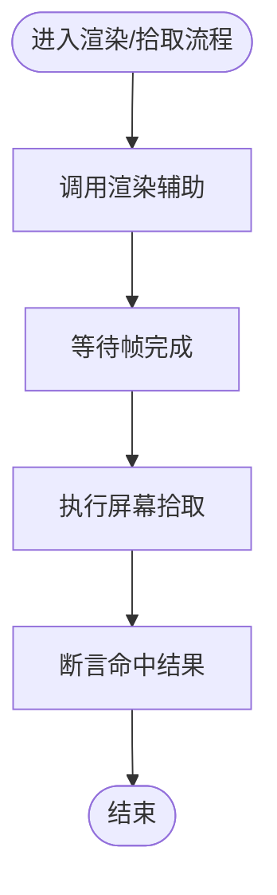
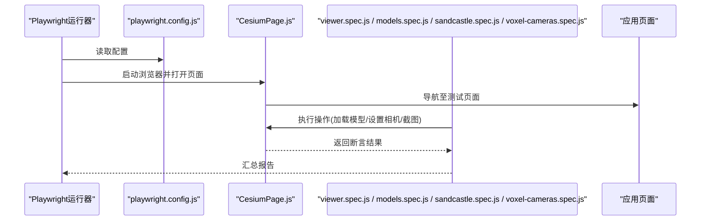
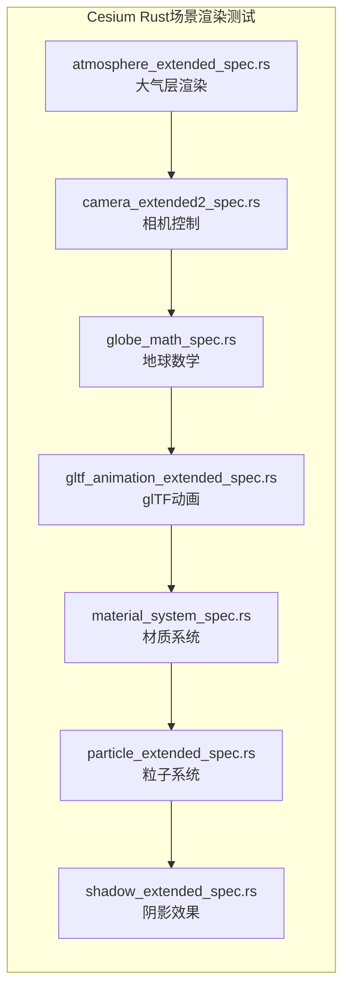
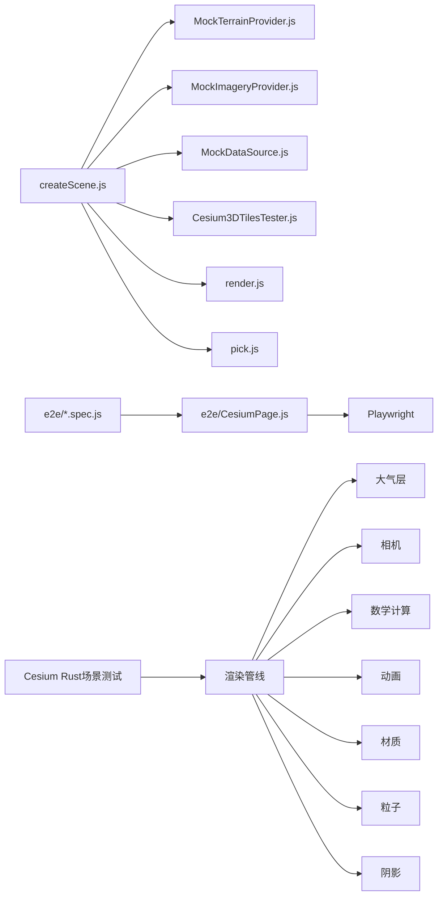

# 集成测试

<cite>
**本文引用的文件**   
- [Specs/SpecRunner.html](file://Specs/SpecRunner.html)
- [Specs/spec-main.js](file://Specs/spec-main.js)
- [Specs/createScene.js](file://Specs/createScene.js)
- [Specs/createCamera.js](file://Specs/createCamera.js)
- [Specs/createContext.js](file://Specs/createContext.js)
- [Specs/createCanvas.js](file://Specs/createCanvas.js)
- [Specs/MockTerrainProvider.js](file://Specs/MockTerrainProvider.js)
- [Specs/MockImageryProvider.js](file://Specs/MockImageryProvider.js)
- [Specs/MockDataSource.js](file://Specs/MockDataSource.js)
- [Specs/Cesium3DTilesTester.js](file://Specs/Cesium3DTilesTester.js)
- [Specs/TerrainTileProcessor.js](file://Specs/TerrainTileProcessor.js)
- [Specs/pick.js](file://Specs/pick.js)
- [Specs/render.js](file://Specs/render.js)
- [Specs/e2e/test.js](file://Specs/e2e/test.js)
- [Specs/e2e/CesiumPage.js](file://Specs/e2e/CesiumPage.js)
- [Specs/e2e/viewer.spec.js](file://Specs/e2e/viewer.spec.js)
- [Specs/e2e/models.spec.js](file://Specs/e2e/models.spec.js)
- [Specs/e2e/sandcastle.spec.js](file://Specs/e2e/sandcastle.spec.js)
- [Specs/e2e/voxel-cameras.spec.js](file://Specs/e2e/voxel-cameras.spec.js)
- [Specs/e2e/playwright.config.js](file://Specs/e2e/playwright.config.js)
- [Apps/SampleData/Cesium3DTiles/Batched/BatchedColors/tileset.json](file://Apps/SampleData/Cesium3DTiles/Batched/BatchedColors/tileset.json)
- [cesiumrust/specs/tests/scene/atmosphere_extended_spec.rs](file://cesiumrust/specs/tests/scene/atmosphere_extended_spec.rs)
- [cesiumrust/specs/tests/scene/camera_extended2_spec.rs](file://cesiumrust/specs/tests/scene/camera_extended2_spec.rs)
- [cesiumrust/specs/tests/scene/globe_math_spec.rs](file://cesiumrust/specs/tests/scene/globe_math_spec.rs)
- [cesiumrust/specs/tests/scene/gltf_animation_extended_spec.rs](file://cesiumrust/specs/tests/scene/gltf_animation_extended_spec.rs)
- [cesiumrust/specs/tests/scene/material_system_spec.rs](file://cesiumrust/specs/tests/scene/material_system_spec.rs)
- [cesiumrust/specs/tests/scene/particle_extended_spec.rs](file://cesiumrust/specs/tests/scene/particle_extended_spec.rs)
- [cesiumrust/specs/tests/scene/shadow_extended_spec.rs](file://cesiumrust/specs/tests/scene/shadow_extended_spec.rs)
</cite>

## 更新摘要
**所做更改**
- 新增场景渲染领域的高级测试规范章节，涵盖大气层、相机、地球数学、glTF动画、材质系统、粒子和阴影等核心渲染功能
- 扩展了Cesium Rust项目的集成测试架构说明
- 更新了复杂场景测试策略，包含更多渲染管线组件的验证方法
- 增强了端到端工作流的测试覆盖范围

## 目录
1. [简介](#简介)
2. [项目结构](#项目结构)
3. [核心组件](#核心组件)
4. [架构总览](#架构总览)
5. [详细组件分析](#详细组件分析)
6. [场景渲染高级测试](#场景渲染高级测试)
7. [依赖关系分析](#依赖关系分析)
8. [性能考量](#性能考量)
9. [故障排查指南](#故障排查指南)
10. [结论](#结论)
11. [附录](#附录)

## 简介
本文件面向Cesium项目的集成测试，聚焦于多组件交互与协作的验证，包括数据提供者（地形、影像、数据源）、场景管理与渲染系统。文档涵盖：
- Mock对象的创建与使用：地形提供者、影像提供器、数据源模拟器
- 复杂场景的测试策略：3D Tiles加载、模型渲染、相机控制
- 端到端工作流：跨模块通信与数据流转验证
- 错误处理与异常覆盖
- **新增**：Cesium Rust项目的高级场景渲染测试，包括大气层、相机、地球数学、glTF动画、材质系统、粒子和阴影等核心功能的集成验证

## 项目结构
仓库中用于集成测试的关键目录与文件：
- Specs：单元测试与集成测试基础设施、Mock实现、测试辅助工具
- Specs/e2e：基于Playwright的端到端测试，驱动真实浏览器环境中的Viewer与示例页面
- cesiumrust/specs/tests/scene：Cesium Rust项目的高级场景渲染测试规范
- Apps/SampleData：测试所需的静态资源（如3D Tiles、模型等）

```mermaid
graph TB
subgraph "测试基础设施"
A["SpecRunner.html"]
B["spec-main.js"]
C["createScene.js"]
D["createCamera.js"]
E["createContext.js"]
F["createCanvas.js"]
end
subgraph "Mock与辅助"
G["MockTerrainProvider.js"]
H["MockImageryProvider.js"]
I["MockDataSource.js"]
J["Cesium3DTilesTester.js"]
K["TerrainTileProcessor.js"]
L["pick.js"]
M["render.js"]
end
subgraph "端到端(e2e)"
N["e2e/test.js"]
O["e2e/CesiumPage.js"]
P["e2e/viewer.spec.js"]
Q["e2e/models.spec.js"]
R["e2e/sandcastle.spec.js"]
S["e2e/voxel-cameras.spec.js"]
T["e2e/playwright.config.js"]
end
subgraph "Cesium Rust场景测试"
U["atmosphere_extended_spec.rs"]
V["camera_extended2_spec.rs"]
W["globe_math_spec.rs"]
X["gltf_animation_extended_spec.rs"]
Y["material_system_spec.rs"]
Z["particle_extended_spec.rs"]
AA["shadow_extended_spec.rs"]
end
subgraph "测试数据"
AB["SampleData/Cesium3DTiles/.../tileset.json"]
end
A --> B
B --> C
C --> D
C --> E
C --> F
C --> G
C --> H
C --> I
C --> J
C --> K
C --> L
C --> M
N --> O
O --> P
O --> Q
O --> R
O --> S
P --> AB
Q --> AB
U --> V
V --> W
W --> X
X --> Y
Y --> Z
Z --> AA
```

**图表来源**
- [Specs/SpecRunner.html](file://Specs/SpecRunner.html)
- [Specs/spec-main.js](file://Specs/spec-main.js)
- [Specs/createScene.js](file://Specs/createScene.js)
- [Specs/createCamera.js](file://Specs/createCamera.js)
- [Specs/createContext.js](file://Specs/createContext.js)
- [Specs/createCanvas.js](file://Specs/createCanvas.js)
- [Specs/MockTerrainProvider.js](file://Specs/MockTerrainProvider.js)
- [Specs/MockImageryProvider.js](file://Specs/MockImageryProvider.js)
- [Specs/MockDataSource.js](file://Specs/MockDataSource.js)
- [Specs/Cesium3DTilesTester.js](file://Specs/Cesium3DTilesTester.js)
- [Specs/TerrainTileProcessor.js](file://Specs/TerrainTileProcessor.js)
- [Specs/pick.js](file://Specs/pick.js)
- [Specs/render.js](file://Specs/render.js)
- [Specs/e2e/test.js](file://Specs/e2e/test.js)
- [Specs/e2e/CesiumPage.js](file://Specs/e2e/CesiumPage.js)
- [Specs/e2e/viewer.spec.js](file://Specs/e2e/viewer.spec.js)
- [Specs/e2e/models.spec.js](file://Specs/e2e/models.spec.js)
- [Specs/e2e/sandcastle.spec.js](file://Specs/e2e/sandcastle.spec.js)
- [Specs/e2e/voxel-cameras.spec.js](file://Specs/e2e/voxel-cameras.spec.js)
- [Specs/e2e/playwright.config.js](file://Specs/e2e/playwright.config.js)
- [cesiumrust/specs/tests/scene/atmosphere_extended_spec.rs](file://cesiumrust/specs/tests/scene/atmosphere_extended_spec.rs)
- [cesiumrust/specs/tests/scene/camera_extended2_spec.rs](file://cesiumrust/specs/tests/scene/camera_extended2_spec.rs)
- [cesiumrust/specs/tests/scene/globe_math_spec.rs](file://cesiumrust/specs/tests/scene/globe_math_spec.rs)
- [cesiumrust/specs/tests/scene/gltf_animation_extended_spec.rs](file://cesiumrust/specs/tests/scene/gltf_animation_extended_spec.rs)
- [cesiumrust/specs/tests/scene/material_system_spec.rs](file://cesiumrust/specs/tests/scene/material_system_spec.rs)
- [cesiumrust/specs/tests/scene/particle_extended_spec.rs](file://cesiumrust/specs/tests/scene/particle_extended_spec.rs)
- [cesiumrust/specs/tests/scene/shadow_extended_spec.rs](file://cesiumrust/specs/tests/scene/shadow_extended_spec.rs)
- [Apps/SampleData/Cesium3DTiles/Batched/BatchedColors/tileset.json](file://Apps/SampleData/Cesium3DTiles/Batched/BatchedColors/tileset.json)

**章节来源**
- [Specs/SpecRunner.html](file://Specs/SpecRunner.html)
- [Specs/spec-main.js](file://Specs/spec-main.js)
- [Specs/createScene.js](file://Specs/createScene.js)
- [Specs/e2e/test.js](file://Specs/e2e/test.js)
- [Specs/e2e/CesiumPage.js](file://Specs/e2e/CesiumPage.js)
- [Specs/e2e/playwright.config.js](file://Specs/e2e/playwright.config.js)

## 核心组件
本节概述集成测试的核心能力与职责边界：
- 场景构建与上下文：通过createScene、createCamera、createContext、createCanvas组合，构造可测的WebGL上下文与场景实例，确保渲染管线可用且稳定。
- 数据提供者Mock：MockTerrainProvider、MockImageryProvider、MockDataSource分别模拟地形、影像与动态数据源，屏蔽网络与外部依赖，保证测试确定性。
- 3D Tiles与地形处理：Cesium3DTilesTester与TerrainTileProcessor提供3D Tiles与地形瓦片加载、状态检查与断言能力。
- 选择与渲染：pick与render提供屏幕空间拾取与帧渲染辅助，便于验证可见性与命中结果。
- 端到端测试：e2e目录下的脚本通过Playwright驱动浏览器，执行真实用户流程（加载Viewer、添加模型、相机操作、截图对比）。
- **新增**：Cesium Rust高级场景测试：涵盖大气层渲染、相机控制、地球数学计算、glTF动画、材质系统、粒子系统和阴影效果等核心渲染功能的集成验证。

**章节来源**
- [Specs/createScene.js](file://Specs/createScene.js)
- [Specs/createCamera.js](file://Specs/createCamera.js)
- [Specs/createContext.js](file://Specs/createContext.js)
- [Specs/createCanvas.js](file://Specs/createCanvas.js)
- [Specs/MockTerrainProvider.js](file://Specs/MockTerrainProvider.js)
- [Specs/MockImageryProvider.js](file://Specs/MockImageryProvider.js)
- [Specs/MockDataSource.js](file://Specs/MockDataSource.js)
- [Specs/Cesium3DTilesTester.js](file://Specs/Cesium3DTilesTester.js)
- [Specs/TerrainTileProcessor.js](file://Specs/TerrainTileProcessor.js)
- [Specs/pick.js](file://Specs/pick.js)
- [Specs/render.js](file://Specs/render.js)
- [Specs/e2e/test.js](file://Specs/e2e/test.js)
- [Specs/e2e/CesiumPage.js](file://Specs/e2e/CesiumPage.js)
- [cesiumrust/specs/tests/scene/atmosphere_extended_spec.rs](file://cesiumrust/specs/tests/scene/atmosphere_extended_spec.rs)
- [cesiumrust/specs/tests/scene/camera_extended2_spec.rs](file://cesiumrust/specs/tests/scene/camera_extended2_spec.rs)
- [cesiumrust/specs/tests/scene/globe_math_spec.rs](file://cesiumrust/specs/tests/scene/globe_math_spec.rs)
- [cesiumrust/specs/tests/scene/gltf_animation_extended_spec.rs](file://cesiumrust/specs/tests/scene/gltf_animation_extended_spec.rs)
- [cesiumrust/specs/tests/scene/material_system_spec.rs](file://cesiumrust/specs/tests/scene/material_system_spec.rs)
- [cesiumrust/specs/tests/scene/particle_extended_spec.rs](file://cesiumrust/specs/tests/scene/particle_extended_spec.rs)
- [cesiumrust/specs/tests/scene/shadow_extended_spec.rs](file://cesiumrust/specs/tests/scene/shadow_extended_spec.rs)

## 架构总览
下图展示了从测试入口到渲染输出的关键路径，以及Mock对象在数据层的作用位置。

**图表来源**
- [Specs/SpecRunner.html](file://Specs/SpecRunner.html)
- [Specs/spec-main.js](file://Specs/spec-main.js)
- [Specs/createScene.js](file://Specs/createScene.js)
- [Specs/createCamera.js](file://Specs/createCamera.js)
- [Specs/createContext.js](file://Specs/createContext.js)
- [Specs/createCanvas.js](file://Specs/createCanvas.js)
- [Specs/MockTerrainProvider.js](file://Specs/MockTerrainProvider.js)
- [Specs/MockImageryProvider.js](file://Specs/MockImageryProvider.js)
- [Specs/MockDataSource.js](file://Specs/MockDataSource.js)
- [Specs/Cesium3DTilesTester.js](file://Specs/Cesium3DTilesTester.js)
- [Specs/render.js](file://Specs/render.js)
- [Specs/pick.js](file://Specs/pick.js)
- [cesiumrust/specs/tests/scene/atmosphere_extended_spec.rs](file://cesiumrust/specs/tests/scene/atmosphere_extended_spec.rs)

## 详细组件分析

### 场景与上下文构建
- createScene：负责组装场景、配置渲染参数、挂载数据提供者与数据源，并提供统一的更新与渲染接口。
- createContext：封装WebGL上下文创建与兼容性检测，确保测试环境具备稳定的图形能力。
- createCanvas：创建或复用DOM画布节点，作为渲染目标。
- createCamera：初始化相机位置、朝向与视锥体，便于复现一致的观察角度。

**图表来源**
- [Specs/createCanvas.js](file://Specs/createCanvas.js)
- [Specs/createContext.js](file://Specs/createContext.js)
- [Specs/createScene.js](file://Specs/createScene.js)
- [Specs/createCamera.js](file://Specs/createCamera.js)

**章节来源**
- [Specs/createScene.js](file://Specs/createScene.js)
- [Specs/createCamera.js](file://Specs/createCamera.js)
- [Specs/createContext.js](file://Specs/createContext.js)
- [Specs/createCanvas.js](file://Specs/createCanvas.js)

### 数据提供者Mock
- MockTerrainProvider：模拟地形瓦片的请求与响应，支持可控的错误注入与延迟，便于验证地形加载失败、重试与降级逻辑。
- MockImageryProvider：模拟影像切片下载与缓存行为，支持自定义切片内容、元数据与异常。
- MockDataSource：模拟动态数据源的增量更新、事件通知与生命周期管理，便于验证数据驱动的可视化更新。

**图表来源**
- [Specs/MockTerrainProvider.js](file://Specs/MockTerrainProvider.js)
- [Specs/MockImageryProvider.js](file://Specs/MockImageryProvider.js)
- [Specs/MockDataSource.js](file://Specs/MockDataSource.js)

**章节来源**
- [Specs/MockTerrainProvider.js](file://Specs/MockTerrainProvider.js)
- [Specs/MockImageryProvider.js](file://Specs/MockImageryProvider.js)
- [Specs/MockDataSource.js](file://Specs/MockDataSource.js)

### 3D Tiles与地形处理
- Cesium3DTilesTester：封装3D Tiles集合的加载、状态轮询与可视性断言，支持批量与点云等不同类型的数据集。
- TerrainTileProcessor：对地形瓦片进行预处理与校验，确保高度图格式、分辨率与可用性满足要求。

**图表来源**
- [Specs/Cesium3DTilesTester.js](file://Specs/Cesium3DTilesTester.js)
- [Specs/TerrainTileProcessor.js](file://Specs/TerrainTileProcessor.js)
- [Apps/SampleData/Cesium3DTiles/Batched/BatchedColors/tileset.json](file://Apps/SampleData/Cesium3DTiles/Batched/BatchedColors/tileset.json)

**章节来源**
- [Specs/Cesium3DTilesTester.js](file://Specs/Cesium3DTilesTester.js)
- [Specs/TerrainTileProcessor.js](file://Specs/TerrainTileProcessor.js)
- [Apps/SampleData/Cesium3DTiles/Batched/BatchedColors/tileset.json](file://Apps/SampleData/Cesium3DTiles/Batched/BatchedColors/tileset.json)

### 渲染与拾取
- render：触发场景渲染并等待帧完成，便于进行截图对比或GPU状态检查。
- pick：基于屏幕坐标执行拾取，返回命中对象信息，用于验证模型可见性、遮挡关系与交互正确性。

**图表来源**
- [Specs/render.js](file://Specs/render.js)
- [Specs/pick.js](file://Specs/pick.js)

**章节来源**
- [Specs/render.js](file://Specs/render.js)
- [Specs/pick.js](file://Specs/pick.js)

### 端到端工作流（e2e）
- e2e/test.js与e2e/CesiumPage.js：封装Playwright页面对象与通用操作，统一浏览器启动、页面导航与资源准备。
- viewer.spec.js、models.spec.js、sandcastle.spec.js、voxel-cameras.spec.js：覆盖Viewer初始化、模型加载、Sandcastle示例运行、体素相机控制等典型场景。
- playwright.config.js：定义浏览器、超时、并行度与截图策略等全局配置。

**图表来源**
- [Specs/e2e/test.js](file://Specs/e2e/test.js)
- [Specs/e2e/CesiumPage.js](file://Specs/e2e/CesiumPage.js)
- [Specs/e2e/viewer.spec.js](file://Specs/e2e/viewer.spec.js)
- [Specs/e2e/models.spec.js](file://Specs/e2e/models.spec.js)
- [Specs/e2e/sandcastle.spec.js](file://Specs/e2e/sandcastle.spec.js)
- [Specs/e2e/voxel-cameras.spec.js](file://Specs/e2e/voxel-cameras.spec.js)
- [Specs/e2e/playwright.config.js](file://Specs/e2e/playwright.config.js)

**章节来源**
- [Specs/e2e/test.js](file://Specs/e2e/test.js)
- [Specs/e2e/CesiumPage.js](file://Specs/e2e/CesiumPage.js)
- [Specs/e2e/viewer.spec.js](file://Specs/e2e/viewer.spec.js)
- [Specs/e2e/models.spec.js](file://Specs/e2e/models.spec.js)
- [Specs/e2e/sandcastle.spec.js](file://Specs/e2e/sandcastle.spec.js)
- [Specs/e2e/voxel-cameras.spec.js](file://Specs/e2e/voxel-cameras.spec.js)
- [Specs/e2e/playwright.config.js](file://Specs/e2e/playwright.config.js)

## 场景渲染高级测试

### 大气层渲染测试
- atmosphere_extended_spec.rs：验证大气层散射、光照效果和视觉效果的准确性，包括不同时间、天气条件下的渲染表现。

### 相机控制测试
- camera_extended2_spec.rs：测试相机的各种控制模式、平滑过渡和精确位置控制，确保相机操作的稳定性和可预测性。

### 地球数学计算测试
- globe_math_spec.rs：验证地球坐标系转换、距离计算、方位角计算等数学运算的精度和性能。

### glTF动画测试
- gltf_animation_extended_spec.rs：测试glTF模型的动画播放、时间控制和同步机制，确保复杂动画的正确渲染。

### 材质系统测试
- material_system_spec.rs：验证材质属性的混合、纹理映射和着色器效果，确保材质系统的灵活性和性能。

### 粒子系统测试
- particle_extended_spec.rs：测试粒子发射、运动轨迹、生命周期管理和视觉效果，确保粒子系统的稳定性和性能。

### 阴影效果测试
- shadow_extended_spec.rs：验证阴影生成、软阴影效果和性能优化，确保阴影在不同场景条件下的正确显示。

**图表来源**
- [cesiumrust/specs/tests/scene/atmosphere_extended_spec.rs](file://cesiumrust/specs/tests/scene/atmosphere_extended_spec.rs)
- [cesiumrust/specs/tests/scene/camera_extended2_spec.rs](file://cesiumrust/specs/tests/scene/camera_extended2_spec.rs)
- [cesiumrust/specs/tests/scene/globe_math_spec.rs](file://cesiumrust/specs/tests/scene/globe_math_spec.rs)
- [cesiumrust/specs/tests/scene/gltf_animation_extended_spec.rs](file://cesiumrust/specs/tests/scene/gltf_animation_extended_spec.rs)
- [cesiumrust/specs/tests/scene/material_system_spec.rs](file://cesiumrust/specs/tests/scene/material_system_spec.rs)
- [cesiumrust/specs/tests/scene/particle_extended_spec.rs](file://cesiumrust/specs/tests/scene/particle_extended_spec.rs)
- [cesiumrust/specs/tests/scene/shadow_extended_spec.rs](file://cesiumrust/specs/tests/scene/shadow_extended_spec.rs)

**章节来源**
- [cesiumrust/specs/tests/scene/atmosphere_extended_spec.rs](file://cesiumrust/specs/tests/scene/atmosphere_extended_spec.rs)
- [cesiumrust/specs/tests/scene/camera_extended2_spec.rs](file://cesiumrust/specs/tests/scene/camera_extended2_spec.rs)
- [cesiumrust/specs/tests/scene/globe_math_spec.rs](file://cesiumrust/specs/tests/scene/globe_math_spec.rs)
- [cesiumrust/specs/tests/scene/gltf_animation_extended_spec.rs](file://cesiumrust/specs/tests/scene/gltf_animation_extended_spec.rs)
- [cesiumrust/specs/tests/scene/material_system_spec.rs](file://cesiumrust/specs/tests/scene/material_system_spec.rs)
- [cesiumrust/specs/tests/scene/particle_extended_spec.rs](file://cesiumrust/specs/tests/scene/particle_extended_spec.rs)
- [cesiumrust/specs/tests/scene/shadow_extended_spec.rs](file://cesiumrust/specs/tests/scene/shadow_extended_spec.rs)

## 依赖关系分析
- 低耦合高内聚：场景构建与上下文分离，便于替换WebGL后端或画布实现；数据提供者与场景解耦，通过接口注入Mock。
- 明确的外部依赖：3D Tiles与地形数据由静态资源提供，避免网络不确定性；e2e依赖Playwright驱动真实浏览器。
- 潜在循环依赖：应避免在Mock中反向引用具体测试用例，保持单向依赖（测试→Mock→被测模块）。
- **新增**：Cesium Rust场景测试与JavaScript测试框架相互独立，通过不同的测试运行器执行，但共享相同的测试数据和验证标准。

**图表来源**
- [Specs/createScene.js](file://Specs/createScene.js)
- [Specs/MockTerrainProvider.js](file://Specs/MockTerrainProvider.js)
- [Specs/MockImageryProvider.js](file://Specs/MockImageryProvider.js)
- [Specs/MockDataSource.js](file://Specs/MockDataSource.js)
- [Specs/Cesium3DTilesTester.js](file://Specs/Cesium3DTilesTester.js)
- [Specs/render.js](file://Specs/render.js)
- [Specs/pick.js](file://Specs/pick.js)
- [Specs/e2e/CesiumPage.js](file://Specs/e2e/CesiumPage.js)
- [Specs/e2e/playwright.config.js](file://Specs/e2e/playwright.config.js)
- [cesiumrust/specs/tests/scene/atmosphere_extended_spec.rs](file://cesiumrust/specs/tests/scene/atmosphere_extended_spec.rs)
- [cesiumrust/specs/tests/scene/camera_extended2_spec.rs](file://cesiumrust/specs/tests/scene/camera_extended2_spec.rs)
- [cesiumrust/specs/tests/scene/globe_math_spec.rs](file://cesiumrust/specs/tests/scene/globe_math_spec.rs)
- [cesiumrust/specs/tests/scene/gltf_animation_extended_spec.rs](file://cesiumrust/specs/tests/scene/gltf_animation_extended_spec.rs)
- [cesiumrust/specs/tests/scene/material_system_spec.rs](file://cesiumrust/specs/tests/scene/material_system_spec.rs)
- [cesiumrust/specs/tests/scene/particle_extended_spec.rs](file://cesiumrust/specs/tests/scene/particle_extended_spec.rs)
- [cesiumrust/specs/tests/scene/shadow_extended_spec.rs](file://cesiumrust/specs/tests/scene/shadow_extended_spec.rs)

**章节来源**
- [Specs/createScene.js](file://Specs/createScene.js)
- [Specs/MockTerrainProvider.js](file://Specs/MockTerrainProvider.js)
- [Specs/MockImageryProvider.js](file://Specs/MockImageryProvider.js)
- [Specs/MockDataSource.js](file://Specs/MockDataSource.js)
- [Specs/Cesium3DTilesTester.js](file://Specs/Cesium3DTilesTester.js)
- [Specs/render.js](file://Specs/render.js)
- [Specs/pick.js](file://Specs/pick.js)
- [Specs/e2e/CesiumPage.js](file://Specs/e2e/CesiumPage.js)
- [Specs/e2e/playwright.config.js](file://Specs/e2e/playwright.config.js)
- [cesiumrust/specs/tests/scene/atmosphere_extended_spec.rs](file://cesiumrust/specs/tests/scene/atmosphere_extended_spec.rs)
- [cesiumrust/specs/tests/scene/camera_extended2_spec.rs](file://cesiumrust/specs/tests/scene/camera_extended2_spec.rs)
- [cesiumrust/specs/tests/scene/globe_math_spec.rs](file://cesiumrust/specs/tests/scene/globe_math_spec.rs)
- [cesiumrust/specs/tests/scene/gltf_animation_extended_spec.rs](file://cesiumrust/specs/tests/scene/gltf_animation_extended_spec.rs)
- [cesiumrust/specs/tests/scene/material_system_spec.rs](file://cesiumrust/specs/tests/scene/material_system_spec.rs)
- [cesiumrust/specs/tests/scene/particle_extended_spec.rs](file://cesiumrust/specs/tests/scene/particle_extended_spec.rs)
- [cesiumrust/specs/tests/scene/shadow_extended_spec.rs](file://cesiumrust/specs/tests/scene/shadow_extended_spec.rs)

## 性能考量
- 减少真实网络IO：优先使用Mock与本地静态资源，避免带宽波动影响稳定性。
- 控制渲染频率：在e2e中按需触发渲染与截图，避免每帧截图导致CPU/GPU压力过大。
- 合理设置超时与重试：针对3D Tiles与地形加载，采用指数退避与最大重试次数，防止长时间阻塞。
- 并行与隔离：e2e用例尽量独立，避免共享状态；必要时限制并发度以保证资源稳定。
- **新增**：Cesium Rust场景测试的性能优化，包括异步测试、内存管理和渲染性能监控。

## 故障排查指南
- WebGL上下文不可用：检查createContext与createCanvas是否正确初始化，确认浏览器与驱动支持。
- 3D Tiles加载失败：核对tileset.json路径与资源完整性，使用Cesium3DTilesTester输出详细状态。
- 地形瓦片缺失或格式错误：使用TerrainTileProcessor校验高度图与元数据，定位问题瓦片。
- 拾取结果为空：确认相机位置、视锥体裁剪与模型可见性，必要时增加调试截图。
- e2e不稳定：调整playwright.config.js的超时与重试策略，确保页面资源加载完成后再执行断言。
- **新增**：Cesium Rust场景测试故障排查，包括渲染管线错误、内存泄漏检测和性能瓶颈分析。

**章节来源**
- [Specs/createContext.js](file://Specs/createContext.js)
- [Specs/createCanvas.js](file://Specs/createCanvas.js)
- [Specs/Cesium3DTilesTester.js](file://Specs/Cesium3DTilesTester.js)
- [Specs/TerrainTileProcessor.js](file://Specs/TerrainTileProcessor.js)
- [Specs/pick.js](file://Specs/pick.js)
- [Specs/e2e/playwright.config.js](file://Specs/e2e/playwright.config.js)
- [cesiumrust/specs/tests/scene/atmosphere_extended_spec.rs](file://cesiumrust/specs/tests/scene/atmosphere_extended_spec.rs)
- [cesiumrust/specs/tests/scene/camera_extended2_spec.rs](file://cesiumrust/specs/tests/scene/camera_extended2_spec.rs)
- [cesiumrust/specs/tests/scene/globe_math_spec.rs](file://cesiumrust/specs/tests/scene/globe_math_spec.rs)
- [cesiumrust/specs/tests/scene/gltf_animation_extended_spec.rs](file://cesiumrust/specs/tests/scene/gltf_animation_extended_spec.rs)
- [cesiumrust/specs/tests/scene/material_system_spec.rs](file://cesiumrust/specs/tests/scene/material_system_spec.rs)
- [cesiumrust/specs/tests/scene/particle_extended_spec.rs](file://cesiumrust/specs/tests/scene/particle_extended_spec.rs)
- [cesiumrust/specs/tests/scene/shadow_extended_spec.rs](file://cesiumrust/specs/tests/scene/shadow_extended_spec.rs)

## 结论
通过分层Mock与端到端验证相结合，Cesium项目的集成测试能够可靠地覆盖数据提供者、场景管理与渲染系统的协作。借助Cesium3DTilesTester与TerrainTileProcessor，可对复杂场景进行细粒度断言；结合e2e脚本，能确保真实用户流程的正确性与稳定性。**新增的Cesium Rust高级场景测试进一步扩展了测试覆盖范围，涵盖了大气层、相机、地球数学、glTF动画、材质系统、粒子和阴影等核心渲染功能，确保了渲染管线的完整性和可靠性。**建议持续完善Mock覆盖面与错误注入策略，提升测试鲁棒性与可维护性。

## 附录
- 快速上手
  - 在SpecRunner中加载spec-main以运行单元与集成测试。
  - 使用e2e/test.js与CesiumPage.js驱动浏览器执行端到端用例。
  - 运行Cesium Rust场景测试以验证高级渲染功能。
- 常用断言
  - 3D Tiles可见性与LOD变化
  - 地形瓦片加载成功与错误恢复
  - 模型渲染与屏幕拾取命中
  - 相机控制与视图变换一致性
  - **新增**：大气层渲染效果、相机控制精度、地球数学计算精度、glTF动画同步、材质混合效果、粒子系统性能和阴影质量
- **新增**：Cesium Rust测试工具链
  - Rust测试框架集成
  - 异步测试支持
  - 性能基准测试
  - 内存泄漏检测