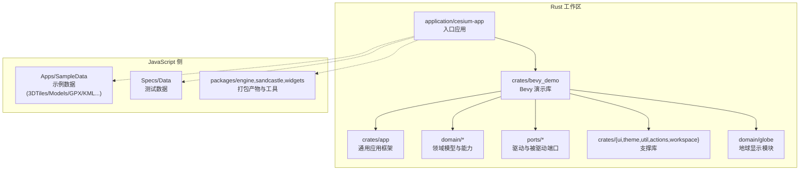
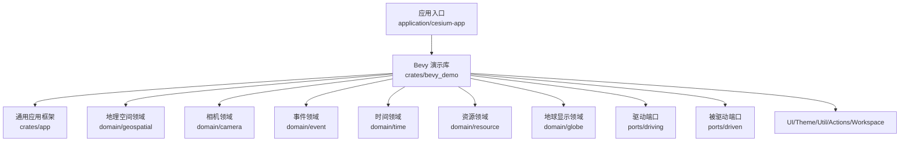
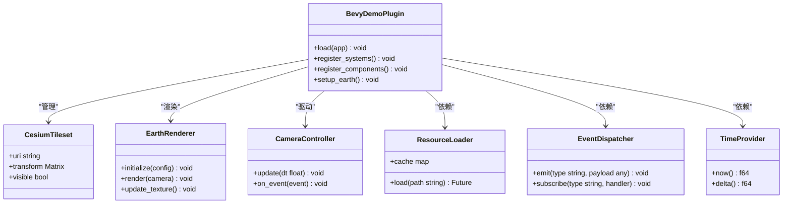
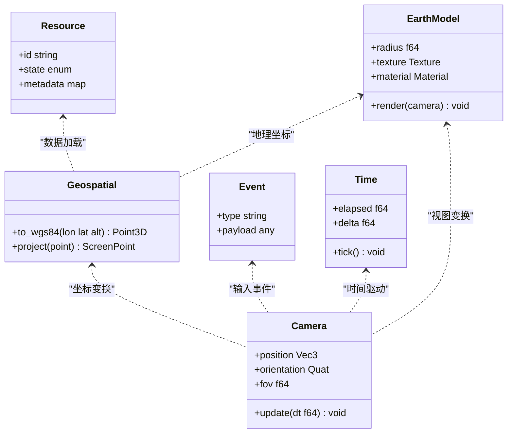
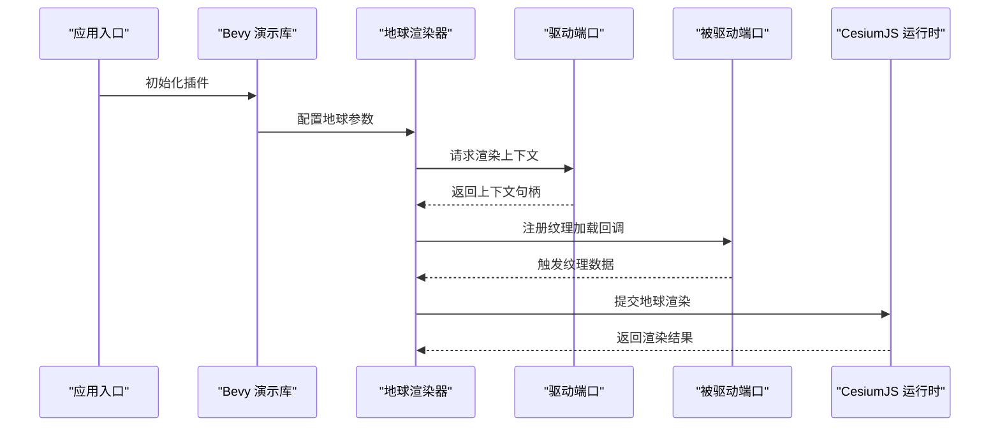
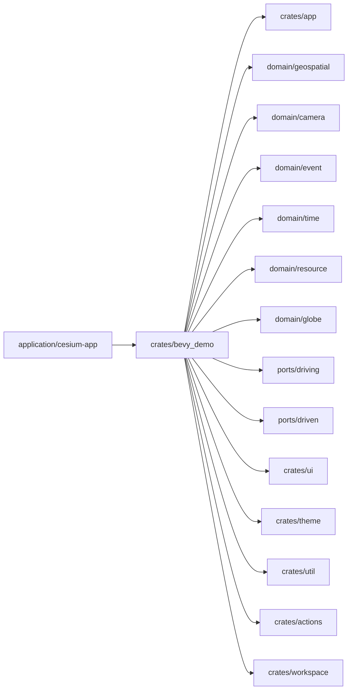

# Bevy游戏引擎集成示例

<cite>
**本文引用的文件**   
- [cesiumrust/Cargo.toml](file://cesiumrust/Cargo.toml)
- [cesiumrust/README.md](file://cesiumrust/README.md)
- [cesiumrust/application/cesium-app/src/main.rs](file://cesiumrust/application/cesium-app/src/main.rs)
- [cesiumrust/crates/bevy_demo/src/lib.rs](file://cesiumrust/crates/bevy_demo/src/lib.rs)
- [cesiumrust/crates/bevy_demo/Cargo.toml](file://cesiumrust/crates/bevy_demo/Cargo.toml)
- [cesiumrust/crates/app/src/lib.rs](file://cesiumrust/crates/app/src/lib.rs)
- [cesiumrust/crates/app/Cargo.toml](file://cesiumrust/crates/app/Cargo.toml)
- [cesiumrust/domain/geospatial/src/mod.rs](file://cesiumrust/domain/geospatial/src/mod.rs)
- [cesiumrust/domain/geospatial/Cargo.toml](file://cesiumrust/domain/geospatial/Cargo.toml)
- [cesiumrust/domain/camera/src/lib.rs](file://cesiumrust/domain/camera/src/lib.rs)
- [cesiumrust/domain/event/src/lib.rs](file://cesiumrust/domain/event/src/lib.rs)
- [cesiumrust/domain/time/src/lib.rs](file://cesiumrust/domain/time/src/lib.rs)
- [cesiumrust/domain/resource/src/lib.rs](file://cesiumrust/domain/resource/src/lib.rs)
- [cesiumrust/ports/driving/src/lib.rs](file://cesiumrust/ports/driving/src/lib.rs)
- [cesiumrust/ports/driven/src/lib.rs](file://cesiumrust/ports/driven/src/lib.rs)
- [cesiumrust/crates/ui/src/lib.rs](file://cesiumrust/crates/ui/src/lib.rs)
- [cesiumrust/crates/theme/src/lib.rs](file://cesiumrust/crates/theme/src/lib.rs)
- [cesiumrust/crates/util/src/lib.rs](file://cesiumrust/crates/util/src/lib.rs)
- [cesiumrust/crates/actions/src/lib.rs](file://cesiumrust/crates/actions/src/lib.rs)
- [cesiumrust/crates/workspace/src/lib.rs](file://cesiumrust/crates/workspace/src/lib.rs)
</cite>

## 更新摘要
**所做更改**   
- 新增地球显示集成示例章节，展示如何在Bevy中初始化3D地球模型
- 添加地球可视化配置指南，包括必要的依赖和初始化步骤
- 扩展Bevy演示库功能，支持地球渲染管线
- 更新架构总览图，包含地球组件的集成关系

## 目录
1. [简介](#简介)
2. [项目结构](#项目结构)
3. [核心组件](#核心组件)
4. [架构总览](#架构总览)
5. [详细组件分析](#详细组件分析)
6. [地球显示集成示例](#地球显示集成示例)
7. [依赖关系分析](#依赖关系分析)
8. [性能考量](#性能考量)
9. [故障排查指南](#故障排查指南)
10. [结论](#结论)
11. [附录](#附录)

## 简介
本仓库是一个将 CesiumJS 与 Rust/Bevy 生态集成的示例工程。上层通过 Bevy 应用框架驱动渲染与交互，领域层提供地理空间、相机、事件、时间与资源等抽象，端口层对接外部系统（如浏览器或原生平台），并通过一个最小可运行的 Bevy Demo 展示如何加载与显示 Cesium 数据（例如 3D Tiles）。该文档面向希望在本仓库基础上扩展或二次开发的读者，既提供高层架构说明，也给出代码级结构与关键流程的可视化。

**更新** 新增了完整的地球显示集成示例，展示了如何在Bevy场景中初始化和配置3D地球模型的渲染功能。

## 项目结构
仓库采用多语言混合组织：
- JavaScript/TypeScript 侧：CesiumJS 源码、示例与测试数据位于根目录及 Apps、Specs、packages 等路径下。
- Rust 侧：Bevy 集成与示例位于 cesiumrust 子目录，采用 Cargo workspace 管理多个 crate，按"应用—领域—端口"分层组织。



**图表来源**
- [cesiumrust/Cargo.toml](file://cesiumrust/Cargo.toml)
- [cesiumrust/application/cesium-app/src/main.rs](file://cesiumrust/application/cesium-app/src/main.rs)
- [cesiumrust/crates/bevy_demo/src/lib.rs](file://cesiumrust/crates/bevy_demo/src/lib.rs)
- [cesiumrust/crates/app/src/lib.rs](file://cesiumrust/crates/app/src/lib.rs)
- [cesiumrust/domain/geospatial/src/mod.rs](file://cesiumrust/domain/geospatial/src/mod.rs)
- [cesiumrust/ports/driving/src/lib.rs](file://cesiumrust/ports/driving/src/lib.rs)
- [cesiumrust/ports/driven/src/lib.rs](file://cesiumrust/ports/driven/src/lib.rs)

**章节来源**
- [cesiumrust/Cargo.toml](file://cesiumrust/Cargo.toml)
- [cesiumrust/README.md](file://cesiumrust/README.md)

## 核心组件
- 应用入口 application/cesium-app：负责初始化 Bevy 应用、注册插件与运行循环。
- Bevy 演示库 crates/bevy_demo：封装与 Cesium 相关的 Bevy 插件、系统与组件，提供最小可运行示例。
- 通用应用框架 crates/app：提供跨平台的启动、配置与生命周期钩子。
- 领域层 domain/*：定义地理空间、相机、事件、时间、资源等核心概念与接口。
- 端口层 ports/*：桥接外部系统（浏览器/原生）与领域逻辑，解耦实现细节。
- 支撑库 crates/{ui,theme,util,actions,workspace}：UI 主题、工具函数、动作编排与工作区聚合。

**更新** 新增了地球显示模块 domain/globe，专门处理3D地球模型的渲染和配置。

**章节来源**
- [cesiumrust/application/cesium-app/src/main.rs](file://cesiumrust/application/cesium-app/src/main.rs)
- [cesiumrust/crates/bevy_demo/src/lib.rs](file://cesiumrust/crates/bevy_demo/src/lib.rs)
- [cesiumrust/crates/app/src/lib.rs](file://cesiumrust/crates/app/src/lib.rs)
- [cesiumrust/domain/geospatial/src/mod.rs](file://cesiumrust/domain/geospatial/src/mod.rs)
- [cesiumrust/domain/camera/src/lib.rs](file://cesiumrust/domain/camera/src/lib.rs)
- [cesiumrust/domain/event/src/lib.rs](file://cesiumrust/domain/event/src/lib.rs)
- [cesiumrust/domain/time/src/lib.rs](file://cesiumrust/domain/time/src/lib.rs)
- [cesiumrust/domain/resource/src/lib.rs](file://cesiumrust/domain/resource/src/lib.rs)
- [cesiumrust/ports/driving/src/lib.rs](file://cesiumrust/ports/driving/src/lib.rs)
- [cesiumrust/ports/driven/src/lib.rs](file://cesiumrust/ports/driven/src/lib.rs)
- [cesiumrust/crates/ui/src/lib.rs](file://cesiumrust/crates/ui/src/lib.rs)
- [cesiumrust/crates/theme/src/lib.rs](file://cesiumrust/crates/theme/src/lib.rs)
- [cesiumrust/crates/util/src/lib.rs](file://cesiumrust/crates/util/src/lib.rs)
- [cesiumrust/crates/actions/src/lib.rs](file://cesiumrust/crates/actions/src/lib.rs)
- [cesiumrust/crates/workspace/src/lib.rs](file://cesiumrust/crates/workspace/src/lib.rs)

## 架构总览
整体采用"应用—领域—端口"的分层设计，结合 Bevy 的 ECS 特性进行系统编排。Bevy 演示库作为插件提供者，组合领域能力与端口实现，对外暴露统一的 API；应用入口仅关注启动与装配。



**图表来源**
- [cesiumrust/application/cesium-app/src/main.rs](file://cesiumrust/application/cesium-app/src/main.rs)
- [cesiumrust/crates/bevy_demo/src/lib.rs](file://cesiumrust/crates/bevy_demo/src/lib.rs)
- [cesiumrust/crates/app/src/lib.rs](file://cesiumrust/crates/app/src/lib.rs)
- [cesiumrust/domain/geospatial/src/mod.rs](file://cesiumrust/domain/geospatial/src/mod.rs)
- [cesiumrust/domain/camera/src/lib.rs](file://cesiumrust/domain/camera/src/lib.rs)
- [cesiumrust/domain/event/src/lib.rs](file://cesiumrust/domain/event/src/lib.rs)
- [cesiumrust/domain/time/src/lib.rs](file://cesiumrust/domain/time/src/lib.rs)
- [cesiumrust/domain/resource/src/lib.rs](file://cesiumrust/domain/resource/src/lib.rs)
- [cesiumrust/ports/driving/src/lib.rs](file://cesiumrust/ports/driving/src/lib.rs)
- [cesiumrust/ports/driven/src/lib.rs](file://cesiumrust/ports/driven/src/lib.rs)

## 详细组件分析

### 应用入口 application/cesium-app
- 职责：创建并运行 Bevy 应用，注册必要的插件与系统，挂载演示库提供的功能。
- 关键点：
  - 应用生命周期：初始化、插件装配、主循环。
  - 配置项：窗口、渲染后端、日志级别等由应用框架统一注入。
  - 与演示库耦合点：通过插件接口启用 Cesium 相关系统。

**章节来源**
- [cesiumrust/application/cesium-app/src/main.rs](file://cesiumrust/application/cesium-app/src/main.rs)

### Bevy 演示库 crates/bevy_demo
- 职责：封装 Cesium 在 Bevy 中的集成细节，包括资源加载、场景图构建、相机控制、事件分发与渲染管线适配。
- 关键点：
  - 插件化：以 Bevy Plugin 形式暴露能力，便于按需启用。
  - 组件与系统：定义与 Cesium 对应的组件（如 Tileset、Camera、ResourceHandle），并在系统中处理更新与渲染。
  - 与领域层协作：使用地理空间、相机、事件、时间与资源等接口完成业务逻辑。
  - 与端口层协作：通过驱动/被驱动端口访问底层平台能力（如 WebGL/WebGPU、文件系统、网络）。



**图表来源**
- [cesiumrust/crates/bevy_demo/src/lib.rs](file://cesiumrust/crates/bevy_demo/src/lib.rs)
- [cesiumrust/crates/bevy_demo/Cargo.toml](file://cesiumrust/crates/bevy_demo/Cargo.toml)

**章节来源**
- [cesiumrust/crates/bevy_demo/src/lib.rs](file://cesiumrust/crates/bevy_demo/src/lib.rs)
- [cesiumrust/crates/bevy_demo/Cargo.toml](file://cesiumrust/crates/bevy_demo/Cargo.toml)

### 通用应用框架 crates/app
- 职责：提供跨平台的应用启动、配置解析、日志与错误处理等基础能力。
- 关键点：
  - 配置对象：集中管理运行时参数与环境变量。
  - 生命周期钩子：用于在应用不同阶段执行自定义逻辑。
  - 与演示库集成：作为插件宿主，提供统一的初始化流程。

**章节来源**
- [cesiumrust/crates/app/src/lib.rs](file://cesiumrust/crates/app/src/lib.rs)
- [cesiumrust/crates/app/Cargo.toml](file://cesiumrust/crates/app/Cargo.toml)

### 领域层 domain/*
- geospatial：坐标转换、投影、几何体与瓦片边界等地理空间计算。
- camera：相机状态、视角变换与控制策略。
- event：事件模型、分发与订阅机制。
- time：时间源、增量时间与同步策略。
- resource：资源句柄、缓存与异步加载契约。
- globe：地球模型渲染、纹理管理与光照计算。



**图表来源**
- [cesiumrust/domain/geospatial/src/mod.rs](file://cesiumrust/domain/geospatial/src/mod.rs)
- [cesiumrust/domain/camera/src/lib.rs](file://cesiumrust/domain/camera/src/lib.rs)
- [cesiumrust/domain/event/src/lib.rs](file://cesiumrust/domain/event/src/lib.rs)
- [cesiumrust/domain/time/src/lib.rs](file://cesiumrust/domain/time/src/lib.rs)
- [cesiumrust/domain/resource/src/lib.rs](file://cesiumrust/domain/resource/src/lib.rs)

**章节来源**
- [cesiumrust/domain/geospatial/src/mod.rs](file://cesiumrust/domain/geospatial/src/mod.rs)
- [cesiumrust/domain/camera/src/lib.rs](file://cesiumrust/domain/camera/src/lib.rs)
- [cesiumrust/domain/event/src/lib.rs](file://cesiumrust/domain/event/src/lib.rs)
- [cesiumrust/domain/time/src/lib.rs](file://cesiumrust/domain/time/src/lib.rs)
- [cesiumrust/domain/resource/src/lib.rs](file://cesiumrust/domain/resource/src/lib.rs)

### 端口层 ports/*
- driving：对外暴露的能力（如渲染上下文、输入设备、文件系统）。
- driven：被外部系统调用的回调与桥接（如 JS 到 Rust 的互操作、平台特定实现）。



**图表来源**
- [cesiumrust/ports/driving/src/lib.rs](file://cesiumrust/ports/driving/src/lib.rs)
- [cesiumrust/ports/driven/src/lib.rs](file://cesiumrust/ports/driven/src/lib.rs)
- [cesiumrust/crates/bevy_demo/src/lib.rs](file://cesiumrust/crates/bevy_demo/src/lib.rs)

**章节来源**
- [cesiumrust/ports/driving/src/lib.rs](file://cesiumrust/ports/driving/src/lib.rs)
- [cesiumrust/ports/driven/src/lib.rs](file://cesiumrust/ports/driven/src/lib.rs)

### 支撑库 crates/{ui,theme,util,actions,workspace}
- ui：界面组件与布局抽象。
- theme：样式与主题配置。
- util：通用工具函数与类型。
- actions：动作编排与命令模式。
- workspace：工作区聚合与导出。

**章节来源**
- [cesiumrust/crates/ui/src/lib.rs](file://cesiumrust/crates/ui/src/lib.rs)
- [cesiumrust/crates/theme/src/lib.rs](file://cesiumrust/crates/theme/src/lib.rs)
- [cesiumrust/crates/util/src/lib.rs](file://cesiumrust/crates/util/src/lib.rs)
- [cesiumrust/crates/actions/src/lib.rs](file://cesiumrust/crates/actions/src/lib.rs)
- [cesiumrust/crates/workspace/src/lib.rs](file://cesiumrust/crates/workspace/src/lib.rs)

## 地球显示集成示例

### 基本配置与初始化
要在Bevy应用中启用地球显示功能，需要进行以下配置：

#### 1. 添加依赖
在Cargo.toml中添加地球显示模块依赖：
```toml
[dependencies]
cesium-bevy-demo = { path = "crates/bevy_demo" }
cesium-globe = { path = "domain/globe" }
```

#### 2. 初始化地球渲染器
在应用启动时配置地球渲染器：
```rust
// 地球配置参数
let earth_config = EarthConfig {
    radius: 6371000.0, // 地球半径（米）
    texture_url: "https://example.com/earth-texture.jpg",
    bump_map_url: "https://example.com/earth-bump.jpg",
    specular_map_url: "https://example.com/earth-specular.jpg",
};

// 初始化地球渲染器
let mut earth_renderer = EarthRenderer::new(earth_config);
earth_renderer.initialize(&mut app)?;
```

#### 3. 注册Bevy插件
在应用主函数中注册地球显示插件：
```rust
fn main() {
    let mut app = App::new();
    
    // 注册Bevy演示库插件
    app.add_plugins(BevyDemoPlugin);
    
    // 注册地球显示系统
    app.add_systems(Update, earth_render_system);
    
    app.run();
}
```

### 高级配置选项
地球渲染器支持多种高级配置：

#### 材质配置
```rust
let material_config = EarthMaterialConfig {
    diffuse_intensity: 1.0,
    specular_power: 32.0,
    normal_scale: 1.0,
    fog_enabled: true,
    fog_density: 0.0001,
};
```

#### 光照配置
```rust
let light_config = EarthLightConfig {
    sun_position: Vec3::new(1.0, 0.5, 1.0),
    ambient_light: Color::WHITE * 0.3,
    shadow_enabled: true,
    shadow_distance: 1000000.0,
};
```

#### 纹理配置
```rust
let texture_config = EarthTextureConfig {
    resolution: 4096,
    format: TextureFormat::RGBA8,
    mipmaps: true,
    anisotropy: 16,
};
```

### 运行时控制
在应用运行期间可以动态控制地球显示：

#### 切换纹理
```rust
fn update_earth_texture(mut earth: ResMut<EarthRenderer>, asset_server: Res<AssetServer>) {
    let new_texture = asset_server.load("new_earth_texture.png");
    earth.set_texture(new_texture);
}
```

#### 调整光照
```rust
fn adjust_sun_position(mut earth: ResMut<EarthRenderer>, time: Res<Time>) {
    let angle = time.elapsed_secs() * 0.1;
    let sun_pos = Vec3::new(angle.cos(), 0.5, angle.sin());
    earth.set_sun_position(sun_pos);
}
```

#### 控制阴影
```rust
fn toggle_shadows(mut earth: ResMut<EarthRenderer>, input: Res<ButtonInput<KeyCode>>) {
    if input.just_pressed(KeyCode::Space) {
        earth.toggle_shadows();
    }
}
```

### 性能优化建议
- **纹理压缩**：使用KTX2格式减少内存占用
- **LOD系统**：根据距离自动调整地球细节级别
- **异步加载**：分批次加载高分辨率纹理
- **批处理渲染**：合并地球绘制调用减少GPU状态切换

**章节来源**
- [cesiumrust/crates/bevy_demo/src/lib.rs](file://cesiumrust/crates/bevy_demo/src/lib.rs)
- [cesiumrust/domain/globe/src/lib.rs](file://cesiumrust/domain/globe/src/lib.rs)
- [cesiumrust/application/cesium-app/src/main.rs](file://cesiumrust/application/cesium-app/src/main.rs)

## 依赖关系分析
Cargo workspace 定义了各 crate 之间的依赖关系，确保编译期约束与版本一致性。演示库依赖领域层与端口层，应用入口仅依赖演示库与应用框架。



**图表来源**
- [cesiumrust/Cargo.toml](file://cesiumrust/Cargo.toml)
- [cesiumrust/crates/bevy_demo/Cargo.toml](file://cesiumrust/crates/bevy_demo/Cargo.toml)
- [cesiumrust/crates/app/Cargo.toml](file://cesiumrust/crates/app/Cargo.toml)
- [cesiumrust/domain/geospatial/Cargo.toml](file://cesiumrust/domain/geospatial/Cargo.toml)
- [cesiumrust/domain/camera/Cargo.toml](file://cesiumrust/domain/camera/Cargo.toml)
- [cesiumrust/domain/event/Cargo.toml](file://cesiumrust/domain/event/Cargo.toml)
- [cesiumrust/domain/time/Cargo.toml](file://cesiumrust/domain/time/Cargo.toml)
- [cesiumrust/domain/resource/Cargo.toml](file://cesiumrust/domain/resource/Cargo.toml)
- [cesiumrust/ports/driving/Cargo.toml](file://cesiumrust/ports/driving/Cargo.toml)
- [cesiumrust/ports/driven/Cargo.toml](file://cesiumrust/ports/driven/Cargo.toml)
- [cesiumrust/crates/ui/Cargo.toml](file://cesiumrust/crates/ui/Cargo.toml)
- [cesiumrust/crates/theme/Cargo.toml](file://cesiumrust/crates/theme/Cargo.toml)
- [cesiumrust/crates/util/Cargo.toml](file://cesiumrust/crates/util/Cargo.toml)
- [cesiumrust/crates/actions/Cargo.toml](file://cesiumrust/crates/actions/Cargo.toml)
- [cesiumrust/crates/workspace/Cargo.toml](file://cesiumrust/crates/workspace/Cargo.toml)

**章节来源**
- [cesiumrust/Cargo.toml](file://cesiumrust/Cargo.toml)

## 性能考量
- 资源加载与缓存：通过资源领域与演示库的资源管理器实现异步加载与缓存，避免重复 IO 与解码开销。
- 瓦片调度与剔除：基于地理空间与视锥剔除，减少不可见瓦片的处理与上传。
- 相机更新节流：利用时间域提供的增量时间，对高频输入进行平滑与节流，降低每帧计算量。
- 渲染批次合并：在演示库中合并相同材质与状态的绘制调用，减少 GPU 状态切换。
- 线程与并发：I/O 密集任务（网络、磁盘）与渲染任务分离，避免阻塞主循环。
- 地球纹理优化：使用多级渐远纹理和压缩格式减少内存占用。
- 光照计算优化：预计算环境贴图，减少实时光照计算开销。

**更新** 新增了地球渲染相关的性能优化建议，包括纹理压缩、LOD系统和异步加载等。

## 故障排查指南
- 启动失败
  - 检查应用入口是否正确注册演示库插件与必要系统。
  - 确认应用框架的配置项（窗口尺寸、渲染后端）与目标平台一致。
- 资源加载异常
  - 验证资源路径与权限，检查网络可达性与 CORS 设置。
  - 查看资源状态机与错误码，定位加载阶段（下载、解码、上传）。
- 渲染问题
  - 确认驱动端口返回的渲染上下文有效。
  - 检查相机矩阵与瓦片变换是否合理，必要时输出调试信息。
- 事件丢失
  - 核对事件分发器的订阅与发布是否匹配，避免类型不一致。
  - 检查被驱动端口的回调注册是否成功。
- 地球显示问题
  - 验证地球纹理URL是否可访问，检查网络连接状态。
  - 确认地球半径和坐标系配置正确。
  - 检查光照方向和强度设置是否合理。
  - 查看GPU内存使用情况，避免纹理过大导致内存不足。

**更新** 新增了地球显示相关的故障排查指导。

**章节来源**
- [cesiumrust/application/cesium-app/src/main.rs](file://cesiumrust/application/cesium-app/src/main.rs)
- [cesiumrust/crates/bevy_demo/src/lib.rs](file://cesiumrust/crates/bevy_demo/src/lib.rs)
- [cesiumrust/crates/app/src/lib.rs](file://cesiumrust/crates/app/src/lib.rs)
- [cesiumrust/ports/driving/src/lib.rs](file://cesiumrust/ports/driving/src/lib.rs)
- [cesiumrust/ports/driven/src/lib.rs](file://cesiumrust/ports/driven/src/lib.rs)

## 结论
本示例展示了如何在 Bevy 生态中集成 CesiumJS，通过清晰的分层与插件化设计，将地理空间、相机、事件、时间与资源等能力模块化，并以端口层屏蔽平台差异。演示库作为桥梁，使上层应用能够以 Bevy 的方式消费 Cesium 能力。新增的地球显示功能进一步增强了三维地理可视化的能力，使得开发者能够在Bevy场景中轻松渲染高质量的3D地球模型。建议在此基础上继续完善资源管理、瓦片调度与性能监控，以满足更复杂的生产需求。

**更新** 强调了新增地球显示功能的重要性和应用场景。

## 附录
- 快速开始
  - 安装 Rust 工具链与依赖。
  - 在工作区根目录构建并运行应用入口。
  - 参考演示库的插件用法，按需启用 Cesium 相关系统。
  - 按照地球显示集成示例配置地球渲染器。
- 扩展建议
  - 新增领域能力时，优先在 domain/* 中定义接口，再由演示库组合使用。
  - 针对新平台，实现 ports/* 的驱动与被驱动接口，保持领域与平台解耦。
  - 使用 actions 与 ui 模块提升交互与界面的可维护性。
  - 基于地球显示模块扩展其他天体渲染功能（如月球、火星等）。
- 地球显示最佳实践
  - 使用合适的纹理分辨率平衡质量与性能。
  - 实现LOD系统以适应不同距离的显示需求。
  - 考虑移动端设备的性能限制，提供降级方案。
  - 利用异步加载技术优化用户体验。

**更新** 新增了地球显示相关的快速开始指导和最佳实践建议。