# 交互操作示例

<cite>
**本文引用的文件**   
- [Apps/CesiumViewer/CesiumViewer.js](file://Apps/CesiumViewer/CesiumViewer.js)
- [Apps/CesiumViewer/index.html](file://Apps/CesiumViewer/index.html)
- [Apps/HelloWorld.html](file://Apps/HelloWorld.html)
- [Specs/e2e/picking.spec.js](file://Specs/e2e/picking.spec.js)
- [Specs/e2e/viewer.spec.js](file://Specs/e2e/viewer.spec.js)
- [Specs/e2e/DomEventSimulator.js](file://Specs/e2e/DomEventSimulator.js)
- [Documentation/Contributors/MobileGuide/README.md](file://Documentation/Contributors/MobileGuide/README.md)
</cite>

## 目录
1. [简介](#简介)
2. [项目结构](#项目结构)
3. [核心组件](#核心组件)
4. [架构总览](#架构总览)
5. [详细组件分析](#详细组件分析)
6. [依赖分析](#依赖分析)
7. [性能考虑](#性能考虑)
8. [故障排查指南](#故障排查指南)
9. [结论](#结论)
10. [附录](#附录)

## 简介
本文件面向需要在三维地球场景中实现用户交互的开发者，提供一套完整的“交互操作示例”文档。内容覆盖：
- 鼠标点击拾取、拖拽、缩放平移、键盘快捷键
- 测量工具（距离、面积、高度）
- 标注系统与右键菜单
- 信息弹窗与自定义控件开发
- 移动端触摸适配与响应式布局

为便于快速上手，所有示例均基于仓库中的最小可运行应用与端到端测试用例进行说明，并提供源码路径与步骤指引，避免直接粘贴代码，确保读者能在本地复现。

## 项目结构
仓库中与交互示例最相关的入口和样例位于 Apps 目录，最小化示例包括一个基础 Viewer 页面和一个更丰富的 CesiumViewer 应用；同时，Specs/e2e 下提供了拾取与交互行为的自动化测试，可作为参考实现。

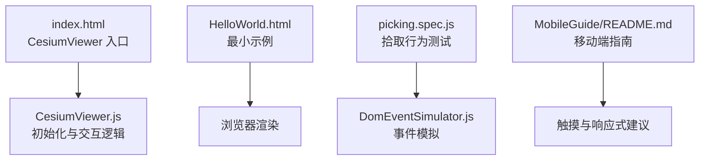

图表来源
- [Apps/CesiumViewer/index.html](file://Apps/CesiumViewer/index.html)
- [Apps/CesiumViewer/CesiumViewer.js](file://Apps/CesiumViewer/CesiumViewer.js)
- [Apps/HelloWorld.html](file://Apps/HelloWorld.html)
- [Specs/e2e/picking.spec.js](file://Specs/e2e/picking.spec.js)
- [Specs/e2e/DomEventSimulator.js](file://Specs/e2e/DomEventSimulator.js)
- [Documentation/Contributors/MobileGuide/README.md](file://Documentation/Contributors/MobileGuide/README.md)

章节来源
- [Apps/CesiumViewer/index.html](file://Apps/CesiumViewer/index.html)
- [Apps/CesiumViewer/CesiumViewer.js](file://Apps/CesiumViewer/CesiumViewer.js)
- [Apps/HelloWorld.html](file://Apps/HelloWorld.html)
- [Specs/e2e/picking.spec.js](file://Specs/e2e/picking.spec.js)
- [Specs/e2e/DomEventSimulator.js](file://Specs/e2e/DomEventSimulator.js)
- [Documentation/Contributors/MobileGuide/README.md](file://Documentation/Contributors/MobileGuide/README.md)

## 核心组件
- 场景与相机控制
  - 通过 Viewer 实例启用默认交互（旋转、缩放、平移），并可通过配置项调整行为。
  - 参考路径：[Apps/CesiumViewer/CesiumViewer.js](file://Apps/CesiumViewer/CesiumViewer.js)、[Apps/HelloWorld.html](file://Apps/HelloWorld.html)
- 拾取与命中检测
  - 使用拾取 API 在点击事件中获取被点击的实体或图元，用于后续展示详情或触发业务逻辑。
  - 参考路径：[Specs/e2e/picking.spec.js](file://Specs/e2e/picking.spec.js)
- 事件模拟与端到端验证
  - 通过 DomEventSimulator 模拟鼠标/触摸事件，驱动交互流程并断言结果。
  - 参考路径：[Specs/e2e/DomEventSimulator.js](file://Specs/e2e/DomEventSimulator.js)
- 移动端与响应式
  - 遵循移动端指南，合理设置视口、禁用不必要的交互、优化触控体验。
  - 参考路径：[Documentation/Contributors/MobileGuide/README.md](file://Documentation/Contributors/MobileGuide/README.md)

章节来源
- [Apps/CesiumViewer/CesiumViewer.js](file://Apps/CesiumViewer/CesiumViewer.js)
- [Apps/HelloWorld.html](file://Apps/HelloWorld.html)
- [Specs/e2e/picking.spec.js](file://Specs/e2e/picking.spec.js)
- [Specs/e2e/DomEventSimulator.js](file://Specs/e2e/DomEventSimulator.js)
- [Documentation/Contributors/MobileGuide/README.md](file://Documentation/Contributors/MobileGuide/README.md)

## 架构总览
下图展示了从页面加载到交互响应的整体流程，以及各模块之间的职责边界。

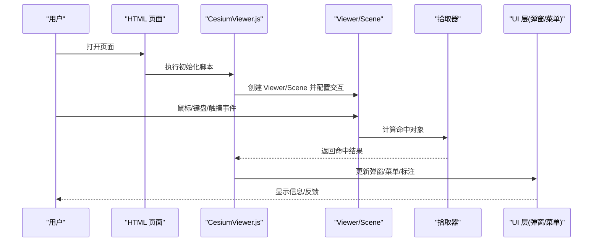

图表来源
- [Apps/CesiumViewer/index.html](file://Apps/CesiumViewer/index.html)
- [Apps/CesiumViewer/CesiumViewer.js](file://Apps/CesiumViewer/CesiumViewer.js)
- [Specs/e2e/picking.spec.js](file://Specs/e2e/picking.spec.js)

## 详细组件分析

### 鼠标点击拾取
- 目标
  - 在点击时识别被点击的实体或图元，并展示其属性或进入编辑态。
- 关键步骤
  - 在 Viewer 上注册点击事件回调。
  - 调用拾取方法，传入屏幕坐标与可选的过滤条件。
  - 根据命中结果更新 UI（如弹出信息框）。
- 参考实现
  - 端到端测试中演示了点击后对命中对象的判断与断言。
  - 参考路径：[Specs/e2e/picking.spec.js](file://Specs/e2e/picking.spec.js)
- 流程图

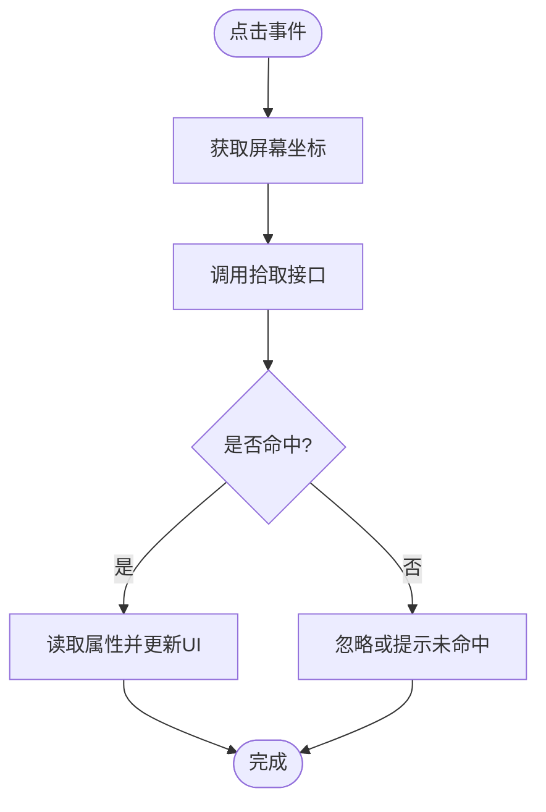

图表来源
- [Specs/e2e/picking.spec.js](file://Specs/e2e/picking.spec.js)

章节来源
- [Specs/e2e/picking.spec.js](file://Specs/e2e/picking.spec.js)

### 拖拽操作
- 目标
  - 支持对选中的点进行拖拽移动，或在绘制模式下拖拽生成折线/多边形。
- 关键步骤
  - 监听鼠标按下、移动、抬起事件。
  - 在按下时记录起始位置与选中对象。
  - 在移动时计算偏移量并更新对象位置或追加顶点。
  - 在抬起时结束拖拽并持久化结果。
- 参考实现
  - 可在 CesiumViewer.js 中扩展事件处理逻辑，结合拾取结果定位目标对象。
  - 参考路径：[Apps/CesiumViewer/CesiumViewer.js](file://Apps/CesiumViewer/CesiumViewer.js)
- 流程图

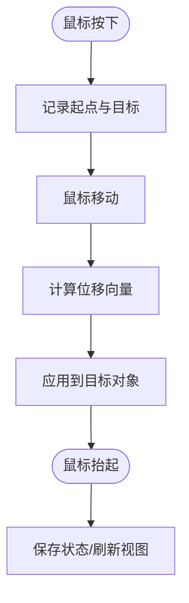

图表来源
- [Apps/CesiumViewer/CesiumViewer.js](file://Apps/CesiumViewer/CesiumViewer.js)

章节来源
- [Apps/CesiumViewer/CesiumViewer.js](file://Apps/CesiumViewer/CesiumViewer.js)

### 缩放与平移
- 目标
  - 利用内置相机控制器实现缩放和平移，必要时限制范围或灵敏度。
- 关键步骤
  - 通过 Viewer 的相机控制器配置缩放速率、阻尼等参数。
  - 在需要时禁用某些手势以避免冲突（例如在测量过程中）。
- 参考实现
  - 参考最小示例与 CesiumViewer 初始化方式。
  - 参考路径：[Apps/HelloWorld.html](file://Apps/HelloWorld.html)、[Apps/CesiumViewer/CesiumViewer.js](file://Apps/CesiumViewer/CesiumViewer.js)
- 流程图

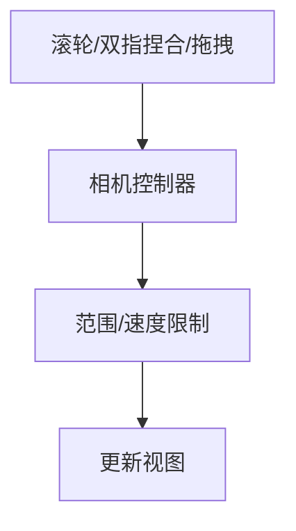

图表来源
- [Apps/HelloWorld.html](file://Apps/HelloWorld.html)
- [Apps/CesiumViewer/CesiumViewer.js](file://Apps/CesiumViewer/CesiumViewer.js)

章节来源
- [Apps/HelloWorld.html](file://Apps/HelloWorld.html)
- [Apps/CesiumViewer/CesiumViewer.js](file://Apps/CesiumViewer/CesiumViewer.js)

### 键盘快捷键
- 目标
  - 绑定常用快捷键（如切换模式、重置视图、清空标注）。
- 关键步骤
  - 在 document 或特定容器上监听 keydown 事件。
  - 根据键码与修饰键组合执行对应动作。
  - 注意焦点管理与事件冒泡，避免与输入框冲突。
- 参考实现
  - 可在 CesiumViewer.js 中集中管理快捷键逻辑。
  - 参考路径：[Apps/CesiumViewer/CesiumViewer.js](file://Apps/CesiumViewer/CesiumViewer.js)
- 流程图

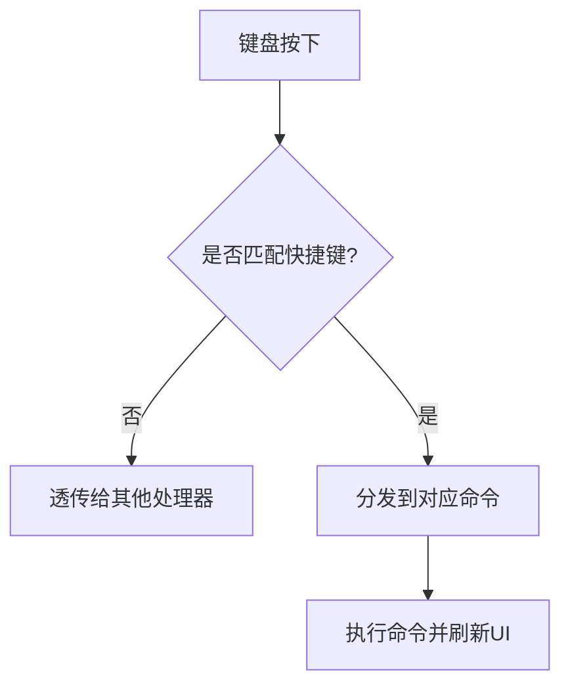

图表来源
- [Apps/CesiumViewer/CesiumViewer.js](file://Apps/CesiumViewer/CesiumViewer.js)

章节来源
- [Apps/CesiumViewer/CesiumViewer.js](file://Apps/CesiumViewer/CesiumViewer.js)

### 测量工具（距离、面积、高度）
- 目标
  - 提供距离、面积、高度三种测量能力，并在地图上可视化结果。
- 关键步骤
  - 距离：两点拾取后计算空间距离，绘制线段与标签。
  - 面积：多点拾取构建多边形，计算投影或球面面积。
  - 高度：选择两点或点与地面，计算垂直高差。
  - 交互：点击添加点、双击结束、右键取消、ESC 退出。
- 参考实现
  - 复用拾取与拖拽逻辑，在 CesiumViewer.js 中扩展测量状态机。
  - 参考路径：[Apps/CesiumViewer/CesiumViewer.js](file://Apps/CesiumViewer/CesiumViewer.js)
- 流程图（以距离为例）

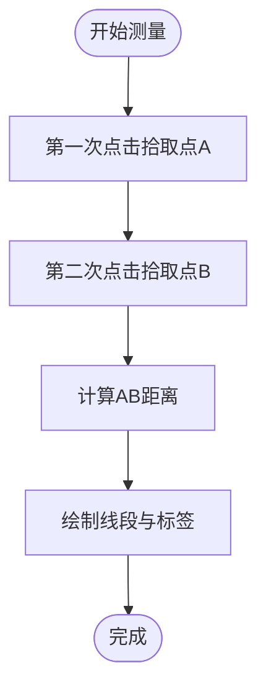

图表来源
- [Apps/CesiumViewer/CesiumViewer.js](file://Apps/CesiumViewer/CesiumViewer.js)

章节来源
- [Apps/CesiumViewer/CesiumViewer.js](file://Apps/CesiumViewer/CesiumViewer.js)

### 标注系统
- 目标
  - 在指定位置添加文本/图标标注，支持拖拽移动、样式定制与批量管理。
- 关键步骤
  - 使用实体或图形对象创建标注。
  - 绑定拖拽事件更新标注位置。
  - 提供列表面板进行增删改查。
- 参考实现
  - 在 CesiumViewer.js 中维护标注集合与状态。
  - 参考路径：[Apps/CesiumViewer/CesiumViewer.js](file://Apps/CesiumViewer/CesiumViewer.js)
- 类关系图

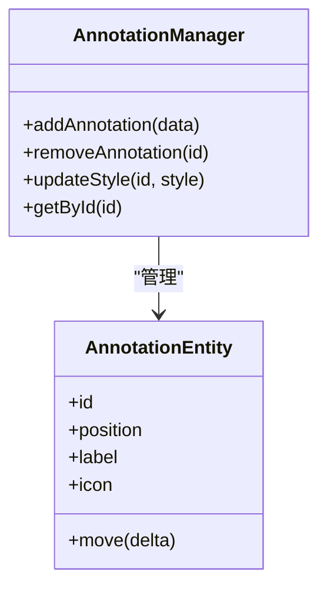

图表来源
- [Apps/CesiumViewer/CesiumViewer.js](file://Apps/CesiumViewer/CesiumViewer.js)

章节来源
- [Apps/CesiumViewer/CesiumViewer.js](file://Apps/CesiumViewer/CesiumViewer.js)

### 信息弹窗
- 目标
  - 在点击或悬停时展示详细信息卡片，支持关闭与跳转。
- 关键步骤
  - 监听点击事件，获取命中对象属性。
  - 动态渲染 HTML 模板并定位到合适位置。
  - 处理遮罩与层级，避免遮挡地图交互。
- 参考实现
  - 在 CesiumViewer.js 中封装弹窗组件与生命周期。
  - 参考路径：[Apps/CesiumViewer/CesiumViewer.js](file://Apps/CesiumViewer/CesiumViewer.js)
- 流程图

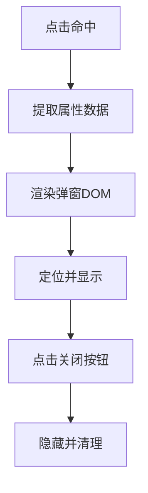

图表来源
- [Apps/CesiumViewer/CesiumViewer.js](file://Apps/CesiumViewer/CesiumViewer.js)

章节来源
- [Apps/CesiumViewer/CesiumViewer.js](file://Apps/CesiumViewer/CesiumViewer.js)

### 右键菜单
- 目标
  - 在右键点击处弹出上下文菜单，提供复制坐标、添加到测量、删除标注等操作。
- 关键步骤
  - 阻止默认右键菜单，捕获坐标与命中对象。
  - 动态生成菜单项并根据上下文启用/禁用。
  - 点击菜单项后执行对应命令并关闭菜单。
- 参考实现
  - 在 CesiumViewer.js 中统一处理右键事件与菜单渲染。
  - 参考路径：[Apps/CesiumViewer/CesiumViewer.js](file://Apps/CesiumViewer/CesiumViewer.js)
- 流程图

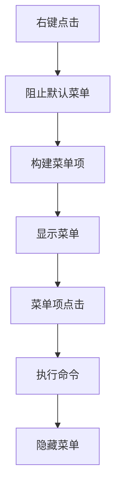

图表来源
- [Apps/CesiumViewer/CesiumViewer.js](file://Apps/CesiumViewer/CesiumViewer.js)

章节来源
- [Apps/CesiumViewer/CesiumViewer.js](file://Apps/CesiumViewer/CesiumViewer.js)

### 自定义控件开发指南
- 目标
  - 开发可复用的 UI 控件（如工具栏、图层面板、测量面板），并与地图交互联动。
- 技术要点
  - UI 布局：使用 Flex/Grid 布局，保证在不同分辨率下的自适应。
  - 样式定制：通过 CSS 变量或主题类名统一管理配色与尺寸。
  - 事件绑定：将 DOM 事件与地图事件解耦，采用发布订阅或命令模式。
  - 生命周期：初始化、挂载、卸载、销毁资源。
- 参考实现
  - 在 CesiumViewer.js 中组织控件模块，并通过入口 HTML 引入。
  - 参考路径：[Apps/CesiumViewer/index.html](file://Apps/CesiumViewer/index.html)、[Apps/CesiumViewer/CesiumViewer.js](file://Apps/CesiumViewer/CesiumViewer.js)
- 流程图

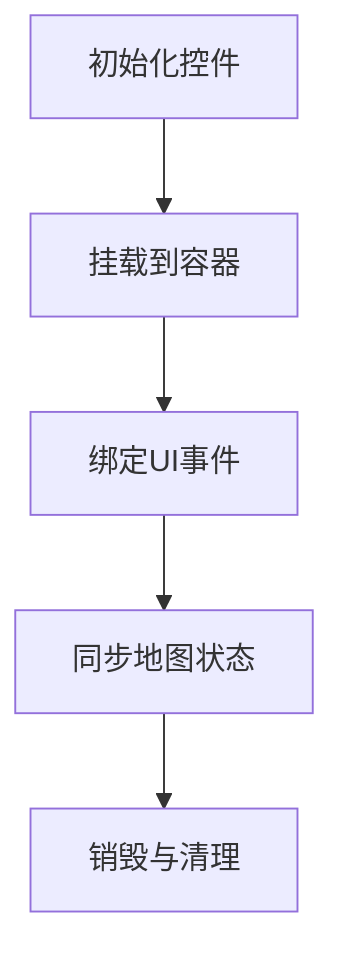

图表来源
- [Apps/CesiumViewer/index.html](file://Apps/CesiumViewer/index.html)
- [Apps/CesiumViewer/CesiumViewer.js](file://Apps/CesiumViewer/CesiumViewer.js)

章节来源
- [Apps/CesiumViewer/index.html](file://Apps/CesiumViewer/index.html)
- [Apps/CesiumViewer/CesiumViewer.js](file://Apps/CesiumViewer/CesiumViewer.js)

### 移动端触摸操作适配与响应式设计
- 目标
  - 在移动端提供良好的触摸体验，避免误触与卡顿。
- 关键步骤
  - 设置合适的 viewport 与 meta 标签。
  - 调整相机控制器灵敏度与手势冲突。
  - 简化 UI，优先大按钮与清晰反馈。
- 参考实现
  - 遵循移动端指南的建议，结合 HelloWorld 与 CesiumViewer 的配置。
  - 参考路径：[Apps/HelloWorld.html](file://Apps/HelloWorld.html)、[Apps/CesiumViewer/index.html](file://Apps/CesiumViewer/index.html)、[Documentation/Contributors/MobileGuide/README.md](file://Documentation/Contributors/MobileGuide/README.md)
- 流程图

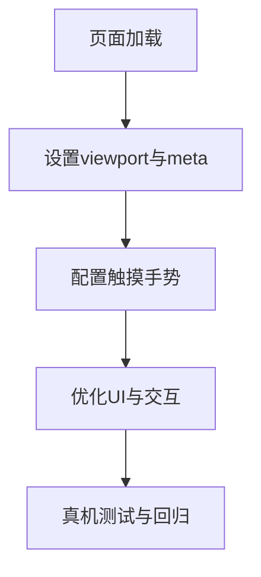

图表来源
- [Apps/HelloWorld.html](file://Apps/HelloWorld.html)
- [Apps/CesiumViewer/index.html](file://Apps/CesiumViewer/index.html)
- [Documentation/Contributors/MobileGuide/README.md](file://Documentation/Contributors/MobileGuide/README.md)

章节来源
- [Apps/HelloWorld.html](file://Apps/HelloWorld.html)
- [Apps/CesiumViewer/index.html](file://Apps/CesiumViewer/index.html)
- [Documentation/Contributors/MobileGuide/README.md](file://Documentation/Contributors/MobileGuide/README.md)

## 依赖分析
- 页面与脚本
  - index.html 作为 CesiumViewer 的入口，负责引入脚本与初始化。
  - CesiumViewer.js 承载主要交互逻辑与控件集成。
- 测试与事件模拟
  - picking.spec.js 验证拾取行为，DomEventSimulator.js 提供事件模拟能力。
- 移动端指南
  - MobileGuide 提供最佳实践与注意事项。

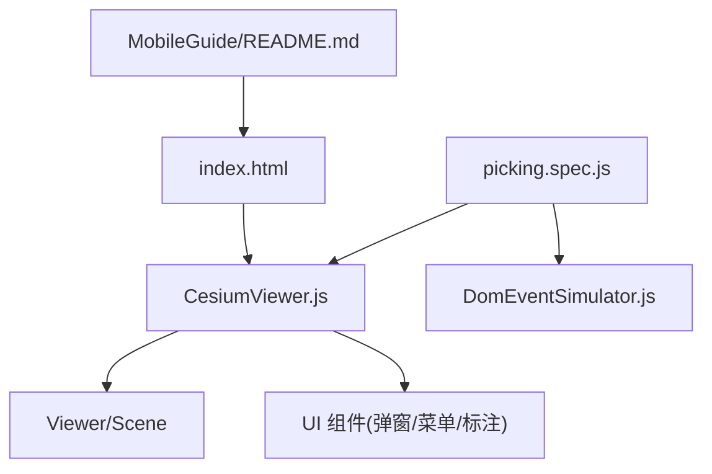

图表来源
- [Apps/CesiumViewer/index.html](file://Apps/CesiumViewer/index.html)
- [Apps/CesiumViewer/CesiumViewer.js](file://Apps/CesiumViewer/CesiumViewer.js)
- [Specs/e2e/picking.spec.js](file://Specs/e2e/picking.spec.js)
- [Specs/e2e/DomEventSimulator.js](file://Specs/e2e/DomEventSimulator.js)
- [Documentation/Contributors/MobileGuide/README.md](file://Documentation/Contributors/MobileGuide/README.md)

章节来源
- [Apps/CesiumViewer/index.html](file://Apps/CesiumViewer/index.html)
- [Apps/CesiumViewer/CesiumViewer.js](file://Apps/CesiumViewer/CesiumViewer.js)
- [Specs/e2e/picking.spec.js](file://Specs/e2e/picking.spec.js)
- [Specs/e2e/DomEventSimulator.js](file://Specs/e2e/DomEventSimulator.js)
- [Documentation/Contributors/MobileGuide/README.md](file://Documentation/Contributors/MobileGuide/README.md)

## 性能考虑
- 减少频繁重绘：合并多次位置更新，使用节流/防抖策略。
- 合理使用几何体与材质：避免过多透明叠加与复杂着色器。
- 控制标注数量：分页或按需加载，及时销毁不可见对象。
- 事件处理优化：仅在必要区域监听事件，避免全局高频回调。
- 移动端优化：降低帧率上限、简化动画、减少内存占用。

## 故障排查指南
- 拾取无效
  - 检查命中对象是否存在、是否被遮挡或处于不可见状态。
  - 确认拾取过滤条件是否正确。
  - 参考路径：[Specs/e2e/picking.spec.js](file://Specs/e2e/picking.spec.js)
- 事件不触发
  - 确认事件绑定容器与冒泡路径。
  - 检查是否有其他处理器拦截或阻止默认行为。
  - 参考路径：[Specs/e2e/DomEventSimulator.js](file://Specs/e2e/DomEventSimulator.js)
- 移动端异常
  - 核对 viewport 与 meta 设置。
  - 调整相机控制器灵敏度与手势冲突。
  - 参考路径：[Documentation/Contributors/MobileGuide/README.md](file://Documentation/Contributors/MobileGuide/README.md)
- 视图与交互冲突
  - 在测量或编辑模式下临时禁用相机控制。
  - 参考路径：[Apps/CesiumViewer/CesiumViewer.js](file://Apps/CesiumViewer/CesiumViewer.js)

章节来源
- [Specs/e2e/picking.spec.js](file://Specs/e2e/picking.spec.js)
- [Specs/e2e/DomEventSimulator.js](file://Specs/e2e/DomEventSimulator.js)
- [Documentation/Contributors/MobileGuide/README.md](file://Documentation/Contributors/MobileGuide/README.md)
- [Apps/CesiumViewer/CesiumViewer.js](file://Apps/CesiumViewer/CesiumViewer.js)

## 结论
通过本示例集合，您可以从零开始搭建具备完整交互能力的三维地图应用。建议以最小示例为起点，逐步扩展测量、标注、弹窗与右键菜单等功能，并结合移动端指南进行适配与优化。所有示例均可在仓库中找到对应的源码路径与测试用例，便于快速复现与迭代。

## 附录
- 快速启动
  - 打开最小示例页面，观察基础交互效果。
  - 参考路径：[Apps/HelloWorld.html](file://Apps/HelloWorld.html)
- 扩展阅读
  - 查看端到端测试用例，理解交互断言与事件模拟方式。
  - 参考路径：[Specs/e2e/picking.spec.js](file://Specs/e2e/picking.spec.js)、[Specs/e2e/viewer.spec.js](file://Specs/e2e/viewer.spec.js)