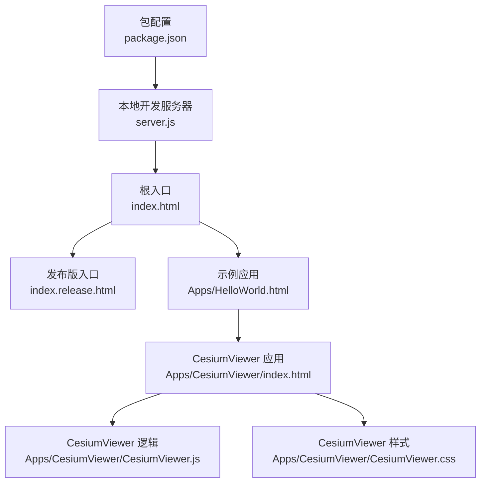
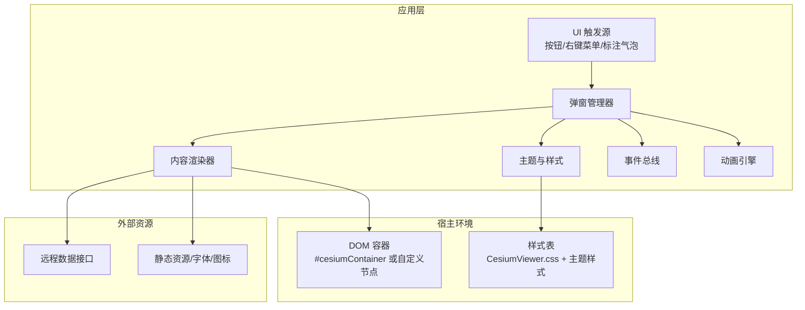
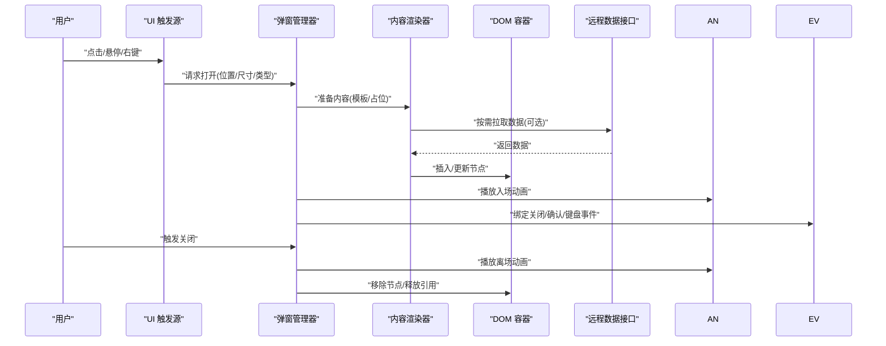
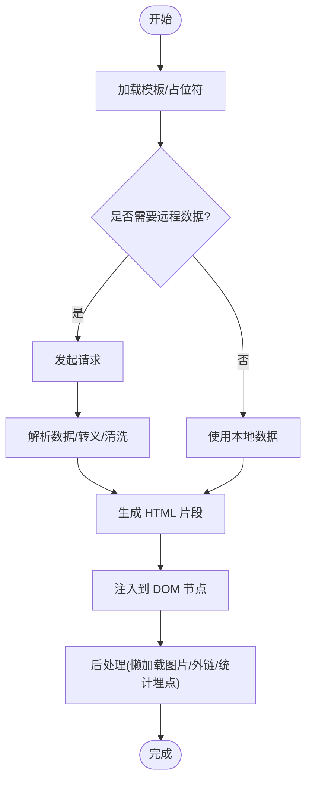
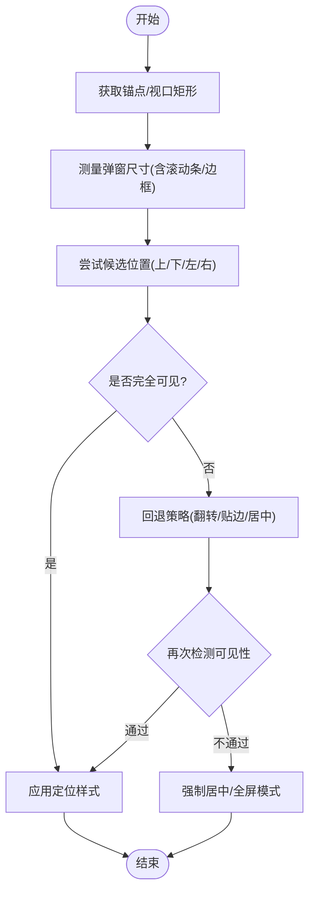
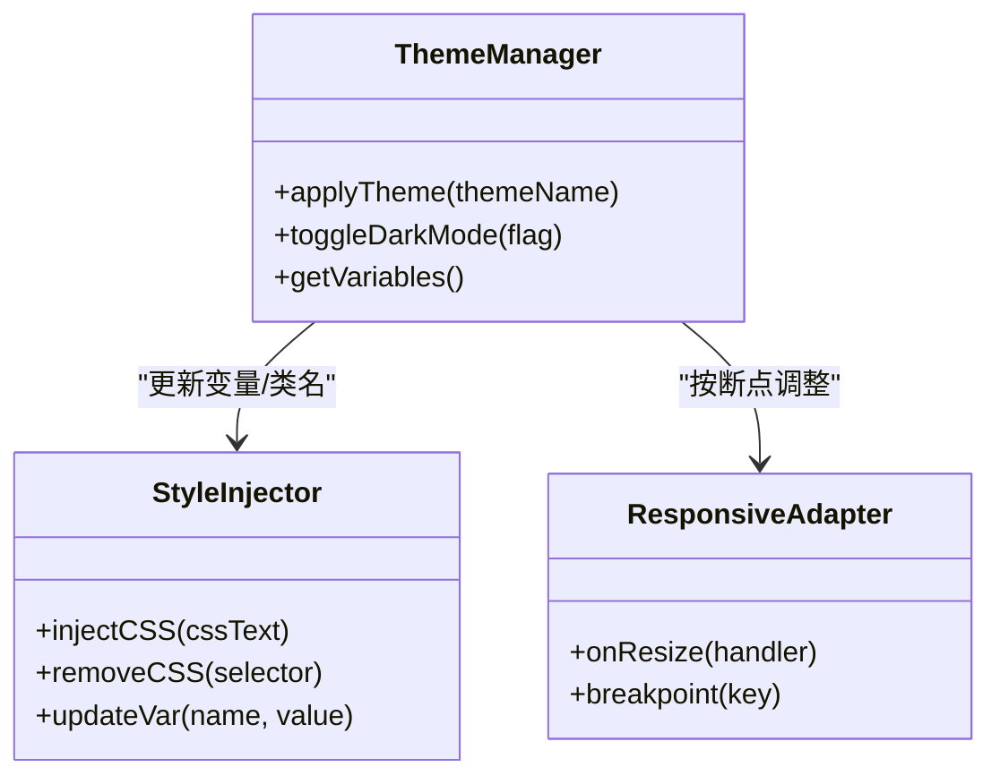
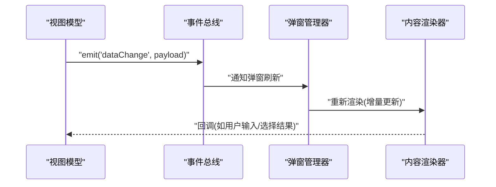
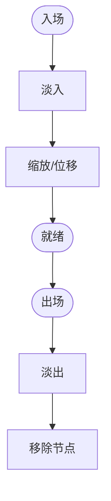
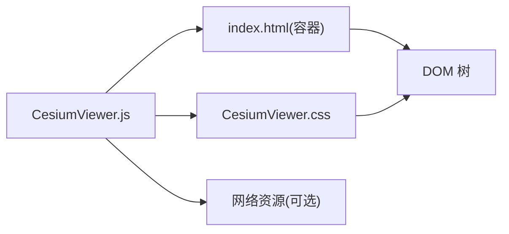

# 信息弹窗系统

<cite>
**本文引用的文件**   
- [CesiumViewer.js](file://Apps/CesiumViewer/CesiumViewer.js)
- [CesiumViewer.css](file://Apps/CesiumViewer/CesiumViewer.css)
- [index.html](file://Apps/CesiumViewer/index.html)
- [HelloWorld.html](file://Apps/HelloWorld.html)
- [index.html](file://index.html)
- [index.release.html](file://index.release.html)
- [server.js](file://server.js)
- [package.json](file://package.json)
</cite>

## 目录
1. [简介](#简介)
2. [项目结构](#项目结构)
3. [核心组件](#核心组件)
4. [架构总览](#架构总览)
5. [详细组件分析](#详细组件分析)
6. [依赖分析](#依赖分析)
7. [性能考虑](#性能考虑)
8. [故障排查指南](#故障排查指南)
9. [结论](#结论)
10. [附录](#附录)

## 简介
本文件面向“灵活的信息弹窗系统”的构建与集成，目标是在 Cesium 应用中实现：
- 基础弹窗的创建、定位、显示/隐藏
- 动态内容加载、HTML 渲染与富文本支持
- 样式定制、主题切换、响应式布局
- 事件处理、用户交互、数据绑定
- 动画与过渡效果、性能优化
- 国际化、无障碍访问、浏览器兼容性等工程化考量

由于当前仓库未包含现成的弹窗模块源码，本文将以应用层（Apps）中的示例页面为切入点，给出在 Cesium 工程中落地弹窗系统的方案与最佳实践，并提供可落地的流程图与架构图。

## 项目结构
与弹窗系统集成最相关的入口与应用示例位于 Apps 目录，以及根级 HTML 入口与服务脚本。

图表来源
- [index.html](file://index.html)
- [index.release.html](file://index.release.html)
- [HelloWorld.html](file://Apps/HelloWorld.html)
- [index.html](file://Apps/CesiumViewer/index.html)
- [CesiumViewer.js](file://Apps/CesiumViewer/CesiumViewer.js)
- [CesiumViewer.css](file://Apps/CesiumViewer/CesiumViewer.css)
- [server.js](file://server.js)
- [package.json](file://package.json)

章节来源
- [index.html](file://index.html)
- [index.release.html](file://index.release.html)
- [HelloWorld.html](file://Apps/HelloWorld.html)
- [index.html](file://Apps/CesiumViewer/index.html)
- [CesiumViewer.js](file://Apps/CesiumViewer/CesiumViewer.js)
- [CesiumViewer.css](file://Apps/CesiumViewer/CesiumViewer.css)
- [server.js](file://server.js)
- [package.json](file://package.json)

## 核心组件
围绕弹窗系统，建议拆分为以下应用层组件（概念性说明，便于在现有工程中扩展）：
- 弹窗管理器：负责弹窗实例的生命周期、层级管理、焦点与模态行为控制
- 内容渲染器：负责动态内容注入、HTML 安全过滤、富文本渲染
- 定位与适配：负责相对视口/锚点定位、响应式断点、移动端适配
- 主题与样式：提供主题变量、暗色模式、CSS 变量或类名切换
- 事件总线：统一注册/分发点击、关闭、键盘、滚动等事件
- 动画引擎：封装 CSS 过渡/关键帧或轻量动画库，提供进入/退出动效
- 国际化与无障碍：多语言文案、ARIA 属性、键盘导航、屏幕阅读器友好

上述组件可在 CesiumViewer.js 中作为模块引入并初始化，通过 index.html 挂载到 DOM。

章节来源
- [CesiumViewer.js](file://Apps/CesiumViewer/CesiumViewer.js)
- [CesiumViewer.css](file://Apps/CesiumViewer/CesiumViewer.css)
- [index.html](file://Apps/CesiumViewer/index.html)

## 架构总览
下图展示弹窗系统与 Cesium 视图、DOM 容器、资源加载器的协作关系。

图表来源
- [CesiumViewer.js](file://Apps/CesiumViewer/CesiumViewer.js)
- [CesiumViewer.css](file://Apps/CesiumViewer/CesiumViewer.css)
- [index.html](file://Apps/CesiumViewer/index.html)

## 详细组件分析

### 弹窗生命周期与交互流程
该流程覆盖从触发到销毁的关键步骤，包括定位、渲染、动画与事件绑定。

图表来源
- [CesiumViewer.js](file://Apps/CesiumViewer/CesiumViewer.js)
- [index.html](file://Apps/CesiumViewer/index.html)

章节来源
- [CesiumViewer.js](file://Apps/CesiumViewer/CesiumViewer.js)
- [index.html](file://Apps/CesiumViewer/index.html)

### 动态内容与富文本渲染流程
重点说明如何安全地注入 HTML、处理图片/链接、富文本解析与缓存策略。

图表来源
- [CesiumViewer.js](file://Apps/CesiumViewer/CesiumViewer.js)

章节来源
- [CesiumViewer.js](file://Apps/CesiumViewer/CesiumViewer.js)

### 定位与响应式布局决策
根据视口大小、锚点位置与弹窗尺寸计算最终坐标，避免溢出与遮挡。

图表来源
- [CesiumViewer.js](file://Apps/CesiumViewer/CesiumViewer.js)
- [CesiumViewer.css](file://Apps/CesiumViewer/CesiumViewer.css)

章节来源
- [CesiumViewer.js](file://Apps/CesiumViewer/CesiumViewer.js)
- [CesiumViewer.css](file://Apps/CesiumViewer/CesiumViewer.css)

### 主题与样式定制
通过 CSS 变量与类名切换实现主题化，结合媒体查询实现响应式。

图表来源
- [CesiumViewer.css](file://Apps/CesiumViewer/CesiumViewer.css)
- [CesiumViewer.js](file://Apps/CesiumViewer/CesiumViewer.js)

章节来源
- [CesiumViewer.css](file://Apps/CesiumViewer/CesiumViewer.css)
- [CesiumViewer.js](file://Apps/CesiumViewer/CesiumViewer.js)

### 事件处理与数据绑定
统一的事件总线与数据驱动更新，确保弹窗状态与业务数据同步。

图表来源
- [CesiumViewer.js](file://Apps/CesiumViewer/CesiumViewer.js)

章节来源
- [CesiumViewer.js](file://Apps/CesiumViewer/CesiumViewer.js)

### 动画与过渡效果
以 CSS 过渡/关键帧为主，必要时引入轻量动画库，保证低端设备流畅度。

图表来源
- [CesiumViewer.css](file://Apps/CesiumViewer/CesiumViewer.css)
- [CesiumViewer.js](file://Apps/CesiumViewer/CesiumViewer.js)

章节来源
- [CesiumViewer.css](file://Apps/CesiumViewer/CesiumViewer.css)
- [CesiumViewer.js](file://Apps/CesiumViewer/CesiumViewer.js)

### 国际化与无障碍
- 国际化：集中文案字典，运行时切换语言；对动态内容做格式化与复数规则处理
- 无障碍：设置 role、aria-* 属性；支持 Tab 导航、Esc 关闭、焦点陷阱；对比度与可读性校验

章节来源
- [CesiumViewer.js](file://Apps/CesiumViewer/CesiumViewer.js)
- [CesiumViewer.css](file://Apps/CesiumViewer/CesiumViewer.css)

### 浏览器兼容性与降级
- 特性检测：IntersectionObserver、ResizeObserver、requestAnimationFrame
- 降级策略：不支持时回退到简单显示/隐藏与固定定位
- 安全策略：XSS 防护、CSP 配合、外链白名单

章节来源
- [CesiumViewer.js](file://Apps/CesiumViewer/CesiumViewer.js)

## 依赖分析
弹窗系统主要依赖宿主 DOM、样式表与可能的网络资源。与 Cesium 的耦合应保持在 UI 层，避免侵入渲染循环。

图表来源
- [CesiumViewer.js](file://Apps/CesiumViewer/CesiumViewer.js)
- [CesiumViewer.css](file://Apps/CesiumViewer/CesiumViewer.css)
- [index.html](file://Apps/CesiumViewer/index.html)

章节来源
- [CesiumViewer.js](file://Apps/CesiumViewer/CesiumViewer.js)
- [CesiumViewer.css](file://Apps/CesiumViewer/CesiumViewer.css)
- [index.html](file://Apps/CesiumViewer/index.html)

## 性能考虑
- 延迟渲染：仅在需要时创建/填充 DOM，避免首屏阻塞
- 虚拟列表：长列表采用分页/虚拟化，减少节点数量
- 图片懒加载：可视区域再加载，降低带宽与内存占用
- 动画节流：使用 transform/opacity 提升合成效率，避免重排重绘
- 事件去抖/节流：频繁操作（滚动、拖拽）时合并事件
- 资源复用：模板与样式预编译，减少重复计算

[本节为通用指导，无需代码来源]

## 故障排查指南
- 弹窗被地图遮挡：检查 z-index 与容器层级，确保弹窗容器在地图之上
- 定位异常：打印锚点与视口矩形，验证边界检测与回退逻辑
- 内容不显示：检查网络请求、跨域策略、HTML 清洗规则
- 样式错乱：确认主题类名是否正确切换，CSS 变量是否生效
- 动画卡顿：禁用复杂滤镜，改用 GPU 加速属性
- 键盘不可用：确认焦点管理与 aria 属性是否完整

章节来源
- [CesiumViewer.js](file://Apps/CesiumViewer/CesiumViewer.js)
- [CesiumViewer.css](file://Apps/CesiumViewer/CesiumViewer.css)

## 结论
通过在应用层引入模块化弹窗组件，并与 Cesium 的 DOM 容器解耦，可以在不侵入核心渲染的前提下，获得高内聚、低耦合、可扩展的弹窗能力。结合主题化、响应式、动画与无障碍设计，可满足复杂业务场景下的用户体验需求。

[本节为总结性内容，无需代码来源]

## 附录
- 快速启动：参考根级入口与示例页面，将弹窗模块集成至 CesiumViewer.js，并在 index.html 中挂载容器
- 本地调试：使用 server.js 启动服务，观察控制台与网络面板，定位问题

章节来源
- [index.html](file://index.html)
- [HelloWorld.html](file://Apps/HelloWorld.html)
- [server.js](file://server.js)
- [package.json](file://package.json)