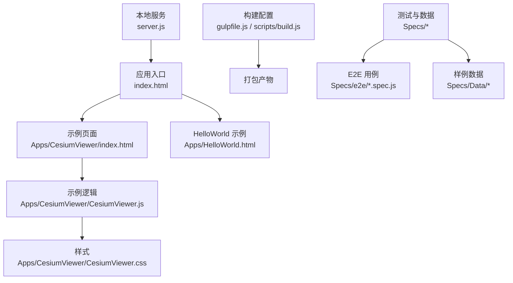
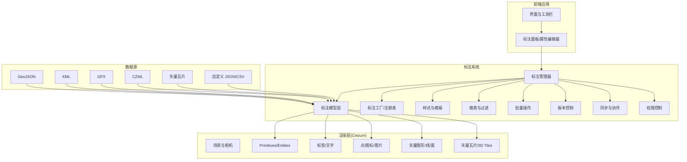
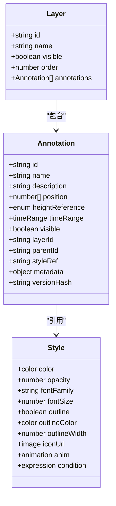
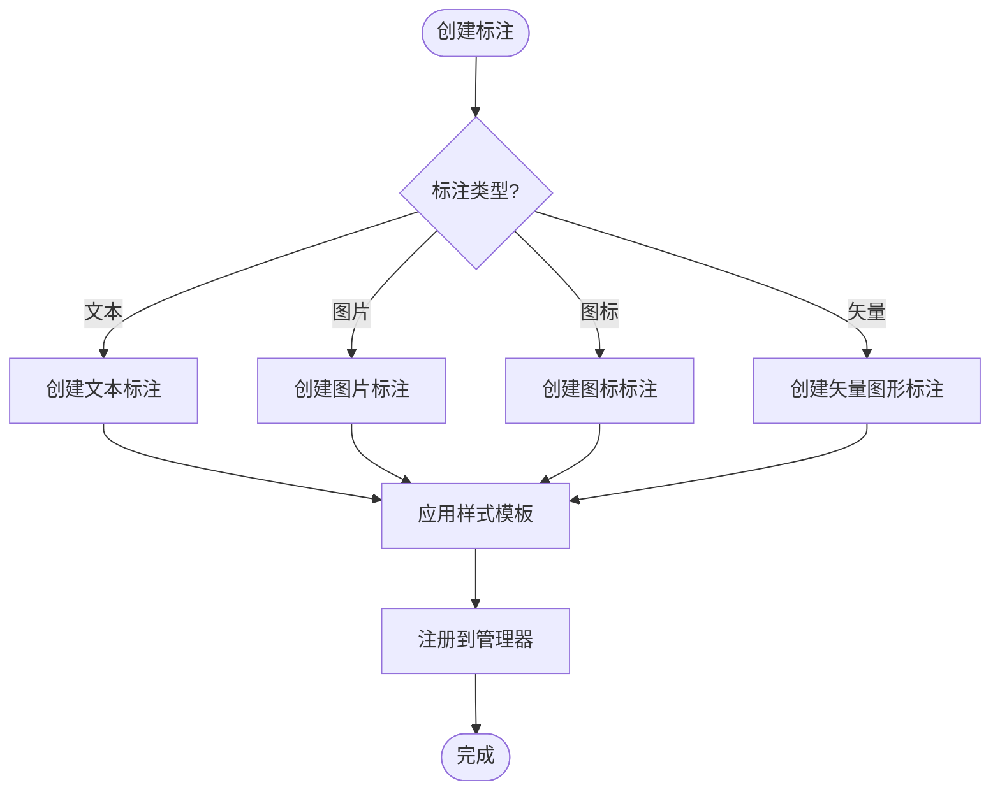
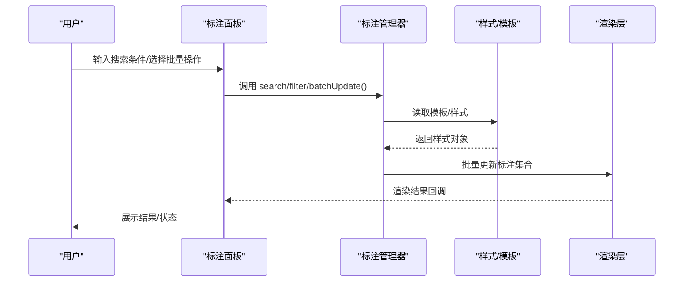
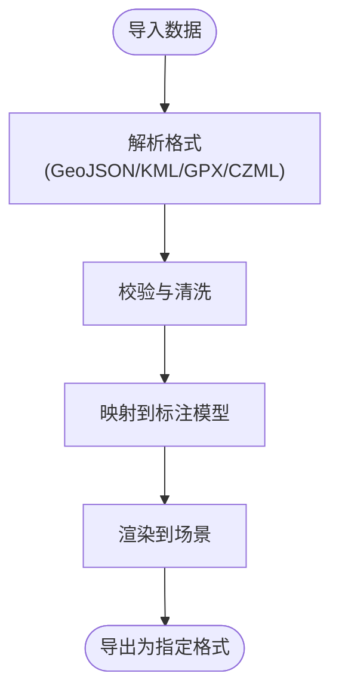
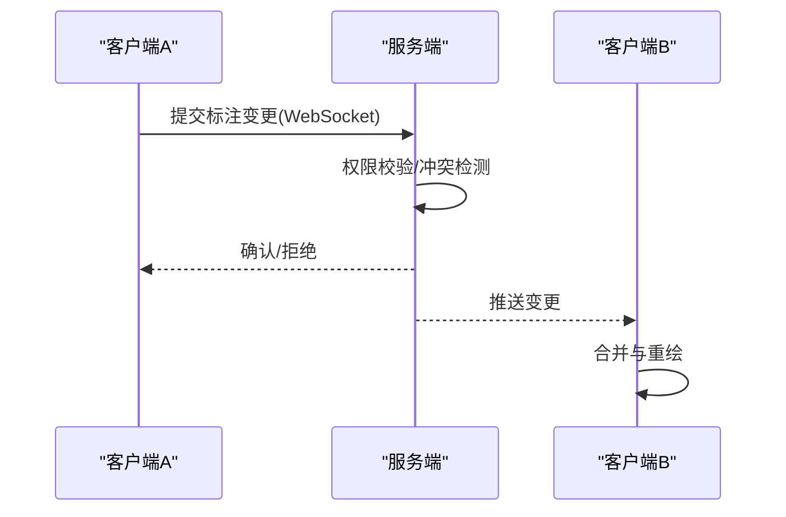
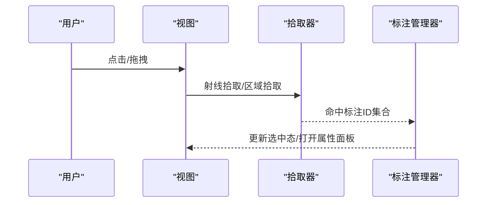
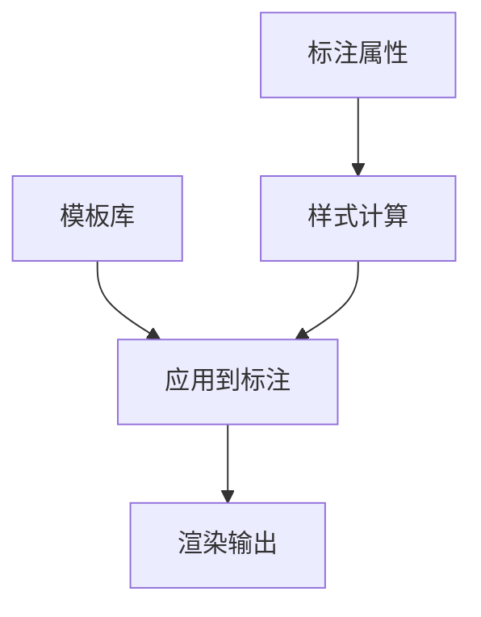
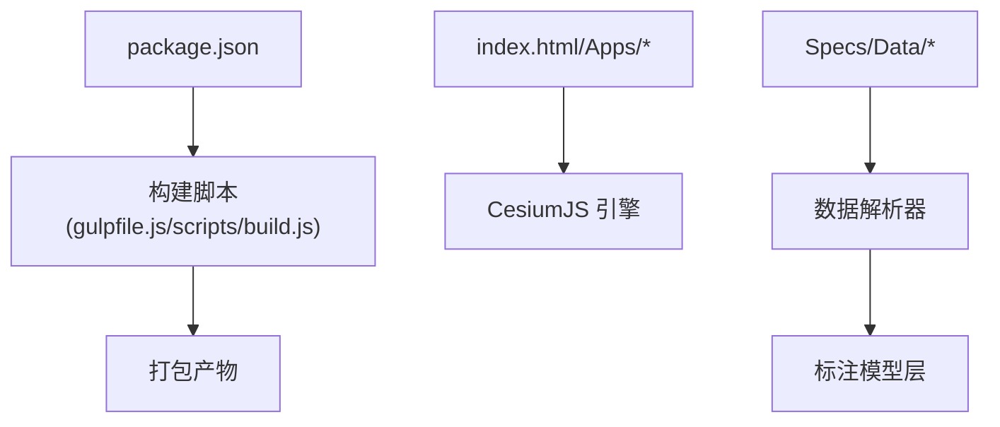

# 标注系统

<cite>
**本文引用的文件**   
- [README.md](file://README.md)
- [index.html](file://index.html)
- [Apps/CesiumViewer/index.html](file://Apps/CesiumViewer/index.html)
- [Apps/CesiumViewer/CesiumViewer.js](file://Apps/CesiumViewer/CesiumViewer.js)
- [Apps/CesiumViewer/CesiumViewer.css](file://Apps/CesiumViewer/CesiumViewer.css)
- [Apps/HelloWorld.html](file://Apps/HelloWorld.html)
- [package.json](file://package.json)
- [server.js](file://server.js)
- [gulpfile.js](file://gulpfile.js)
- [Scripts/build.js](file://scripts/build.js)
- [Specs/createScene.js](file://Specs/createScene.js)
- [Specs/createCamera.js](file://Specs/createCamera.js)
- [Specs/render.js](file://Specs/render.js)
- [Specs/pick.js](file://Specs/pick.js)
- [Specs/e2e/cesium.html](file://Specs/e2e/cesium.html)
- [Specs/e2e/viewer.spec.js](file://Specs/e2e/viewer.spec.js)
- [Specs/e2e/picking.spec.js](file://Specs/e2e/picking.spec.js)
- [Specs/Data/test.geojson](file://Specs/Data/test.geojson)
- [Specs/Data/simplestyles.geojson](file://Specs/Data/simplestyles.geojson)
- [Specs/Data/MarsPointsOfInterest.geojson](file://Specs/Data/MarsPointsOfInterest.geojson)
- [Specs/Data/KML/simple.kml](file://Specs/Data/KML/simple.kml)
- [Specs/Data/KML/networkLink.kml](file://Specs/Data/KML/networkLink.kml)
- [Specs/Data/GPX/simple.gpx](file://Specs/Data/GPX/simple.gpx)
- [Specs/Data/CZML/simple.czml](file://Specs/Data/CZML/simple.czml)
- [Specs/Data/CZML/Vehicle.czml](file://Specs/Data/CZML/Vehicle.czml)
- [Specs/Data/vector/sample-us-states.tileset.json](file://Specs/Data/vector/sample-us-states.tileset.json)
- [Specs/Data/Cesium3DTiles/Style/style.json](file://Specs/Data/Cesium3DTiles/Style/style.json)
</cite>

## 目录
1. [简介](#简介)
2. [项目结构](#项目结构)
3. [核心组件](#核心组件)
4. [架构总览](#架构总览)
5. [详细组件分析](#详细组件分析)
6. [依赖分析](#依赖分析)
7. [性能考虑](#性能考虑)
8. [故障排查指南](#故障排查指南)
9. [结论](#结论)
10. [附录](#附录)

## 简介
本文件面向“标注系统”的规划与实现，目标是在 CesiumJS 工程基础上构建一套功能完善的标注能力，覆盖文本、图片、图标、矢量图形等多种标注类型；提供创建、定位、样式定制、动态更新、层级管理、批量操作、搜索过滤、导入导出、模板管理、版本控制等企业级特性；并支持实时同步、协作编辑、权限控制等网络能力；同时给出性能优化、内存管理与渲染效率提升策略。

## 项目结构
仓库采用多包与示例分离的组织方式：
- 应用入口与示例页面位于 Apps 目录，包含基础 Hello World 与 CesiumViewer 示例。
- 测试与数据位于 Specs 目录，包含 E2E 用例、场景构造器、渲染辅助与大量样例数据（GeoJSON、KML、GPX、CZML、3D Tiles、矢量瓦片等）。
- 构建与打包脚本位于 scripts 与 gulpfile.js，配合 package.json 完成开发、构建与发布流程。
- server.js 提供本地开发服务器能力。

图表来源
- [index.html:1-200](file://index.html#L1-L200)
- [Apps/CesiumViewer/index.html:1-200](file://Apps/CesiumViewer/index.html#L1-L200)
- [Apps/CesiumViewer/CesiumViewer.js:1-200](file://Apps/CesiumViewer/CesiumViewer.js#L1-L200)
- [Apps/CesiumViewer/CesiumViewer.css:1-200](file://Apps/CesiumViewer/CesiumViewer.css#L1-L200)
- [Apps/HelloWorld.html:1-200](file://Apps/HelloWorld.html#L1-L200)
- [gulpfile.js:1-200](file://gulpfile.js#L1-L200)
- [scripts/build.js:1-200](file://scripts/build.js#L1-L200)
- [server.js:1-200](file://server.js#L1-L200)

章节来源
- [README.md:1-200](file://README.md#L1-L200)
- [package.json:1-200](file://package.json#L1-L200)
- [index.html:1-200](file://index.html#L1-L200)
- [Apps/CesiumViewer/index.html:1-200](file://Apps/CesiumViewer/index.html#L1-L200)
- [Apps/CesiumViewer/CesiumViewer.js:1-200](file://Apps/CesiumViewer/CesiumViewer.js#L1-L200)
- [Apps/CesiumViewer/CesiumViewer.css:1-200](file://Apps/CesiumViewer/CesiumViewer.css#L1-L200)
- [Apps/HelloWorld.html:1-200](file://Apps/HelloWorld.html#L1-L200)
- [gulpfile.js:1-200](file://gulpfile.js#L1-L200)
- [scripts/build.js:1-200](file://scripts/build.js#L1-L200)
- [server.js:1-200](file://server.js#L1-L200)

## 核心组件
围绕标注系统，建议将能力拆分为以下核心模块（概念性设计）：
- 标注模型层：定义标注实体、属性、样式、时间轴、层级关系、元数据与版本信息。
- 标注工厂与注册表：统一创建文本、图片、图标、矢量图形等标注实例，并提供类型扩展点。
- 标注管理器：负责生命周期、批量操作、搜索过滤、排序与可见性控制。
- 渲染管线：基于 Cesium 的 Primitive/Entity/Label/PointPrimitiveCollection/VectorTile 等能力进行高效绘制。
- 交互与拾取：鼠标/触摸事件、点击选择、拖拽移动、框选、右键菜单。
- 数据与模板：导入导出（GeoJSON、KML、GPX、CZML、自定义 JSON）、模板库、样式主题。
- 网络与协作：WebSocket/HTTP 同步、冲突解决、权限控制、审计日志。
- 工具与调试：性能监控、内存统计、热力图、回放与快照。

说明：以上为系统设计层面的组件划分，用于指导后续在 Cesium 工程中的落地与集成。

## 架构总览
标注系统整体架构由“数据—模型—渲染—交互—网络”五层构成，依托 Cesium 提供的地理可视化能力，向上暴露统一的标注 API。

图表来源
- [Specs/createScene.js:1-200](file://Specs/createScene.js#L1-L200)
- [Specs/createCamera.js:1-200](file://Specs/createCamera.js#L1-L200)
- [Specs/render.js:1-200](file://Specs/render.js#L1-L200)
- [Specs/pick.js:1-200](file://Specs/pick.js#L1-L200)
- [Specs/e2e/cesium.html:1-200](file://Specs/e2e/cesium.html#L1-L200)
- [Specs/e2e/viewer.spec.js:1-200](file://Specs/e2e/viewer.spec.js#L1-L200)
- [Specs/e2e/picking.spec.js:1-200](file://Specs/e2e/picking.spec.js#L1-L200)

## 详细组件分析

### 标注模型与数据结构
- 标注实体：包含唯一标识、名称、描述、坐标位置、高度模式、时间范围、可见性、层级 ID、父级 ID、标签、样式引用、元数据与版本哈希。
- 样式对象：颜色、透明度、字体、大小、描边、阴影、贴图、动画参数、条件表达式。
- 层级树：父子关系、分组、折叠/展开、批量显隐。
- 版本控制：变更摘要、时间戳、作者、合并策略。
- 元数据：业务字段、分类标签、来源、版权。

图表来源
- [Specs/Data/test.geojson:1-200](file://Specs/Data/test.geojson#L1-L200)
- [Specs/Data/simplestyles.geojson:1-200](file://Specs/Data/simplestyles.geojson#L1-L200)
- [Specs/Data/MarsPointsOfInterest.geojson:1-200](file://Specs/Data/MarsPointsOfInterest.geojson#L1-L200)
- [Specs/Data/CZML/simple.czml:1-200](file://Specs/Data/CZML/simple.czml#L1-L200)
- [Specs/Data/CZML/Vehicle.czml:1-200](file://Specs/Data/CZML/Vehicle.czml#L1-L200)

章节来源
- [Specs/Data/test.geojson:1-200](file://Specs/Data/test.geojson#L1-L200)
- [Specs/Data/simplestyles.geojson:1-200](file://Specs/Data/simplestyles.geojson#L1-L200)
- [Specs/Data/MarsPointsOfInterest.geojson:1-200](file://Specs/Data/MarsPointsOfInterest.geojson#L1-L200)
- [Specs/Data/CZML/simple.czml:1-200](file://Specs/Data/CZML/simple.czml#L1-L200)
- [Specs/Data/CZML/Vehicle.czml:1-200](file://Specs/Data/CZML/Vehicle.czml#L1-L200)

### 标注工厂与类型注册
- 文本标注：基于 Label 或 HTML 叠加，支持富文本与换行。
- 图片标注：基于 Image 或 Sprite，支持缩放与锚点。
- 图标标注：基于 PointPrimitive 或 Entity，支持 SVG/PNG。
- 矢量图形标注：基于 Polyline、Polygon、Ellipse、Rectangle 等几何体。
- 注册表：按类型名映射到构造函数与默认样式，支持运行时扩展。

图表来源
- [Specs/createScene.js:1-200](file://Specs/createScene.js#L1-L200)
- [Specs/render.js:1-200](file://Specs/render.js#L1-L200)
- [Specs/pick.js:1-200](file://Specs/pick.js#L1-L200)

章节来源
- [Specs/createScene.js:1-200](file://Specs/createScene.js#L1-L200)
- [Specs/render.js:1-200](file://Specs/render.js#L1-L200)
- [Specs/pick.js:1-200](file://Specs/pick.js#L1-L200)

### 标注管理器与高级功能
- 层级管理：分组、父子关系、顺序调整、批量显隐。
- 批量操作：增删改查、复制粘贴、对齐分布、批量样式替换。
- 搜索过滤：关键字匹配、标签筛选、时间范围过滤、空间范围过滤。
- 版本控制：变更记录、回滚、分支与合并。
- 模板管理：样式模板、布局模板、快速创建。

图表来源
- [Specs/e2e/viewer.spec.js:1-200](file://Specs/e2e/viewer.spec.js#L1-L200)
- [Specs/e2e/picking.spec.js:1-200](file://Specs/e2e/picking.spec.js#L1-L200)
- [Specs/createScene.js:1-200](file://Specs/createScene.js#L1-L200)

章节来源
- [Specs/e2e/viewer.spec.js:1-200](file://Specs/e2e/viewer.spec.js#L1-L200)
- [Specs/e2e/picking.spec.js:1-200](file://Specs/e2e/picking.spec.js#L1-L200)
- [Specs/createScene.js:1-200](file://Specs/createScene.js#L1-L200)

### 导入导出与数据格式
- 导入：GeoJSON、KML、GPX、CZML、矢量瓦片、自定义 JSON/CSV。
- 导出：标注列表导出为 GeoJSON/KML/CZML/JSON，支持样式与元数据。
- 校验：坐标有效性、时间范围合法性、必填字段检查。
- 转换：WGS84 与投影坐标系互转、高程参考处理。

图表来源
- [Specs/Data/test.geojson:1-200](file://Specs/Data/test.geojson#L1-L200)
- [Specs/Data/simplestyles.geojson:1-200](file://Specs/Data/simplestyles.geojson#L1-L200)
- [Specs/Data/MarsPointsOfInterest.geojson:1-200](file://Specs/Data/MarsPointsOfInterest.geojson#L1-L200)
- [Specs/Data/KML/simple.kml:1-200](file://Specs/Data/KML/simple.kml#L1-L200)
- [Specs/Data/KML/networkLink.kml:1-200](file://Specs/Data/KML/networkLink.kml#L1-L200)
- [Specs/Data/GPX/simple.gpx:1-200](file://Specs/Data/GPX/simple.gpx#L1-L200)
- [Specs/Data/CZML/simple.czml:1-200](file://Specs/Data/CZML/simple.czml#L1-L200)
- [Specs/Data/CZML/Vehicle.czml:1-200](file://Specs/Data/CZML/Vehicle.czml#L1-L200)
- [Specs/Data/vector/sample-us-states.tileset.json:1-200](file://Specs/Data/vector/sample-us-states.tileset.json#L1-L200)

章节来源
- [Specs/Data/test.geojson:1-200](file://Specs/Data/test.geojson#L1-L200)
- [Specs/Data/simplestyles.geojson:1-200](file://Specs/Data/simplestyles.geojson#L1-L200)
- [Specs/Data/MarsPointsOfInterest.geojson:1-200](file://Specs/Data/MarsPointsOfInterest.geojson#L1-L200)
- [Specs/Data/KML/simple.kml:1-200](file://Specs/Data/KML/simple.kml#L1-L200)
- [Specs/Data/KML/networkLink.kml:1-200](file://Specs/Data/KML/networkLink.kml#L1-L200)
- [Specs/Data/GPX/simple.gpx:1-200](file://Specs/Data/GPX/simple.gpx#L1-L200)
- [Specs/Data/CZML/simple.czml:1-200](file://Specs/Data/CZML/simple.czml#L1-L200)
- [Specs/Data/CZML/Vehicle.czml:1-200](file://Specs/Data/CZML/Vehicle.czml#L1-L200)
- [Specs/Data/vector/sample-us-states.tileset.json:1-200](file://Specs/Data/vector/sample-us-states.tileset.json#L1-L200)

### 网络功能：实时同步、协作编辑、权限控制
- 实时同步：基于 WebSocket 推送标注变更，客户端增量合并。
- 协作编辑：多人在线编辑，冲突检测与自动/手动合并。
- 权限控制：角色与资源访问矩阵，读写锁与操作审计。
- 离线缓存：PWA 缓存、断网续传、差异上传。

图表来源
- [Specs/e2e/viewer.spec.js:1-200](file://Specs/e2e/viewer.spec.js#L1-L200)
- [Specs/e2e/picking.spec.js:1-200](file://Specs/e2e/picking.spec.js#L1-L200)

章节来源
- [Specs/e2e/viewer.spec.js:1-200](file://Specs/e2e/viewer.spec.js#L1-L200)
- [Specs/e2e/picking.spec.js:1-200](file://Specs/e2e/picking.spec.js#L1-L200)

### 交互与拾取
- 拾取：鼠标/触摸点击、悬停高亮、框选多选。
- 编辑：拖拽移动、旋转缩放、属性面板联动。
- 反馈：选中态、路径预览、吸附与约束。

图表来源
- [Specs/pick.js:1-200](file://Specs/pick.js#L1-L200)
- [Specs/e2e/picking.spec.js:1-200](file://Specs/e2e/picking.spec.js#L1-L200)

章节来源
- [Specs/pick.js:1-200](file://Specs/pick.js#L1-L200)
- [Specs/e2e/picking.spec.js:1-200](file://Specs/e2e/picking.spec.js#L1-L200)

### 样式与模板
- 样式体系：颜色、透明度、字体、描边、阴影、贴图、动画、条件表达式。
- 模板管理：预置样式、主题切换、按条件动态应用。
- 样式驱动：基于属性值计算样式（如数值分级着色）。

图表来源
- [Specs/Data/simplestyles.geojson:1-200](file://Specs/Data/simplestyles.geojson#L1-L200)
- [Specs/Data/Cesium3DTiles/Style/style.json:1-200](file://Specs/Data/Cesium3DTiles/Style/style.json#L1-L200)

章节来源
- [Specs/Data/simplestyles.geojson:1-200](file://Specs/Data/simplestyles.geojson#L1-L200)
- [Specs/Data/Cesium3DTiles/Style/style.json:1-200](file://Specs/Data/Cesium3DTiles/Style/style.json#L1-L200)

## 依赖分析
- 运行依赖：浏览器 WebGL、CesiumJS 引擎、可选第三方库（如地图服务、字体、图标集）。
- 构建依赖：Gulp、Rollup/Babel、ESLint、JSDoc、Playwright（E2E）。
- 数据依赖：GeoJSON、KML、GPX、CZML、矢量瓦片、3D Tiles。

图表来源
- [package.json:1-200](file://package.json#L1-L200)
- [gulpfile.js:1-200](file://gulpfile.js#L1-L200)
- [scripts/build.js:1-200](file://scripts/build.js#L1-L200)
- [index.html:1-200](file://index.html#L1-L200)
- [Apps/CesiumViewer/index.html:1-200](file://Apps/CesiumViewer/index.html#L1-L200)

章节来源
- [package.json:1-200](file://package.json#L1-L200)
- [gulpfile.js:1-200](file://gulpfile.js#L1-L200)
- [scripts/build.js:1-200](file://scripts/build.js#L1-L200)
- [index.html:1-200](file://index.html#L1-L200)
- [Apps/CesiumViewer/index.html:1-200](file://Apps/CesiumViewer/index.html#L1-L200)

## 性能考虑
- 渲染优化：
  - 使用批量 Primitive 与共享材质减少 draw call。
  - 按需加载与视锥剔除，结合 LOD 与距离阈值。
  - 矢量瓦片与 3D Tiles 分层加载，避免一次性载入。
- 内存管理：
  - 及时释放不再使用的纹理、几何体与事件监听。
  - 对象池复用标注实例与临时缓冲区。
- 计算优化：
  - 样式计算与过滤在 Web Worker 中执行。
  - 增量更新与脏标记机制，避免全量重绘。
- 网络优化：
  - 差分同步与压缩传输，断点续传与重试。
  - 边缘缓存与 CDN 分发静态资源。

[本节为通用性能建议，不直接分析具体文件]

## 故障排查指南
- 常见问题：
  - 标注不显示：检查坐标与高度参考、样式可见性、图层顺序。
  - 拾取失败：确认拾取器启用、碰撞体设置、事件绑定。
  - 导入失败：校验数据格式、必填字段、坐标系一致性。
  - 同步异常：检查权限、冲突策略、网络连通性与重试。
- 调试手段：
  - 使用 E2E 用例模拟交互与渲染流程。
  - 通过控制台日志与性能面板定位瓶颈。
  - 对关键数据进行最小化复现与回归测试。

章节来源
- [Specs/e2e/cesium.html:1-200](file://Specs/e2e/cesium.html#L1-L200)
- [Specs/e2e/viewer.spec.js:1-200](file://Specs/e2e/viewer.spec.js#L1-L200)
- [Specs/e2e/picking.spec.js:1-200](file://Specs/e2e/picking.spec.js#L1-L200)
- [Specs/createScene.js:1-200](file://Specs/createScene.js#L1-L200)
- [Specs/createCamera.js:1-200](file://Specs/createCamera.js#L1-L200)
- [Specs/render.js:1-200](file://Specs/render.js#L1-L200)
- [Specs/pick.js:1-200](file://Specs/pick.js#L1-L200)

## 结论
通过在 CesiumJS 工程上构建标注系统，可实现从数据到渲染的全链路能力，满足企业级标注需求。建议在实施过程中优先完善模型与工厂、管理器与渲染管线，再逐步扩展网络协作与权限控制，并以性能与可维护性为导向持续优化。

## 附录
- 快速开始：
  - 启动本地服务：参考 server.js 与 package.json 脚本。
  - 运行示例：打开 index.html 或 Apps/CesiumViewer/index.html。
  - 运行测试：使用 Specs 下的 e2e 用例验证交互与渲染。
- 参考数据：
  - GeoJSON、KML、GPX、CZML、矢量瓦片与 3D Tiles 样例均在 Specs/Data 下，便于快速集成与验证。

章节来源
- [server.js:1-200](file://server.js#L1-L200)
- [package.json:1-200](file://package.json#L1-L200)
- [index.html:1-200](file://index.html#L1-L200)
- [Apps/CesiumViewer/index.html:1-200](file://Apps/CesiumViewer/index.html#L1-L200)
- [Specs/e2e/cesium.html:1-200](file://Specs/e2e/cesium.html#L1-L200)
- [Specs/e2e/viewer.spec.js:1-200](file://Specs/e2e/viewer.spec.js#L1-L200)
- [Specs/e2e/picking.spec.js:1-200](file://Specs/e2e/picking.spec.js#L1-L200)