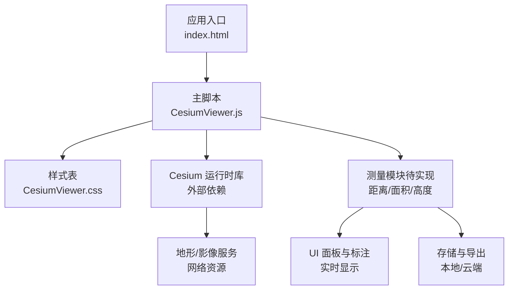
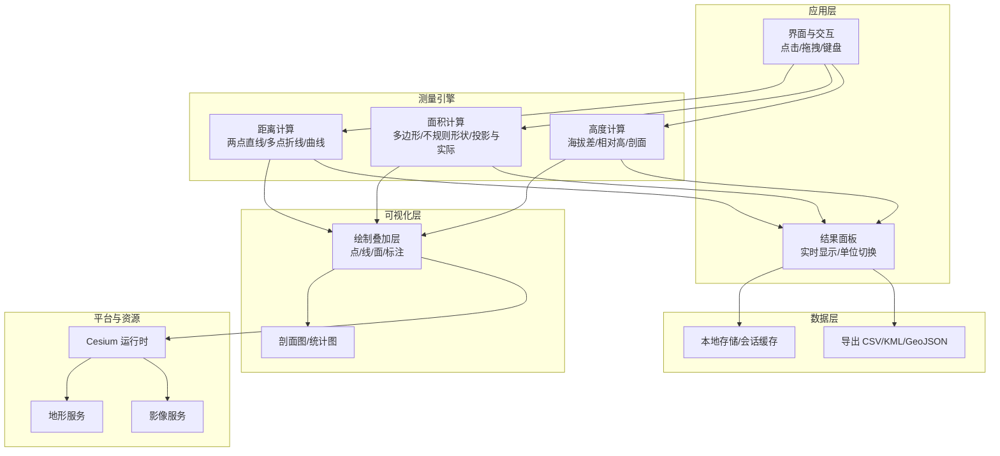
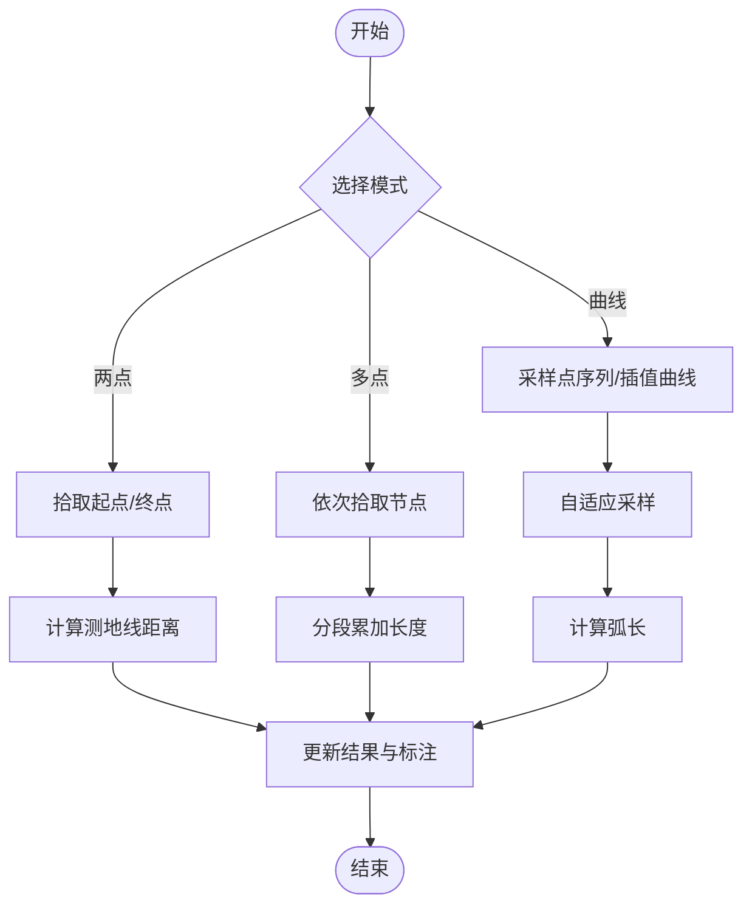
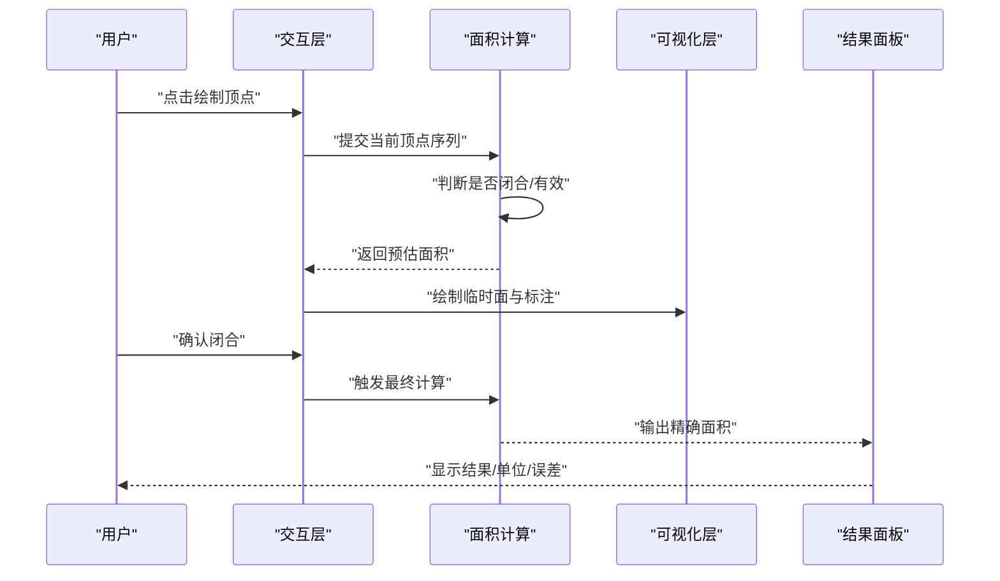
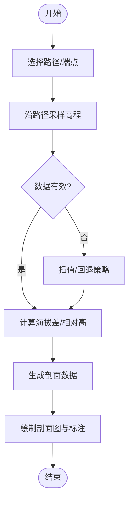
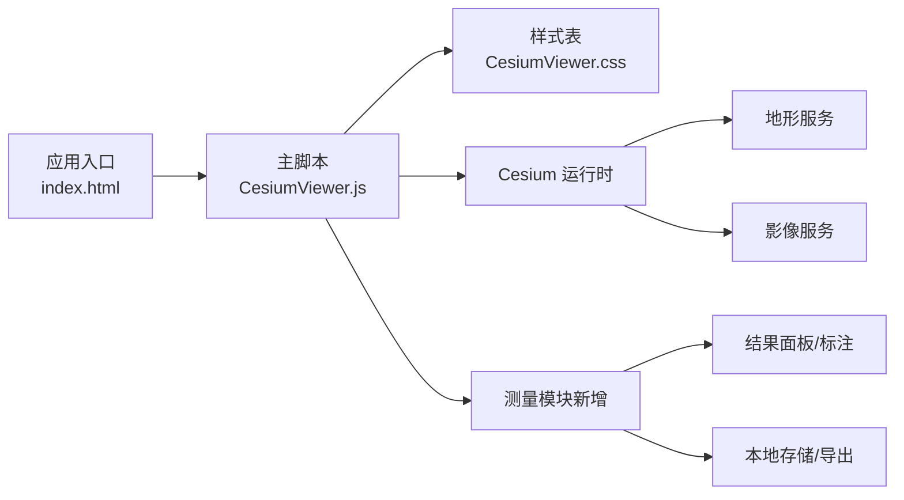

# 测量工具集

<cite>
**本文引用的文件**   
- [CesiumViewer.js](file://Apps/CesiumViewer/CesiumViewer.js)
- [index.html](file://Apps/CesiumViewer/index.html)
- [CesiumViewer.css](file://Apps/CesiumViewer/CesiumViewer.css)
- [README.md](file://README.md)
- [package.json](file://package.json)
</cite>

## 目录
1. [简介](#简介)
2. [项目结构](#项目结构)
3. [核心组件](#核心组件)
4. [架构总览](#架构总览)
5. [详细组件分析](#详细组件分析)
6. [依赖关系分析](#依赖关系分析)
7. [性能考虑](#性能考虑)
8. [故障排查指南](#故障排查指南)
9. [结论](#结论)
10. [附录](#附录)

## 简介
本方案面向在三维地球可视化平台（基于 Cesium）上构建“测量工具集”的工程实践，覆盖距离、面积、高度三大类测量能力，并提供实时显示、精度控制、单位换算、结果导出、数据持久化与可视化展示等完整特性。文档以仓库中的示例应用为切入点，给出可落地的实现路径与最佳实践，帮助开发者快速集成并扩展测量功能。

## 项目结构
该仓库包含一个最小可用的示例应用（CesiumViewer），用于加载 Cesium 并渲染三维场景；同时提供大量测试数据与样例资源，便于后续接入测量功能的演示与验证。

图表来源
- [index.html:1-200](file://Apps/CesiumViewer/index.html#L1-L200)
- [CesiumViewer.js:1-200](file://Apps/CesiumViewer/CesiumViewer.js#L1-L200)
- [CesiumViewer.css:1-200](file://Apps/CesiumViewer/CesiumViewer.css#L1-L200)

章节来源
- [index.html:1-200](file://Apps/CesiumViewer/index.html#L1-L200)
- [CesiumViewer.js:1-200](file://Apps/CesiumViewer/CesiumViewer.js#L1-L200)
- [CesiumViewer.css:1-200](file://Apps/CesiumViewer/CesiumViewer.css#L1-L200)
- [README.md:1-200](file://README.md#L1-L200)
- [package.json:1-200](file://package.json#L1-L200)

## 核心组件
围绕测量工具集，建议采用分层模块化设计：
- 交互层：鼠标/触控事件采集、绘制状态机、提示与反馈
- 计算层：几何与地理空间算法（距离、面积、高程剖面）
- 可视化层：图形叠加（点、线、面）、动态标注、剖面图
- 数据层：结果缓存、历史列表、导入导出、持久化
- 配置层：精度、单位、坐标系、投影策略

章节来源
- [CesiumViewer.js:1-200](file://Apps/CesiumViewer/CesiumViewer.js#L1-L200)

## 架构总览
下图展示了测量工具集在应用中的整体架构与数据流。

图表来源
- [CesiumViewer.js:1-200](file://Apps/CesiumViewer/CesiumViewer.js#L1-L200)
- [index.html:1-200](file://Apps/CesiumViewer/index.html#L1-L200)

## 详细组件分析

### 距离测量
支持三类典型场景：
- 两点间直线距离：适用于航路点、地标间距等
- 多点路径长度：适用于道路、管线、轨迹的累计长度
- 曲线距离：沿采样点或插值曲线的近似弧长

关键要点
- 坐标参考系：优先使用 WGS84 经纬度，结合椭球体模型计算测地线距离
- 投影策略：大区域或高精度需求时，可先投影到局部平面再计算欧氏距离
- 采样与容差：对曲线进行自适应采样，平衡精度与性能
- 实时更新：在用户拖动节点时增量更新长度，避免全量重算

图表来源
- [CesiumViewer.js:1-200](file://Apps/CesiumViewer/CesiumViewer.js#L1-L200)

章节来源
- [CesiumViewer.js:1-200](file://Apps/CesiumViewer/CesiumViewer.js#L1-L200)

### 面积测量
支持两类典型场景：
- 多边形区域面积：规则或不规则闭合多边形
- 不规则形状测量：自由绘制边界，自动闭合并计算面积

关键要点
- 投影与实际面积：小范围可用投影面积近似；大范围需按椭球体积分或分带投影
- 自相交处理：对复杂多边形进行拓扑修复或分解
- 孔洞与嵌套：支持带孔洞的多边形面积计算
- 实时预览：绘制过程中即时估算面积并显示

图表来源
- [CesiumViewer.js:1-200](file://Apps/CesiumViewer/CesiumViewer.js#L1-L200)
- [index.html:1-200](file://Apps/CesiumViewer/index.html#L1-L200)

章节来源
- [CesiumViewer.js:1-200](file://Apps/CesiumViewer/CesiumViewer.js#L1-L200)

### 高度测量
支持三类典型场景：
- 海拔高度差：两点或多点之间的海拔差异
- 相对高度：相对于基准面（如起测点）的高度变化
- 剖面分析：沿指定路径提取高程序列，生成剖面图

关键要点
- 高程源：优先使用在线地形服务；离线场景可使用本地 DEM
- 采样密度：根据路径长度与地形复杂度自适应调整采样间隔
- 异常处理：缺失高程数据时的回退策略（线性插值/最近邻）
- 可视化：路径上的高程标记、剖面曲线、统计指标（最大/最小/均值）

图表来源
- [CesiumViewer.js:1-200](file://Apps/CesiumViewer/CesiumViewer.js#L1-L200)

章节来源
- [CesiumViewer.js:1-200](file://Apps/CesiumViewer/CesiumViewer.js#L1-L200)

### 实时显示与交互
- 事件绑定：鼠标点击、拖拽、双击、右键菜单
- 状态机：空闲→拾取中→编辑中→完成→撤销/删除
- 提示与反馈：悬停提示、拖拽锚点、错误提示
- 快捷键：撤销、清空、复制结果

章节来源
- [CesiumViewer.js:1-200](file://Apps/CesiumViewer/CesiumViewer.js#L1-L200)

### 精度控制与单位换算
- 精度控制：小数位数、采样阈值、容差半径
- 单位体系：米/千米/英尺/英里；平方米/公顷/平方公里/英亩
- 投影选择：UTM 分带、自定义投影中心与标准纬线
- 误差估计：显示近似误差范围与数据来源说明

章节来源
- [CesiumViewer.js:1-200](file://Apps/CesiumViewer/CesiumViewer.js#L1-L200)

### 结果导出与持久化
- 导出格式：CSV、KML、GeoJSON、GPX
- 持久化：LocalStorage/IndexedDB 保存历史记录与偏好设置
- 同步：可选上传至云端（REST API）
- 版本管理：记录测量时间、设备信息、数据来源

章节来源
- [CesiumViewer.js:1-200](file://Apps/CesiumViewer/CesiumViewer.js#L1-L200)

### 可视化展示方案
- 地图叠加：点、折线、面、标注、热力图
- 图表：剖面图、柱状/饼图统计
- 主题：明暗主题、颜色编码、透明度控制
- 响应式：移动端适配与触摸手势

章节来源
- [CesiumViewer.js:1-200](file://Apps/CesiumViewer/CesiumViewer.js#L1-L200)

## 依赖关系分析
测量工具集与现有应用的耦合关系如下：

图表来源
- [index.html:1-200](file://Apps/CesiumViewer/index.html#L1-L200)
- [CesiumViewer.js:1-200](file://Apps/CesiumViewer/CesiumViewer.js#L1-L200)
- [CesiumViewer.css:1-200](file://Apps/CesiumViewer/CesiumViewer.css#L1-L200)

章节来源
- [index.html:1-200](file://Apps/CesiumViewer/index.html#L1-L200)
- [CesiumViewer.js:1-200](file://Apps/CesiumViewer/CesiumViewer.js#L1-L200)
- [CesiumViewer.css:1-200](file://Apps/CesiumViewer/CesiumViewer.css#L1-L200)

## 性能考虑
- 采样优化：对长路径与复杂曲线采用自适应采样，减少不必要的计算
- 增量更新：仅在变更部分重算，避免全局刷新
- 内存管理：及时释放临时对象与中间结果
- 并发控制：限制并行请求数，避免阻塞主线程
- 降级策略：在网络不可用时使用缓存数据与离线算法

[本节为通用指导，不直接分析具体文件]

## 故障排查指南
常见问题与定位思路
- 无法获取高程：检查地形服务可用性、跨域策略与重试机制
- 面积异常：校验多边形闭合性、自相交与孔洞处理
- 距离偏差：确认投影参数与采样密度，必要时切换测地线算法
- 导出失败：检查文件格式与字段完整性，确保编码一致
- 性能卡顿：降低采样率、关闭非必要动画、合并绘制批次

章节来源
- [CesiumViewer.js:1-200](file://Apps/CesiumViewer/CesiumViewer.js#L1-L200)

## 结论
通过分层模块化设计与完善的工程化细节，可在现有 Cesium 应用中快速构建一套完整的测量工具集。该方案兼顾准确性、性能与用户体验，支持从点到面、从二维到三维的全面测量需求，并提供丰富的导出与可视化能力，满足专业分析与业务汇报场景。

[本节为总结性内容，不直接分析具体文件]

## 附录
- 术语表
  - 测地线：椭球体表面两点间最短路径
  - 投影面积：在平面投影下的面积近似
  - 实际面积：考虑地球曲率的真实面积
- 参考资源
  - Cesium 官方文档与示例
  - 地理空间算法与投影理论资料

[本节为补充信息，不直接分析具体文件]