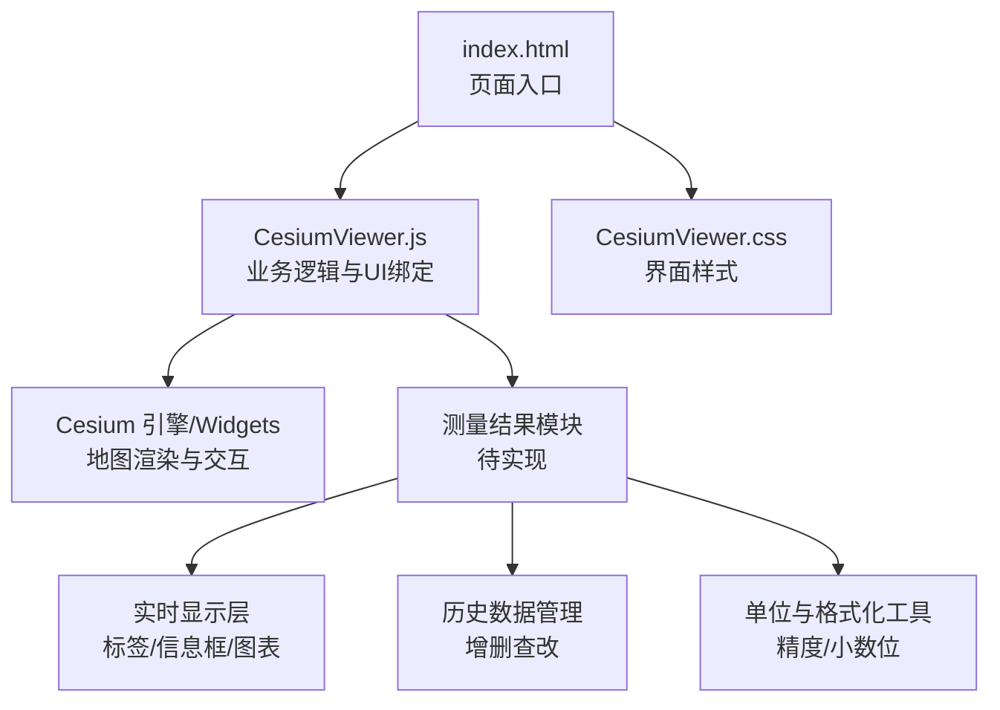
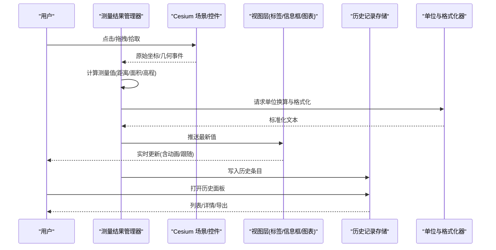
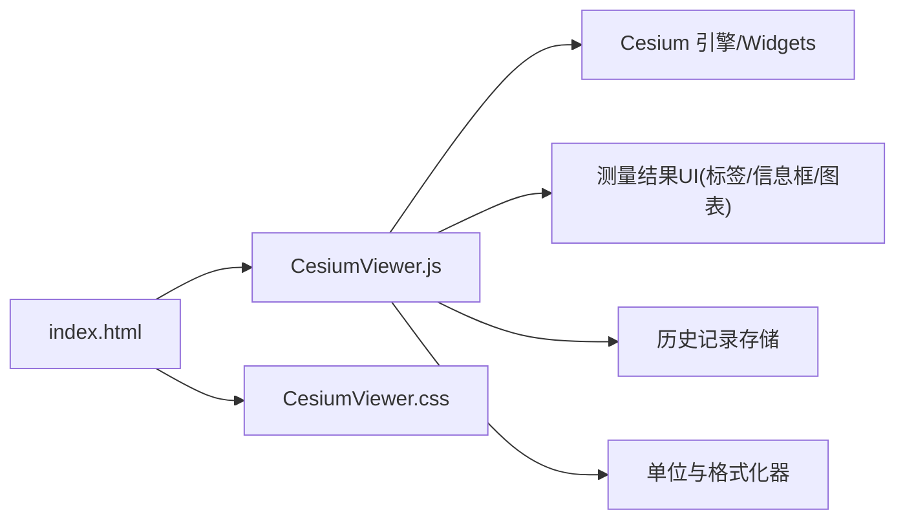

# 测量结果显示

<cite>
**本文引用的文件**   
- [CesiumViewer.js](file://Apps/CesiumViewer/CesiumViewer.js)
- [CesiumViewer.css](file://Apps/CesiumViewer/CesiumViewer.css)
- [index.html](file://Apps/CesiumViewer/index.html)
</cite>

## 目录
1. [简介](#简介)
2. [项目结构](#项目结构)
3. [核心组件](#核心组件)
4. [架构总览](#架构总览)
5. [详细组件分析](#详细组件分析)
6. [依赖关系分析](#依赖关系分析)
7. [性能考虑](#性能考虑)
8. [故障排查指南](#故障排查指南)
9. [结论](#结论)
10. [附录](#附录)

## 简介
本文件围绕“测量结果显示系统”的设计与实现，结合仓库中 CesiumViewer 示例应用，给出面向实际落地的完整方案。内容覆盖：
- 实时显示机制：数值更新、动画效果、位置跟随
- 多种显示样式：标签、信息框、图表展示
- 单位换算与格式化：精度控制、小数位数设置
- 历史记录：查看与管理
- 响应式设计：适配不同屏幕尺寸与设备类型
- 自定义样式与主题配置
- 与 Cesium UI 组件的集成方式与最佳实践

## 项目结构
该示例应用位于 Apps/CesiumViewer 目录，包含入口 HTML、主脚本与样式文件，便于快速理解与扩展。

图示来源
- [index.html](file://Apps/CesiumViewer/index.html)
- [CesiumViewer.js](file://Apps/CesiumViewer/CesiumViewer.js)
- [CesiumViewer.css](file://Apps/CesiumViewer/CesiumViewer.css)

章节来源
- [index.html](file://Apps/CesiumViewer/index.html)
- [CesiumViewer.js](file://Apps/CesiumViewer/CesiumViewer.js)
- [CesiumViewer.css](file://Apps/CesiumViewer/CesiumViewer.css)

## 核心组件
- 测量结果管理器：负责采集测量事件、计算距离/面积/高程等指标、维护历史列表、触发视图更新。
- 实时显示层：将最新测量值以标签、信息框或图表形式呈现，支持位置跟随与平滑过渡动画。
- 单位与格式化器：提供单位换算（如米/英尺、平方米/平方英尺）、精度与小数位控制、本地化格式输出。
- 历史记录面板：提供查询、筛选、导出与清理能力。
- 主题与样式配置：集中管理颜色、字体、布局与响应式断点。

章节来源
- [CesiumViewer.js](file://Apps/CesiumViewer/CesiumViewer.js)
- [CesiumViewer.css](file://Apps/CesiumViewer/CesiumViewer.css)

## 架构总览
下图展示了从用户交互到最终显示的端到端流程，以及各模块之间的职责边界与数据流向。

图示来源
- [CesiumViewer.js](file://Apps/CesiumViewer/CesiumViewer.js)
- [CesiumViewer.css](file://Apps/CesiumViewer/CesiumViewer.css)

## 详细组件分析

### 实时显示机制
- 数值更新策略
  - 增量更新：仅变更文本节点，避免整块重绘。
  - 防抖/节流：在高频事件（如鼠标移动）下合并更新，降低 DOM 操作频率。
- 动画效果
  - 使用 CSS 过渡或 requestAnimationFrame 驱动轻量动画（淡入淡出、缩放、位移）。
  - 对频繁更新的数值采用“差值动画”，提升视觉连贯性。
- 位置跟随
  - 基于 Cesium 的屏幕坐标转换，将标签锚定到目标点附近，并处理视口边缘溢出与遮挡。
  - 多目标时自动避让与层级排序。

章节来源
- [CesiumViewer.js](file://Apps/CesiumViewer/CesiumViewer.js)
- [CesiumViewer.css](file://Apps/CesiumViewer/CesiumViewer.css)

### 多种显示样式
- 标签显示
  - 适用于单点/线段的即时标注，最小侵入、低开销。
- 信息框显示
  - 承载更丰富的元数据（时间戳、坐标、单位、误差范围），支持折叠与展开。
- 图表展示
  - 针对连续测量序列（如高程剖面、距离曲线）提供折线图/柱状图，支持缩放与滚动。

章节来源
- [CesiumViewer.js](file://Apps/CesiumViewer/CesiumViewer.js)
- [CesiumViewer.css](file://Apps/CesiumViewer/CesiumViewer.css)

### 单位换算与格式化
- 单位体系
  - 长度：米、千米、英尺、英里；面积：平方米、公顷、平方英尺、英亩；高程：米、英尺。
- 精度与小数位
  - 根据量级自适应保留有效数字，避免过长字符串影响可读性。
- 本地化
  - 千分位分隔符、货币/角度/日期等区域化规则可配置。

章节来源
- [CesiumViewer.js](file://Apps/CesiumViewer/CesiumViewer.js)

### 历史记录查看与管理
- 数据结构
  - 每条记录包含：类型、时间戳、参数、结果值、单位、坐标、备注。
- 功能
  - 列表分页、关键字搜索、按类型/时间筛选、导出 CSV/JSON、批量删除。
- 持久化
  - 可选 localStorage 或后端接口，注意容量与隐私策略。

章节来源
- [CesiumViewer.js](file://Apps/CesiumViewer/CesiumViewer.js)

### 响应式设计
- 布局
  - 使用相对单位与媒体查询，保证在小屏设备上信息框与图表不溢出。
- 交互
  - 移动端优化触摸手势与点击热区，避免误触。
- 性能
  - 小屏减少图表采样点数，延迟非关键渲染。

章节来源
- [CesiumViewer.css](file://Apps/CesiumViewer/CesiumViewer.css)

### 自定义样式与主题配置
- 主题变量
  - 主色、辅色、背景、文字、阴影、圆角、字号、行高。
- 模式
  - 明/暗主题切换，对比度增强模式。
- 动态注入
  - 运行时通过 CSS 变量或类名切换主题，无需刷新页面。

章节来源
- [CesiumViewer.css](file://Apps/CesiumViewer/CesiumViewer.css)

### 与 Cesium UI 组件的集成方式与最佳实践
- 推荐做法
  - 优先复用 Cesium Widgets 提供的通用控件（如按钮、弹窗、工具栏），保持风格一致。
  - 使用 Cesium 的屏幕坐标转换 API 进行标签定位，确保在不同投影与缩放级别下准确对齐。
  - 将测量结果作为 Entity 或独立 DOM 叠加层管理，避免与地图图层耦合过深。
- 注意事项
  - 避免在主线程执行重型计算，必要时使用 Web Worker。
  - 大量标签时启用虚拟化或按需创建/销毁，防止内存泄漏。
  - 与 Cesium 的拾取、选择、相机动画等交互保持一致的事件模型。

章节来源
- [CesiumViewer.js](file://Apps/CesiumViewer/CesiumViewer.js)

## 依赖关系分析
- 内部依赖
  - index.html 引入 CesiumViewer.js 与 CesiumViewer.css，形成“页面-逻辑-样式”的最小闭环。
- 外部依赖
  - Cesium 引擎与 Widgets 库用于地图渲染、拾取、相机控制与基础 UI 组件。
- 潜在循环
  - 当前结构为单向依赖，未见循环引用风险。

图示来源
- [index.html](file://Apps/CesiumViewer/index.html)
- [CesiumViewer.js](file://Apps/CesiumViewer/CesiumViewer.js)
- [CesiumViewer.css](file://Apps/CesiumViewer/CesiumViewer.css)

章节来源
- [index.html](file://Apps/CesiumViewer/index.html)
- [CesiumViewer.js](file://Apps/CesiumViewer/CesiumViewer.js)
- [CesiumViewer.css](file://Apps/CesiumViewer/CesiumViewer.css)

## 性能考虑
- 渲染
  - 使用 CSS transform 与 opacity 做动画，避免触发重排。
  - 图表按需绘制，大数据集采用抽稀与增量更新。
- 事件
  - 对高频事件采用节流/防抖，合并多次更新。
- 内存
  - 及时移除不可见标签与信息框，释放 DOM 引用。
- I/O
  - 历史记录批量写入与分页加载，避免阻塞主线程。

[本节为通用指导，不涉及具体文件]

## 故障排查指南
- 常见问题
  - 标签错位：检查屏幕坐标转换与偏移量计算，确认视口变化后的重新定位。
  - 更新卡顿：排查是否每帧全量重绘，改为增量更新与节流。
  - 单位异常：核对单位换算表与输入量纲，确认格式化器的舍入策略。
  - 历史丢失：确认存储键名与版本兼容，必要时提供迁移脚本。
- 调试建议
  - 在关键路径添加日志，记录事件触发次数与耗时。
  - 使用浏览器性能面板分析长任务与布局抖动。
  - 对小屏设备进行真机测试，验证触摸与滚动行为。

章节来源
- [CesiumViewer.js](file://Apps/CesiumViewer/CesiumViewer.js)
- [CesiumViewer.css](file://Apps/CesiumViewer/CesiumViewer.css)

## 结论
通过在 CesiumViewer 示例基础上构建统一的测量结果显示系统，可实现稳定高效的实时可视化、灵活的样式与主题、完善的单位与格式化能力，以及可扩展的历史记录管理。遵循与 Cesium UI 的最佳实践，可在保证性能的同时获得一致的交互体验。

[本节为总结，不涉及具体文件]

## 附录
- 术语
  - 标签：附着于地理点的轻量文本提示。
  - 信息框：承载结构化信息的浮层面板。
  - 图表：用于展示时序或分布数据的图形化组件。
- 参考
  - Cesium 官方文档与示例，了解 Widgets、Entity、ScreenSpaceEventHandler 等用法。

[本节为补充说明，不涉及具体文件]