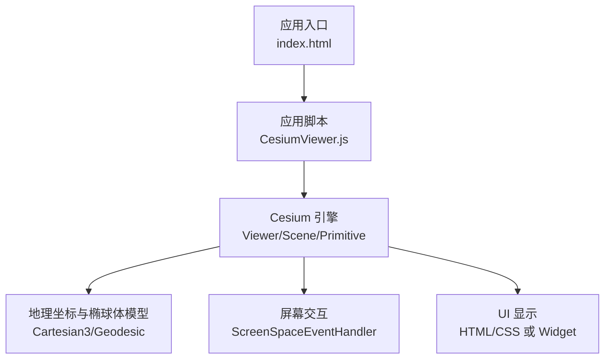
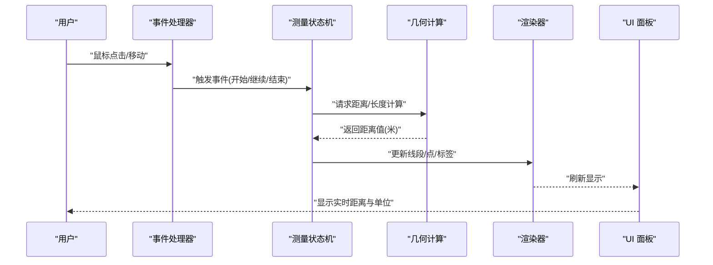
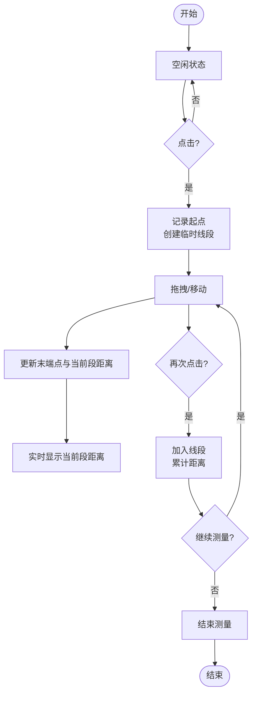
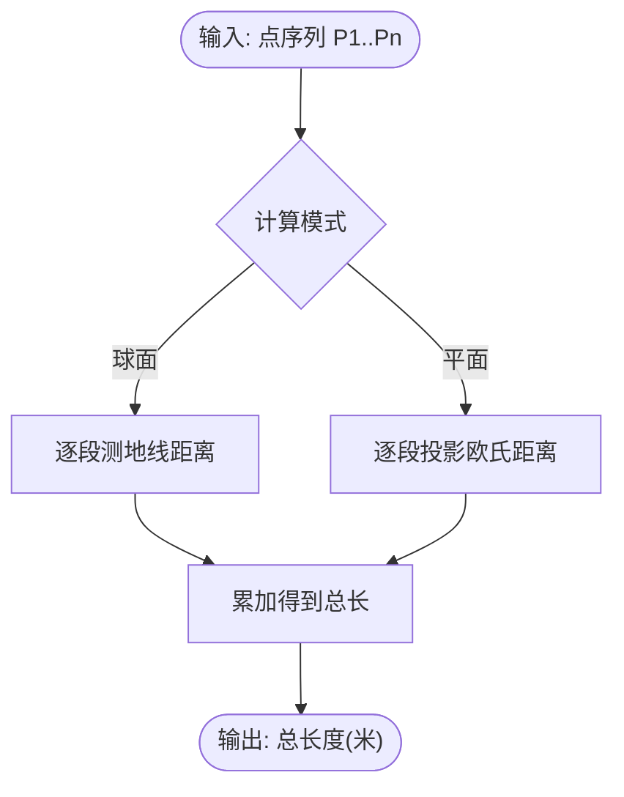
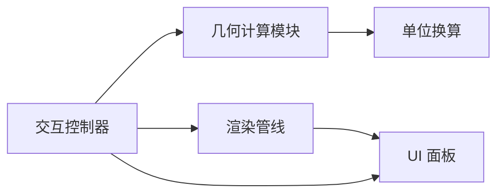

# 距离测量工具

<cite>
**本文引用的文件**   
- [CesiumViewer.js](file://Apps/CesiumViewer/CesiumViewer.js)
- [index.html](file://Apps/CesiumViewer/index.html)
- [README.md](file://README.md)
</cite>

## 目录
1. [简介](#简介)
2. [项目结构](#项目结构)
3. [核心组件](#核心组件)
4. [架构总览](#架构总览)
5. [详细组件分析](#详细组件分析)
6. [依赖关系分析](#依赖关系分析)
7. [性能考虑](#性能考虑)
8. [故障排查指南](#故障排查指南)
9. [结论](#结论)
10. [附录](#附录)

## 简介
本文件面向在 CesiumJS 应用中实现“距离测量工具”的开发者，提供从算法到交互、从单位换算到精度控制与性能优化的完整实现指南。内容覆盖：
- 两点间直线距离计算：球面距离（测地线）、平面投影距离等
- 多点路径长度测量：折线与曲线路径
- 实时距离显示：鼠标移动时的动态更新
- 单位换算系统：米、千米、英里、英尺等
- 精度控制、误差处理与性能优化
- 结合仓库中现有示例工程的最小可用集成方案与最佳实践

## 项目结构
仓库为 CesiumJS 官方源码与示例集合。距离测量功能通常以应用层扩展的方式集成到 Viewer 中，并通过事件监听与图形绘制完成交互与可视化。

图表来源
- [index.html:1-200](file://Apps/CesiumViewer/index.html#L1-L200)
- [CesiumViewer.js:1-200](file://Apps/CesiumViewer/CesiumViewer.js#L1-L200)

章节来源
- [README.md:1-200](file://README.md#L1-L200)
- [index.html:1-200](file://Apps/CesiumViewer/index.html#L1-L200)
- [CesiumViewer.js:1-200](file://Apps/CesiumViewer/CesiumViewer.js#L1-L200)

## 核心组件
- 交互控制器
  - 负责鼠标/触摸事件捕获、状态机管理（空闲、拾取起点、拾取终点、拖拽中）
  - 维护当前测量点序列、临时线段、累计距离
- 几何与距离计算模块
  - 球面距离：基于椭球体的测地线距离
  - 平面投影距离：将经纬度投影到局部平面后求欧氏距离
  - 曲线长度：对折线进行分段采样并累加弧长
- 渲染管线
  - 使用 Polyline/PolylineVolume 绘制测量轨迹
  - 使用 Label/Point 标注端点与中间节点
- 单位换算与格式化
  - 统一内部单位为米，对外展示时按用户选择单位输出
- UI 面板
  - 显示实时距离、单位切换、清除按钮、精度设置

章节来源
- [CesiumViewer.js:1-200](file://Apps/CesiumViewer/CesiumViewer.js#L1-L200)

## 架构总览
下图展示了测量工具在 Cesium 中的整体数据流与控制流：事件驱动的状态机驱动几何计算与渲染更新，最终反馈到 UI。

图表来源
- [CesiumViewer.js:1-200](file://Apps/CesiumViewer/CesiumViewer.js#L1-L200)
- [index.html:1-200](file://Apps/CesiumViewer/index.html#L1-L200)

## 详细组件分析

### 交互控制器与状态机
- 职责
  - 监听屏幕事件，维护测量状态（空闲、拾取起点、拾取终点、拖拽中）
  - 管理测量点序列与临时线段
- 关键流程
  - 首次点击：记录起点，创建临时线段
  - 二次点击：确定终点，计算距离，追加到累计结果
  - 拖拽移动：实时更新末端点位置与当前段距离
  - 双击或确认：结束测量，锁定结果
- 错误处理
  - 无效输入（如未命中地球表面）时提示并重试
  - 重复操作保护（防止空序列计算）

图表来源
- [CesiumViewer.js:1-200](file://Apps/CesiumViewer/CesiumViewer.js#L1-L200)

章节来源
- [CesiumViewer.js:1-200](file://Apps/CesiumViewer/CesiumViewer.js#L1-L200)

### 几何与距离计算模块
- 球面距离（测地线）
  - 适用场景：大尺度、跨经度/纬度范围
  - 方法要点：基于椭球体参数计算两点间最短路径长度
  - 复杂度：O(1)
- 平面投影距离
  - 适用场景：小区域、近似平面
  - 方法要点：将经纬度投影到局部切平面，计算欧氏距离
  - 复杂度：O(1)
- 多点路径长度
  - 折线长度：相邻点两两计算并累加
  - 曲线路径：对折线进行等距或自适应采样，再累加弧长
  - 复杂度：O(n)

图表来源
- [CesiumViewer.js:1-200](file://Apps/CesiumViewer/CesiumViewer.js#L1-L200)

章节来源
- [CesiumViewer.js:1-200](file://Apps/CesiumViewer/CesiumViewer.js#L1-L200)

### 渲染管线
- 绘制元素
  - 线段：Polyline 或 PolylineVolume（带宽度/材质）
  - 端点：Point 或 Billboard
  - 标注：Label 显示距离数值与单位
- 更新策略
  - 增量更新：仅重绘受影响的线段与标签
  - 批量更新：在帧回调中合并多次变更，减少重绘次数
- 可见性与层级
  - 根据缩放级别调整标注密度与线段样式

章节来源
- [CesiumViewer.js:1-200](file://Apps/CesiumViewer/CesiumViewer.js#L1-L200)

### 单位换算与格式化
- 内部统一单位：米
- 支持单位：米、千米、英里、英尺
- 换算常量与精度
  - 定义换算系数表
  - 根据目标单位与精度配置格式化输出
- 边界情况
  - 极小值四舍五入与科学计数法处理
  - 超大值自动切换更合适的单位

章节来源
- [CesiumViewer.js:1-200](file://Apps/CesiumViewer/CesiumViewer.js#L1-L200)

### 精度控制与误差处理
- 精度控制
  - 采样步长：用于曲线长度计算的等距或自适应步长
  - 浮点精度：避免累积误差，必要时采用 Kahan 求和
- 误差处理
  - 非法坐标过滤（NaN、无穷大）
  - 零长度线段跳过
  - 异常回退：当某段计算失败时记录日志并跳过该段

章节来源
- [CesiumViewer.js:1-200](file://Apps/CesiumViewer/CesiumViewer.js#L1-L200)

### 实时距离显示
- 触发时机
  - 鼠标移动时更新当前段距离
  - 每次新增线段后更新累计距离
- 显示策略
  - 防抖/节流：限制 UI 更新频率，避免频繁重绘
  - 文本格式化：保留合适小数位，单位随配置变化

章节来源
- [CesiumViewer.js:1-200](file://Apps/CesiumViewer/CesiumViewer.js#L1-L200)

## 依赖关系分析
- 外部依赖
  - Cesium 引擎：Viewer、Scene、Primitive、Geodesic、Cartesian3 等
  - 浏览器 API：事件模型、Canvas/WebGL
- 内部耦合
  - 交互控制器与渲染管线通过状态机解耦
  - 几何计算模块独立于 UI，便于单元测试

图表来源
- [CesiumViewer.js:1-200](file://Apps/CesiumViewer/CesiumViewer.js#L1-L200)

章节来源
- [CesiumViewer.js:1-200](file://Apps/CesiumViewer/CesiumViewer.js#L1-L200)

## 性能考虑
- 事件节流与防抖
  - 对高频鼠标移动事件进行节流，降低计算与渲染压力
- 增量更新
  - 仅更新变化的线段与标签，避免全量重建
- 采样优化
  - 自适应采样：根据曲率与缩放级别动态调整采样密度
- 内存管理
  - 及时释放不再使用的 Primitive 与纹理资源
- 批处理
  - 合并多次写入，减少 GPU 提交次数

[本节为通用指导，不直接分析具体文件]

## 故障排查指南
- 常见问题
  - 距离为 0 或 NaN：检查输入坐标是否有效、是否存在重复点
  - 实时显示卡顿：检查事件节流与渲染更新频率
  - 单位显示异常：检查换算系数与格式化逻辑
- 定位步骤
  - 打印关键变量：点序列、累计距离、当前段距离
  - 切换计算模式：球面 vs 平面，验证差异是否符合预期
  - 降级渲染：关闭复杂材质与标注，观察性能变化

章节来源
- [CesiumViewer.js:1-200](file://Apps/CesiumViewer/CesiumViewer.js#L1-L200)

## 结论
通过在 Cesium 应用中构建独立的测量工具模块，可以实现高精度、高性能且用户体验友好的距离测量功能。关键在于：
- 清晰的交互状态机与事件处理
- 可靠的几何计算与单位换算
- 高效的渲染与增量更新策略
- 完善的精度控制与错误处理

[本节为总结性内容，不直接分析具体文件]

## 附录
- 最小集成建议
  - 在 index.html 中引入 CesiumViewer.js
  - 在 CesiumViewer.js 中初始化 Viewer 并注册测量事件
  - 使用 HTML/CSS 构建简单的 UI 面板用于显示与配置
- 参考文件
  - [index.html](file://Apps/CesiumViewer/index.html)
  - [CesiumViewer.js](file://Apps/CesiumViewer/CesiumViewer.js)
  - [README.md](file://README.md)

章节来源
- [index.html:1-200](file://Apps/CesiumViewer/index.html#L1-L200)
- [CesiumViewer.js:1-200](file://Apps/CesiumViewer/CesiumViewer.js#L1-L200)
- [README.md:1-200](file://README.md#L1-L200)