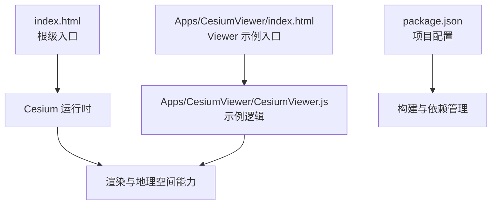
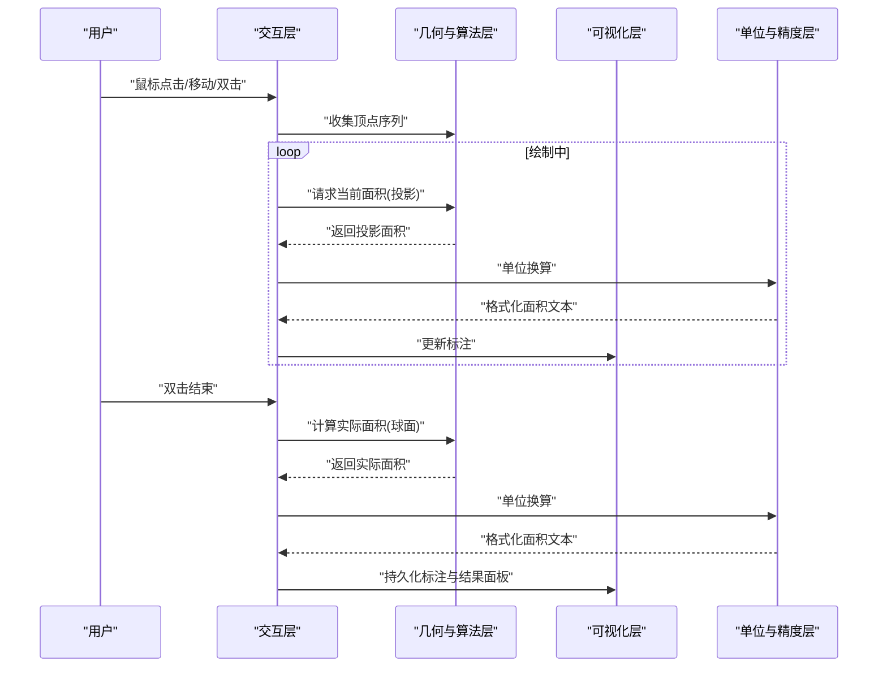
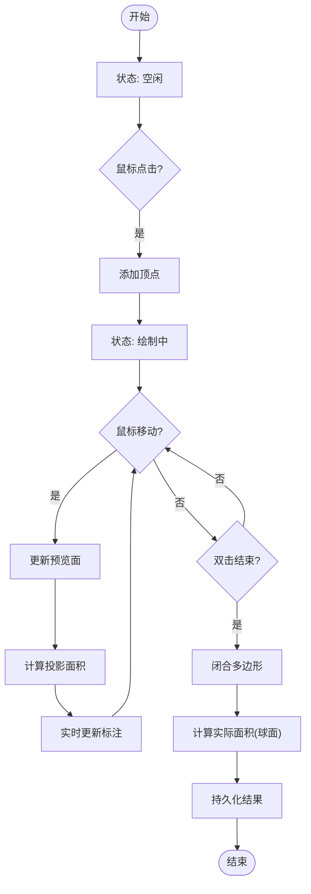
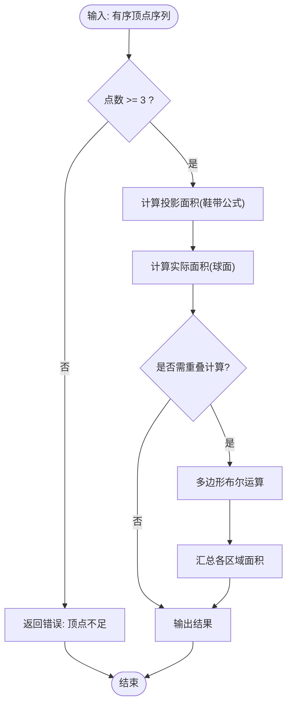
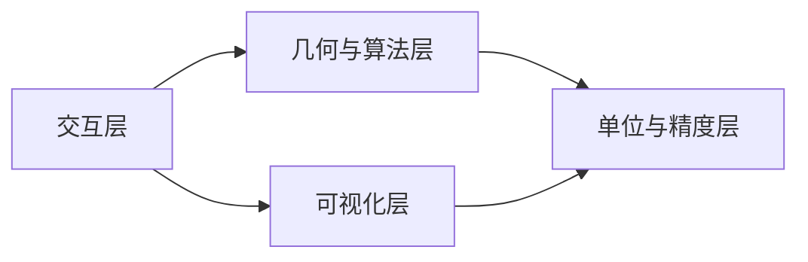

# 面积测量工具

<cite>
**本文引用的文件**   
- [README.md](file://README.md)
- [index.html](file://index.html)
- [Apps/CesiumViewer/index.html](file://Apps/CesiumViewer/index.html)
- [Apps/CesiumViewer/CesiumViewer.js](file://Apps/CesiumViewer/CesiumViewer.js)
- [Apps/HelloWorld.html](file://Apps/HelloWorld.html)
- [package.json](file://package.json)
</cite>

## 目录
1. [简介](#简介)
2. [项目结构](#项目结构)
3. [核心组件](#核心组件)
4. [架构总览](#架构总览)
5. [详细组件分析](#详细组件分析)
6. [依赖关系分析](#依赖关系分析)
7. [性能考虑](#性能考虑)
8. [故障排查指南](#故障排查指南)
9. [结论](#结论)
10. [附录](#附录)

## 简介
本方案面向在三维地球场景中实现“多边形区域面积测量”的完整工程化落地，覆盖以下目标：
- 支持凸多边形、凹多边形与不规则形状的面积计算
- 投影面积与实际面积的转换机制，考虑地球曲率影响
- 鼠标绘制过程中的实时面积显示（动态更新）
- 面积单位换算（平方米、公顷、平方公里、英亩等）
- 精度控制、边界处理、重叠区域计算等技术细节
- 完整的用户交互流程与错误处理机制

该仓库为 CesiumJS 示例与应用集合，包含 Viewer 应用入口与基础页面模板。基于此代码库，可快速搭建一个具备面积测量能力的交互式应用原型。

## 项目结构
仓库采用“示例应用 + 文档 + 测试 + 构建脚本”的组织方式。与本方案最相关的入口包括：
- 根级 index.html：提供最小可用的 Cesium 运行环境
- Apps/CesiumViewer：CesiumViewer 示例应用的 HTML 与 JS 入口
- package.json：项目元数据与依赖声明

图表来源
- [index.html:1-200](file://index.html#L1-L200)
- [Apps/CesiumViewer/index.html:1-200](file://Apps/CesiumViewer/index.html#L1-L200)
- [Apps/CesiumViewer/CesiumViewer.js:1-200](file://Apps/CesiumViewer/CesiumViewer.js#L1-L200)
- [package.json:1-200](file://package.json#L1-L200)

章节来源
- [README.md:1-200](file://README.md#L1-L200)
- [index.html:1-200](file://index.html#L1-L200)
- [Apps/CesiumViewer/index.html:1-200](file://Apps/CesiumViewer/index.html#L1-L200)
- [Apps/CesiumViewer/CesiumViewer.js:1-200](file://Apps/CesiumViewer/CesiumViewer.js#L1-L200)
- [package.json:1-200](file://package.json#L1-L200)

## 核心组件
为实现面积测量，建议将系统拆分为如下模块（概念性设计，便于后续扩展与维护）：
- 交互层（Interaction Layer）
  - 鼠标事件监听（点击、移动、双击结束）
  - 绘制状态机（空闲、绘制中、完成）
  - 提示标签（实时面积显示）
- 几何与算法层（Geometry & Algorithms）
  - 平面多边形面积（鞋带公式）
  - 球面多边形面积（球面三角剖分或高斯-博内定理近似）
  - 投影面积与实际面积转换（基于局部切平面或投影变换）
  - 重叠区域计算（多边形布尔运算）
- 单位与精度层（Units & Precision）
  - 单位换算（平方米、公顷、平方公里、英亩）
  - 精度控制（小数位、阈值判定）
- 可视化层（Visualization）
  - 绘制线/面实体
  - 动态标注更新
  - 结果面板展示

说明：上述模块为工程化落地的推荐组织方式，具体实现可在 CesiumViewer 应用中逐步集成。

## 架构总览
下图展示了从用户交互到最终面积展示的端到端流程，以及各层之间的职责划分。

[本图为概念流程图，不直接映射具体源码文件]

## 详细组件分析

### 交互层（Interaction Layer）
- 职责
  - 捕获鼠标事件，维护绘制状态（空闲/绘制中/完成）
  - 管理临时绘制实体（点、线、面）的生命周期
  - 触发几何计算并刷新 UI 标注
- 关键流程
  - 单击：添加顶点，进入绘制中
  - 移动：更新最后一个边，触发实时面积重算
  - 双击：闭合多边形，停止绘制，输出最终结果
- 错误处理
  - 无效输入（如少于三个点）时禁用计算
  - 地图加载失败或不可用时给出提示

[本图为概念流程图，不直接映射具体源码文件]

### 几何与算法层（Geometry & Algorithms）
- 平面多边形面积（投影面积）
  - 适用场景：小范围、近似平面
  - 方法：鞋带公式（Shoelace），时间复杂度 O(n)，空间复杂度 O(1)
- 球面多边形面积（实际面积）
  - 适用场景：大范围、考虑地球曲率
  - 方法：将球面多边形三角剖分或使用球面角亏法；时间复杂度 O(n)
- 投影面积与实际面积转换
  - 思路一：在局部切平面进行投影，再反算回球面
  - 思路二：使用合适的投影坐标系（如 UTM）计算投影面积，再转换为球面面积
- 重叠区域计算
  - 思路：对多个多边形执行布尔运算（交/并/差），再对结果求面积
  - 注意：复杂拓扑需鲁棒的几何库支持

[本图为概念流程图，不直接映射具体源码文件]

### 单位与精度层（Units & Precision）
- 单位换算
  - 平方米 → 公顷（÷10,000）
  - 平方米 → 平方公里（÷1,000,000）
  - 平方米 → 英亩（×0.000247105）
- 精度控制
  - 根据应用场景设置小数位数（例如 2~4 位）
  - 设定最小有效面积阈值，避免噪声干扰
- 误差来源与缓解
  - 浮点精度：使用高精度累加策略
  - 投影误差：选择合适投影或直接在球面计算

[本节为通用指导，不直接分析具体源码文件]

### 可视化层（Visualization）
- 绘制反馈
  - 实时绘制预览面与边框
  - 动态标注位置跟随鼠标
- 结果展示
  - 固定标注显示最终面积
  - 结果面板列出历史测量记录
- 样式与交互
  - 不同状态下的颜色与透明度
  - 右键取消/清空操作

[本节为通用指导，不直接分析具体源码文件]

## 依赖关系分析
- 外部依赖
  - CesiumJS：提供三维地球、坐标转换、几何与可视化能力
- 内部依赖
  - 交互层依赖可视化层进行绘制与标注
  - 几何与算法层被交互层调用以计算面积
  - 单位与精度层为所有层提供统一换算与格式化

[本图为概念图，不直接映射具体源码文件]

## 性能考虑
- 实时计算优化
  - 增量更新：仅对新增边与三角形进行增量计算
  - 防抖/节流：鼠标移动事件限频，降低重绘压力
- 大数据量处理
  - 对复杂多边形进行简化（Douglas-Peucker）
  - 分层渲染：预览面低精度，最终结果高精度
- 内存与线程
  - 及时释放临时对象
  - 必要时将几何计算移至 Web Worker

[本节为通用指导，不直接分析具体源码文件]

## 故障排查指南
- 常见问题
  - 无法获取鼠标位置：检查地图初始化与事件绑定
  - 面积始终为零：确认顶点顺序与数量
  - 大区域面积偏差：切换至球面计算或调整投影
- 调试手段
  - 打印中间变量（顶点序列、投影/球面面积）
  - 可视化中间结果（三角剖分、重叠区域）
- 日志与告警
  - 记录异常堆栈与上下文信息
  - 对非法输入进行友好提示

[本节为通用指导，不直接分析具体源码文件]

## 结论
通过分层设计与模块化组织，可以在 Cesium 应用中高效实现面积测量功能。结合投影与实际面积转换、实时交互与单位换算，可满足从城市地块到国家尺度等多种业务场景的需求。建议在工程中引入单元测试与基准测试，持续验证算法正确性与性能表现。

## 附录
- 参考入口与示例
  - 根级入口：index.html
  - Viewer 示例：Apps/CesiumViewer/index.html 与 Apps/CesiumViewer/CesiumViewer.js
  - 项目配置：package.json

章节来源
- [README.md:1-200](file://README.md#L1-L200)
- [index.html:1-200](file://index.html#L1-L200)
- [Apps/CesiumViewer/index.html:1-200](file://Apps/CesiumViewer/index.html#L1-L200)
- [Apps/CesiumViewer/CesiumViewer.js:1-200](file://Apps/CesiumViewer/CesiumViewer.js#L1-L200)
- [package.json:1-200](file://package.json#L1-L200)