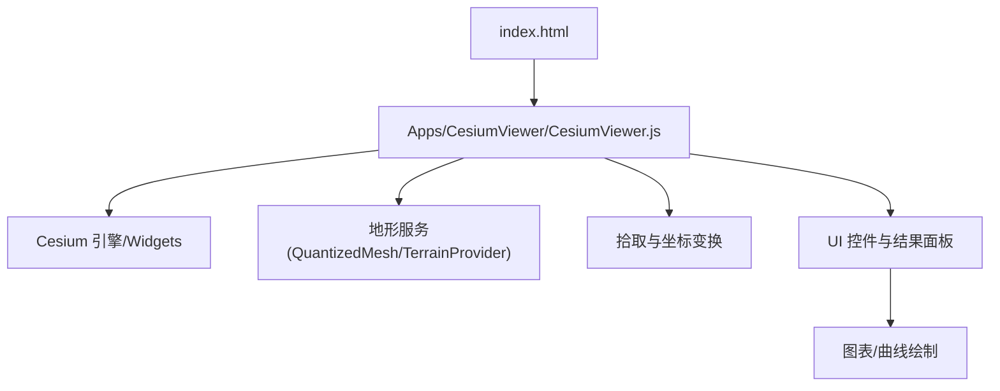
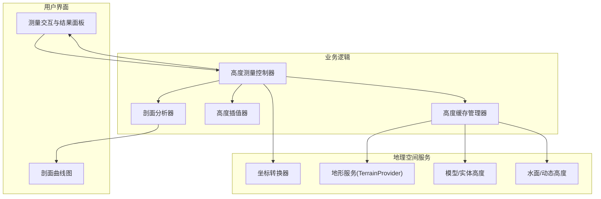
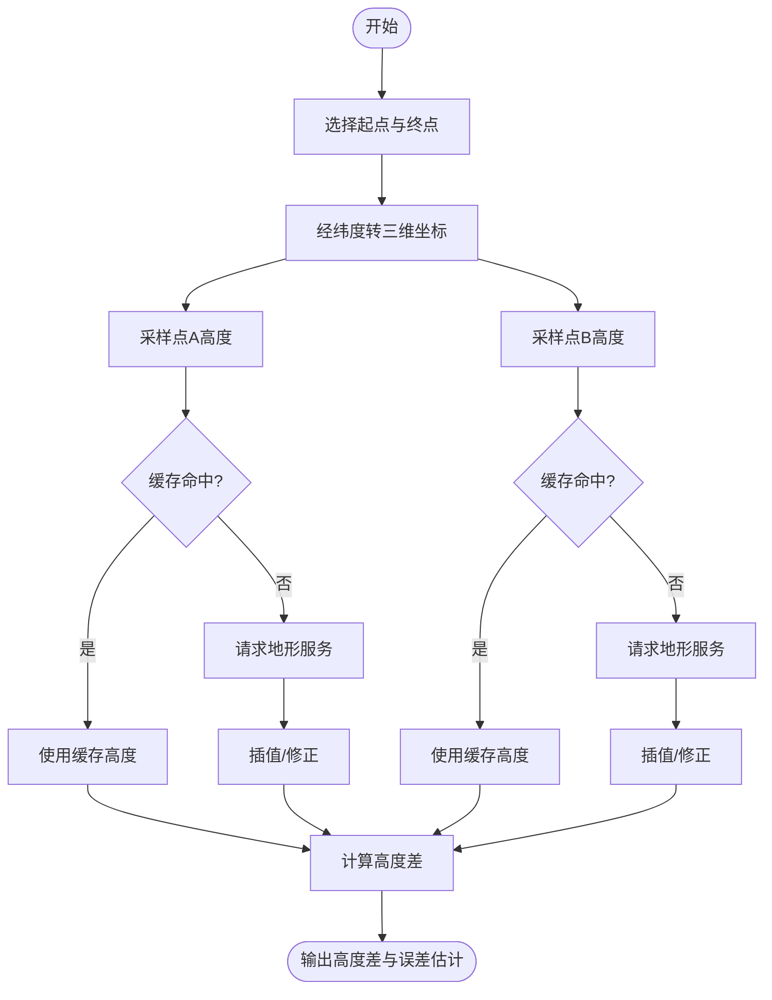
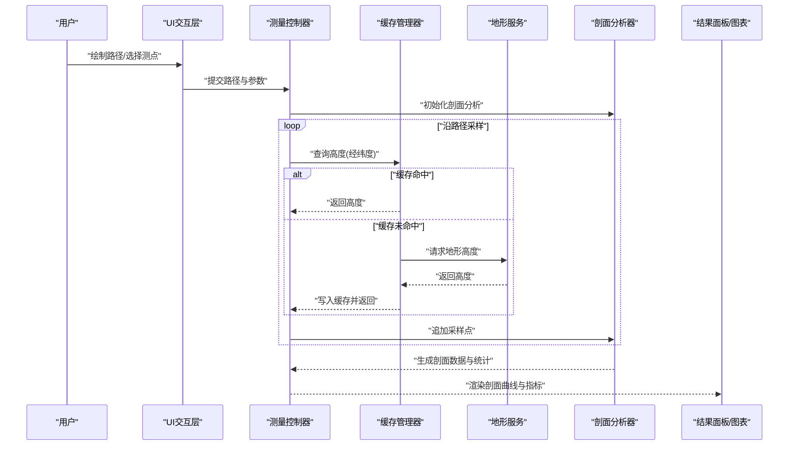
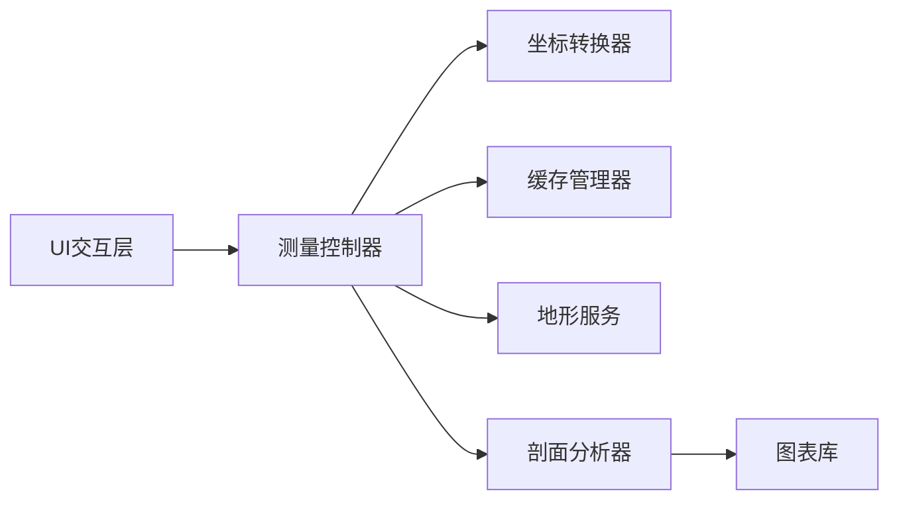

# 高度测量工具

<cite>
**本文引用的文件**   
- [index.html](file://index.html)
- [CesiumViewer.js](file://Apps/CesiumViewer/CesiumViewer.js)
- [CesiumViewer.css](file://Apps/CesiumViewer/CesiumViewer.css)
- [README.md](file://README.md)
- [package.json](file://package.json)
</cite>

## 目录
1. [简介](#简介)
2. [项目结构](#项目结构)
3. [核心组件](#核心组件)
4. [架构总览](#架构总览)
5. [详细组件分析](#详细组件分析)
6. [依赖分析](#依赖分析)
7. [性能考虑](#性能考虑)
8. [故障排查指南](#故障排查指南)
9. [结论](#结论)
10. [附录](#附录)

## 简介
本文件面向在 Cesium 代码库基础上开发“高度测量工具”的工程师与产品人员，目标是提供一套完整、可落地的实现文档。内容覆盖：
- 海拔高度差计算：基于地形数据的高度获取、坐标系统转换、高程基准面处理
- 相对高度测量：任意两点间的垂直距离计算
- 剖面分析：沿路径的高度变化分析与可视化展示
- 实时性与缓存：高度数据的实时更新策略与缓存机制
- 核心技术：地形数据加载、高度插值算法、精度控制
- 用户体验：友好的高度测量界面与结果展示方式

说明：当前仓库未包含现成的高度测量模块源码，因此本文以工程化落地为导向，给出基于现有 Cesium 能力（地形服务、拾取、坐标变换等）的实施方案与最佳实践，并给出与仓库入口文件的映射关系，便于快速集成到 Apps/CesiumViewer 中。

## 项目结构
仓库采用多包与示例应用分离的组织方式。与高度测量工具集成最相关的入口为示例应用与根级页面：
- 示例应用入口：Apps/CesiumViewer/CesiumViewer.js
- 示例样式：Apps/CesiumViewer/CesiumViewer.css
- 根级演示页：index.html
- 项目说明与构建配置：README.md、package.json

图示来源
- [index.html:1-200](file://index.html#L1-L200)
- [CesiumViewer.js:1-200](file://Apps/CesiumViewer/CesiumViewer.js#L1-L200)

章节来源
- [index.html:1-200](file://index.html#L1-L200)
- [CesiumViewer.js:1-200](file://Apps/CesiumViewer/CesiumViewer.js#L1-L200)
- [README.md:1-200](file://README.md#L1-L200)
- [package.json:1-200](file://package.json#L1-L200)

## 核心组件
为实现高度测量工具，建议将功能拆分为以下核心组件（概念性设计，便于后续在 CesiumViewer 中扩展）：
- 地形服务适配器：封装 TerrainProvider 调用，负责瓦片加载、可用性检查、异常重试
- 高度查询器：对给定经纬度进行地面高度采样，支持多源融合（地形+模型+水面）
- 坐标转换器：WGS84 经纬度与三维笛卡尔坐标互转，统一椭球/大地高/正高基准
- 剖面分析器：沿折线路径采样高度序列，生成剖面曲线与统计指标
- 缓存管理器：LRU 或时间窗口缓存，避免重复请求，支持失效与回退策略
- UI 交互层：点击/拖拽创建测点、绘制路径、显示结果面板与图表

章节来源
- [CesiumViewer.js:1-200](file://Apps/CesiumViewer/CesiumViewer.js#L1-L200)

## 架构总览
下图展示了高度测量工具在 Cesium 中的整体架构与数据流。用户通过 UI 交互触发测量，系统经坐标转换后向地形服务发起高度查询，结合缓存与插值策略返回结果，并在结果面板与剖面图中可视化。

图示来源
- [CesiumViewer.js:1-200](file://Apps/CesiumViewer/CesiumViewer.js#L1-L200)

## 详细组件分析

### 海拔高度差计算
- 目标：给定两个位置（经纬度），计算其相对于同一高程基准面的海拔高度差
- 关键步骤：
  - 坐标系统转换：将 WGS84 经纬度转换为三维笛卡尔坐标，再投影至局部切平面坐标系，保证水平距离与垂直方向一致
  - 高程基准面处理：明确使用的大地高/正高基准，必要时进行基准面转换（如 WGS84 大地高到当地正高）
  - 地形高度获取：通过 TerrainProvider 对点位进行高度采样；若命中缓存则直接返回
  - 高度差计算：对两点的海拔高度求差，输出绝对值与方向信息
- 精度控制：
  - 地形分辨率与缩放级别联动，近景提高采样密度
  - 插值策略：双线性/三次样条插值用于路径上非格网点采样
  - 误差估计：根据地形瓦片元数据与网格间距估算最大误差

图示来源
- [CesiumViewer.js:1-200](file://Apps/CesiumViewer/CesiumViewer.js#L1-L200)

章节来源
- [CesiumViewer.js:1-200](file://Apps/CesiumViewer/CesiumViewer.js#L1-L200)

### 相对高度测量（任意两点间垂直距离）
- 目标：计算任意两点之间的垂直距离，不依赖水平投影
- 关键点：
  - 若两点位于不同高程基准面，需先统一到同一基准面
  - 对于贴地对象（如贴地多边形顶点），优先使用对象自身高度属性
  - 对于空中对象（如飞行轨迹），使用对象的三维坐标 Z 分量或模型高度
- 输出：
  - 垂直距离（绝对值）
  - 方向（上升/下降）
  - 置信区间（基于地形分辨率与插值误差）

章节来源
- [CesiumViewer.js:1-200](file://Apps/CesiumViewer/CesiumViewer.js#L1-L200)

### 剖面分析工具（沿路径的高度变化）
- 目标：沿用户绘制的路径，逐点采样高度，生成剖面曲线与统计摘要
- 流程：
  - 路径采样：按固定步长或自适应步长对路径离散化
  - 高度采样：对每个采样点进行高度查询，命中缓存则复用
  - 插值与平滑：可选低通滤波或样条平滑，抑制噪声
  - 统计指标：最大/最小/平均高度、累计爬升/下降、坡度分布
  - 可视化：二维剖面图（横轴为水平距离，纵轴为海拔高度）

图示来源
- [CesiumViewer.js:1-200](file://Apps/CesiumViewer/CesiumViewer.js#L1-L200)

章节来源
- [CesiumViewer.js:1-200](file://Apps/CesiumViewer/CesiumViewer.js#L1-L200)

### 高度数据的实时更新与缓存机制
- 实时更新：
  - 监听视图变化（相机移动、缩放），按需刷新热点区域缓存
  - 对动态对象（如水位线、飞行器轨迹）设置定时更新或事件驱动更新
- 缓存策略：
  - 键设计：(tileKey, lat, lon, zResolution) 或 (regionQuadkey, pointIndex)
  - 过期策略：时间戳 + 区域热度权重
  - 容量控制：LRU 淘汰，内存上限保护
  - 降级策略：当服务不可用时，回退到最近一次可用结果或默认值

章节来源
- [CesiumViewer.js:1-200](file://Apps/CesiumViewer/CesiumViewer.js#L1-L200)

### 地形数据加载与高度插值算法
- 地形数据加载：
  - 使用 QuantizedMesh 或自定义 TerrainProvider
  - 依据视锥体与 LOD 策略按需加载瓦片
- 插值算法：
  - 单点：双线性插值（规则网格）、三次样条（平滑需求）
  - 路径：分段插值，边界处外推保护
  - 误差估计：基于网格间距与曲率近似

章节来源
- [CesiumViewer.js:1-200](file://Apps/CesiumViewer/CesiumViewer.js#L1-L200)

### 精度控制与误差评估
- 精度影响因素：
  - 地形分辨率（瓦片层级）
  - 采样步长与路径密度
  - 插值方法与平滑强度
- 控制手段：
  - 动态调整采样密度（近景加密、远景稀疏）
  - 启用误差阈值与自动重试
  - 记录并展示误差估计，辅助用户判断可靠性

章节来源
- [CesiumViewer.js:1-200](file://Apps/CesiumViewer/CesiumViewer.js#L1-L200)

### 用户友好的界面与结果展示
- 交互设计：
  - 点击地图放置测点，双击结束路径
  - 拖拽调整测点位置，实时重算
  - 快捷键与撤销/重做
- 结果展示：
  - 结果面板：显示高度差、垂直距离、剖面统计
  - 剖面图：交互式缩放、悬停查看数值
  - 导出：CSV/PNG 导出

章节来源
- [CesiumViewer.js:1-200](file://Apps/CesiumViewer/CesiumViewer.js#L1-L200)
- [CesiumViewer.css:1-200](file://Apps/CesiumViewer/CesiumViewer.css#L1-L200)

## 依赖分析
- 外部依赖：
  - Cesium 引擎与 Widgets（地图、拾取、坐标变换、地形服务）
  - 可选：图表库（用于剖面曲线）
- 内部依赖：
  - 测量控制器依赖缓存管理器、坐标转换器、地形服务
  - 剖面分析器依赖测量控制器与插值器
  - UI 层依赖测量控制器与结果面板

图示来源
- [CesiumViewer.js:1-200](file://Apps/CesiumViewer/CesiumViewer.js#L1-L200)

章节来源
- [CesiumViewer.js:1-200](file://Apps/CesiumViewer/CesiumViewer.js#L1-L200)
- [package.json:1-200](file://package.json#L1-L200)

## 性能考虑
- 减少网络请求：
  - 合理设计缓存键，避免重复采样
  - 批量请求合并（路径采样时聚合相邻点）
- 降低计算开销：
  - 自适应采样密度，避免过度细分
  - 插值算法选择与平滑强度权衡
- 渲染优化：
  - 剖面图数据降采样与延迟加载
  - 结果面板增量更新而非全量重绘

[本节为通用指导，无需特定文件引用]

## 故障排查指南
- 常见问题：
  - 地形服务不可用：检查网络、跨域、服务地址与密钥
  - 高度异常：确认高程基准面一致性，检查坐标转换是否正确
  - 性能卡顿：检查缓存命中率与采样密度设置
- 诊断方法：
  - 开启调试日志，记录每次高度查询的请求与响应
  - 使用浏览器开发者工具监控网络与内存占用
  - 对比不同分辨率下的结果，定位插值与采样问题

章节来源
- [CesiumViewer.js:1-200](file://Apps/CesiumViewer/CesiumViewer.js#L1-L200)

## 结论
通过在 Cesium 应用中集成上述组件与策略，可实现稳定、高效且用户友好的高度测量工具。建议在 Apps/CesiumViewer 中逐步扩展测量控制器、缓存管理器与剖面分析器，并结合 UI 层完成交互与可视化。实际落地时需关注高程基准面、坐标系统与地形分辨率对精度的影响，并通过缓存与自适应采样提升性能。

[本节为总结性内容，无需特定文件引用]

## 附录
- 术语表：
  - 大地高：相对于参考椭球面的高度
  - 正高：相对于大地水准面的高度
  - 瓦片：地形数据分块存储的基本单元
- 参考入口：
  - 示例应用入口：Apps/CesiumViewer/CesiumViewer.js
  - 根级演示页：index.html
  - 项目说明：README.md
  - 构建配置：package.json

章节来源
- [CesiumViewer.js:1-200](file://Apps/CesiumViewer/CesiumViewer.js#L1-L200)
- [index.html:1-200](file://index.html#L1-L200)
- [README.md:1-200](file://README.md#L1-L200)
- [package.json:1-200](file://package.json#L1-L200)