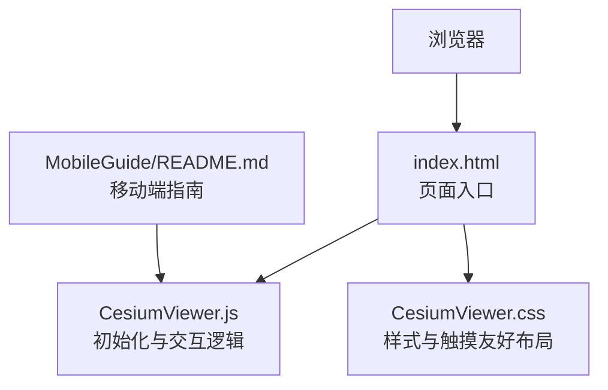
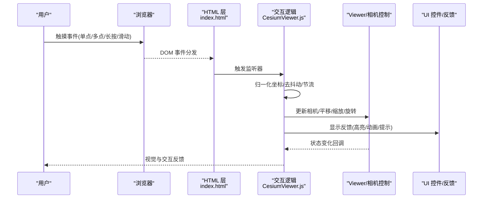
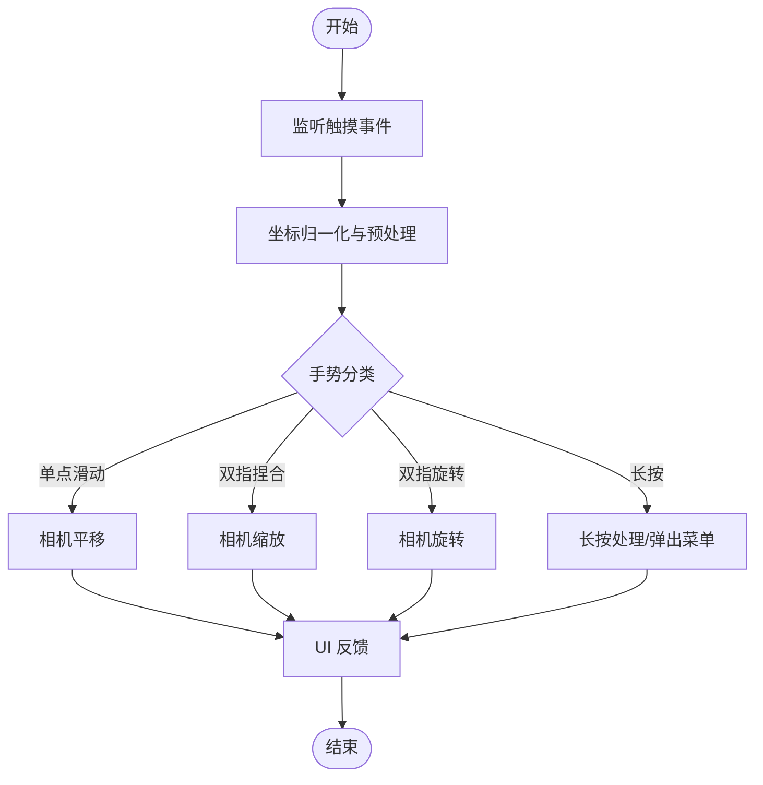
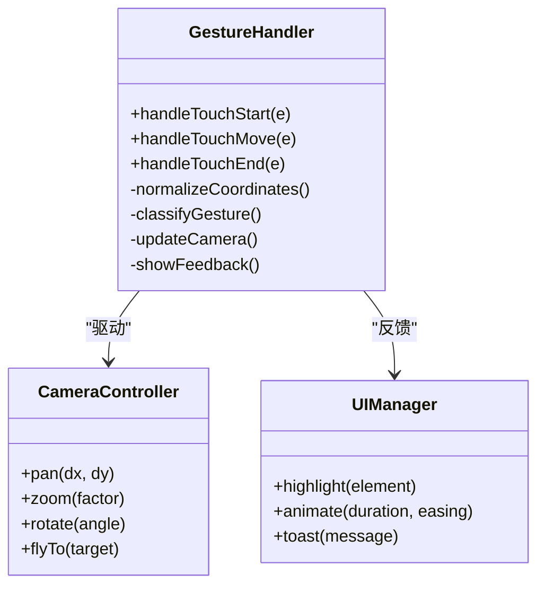
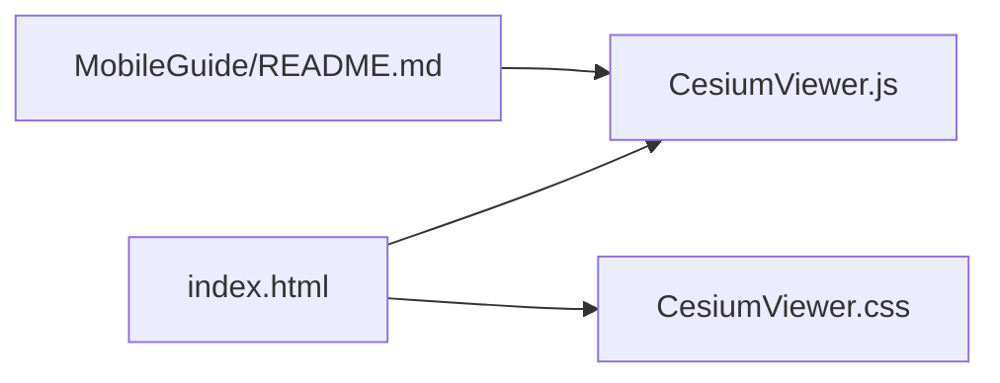

# 移动端触摸操作

<cite>
**本文引用的文件**   
- [README.md](file://Documentation/Contributors/MobileGuide/README.md)
- [index.html](file://Apps/CesiumViewer/index.html)
- [CesiumViewer.js](file://Apps/CesiumViewer/CesiumViewer.js)
- [CesiumViewer.css](file://Apps/CesiumViewer/CesiumViewer.css)
</cite>

## 目录
1. [简介](#简介)
2. [项目结构](#项目结构)
3. [核心组件](#核心组件)
4. [架构总览](#架构总览)
5. [详细组件分析](#详细组件分析)
6. [依赖关系分析](#依赖关系分析)
7. [性能考虑](#性能考虑)
8. [故障排查指南](#故障排查指南)
9. [结论](#结论)
10. [附录](#附录)

## 简介
本文件面向在移动端实现完整触摸交互的开发者，围绕单点触控、多点触控、手势识别（捏合缩放、双指旋转、长按等）进行系统化说明，并结合 Cesium 工程中的示例应用与文档，给出可落地的适配方案、UI 体验优化策略以及跨设备兼容性与性能调优建议。内容覆盖事件捕获与处理流程、节流防抖、内存管理、触摸友好 UI 设计、滑动导航与反馈机制，以及在不同移动设备上的兼容性要点。

## 项目结构
本项目为 Cesium 仓库，包含示例应用与文档。与移动端触摸适配直接相关的入口与资源位于 Apps/CesiumViewer 目录，同时 Documentation/Contributors/MobileGuide 提供了移动端开发指南参考。

图表来源
- [index.html](file://Apps/CesiumViewer/index.html)
- [CesiumViewer.js](file://Apps/CesiumViewer/CesiumViewer.js)
- [CesiumViewer.css](file://Apps/CesiumViewer/CesiumViewer.css)
- [README.md](file://Documentation/Contributors/MobileGuide/README.md)

章节来源
- [index.html](file://Apps/CesiumViewer/index.html)
- [CesiumViewer.js](file://Apps/CesiumViewer/CesiumViewer.js)
- [CesiumViewer.css](file://Apps/CesiumViewer/CesiumViewer.css)
- [README.md](file://Documentation/Contributors/MobileGuide/README.md)

## 核心组件
- 页面入口 index.html：负责引入脚本与样式，挂载容器，设置视口与基础 meta，确保移动端渲染与滚动行为正确。
- 交互逻辑 CesiumViewer.js：初始化 Viewer、配置相机控制、注册触摸相关事件与手势处理、接入 UI 控件与反馈。
- 样式 CesiumViewer.css：定义触摸友好的按钮尺寸、间距、遮罩层与过渡动画，提升滑动导航与手势反馈体验。
- 移动端指南 MobileGuide/README.md：提供移动端最佳实践、常见问题与兼容性提示，指导如何结合 Cesium 的相机与控制模块进行适配。

章节来源
- [index.html](file://Apps/CesiumViewer/index.html)
- [CesiumViewer.js](file://Apps/CesiumViewer/CesiumViewer.js)
- [CesiumViewer.css](file://Apps/CesiumViewer/CesiumViewer.css)
- [README.md](file://Documentation/Contributors/MobileGuide/README.md)

## 架构总览
下图展示移动端触摸事件从浏览器到应用层的流转路径，以及手势识别与相机控制的协作关系。

图表来源
- [index.html](file://Apps/CesiumViewer/index.html)
- [CesiumViewer.js](file://Apps/CesiumViewer/CesiumViewer.js)
- [CesiumViewer.css](file://Apps/CesiumViewer/CesiumViewer.css)

## 详细组件分析

### 触摸事件捕获与处理流程
- 事件类型覆盖：touchstart/touchmove/touchend/touchcancel，用于捕获单点与多点触控；pointer 事件可作为补充以统一鼠标与触摸输入。
- 坐标归一化：将屏幕坐标转换为世界坐标或像素坐标，避免不同设备 DPR 导致的偏差。
- 手势判定：基于触点数量、位移阈值、时间窗口与速度判断滑动、长按、捏合、旋转等。
- 相机控制联动：根据手势结果调用相机 API 执行平移、缩放、旋转等操作。
- 反馈机制：通过 UI 层提供即时反馈（如按钮高亮、遮罩、微动效），增强可感知性。

图表来源
- [CesiumViewer.js](file://Apps/CesiumViewer/CesiumViewer.js)
- [CesiumViewer.css](file://Apps/CesiumViewer/CesiumViewer.css)

章节来源
- [CesiumViewer.js](file://Apps/CesiumViewer/CesiumViewer.js)
- [CesiumViewer.css](file://Apps/CesiumViewer/CesiumViewer.css)

### 单点触控与多点触控
- 单点触控：用于拖拽平移、点击选择、长按触发上下文菜单。需关注 touchstart/touchmove/touchend 的顺序与状态机。
- 多点触控：用于捏合缩放与双指旋转。需要维护触点集合、计算距离与角度变化，并限制最小/最大缩放范围。
- 冲突处理：当存在多个手势时，优先处理明确意图的手势（例如先区分捏合与旋转），避免误判。

章节来源
- [CesiumViewer.js](file://Apps/CesiumViewer/CesiumViewer.js)

### 手势识别与相机控制
- 捏合缩放：计算两触点距离变化率映射到相机缩放因子，平滑插值更新。
- 双指旋转：计算两触点角度差映射到相机绕轴旋转，注意方向与坐标系一致性。
- 长按操作：记录首次触点的持续时间，超过阈值触发长按回调，常用于弹出详情或工具栏。
- 滑动导航：根据滑动方向与速度切换视图模式或页面区域，配合 CSS 过渡提升流畅度。

图表来源
- [CesiumViewer.js](file://Apps/CesiumViewer/CesiumViewer.js)
- [CesiumViewer.css](file://Apps/CesiumViewer/CesiumViewer.css)

章节来源
- [CesiumViewer.js](file://Apps/CesiumViewer/CesiumViewer.js)
- [CesiumViewer.css](file://Apps/CesiumViewer/CesiumViewer.css)

### UI 适配与用户体验优化
- 触摸友好按钮：最小点击面积、足够内边距、清晰反馈状态（按下/悬停/禁用）。
- 滑动导航：左右滑动手势切换面板或图层，使用 CSS transform 与 transition 保证流畅。
- 手势反馈：轻震动（若可用）、高亮选中项、遮罩层与半透明背景提示。
- 字体与对比度：在小屏设备上保持可读性，避免过小文字与低对比配色。

章节来源
- [CesiumViewer.css](file://Apps/CesiumViewer/CesiumViewer.css)

### 移动端指南与兼容性要点
- 视口与缩放：设置合适的 viewport meta，防止意外缩放与滚动穿透。
- 滚动与触摸冲突：在地图交互区域阻止默认滚动，必要时使用 passive 事件优化滚动性能。
- Pointer Events：统一鼠标与触摸输入，简化事件分支逻辑。
- 设备差异：针对 iOS Safari 与 Android Chrome 的差异进行兼容处理（如长按、双击缩放、滚动惯性）。

章节来源
- [README.md](file://Documentation/Contributors/MobileGuide/README.md)

## 依赖关系分析
- 页面入口 index.html 引入 CesiumViewer.js 与 CesiumViewer.css，构成运行时依赖。
- CesiumViewer.js 依赖 Viewer 与相机控制模块，并通过 UI 层提供交互反馈。
- MobileGuide/README.md 作为文档依赖，指导实现细节与最佳实践。

图表来源
- [index.html](file://Apps/CesiumViewer/index.html)
- [CesiumViewer.js](file://Apps/CesiumViewer/CesiumViewer.js)
- [CesiumViewer.css](file://Apps/CesiumViewer/CesiumViewer.css)
- [README.md](file://Documentation/Contributors/MobileGuide/README.md)

章节来源
- [index.html](file://Apps/CesiumViewer/index.html)
- [CesiumViewer.js](file://Apps/CesiumViewer/CesiumViewer.js)
- [CesiumViewer.css](file://Apps/CesiumViewer/CesiumViewer.css)
- [README.md](file://Documentation/Contributors/MobileGuide/README.md)

## 性能考虑
- 事件节流与防抖：对高频事件（如 touchmove）进行节流，减少主线程压力；对长按与双击等复合动作采用防抖，避免重复触发。
- 被动事件与滚动优化：在不需要 preventDefault 的场景使用 passive:true，提升滚动性能。
- 几何与纹理优化：在移动端降低绘制复杂度，按需加载数据，避免一次性创建大量对象导致 GC 抖动。
- 内存管理：及时释放不再使用的对象引用，避免闭包持有大对象；复用缓冲区与纹理。
- 渲染帧率监控：在低端设备上动态调整质量参数（阴影、抗锯齿、后处理），保障交互流畅。

[本节为通用性能建议，不直接分析具体文件]

## 故障排查指南
- 触摸无响应：检查是否阻止了默认行为或未正确绑定事件；确认视口与 DPR 设置。
- 手势冲突：定位多手势判定逻辑，增加阈值与优先级；打印调试信息观察触点序列。
- 卡顿与掉帧：开启性能面板，定位热点函数；减少每帧分配，合并计算与绘制。
- 长按失效：某些浏览器默认长按会触发右键或菜单，需在交互区域阻止默认行为。
- 滚动穿透：在地图容器上阻止默认滚动，或在非交互区域允许滚动。

章节来源
- [CesiumViewer.js](file://Apps/CesiumViewer/CesiumViewer.js)
- [CesiumViewer.css](file://Apps/CesiumViewer/CesiumViewer.css)

## 结论
通过在页面入口、交互逻辑与样式层协同工作，并结合移动端指南的最佳实践，可以实现稳定且流畅的移动端触摸交互。关键在于合理的事件处理流程、清晰的手势判定、及时的 UI 反馈以及全面的性能与兼容性优化。建议在真实设备上持续测试，依据性能指标与用户反馈迭代优化。

[本节为总结性内容，不直接分析具体文件]

## 附录
- 术语说明
  - 单点触控：单个手指的触摸事件，常用于拖拽与点击。
  - 多点触控：两个及以上手指的触摸事件，常用于捏合与旋转。
  - 捏合缩放：通过两指距离变化控制缩放。
  - 双指旋转：通过两指角度变化控制旋转。
  - 长按：触点持续时间超过阈值的操作。
  - 节流：限制函数执行频率。
  - 防抖：延迟执行直到停止触发后再执行。

[本节为概念性内容，不直接分析具体文件]