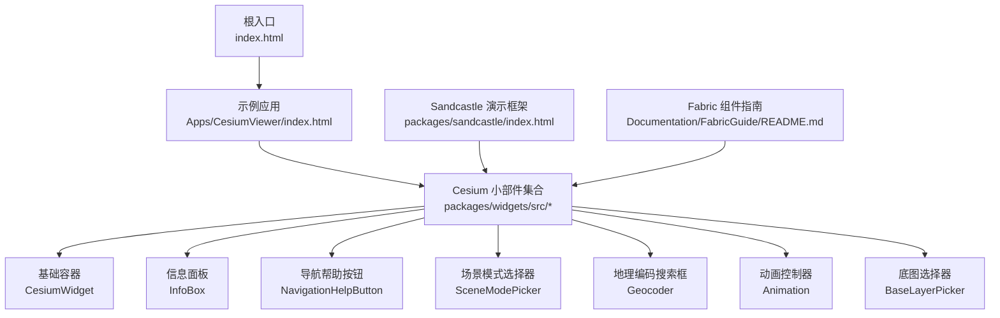
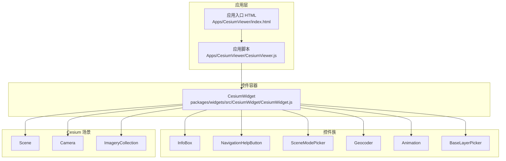
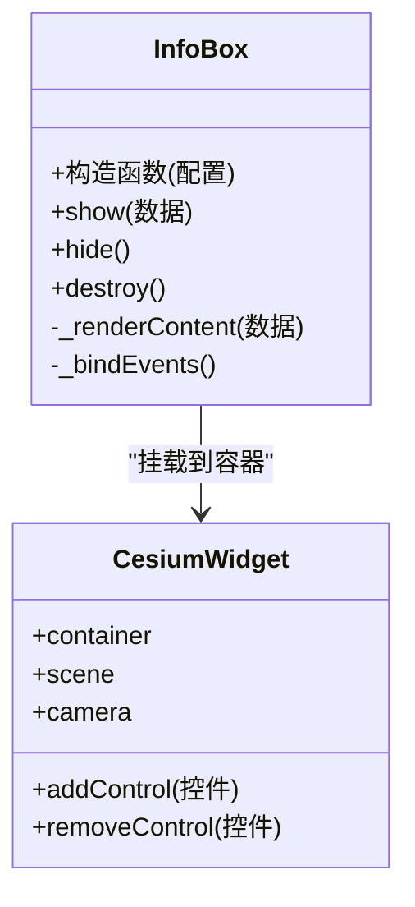
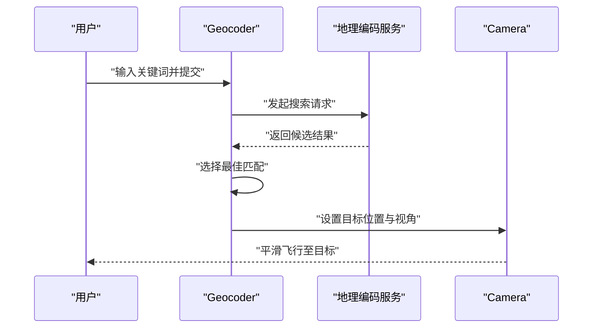
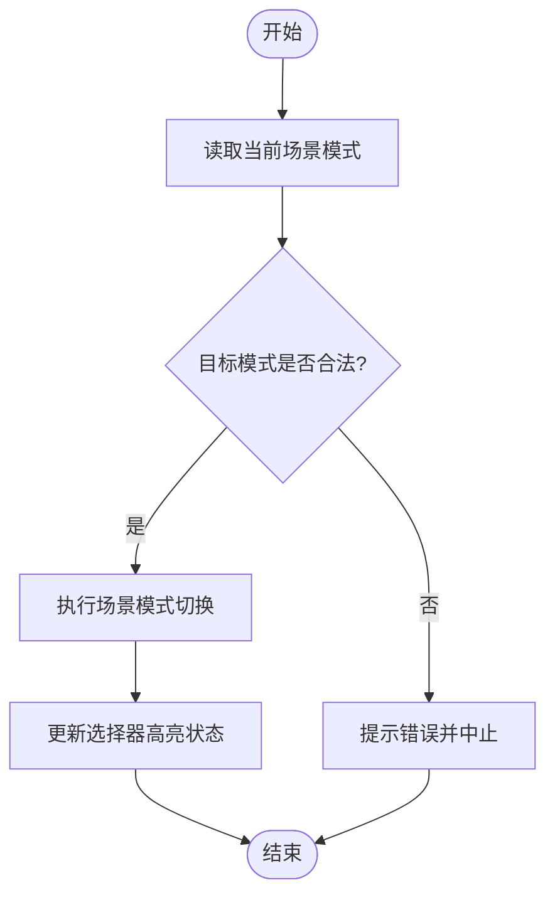
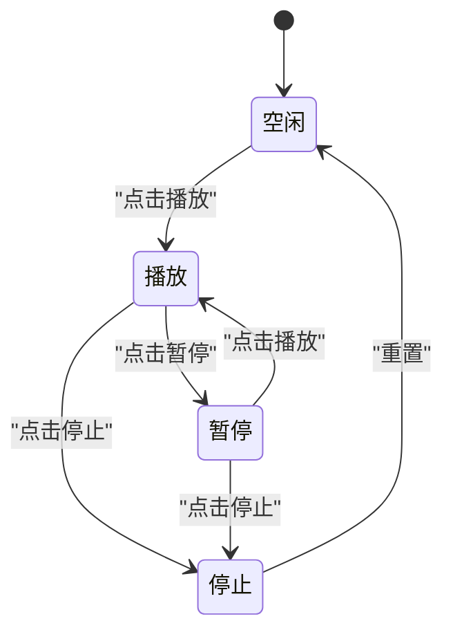
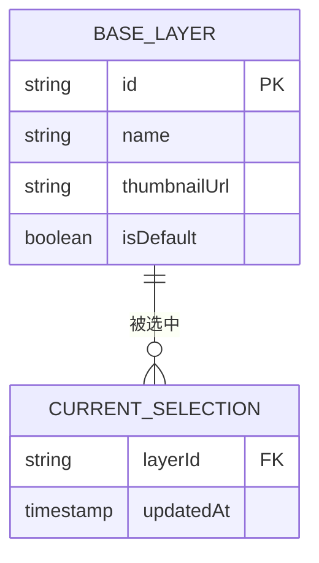
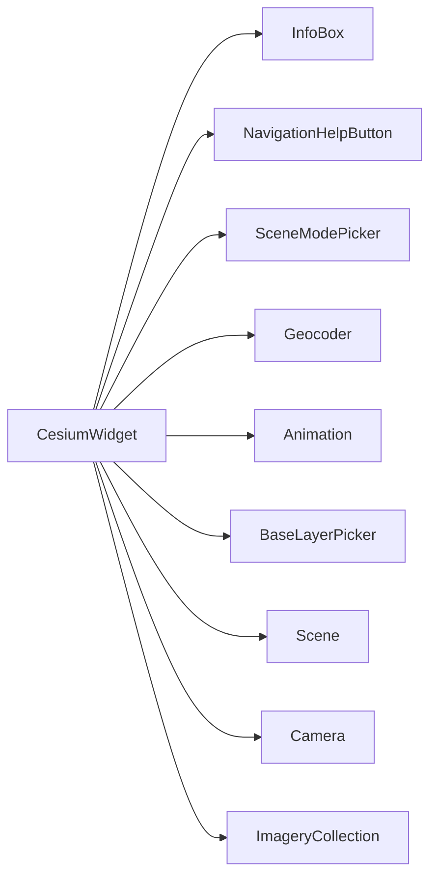

# 自定义控件开发

<cite>
**本文引用的文件**   
- [README.md](file://README.md)
- [index.html](file://index.html)
- [Apps/HelloWorld.html](file://Apps/HelloWorld.html)
- [Apps/CesiumViewer/CesiumViewer.js](file://Apps/CesiumViewer/CesiumViewer.js)
- [Apps/CesiumViewer/CesiumViewer.css](file://Apps/CesiumViewer/CesiumViewer.css)
- [Apps/CesiumViewer/index.html](file://Apps/CesiumViewer/index.html)
- [packages/widgets/src/InfoBox/InfoBox.js](file://packages/widgets/src/InfoBox/InfoBox.js)
- [packages/widgets/src/InfoBox/InfoBox.css](file://packages/widgets/src/InfoBox/InfoBox.css)
- [packages/widgets/src/NavigationHelpButton/NavigationHelpButton.js](file://packages/widgets/src/NavigationHelpButton/NavigationHelpButton.js)
- [packages/widgets/src/NavigationHelpButton/NavigationHelpButton.css](file://packages/widgets/src/NavigationHelpButton/NavigationHelpButton.css)
- [packages/widgets/src/SceneModePicker/SceneModePicker.js](file://packages/widgets/src/SceneModePicker/SceneModePicker.js)
- [packages/widgets/src/SceneModePicker/SceneModePicker.css](file://packages/widgets/src/SceneModePicker/SceneModePicker.css)
- [packages/widgets/src/Geocoder/Geocoder.js](file://packages/widgets/src/Geocoder/Geocoder.js)
- [packages/widgets/src/Geocoder/Geocoder.css](file://packages/widgets/src/Geocoder/Geocoder.css)
- [packages/widgets/src/Animation/Animation.js](file://packages/widgets/src/Animation/Animation.js)
- [packages/widgets/src/Animation/Animation.css](file://packages/widgets/src/Animation/Animation.css)
- [packages/widgets/src/BaseLayerPicker/BaseLayerPicker.js](file://packages/widgets/src/BaseLayerPicker/BaseLayerPicker.js)
- [packages/widgets/src/BaseLayerPicker/BaseLayerPicker.css](file://packages/widgets/src/BaseLayerPicker/BaseLayerPicker.css)
- [packages/widgets/src/CesiumWidget/CesiumWidget.js](file://packages/widgets/src/CesiumWidget/CesiumWidget.js)
- [packages/widgets/src/CesiumWidget/CesiumWidget.css](file://packages/widgets/src/CesiumWidget/CesiumWidget.css)
- [packages/sandcastle/index.html](file://packages/sandcastle/index.html)
- [Documentation/FabricGuide/README.md](file://Documentation/FabricGuide/README.md)
</cite>

## 目录
1. [简介](#简介)
2. [项目结构](#项目结构)
3. [核心组件](#核心组件)
4. [架构总览](#架构总览)
5. [详细组件分析](#详细组件分析)
6. [依赖分析](#依赖分析)
7. [性能考虑](#性能考虑)
8. [故障排查指南](#故障排查指南)
9. [结论](#结论)
10. [附录](#附录)

## 简介
本指南面向希望在 CesiumJS 中开发“自定义控件”的前端工程师与可视化开发者。内容覆盖：
- 控件基类的继承与扩展方法（生命周期、事件处理、状态同步）
- UI 布局设计、CSS 样式定制与响应式适配
- 与 Cesium 场景的集成（相机控制、图层管理、数据绑定）
- 配置管理、插件化架构、依赖注入等高级特性
- 测试策略、调试技巧、性能监控
- 多个实用的自定义控件完整示例（基于仓库内现有 Widgets 与示例应用）

## 项目结构
仓库采用多包组织，UI 控件集中在 packages/widgets 下；示例应用位于 Apps；Sandcastle 用于交互式演示；Fabric 文档提供组件声明式构建说明。

图表来源
- [index.html:1-200](file://index.html#L1-L200)
- [Apps/CesiumViewer/index.html:1-200](file://Apps/CesiumViewer/index.html#L1-L200)
- [packages/widgets/src/CesiumWidget/CesiumWidget.js:1-200](file://packages/widgets/src/CesiumWidget/CesiumWidget.js#L1-L200)
- [packages/widgets/src/InfoBox/InfoBox.js:1-200](file://packages/widgets/src/InfoBox/InfoBox.js#L1-L200)
- [packages/widgets/src/NavigationHelpButton/NavigationHelpButton.js:1-200](file://packages/widgets/src/NavigationHelpButton/NavigationHelpButton.js#L1-L200)
- [packages/widgets/src/SceneModePicker/SceneModePicker.js:1-200](file://packages/widgets/src/SceneModePicker/SceneModePicker.js#L1-L200)
- [packages/widgets/src/Geocoder/Geocoder.js:1-200](file://packages/widgets/src/Geocoder/Geocoder.js#L1-L200)
- [packages/widgets/src/Animation/Animation.js:1-200](file://packages/widgets/src/Animation/Animation.js#L1-L200)
- [packages/widgets/src/BaseLayerPicker/BaseLayerPicker.js:1-200](file://packages/widgets/src/BaseLayerPicker/BaseLayerPicker.js#L1-L200)
- [packages/sandcastle/index.html:1-200](file://packages/sandcastle/index.html#L1-L200)
- [Documentation/FabricGuide/README.md:1-200](file://Documentation/FabricGuide/README.md#L1-L200)

章节来源
- [README.md:1-200](file://README.md#L1-L200)
- [index.html:1-200](file://index.html#L1-L200)
- [Apps/CesiumViewer/index.html:1-200](file://Apps/CesiumViewer/index.html#L1-L200)
- [packages/sandcastle/index.html:1-200](file://packages/sandcastle/index.html#L1-L200)
- [Documentation/FabricGuide/README.md:1-200](file://Documentation/FabricGuide/README.md#L1-L200)

## 核心组件
本节聚焦 widgets 包中的关键控件，说明其职责、对外 API 与与场景的交互点。

- CesiumWidget
  - 职责：封装 Canvas、渲染循环、默认交互与常用 UI 容器的挂载点。
  - 典型用法：在页面容器中创建实例，并作为其他控件的宿主。
  - 与场景关系：持有 Scene、Camera、Canvas 等核心对象引用。
  - 参考路径：[packages/widgets/src/CesiumWidget/CesiumWidget.js](file://packages/widgets/src/CesiumWidget/CesiumWidget.js)

- InfoBox
  - 职责：展示选中要素的详细信息面板，支持动态更新内容与样式。
  - 典型用法：监听拾取事件，将结果写入 InfoBox 内容区。
  - 参考路径：[packages/widgets/src/InfoBox/InfoBox.js](file://packages/widgets/src/InfoBox/InfoBox.js)

- NavigationHelpButton
  - 职责：显示导航帮助提示，辅助用户理解鼠标/触摸操作。
  - 典型用法：添加到 CesiumWidget 容器右上角。
  - 参考路径：[packages/widgets/src/NavigationHelpButton/NavigationHelpButton.js](file://packages/widgets/src/NavigationHelpButton/NavigationHelpButton.js)

- SceneModePicker
  - 职责：切换 2D/3D/Columbus View 场景模式。
  - 典型用法：绑定到 CesiumWidget 的场景模式属性。
  - 参考路径：[packages/widgets/src/SceneModePicker/SceneModePicker.js](file://packages/widgets/src/SceneModePicker/SceneModePicker.js)

- Geocoder
  - 职责：地名搜索与定位，返回坐标或飞行动画。
  - 典型用法：输入关键词后调用内部查询服务，再驱动 Camera 飞行。
  - 参考路径：[packages/widgets/src/Geocoder/Geocoder.js](file://packages/widgets/src/Geocoder/Geocoder.js)

- Animation
  - 职责：时间轴播放控制，驱动时钟与时间相关的数据源。
  - 典型用法：与 Viewer 的 Clock 联动，控制播放/暂停/速度。
  - 参考路径：[packages/widgets/src/Animation/Animation.js](file://packages/widgets/src/Animation/Animation.js)

- BaseLayerPicker
  - 职责：底图切换，管理 ImageryProvider 列表与当前激活项。
  - 典型用法：初始化时传入可用的 ImageryProvider 集合。
  - 参考路径：[packages/widgets/src/BaseLayerPicker/BaseLayerPicker.js](file://packages/widgets/src/BaseLayerPicker/BaseLayerPicker.js)

章节来源
- [packages/widgets/src/CesiumWidget/CesiumWidget.js:1-200](file://packages/widgets/src/CesiumWidget/CesiumWidget.js#L1-L200)
- [packages/widgets/src/InfoBox/InfoBox.js:1-200](file://packages/widgets/src/InfoBox/InfoBox.js#L1-L200)
- [packages/widgets/src/NavigationHelpButton/NavigationHelpButton.js:1-200](file://packages/widgets/src/NavigationHelpButton/NavigationHelpButton.js#L1-L200)
- [packages/widgets/src/SceneModePicker/SceneModePicker.js:1-200](file://packages/widgets/src/SceneModePicker/SceneModePicker.js#L1-L200)
- [packages/widgets/src/Geocoder/Geocoder.js:1-200](file://packages/widgets/src/Geocoder/Geocoder.js#L1-L200)
- [packages/widgets/src/Animation/Animation.js:1-200](file://packages/widgets/src/Animation/Animation.js#L1-L200)
- [packages/widgets/src/BaseLayerPicker/BaseLayerPicker.js:1-200](file://packages/widgets/src/BaseLayerPicker/BaseLayerPicker.js#L1-L200)

## 架构总览
下图展示了“应用层 → 控件容器 → 具体控件 → Cesium 场景”的分层关系与数据流向。

图表来源
- [Apps/CesiumViewer/index.html:1-200](file://Apps/CesiumViewer/index.html#L1-L200)
- [Apps/CesiumViewer/CesiumViewer.js:1-200](file://Apps/CesiumViewer/CesiumViewer.js#L1-L200)
- [packages/widgets/src/CesiumWidget/CesiumWidget.js:1-200](file://packages/widgets/src/CesiumWidget/CesiumWidget.js#L1-L200)
- [packages/widgets/src/InfoBox/InfoBox.js:1-200](file://packages/widgets/src/InfoBox/InfoBox.js#L1-L200)
- [packages/widgets/src/NavigationHelpButton/NavigationHelpButton.js:1-200](file://packages/widgets/src/NavigationHelpButton/NavigationHelpButton.js#L1-L200)
- [packages/widgets/src/SceneModePicker/SceneModePicker.js:1-200](file://packages/widgets/src/SceneModePicker/SceneModePicker.js#L1-L200)
- [packages/widgets/src/Geocoder/Geocoder.js:1-200](file://packages/widgets/src/Geocoder/Geocoder.js#L1-L200)
- [packages/widgets/src/Animation/Animation.js:1-200](file://packages/widgets/src/Animation/Animation.js#L1-L200)
- [packages/widgets/src/BaseLayerPicker/BaseLayerPicker.js:1-200](file://packages/widgets/src/BaseLayerPicker/BaseLayerPicker.js#L1-L200)

## 详细组件分析

### 控件基类与生命周期（以 InfoBox 为例）
- 生命周期要点
  - 构造阶段：解析配置、创建 DOM 节点、注册事件监听。
  - 挂载阶段：插入到宿主容器（如 CesiumWidget 的 UI 层）。
  - 运行阶段：响应外部事件（如拾取）、更新内部状态与视图。
  - 销毁阶段：移除事件监听、释放资源、清理 DOM。
- 事件处理
  - 通过 Cesium 的事件系统订阅/发布，避免直接耦合。
  - 使用防抖/节流优化高频事件（如鼠标移动）。
- 状态同步
  - 单向数据流：外部状态变更 → 触发更新 → 重绘 UI。
  - 双向绑定可选：对表单类控件可引入轻量双向绑定。

图表来源
- [packages/widgets/src/InfoBox/InfoBox.js:1-200](file://packages/widgets/src/InfoBox/InfoBox.js#L1-L200)
- [packages/widgets/src/CesiumWidget/CesiumWidget.js:1-200](file://packages/widgets/src/CesiumWidget/CesiumWidget.js#L1-L200)

章节来源
- [packages/widgets/src/InfoBox/InfoBox.js:1-200](file://packages/widgets/src/InfoBox/InfoBox.js#L1-L200)
- [packages/widgets/src/CesiumWidget/CesiumWidget.js:1-200](file://packages/widgets/src/CesiumWidget/CesiumWidget.js#L1-L200)

### 相机控制与地理编码（Geocoder 工作流）
- 流程概述
  - 用户输入关键词 → 发起地理编码请求 → 解析结果 → 计算目标位置 → 驱动 Camera 飞行。
- 错误处理
  - 网络异常、无结果、权限限制等分支需给出友好提示。
- 性能优化
  - 请求去抖、结果缓存、失败重试策略。

图表来源
- [packages/widgets/src/Geocoder/Geocoder.js:1-200](file://packages/widgets/src/Geocoder/Geocoder.js#L1-L200)

章节来源
- [packages/widgets/src/Geocoder/Geocoder.js:1-200](file://packages/widgets/src/Geocoder/Geocoder.js#L1-L200)

### 场景模式切换（SceneModePicker 决策流程）
- 决策逻辑
  - 读取当前模式 → 校验目标模式合法性 → 执行切换 → 更新 UI 高亮。
- 副作用
  - 切换可能影响交互行为、渲染管线与性能特征。

图表来源
- [packages/widgets/src/SceneModePicker/SceneModePicker.js:1-200](file://packages/widgets/src/SceneModePicker/SceneModePicker.js#L1-L200)

章节来源
- [packages/widgets/src/SceneModePicker/SceneModePicker.js:1-200](file://packages/widgets/src/SceneModePicker/SceneModePicker.js#L1-L200)

### 动画控制器（Animation 状态机）
- 状态定义
  - 空闲、播放、暂停、停止。
- 状态转换
  - 播放/暂停/停止按钮驱动状态迁移，并与 Clock 同步。

图表来源
- [packages/widgets/src/Animation/Animation.js:1-200](file://packages/widgets/src/Animation/Animation.js#L1-L200)

章节来源
- [packages/widgets/src/Animation/Animation.js:1-200](file://packages/widgets/src/Animation/Animation.js#L1-L200)

### 底图选择器（BaseLayerPicker 数据绑定）
- 数据模型
  - 可用底图列表、当前激活项、预览缩略图。
- 绑定机制
  - 选择项变更 → 更新 ImageryCollection → 触发重绘。

图表来源
- [packages/widgets/src/BaseLayerPicker/BaseLayerPicker.js:1-200](file://packages/widgets/src/BaseLayerPicker/BaseLayerPicker.js#L1-L200)

章节来源
- [packages/widgets/src/BaseLayerPicker/BaseLayerPicker.js:1-200](file://packages/widgets/src/BaseLayerPicker/BaseLayerPicker.js#L1-L200)

### 导航帮助按钮（NavigationHelpButton 交互提示）
- 功能要点
  - 根据当前场景模式动态显示帮助文案。
  - 支持关闭与重新打开。
- 交互细节
  - 首次加载自动弹出，用户可手动关闭。

章节来源
- [packages/widgets/src/NavigationHelpButton/NavigationHelpButton.js:1-200](file://packages/widgets/src/NavigationHelpButton/NavigationHelpButton.js#L1-L200)

## 依赖分析
- 组件耦合
  - CesiumWidget 作为容器，聚合多个控件实例，降低应用层复杂度。
  - 各控件通过 Cesium 事件系统与场景对象进行松耦合通信。
- 外部依赖
  - Cesium 核心库（Scene、Camera、ImageryCollection、Clock 等）。
  - 第三方 UI 库（如有）应通过 CDN 或打包工具引入。
- 潜在循环依赖
  - 建议通过事件总线或回调接口解耦，避免直接相互引用。

图表来源
- [packages/widgets/src/CesiumWidget/CesiumWidget.js:1-200](file://packages/widgets/src/CesiumWidget/CesiumWidget.js#L1-L200)
- [packages/widgets/src/InfoBox/InfoBox.js:1-200](file://packages/widgets/src/InfoBox/InfoBox.js#L1-L200)
- [packages/widgets/src/NavigationHelpButton/NavigationHelpButton.js:1-200](file://packages/widgets/src/NavigationHelpButton/NavigationHelpButton.js#L1-L200)
- [packages/widgets/src/SceneModePicker/SceneModePicker.js:1-200](file://packages/widgets/src/SceneModePicker/SceneModePicker.js#L1-L200)
- [packages/widgets/src/Geocoder/Geocoder.js:1-200](file://packages/widgets/src/Geocoder/Geocoder.js#L1-L200)
- [packages/widgets/src/Animation/Animation.js:1-200](file://packages/widgets/src/Animation/Animation.js#L1-L200)
- [packages/widgets/src/BaseLayerPicker/BaseLayerPicker.js:1-200](file://packages/widgets/src/BaseLayerPicker/BaseLayerPicker.js#L1-L200)

章节来源
- [packages/widgets/src/CesiumWidget/CesiumWidget.js:1-200](file://packages/widgets/src/CesiumWidget/CesiumWidget.js#L1-L200)

## 性能考虑
- 渲染与绘制
  - 减少不必要的重绘，合并多次状态更新为一次批量更新。
  - 合理使用 requestAnimationFrame 与帧率控制。
- 事件与交互
  - 对高频事件（mousemove、wheel）进行节流/防抖。
  - 避免在事件回调中进行昂贵计算，必要时异步派发。
- 资源管理
  - 及时销毁不再使用的控件与监听器，防止内存泄漏。
  - 图片与纹理按需加载，启用缓存策略。
- 数据绑定
  - 优先使用单向数据流，仅在必要处引入双向绑定。
  - 大列表虚拟化渲染，避免一次性渲染过多 DOM。

## 故障排查指南
- 常见问题
  - 控件未显示：检查容器尺寸与 CSS z-index；确认已正确挂载到 CesiumWidget。
  - 事件不触发：确认事件监听器是否正确注册与销毁；检查事件冒泡与捕获顺序。
  - 相机飞行异常：验证目标坐标与视锥体参数；检查是否处于合适的场景模式。
  - 底图不更新：确认 ImageryProvider 配置与网络可达性；检查跨域与鉴权。
- 调试技巧
  - 使用浏览器开发者工具的 Performance 面板分析帧耗时。
  - 在关键路径添加日志输出，区分不同环境（开发/生产）。
  - 利用 Sandcastle 快速复现问题与验证修复。
- 参考路径
  - 示例应用与样式：[Apps/CesiumViewer/CesiumViewer.js](file://Apps/CesiumViewer/CesiumViewer.js)、[Apps/CesiumViewer/CesiumViewer.css](file://Apps/CesiumViewer/CesiumViewer.css)
  - 控件样式：各控件对应的 .css 文件（见“核心组件”部分）

章节来源
- [Apps/CesiumViewer/CesiumViewer.js:1-200](file://Apps/CesiumViewer/CesiumViewer.js#L1-L200)
- [Apps/CesiumViewer/CesiumViewer.css:1-200](file://Apps/CesiumViewer/CesiumViewer.css#L1-L200)
- [packages/widgets/src/InfoBox/InfoBox.css:1-200](file://packages/widgets/src/InfoBox/InfoBox.css#L1-L200)
- [packages/widgets/src/NavigationHelpButton/NavigationHelpButton.css:1-200](file://packages/widgets/src/NavigationHelpButton/NavigationHelpButton.css#L1-L200)
- [packages/widgets/src/SceneModePicker/SceneModePicker.css:1-200](file://packages/widgets/src/SceneModePicker/SceneModePicker.css#L1-L200)
- [packages/widgets/src/Geocoder/Geocoder.css:1-200](file://packages/widgets/src/Geocoder/Geocoder.css#L1-L200)
- [packages/widgets/src/Animation/Animation.css:1-200](file://packages/widgets/src/Animation/Animation.css#L1-L200)
- [packages/widgets/src/BaseLayerPicker/BaseLayerPicker.css:1-200](file://packages/widgets/src/BaseLayerPicker/BaseLayerPicker.css#L1-L200)
- [packages/widgets/src/CesiumWidget/CesiumWidget.css:1-200](file://packages/widgets/src/CesiumWidget/CesiumWidget.css#L1-L200)

## 结论
通过在 CesiumWidget 上组合与扩展现有控件，可以快速构建功能完备的三维可视化界面。遵循统一的生命周期与事件模型，结合合理的 CSS 布局与响应式策略，能够保证良好的用户体验与可维护性。借助 Fabric 指南与 Sandcastle，可以进一步实现声明式组件与高效原型验证。

## 附录

### 实用示例清单（基于仓库现有代码）
- 基础容器与示例应用
  - 入口与示例页面：[index.html](file://index.html)、[Apps/HelloWorld.html](file://Apps/HelloWorld.html)
  - 示例应用脚本与样式：[Apps/CesiumViewer/CesiumViewer.js](file://Apps/CesiumViewer/CesiumViewer.js)、[Apps/CesiumViewer/CesiumViewer.css](file://Apps/CesiumViewer/CesiumViewer.css)、[Apps/CesiumViewer/index.html](file://Apps/CesiumViewer/index.html)
- 控件与样式
  - 信息面板：[packages/widgets/src/InfoBox/InfoBox.js](file://packages/widgets/src/InfoBox/InfoBox.js)、[packages/widgets/src/InfoBox/InfoBox.css](file://packages/widgets/src/InfoBox/InfoBox.css)
  - 导航帮助按钮：[packages/widgets/src/NavigationHelpButton/NavigationHelpButton.js](file://packages/widgets/src/NavigationHelpButton/NavigationHelpButton.js)、[packages/widgets/src/NavigationHelpButton/NavigationHelpButton.css](file://packages/widgets/src/NavigationHelpButton/NavigationHelpButton.css)
  - 场景模式选择器：[packages/widgets/src/SceneModePicker/SceneModePicker.js](file://packages/widgets/src/SceneModePicker/SceneModePicker.js)、[packages/widgets/src/SceneModePicker/SceneModePicker.css](file://packages/widgets/src/SceneModePicker/SceneModePicker.css)
  - 地理编码搜索框：[packages/widgets/src/Geocoder/Geocoder.js](file://packages/widgets/src/Geocoder/Geocoder.js)、[packages/widgets/src/Geocoder/Geocoder.css](file://packages/widgets/src/Geocoder/Geocoder.css)
  - 动画控制器：[packages/widgets/src/Animation/Animation.js](file://packages/widgets/src/Animation/Animation.js)、[packages/widgets/src/Animation/Animation.css](file://packages/widgets/src/Animation/Animation.css)
  - 底图选择器：[packages/widgets/src/BaseLayerPicker/BaseLayerPicker.js](file://packages/widgets/src/BaseLayerPicker/BaseLayerPicker.js)、[packages/widgets/src/BaseLayerPicker/BaseLayerPicker.css](file://packages/widgets/src/BaseLayerPicker/BaseLayerPicker.css)
  - 基础容器：[packages/widgets/src/CesiumWidget/CesiumWidget.js](file://packages/widgets/src/CesiumWidget/CesiumWidget.js)、[packages/widgets/src/CesiumWidget/CesiumWidget.css](file://packages/widgets/src/CesiumWidget/CesiumWidget.css)
- 演示与组件指南
  - Sandcastle 演示框架：[packages/sandcastle/index.html](file://packages/sandcastle/index.html)
  - Fabric 组件指南：[Documentation/FabricGuide/README.md](file://Documentation/FabricGuide/README.md)