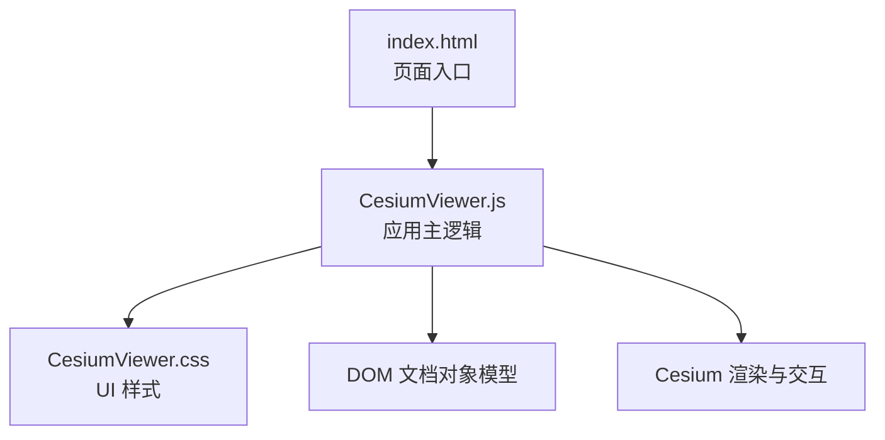
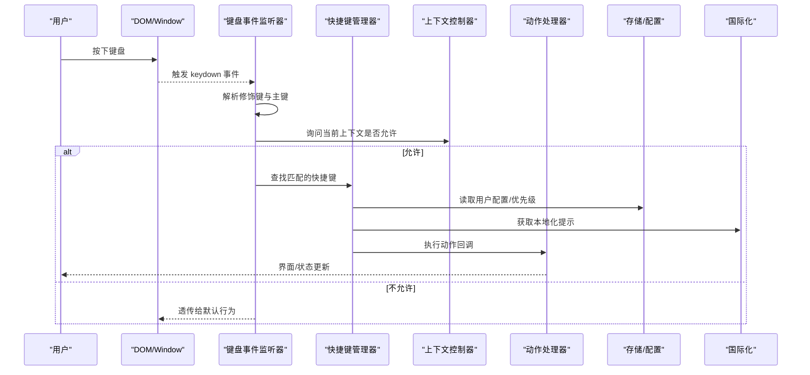
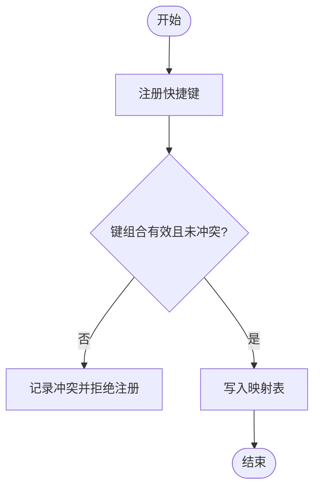
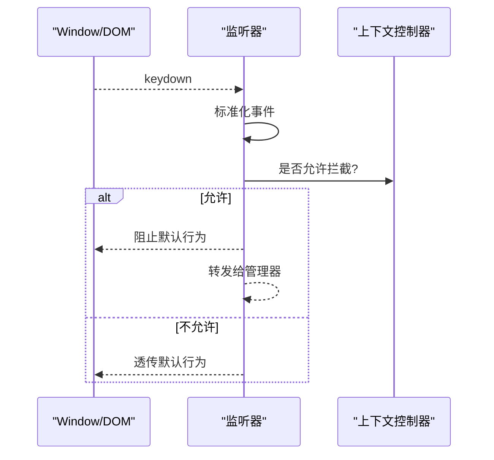
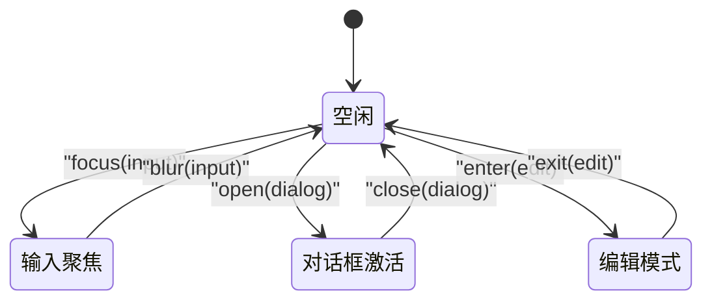
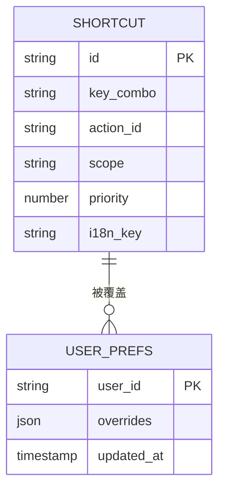
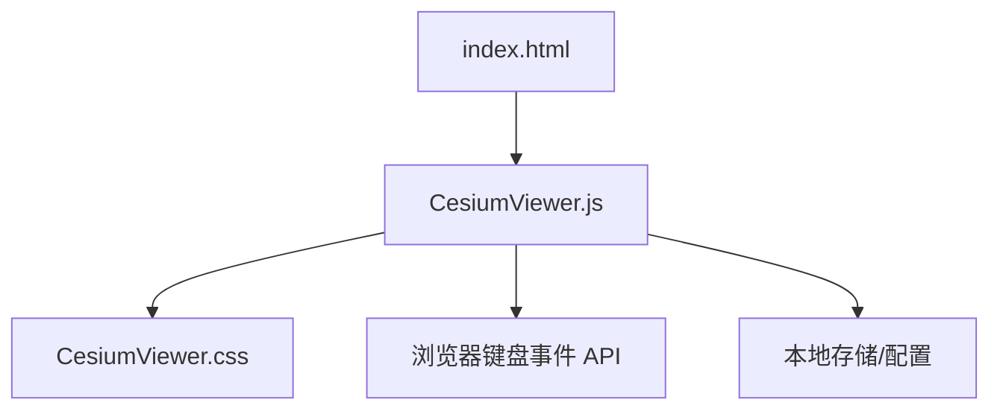

# 键盘快捷键系统

<cite>
**本文引用的文件**   
- [CesiumViewer.js](file://Apps/CesiumViewer/CesiumViewer.js)
- [index.html](file://Apps/CesiumViewer/index.html)
- [CesiumViewer.css](file://Apps/CesiumViewer/CesiumViewer.css)
- [README.md](file://Documentation/Contributors/README.md)
</cite>

## 目录
1. [简介](#简介)
2. [项目结构](#项目结构)
3. [核心组件](#核心组件)
4. [架构总览](#架构总览)
5. [详细组件分析](#详细组件分析)
6. [依赖分析](#依赖分析)
7. [性能考虑](#性能考虑)
8. [故障排查指南](#故障排查指南)
9. [结论](#结论)
10. [附录](#附录)

## 简介
本指南面向在 CesiumJS 应用中构建“键盘快捷键系统”的开发者，目标是提供一套可落地的实现方案与最佳实践。内容覆盖：
- 注册与管理键盘事件（按键组合识别、冲突处理、动态绑定）
- 常用快捷键模式示例（如 Ctrl+C 复制、Delete 删除、空格暂停）
- 全局快捷键与场景内快捷键的区别与策略
- 快捷键配置管理、用户自定义设置、国际化支持等高级特性
- 完整的键盘事件处理架构设计与落地建议

说明：当前仓库未包含现成的快捷键模块实现，因此本文以工程现有入口与 UI 为切入点，给出基于浏览器原生键盘事件的通用架构与集成方式，并指明在何处接入。

## 项目结构
从应用入口与视图层入手，理解键盘事件应挂载的位置与生命周期：
- 应用入口页面：用于初始化 Viewer 与加载主逻辑
- 主逻辑脚本：负责业务初始化、事件绑定与交互控制
- 样式文件：承载与快捷键相关的 UI 提示（如工具栏按钮的快捷键标注）

图表来源
- [index.html](file://Apps/CesiumViewer/index.html)
- [CesiumViewer.js](file://Apps/CesiumViewer/CesiumViewer.js)
- [CesiumViewer.css](file://Apps/CesiumViewer/CesiumViewer.css)

章节来源
- [index.html](file://Apps/CesiumViewer/index.html)
- [CesiumViewer.js](file://Apps/CesiumViewer/CesiumViewer.js)
- [CesiumViewer.css](file://Apps/CesiumViewer/CesiumViewer.css)

## 核心组件
为实现健壮的快捷键系统，建议将以下职责拆分为独立模块或类：
- 快捷键管理器（KeyboardShortcutManager）
  - 维护快捷键映射表（键组合 -> 动作回调）
  - 提供注册、注销、查询、批量导入导出接口
  - 内置冲突检测与优先级策略
- 键盘事件监听器（KeyboardEventDispatcher）
  - 统一捕获 keydown/keyup 事件
  - 解析修饰键（Ctrl/Alt/Shift/Meta）与主键
  - 根据上下文（全局/场景内）路由到对应处理器
- 上下文控制器（ContextController）
  - 维护当前焦点域（例如：输入框、画布、弹窗）
  - 决定某次按键是否被拦截或透传
- 配置与持久化（ConfigStore）
  - 读取默认配置与用户自定义配置
  - 支持导入/导出、版本迁移
- 国际化（I18n）
  - 为快捷键提示、错误消息提供多语言文本

以上组件的职责边界清晰、耦合度低，便于扩展与维护。

章节来源
- [CesiumViewer.js](file://Apps/CesiumViewer/CesiumViewer.js)

## 架构总览
下图展示快捷键系统在应用中的整体位置与数据流：

图表来源
- [CesiumViewer.js](file://Apps/CesiumViewer/CesiumViewer.js)
- [index.html](file://Apps/CesiumViewer/index.html)

## 详细组件分析

### 快捷键管理器（KeyboardShortcutManager）
职责
- 维护键组合到动作的映射
- 提供注册/注销/查询/批量导入导出
- 冲突检测与优先级策略（按作用域、层级、显式优先级）
- 支持动态绑定（运行时增删改）

关键流程
- 注册：校验键组合唯一性，写入映射表，必要时生成调试日志
- 匹配：对每次按键事件，计算规范化键码与修饰键集合，查找候选
- 冲突：若存在多个候选，依据优先级与作用域选择最终处理器
- 执行：调用动作回调，返回布尔值表示是否已处理（用于阻止默认行为）

复杂度
- 注册/注销：O(1)
- 匹配：O(k)，k 为候选数量（通常很小）
- 冲突解决：O(p)，p 为同键组合的处理器数量

优化建议
- 使用哈希表存储键组合指纹（如 "ctrl+c"）
- 预编译键组合字符串，避免重复拼接
- 对高频路径进行缓存命中统计，辅助调优

图表来源
- [CesiumViewer.js](file://Apps/CesiumViewer/CesiumViewer.js)

章节来源
- [CesiumViewer.js](file://Apps/CesiumViewer/CesiumViewer.js)

### 键盘事件监听器（KeyboardEventDispatcher）
职责
- 在 Window 或指定容器上监听 keydown/keyup
- 标准化事件信息（键码、修饰键、是否输入法中）
- 根据上下文决定是否拦截

关键点
- 区分全局与场景内：当焦点位于输入控件时，优先交由输入控件处理
- 忽略重复触发：节流/去抖或忽略 repeat 事件
- 兼容平台差异：Meta 键在不同平台的语义不同

图表来源
- [CesiumViewer.js](file://Apps/CesiumViewer/CesiumViewer.js)
- [index.html](file://Apps/CesiumViewer/index.html)

章节来源
- [CesiumViewer.js](file://Apps/CesiumViewer/CesiumViewer.js)
- [index.html](file://Apps/CesiumViewer/index.html)

### 上下文控制器（ContextController）
职责
- 维护当前焦点域（如：输入框、弹窗、地图画布）
- 提供“是否允许快捷键生效”的判断
- 支持临时屏蔽（如全屏编辑模式）

典型规则
- 当焦点在输入控件时，仅放行导航类快捷键（如 Esc、Tab）
- 当打开对话框时，对话框内的快捷键优先
- 当进入录制/编辑模式时，切换至该模式的快捷键集

图表来源
- [CesiumViewer.js](file://Apps/CesiumViewer/CesiumViewer.js)

章节来源
- [CesiumViewer.js](file://Apps/CesiumViewer/CesiumViewer.js)

### 配置与持久化（ConfigStore）
职责
- 提供默认快捷键定义与用户自定义覆盖
- 支持导入/导出 JSON 配置
- 版本迁移与兼容性检查

数据结构要点
- 键组合：字符串指纹（如 "ctrl+shift+s"）
- 动作标识：字符串 ID，指向具体处理器
- 作用域：全局/局部（如 scene、dialog）
- 优先级：数值越大优先级越高
- 国际化键：用于提示文案的多语言映射

图表来源
- [CesiumViewer.js](file://Apps/CesiumViewer/CesiumViewer.js)

章节来源
- [CesiumViewer.js](file://Apps/CesiumViewer/CesiumViewer.js)

### 国际化（I18n）
职责
- 为快捷键提示、错误消息提供多语言文本
- 支持运行时切换语言
- 与配置联动，使同一快捷键在不同语言下显示不同的提示

章节来源
- [CesiumViewer.js](file://Apps/CesiumViewer/CesiumViewer.js)

### 常用快捷键模式示例
以下为常见模式及实现要点（不直接粘贴代码，仅提供思路与参考位置）：
- Ctrl+C 复制
  - 仅在选中内容可用时启用
  - 若焦点在输入框则透传
  - 参考位置：[CesiumViewer.js](file://Apps/CesiumViewer/CesiumViewer.js)
- Delete 删除
  - 需二次确认（防误删）
  - 在编辑模式下才生效
  - 参考位置：[CesiumViewer.js](file://Apps/CesiumViewer/CesiumViewer.js)
- 空格 暂停/播放
  - 与媒体或时间轴相关
  - 需要忽略输入框焦点
  - 参考位置：[CesiumViewer.js](file://Apps/CesiumViewer/CesiumViewer.js)

章节来源
- [CesiumViewer.js](file://Apps/CesiumViewer/CesiumViewer.js)

### 全局快捷键 vs 场景内快捷键
- 全局快捷键
  - 在任何焦点下均生效（除少数系统保留键）
  - 适合应用级操作（如保存、切换主题）
- 场景内快捷键
  - 仅在特定上下文（如地图画布）生效
  - 适合导航、缩放、图层控制等
- 冲突处理策略
  - 优先级：全局 < 场景内 < 对话框内
  - 显式优先级字段覆盖默认顺序
  - 冲突告警与回退机制

章节来源
- [CesiumViewer.js](file://Apps/CesiumViewer/CesiumViewer.js)

## 依赖分析
快捷键系统与现有应用的依赖关系如下：
- 入口页面 index.html 负责初始化应用与加载主逻辑
- 主逻辑 CesiumViewer.js 负责事件绑定与业务编排
- 样式 CesiumViewer.css 承载快捷键提示 UI

图表来源
- [index.html](file://Apps/CesiumViewer/index.html)
- [CesiumViewer.js](file://Apps/CesiumViewer/CesiumViewer.js)
- [CesiumViewer.css](file://Apps/CesiumViewer/CesiumViewer.css)

章节来源
- [index.html](file://Apps/CesiumViewer/index.html)
- [CesiumViewer.js](file://Apps/CesiumViewer/CesiumViewer.js)
- [CesiumViewer.css](file://Apps/CesiumViewer/CesiumViewer.css)

## 性能考虑
- 事件频率高：避免在 keydown 中执行重计算；使用轻量匹配与缓存
- 减少 DOM 操作：批量更新 UI 提示，避免频繁重排
- 合理节流：对非即时反馈的操作（如导出配置）进行节流
- 内存占用：及时注销不再使用的快捷键，防止泄漏
- 可观测性：收集命中率与冲突次数，辅助定位热点与问题

## 故障排查指南
常见问题与定位步骤：
- 快捷键无效
  - 检查当前上下文是否允许拦截
  - 查看是否存在更高优先级的处理器
  - 确认键组合指纹是否正确（大小写、修饰键顺序）
- 冲突导致行为异常
  - 输出冲突清单，调整优先级或作用域
  - 引入“禁用列表”或“白名单”机制
- 输入法干扰
  - 忽略 IME 状态下的字符输入事件
  - 仅对非字符键或修饰键组合生效
- 国际化缺失
  - 检查 i18n 键是否存在
  - 确保语言切换后提示同步更新

章节来源
- [CesiumViewer.js](file://Apps/CesiumViewer/CesiumViewer.js)

## 结论
通过模块化设计（管理器、监听器、上下文、配置、国际化），可以在 CesiumJS 应用中构建稳定、可扩展的键盘快捷键系统。遵循“最小拦截、明确优先级、可配置、可观测”的原则，既能保证用户体验，又便于长期维护与演进。

## 附录
- 开发规范与贡献指南可参考：
  - [README.md](file://Documentation/Contributors/README.md)

章节来源
- [README.md](file://Documentation/Contributors/README.md)