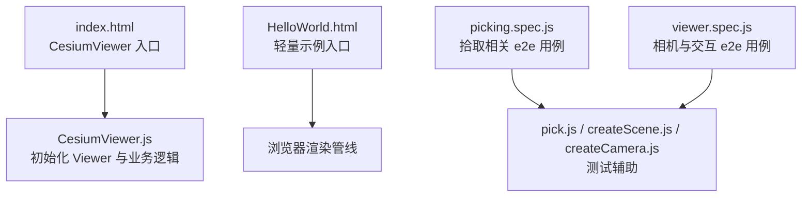
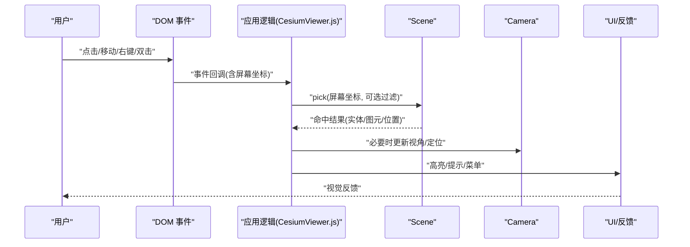
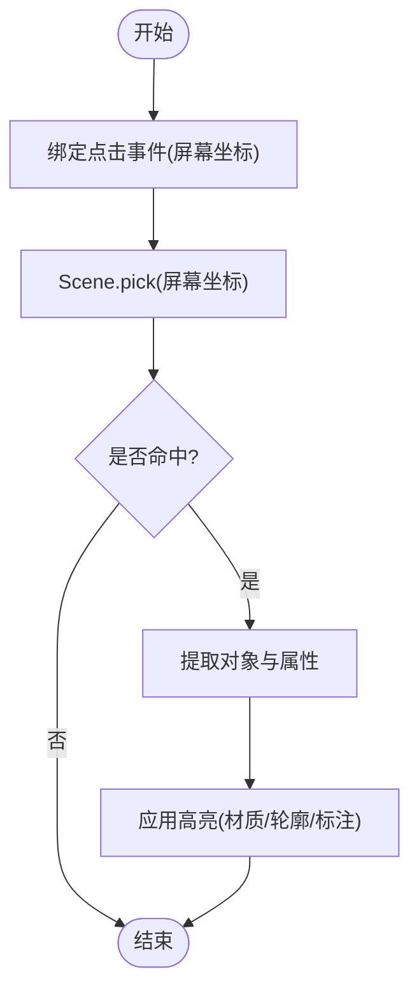
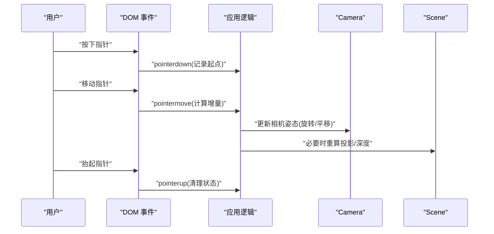
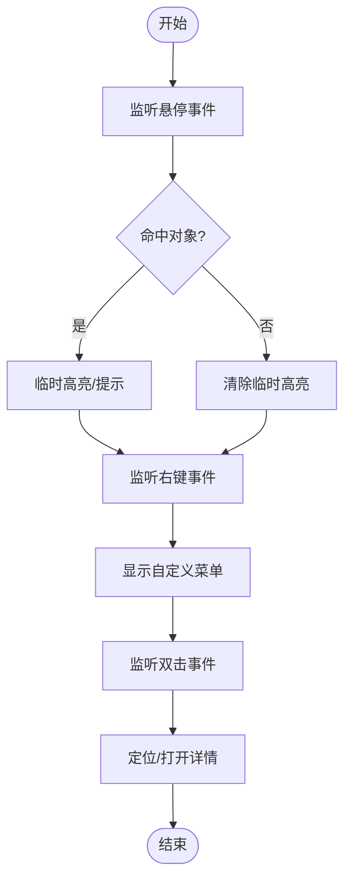
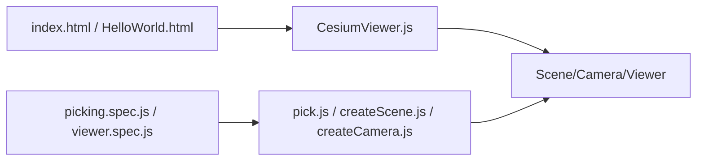

# 鼠标交互操作

<cite>
**本文引用的文件**   
- [Apps/CesiumViewer/CesiumViewer.js](file://Apps/CesiumViewer/CesiumViewer.js)
- [Apps/CesiumViewer/index.html](file://Apps/CesiumViewer/index.html)
- [Apps/HelloWorld.html](file://Apps/HelloWorld.html)
- [Specs/e2e/picking.spec.js](file://Specs/e2e/picking.spec.js)
- [Specs/e2e/viewer.spec.js](file://Specs/e2e/viewer.spec.js)
- [Specs/pick.js](file://Specs/pick.js)
- [Specs/createScene.js](file://Specs/createScene.js)
- [Specs/createCamera.js](file://Specs/createCamera.js)
</cite>

## 目录
1. [简介](#简介)
2. [项目结构](#项目结构)
3. [核心组件](#核心组件)
4. [架构总览](#架构总览)
5. [详细组件分析](#详细组件分析)
6. [依赖关系分析](#依赖关系分析)
7. [性能考虑](#性能考虑)
8. [故障排查指南](#故障排查指南)
9. [结论](#结论)
10. [附录](#附录)

## 简介
本文件面向在 CesiumJS 项目中实现“鼠标交互”的开发者，聚焦以下目标：
- 鼠标点击拾取：3D 对象选择、属性获取与高亮显示
- 拖拽自定义：平移、旋转、缩放的监听、坐标转换与状态管理
- 高级交互：悬停效果、右键菜单、双击操作
- 拾取算法优化、性能调优与兼容性处理最佳实践
- 每个示例均给出可运行的最小化步骤与源码路径指引（以仓库内现有示例为基础）

## 项目结构
仓库中与鼠标交互最相关的入口与示例位于 Apps 与 Specs 目录：
- Apps/CesiumViewer：包含一个基于 Viewer 的最小应用，适合扩展鼠标交互逻辑
- Apps/HelloWorld.html：更轻量的入门页面，便于快速验证交互
- Specs/e2e：端到端测试用例，覆盖拾取、相机控制等交互行为
- Specs/pick.js、createScene.js、createCamera.js：提供场景与相机创建辅助，便于构造交互测试环境

图表来源
- [Apps/CesiumViewer/index.html](file://Apps/CesiumViewer/index.html)
- [Apps/CesiumViewer/CesiumViewer.js](file://Apps/CesiumViewer/CesiumViewer.js)
- [Apps/HelloWorld.html](file://Apps/HelloWorld.html)
- [Specs/e2e/picking.spec.js](file://Specs/e2e/picking.spec.js)
- [Specs/e2e/viewer.spec.js](file://Specs/e2e/viewer.spec.js)
- [Specs/pick.js](file://Specs/pick.js)
- [Specs/createScene.js](file://Specs/createScene.js)
- [Specs/createCamera.js](file://Specs/createCamera.js)

章节来源
- [Apps/CesiumViewer/index.html](file://Apps/CesiumViewer/index.html)
- [Apps/CesiumViewer/CesiumViewer.js](file://Apps/CesiumViewer/CesiumViewer.js)
- [Apps/HelloWorld.html](file://Apps/HelloWorld.html)
- [Specs/e2e/picking.spec.js](file://Specs/e2e/picking.spec.js)
- [Specs/e2e/viewer.spec.js](file://Specs/e2e/viewer.spec.js)
- [Specs/pick.js](file://Specs/pick.js)
- [Specs/createScene.js](file://Specs/createScene.js)
- [Specs/createCamera.js](file://Specs/createCamera.js)

## 核心组件
- Viewer 实例：承载场景、图层、相机与默认交互控制器（如左键旋转、滚轮缩放、中键平移）。可通过配置禁用或替换默认行为，以便接入自定义交互。
- Scene 与 Camera：用于执行拾取射线计算、坐标变换与视图更新。
- 事件系统：通过 DOM 事件（pointerdown/move/up、contextmenu、dblclick 等）与 Cesium 内部事件协作，完成从屏幕坐标到世界坐标的转换与对象命中判定。
- 高亮与反馈：通过材质切换、轮廓绘制、标注弹窗等方式对选中对象进行视觉反馈。

章节来源
- [Apps/CesiumViewer/CesiumViewer.js](file://Apps/CesiumViewer/CesiumViewer.js)
- [Specs/e2e/picking.spec.js](file://Specs/e2e/picking.spec.js)
- [Specs/e2e/viewer.spec.js](file://Specs/e2e/viewer.spec.js)

## 架构总览
下图展示了“鼠标交互”在 Cesium 中的典型数据流与控制流：用户输入经 DOM 事件进入应用层，应用层调用 Scene.pick 进行命中检测，随后更新 UI 状态并触发后续业务逻辑。

图表来源
- [Apps/CesiumViewer/CesiumViewer.js](file://Apps/CesiumViewer/CesiumViewer.js)
- [Specs/e2e/picking.spec.js](file://Specs/e2e/picking.spec.js)
- [Specs/e2e/viewer.spec.js](file://Specs/e2e/viewer.spec.js)

## 详细组件分析

### 示例一：点击拾取（选择、属性获取、高亮）
目标
- 点击 3D 对象后，识别命中对象
- 读取对象属性（如名称、ID、自定义属性）
- 对命中对象进行高亮显示

实现要点
- 在容器上监听 pointerdown/click 事件，记录屏幕坐标
- 使用 Scene.pick 将屏幕坐标转换为命中结果
- 根据命中结果类型（Entity、Primitive、Model 等）提取属性
- 通过修改材质、添加轮廓或弹出信息窗体实现高亮反馈

参考路径
- 点击拾取流程与断言参考：[picking.spec.js](file://Specs/e2e/picking.spec.js)
- 场景与相机构建参考：[createScene.js](file://Specs/createScene.js)、[createCamera.js](file://Specs/createCamera.js)
- 应用入口与集成点：[CesiumViewer.js](file://Apps/CesiumViewer/CesiumViewer.js)

图表来源
- [Specs/e2e/picking.spec.js](file://Specs/e2e/picking.spec.js)
- [Specs/createScene.js](file://Specs/createScene.js)
- [Specs/createCamera.js](file://Specs/createCamera.js)
- [Apps/CesiumViewer/CesiumViewer.js](file://Apps/CesiumViewer/CesiumViewer.js)

章节来源
- [Specs/e2e/picking.spec.js](file://Specs/e2e/picking.spec.js)
- [Specs/createScene.js](file://Specs/createScene.js)
- [Specs/createCamera.js](file://Specs/createCamera.js)
- [Apps/CesiumViewer/CesiumViewer.js](file://Apps/CesiumViewer/CesiumViewer.js)

### 示例二：拖拽自定义（平移、旋转、缩放）
目标
- 自定义左键拖拽旋转、中键拖拽平移、滚轮缩放
- 支持触摸设备的双指捏合缩放与单指拖动

实现要点
- 事件监听：pointerdown/move/up、wheel、touchstart/move/end
- 状态管理：维护当前操作模式（旋转/平移/缩放）、起始位置、增量计算
- 坐标转换：屏幕坐标到世界坐标（地面投影或射线交点），相机姿态矩阵与四元数运算
- 冲突处理：与默认控制器交互开关（enableRotate/enableTranslate/enableZoom）

参考路径
- 相机与交互 e2e 用例参考：[viewer.spec.js](file://Specs/e2e/viewer.spec.js)
- 场景与相机构建参考：[createScene.js](file://Specs/createScene.js)、[createCamera.js](file://Specs/createCamera.js)
- 应用入口与集成点：[CesiumViewer.js](file://Apps/CesiumViewer/CesiumViewer.js)

图表来源
- [Specs/e2e/viewer.spec.js](file://Specs/e2e/viewer.spec.js)
- [Specs/createScene.js](file://Specs/createScene.js)
- [Specs/createCamera.js](file://Specs/createCamera.js)
- [Apps/CesiumViewer/CesiumViewer.js](file://Apps/CesiumViewer/CesiumViewer.js)

章节来源
- [Specs/e2e/viewer.spec.js](file://Specs/e2e/viewer.spec.js)
- [Specs/createScene.js](file://Specs/createScene.js)
- [Specs/createCamera.js](file://Specs/createCamera.js)
- [Apps/CesiumViewer/CesiumViewer.js](file://Apps/CesiumViewer/CesiumViewer.js)

### 示例三：悬停效果、右键菜单、双击操作
目标
- 鼠标悬停时改变光标样式或临时高亮
- 右键弹出上下文菜单（复制坐标、查看属性、定位到对象等）
- 双击快速定位到对象或打开详情面板

实现要点
- 悬停：pointerenter/pointerleave 或 mouseover/mouseout，结合 pick 做轻量命中判断
- 右键：contextmenu 阻止默认菜单，自定义菜单项；注意移动端长按模拟
- 双击：dblclick 事件，结合最近一次命中结果执行定位或展示详情

参考路径
- 基础页面与事件绑定参考：[HelloWorld.html](file://Apps/HelloWorld.html)
- 应用入口与集成点：[CesiumViewer.js](file://Apps/CesiumViewer/CesiumViewer.js)

图表来源
- [Apps/HelloWorld.html](file://Apps/HelloWorld.html)
- [Apps/CesiumViewer/CesiumViewer.js](file://Apps/CesiumViewer/CesiumViewer.js)

章节来源
- [Apps/HelloWorld.html](file://Apps/HelloWorld.html)
- [Apps/CesiumViewer/CesiumViewer.js](file://Apps/CesiumViewer/CesiumViewer.js)

### 示例四：完整可运行最小示例（点击拾取 + 高亮）
说明
- 以 HelloWorld.html 为入口，加载 Cesium，创建 Viewer，绑定点击事件，执行 Scene.pick，并对命中对象进行高亮反馈
- 若需更完整的业务逻辑，可在 CesiumViewer.js 中扩展

步骤
- 在 index.html 或 HelloWorld.html 中引入 Cesium 资源
- 初始化 Viewer，设置必要的权限与地形/影像源
- 绑定点击事件，获取屏幕坐标，调用 Scene.pick
- 根据命中结果更新 UI（高亮、弹窗等）

参考路径
- 轻量入口：[HelloWorld.html](file://Apps/HelloWorld.html)
- 应用入口与集成点：[CesiumViewer.js](file://Apps/CesiumViewer/CesiumViewer.js)

章节来源
- [Apps/HelloWorld.html](file://Apps/HelloWorld.html)
- [Apps/CesiumViewer/CesiumViewer.js](file://Apps/CesiumViewer/CesiumViewer.js)

## 依赖关系分析
- 应用层（CesiumViewer.js）依赖 Viewer/Scene/Camera 提供的 API 完成交互
- 测试层（picking.spec.js、viewer.spec.js）通过 pick.js、createScene.js、createCamera.js 构造稳定环境，验证交互正确性
- 页面入口（index.html、HelloWorld.html）负责资源加载与初始挂载

图表来源
- [Apps/CesiumViewer/index.html](file://Apps/CesiumViewer/index.html)
- [Apps/CesiumViewer/CesiumViewer.js](file://Apps/CesiumViewer/CesiumViewer.js)
- [Apps/HelloWorld.html](file://Apps/HelloWorld.html)
- [Specs/e2e/picking.spec.js](file://Specs/e2e/picking.spec.js)
- [Specs/e2e/viewer.spec.js](file://Specs/e2e/viewer.spec.js)
- [Specs/pick.js](file://Specs/pick.js)
- [Specs/createScene.js](file://Specs/createScene.js)
- [Specs/createCamera.js](file://Specs/createCamera.js)

章节来源
- [Apps/CesiumViewer/index.html](file://Apps/CesiumViewer/index.html)
- [Apps/CesiumViewer/CesiumViewer.js](file://Apps/CesiumViewer/CesiumViewer.js)
- [Apps/HelloWorld.html](file://Apps/HelloWorld.html)
- [Specs/e2e/picking.spec.js](file://Specs/e2e/picking.spec.js)
- [Specs/e2e/viewer.spec.js](file://Specs/e2e/viewer.spec.js)
- [Specs/pick.js](file://Specs/pick.js)
- [Specs/createScene.js](file://Specs/createScene.js)
- [Specs/createCamera.js](file://Specs/createCamera.js)

## 性能考虑
- 减少不必要的 pick 调用：仅在必要的事件帧中执行，避免每帧全量扫描
- 限制命中范围：使用可选参数过滤特定图层或实体集合，缩小搜索空间
- 合并高亮更新：批量更新材质或轮廓，避免频繁 GPU 提交
- 合理使用 LOD 与视锥剔除：确保远距对象不参与精细拾取
- 事件节流与防抖：对 pointermove/wheel 等高频事件进行节流，降低主线程压力
- 移动端适配：优先使用 Pointer Events，兼容 touch 与 pen 输入

## 故障排查指南
常见问题与定位建议
- 点击无响应：检查事件绑定是否正确、Canvas 是否被其他元素遮挡、pointer events 是否被默认行为拦截
- 拾取结果为空：确认相机朝向与近裁剪面、对象可见性与透明度、是否启用了正确的筛选条件
- 高亮不生效：检查材质更新是否被后续渲染覆盖、轮廓绘制是否被遮挡、是否存在多层叠加导致冲突
- 拖拽卡顿：排查 pointermove 节流策略、相机更新频率、是否触发了大量重绘
- 右键菜单异常：确认 contextmenu 事件未被浏览器默认菜单覆盖，移动端长按模拟是否启用

参考路径
- 拾取与相机交互 e2e 用例：[picking.spec.js](file://Specs/e2e/picking.spec.js)、[viewer.spec.js](file://Specs/e2e/viewer.spec.js)
- 场景与相机构建辅助：[createScene.js](file://Specs/createScene.js)、[createCamera.js](file://Specs/createCamera.js)

章节来源
- [Specs/e2e/picking.spec.js](file://Specs/e2e/picking.spec.js)
- [Specs/e2e/viewer.spec.js](file://Specs/e2e/viewer.spec.js)
- [Specs/createScene.js](file://Specs/createScene.js)
- [Specs/createCamera.js](file://Specs/createCamera.js)

## 结论
通过在 Viewer/Scene/Camera 之上建立统一的事件—拾取—反馈链路，可以在 Cesium 中高效实现点击拾取、拖拽自定义、悬停与右键菜单、双击等常见交互。配合合理的性能优化与兼容性处理，可获得流畅且稳定的用户体验。建议在应用中集中管理交互状态与高亮策略，并通过 e2e 用例持续验证关键路径的正确性。

## 附录
- 快速上手
  - 使用 HelloWorld.html 作为最小入口，逐步加入点击拾取与高亮逻辑
  - 在 CesiumViewer.js 中封装统一的交互管理器，复用事件绑定与状态机
- 参考用例
  - 拾取与相机交互 e2e 用例：[picking.spec.js](file://Specs/e2e/picking.spec.js)、[viewer.spec.js](file://Specs/e2e/viewer.spec.js)
  - 场景与相机构建辅助：[createScene.js](file://Specs/createScene.js)、[createCamera.js](file://Specs/createCamera.js)