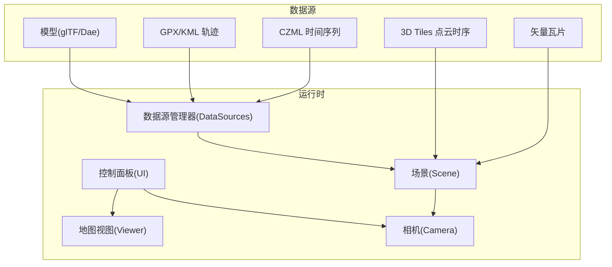
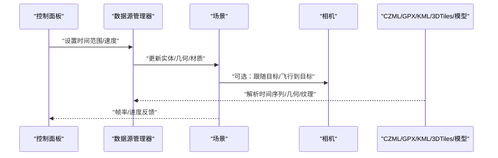
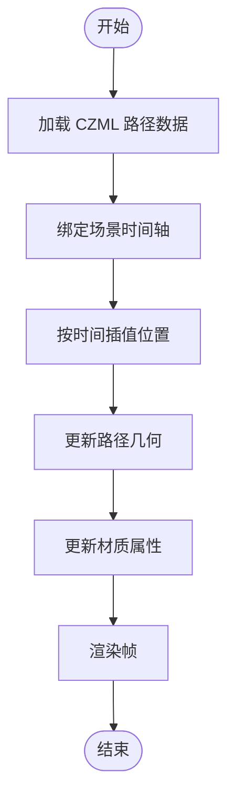
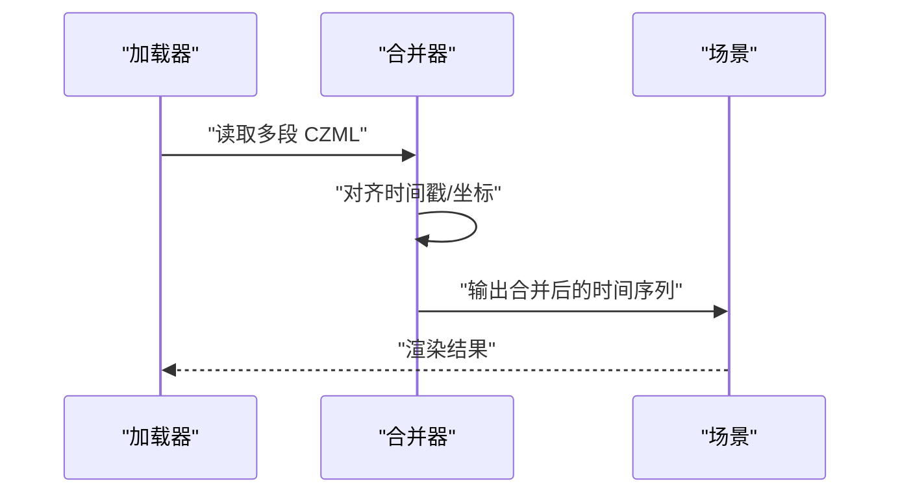
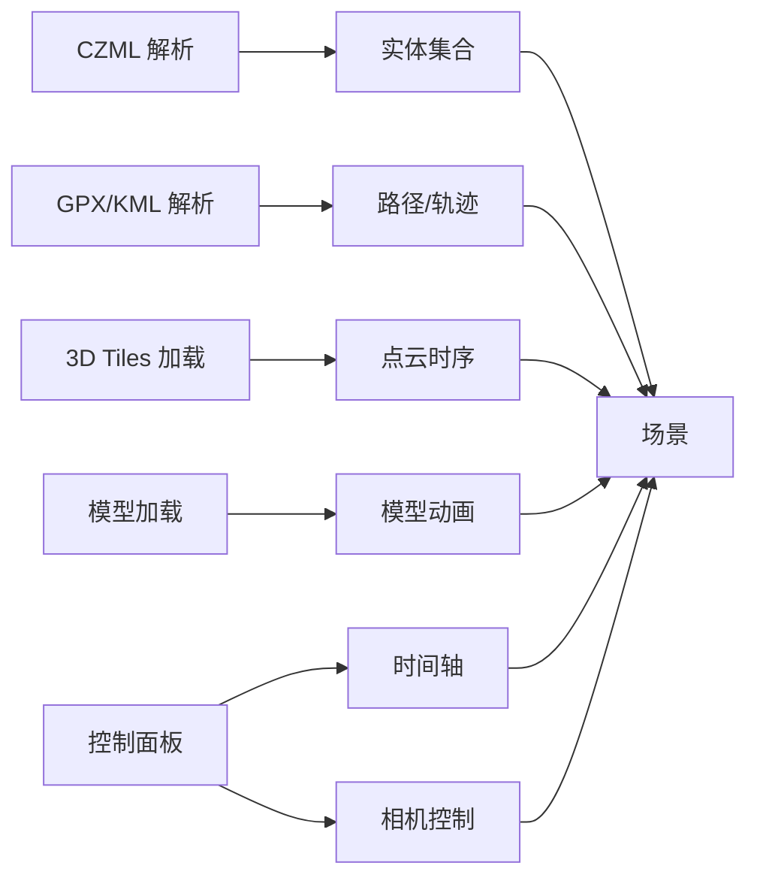

# 动画示例

<cite>
**本文引用的文件**   
- [Apps/SampleData/CZML/Vehicle.czml](file://Apps/SampleData/CZML/Vehicle.czml)
- [Apps/SampleData/CZML/TwoSats.czml](file://Apps/SampleData/CZML/TwoSats.czml)
- [Apps/SampleData/CZML/Mars.czml](file://Apps/SampleData/CZML/Mars.czml)
- [Apps/SampleData/CZML/tracking.czml](file://Apps/SampleData/CZML/tracking.czml)
- [Apps/SampleData/CZML/TimeDependentPaths_Whole.czml](file://Apps/SampleData/CZML/TimeDependentPaths_Whole.czml)
- [Apps/SampleData/CZML/TimeDependentPaths_VaryingMaterialMode.czml](file://Apps/SampleData/CZML/TimeDependentPaths_VaryingMaterialMode.czml)
- [Apps/SampleData/CZML/TimeDependentPaths_Portions.czml](file://Apps/SampleData/CZML/TimeDependentPaths_Portions.czml)
- [Apps/SampleData/CZML/SatelliteLaunch.czml](file://Apps/SampleData/CZML/SatelliteLaunch.czml)
- [Apps/SampleData/CZML/MultipartVehicle_part1.czml](file://Apps/SampleData/CZML/MultipartVehicle_part1.czml)
- [Apps/SampleData/CZML/MultipartVehicle_part2.czml](file://Apps/SampleData/CZML/MultipartVehicle_part2.czml)
- [Apps/SampleData/CZML/MultipartVehicle_part3.czml](file://Apps/SampleData/CZML/MultipartVehicle_part3.czml)
- [Apps/SampleData/models/CesiumMilkTruck/CesiumMilkTruck.dae](file://Apps/SampleData/models/CesiumMilkTruck/CesiumMilkTruck.dae)
- [Apps/SampleData/models/CesiumDrone/CesiumDrone.gltf](file://Apps/SampleData/models/CesiumDrone/CesiumDrone.gltf)
- [Apps/SampleData/models/CesiumMan/CesiumMan.gltf](file://Apps/SampleData/models/CesiumMan/CesiumMan.gltf)
- [Apps/SampleData/models/PointCloudWave/PointCloudWave.b3dm](file://Apps/SampleData/models/PointCloudWave/PointCloudWave.b3dm)
- [Apps/SampleData/models/PointCloudWave/PointCloudWave.json](file://Apps/SampleData/models/PointCloudWave/PointCloudWave.json)
- [Apps/SampleData/gpx/simple.gpx](file://Apps/SampleData/gpx/simple.gpx)
- [Apps/SampleData/kml/bikeRide.kml](file://Apps/SampleData/kml/bikeRide.kml)
- [Apps/SampleData/kml/eiffel-tower-flyto.kml](file://Apps/SampleData/kml/eiffel-tower-flyto.kml)
- [Apps/SampleData/vector/sample-us-states.tileset.json](file://Apps/SampleData/vector/sample-us-states.tileset.json)
- [Apps/SampleData/vector/sample-cities-spain.tileset.json](file://Apps/SampleData/vector/sample-cities-spain.tileset.json)
- [Apps/SampleData/Cesium3DTiles/PointCloud/PointCloudTimeDynamic/pointCloudTimeDynamic.json](file://Apps/SampleData/Cesium3DTiles/PointCloud/PointCloudTimeDynamic/pointCloudTimeDynamic.json)
- [Apps/SampleData/Cesium3DTiles/PointCloud/PointCloudTimeDynamic/pointCloudTimeDynamic_0_0_0_0.b3dm](file://Apps/SampleData/Cesium3DTiles/PointCloud/PointCloudTimeDynamic/pointCloudTimeDynamic_0_0_0_0.b3dm)
- [Apps/SampleData/Cesium3DTiles/PointCloud/PointCloudTimeDynamic/pointCloudTimeDynamic_0_0_0_1.b3dm](file://Apps/SampleData/Cesium3DTiles/PointCloud/PointCloudTimeDynamic/pointCloudTimeDynamic_0_0_0_1.b3dm)
- [Apps/SampleData/Cesium3DTiles/PointCloud/PointCloudTimeDynamic/pointCloudTimeDynamic_0_0_0_2.b3dm](file://Apps/SampleData/Cesium3DTiles/PointCloud/PointCloudTimeDynamic/pointCloudTimeDynamic_0_0_0_2.b3dm)
- [Apps/SampleData/Cesium3DTiles/PointCloud/PointCloudTimeDynamic/pointCloudTimeDynamic_0_0_0_3.b3dm](file://Apps/SampleData/Cesium3DTiles/PointCloud/PointCloudTimeDynamic/pointCloudTimeDynamic_0_0_0_3.b3dm)
- [Apps/SampleData/Cesium3DTiles/PointCloud/PointCloudTimeDynamic/pointCloudTimeDynamic_0_0_0_4.b3dm](file://Apps/SampleData/Cesium3DTiles/PointCloud/PointCloudTimeDynamic/pointCloudTimeDynamic_0_0_0_4.b3dm)
- [Apps/SampleData/Cesium3DTiles/PointCloud/PointCloudTimeDynamic/pointCloudTimeDynamic_0_0_0_5.b3dm](file://Apps/SampleData/Cesium3DTiles/PointCloud/PointCloudTimeDynamic/pointCloudTimeDynamic_0_0_0_5.b3dm)
- [Apps/SampleData/Cesium3DTiles/PointCloud/PointCloudTimeDynamic/pointCloudTimeDynamic_0_0_0_6.b3dm](file://Apps/SampleData/Cesium3DTiles/PointCloud/PointCloudTimeDynamic/pointCloudTimeDynamic_0_0_0_6.b3dm)
- [Apps/SampleData/Cesium3DTiles/PointCloud/PointCloudTimeDynamic/pointCloudTimeDynamic_0_0_0_7.b3dm](file://Apps/SampleData/Cesium3DTiles/PointCloud/PointCloudTimeDynamic/pointCloudTimeDynamic_0_0_0_7.b3dm)
- [Apps/SampleData/Cesium3DTiles/PointCloud/PointCloudTimeDynamic/pointCloudTimeDynamic_0_0_0_8.b3dm](file://Apps/SampleData/Cesium3DTiles/PointCloud/PointCloudTimeDynamic/pointCloudTimeDynamic_0_0_0_8.b3dm)
- [Apps/SampleData/Cesium3DTiles/PointCloud/PointCloudTimeDynamic/pointCloudTimeDynamic_0_0_0_9.b3dm](file://Apps/SampleData/Cesium3DTiles/PointCloud/PointCloudTimeDynamic/pointCloudTimeDynamic_0_0_0_9.b3dm)
- [Apps/SampleData/Cesium3DTiles/PointCloud/PointCloudTimeDynamic/pointCloudTimeDynamic_0_0_0_10.b3dm](file://Apps/SampleData/Cesium3DTiles/PointCloud/PointCloudTimeDynamic/pointCloudTimeDynamic_0_0_0_10.b3dm)
- [Apps/SampleData/Cesium3DTiles/PointCloud/PointCloudTimeDynamic/pointCloudTimeDynamic_0_0_0_11.b3dm](file://Apps/SampleData/Cesium3DTiles/PointCloud/PointCloudTimeDynamic/pointCloudTimeDynamic_0_0_0_11.b3dm)
- [Apps/SampleData/Cesium3DTiles/PointCloud/PointCloudTimeDynamic/pointCloudTimeDynamic_0_0_0_12.b3dm](file://Apps/SampleData/Cesium3DTiles/PointCloud/PointCloudTimeDynamic/pointCloudTimeDynamic_0_0_0_12.b3dm)
- [Apps/SampleData/Cesium3DTiles/PointCloud/PointCloudTimeDynamic/pointCloudTimeDynamic_0_0_0_13.b3dm](file://Apps/SampleData/Cesium3DTiles/PointCloud/PointCloudTimeDynamic/pointCloudTimeDynamic_0_0_0_13.b3dm)
- [Apps/SampleData/Cesium3DTiles/PointCloud/PointCloudTimeDynamic/pointCloudTimeDynamic_0_0_0_14.b3dm](file://Apps/SampleData/Cesium3DTiles/PointCloud/PointCloudTimeDynamic/pointCloudTimeDynamic_0_0_0_14.b3dm)
- [Apps/SampleData/Cesium3DTiles/PointCloud/PointCloudTimeDynamic/pointCloudTimeDynamic_0_0_0_15.b3dm](file://Apps/SampleData/Cesium3DTiles/PointCloud/PointCloudTimeDynamic/pointCloudTimeDynamic_0_0_0_15.b3dm)
- [Apps/SampleData/Cesium3DTiles/PointCloud/PointCloudTimeDynamic/pointCloudTimeDynamic_0_0_0_16.b3dm](file://Apps/SampleData/Cesium3DTiles/PointCloud/PointCloudTimeDynamic/pointCloudTimeDynamic_0_0_0_16.b3dm)
- [Apps/SampleData/Cesium3DTiles/PointCloud/PointCloudTimeDynamic/pointCloudTimeDynamic_0_0_0_17.b3dm](file://Apps/SampleData/Cesium3DTiles/PointCloud/PointCloudTimeDynamic/pointCloudTimeDynamic_0_0_0_17.b3dm)
- [Apps/SampleData/Cesium3DTiles/PointCloud/PointCloudTimeDynamic/pointCloudTimeDynamic_0_0_0_18.b3dm](file://Apps/SampleData/Cesium3DTiles/PointCloud/PointCloudTimeDynamic/pointCloudTimeDynamic_0_0_0_18.b3dm)
- [Apps/SampleData/Cesium3DTiles/PointCloud/PointCloudTimeDynamic/pointCloudTimeDynamic_0_0_0_19.b3dm](file://Apps/SampleData/Cesium3DTiles/PointCloud/PointCloudTimeDynamic/pointCloudTimeDynamic_0_0_0_19.b3dm)
- [Apps/SampleData/Cesium3DTiles/PointCloud/PointCloudTimeDynamic/pointCloudTimeDynamic_0_0_0_20.b3dm](file://Apps/SampleData/Cesium3DTiles/PointCloud/PointCloudTimeDynamic/pointCloudTimeDynamic_0_0_0_20.b3dm)
- [Apps/SampleData/Cesium3DTiles/PointCloud/PointCloudTimeDynamic/pointCloudTimeDynamic_0_0_0_21.b3dm](file://Apps/SampleData/Cesium3DTiles/PointCloud/PointCloudTimeDynamic/pointCloudTimeDynamic_0_0_0_21.b3dm)
- [Apps/SampleData/Cesium3DTiles/PointCloud/PointCloudTimeDynamic/pointCloudTimeDynamic_0_0_0_22.b3dm](file://Apps/SampleData/Cesium3DTiles/PointCloud/PointCloudTimeDynamic/pointCloudTimeDynamic_0_0_0_22.b3dm)
- [Apps/SampleData/Cesium3DTiles/PointCloud/PointCloudTimeDynamic/pointCloudTimeDynamic_0_0_0_23.b3dm](file://Apps/SampleData/Cesium3DTiles/PointCloud/PointCloudTimeDynamic/pointCloudTimeDynamic_0_0_0_23.b3dm)
- [Apps/SampleData/Cesium3DTiles/PointCloud/PointCloudTimeDynamic/pointCloudTimeDynamic_0_0_0_24.b3dm](file://Apps/SampleData/Cesium3DTiles/PointCloud/PointCloudTimeDynamic/pointCloudTimeDynamic_0_0_0_24.b3dm)
- [Apps/SampleData/Cesium3DTiles/PointCloud/PointCloudTimeDynamic/pointCloudTimeDynamic_0_0_0_25.b3dm](file://Apps/SampleData/Cesium3DTiles/PointCloud/PointCloudTimeDynamic/pointCloudTimeDynamic_0_0_0_25.b3dm)
- [Apps/SampleData/Cesium3DTiles/PointCloud/PointCloudTimeDynamic/pointCloudTimeDynamic_0_0_0_26.b3dm](file://Apps/SampleData/Cesium3DTiles/PointCloud/PointCloudTimeDynamic/pointCloudTimeDynamic_0_0_0_26.b3dm)
- [Apps/SampleData/Cesium3DTiles/PointCloud/PointCloudTimeDynamic/pointCloudTimeDynamic_0_0_0_27.b3dm](file://Apps/SampleData/Cesium3DTiles/PointCloud/PointCloudTimeDynamic/pointCloudTimeDynamic_0_0_0_27.b3dm)
- [Apps/SampleData/Cesium3DTiles/PointCloud/PointCloudTimeDynamic/pointCloudTimeDynamic_0_0_0_28.b3dm](file://Apps/SampleData/Cesium3DTiles/PointCloud/PointCloudTimeDynamic/pointCloudTimeDynamic_0_0_0_28.b3dm)
- [Apps/SampleData/Cesium3DTiles/PointCloud/PointCloudTimeDynamic/pointCloudTimeDynamic_0_0_0_29.b3dm](file://Apps/SampleData/Cesium3DTiles/PointCloud/PointCloudTimeDynamic/pointCloudTimeDynamic_0_0_0_29.b3dm)
- [Apps/SampleData/Cesium3DTiles/PointCloud/PointCloudTimeDynamic/pointCloudTimeDynamic_0_0_0_30.b3dm](file://Apps/SampleData/Cesium3DTiles/PointCloud/PointCloudTimeDynamic/pointCloudTimeDynamic_0_0_0_30.b3dm)
- [Apps/SampleData/Cesium3DTiles/PointCloud/PointCloudTimeDynamic/pointCloudTimeDynamic_0_0_0_31.b3dm](file://Apps/SampleData/Cesium3DTiles/PointCloud/PointCloudTimeDynamic/pointCloudTimeDynamic_0_0_0_31.b3dm)
- [Apps/SampleData/Cesium3DTiles/PointCloud/PointCloudTimeDynamic/pointCloudTimeDynamic_0_0_0_32.b3dm](file://Apps/SampleData/Cesium3DTiles/PointCloud/PointCloudTimeDynamic/pointCloudTimeDynamic_0_0_0_32.b3dm)
- [Apps/SampleData/Cesium3DTiles/PointCloud/PointCloudTimeDynamic/pointCloudTimeDynamic_0_0_0_33.b3dm](file://Apps/SampleData/Cesium3DTiles/PointCloud/PointCloudTimeDynamic/pointCloudTimeDynamic_0_0_0_33.b3dm)
- [Apps/SampleData/Cesium3DTiles/PointCloud/PointCloudTimeDynamic/pointCloudTimeDynamic_0_0_0_34.b3dm](file://Apps/SampleData/Cesium3DTiles/PointCloud/PointCloudTimeDynamic/pointCloudTimeDynamic_0_0_0_34.b3dm)
- [Apps/SampleData/Cesium3DTiles/PointCloud/PointCloudTimeDynamic/pointCloudTimeDynamic_0_0_0_35.b3dm](file://Apps/SampleData/Cesium3DTiles/PointCloud/PointCloudTimeDynamic/pointCloudTimeDynamic_0_0_0_35.b3dm)
- [Apps/SampleData/Cesium3DTiles/PointCloud/PointCloudTimeDynamic/pointCloudTimeDynamic_0_0_0_36.b3dm](file://Apps/SampleData/Cesium3DTiles/PointCloud/PointCloudTimeDynamic/pointCloudTimeDynamic_0_0_0_36.b3dm)
- [Apps/SampleData/Cesium3DTiles/PointCloud/PointCloudTimeDynamic/pointCloudTimeDynamic_0_0_0_37.b3dm](file://Apps/SampleData/Cesium3DTiles/PointCloud/PointCloudTimeDynamic/pointCloudTimeDynamic_0_0_0_37.b3dm)
- [Apps/SampleData/Cesium3DTiles/PointCloud/PointCloudTimeDynamic/pointCloudTimeDynamic_0_0_0_38.b3dm](file://Apps/SampleData/Cesium3DTiles/PointCloud/PointCloudTimeDynamic/pointCloudTimeDynamic_0_0_0_38.b3dm)
- [Apps/SampleData/Cesium3DTiles/PointCloud/PointCloudTimeDynamic/pointCloudTimeDynamic_0_0_0_39.b3dm](file://Apps/SampleData/Cesium3DTiles/PointCloud/PointCloudTimeDynamic/pointCloudTimeDynamic_0_0_0_39.b3dm)
- [Apps/SampleData/Cesium3DTiles/PointCloud/PointCloudTimeDynamic/pointCloudTimeDynamic_0_0_0_40.b3dm](file://Apps/SampleData/Cesium3DTiles/PointCloud/PointCloudTimeDynamic/pointCloudTimeDynamic_0_0_0_40.b3dm)
- [Apps/SampleData/Cesium3DTiles/PointCloud/PointCloudTimeDynamic/pointCloudTimeDynamic_0_0_0_41.b3dm](file://Apps/SampleData/Cesium3DTiles/PointCloud/PointCloudTimeDynamic/pointCloudTimeDynamic_0_0_0_41.b3dm)
- [Apps/SampleData/Cesium3DTiles/PointCloud/PointCloudTimeDynamic/pointCloudTimeDynamic_0_0_0_42.b3dm](file://Apps/SampleData/Cesium3DTiles/PointCloud/PointCloudTimeDynamic/pointCloudTimeDynamic_0_0_0_42.b3dm)
- [Apps/SampleData/Cesium3DTiles/PointCloud/PointCloudTimeDynamic/pointCloudTimeDynamic_0_0_0_43.b3dm](file://Apps/SampleData/Cesium3DTiles/PointCloud/PointCloudTimeDynamic/pointCloudTimeDynamic_0_0_0_43.b3dm)
- [Apps/SampleData/Cesium3DTiles/PointCloud/PointCloudTimeDynamic/pointCloudTimeDynamic_0_0_0_44.b3dm](file://Apps/SampleData/Cesium3DTiles/PointCloud/PointCloudTimeDynamic/pointCloudTimeDynamic_0_0_0_44.b3dm)
- [Apps/SampleData/Cesium3DTiles/PointCloud/PointCloudTimeDynamic/pointCloudTimeDynamic_0_0_0_45.b3dm](file://Apps/SampleData/Cesium3DTiles/PointCloud/PointCloudTimeDynamic/pointCloudTimeDynamic_0_0_0_45.b3dm)
- [Apps/SampleData/Cesium3DTiles/PointCloud/PointCloudTimeDynamic/pointCloudTimeDynamic_0_0_0_46.b3dm](file://Apps/SampleData/Cesium3DTiles/PointCloud/PointCloudTimeDynamic/pointCloudTimeDynamic_0_0_0_46.b3dm)
- [Apps/SampleData/Cesium3DTiles/PointCloud/PointCloudTimeDynamic/pointCloudTimeDynamic_0_0_0_47.b3dm](file://Apps/SampleData/Cesium3DTiles/PointCloud/PointCloudTimeDynamic/pointCloudTimeDynamic_0_0_0_47.b3dm)
- [Apps/SampleData/Cesium3DTiles/PointCloud/PointCloudTimeDynamic/pointCloudTimeDynamic_0_0_0_48.b3dm](file://Apps/SampleData/Cesium3DTiles/PointCloud/PointCloudTimeDynamic/pointCloudTimeDynamic_0_0_0_48.b3dm)
- [Apps/SampleData/Cesium3DTiles/PointCloud/PointCloudTimeDynamic/pointCloudTimeDynamic_0_0_0_49.b3dm](file://Apps/SampleData/Cesium3DTiles/PointCloud/PointCloudTimeDynamic/pointCloudTimeDynamic_0_0_0_49.b3dm)
- [Apps/SampleData/Cesium3DTiles/PointCloud/PointCloudTimeDynamic/pointCloudTimeDynamic_0_0_0_50.b3dm](file://Apps/SampleData/Cesium3DTiles/PointCloud/PointCloudTimeDynamic/pointCloudTimeDynamic_0_0_0_50.b3dm)
- [Apps/SampleData/Cesium3DTiles/PointCloud/PointCloudTimeDynamic/pointCloudTimeDynamic_0_0_0_51.b3dm](file://Apps/SampleData/Cesium3DTiles/PointCloud/PointCloudTimeDynamic/pointCloudTimeDynamic_0_0_0_51.b3dm)
- [Apps/SampleData/Cesium3DTiles/PointCloud/PointCloudTimeDynamic/pointCloudTimeDynamic_0_0_0_52.b3dm](file://Apps/SampleData/Cesium3DTiles/PointCloud/PointCloudTimeDynamic/pointCloudTimeDynamic_0_0_0_52.b3dm)
- [Apps/SampleData/Cesium3DTiles/PointCloud/PointCloudTimeDynamic/pointCloudTimeDynamic_0_0_0_53.b3dm](file://Apps/SampleData/Cesium3DTiles/PointCloud/PointCloudTimeDynamic/pointCloudTimeDynamic_0_0_0_53.b3dm)
- [Apps/SampleData/Cesium3DTiles/PointCloud/PointCloudTimeDynamic/pointCloudTimeDynamic_0_0_0_54.b3dm](file://Apps/SampleData/Cesium3DTiles/PointCloud/PointCloudTimeDynamic/pointCloudTimeDynamic_0_0_0_54.b3dm)
- [Apps/SampleData/Cesium3DTiles/PointCloud/PointCloudTimeDynamic/pointCloudTimeDynamic_0_0_0_55.b3dm](file://Apps/SampleData/Cesium3DTiles/PointCloud/PointCloudTimeDynamic/pointCloudTimeDynamic_0_0_0_55.b3dm)
- [Apps/SSampleData/Cesium3DTiles/PointCloud/PointCloudTimeDynamic/pointCloudTimeDynamic_0_0_0_56.b3dm](file://Apps/SampleData/Cesium3DTiles/PointCloud/PointCloudTimeDynamic/pointCloudTimeDynamic_0_0_0_56.b3dm)
- [Apps/SampleData/Cesium3DTiles/PointCloud/PointCloudTimeDynamic/pointCloudTimeDynamic_0_0_0_57.b3dm](file://Apps/SampleData/Cesium3DTiles/PointCloud/PointCloudTimeDynamic/pointCloudTimeDynamic_0_0_0_57.b3dm)
- [Apps/SampleData/Cesium3DTiles/PointCloud/PointCloudTimeDynamic/pointCloudTimeDynamic_0_0_0_58.b3dm](file://Apps/SampleData/Cesium3DTiles/PointCloud/PointCloudTimeDynamic/pointCloudTimeDynamic_0_0_0_58.b3dm)
- [Apps/SampleData/Cesium3DTiles/PointCloud/PointCloudTimeDynamic/pointCloudTimeDynamic_0_0_0_59.b3dm](file://Apps/SampleData/Cesium3DTiles/PointCloud/PointCloudTimeDynamic/pointCloudTimeDynamic_0_0_0_59.b3dm)
- [Apps/SampleData/Cesium3DTiles/PointCloud/PointCloudTimeDynamic/pointCloudTimeDynamic_0_0_0_60.b3dm](file://Apps/SampleData/Cesium3DTiles/PointCloud/PointCloudTimeDynamic/pointCloudTimeDynamic_0_0_0_60.b3dm)
- [Apps/SampleData/Cesium3DTiles/PointCloud/PointCloudTimeDynamic/pointCloudTimeDynamic_0_0_0_61.b3dm](file://Apps/SampleData/Cesium3DTiles/PointCloud/PointCloudTimeDynamic/pointCloudTimeDynamic_0_0_0_61.b3dm)
- [Apps/SampleData/Cesium3DTiles/PointCloud/PointCloudTimeDynamic/pointCloudTimeDynamic_0_0_0_62.b3dm](file://Apps/SampleData/Cesium3DTiles/PointCloud/PointCloudTimeDynamic/pointCloudTimeDynamic_0_0_0_62.b3dm)
- [Apps/SampleData/Cesium3DTiles/PointCloud/PointCloudTimeDynamic/pointCloudTimeDynamic_0_0_0_63.b3dm](file://Apps/SampleData/Cesium3DTiles/PointCloud/PointCloudTimeDynamic/pointCloudTimeDynamic_0_0_0_63.b3dm)
- [Apps/SampleData/Cesium3DTiles/PointCloud/PointCloudTimeDynamic/pointCloudTimeDynamic_0_0_0_64.b3dm](file://Apps/SampleData/Cesium3DTiles/PointCloud/PointCloudTimeDynamic/pointCloudTimeDynamic_0_0_0_64.b3dm)
- [Apps/SampleData/Cesium3DTiles/PointCloud/PointCloudTimeDynamic/pointCloudTimeDynamic_0_0_0_65.b3dm](file://Apps/SampleData/Cesium3DTiles/PointCloud/PointCloudTimeDynamic/pointCloudTimeDynamic_0_0_0_65.b3dm)
- [Apps/SampleData/Cesium3DTiles/PointCloud/PointCloudTimeDynamic/pointCloudTimeDynamic_0_0_0_66.b3dm](file://Apps/SampleData/Cesium3DTiles/PointCloud/PointCloudTimeDynamic/pointCloudTimeDynamic_0_0_0_66.b3dm)
- [Apps/SampleData/Cesium3DTiles/PointCloud/PointCloudTimeDynamic/pointCloudTimeDynamic_0_0_0_67.b3dm](file://Apps/SampleData/Cesium3DTiles/PointCloud/PointCloudTimeDynamic/pointCloudTimeDynamic_0_0_0_67.b3dm)
- [Apps/SampleData/Cesium3DTiles/PointCloud/PointCloudTimeDynamic/pointCloudTimeDynamic_0_0_0_68.b3dm](file://Apps/SampleData/Cesium3DTiles/PointCloud/PointCloudTimeDynamic/pointCloudTimeDynamic_0_0_0_68.b3dm)
- [Apps/SampleData/Cesium3DTiles/PointCloud/PointCloudTimeDynamic/pointCloudTimeDynamic_0_0_0_69.b3dm](file://Apps/SampleData/Cesium3DTiles/PointCloud/PointCloudTimeDynamic/pointCloudTimeDynamic_0_0_0_69.b3dm)
- [Apps/SampleData/Cesium3DTiles/PointCloud/PointCloudTimeDynamic/pointCloudTimeDynamic_0_0_0_70.b3dm](file://Apps/SampleData/Cesium3DTiles/PointCloud/PointCloudTimeDynamic/pointCloudTimeDynamic_0_0_0_70.b3dm)
- [Apps/SampleData/Cesium3DTiles/PointCloud/PointCloudTimeDynamic/pointCloudTimeDynamic_0_0_0_71.b3dm](file://Apps/SampleData/Cesium3DTiles/PointCloud/PointCloudTimeDynamic/pointCloudTimeDynamic_0_0_0_71.b3dm)
- [Apps/SampleData/Cesium3DTiles/PointCloud/PointCloudTimeDynamic/pointCloudTimeDynamic_0_0_0_72.b3dm](file://Apps/SampleData/Cesium3DTiles/PointCloud/PointCloudTimeDynamic/pointCloudTimeDynamic_0_0_0_72.b3dm)
- [Apps/SampleData/Cesium3DTiles/PointCloud/PointCloudTimeDynamic/pointCloudTimeDynamic_0_0_0_73.b3dm](file://Apps/SampleData/Cesium3DTiles/PointCloud/PointCloudTimeDynamic/pointCloudTimeDynamic_0_0_0_73.b3dm)
- [Apps/SampleData/Cesium3DTiles/PointCloud/PointCloudTimeDynamic/pointCloudTimeDynamic_0_0_0_74.b3dm](file://Apps/SampleData/Cesium3DTiles/PointCloud/PointCloudTimeDynamic/pointCloudTimeDynamic_0_0_0_74.b3dm)
- [Apps/SampleData/Cesium3DTiles/PointCloud/PointCloudTimeDynamic/pointCloudTimeDynamic_0_0_0_75.b3dm](file://Apps/SampleData/Cesium3DTiles/PointCloud/PointCloudTimeDynamic/pointCloudTimeDynamic_0_0_0_75.b3dm)
- [Apps/SampleData/Cesium3DTiles/PointCloud/PointCloudTimeDynamic/pointCloudTimeDynamic_0_0_0_76.b3dm](file://Apps/SampleData/Cesium3DTiles/PointCloud/PointCloudTimeDynamic/pointCloudTimeDynamic_0_0_0_76.b3dm)
- [Apps/SampleData/Cesium3DTiles/PointCloud/PointCloudTimeDynamic/pointCloudTimeDynamic_0_0_0_77.b3dm](file://Apps/SampleData/Cesium3DTiles/PointCloud/PointCloudTimeDynamic/pointCloudTimeDynamic_0_0_0_77.b3dm)
- [Apps/SampleData/Cesium3DTiles/PointCloud/PointCloudTimeDynamic/pointCloudTimeDynamic_0_0_0_78.b3dm](file://Apps/SampleData/Cesium3DTiles/PointCloud/PointCloudTimeDynamic/pointCloudTimeDynamic_0_0_0_78.b3dm)
- [Apps/SampleData/Cesium3DTiles/PointCloud/PointCloudTimeDynamic/pointCloudTimeDynamic_0_0_0_79.b3dm](file://Apps/SampleData/Cesium3DTiles/PointCloud/PointCloudTimeDynamic/pointCloudTimeDynamic_0_0_0_79.b3dm)
- [Apps/SampleData/Cesium3DTiles/PointCloud/PointCloudTimeDynamic/pointCloudTimeDynamic_0_0_0_80.b3dm](file://Apps/SampleData/Cesium3DTiles/PointCloud/PointCloudTimeDynamic/pointCloudTimeDynamic_0_0_0_80.b3dm)
- [Apps/SampleData/Cesium3DTiles/PointCloud/PointCloudTimeDynamic/pointCloudTimeDynamic_0_0_0_81.b3dm](file://Apps/SampleData/Cesium3DTiles/PointCloud/PointCloudTimeDynamic/pointCloudTimeDynamic_0_0_0_81.b3dm)
- [Apps/SampleData/Cesium3DTiles/PointCloud/PointCloudTimeDynamic/pointCloudTimeDynamic_0_0_0_82.b3dm](file://Apps/SampleData/Cesium3DTiles/PointCloud/PointCloudTimeDynamic/pointCloudTimeDynamic_0_0_0_82.b3dm)
- [Apps/SampleData/Cesium3DTiles/PointCloud/PointCloudTimeDynamic/pointCloudTimeDynamic_0_0_0_83.b3dm](file://Apps/SampleData/Cesium3DTiles/PointCloud/PointCloudTimeDynamic/pointCloudTimeDynamic_0_0_0_83.b3dm)
- [Apps/SampleData/Cesium3DTiles/PointCloud/PointCloudTimeDynamic/pointCloudTimeDynamic_0_0_0_84.b3dm](file://Apps/SampleData/Cesium3DTiles/PointCloud/PointCloudTimeDynamic/pointCloudTimeDynamic_0_0_0_84.b3dm)
- [Apps/SampleData/Cesium3DTiles/PointCloud/PointCloudTimeDynamic/pointCloudTimeDynamic_0_0_0_85.b3dm](file://Apps/SampleData/Cesium3DTiles/PointCloud/PointCloudTimeDynamic/pointCloudTimeDynamic_0_0_0_85.b3dm)
- [Apps/SampleData/Cesium3DTiles/PointCloud/PointCloudTimeDynamic/pointCloudTimeDynamic_0_0_0_86.b3dm](file://Apps/SampleData/Cesium3DTiles/PointCloud/PointCloudTimeDynamic/pointCloudTimeDynamic_0_0_0_86.b3dm)
- [Apps/SampleData/Cesium3DTiles/PointCloud/PointCloudTimeDynamic/pointCloudTimeDynamic_0_0_0_87.b3dm](file://Apps/SampleData/Cesium3DTiles/PointCloud/PointCloudTimeDynamic/pointCloudTimeDynamic_0_0_0_87.b3dm)
- [Apps/SampleData/Cesium3DTiles/PointCloud/PointCloudTimeDynamic/pointCloudTimeDynamic_0_0_0_88.b3dm](file://Apps/SampleData/Cesium3DTiles/PointCloud/PointCloudTimeDynamic/pointCloudTimeDynamic_0_0_0_88.b3dm)
- [Apps/SampleData/Cesium3DTiles/PointCloud/PointCloudTimeDynamic/pointCloudTimeDynamic_0_0_0_89.b3dm](file://Apps/SampleData/Cesium3DTiles/PointCloud/PointCloudTimeDynamic/pointCloudTimeDynamic_0_0_0_89.b3dm)
- [Apps/SampleData/Cesium3DTiles/PointCloud/PointCloudTimeDynamic/pointCloudTimeDynamic_0_0_0_90.b3dm](file://Apps/SampleData/Cesium3DTiles/PointCloud/PointCloudTimeDynamic/pointCloudTimeDynamic_0_0_0_90.b3dm)
- [Apps/SampleData/Cesium3DTiles/PointCloud/PointCloudTimeDynamic/pointCloudTimeDynamic_0_0_0_91.b3dm](file://Apps/SampleData/Cesium3DTiles/PointCloud/PointCloudTimeDynamic/pointCloudTimeDynamic_0_0_0_91.b3dm)
- [Apps/SampleData/Cesium3DTiles/PointCloud/PointCloudTimeDynamic/pointCloudTimeDynamic_0_0_0_92.b3dm](file://Apps/SampleData/Cesium3DTiles/PointCloud/PointCloudTimeDynamic/pointCloudTimeDynamic_0_0_0_92.b3dm)
- [Apps/SampleData/Cesium3DTiles/PointCloud/PointCloudTimeDynamic/pointCloudTimeDynamic_0_0_0_93.b3dm](file://Apps/SampleData/Cesium3DTiles/PointCloud/PointCloudTimeDynamic/pointCloudTimeDynamic_0_0_0_93.b3dm)
- [Apps/SampleData/Cesium3DTiles/PointCloud/PointCloudTimeDynamic/pointCloudTimeDynamic_0_0_0_94.b3dm](file://Apps/SampleData/Cesium3DTiles/PointCloud/PointCloudTimeDynamic/pointCloudTimeDynamic_0_0_0_94.b3dm)
- [Apps/SampleData/Cesium3DTiles/PointCloud/PointCloudTimeDynamic/pointCloudTimeDynamic_0_0_0_95.b3dm](file://Apps/SampleData/Cesium3DTiles/PointCloud/PointCloudTimeDynamic/pointCloudTimeDynamic_0_0_0_95.b3dm)
- [Apps/SampleData/Cesium3DTiles/PointCloud/PointCloudTimeDynamic/pointCloudTimeDynamic_0_0_0_96.b3dm](file://Apps/SampleData/Cesium3DTiles/PointCloud/PointCloudTimeDynamic/pointCloudTimeDynamic_0_0_0_96.b3dm)
- [Apps/SampleData/Cesium3DTiles/PointCloud/PointCloudTimeDynamic/pointCloudTimeDynamic_0_0_0_97.b3dm](file://Apps/SampleData/Cesium3DTiles/PointCloud/PointCloudTimeDynamic/pointCloudTimeDynamic_0_0_0_97.b3dm)
- [Apps/SampleData/Cesium3DTiles/PointCloud/PointCloudTimeDynamic/pointCloudTimeDynamic_0_0_0_98.b3dm](file://Apps/SampleData/Cesium3DTiles/PointCloud/PointCloudTimeDynamic/pointCloudTimeDynamic_0_0_0_98.b3dm)
- [Apps/SampleData/Cesium3DTiles/PointCloud/PointCloudTimeDynamic/pointCloudTimeDynamic_0_0_0_99.b3dm](file://Apps/SampleData/Cesium3DTiles/PointCloud/PointCloudTimeDynamic/pointCloudTimeDynamic_0_0_0_99.b3dm)
</cite>

## 目录
1. [简介](#简介)
2. [项目结构](#项目结构)
3. [核心组件](#核心组件)
4. [架构总览](#架构总览)
5. [详细组件分析](#详细组件分析)
6. [依赖分析](#依赖分析)
7. [性能考虑](#性能考虑)
8. [故障排查指南](#故障排查指南)
9. [结论](#结论)
10. [附录](#附录)

## 简介
本文件面向希望在三维地球场景中构建丰富动画效果的开发者，提供一套可复用的示例集合与最佳实践。内容覆盖：
- 路径动画：基于时间序列的轨迹、多段拼接、材质随时间变化
- 属性动画：位置、方向、缩放、透明度等属性的时序驱动
- 骨骼动画：glTF 模型中的骨骼与形变动画
- 时间序列数据（CZML）：车辆轨迹、卫星轨道、气象变化等动态场景
- 相机动画：飞行到目标、跟随移动对象
- 模型动画：加载并播放 glTF/Dae 模型动画
- 粒子系统：点云时序、波浪点云等
- 交互控制：统一的播放/暂停/速度调节面板
- 性能优化与内存管理：减少绘制批次、按需加载、批处理与实例化

## 项目结构
仓库包含大量可用于动画演示的数据资源，主要分布在以下目录：
- CZML 时间序列数据：用于描述位置、方向、路径、材质等随时间变化的实体
- 矢量瓦片（Vector Tiles）：用于展示区域或城市要素的动态样式
- 3D Tiles 点云时序：用于大规模点云的时序渲染
- 模型资源：glTF/Dae 模型，支持内置骨骼动画
- GPX/KML：轨迹与航路数据，可作为路径动画输入

图表来源
- [Apps/SampleData/CZML/Vehicle.czml](file://Apps/SampleData/CZML/Vehicle.czml)
- [Apps/SampleData/CZML/TwoSats.czml](file://Apps/SampleData/CZML/TwoSats.czml)
- [Apps/SampleData/CZML/Mars.czml](file://Apps/SampleData/CZML/Mars.czml)
- [Apps/SampleData/CZML/tracking.czml](file://Apps/SampleData/CZML/tracking.czml)
- [Apps/SampleData/CZML/TimeDependentPaths_Whole.czml](file://Apps/SampleData/CZML/TimeDependentPaths_Whole.czml)
- [Apps/SampleData/CZML/TimeDependentPaths_VaryingMaterialMode.czml](file://Apps/SampleData/CZML/TimeDependentPaths_VaryingMaterialMode.czml)
- [Apps/SampleData/CZML/TimeDependentPaths_Portions.czml](file://Apps/SampleData/CZML/TimeDependentPaths_Portions.czml)
- [Apps/SampleData/CZML/SatelliteLaunch.czml](file://Apps/SampleData/CZML/SatelliteLaunch.czml)
- [Apps/SampleData/CZML/MultipartVehicle_part1.czml](file://Apps/SampleData/CZML/MultipartVehicle_part1.czml)
- [Apps/SampleData/CZML/MultipartVehicle_part2.czml](file://Apps/SampleData/CZML/MultipartVehicle_part2.czml)
- [Apps/SampleData/CZML/MultipartVehicle_part3.czml](file://Apps/SampleData/CZML/MultipartVehicle_part3.czml)
- [Apps/SampleData/models/CesiumMilkTruck/CesiumMilkTruck.dae](file://Apps/SampleData/models/CesiumMilkTruck/CesiumMilkTruck.dae)
- [Apps/SampleData/models/CesiumDrone/CesiumDrone.gltf](file://Apps/SampleData/models/CesiumDrone/CesiumDrone.gltf)
- [Apps/SampleData/models/CesiumMan/CesiumMan.gltf](file://Apps/SampleData/models/CesiumMan/CesiumMan.gltf)
- [Apps/SampleData/models/PointCloudWave/PointCloudWave.b3dm](file://Apps/SampleData/models/PointCloudWave/PointCloudWave.b3dm)
- [Apps/SampleData/models/PointCloudWave/PointCloudWave.json](file://Apps/SampleData/models/PointCloudWave/PointCloudWave.json)
- [Apps/SampleData/gpx/simple.gpx](file://Apps/SampleData/gpx/simple.gpx)
- [Apps/SampleData/kml/bikeRide.kml](file://Apps/SampleData/kml/bikeRide.kml)
- [Apps/SampleData/kml/eiffel-tower-flyto.kml](file://Apps/SampleData/kml/eiffel-tower-flyto.kml)
- [Apps/SampleData/vector/sample-us-states.tileset.json](file://Apps/SampleData/vector/sample-us-states.tileset.json)
- [Apps/SampleData/vector/sample-cities-spain.tileset.json](file://Apps/SampleData/vector/sample-cities-spain.tileset.json)
- [Apps/SampleData/Cesium3DTiles/PointCloud/PointCloudTimeDynamic/pointCloudTimeDynamic.json](file://Apps/SampleData/Cesium3DTiles/PointCloud/PointCloudTimeDynamic/pointCloudTimeDynamic.json)

章节来源
- [Apps/SampleData/CZML/Vehicle.czml](file://Apps/SampleData/CZML/Vehicle.czml)
- [Apps/SampleData/CZML/TwoSats.czml](file://Apps/SampleData/CZML/TwoSats.czml)
- [Apps/SampleData/CZML/Mars.czml](file://Apps/SampleData/CZML/Mars.czml)
- [Apps/SampleData/CZML/tracking.czml](file://Apps/SampleData/CZML/tracking.czml)
- [Apps/SampleData/CZML/TimeDependentPaths_Whole.czml](file://Apps/SampleData/CZML/TimeDependentPaths_Whole.czml)
- [Apps/SampleData/CZML/TimeDependentPaths_VaryingMaterialMode.czml](file://Apps/SampleData/CZML/TimeDependentPaths_VaryingMaterialMode.czml)
- [Apps/SampleData/CZML/TimeDependentPaths_Portions.czml](file://Apps/SampleData/CZML/TimeDependentPaths_Portions.czml)
- [Apps/SampleData/CZML/SatelliteLaunch.czml](file://Apps/SampleData/CZML/SatelliteLaunch.czml)
- [Apps/SampleData/CZML/MultipartVehicle_part1.czml](file://Apps/SampleData/CZML/MultipartVehicle_part1.czml)
- [Apps/SampleData/CZML/MultipartVehicle_part2.czml](file://Apps/SampleData/CZML/MultipartVehicle_part2.czml)
- [Apps/SampleData/CZML/MultipartVehicle_part3.czml](file://Apps/SampleData/CZML/MultipartVehicle_part3.czml)
- [Apps/SampleData/models/CesiumMilkTruck/CesiumMilkTruck.dae](file://Apps/SampleData/models/CesiumMilkTruck/CesiumMilkTruck.dae)
- [Apps/SampleData/models/CesiumDrone/CesiumDrone.gltf](file://Apps/SampleData/models/CesiumDrone/CesiumDrone.gltf)
- [Apps/SampleData/models/CesiumMan/CesiumMan.gltf](file://Apps/SampleData/models/CesiumMan/CesiumMan.gltf)
- [Apps/SampleData/models/PointCloudWave/PointCloudWave.b3dm](file://Apps/SampleData/models/PointCloudWave/PointCloudWave.b3dm)
- [Apps/SampleData/models/PointCloudWave/PointCloudWave.json](file://Apps/SampleData/models/PointCloudWave/PointCloudWave.json)
- [Apps/SampleData/gpx/simple.gpx](file://Apps/SampleData/gpx/simple.gpx)
- [Apps/SampleData/kml/bikeRide.kml](file://Apps/SampleData/kml/bikeRide.kml)
- [Apps/SampleData/kml/eiffel-tower-flyto.kml](file://Apps/SampleData/kml/eiffel-tower-flyto.kml)
- [Apps/SampleData/vector/sample-us-states.tileset.json](file://Apps/SampleData/vector/sample-us-states.tileset.json)
- [Apps/SampleData/vector/sample-cities-spain.tileset.json](file://Apps/SampleData/vector/sample-cities-spain.tileset.json)
- [Apps/SampleData/Cesium3DTiles/PointCloud/PointCloudTimeDynamic/pointCloudTimeDynamic.json](file://Apps/SampleData/Cesium3DTiles/PointCloud/PointCloudTimeDynamic/pointCloudTimeDynamic.json)

## 核心组件
- 时间序列数据（CZML）
  - 用于声明实体的位置、方向、路径、材质、可见性等随时间的变化
  - 典型文件：车辆轨迹、双星轨道、火星漫游器、跟踪轨迹、分段路径、发射过程、多部件车辆
- 矢量瓦片（Vector Tiles）
  - 通过 tileset.json 定义区域/城市要素，可结合时间属性实现样式动画
- 3D Tiles 点云时序
  - 以分帧 b3dm 表示不同时刻的点云状态，适合大规模动态可视化
- 模型（glTF/Dae）
  - 支持内置骨骼动画与形变动画，可直接在场景中播放
- 轨迹与航路（GPX/KML）
  - 作为路径动画的输入，转换为可视化的线串或实体轨迹
- 相机与交互
  - 相机飞行、跟随目标、用户交互控制（播放/暂停/速度）

章节来源
- [Apps/SampleData/CZML/Vehicle.czml](file://Apps/SampleData/CZML/Vehicle.czml)
- [Apps/SampleData/CZML/TwoSats.czml](file://Apps/SampleData/CZML/TwoSats.czml)
- [Apps/SampleData/CZML/Mars.czml](file://Apps/SampleData/CZML/Mars.czml)
- [Apps/SampleData/CZML/tracking.czml](file://Apps/SampleData/CZML/tracking.czml)
- [Apps/SampleData/CZML/TimeDependentPaths_Whole.czml](file://Apps/SampleData/CZML/TimeDependentPaths_Whole.czml)
- [Apps/SampleData/CZML/TimeDependentPaths_VaryingMaterialMode.czml](file://Apps/SampleData/CZML/TimeDependentPaths_VaryingMaterialMode.czml)
- [Apps/SampleData/CZML/TimeDependentPaths_Portions.czml](file://Apps/SampleData/CZML/TimeDependentPaths_Portions.czml)
- [Apps/SampleData/CZML/SatelliteLaunch.czml](file://Apps/SampleData/CZML/SatelliteLaunch.czml)
- [Apps/SampleData/CZML/MultipartVehicle_part1.czml](file://Apps/SampleData/CZML/MultipartVehicle_part1.czml)
- [Apps/SampleData/CZML/MultipartVehicle_part2.czml](file://Apps/SampleData/CZML/MultipartVehicle_part2.czml)
- [Apps/SampleData/CZML/MultipartVehicle_part3.czml](file://Apps/SampleData/CZML/MultipartVehicle_part3.czml)
- [Apps/SampleData/models/CesiumMilkTruck/CesiumMilkTruck.dae](file://Apps/SampleData/models/CesiumMilkTruck/CesiumMilkTruck.dae)
- [Apps/SampleData/models/CesiumDrone/CesiumDrone.gltf](file://Apps/SampleData/models/CesiumDrone/CesiumDrone.gltf)
- [Apps/SampleData/models/CesiumMan/CesiumMan.gltf](file://Apps/SampleData/models/CesiumMan/CesiumMan.gltf)
- [Apps/SampleData/models/PointCloudWave/PointCloudWave.b3dm](file://Apps/SampleData/models/PointCloudWave/PointCloudWave.b3dm)
- [Apps/SampleData/models/PointCloudWave/PointCloudWave.json](file://Apps/SampleData/models/PointCloudWave/PointCloudWave.json)
- [Apps/SampleData/gpx/simple.gpx](file://Apps/SampleData/gpx/simple.gpx)
- [Apps/SampleData/kml/bikeRide.kml](file://Apps/SampleData/kml/bikeRide.kml)
- [Apps/SampleData/kml/eiffel-tower-flyto.kml](file://Apps/SampleData/kml/eiffel-tower-flyto.kml)
- [Apps/SampleData/vector/sample-us-states.tileset.json](file://Apps/SampleData/vector/sample-us-states.tileset.json)
- [Apps/SampleData/vector/sample-cities-spain.tileset.json](file://Apps/SampleData/vector/sample-cities-spain.tileset.json)
- [Apps/SampleData/Cesium3DTiles/PointCloud/PointCloudTimeDynamic/pointCloudTimeDynamic.json](file://Apps/SampleData/Cesium3DTiles/PointCloud/PointCloudTimeDynamic/pointCloudTimeDynamic.json)

## 架构总览
下图展示了从数据到渲染的整体流程，以及交互控制对时间与相机的影响。

图表来源
- [Apps/SampleData/CZML/Vehicle.czml](file://Apps/SampleData/CZML/Vehicle.czml)
- [Apps/SampleData/CZML/TwoSats.czml](file://Apps/SampleData/CZML/TwoSats.czml)
- [Apps/SampleData/CZML/Mars.czml](file://Apps/SampleData/CZML/Mars.czml)
- [Apps/SampleData/CZML/tracking.czml](file://Apps/SampleData/CZML/tracking.czml)
- [Apps/SampleData/CZML/TimeDependentPaths_Whole.czml](file://Apps/SampleData/CZML/TimeDependentPaths_Whole.czml)
- [Apps/SampleData/CZML/TimeDependentPaths_VaryingMaterialMode.czml](file://Apps/SampleData/CZML/TimeDependentPaths_VaryingMaterialMode.czml)
- [Apps/SampleData/CZML/TimeDependentPaths_Portions.czml](file://Apps/SampleData/CZML/TimeDependentPaths_Portions.czml)
- [Apps/SampleData/CZML/SatelliteLaunch.czml](file://Apps/SampleData/CZML/SatelliteLaunch.czml)
- [Apps/SampleData/CZML/MultipartVehicle_part1.czml](file://Apps/SampleData/CZML/MultipartVehicle_part1.czml)
- [Apps/SampleData/CZML/MultipartVehicle_part2.czml](file://Apps/SampleData/CZML/MultipartVehicle_part2.czml)
- [Apps/SampleData/CZML/MultipartVehicle_part3.czml](file://Apps/SampleData/CZML/MultipartVehicle_part3.czml)
- [Apps/SampleData/models/CesiumMilkTruck/CesiumMilkTruck.dae](file://Apps/SampleData/models/CesiumMilkTruck/CesiumMilkTruck.dae)
- [Apps/SampleData/models/CesiumDrone/CesiumDrone.gltf](file://Apps/SampleData/models/CesiumDrone/CesiumDrone.gltf)
- [Apps/SampleData/models/CesiumMan/CesiumMan.gltf](file://Apps/SampleData/models/CesiumMan/CesiumMan.gltf)
- [Apps/SampleData/models/PointCloudWave/PointCloudWave.b3dm](file://Apps/SampleData/models/PointCloudWave/PointCloudWave.b3dm)
- [Apps/SampleData/models/PointCloudWave/PointCloudWave.json](file://Apps/SampleData/models/PointCloudWave/PointCloudWave.json)
- [Apps/SampleData/gpx/simple.gpx](file://Apps/SampleData/gpx/simple.gpx)
- [Apps/SampleData/kml/bikeRide.kml](file://Apps/SampleData/kml/bikeRide.kml)
- [Apps/SampleData/kml/eiffel-tower-flyto.kml](file://Apps/SampleData/kml/eiffel-tower-flyto.kml)
- [Apps/SampleData/vector/sample-us-states.tileset.json](file://Apps/SampleData/vector/sample-us-states.tileset.json)
- [Apps/SampleData/vector/sample-cities-spain.tileset.json](file://Apps/SampleData/vector/sample-cities-spain.tileset.json)
- [Apps/SampleData/Cesium3DTiles/PointCloud/PointCloudTimeDynamic/pointCloudTimeDynamic.json](file://Apps/SampleData/Cesium3DTiles/PointCloud/PointCloudTimeDynamic/pointCloudTimeDynamic.json)

## 详细组件分析

### 路径动画（CZML 时间序列）
- 使用位置与路径属性定义轨迹，支持整段路径、分段路径与材质随时间变化
- 参考数据：
  - 整段路径：[Apps/SampleData/CZML/TimeDependentPaths_Whole.czml](file://Apps/SampleData/CZML/TimeDependentPaths_Whole.czml)
  - 材质变化模式：[Apps/SampleData/CZML/TimeDependentPaths_VaryingMaterialMode.czml](file://Apps/SampleData/CZML/TimeDependentPaths_VaryingMaterialMode.czml)
  - 分段路径：[Apps/SampleData/CZML/TimeDependentPaths_Portions.czml](file://Apps/SampleData/CZML/TimeDependentPaths_Portions.czml)
- 典型流程：
  - 加载 CZML 数据
  - 将时间轴绑定到场景时钟
  - 根据当前时间插值位置与路径
  - 切换材质属性（颜色、透明度、宽度等）

图表来源
- [Apps/SampleData/CZML/TimeDependentPaths_Whole.czml](file://Apps/SampleData/CZML/TimeDependentPaths_Whole.czml)
- [Apps/SampleData/CZML/TimeDependentPaths_VaryingMaterialMode.czml](file://Apps/SampleData/CZML/TimeDependentPaths_VaryingMaterialMode.czml)
- [Apps/SampleData/CZML/TimeDependentPaths_Portions.czml](file://Apps/SampleData/CZML/TimeDependentPaths_Portions.czml)

章节来源
- [Apps/SampleData/CZML/TimeDependentPaths_Whole.czml](file://Apps/SampleData/CZML/TimeDependentPaths_Whole.czml)
- [Apps/SampleData/CZML/TimeDependentPaths_VaryingMaterialMode.czml](file://Apps/SampleData/CZML/TimeDependentPaths_VaryingMaterialMode.czml)
- [Apps/SampleData/CZML/TimeDependentPaths_Portions.czml](file://Apps/SampleData/CZML/TimeDependentPaths_Portions.czml)

### 属性动画（位置/方向/缩放/透明度）
- 通过 CZML 的时间序列为实体的位置、方向、缩放、透明度等属性赋值
- 参考数据：
  - 车辆轨迹：[Apps/SampleData/CZML/Vehicle.czml](file://Apps/SampleData/CZML/Vehicle.czml)
  - 双星轨道：[Apps/SampleData/CZML/TwoSats.czml](file://Apps/SampleData/CZML/TwoSats.czml)
  - 火星漫游器：[Apps/SampleData/CZML/Mars.czml](file://Apps/SampleData/CZML/Mars.czml)
  - 跟踪轨迹：[Apps/SampleData/CZML/tracking.czml](file://Apps/SampleData/CZML/tracking.czml)
- 建议：
  - 合理设置采样间隔，避免过密导致插值开销过大
  - 对频繁更新的属性使用高效的数据结构（如 TypedArray）

章节来源
- [Apps/SampleData/CZML/Vehicle.czml](file://Apps/SampleData/CZML/Vehicle.czml)
- [Apps/SampleData/CZML/TwoSats.czml](file://Apps/SampleData/CZML/TwoSats.czml)
- [Apps/SampleData/CZML/Mars.czml](file://Apps/SampleData/CZML/Mars.czml)
- [Apps/SampleData/CZML/tracking.czml](file://Apps/SampleData/CZML/tracking.czml)

### 多部件与组合动画（多段拼接）
- 多部件车辆由多个 CZML 片段组成，可在时间上拼接形成连续动画
- 参考数据：
  - 部件1：[Apps/SampleData/CZML/MultipartVehicle_part1.czml](file://Apps/SampleData/CZML/MultipartVehicle_part1.czml)
  - 部件2：[Apps/SampleData/CZML/MultipartVehicle_part2.czml](file://Apps/SampleData/CZML/MultipartVehicle_part2.czml)
  - 部件3：[Apps/SampleData/CZML/MultipartVehicle_part3.czml](file://Apps/SampleData/CZML/MultipartVehicle_part3.czml)
- 流程要点：
  - 统一时间基准与坐标系
  - 确保相邻片段在时间与空间上连续
  - 合并后统一更新渲染

图表来源
- [Apps/SampleData/CZML/MultipartVehicle_part1.czml](file://Apps/SampleData/CZML/MultipartVehicle_part1.czml)
- [Apps/SampleData/CZML/MultipartVehicle_part2.czml](file://Apps/SampleData/CZML/MultipartVehicle_part2.czml)
- [Apps/SampleData/CZML/MultipartVehicle_part3.czml](file://Apps/SampleData/CZML/MultipartVehicle_part3.czml)

章节来源
- [Apps/SampleData/CZML/MultipartVehicle_part1.czml](file://Apps/SampleData/CZML/MultipartVehicle_part1.czml)
- [Apps/SampleData/CZML/MultipartVehicle_part2.czml](file://Apps/SampleData/CZML/MultipartVehicle_part2.czml)
- [Apps/SampleData/CZML/MultipartVehicle_part3.czml](file://Apps/SampleData/CZML/MultipartVehicle_part3.czml)

### 发射与轨道动画（卫星发射）
- 使用 CZML 描述发射阶段与轨道参数变化
- 参考数据：
  - 卫星发射：[Apps/SampleData/CZML/SatelliteLaunch.czml](file://Apps/SampleData/CZML/SatelliteLaunch.czml)
- 关键点：
  - 分阶段定义位置与姿态
  - 结合相机跟随与关键帧飞行，增强表现力

章节来源
- [Apps/SampleData/CZML/SatelliteLaunch.czml](file://Apps/SampleData/CZML/SatelliteLaunch.czml)

### 相机动画（飞行与跟随）
- 飞行到目标：基于 KML 的飞行脚本或手动设置相机目标与距离
- 跟随移动对象：将相机目标设置为某实体的当前位置
- 参考数据：
  - 自行车路线（KML）：[Apps/SampleData/kml/bikeRide.kml](file://Apps/SampleData/kml/bikeRide.kml)
  - 埃菲尔铁塔飞行（KML）：[Apps/SampleData/kml/eiffel-tower-flyto.kml](file://Apps/SampleData/kml/eiffel-tower-flyto.kml)
- 建议：
  - 平滑过渡曲线（缓动函数）提升观感
  - 避免频繁重置相机造成抖动

章节来源
- [Apps/SampleData/kml/bikeRide.kml](file://Apps/SampleData/kml/bikeRide.kml)
- [Apps/SampleData/kml/eiffel-tower-flyto.kml](file://Apps/SampleData/kml/eiffel-tower-flyto.kml)

### 模型动画（骨骼与形变）
- 加载 glTF/Dae 模型并播放其内置动画
- 参考模型：
  - 牛奶卡车（Dae）：[Apps/SampleData/models/CesiumMilkTruck/CesiumMilkTruck.dae](file://Apps/SampleData/models/CesiumMilkTruck/CesiumMilkTruck.dae)
  - 无人机（glTF）：[Apps/SampleData/models/CesiumDrone/CesiumDrone.gltf](file://Apps/SampleData/models/CesiumDrone/CesiumDrone.gltf)
  - 人形（glTF）：[Apps/SampleData/models/CesiumMan/CesiumMan.gltf](file://Apps/SampleData/models/CesiumMan/CesiumMan.gltf)
- 建议：
  - 预加载模型与动画资源，避免首帧卡顿
  - 复用模型实例，减少重复加载

章节来源
- [Apps/SampleData/models/CesiumMilkTruck/CesiumMilkTruck.dae](file://Apps/SampleData/models/CesiumMilkTruck/CesiumMilkTruck.dae)
- [Apps/SampleData/models/CesiumDrone/CesiumDrone.gltf](file://Apps/SampleData/models/CesiumDrone/CesiumDrone.gltf)
- [Apps/SampleData/models/CesiumMan/CesiumMan.gltf](file://Apps/SampleData/models/CesiumMan/CesiumMan.gltf)

### 粒子系统与点云时序
- 使用 3D Tiles 点云时序展示大规模动态点云
- 参考数据：
  - 点云时序清单：[Apps/SampleData/Cesium3DTiles/PointCloud/PointCloudTimeDynamic/pointCloudTimeDynamic.json](file://Apps/SampleData/Cesium3DTiles/PointCloud/PointCloudTimeDynamic/pointCloudTimeDynamic.json)
  - 分帧数据：pointCloudTimeDynamic_*.b3dm
- 波浪点云（模型形式）：
  - 几何数据：[Apps/SampleData/models/PointCloudWave/PointCloudWave.b3dm](file://Apps/SampleData/models/PointCloudWave/PointCloudWave.b3dm)
  - 元信息：[Apps/SampleData/models/PointCloudWave/PointCloudWave.json](file://Apps/SampleData/models/PointCloudWave/PointCloudWave.json)
- 建议：
  - 按视锥裁剪与 LOD 分级加载
  - 使用实例化与批处理减少绘制调用

章节来源
- [Apps/SampleData/Cesium3DTiles/PointCloud/PointCloudTimeDynamic/pointCloudTimeDynamic.json](file://Apps/SampleData/Cesium3DTiles/PointCloud/PointCloudTimeDynamic/pointCloudTimeDynamic.json)
- [Apps/SampleData/models/PointCloudWave/PointCloudWave.b3dm](file://Apps/SampleData/models/PointCloudWave/PointCloudWave.b3dm)
- [Apps/SampleData/models/PointCloudWave/PointCloudWave.json](file://Apps/SampleData/models/PointCloudWave/PointCloudWave.json)

### 矢量瓦片动态样式
- 通过 tileset.json 定义矢量要素，并结合时间属性实现样式动画
- 参考数据：
  - 美国州界：[Apps/SampleData/vector/sample-us-states.tileset.json](file://Apps/SampleData/vector/sample-us-states.tileset.json)
  - 西班牙城市：[Apps/SampleData/vector/sample-cities-spain.tileset.json](file://Apps/SampleData/vector/sample-cities-spain.tileset.json)
- 建议：
  - 将样式计算放在 GPU 或着色器中，降低 CPU 压力
  - 使用缓存减少重复计算

章节来源
- [Apps/SampleData/vector/sample-us-states.tileset.json](file://Apps/SampleData/vector/sample-us-states.tileset.json)
- [Apps/SampleData/vector/sample-cities-spain.tileset.json](file://Apps/SampleData/vector/sample-cities-spain.tileset.json)

### 轨迹与航路（GPX/KML）
- 将 GPX/KML 轨迹转换为路径或实体，进行动画播放
- 参考数据：
  - GPX 简单轨迹：[Apps/SampleData/gpx/simple.gpx](file://Apps/SampleData/gpx/simple.gpx)
  - KML 自行车路线：[Apps/SampleData/kml/bikeRide.kml](file://Apps/SampleData/kml/bikeRide.kml)
- 建议：
  - 预处理轨迹，简化冗余点
  - 使用插值算法保证平滑性

章节来源
- [Apps/SampleData/gpx/simple.gpx](file://Apps/SampleData/gpx/simple.gpx)
- [Apps/SampleData/kml/bikeRide.kml](file://Apps/SampleData/kml/bikeRide.kml)

## 依赖分析
- 数据层依赖
  - CZML 解析器负责将时间序列转化为实体属性
  - 3D Tiles 加载器按时间索引选择对应分帧
  - 模型加载器解析 glTF/Dae 动画
- 渲染层依赖
  - 场景图组织实体、几何、材质
  - 相机控制器响应交互事件
- 交互层依赖
  - 控制面板驱动时间轴与相机行为

图表来源
- [Apps/SampleData/CZML/Vehicle.czml](file://Apps/SampleData/CZML/Vehicle.czml)
- [Apps/SampleData/CZML/TwoSats.czml](file://Apps/SampleData/CZML/TwoSats.czml)
- [Apps/SampleData/CZML/Mars.czml](file://Apps/SampleData/CZML/Mars.czml)
- [Apps/SampleData/CZML/tracking.czml](file://Apps/SampleData/CZML/tracking.czml)
- [Apps/SampleData/CZML/TimeDependentPaths_Whole.czml](file://Apps/SampleData/CZML/TimeDependentPaths_Whole.czml)
- [Apps/SampleData/CZML/TimeDependentPaths_VaryingMaterialMode.czml](file://Apps/SampleData/CZML/TimeDependentPaths_VaryingMaterialMode.czml)
- [Apps/SampleData/CZML/TimeDependentPaths_Portions.czml](file://Apps/SampleData/CZML/TimeDependentPaths_Portions.czml)
- [Apps/SampleData/CZML/SatelliteLaunch.czml](file://Apps/SampleData/CZML/SatelliteLaunch.czml)
- [Apps/SampleData/CZML/MultipartVehicle_part1.czml](file://Apps/SampleData/CZML/MultipartVehicle_part1.czml)
- [Apps/SampleData/CZML/MultipartVehicle_part2.czml](file://Apps/SampleData/CZML/MultipartVehicle_part2.czml)
- [Apps/SampleData/CZML/MultipartVehicle_part3.czml](file://Apps/SampleData/CZML/MultipartVehicle_part3.czml)
- [Apps/SampleData/models/CesiumMilkTruck/CesiumMilkTruck.dae](file://Apps/SampleData/models/CesiumMilkTruck/CesiumMilkTruck.dae)
- [Apps/SampleData/models/CesiumDrone/CesiumDrone.gltf](file://Apps/SampleData/models/CesiumDrone/CesiumDrone.gltf)
- [Apps/SampleData/models/CesiumMan/CesiumMan.gltf](file://Apps/SampleData/models/CesiumMan/CesiumMan.gltf)
- [Apps/SampleData/models/PointCloudWave/PointCloudWave.b3dm](file://Apps/SampleData/models/PointCloudWave/PointCloudWave.b3dm)
- [Apps/SampleData/models/PointCloudWave/PointCloudWave.json](file://Apps/SampleData/models/PointCloudWave/PointCloudWave.json)
- [Apps/SampleData/gpx/simple.gpx](file://Apps/SampleData/gpx/simple.gpx)
- [Apps/SampleData/kml/bikeRide.kml](file://Apps/SampleData/kml/bikeRide.kml)
- [Apps/SampleData/kml/eiffel-tower-flyto.kml](file://Apps/SampleData/kml/eiffel-tower-flyto.kml)
- [Apps/SampleData/vector/sample-us-states.tileset.json](file://Apps/SampleData/vector/sample-us-states.tileset.json)
- [Apps/SampleData/vector/sample-cities-spain.tileset.json](file://Apps/SampleData/vector/sample-cities-spain.tileset.json)
- [Apps/SampleData/Cesium3DTiles/PointCloud/PointCloudTimeDynamic/pointCloudTimeDynamic.json](file://Apps/SampleData/Cesium3DTiles/PointCloud/PointCloudTimeDynamic/pointCloudTimeDynamic.json)

章节来源
- [Apps/SampleData/CZML/Vehicle.czml](file://Apps/SampleData/CZML/Vehicle.czml)
- [Apps/SampleData/CZML/TwoSats.czml](file://Apps/SampleData/CZML/TwoSats.czml)
- [Apps/SampleData/CZML/Mars.czml](file://Apps/SampleData/CZML/Mars.czml)
- [Apps/SampleData/CZML/tracking.czml](file://Apps/SampleData/CZML/tracking.czml)
- [Apps/SampleData/CZML/TimeDependentPaths_Whole.czml](file://Apps/SampleData/CZML/TimeDependentPaths_Whole.czml)
- [Apps/SampleData/CZML/TimeDependentPaths_VaryingMaterialMode.czml](file://Apps/SampleData/CZML/TimeDependentPaths_VaryingMaterialMode.czml)
- [Apps/SampleData/CZML/TimeDependentPaths_Portions.czml](file://Apps/SampleData/CZML/TimeDependentPaths_Portions.czml)
- [Apps/SampleData/CZML/SatelliteLaunch.czml](file://Apps/SampleData/CZML/SatelliteLaunch.czml)
- [Apps/SampleData/CZML/MultipartVehicle_part1.czml](file://Apps/SampleData/CZML/MultipartVehicle_part1.czml)
- [Apps/SampleData/CZML/MultipartVehicle_part2.czml](file://Apps/SampleData/CZML/MultipartVehicle_part2.czml)
- [Apps/SampleData/CZML/MultipartVehicle_part3.czml](file://Apps/SampleData/CZML/MultipartVehicle_part3.czml)
- [Apps/SampleData/models/CesiumMilkTruck/CesiumMilkTruck.dae](file://Apps/SampleData/models/CesiumMilkTruck/CesiumMilkTruck.dae)
- [Apps/SampleData/models/CesiumDrone/CesiumDrone.gltf](file://Apps/SampleData/models/CesiumDrone/CesiumDrone.gltf)
- [Apps/SampleData/models/CesiumMan/CesiumMan.gltf](file://Apps/SampleData/models/CesiumMan/CesiumMan.gltf)
- [Apps/SampleData/models/PointCloudWave/PointCloudWave.b3dm](file://Apps/SampleData/models/PointCloudWave/PointCloudWave.b3dm)
- [Apps/SampleData/models/PointCloudWave/PointCloudWave.json](file://Apps/SampleData/models/PointCloudWave/PointCloudWave.json)
- [Apps/SampleData/gpx/simple.gpx](file://Apps/SampleData/gpx/simple.gpx)
- [Apps/SampleData/kml/bikeRide.kml](file://Apps/SampleData/kml/bikeRide.kml)
- [Apps/SampleData/kml/eiffel-tower-flyto.kml](file://Apps/SampleData/kml/eiffel-tower-flyto.kml)
- [Apps/SampleData/vector/sample-us-states.tileset.json](file://Apps/SampleData/vector/sample-us-states.tileset.json)
- [Apps/SampleData/vector/sample-cities-spain.tileset.json](file://Apps/SampleData/vector/sample-cities-spain.tileset.json)
- [Apps/SampleData/Cesium3DTiles/PointCloud/PointCloudTimeDynamic/pointCloudTimeDynamic.json](file://Apps/SampleData/Cesium3DTiles/PointCloud/PointCloudTimeDynamic/pointCloudTimeDynamic.json)

## 性能考虑
- 减少绘制批次
  - 合并相同材质的实体
  - 使用实例化渲染批量绘制
- 按需加载与卸载
  - 基于视锥与距离剔除不可见对象
  - 对长时间不使用的资源释放内存
- 时间序列优化
  - 合理采样间隔，避免过多时间点
  - 使用线性或样条插值平衡精度与性能
- 点云与时序数据
  - 使用 3D Tiles 的分帧与 LOD
  - 限制每帧处理的点数
- 相机动画
  - 使用缓动函数减少突变
  - 避免高频刷新导致的抖动

## 故障排查指南
- 常见问题
  - 时间轴未正确绑定：检查时钟与数据源的时间范围是否一致
  - 路径不连续：确认相邻片段的时间戳与坐标连续性
  - 模型动画不播放：确认模型包含动画通道且已启用播放
  - 点云闪烁：检查分帧索引与时间同步，确保顺序加载
- 调试建议
  - 打印时间轴当前值与数据范围
  - 逐步禁用图层定位问题来源
  - 使用浏览器性能面板分析帧耗时

## 结论
通过本示例集合，您可以快速搭建涵盖路径、属性、骨骼、相机、模型与点云的完整动画体系。配合 CZML 时间序列与 3D Tiles 点云时序，能够高效表达复杂动态场景。遵循性能优化与内存管理策略，可获得稳定流畅的用户体验。

## 附录
- 控制面板功能建议
  - 播放/暂停：控制时间轴推进
  - 速度调节：改变时间步长
  - 进度条：显示当前时间与总时长
  - 目标跟随：切换相机跟随模式
- 推荐数据准备流程
  - 生成 CZML：导出轨迹/轨道/属性时序
  - 预处理轨迹：抽稀与平滑
  - 打包 3D Tiles：分帧与索引
  - 校验模型：确保动画通道可用