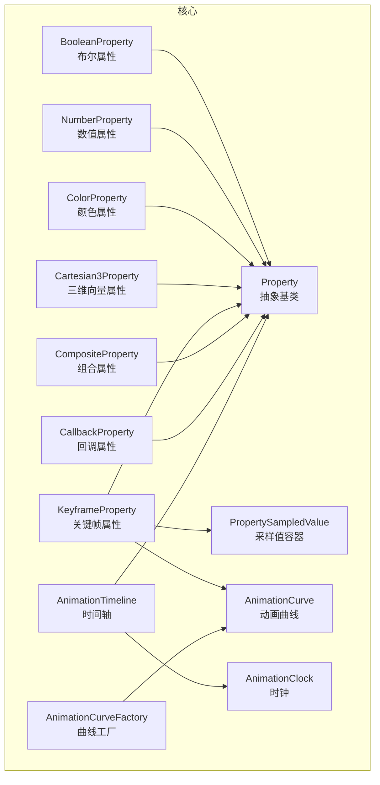
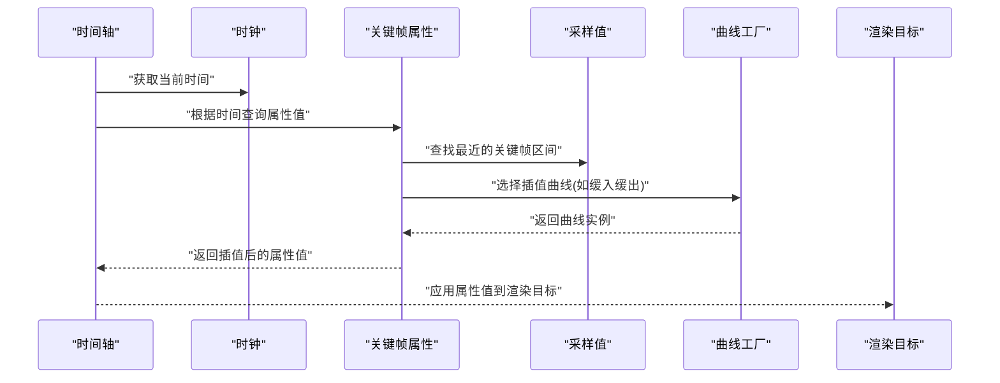
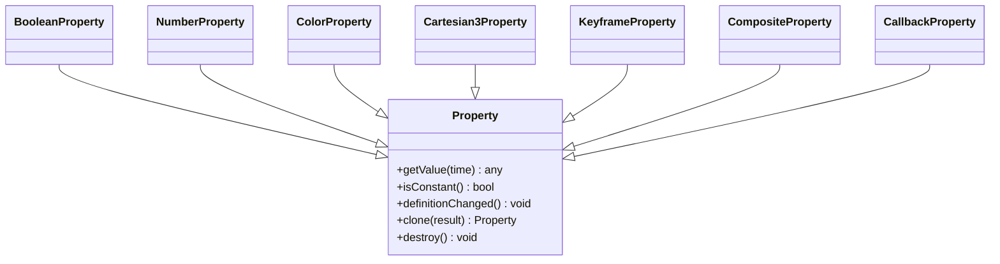
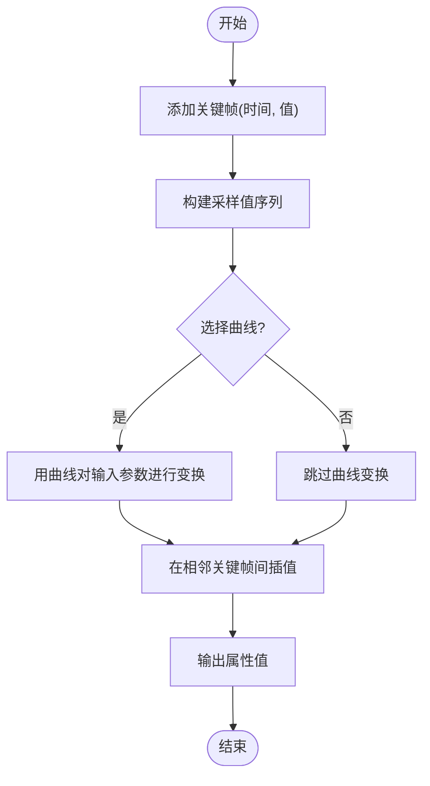
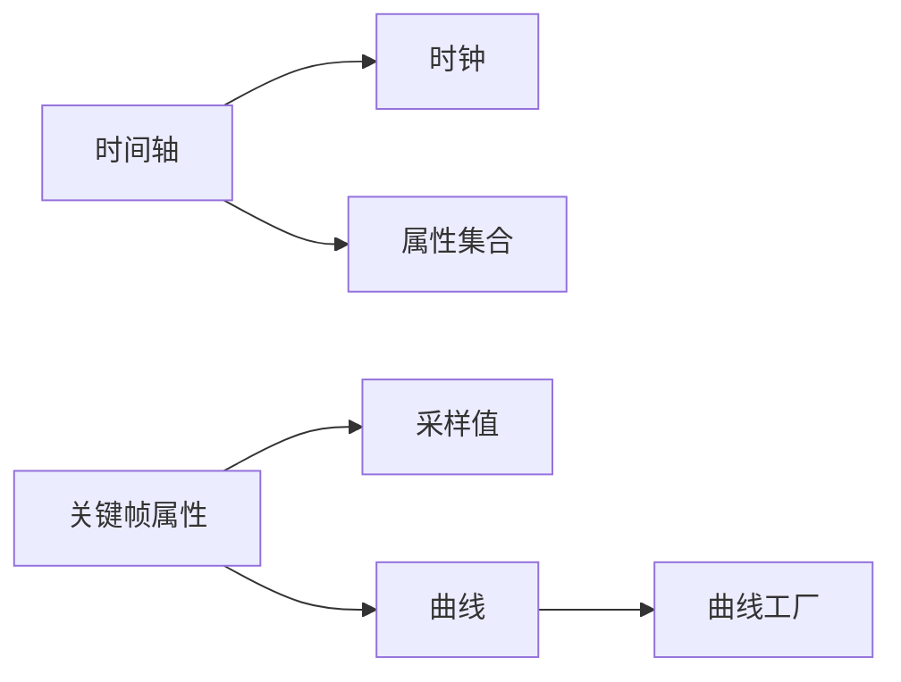

# 属性动画

<cite>
**本文引用的文件**   
- [Property.js](file://Source/Core/Property.js)
- [BooleanProperty.js](file://Source/Core/BooleanProperty.js)
- [NumberProperty.js](file://Source/Core/NumberProperty.js)
- [ColorProperty.js](file://Source/Core/ColorProperty.js)
- [Cartesian3Property.js](file://Source/Core/Cartesian3Property.js)
- [PropertySampledValue.js](file://Source/Core/PropertySampledValue.js)
- [KeyframeProperty.js](file://Source/Core/KeyframeProperty.js)
- [CompositeProperty.js](file://Source/Core/CompositeProperty.js)
- [CallbackProperty.js](file://Source/Core/CallbackProperty.js)
- [AnimationCurve.js](file://Source/Core/AnimationCurve.js)
- [AnimationCurveFactory.js](file://Source/Core/AnimationCurveFactory.js)
- [AnimationClock.js](file://Source/Core/AnimationClock.js)
- [AnimationTimeline.js](file://Source/Core/AnimationTimeline.js)
- [createDynamicProperty.js](file://Specs/createDynamicProperty.js)
</cite>

## 目录
1. [简介](#简介)
2. [项目结构](#项目结构)
3. [核心组件](#核心组件)
4. [架构总览](#架构总览)
5. [详细组件分析](#详细组件分析)
6. [依赖关系分析](#依赖关系分析)
7. [性能考虑](#性能考虑)
8. [故障排查指南](#故障排查指南)
9. [结论](#结论)
10. [附录](#附录)

## 简介
本文件面向Cesium的“属性动画”体系，系统性梳理属性类型、基类设计模式与扩展方法，覆盖布尔、数值、颜色、向量等属性的动态变化；详解关键帧与采样值模型、曲线工厂与时间轴驱动机制；并提供性能优化与内存管理最佳实践。文档以源码为依据，辅以可视化图示帮助读者快速理解并高效使用。

## 项目结构
属性动画相关代码主要位于 Source/Core 目录，围绕 Property 抽象基类构建，提供多种具体属性实现、采样与关键帧系统、曲线与时间驱动能力。测试用例位于 Specs 目录，用于验证动态属性行为。

图表来源
- [Property.js](file://Source/Core/Property.js)
- [BooleanProperty.js](file://Source/Core/BooleanProperty.js)
- [NumberProperty.js](file://Source/Core/NumberProperty.js)
- [ColorProperty.js](file://Source/Core/ColorProperty.js)
- [Cartesian3Property.js](file://Source/Core/Cartesian3Property.js)
- [PropertySampledValue.js](file://Source/Core/PropertySampledValue.js)
- [KeyframeProperty.js](file://Source/Core/KeyframeProperty.js)
- [CompositeProperty.js](file://Source/Core/CompositeProperty.js)
- [CallbackProperty.js](file://Source/Core/CallbackProperty.js)
- [AnimationCurve.js](file://Source/Core/AnimationCurve.js)
- [AnimationCurveFactory.js](file://Source/Core/AnimationCurveFactory.js)
- [AnimationClock.js](file://Source/Core/AnimationClock.js)
- [AnimationTimeline.js](file://Source/Core/AnimationTimeline.js)

章节来源
- [Property.js](file://Source/Core/Property.js)
- [KeyframeProperty.js](file://Source/Core/KeyframeProperty.js)
- [PropertySampledValue.js](file://Source/Core/PropertySampledValue.js)
- [AnimationCurve.js](file://Source/Core/AnimationCurve.js)
- [AnimationCurveFactory.js](file://Source/Core/AnimationCurveFactory.js)
- [AnimationClock.js](file://Source/Core/AnimationClock.js)
- [AnimationTimeline.js](file://Source/Core/AnimationTimeline.js)

## 核心组件
- Property 抽象基类：定义属性统一接口（取值、变更通知、克隆、销毁等），是所有属性类型的根。
- 具体属性类型：
  - BooleanProperty：布尔值属性，支持静态与动态切换。
  - NumberProperty：标量数值属性，常用于透明度、缩放等。
  - ColorProperty：颜色属性，支持 RGBA 插值与混合。
  - Cartesian3Property：三维向量属性，常用于位置、方向等。
- 采样与关键帧：
  - PropertySampledValue：存储按时间采样的值序列，供关键帧属性查询。
  - KeyframeProperty：基于关键帧与曲线进行插值的通用属性模板。
- 组合与回调：
  - CompositeProperty：将多个子属性组合为一个复合属性。
  - CallbackProperty：通过用户回调函数在每帧计算属性值。
- 曲线与时间：
  - AnimationCurve：描述单维曲线的数学表达与求值接口。
  - AnimationCurveFactory：提供线性、缓入缓出、弹性等常用曲线构造器。
  - AnimationClock：驱动时间推进与步长控制。
  - AnimationTimeline：将时间与属性绑定，协调多属性同步更新。

章节来源
- [Property.js](file://Source/Core/Property.js)
- [BooleanProperty.js](file://Source/Core/BooleanProperty.js)
- [NumberProperty.js](file://Source/Core/NumberProperty.js)
- [ColorProperty.js](file://Source/Core/ColorProperty.js)
- [Cartesian3Property.js](file://Source/Core/Cartesian3Property.js)
- [PropertySampledValue.js](file://Source/Core/PropertySampledValue.js)
- [KeyframeProperty.js](file://Source/Core/KeyframeProperty.js)
- [CompositeProperty.js](file://Source/Core/CompositeProperty.js)
- [CallbackProperty.js](file://Source/Core/CallbackProperty.js)
- [AnimationCurve.js](file://Source/Core/AnimationCurve.js)
- [AnimationCurveFactory.js](file://Source/Core/AnimationCurveFactory.js)
- [AnimationClock.js](file://Source/Core/AnimationClock.js)
- [AnimationTimeline.js](file://Source/Core/AnimationTimeline.js)

## 架构总览
属性动画由“时间驱动 + 关键帧/采样 + 曲线插值 + 属性对象”构成。时间轴从时钟获取当前时间，向关键帧或采样值请求对应时刻的属性值，必要时通过曲线对输入参数进行平滑处理，最终输出到渲染管线。

图表来源
- [AnimationTimeline.js](file://Source/Core/AnimationTimeline.js)
- [AnimationClock.js](file://Source/Core/AnimationClock.js)
- [KeyframeProperty.js](file://Source/Core/KeyframeProperty.js)
- [PropertySampledValue.js](file://Source/Core/PropertySampledValue.js)
- [AnimationCurveFactory.js](file://Source/Core/AnimationCurveFactory.js)

## 详细组件分析

### Property 基类与设计模式
- 职责：定义统一的属性生命周期与取值语义，包括是否可变、变更通知、克隆与销毁。
- 设计要点：
  - 所有具体属性继承自 Property，确保上层调用一致。
  - 支持“只读”与“可写”两种模式，便于性能优化与不可变数据流。
  - 提供变更事件，使订阅者可在属性变化时执行副作用（如重绘）。

图表来源
- [Property.js](file://Source/Core/Property.js)
- [BooleanProperty.js](file://Source/Core/BooleanProperty.js)
- [NumberProperty.js](file://Source/Core/NumberProperty.js)
- [ColorProperty.js](file://Source/Core/ColorProperty.js)
- [Cartesian3Property.js](file://Source/Core/Cartesian3Property.js)
- [KeyframeProperty.js](file://Source/Core/KeyframeProperty.js)
- [CompositeProperty.js](file://Source/Core/CompositeProperty.js)
- [CallbackProperty.js](file://Source/Core/CallbackProperty.js)

章节来源
- [Property.js](file://Source/Core/Property.js)

### 布尔属性（BooleanProperty）
- 用途：表示开关型状态，如可见性、启用/禁用。
- 特性：
  - 支持常量布尔值与动态切换。
  - 变更通知开销低，适合高频刷新场景。
- 扩展建议：
  - 若需复杂逻辑，可组合多个布尔属性或使用回调属性封装条件判断。

章节来源
- [BooleanProperty.js](file://Source/Core/BooleanProperty.js)

### 数值属性（NumberProperty）
- 用途：透明度、缩放比例、强度等标量。
- 特性：
  - 支持常量与动态数值。
  - 常与曲线配合实现平滑过渡。
- 注意事项：
  - 避免在每帧创建新对象，尽量复用结果容器。

章节来源
- [NumberProperty.js](file://Source/Core/NumberProperty.js)

### 颜色属性（ColorProperty）
- 用途：材质颜色、高亮、渐变等。
- 特性：
  - 支持 RGBA 四通道插值。
  - 可与关键帧结合实现颜色随时间变化。
- 性能提示：
  - 大量颜色属性时，注意合并与缓存策略，减少重复计算。

章节来源
- [ColorProperty.js](file://Source/Core/ColorProperty.js)

### 向量属性（Cartesian3Property）
- 用途：位置、位移、方向等三维向量。
- 特性：
  - 支持 XYZ 三通道插值。
  - 常用于路径动画与位移动画。
- 注意事项：
  - 大数量向量属性应关注内存占用与GC压力。

章节来源
- [Cartesian3Property.js](file://Source/Core/Cartesian3Property.js)

### 关键帧与采样（KeyframeProperty 与 PropertySampledValue）
- 关键帧属性：
  - 通过一组时间点与对应值定义动画。
  - 内部使用采样值容器存储离散样本。
  - 支持曲线对输入参数进行预处理，再插值得到最终值。
- 采样值容器：
  - 维护时间-值映射，提供按时间检索最近样本的能力。
  - 支持追加样本与批量更新。

图表来源
- [KeyframeProperty.js](file://Source/Core/KeyframeProperty.js)
- [PropertySampledValue.js](file://Source/Core/PropertySampledValue.js)
- [AnimationCurve.js](file://Source/Core/AnimationCurve.js)

章节来源
- [KeyframeProperty.js](file://Source/Core/KeyframeProperty.js)
- [PropertySampledValue.js](file://Source/Core/PropertySampledValue.js)

### 组合与回调（CompositeProperty 与 CallbackProperty）
- 组合属性：
  - 将多个子属性聚合为单一属性，适用于复合对象的动画。
  - 子属性变更时可触发父级变更通知。
- 回调属性：
  - 通过自定义函数在每帧计算属性值，灵活度最高。
  - 适合复杂逻辑或外部数据驱动的动画。

章节来源
- [CompositeProperty.js](file://Source/Core/CompositeProperty.js)
- [CallbackProperty.js](file://Source/Core/CallbackProperty.js)

### 曲线与曲线工厂（AnimationCurve 与 AnimationCurveFactory）
- 曲线：
  - 定义从[0,1]到[0,1]的映射函数，用于平滑过渡。
  - 常见类型：线性、缓入、缓出、缓入缓出、弹性等。
- 曲线工厂：
  - 提供便捷构造器，按名称或配置生成曲线实例。
  - 便于在不同动画中复用相同曲线。

章节来源
- [AnimationCurve.js](file://Source/Core/AnimationCurve.js)
- [AnimationCurveFactory.js](file://Source/Core/AnimationCurveFactory.js)

### 时间驱动（AnimationClock 与 AnimationTimeline）
- 时钟：
  - 推进模拟时间，提供步长与暂停/恢复控制。
- 时间轴：
  - 将时间与属性绑定，协调多个属性的同步更新。
  - 负责在每帧向属性请求当前值并应用到目标。

章节来源
- [AnimationClock.js](file://Source/Core/AnimationClock.js)
- [AnimationTimeline.js](file://Source/Core/AnimationTimeline.js)

### 自定义属性类型扩展指南
- 步骤概览：
  - 继承 Property 基类，实现 getValue、isConstant、definitionChanged、clone、destroy 等方法。
  - 如需关键帧动画，参考 KeyframeProperty 的实现模式，结合 PropertySampledValue 与曲线。
  - 在 isConstant 为 false 时，确保正确触发 definitionChanged 以便订阅者响应。
  - 在 clone 中深拷贝内部状态，避免共享引用导致意外修改。
- 示例参考：
  - 可参考测试中的动态属性创建方式，了解如何注册与使用自定义属性。

章节来源
- [Property.js](file://Source/Core/Property.js)
- [KeyframeProperty.js](file://Source/Core/KeyframeProperty.js)
- [PropertySampledValue.js](file://Source/Core/PropertySampledValue.js)
- [createDynamicProperty.js](file://Specs/createDynamicProperty.js)

## 依赖关系分析
- 内聚性与耦合：
  - Property 作为抽象层，降低上层对具体实现的耦合。
  - KeyframeProperty 依赖采样值与曲线，形成“时间-样本-曲线-插值”的内聚模块。
- 外部依赖：
  - 时间轴依赖时钟推进，属性依赖曲线工厂生成曲线。
- 潜在循环依赖：
  - 通过分层与接口隔离避免循环依赖，保持单向依赖关系。

图表来源
- [AnimationTimeline.js](file://Source/Core/AnimationTimeline.js)
- [AnimationClock.js](file://Source/Core/AnimationClock.js)
- [KeyframeProperty.js](file://Source/Core/KeyframeProperty.js)
- [PropertySampledValue.js](file://Source/Core/PropertySampledValue.js)
- [AnimationCurve.js](file://Source/Core/AnimationCurve.js)
- [AnimationCurveFactory.js](file://Source/Core/AnimationCurveFactory.js)

章节来源
- [AnimationTimeline.js](file://Source/Core/AnimationTimeline.js)
- [AnimationClock.js](file://Source/Core/AnimationClock.js)
- [KeyframeProperty.js](file://Source/Core/KeyframeProperty.js)
- [PropertySampledValue.js](file://Source/Core/PropertySampledValue.js)
- [AnimationCurve.js](file://Source/Core/AnimationCurve.js)
- [AnimationCurveFactory.js](file://Source/Core/AnimationCurveFactory.js)

## 性能考虑
- 对象复用：
  - 在每帧计算中复用结果容器，避免频繁分配与回收。
- 常量属性：
  - 对于不随时间变化的属性，设置 isConstant 为 true，可减少每帧计算与通知。
- 采样密度：
  - 合理设置关键帧间隔，过密会增加内存与插值开销，过疏影响动画质量。
- 曲线选择：
  - 简单场景优先使用线性曲线，复杂过渡使用缓入缓出或弹性曲线。
- 批量更新：
  - 对大量属性采用批处理与延迟通知，减少渲染抖动。
- 内存管理：
  - 及时销毁不再使用的属性与时间轴，释放内部资源。
  - 避免在回调属性中进行昂贵计算，必要时引入缓存或节流。

## 故障排查指南
- 常见问题：
  - 属性未更新：检查 isConstant 设置与 definitionChanged 是否正确触发。
  - 动画卡顿：评估关键帧密度与曲线复杂度，适当降采样或简化曲线。
  - 内存泄漏：确认 destroy 调用与对象生命周期管理。
- 调试建议：
  - 打印时间轴当前时间与属性采样点，验证插值区间。
  - 使用最小复现用例定位问题，逐步增加复杂度。

章节来源
- [Property.js](file://Source/Core/Property.js)
- [KeyframeProperty.js](file://Source/Core/KeyframeProperty.js)
- [AnimationTimeline.js](file://Source/Core/AnimationTimeline.js)

## 结论
Cesium 的属性动画体系以 Property 抽象为核心，结合关键帧、采样值与曲线工厂，提供了灵活且高性能的动画能力。通过合理选择属性类型、曲线与采样策略，并在时间轴驱动下统一管理，可实现丰富而流畅的动态效果。遵循对象复用、常量优化与内存管理最佳实践，可进一步提升整体性能与稳定性。

## 附录
- 术语表：
  - 属性：随时间变化的值载体。
  - 关键帧：指定时间点与对应值的集合。
  - 采样值：按时间离散存储的属性值序列。
  - 曲线：对输入参数进行平滑变换的函数。
  - 时间轴：将时间与属性绑定的调度器。
- 参考实现：
  - 动态属性创建与使用示例参见测试文件。

章节来源
- [createDynamicProperty.js](file://Specs/createDynamicProperty.js)