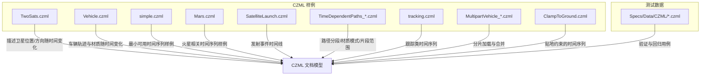
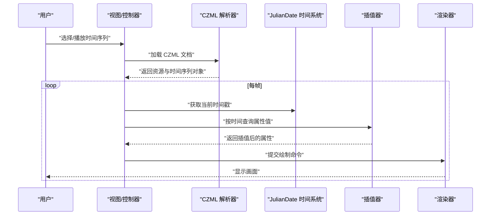
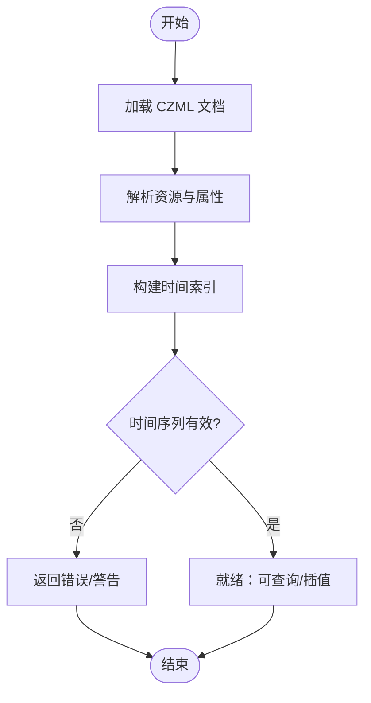
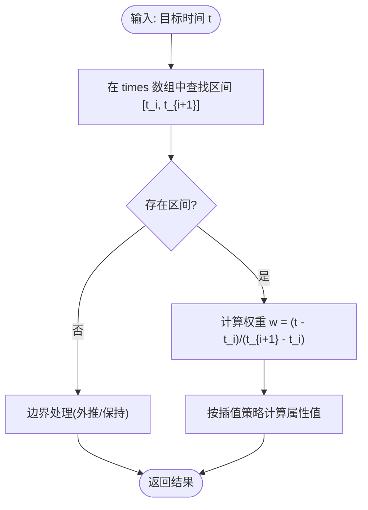
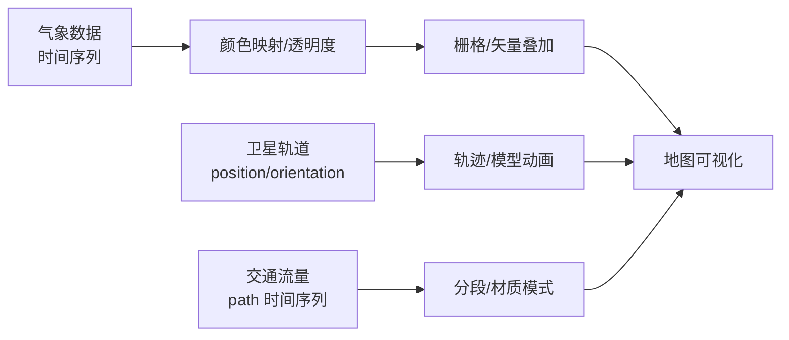
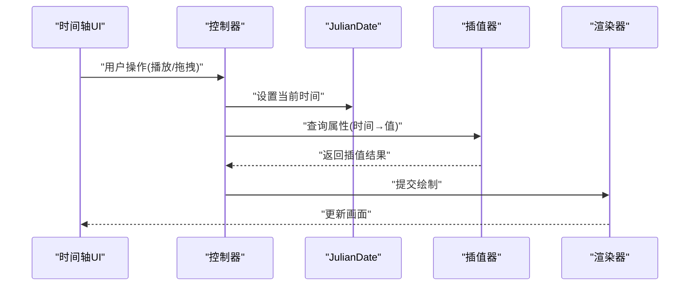
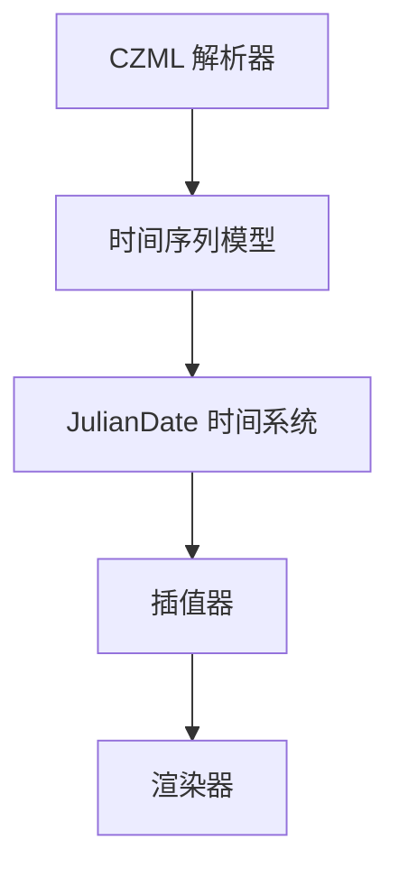

# 时间序列数据

<cite>
**本文引用的文件**   
- [Apps/SampleData/CZML/TwoSats.czml](file://Apps/SampleData/CZML/TwoSats.czml)
- [Apps/SampleData/CZML/Vehicle.czml](file://Apps/SampleData/CZML/Vehicle.czml)
- [Apps/SampleData/CZML/simple.czml](file://Apps/SampleData/CZML/simple.czml)
- [Apps/SampleData/CZML/Mars.czml](file://Apps/SampleData/CZML/Mars.czml)
- [Apps/SampleData/CZML/SatelliteLaunch.czml](file://Apps/SampleData/CZML/SatelliteLaunch.czml)
- [Apps/SampleData/CZML/TimeDependentPaths_Whole.czml](file://Apps/SampleData/CZML/TimeDependentPaths_Whole.czml)
- [Apps/SampleData/CZML/TimeDependentPaths_VaryingMaterialMode.czml](file://Apps/SampleData/CZML/TimeDependentPaths_VaryingMaterialMode.czml)
- [Apps/SampleData/CZML/TimeDependentPaths_Portions.czml](file://Apps/SampleData/CZML/TimeDependentPaths_Portions.czml)
- [Apps/SampleData/CZML/tracking.czml](file://Apps/SampleData/CZML/tracking.czml)
- [Apps/SampleData/CZML/MultipartVehicle_part1.czml](file://Apps/SampleData/CZML/MultipartVehicle_part1.czml)
- [Apps/SampleData/CZML/MultipartVehicle_part2.czml](file://Apps/SampleData/CZML/MultipartVehicle_part2.czml)
- [Apps/SampleData/CZML/MultipartVehicle_part3.czml](file://Apps/SampleData/CZML/MultipartVehicle_part3.czml)
- [Apps/SampleData/CZML/ClampToGround.czml](file://Apps/SampleData/CZML/ClampToGround.czml)
- [Specs/Data/CZML/TwoSats.czml](file://Specs/Data/CZML/TwoSats.czml)
- [Specs/Data/CZML/TwoSatsOrientation.czml](file://Specs/Data/CZML/TwoSatsOrientation.czml)
- [Specs/Data/CZML/TwoSatsRelativeReferenceEnds.czml](file://Specs/Data/CZML/TwoSatsRelativeReferenceEnds.czml)
- [Specs/Data/CZML/Vehicle.czml](file://Specs/Data/CZML/Vehicle.czml)
- [Specs/Data/CZML/simple.czml](file://Specs/Data/CZML/simple.czml)
- [Specs/Data/CZML/ValidationDocument.czml](file://Specs/Data/CZML/ValidationDocument.czml)
</cite>

## 目录
1. [引言](#引言)
2. [项目结构](#项目结构)
3. [核心组件](#核心组件)
4. [架构总览](#架构总览)
5. [详细组件分析](#详细组件分析)
6. [依赖分析](#依赖分析)
7. [性能考虑](#性能考虑)
8. [故障排查指南](#故障排查指南)
9. [结论](#结论)
10. [附录](#附录)

## 引言
本文件面向需要在 Cesium 中处理与可视化时间序列数据的开发者，聚焦 CZML 格式的时间序列数据结构与解析机制、JulianDate 时间系统与插值算法原理，并结合真实样例（气象变化、卫星轨道、交通流量）给出可视化方案。同时提供大数据量场景下的性能优化策略与内存管理建议，并展示如何实现交互式时间轴控制与回放功能。

## 项目结构
仓库中包含大量 CZML 示例数据，覆盖点轨迹、路径动画、多段拼接、相对参考、方向属性等典型时间序列场景。这些样例是理解 CZML 时间语义与渲染流程的直观入口。

图表来源
- [Apps/SampleData/CZML/TwoSats.czml](file://Apps/SampleData/CZML/TwoSats.czml)
- [Apps/SampleData/CZML/Vehicle.czml](file://Apps/SampleData/CZML/Vehicle.czml)
- [Apps/SampleData/CZML/simple.czml](file://Apps/SampleData/CZML/simple.czml)
- [Apps/SampleData/CZML/Mars.czml](file://Apps/SampleData/CZML/Mars.czml)
- [Apps/SampleData/CZML/SatelliteLaunch.czml](file://Apps/SampleData/CZML/SatelliteLaunch.czml)
- [Apps/SampleData/CZML/TimeDependentPaths_Whole.czml](file://Apps/SampleData/CZML/TimeDependentPaths_Whole.czml)
- [Apps/SampleData/CZML/TimeDependentPaths_VaryingMaterialMode.czml](file://Apps/SampleData/CZML/TimeDependentPaths_VaryingMaterialMode.czml)
- [Apps/SampleData/CZML/TimeDependentPaths_Portions.czml](file://Apps/SampleData/CZML/TimeDependentPaths_Portions.czml)
- [Apps/SampleData/CZML/tracking.czml](file://Apps/SampleData/CZML/tracking.czml)
- [Apps/SampleData/CZML/MultipartVehicle_part1.czml](file://Apps/SampleData/CZML/MultipartVehicle_part1.czml)
- [Apps/SampleData/CZML/MultipartVehicle_part2.czml](file://Apps/SampleData/CZML/MultipartVehicle_part2.czml)
- [Apps/SampleData/CZML/MultipartVehicle_part3.czml](file://Apps/SampleData/CZML/MultipartVehicle_part3.czml)
- [Apps/SampleData/CZML/ClampToGround.czml](file://Apps/SampleData/CZML/ClampToGround.czml)
- [Specs/Data/CZML/TwoSats.czml](file://Specs/Data/CZML/TwoSats.czml)
- [Specs/Data/CZML/TwoSatsOrientation.czml](file://Specs/Data/CZML/TwoSatsOrientation.czml)
- [Specs/Data/CZML/TwoSatsRelativeReferenceEnds.czml](file://Specs/Data/CZML/TwoSatsRelativeReferenceEnds.czml)
- [Specs/Data/CZML/Vehicle.czml](file://Specs/Data/CZML/Vehicle.czml)
- [Specs/Data/CZML/simple.czml](file://Specs/Data/CZML/simple.czml)
- [Specs/Data/CZML/ValidationDocument.czml](file://Specs/Data/CZML/ValidationDocument.czml)

章节来源
- [Apps/SampleData/CZML/TwoSats.czml](file://Apps/SampleData/CZML/TwoSats.czml)
- [Apps/SampleData/CZML/Vehicle.czml](file://Apps/SampleData/CZML/Vehicle.czml)
- [Apps/SampleData/CZML/simple.czml](file://Apps/SampleData/CZML/simple.czml)
- [Apps/SampleData/CZML/Mars.czml](file://Apps/SampleData/CZML/Mars.czml)
- [Apps/SampleData/CZML/SatelliteLaunch.czml](file://Apps/SampleData/CZML/SatelliteLaunch.czml)
- [Apps/SampleData/CZML/TimeDependentPaths_Whole.czml](file://Apps/SampleData/CZML/TimeDependentPaths_Whole.czml)
- [Apps/SampleData/CZML/TimeDependentPaths_VaryingMaterialMode.czml](file://Apps/SampleData/CZML/TimeDependentPaths_VaryingMaterialMode.czml)
- [Apps/SampleData/CZML/TimeDependentPaths_Portions.czml](file://Apps/SampleData/CZML/TimeDependentPaths_Portions.czml)
- [Apps/SampleData/CZML/tracking.czml](file://Apps/SampleData/CZML/tracking.czml)
- [Apps/SampleData/CZML/MultipartVehicle_part1.czml](file://Apps/SampleData/CZML/MultipartVehicle_part1.czml)
- [Apps/SampleData/CZML/MultipartVehicle_part2.czml](file://Apps/SampleData/CZML/MultipartVehicle_part2.czml)
- [Apps/SampleData/CZML/MultipartVehicle_part3.czml](file://Apps/SampleData/CZML/MultipartVehicle_part3.czml)
- [Apps/SampleData/CZML/ClampToGround.czml](file://Apps/SampleData/CZML/ClampToGround.czml)
- [Specs/Data/CZML/TwoSats.czml](file://Specs/Data/CZML/TwoSats.czml)
- [Specs/Data/CZML/TwoSatsOrientation.czml](file://Specs/Data/CZML/TwoSatsOrientation.czml)
- [Specs/Data/CZML/TwoSatsRelativeReferenceEnds.czml](file://Specs/Data/CZML/TwoSatsRelativeReferenceEnds.czml)
- [Specs/Data/CZML/Vehicle.czml](file://Specs/Data/CZML/Vehicle.czml)
- [Specs/Data/CZML/simple.czml](file://Specs/Data/CZML/simple.czml)
- [Specs/Data/CZML/ValidationDocument.czml](file://Specs/Data/CZML/ValidationDocument.czml)

## 核心组件
本节从“数据—时间—插值—渲染”的角度梳理时间序列的关键环节：
- CZML 文档模型：以资源为单元组织几何、材质、定位、方向等属性的时间序列定义。
- JulianDate 时间系统：统一的高精度时间表示，支持 UTC 秒级及更高精度运算。
- 时间插值：在离散采样点之间进行线性或样条插值，得到任意时刻的属性值。
- 渲染管线：将插值结果转换为可视化的点、线、面、模型等图元，并按帧更新。

章节来源
- [Apps/SampleData/CZML/TwoSats.czml](file://Apps/SampleData/CZML/TwoSats.czml)
- [Apps/SampleData/CZML/Vehicle.czml](file://Apps/SampleData/CZML/Vehicle.czml)
- [Apps/SampleData/CZML/simple.czml](file://Apps/SampleData/CZML/simple.czml)
- [Apps/SampleData/CZML/TimeDependentPaths_Whole.czml](file://Apps/SampleData/CZML/TimeDependentPaths_Whole.czml)
- [Apps/SampleData/CZML/TimeDependentPaths_VaryingMaterialMode.czml](file://Apps/SampleData/CZML/TimeDependentPaths_VaryingMaterialMode.czml)
- [Apps/SampleData/CZML/TimeDependentPaths_Portions.czml](file://Apps/SampleData/CZML/TimeDependentPaths_Portions.czml)

## 架构总览
下图展示了从 CZML 到最终渲染的核心流程：解析器读取 CZML，构建时间序列对象；JulianDate 驱动时间推进；插值器计算当前帧属性；渲染器输出图形。

[此图为概念性流程图，不直接映射具体源码文件]

## 详细组件分析

### CZML 时间序列数据结构与解析机制
- 资源与属性：每个资源可包含 position、orientation、path、material 等属性，并通过 time 或 times 字段声明时间集合。
- 时间集合：times 数组与对应属性数组一一对应，支持多种插值方式（如线性、步进）。
- 片段与范围：通过 startTime/endTime 限定某段数据生效区间，便于分段动画与按需加载。
- 相对参考：支持相对于其他资源或坐标系的相对位置/方向，简化复杂运动表达。
- 解析流程：解析器将 CZML JSON 转换为内部时间序列对象，建立时间索引以便快速查找与插值。

图表来源
- [Apps/SampleData/CZML/TwoSats.czml](file://Apps/SampleData/CZML/TwoSats.czml)
- [Apps/SampleData/CZML/Vehicle.czml](file://Apps/SampleData/CZML/Vehicle.czml)
- [Apps/SampleData/CZML/simple.czml](file://Apps/SampleData/CZML/simple.czml)
- [Apps/SampleData/CZML/TimeDependentPaths_Whole.czml](file://Apps/SampleData/CZML/TimeDependentPaths_Whole.czml)
- [Apps/SampleData/CZML/TimeDependentPaths_VaryingMaterialMode.czml](file://Apps/SampleData/CZML/TimeDependentPaths_VaryingMaterialMode.czml)
- [Apps/SampleData/CZML/TimeDependentPaths_Portions.czml](file://Apps/SampleData/CZML/TimeDependentPaths_Portions.czml)
- [Specs/Data/CZML/ValidationDocument.czml](file://Specs/Data/CZML/ValidationDocument.czml)

章节来源
- [Apps/SampleData/CZML/TwoSats.czml](file://Apps/SampleData/CZML/TwoSats.czml)
- [Apps/SampleData/CZML/Vehicle.czml](file://Apps/SampleData/CZML/Vehicle.czml)
- [Apps/SampleData/CZML/simple.czml](file://Apps/SampleData/CZML/simple.czml)
- [Apps/SampleData/CZML/TimeDependentPaths_Whole.czml](file://Apps/SampleData/CZML/TimeDependentPaths_Whole.czml)
- [Apps/SampleData/CZML/TimeDependentPaths_VaryingMaterialMode.czml](file://Apps/SampleData/CZML/TimeDependentPaths_VaryingMaterialMode.czml)
- [Apps/SampleData/CZML/TimeDependentPaths_Portions.czml](file://Apps/SampleData/CZML/TimeDependentPaths_Portions.czml)
- [Specs/Data/CZML/ValidationDocument.czml](file://Specs/Data/CZML/ValidationDocument.czml)

### JulianDate 时间系统与时间插值算法
- 时间系统：JulianDate 提供统一的连续时间尺度，避免日历边界问题，适合长时间跨度与高精度需求。
- 时间查询：给定目标时间，在有序时间数组上二分查找相邻节点，确定插值区间。
- 插值策略：
  - 线性插值：适用于大多数平滑变化的物理量（位置、颜色强度等）。
  - 阶跃插值：用于离散状态切换（如材质切换、可见性开关）。
  - 样条插值：对高光滑度要求的路径或姿态可采用更高阶插值。
- 边界处理：早于首个时间点采用外推或保持首值；晚于末个时间点采用尾值或循环策略。

图表来源
- [Apps/SampleData/CZML/TwoSats.czml](file://Apps/SampleData/CZML/TwoSats.czml)
- [Apps/SampleData/CZML/Vehicle.czml](file://Apps/SampleData/CZML/Vehicle.czml)
- [Apps/SampleData/CZML/simple.czml](file://Apps/SampleData/CZML/simple.czml)
- [Apps/SampleData/CZML/TimeDependentPaths_Whole.czml](file://Apps/SampleData/CZML/TimeDependentPaths_Whole.czml)
- [Apps/SampleData/CZML/TimeDependentPaths_VaryingMaterialMode.czml](file://Apps/SampleData/CZML/TimeDependentPaths_VaryingMaterialMode.czml)
- [Apps/SampleData/CZML/TimeDependentPaths_Portions.czml](file://Apps/SampleData/CZML/TimeDependentPaths_Portions.czml)

章节来源
- [Apps/SampleData/CZML/TwoSats.czml](file://Apps/SampleData/CZML/TwoSats.czml)
- [Apps/SampleData/CZML/Vehicle.czml](file://Apps/SampleData/CZML/Vehicle.czml)
- [Apps/SampleData/CZML/simple.czml](file://Apps/SampleData/CZML/simple.czml)
- [Apps/SampleData/CZML/TimeDependentPaths_Whole.czml](file://Apps/SampleData/CZML/TimeDependentPaths_Whole.czml)
- [Apps/SampleData/CZML/TimeDependentPaths_VaryingMaterialMode.czml](file://Apps/SampleData/CZML/TimeDependentPaths_VaryingMaterialMode.czml)
- [Apps/SampleData/CZML/TimeDependentPaths_Portions.czml](file://Apps/SampleData/CZML/TimeDependentPaths_Portions.czml)

### 真实场景案例：气象变化、卫星轨道、交通流量
- 气象变化：使用标量场或网格数据的时间序列，结合颜色映射与透明度，展示温度、降水等随时间的演变。可通过 path 或 point 聚合指标，并在时间轴上滑动观察。
- 卫星轨道：基于 TwoSats.czml 等资源，定义 position 与 orientation 的时间序列，实现轨道动画与姿态变化。
- 交通流量：利用 TimeDependentPaths_*.czml 系列，表达路段流量随时间的变化，支持分段与材质模式切换，体现不同时段拥堵程度。

图表来源
- [Apps/SampleData/CZML/TwoSats.czml](file://Apps/SampleData/CZML/TwoSats.czml)
- [Apps/SampleData/CZML/TimeDependentPaths_Whole.czml](file://Apps/SampleData/CZML/TimeDependentPaths_Whole.czml)
- [Apps/SampleData/CZML/TimeDependentPaths_VaryingMaterialMode.czml](file://Apps/SampleData/CZML/TimeDependentPaths_VaryingMaterialMode.czml)
- [Apps/SampleData/CZML/TimeDependentPaths_Portions.czml](file://Apps/SampleData/CZML/TimeDependentPaths_Portions.czml)

章节来源
- [Apps/SampleData/CZML/TwoSats.czml](file://Apps/SampleData/CZML/TwoSats.czml)
- [Apps/SampleData/CZML/TimeDependentPaths_Whole.czml](file://Apps/SampleData/CZML/TimeDependentPaths_Whole.czml)
- [Apps/SampleData/CZML/TimeDependentPaths_VaryingMaterialMode.czml](file://Apps/SampleData/CZML/TimeDependentPaths_VaryingMaterialMode.czml)
- [Apps/SampleData/CZML/TimeDependentPaths_Portions.czml](file://Apps/SampleData/CZML/TimeDependentPaths_Portions.czml)

### 交互式时间轴控制与数据回放
- 时间轴控件：提供播放/暂停、快进/快退、拖拽跳转等功能，绑定到 JulianDate 当前时间。
- 回放逻辑：根据时间步长推进时间，触发插值器重新计算属性，刷新渲染。
- 同步与节流：在高帧率下避免重复计算，必要时缓存最近区间的插值结果。

[此图为概念性流程图，不直接映射具体源码文件]

## 依赖分析
CZML 时间序列涉及以下关键依赖关系：
- 解析层：负责将 CZML JSON 转换为内部对象，建立时间与属性映射。
- 时间层：JulianDate 作为唯一时间源，确保跨时区与跨历法的一致性。
- 插值层：根据时间区间与策略计算属性值，支持多种数据类型（向量、矩阵、标量、颜色等）。
- 渲染层：将属性值应用到图元或材质，完成最终绘制。

图表来源
- [Apps/SampleData/CZML/TwoSats.czml](file://Apps/SampleData/CZML/TwoSats.czml)
- [Apps/SampleData/CZML/Vehicle.czml](file://Apps/SampleData/CZML/Vehicle.czml)
- [Apps/SampleData/CZML/simple.czml](file://Apps/SampleData/CZML/simple.czml)
- [Apps/SampleData/CZML/TimeDependentPaths_Whole.czml](file://Apps/SampleData/CZML/TimeDependentPaths_Whole.czml)
- [Apps/SampleData/CZML/TimeDependentPaths_VaryingMaterialMode.czml](file://Apps/SampleData/CZML/TimeDependentPaths_VaryingMaterialMode.czml)
- [Apps/SampleData/CZML/TimeDependentPaths_Portions.czml](file://Apps/SampleData/CZML/TimeDependentPaths_Portions.czml)

章节来源
- [Apps/SampleData/CZML/TwoSats.czml](file://Apps/SampleData/CZML/TwoSats.czml)
- [Apps/SampleData/CZML/Vehicle.czml](file://Apps/SampleData/CZML/Vehicle.czml)
- [Apps/SampleData/CZML/simple.czml](file://Apps/SampleData/CZML/simple.czml)
- [Apps/SampleData/CZML/TimeDependentPaths_Whole.czml](file://Apps/SampleData/CZML/TimeDependentPaths_Whole.czml)
- [Apps/SampleData/CZML/TimeDependentPaths_VaryingMaterialMode.czml](file://Apps/SampleData/CZML/TimeDependentPaths_VaryingMaterialMode.czml)
- [Apps/SampleData/CZML/TimeDependentPaths_Portions.czml](file://Apps/SampleData/CZML/TimeDependentPaths_Portions.czml)

## 性能考虑
针对大数据量时间序列的性能优化与内存管理建议：
- 数据分片与懒加载：将长时间序列拆分为多个 CZML 片段（如 MultipartVehicle_*.czml），按需加载与释放。
- 时间索引与二分查找：维护有序时间数组，提高查询效率；对频繁访问的区间进行缓存。
- 插值结果复用：在短时间窗口内复用上一帧插值结果，减少重复计算。
- 批量更新：将多个资源的属性更新合并，降低渲染调用次数。
- 内存回收：及时销毁不再使用的资源与中间对象，避免内存泄漏。
- 降采样与抽稀：在远距离或低缩放级别下对路径点进行抽稀，减少顶点数量。
- GPU 友好：尽量使用批处理与纹理图集，减少状态切换。

[本节为通用指导，不直接分析具体文件]

## 故障排查指南
常见问题与定位方法：
- 时间越界：检查 times 数组是否单调递增，确认目标时间是否在有效范围内。
- 插值异常：验证属性数组长度与 times 一致，确认插值策略是否符合数据特性。
- 分段失效：核对 startTime/endTime 是否正确闭合，避免重叠或遗漏。
- 相对参考错误：确认相对坐标系或父资源是否存在且有效。
- 解析失败：使用 ValidationDocument.czml 中的校验样例对比，定位语法或语义错误。

章节来源
- [Specs/Data/CZML/ValidationDocument.czml](file://Specs/Data/CZML/ValidationDocument.czml)
- [Apps/SampleData/CZML/TimeDependentPaths_Whole.czml](file://Apps/SampleData/CZML/TimeDependentPaths_Whole.czml)
- [Apps/SampleData/CZML/TimeDependentPaths_VaryingMaterialMode.czml](file://Apps/SampleData/CZML/TimeDependentPaths_VaryingMaterialMode.czml)
- [Apps/SampleData/CZML/TimeDependentPaths_Portions.czml](file://Apps/SampleData/CZML/TimeDependentPaths_Portions.czml)

## 结论
通过 CZML 的时间序列能力与 JulianDate 的统一时间系统，Cesium 能够高效表达与可视化复杂动态场景。合理的数据组织、插值策略与性能优化手段，可在保证精度的同时提升交互体验。结合交互式时间轴与回放功能，用户可灵活探索历史与预测数据，支撑气象、航天、交通等多领域应用。

[本节为总结性内容，不直接分析具体文件]

## 附录
- 样例清单与用途：
  - TwoSats.czml：双星轨道与姿态演示
  - Vehicle.czml：车辆轨迹与材质动画
  - simple.czml：最小时间序列样例
  - Mars.czml：火星相关时间序列
  - SatelliteLaunch.czml：发射事件时间线
  - TimeDependentPaths_*.czml：路径分段与材质模式
  - tracking.czml：跟踪类时间序列
  - MultipartVehicle_*.czml：分片加载与合并
  - ClampToGround.czml：贴地约束的时间序列
  - Specs/Data/CZML/*.czml：验证与回归用例

章节来源
- [Apps/SampleData/CZML/TwoSats.czml](file://Apps/SampleData/CZML/TwoSats.czml)
- [Apps/SampleData/CZML/Vehicle.czml](file://Apps/SampleData/CZML/Vehicle.czml)
- [Apps/SampleData/CZML/simple.czml](file://Apps/SampleData/CZML/simple.czml)
- [Apps/SampleData/CZML/Mars.czml](file://Apps/SampleData/CZML/Mars.czml)
- [Apps/SampleData/CZML/SatelliteLaunch.czml](file://Apps/SampleData/CZML/SatelliteLaunch.czml)
- [Apps/SampleData/CZML/TimeDependentPaths_Whole.czml](file://Apps/SampleData/CZML/TimeDependentPaths_Whole.czml)
- [Apps/SampleData/CZML/TimeDependentPaths_VaryingMaterialMode.czml](file://Apps/SampleData/CZML/TimeDependentPaths_VaryingMaterialMode.czml)
- [Apps/SampleData/CZML/TimeDependentPaths_Portions.czml](file://Apps/SampleData/CZML/TimeDependentPaths_Portions.czml)
- [Apps/SampleData/CZML/tracking.czml](file://Apps/SampleData/CZML/tracking.czml)
- [Apps/SampleData/CZML/MultipartVehicle_part1.czml](file://Apps/SampleData/CZML/MultipartVehicle_part1.czml)
- [Apps/SampleData/CZML/MultipartVehicle_part2.czml](file://Apps/SampleData/CZML/MultipartVehicle_part2.czml)
- [Apps/SampleData/CZML/MultipartVehicle_part3.czml](file://Apps/SampleData/CZML/MultipartVehicle_part3.czml)
- [Apps/SampleData/CZML/ClampToGround.czml](file://Apps/SampleData/CZML/ClampToGround.czml)
- [Specs/Data/CZML/TwoSats.czml](file://Specs/Data/CZML/TwoSats.czml)
- [Specs/Data/CZML/TwoSatsOrientation.czml](file://Specs/Data/CZML/TwoSatsOrientation.czml)
- [Specs/Data/CZML/TwoSatsRelativeReferenceEnds.czml](file://Specs/Data/CZML/TwoSatsRelativeReferenceEnds.czml)
- [Specs/Data/CZML/Vehicle.czml](file://Specs/Data/CZML/Vehicle.czml)
- [Specs/Data/CZML/simple.czml](file://Specs/Data/CZML/simple.czml)
- [Specs/Data/CZML/ValidationDocument.czml](file://Specs/Data/CZML/ValidationDocument.czml)