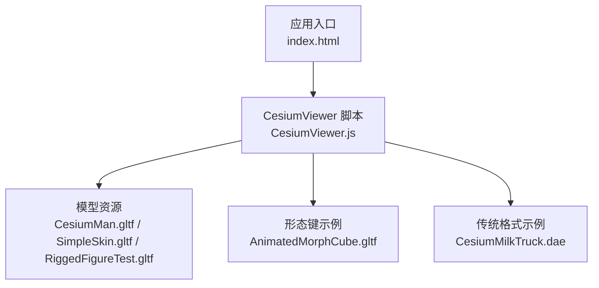
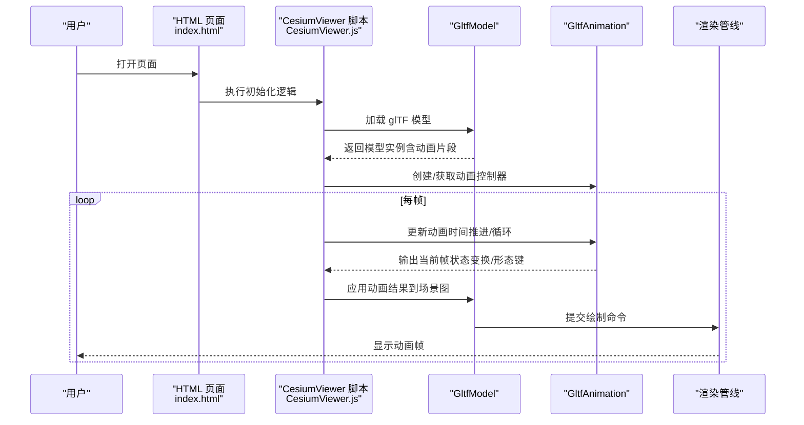
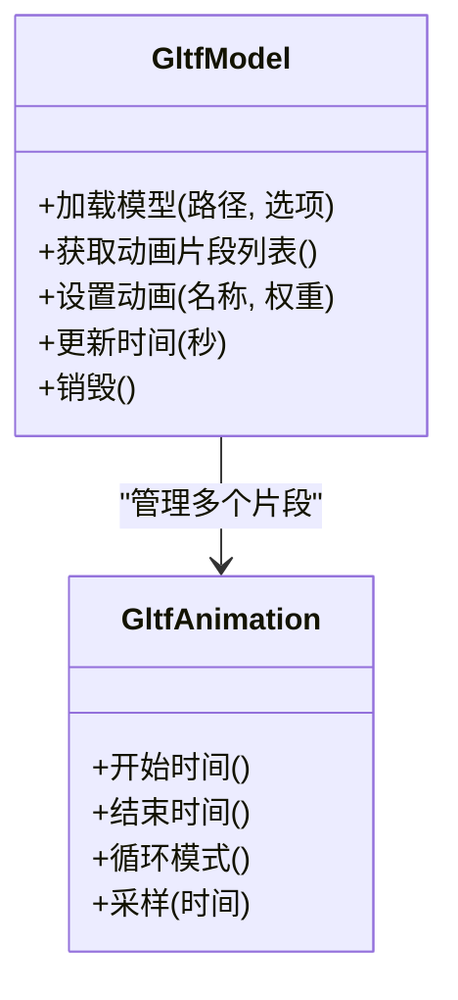
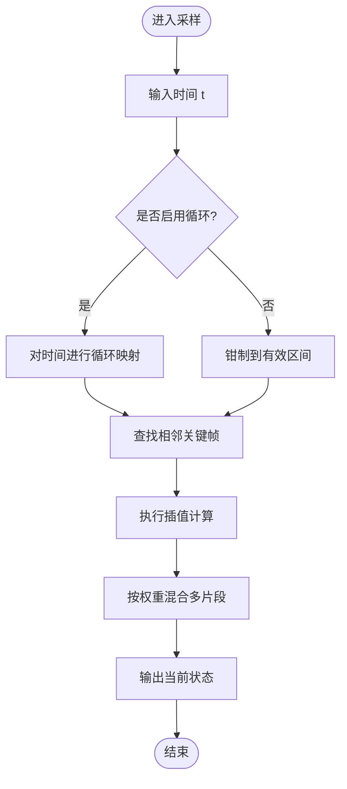
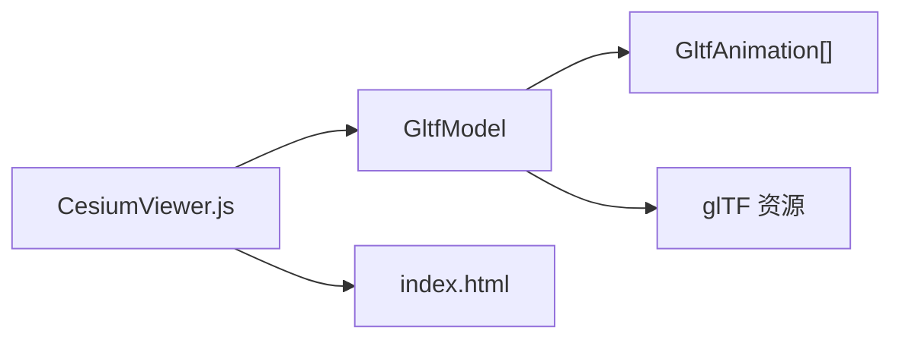

# 模型动画

<cite>
**本文引用的文件**   
- [README.md](file://README.md)
- [CesiumViewer.js](file://Apps/CesiumViewer/CesiumViewer.js)
- [index.html](file://Apps/CesiumViewer/index.html)
- [CesiumMan.gltf](file://Apps/SampleData/models/CesiumMan/CesiumMan.gltf)
- [CesiumMilkTruck.dae](file://Apps/SampleData/models/CesiumMilkTruck/CesiumMilkTruck.dae)
- [AnimatedMorphCube.gltf](file://Specs/Data/Models/glTF-2.0/AnimatedMorphCube/glTF/AnimatedMorphCube.gltf)
- [SimpleSkin.gltf](file://Specs/Data/Models/glTF-2.0/SimpleSkin/gltf/SimpleSkin.gltf)
- [RiggedFigureTest.gltf](file://Specs/Data/Models/glTF-2.0/RiggedFigureTest/gltf/RiggedFigureTest.gltf)
</cite>

## 目录
1. [简介](#简介)
2. [项目结构](#项目结构)
3. [核心组件](#核心组件)
4. [架构总览](#架构总览)
5. [详细组件分析](#详细组件分析)
6. [依赖分析](#依赖分析)
7. [性能考虑](#性能考虑)
8. [故障排查指南](#故障排查指南)
9. [结论](#结论)
10. [附录](#附录)

## 简介
本指南聚焦于在 Cesium 中实现与使用 glTF 模型的多种动画类型，包括骨骼动画、形态键（Morph）动画以及变换（位置/旋转/缩放）动画。文档将围绕 GltfModel 与 GltfAnimation 两类核心概念展开，解释动画混合、循环控制、时间同步等关键技术点，并提供基于仓库内示例模型的实际加载与动画控制流程说明，最后给出面向生产环境的性能优化与资源管理建议。

## 项目结构
仓库采用多包组织方式，应用示例位于 Apps 目录，测试数据与样例模型位于 Specs/Data 与 Apps/SampleData。与模型动画直接相关的入口与示例集中在 CesiumViewer 应用中，并通过 HTML 页面进行初始化与交互。

图表来源
- [index.html](file://Apps/CesiumViewer/index.html)
- [CesiumViewer.js](file://Apps/CesiumViewer/CesiumViewer.js)
- [CesiumMan.gltf](file://Apps/SampleData/models/CesiumMan/CesiumMan.gltf)
- [AnimatedMorphCube.gltf](file://Specs/Data/Models/glTF-2.0/AnimatedMorphCube/glTF/AnimatedMorphCube.gltf)
- [SimpleSkin.gltf](file://Specs/Data/Models/glTF-2.0/SimpleSkin/gltf/SimpleSkin.gltf)
- [RiggedFigureTest.gltf](file://Specs/Data/Models/glTF-2.0/RiggedFigureTest/gltf/RiggedFigureTest.gltf)
- [CesiumMilkTruck.dae](file://Apps/SampleData/models/CesiumMilkTruck/CesiumMilkTruck.dae)

章节来源
- [README.md](file://README.md)
- [index.html](file://Apps/CesiumViewer/index.html)
- [CesiumViewer.js](file://Apps/CesiumViewer/CesiumViewer.js)

## 核心组件
- GltfModel：负责加载与解析 glTF 模型，构建场景图、材质、纹理、动画节点等，并对外暴露动画播放接口（如选择动画、设置时间、循环模式、权重混合等）。
- GltfAnimation：封装 glTF 动画片段（AnimationClip），维护关键帧采样、插值策略、时间映射与循环行为，提供按时间获取当前状态的能力。

典型能力
- 动画类型支持
  - 骨骼动画：通过节点层级与矩阵关键帧驱动角色动作。
  - 形态键动画：对顶点属性进行逐顶点插值，实现表情或形变效果。
  - 变换动画：对节点的平移、旋转、缩放进行关键帧驱动。
- 动画混合：多个动画同时播放时，按权重合成最终变换或属性。
- 循环控制：单次、重复、往返等不同循环模式。
- 时间同步：以统一时钟推进动画时间，保证多模型、多动画的时序一致性。

章节来源
- [CesiumViewer.js](file://Apps/CesiumViewer/CesiumViewer.js)
- [CesiumMan.gltf](file://Apps/SampleData/models/CesiumMan/CesiumMan.gltf)
- [AnimatedMorphCube.gltf](file://Specs/Data/Models/glTF-2.0/AnimatedMorphCube/glTF/AnimatedMorphCube.gltf)
- [SimpleSkin.gltf](file://Specs/Data/Models/glTF-2.0/SimpleSkin/gltf/SimpleSkin.gltf)
- [RiggedFigureTest.gltf](file://Specs/Data/Models/glTF-2.0/RiggedFigureTest/gltf/RiggedFigureTest.gltf)

## 架构总览
下图展示了从页面到模型动画的关键调用路径与数据流。

图表来源
- [index.html](file://Apps/CesiumViewer/index.html)
- [CesiumViewer.js](file://Apps/CesiumViewer/CesiumViewer.js)
- [CesiumMan.gltf](file://Apps/SampleData/models/CesiumMan/CesiumMan.gltf)
- [AnimatedMorphCube.gltf](file://Specs/Data/Models/glTF-2.0/AnimatedMorphCube/glTF/AnimatedMorphCube.gltf)
- [SimpleSkin.gltf](file://Specs/Data/Models/glTF-2.0/SimpleSkin/gltf/SimpleSkin.gltf)
- [RiggedFigureTest.gltf](file://Specs/Data/Models/glTF-2.0/RiggedFigureTest/gltf/RiggedFigureTest.gltf)

## 详细组件分析

### GltfModel 类分析
职责
- 模型加载与解析：读取 glTF JSON 与二进制/外部资源，构建节点树、网格、材质、纹理。
- 动画装配：根据 glTF Animation 定义，生成可播放的动画片段集合，建立目标节点/属性的映射。
- 运行时更新：接收时间参数，计算各动画片段的当前状态，并按权重混合应用到场景图。
- 资源管理：跟踪纹理、缓冲区等资源生命周期，支持按需释放与复用。

关键流程
- 加载阶段：解析 glTF -> 构建场景图 -> 预取必要资源 -> 注册动画片段。
- 播放阶段：每帧推进时间 -> 采样关键帧 -> 插值计算 -> 写入节点矩阵/属性 -> 提交渲染。

图表来源
- [CesiumViewer.js](file://Apps/CesiumViewer/CesiumViewer.js)
- [CesiumMan.gltf](file://Apps/SampleData/models/CesiumMan/CesiumMan.gltf)
- [SimpleSkin.gltf](file://Specs/Data/Models/glTF-2.0/SimpleSkin/gltf/SimpleSkin.gltf)
- [RiggedFigureTest.gltf](file://Specs/Data/Models/glTF-2.0/RiggedFigureTest/gltf/RiggedFigureTest.gltf)

章节来源
- [CesiumViewer.js](file://Apps/CesiumViewer/CesiumViewer.js)
- [CesiumMan.gltf](file://Apps/SampleData/models/CesiumMan/CesiumMan.gltf)
- [SimpleSkin.gltf](file://Specs/Data/Models/glTF-2.0/SimpleSkin/gltf/SimpleSkin.gltf)
- [RiggedFigureTest.gltf](file://Specs/Data/Models/glTF-2.0/RiggedFigureTest/gltf/RiggedFigureTest.gltf)

### GltfAnimation 类分析
职责
- 关键帧存储：保存每个通道（Channel）的目标节点/属性与关键帧序列。
- 插值计算：根据时间定位相邻关键帧，执行线性/样条等插值策略。
- 循环控制：支持单次、重复、往返等循环模式，处理时间边界回绕。
- 混合输出：为同一目标的多个动画片段提供权重合成。

动画类型与通道
- 骨骼动画：目标为节点矩阵，驱动层级变换。
- 形态键动画：目标为顶点属性（如位置、法线），驱动几何形变。
- 变换动画：目标为节点平移、旋转、缩放。

图表来源
- [CesiumViewer.js](file://Apps/CesiumViewer/CesiumViewer.js)
- [AnimatedMorphCube.gltf](file://Specs/Data/Models/glTF-2.0/AnimatedMorphCube/glTF/AnimatedMorphCube.gltf)
- [SimpleSkin.gltf](file://Specs/Data/Models/glTF-2.0/SimpleSkin/gltf/SimpleSkin.gltf)
- [RiggedFigureTest.gltf](file://Specs/Data/Models/glTF-2.0/RiggedFigureTest/gltf/RiggedFigureTest.gltf)

章节来源
- [CesiumViewer.js](file://Apps/CesiumViewer/CesiumViewer.js)
- [AnimatedMorphCube.gltf](file://Specs/Data/Models/glTF-2.0/AnimatedMorphCube/glTF/AnimatedMorphCube.gltf)
- [SimpleSkin.gltf](file://Specs/Data/Models/glTF-2.0/SimpleSkin/gltf/SimpleSkin.gltf)
- [RiggedFigureTest.gltf](file://Specs/Data/Models/glTF-2.0/RiggedFigureTest/gltf/RiggedFigureTest.gltf)

### 动画类型详解与实践要点
- 骨骼动画
  - 适用场景：角色行走、挥手、转身等复杂动作。
  - 关键点：确保节点命名与 glTF 骨架一致；注意根节点变换与局部坐标差异；避免过度细分导致矩阵计算开销过大。
  - 参考模型：[CesiumMan.gltf](file://Apps/SampleData/models/CesiumMan/CesiumMan.gltf)、[SimpleSkin.gltf](file://Specs/Data/Models/glTF-2.0/SimpleSkin/gltf/SimpleSkin.gltf)、[RiggedFigureTest.gltf](file://Specs/Data/Models/glTF-2.0/RiggedFigureTest/gltf/RiggedFigureTest.gltf)
- 形态键动画
  - 适用场景：面部表情、物体形变、开关门等。
  - 关键点：关注顶点数量与属性对齐；合理设置权重与混合顺序；避免频繁切换大量形态键造成抖动。
  - 参考模型：[AnimatedMorphCube.gltf](file://Specs/Data/Models/glTF-2.0/AnimatedMorphCube/glTF/AnimatedMorphCube.gltf)
- 变换动画
  - 适用场景：机械臂旋转、平台升降、相机环绕等。
  - 关键点：区分全局与局部变换；注意四元数插值与欧拉角跳变问题；对周期性运动优先使用循环模式。

章节来源
- [CesiumMan.gltf](file://Apps/SampleData/models/CesiumMan/CesiumMan.gltf)
- [AnimatedMorphCube.gltf](file://Specs/Data/Models/glTF-2.0/AnimatedMorphCube/glTF/AnimatedMorphCube.gltf)
- [SimpleSkin.gltf](file://Specs/Data/Models/glTF-2.0/SimpleSkin/gltf/SimpleSkin.gltf)
- [RiggedFigureTest.gltf](file://Specs/Data/Models/glTF-2.0/RiggedFigureTest/gltf/RiggedFigureTest.gltf)

### 实际加载与动画控制示例（流程说明）
以下流程描述了在 CesiumViewer 中加载一个带骨骼动画的 glTF 模型并控制其播放的基本步骤。为避免泄露具体代码，本节仅给出步骤与对应文件路径，便于读者对照源码实现。

- 初始化页面与视图
  - 在页面中引入并执行 CesiumViewer 脚本，完成基础场景与相机设置。
  - 参考文件：[index.html](file://Apps/CesiumViewer/index.html)、[CesiumViewer.js](file://Apps/CesiumViewer/CesiumViewer.js)
- 加载模型
  - 调用模型加载接口，传入 glTF 路径与可选配置（如默认动画、材质选项）。
  - 参考模型：[CesiumMan.gltf](file://Apps/SampleData/models/CesiumMan/CesiumMan.gltf)
- 获取并播放动画
  - 从模型实例获取动画片段列表，选择目标动画名称，设置权重与循环模式。
  - 参考文件：[CesiumViewer.js](file://Apps/CesiumViewer/CesiumViewer.js)
- 每帧推进时间
  - 在渲染循环中推进动画时间，必要时进行循环回绕与边界处理。
  - 参考文件：[CesiumViewer.js](file://Apps/CesiumViewer/CesiumViewer.js)
- 混合与过渡
  - 当需要切换动画时，先淡入新动画、淡出旧动画，再逐步调整权重，避免突变。
  - 参考文件：[CesiumViewer.js](file://Apps/CesiumViewer/CesiumViewer.js)

章节来源
- [index.html](file://Apps/CesiumViewer/index.html)
- [CesiumViewer.js](file://Apps/CesiumViewer/CesiumViewer.js)
- [CesiumMan.gltf](file://Apps/SampleData/models/CesiumMan/CesiumMan.gltf)

### 复杂角色动画与机械运动效果
- 角色动画
  - 组合多个骨骼动画片段（如待机、行走、跑步），通过权重混合实现平滑过渡。
  - 使用事件或状态机驱动切换，结合时间同步确保动作衔接自然。
  - 参考模型：[CesiumMan.gltf](file://Apps/SampleData/models/CesiumMan/CesiumMan.gltf)、[SimpleSkin.gltf](file://Specs/Data/Models/glTF-2.0/SimpleSkin/gltf/SimpleSkin.gltf)、[RiggedFigureTest.gltf](file://Specs/Data/Models/glTF-2.0/RiggedFigureTest/gltf/RiggedFigureTest.gltf)
- 机械运动
  - 使用变换动画驱动关节旋转与位移，配合循环模式实现连续运转。
  - 对于多部件联动，可在模型层级中组织父子关系，减少运行时计算。
  - 参考模型：[CesiumMilkTruck.dae](file://Apps/SampleData/models/CesiumMilkTruck/CesiumMilkTruck.dae)

章节来源
- [CesiumMan.gltf](file://Apps/SampleData/models/CesiumMan/CesiumMan.gltf)
- [SimpleSkin.gltf](file://Specs/Data/Models/glTF-2.0/SimpleSkin/gltf/SimpleSkin.gltf)
- [RiggedFigureTest.gltf](file://Specs/Data/Models/glTF-2.0/RiggedFigureTest/gltf/RiggedFigureTest.gltf)
- [CesiumMilkTruck.dae](file://Apps/SampleData/models/CesiumMilkTruck/CesiumMilkTruck.dae)

## 依赖分析
- 模块耦合
  - CesiumViewer 作为应用层协调者，依赖 GltfModel 与 GltfAnimation 完成加载与播放。
  - GltfModel 内部聚合多个 GltfAnimation 实例，形成一对多的管理关系。
- 外部资源
  - glTF 模型与纹理、二进制缓冲等外部资源由模型加载器统一管理。
  - 传统格式（如 DAE）可作为补充示例，但核心动画能力以 glTF 为主。

图表来源
- [CesiumViewer.js](file://Apps/CesiumViewer/CesiumViewer.js)
- [index.html](file://Apps/CesiumViewer/index.html)
- [CesiumMan.gltf](file://Apps/SampleData/models/CesiumMan/CesiumMan.gltf)
- [AnimatedMorphCube.gltf](file://Specs/Data/Models/glTF-2.0/AnimatedMorphCube/glTF/AnimatedMorphCube.gltf)
- [SimpleSkin.gltf](file://Specs/Data/Models/glTF-2.0/SimpleSkin/gltf/SimpleSkin.gltf)
- [RiggedFigureTest.gltf](file://Specs/Data/Models/glTF-2.0/RiggedFigureTest/gltf/RiggedFigureTest.gltf)
- [CesiumMilkTruck.dae](file://Apps/SampleData/models/CesiumMilkTruck/CesiumMilkTruck.dae)

章节来源
- [CesiumViewer.js](file://Apps/CesiumViewer/CesiumViewer.js)
- [index.html](file://Apps/CesiumViewer/index.html)

## 性能考虑
- 动画采样与插值
  - 减少不必要的每帧重采样，缓存最近关键帧索引，降低插值开销。
  - 对高频小幅度变化可采用近似插值或降采样策略。
- 混合与权重
  - 限制同时激活的动画片段数量，避免过多权重合成。
  - 使用淡入淡出平滑切换，减少突变带来的额外计算。
- 资源管理
  - 及时释放不再使用的模型与纹理资源，避免内存泄漏。
  - 对共享资源（如纹理、材质）进行引用计数与复用。
- 渲染批次
  - 合并静态部分与动态部分的绘制批次，减少状态切换。
  - 对大规模实例化模型，优先考虑实例化渲染与批处理。
- 时间同步
  - 使用统一时钟推进动画时间，避免多模型间的时间漂移。
  - 对长周期动画采用模运算或循环映射，防止浮点误差累积。

## 故障排查指南
- 动画不播放
  - 检查模型是否包含有效的动画片段与通道定义。
  - 确认已正确选择动画名称并设置权重大于零。
  - 参考文件：[CesiumViewer.js](file://Apps/CesiumViewer/CesiumViewer.js)、[CesiumMan.gltf](file://Apps/SampleData/models/CesiumMan/CesiumMan.gltf)
- 动画卡顿或掉帧
  - 评估动画片段数量与复杂度，减少每帧插值与混合操作。
  - 检查纹理与缓冲大小，必要时进行压缩与分块加载。
  - 参考文件：[CesiumViewer.js](file://Apps/CesiumViewer/CesiumViewer.js)
- 动画循环异常
  - 验证循环模式配置与时间边界处理是否正确。
  - 对往返循环，检查起止时间的对称性与插值连续性。
  - 参考文件：[CesiumViewer.js](file://Apps/CesiumViewer/CesiumViewer.js)
- 形态键形变异常
  - 确认顶点数量与属性对齐，避免越界访问。
  - 检查形态键权重范围与混合顺序。
  - 参考文件：[AnimatedMorphCube.gltf](file://Specs/Data/Models/glTF-2.0/AnimatedMorphCube/glTF/AnimatedMorphCube.gltf)

章节来源
- [CesiumViewer.js](file://Apps/CesiumViewer/CesiumViewer.js)
- [CesiumMan.gltf](file://Apps/SampleData/models/CesiumMan/CesiumMan.gltf)
- [AnimatedMorphCube.gltf](file://Specs/Data/Models/glTF-2.0/AnimatedMorphCube/glTF/AnimatedMorphCube.gltf)

## 结论
通过 GltfModel 与 GltfAnimation 的协同工作，Cesium 能够高效地加载与播放 glTF 模型的骨骼动画、形态键动画与变换动画。在实际项目中，应重视动画混合与循环控制的细节设计，并结合资源管理与渲染批处理策略，以获得稳定流畅的动画表现。借助仓库内的示例模型与 CesiumViewer 应用，可以快速搭建角色与机械运动的动画演示，并在此基础上扩展更复杂的交互与状态管理。

## 附录
- 示例模型清单
  - 骨骼动画：[CesiumMan.gltf](file://Apps/SampleData/models/CesiumMan/CesiumMan.gltf)、[SimpleSkin.gltf](file://Specs/Data/Models/glTF-2.0/SimpleSkin/gltf/SimpleSkin.gltf)、[RiggedFigureTest.gltf](file://Specs/Data/Models/glTF-2.0/RiggedFigureTest/gltf/RiggedFigureTest.gltf)
  - 形态键动画：[AnimatedMorphCube.gltf](file://Specs/Data/Models/glTF-2.0/AnimatedMorphCube/glTF/AnimatedMorphCube.gltf)
  - 传统格式示例：[CesiumMilkTruck.dae](file://Apps/SampleData/models/CesiumMilkTruck/CesiumMilkTruck.dae)
- 应用入口
  - 页面与脚本：[index.html](file://Apps/CesiumViewer/index.html)、[CesiumViewer.js](file://Apps/CesiumViewer/CesiumViewer.js)