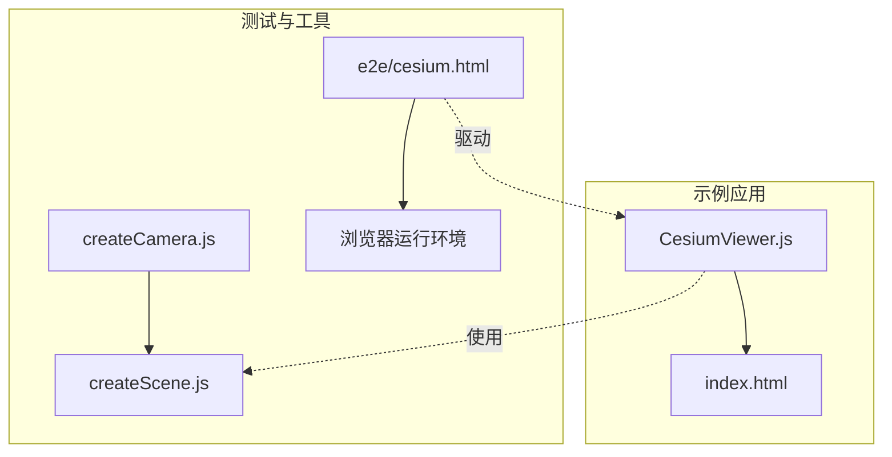
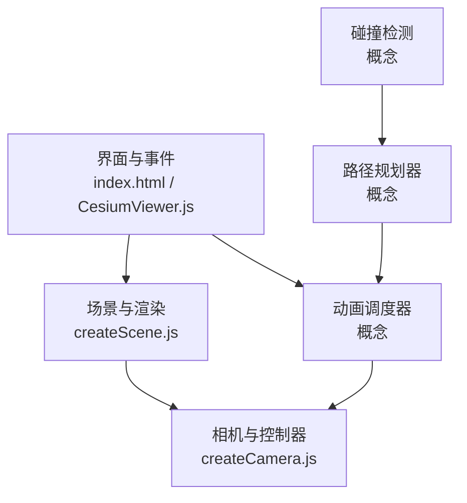
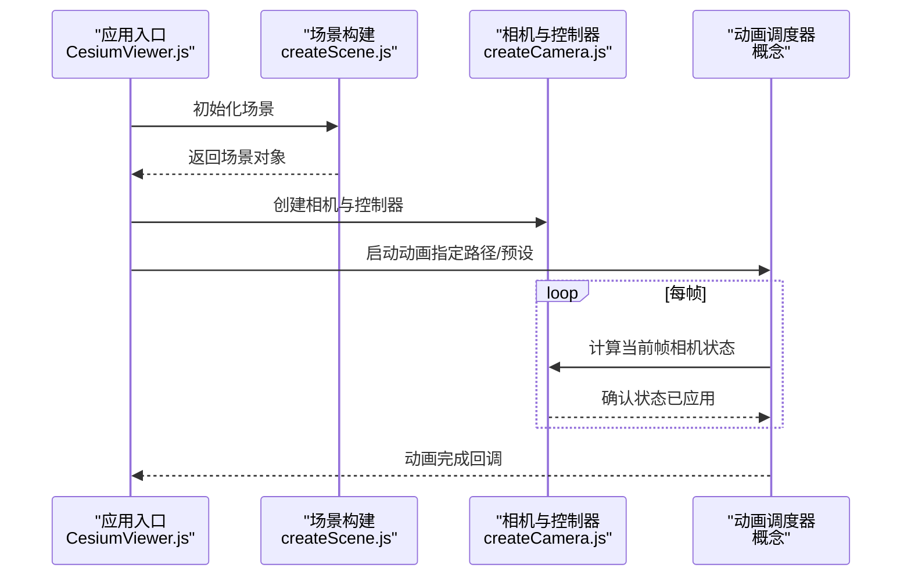
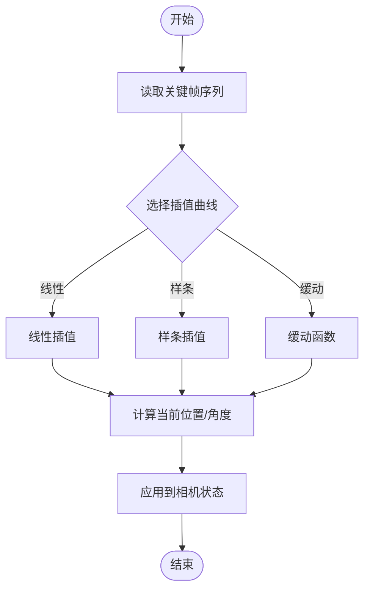
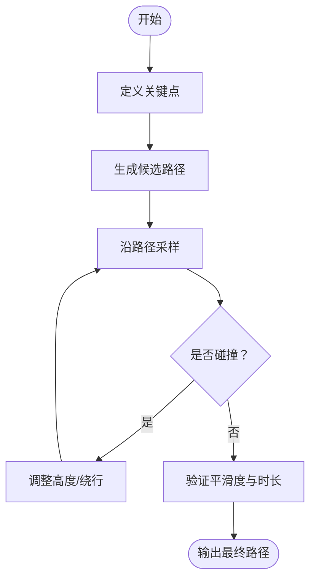
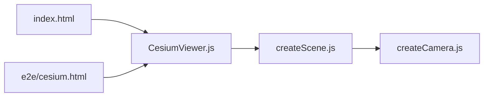

# 相机动画

<cite>
**本文引用的文件**   
- [createCamera.js](file://Specs/createCamera.js)
- [createScene.js](file://Specs/createScene.js)
- [e2e/cesium.html](file://Specs/e2e/cesium.html)
- [CesiumViewer.js](file://Apps/CesiumViewer/CesiumViewer.js)
- [index.html](file://Apps/CesiumViewer/index.html)
</cite>

## 目录
1. [简介](#简介)
2. [项目结构](#项目结构)
3. [核心组件](#核心组件)
4. [架构总览](#架构总览)
5. [详细组件分析](#详细组件分析)
6. [依赖关系分析](#依赖关系分析)
7. [性能考虑](#性能考虑)
8. [故障排查指南](#故障排查指南)
9. [结论](#结论)
10. [附录](#附录)

## 简介
本文件围绕“相机动画”主题，系统梳理 CesiumJS 仓库中与相机相关的测试与示例入口，帮助读者理解：
- 相机的飞行路径、视角切换、缩放过渡等动画效果在工程中的组织方式
- Camera 类及其控制器的协作关系（从测试与示例角度）
- 如何基于现有能力创建自定义动画路径与预设
- 用户体验优化与性能调优的通用建议

说明：由于仓库未直接提供完整的源码实现文件，本文以 Specs 与 Apps 中的相关入口为依据进行架构与流程层面的解读，并给出可操作的实践建议。

## 项目结构
与相机动画密切相关的代码主要分布在以下位置：
- Specs 测试辅助：用于构造场景与相机实例，便于验证动画行为
- e2e 端到端测试：通过浏览器页面驱动交互，覆盖相机动画用例
- Apps 示例应用：演示如何在应用中集成相机与动画

图表来源
- [CesiumViewer.js](file://Apps/CesiumViewer/CesiumViewer.js)
- [index.html](file://Apps/CesiumViewer/index.html)
- [createCamera.js](file://Specs/createCamera.js)
- [createScene.js](file://Specs/createScene.js)
- [e2e/cesium.html](file://Specs/e2e/cesium.html)

章节来源
- [CesiumViewer.js](file://Apps/CesiumViewer/CesiumViewer.js)
- [index.html](file://Apps/CesiumViewer/index.html)
- [createCamera.js](file://Specs/createCamera.js)
- [createScene.js](file://Specs/createScene.js)
- [e2e/cesium.html](file://Specs/e2e/cesium.html)

## 核心组件
- 相机实例与控制器
  - 通过测试辅助方法创建相机与场景，为动画提供基础对象与上下文
  - 控制器负责处理用户输入与自动动画状态机（如飞行、缩放、旋转）
- 动画调度与插值
  - 将时间参数映射到相机位置、目标点与视场角的变化
  - 支持关键帧序列与缓动函数，形成平滑过渡
- 路径规划与约束
  - 根据起点、终点与中间关键点生成连续轨迹
  - 结合地形与碰撞检测避免穿模或进入不可达区域
- 预设与自定义
  - 内置常用动画预设（如聚焦某地、环绕、俯冲）
  - 允许开发者定义关键帧与曲线，组合出复杂镜头运动

章节来源
- [createCamera.js](file://Specs/createCamera.js)
- [createScene.js](file://Specs/createScene.js)

## 架构总览
下图展示了示例应用与测试环境在相机动画方面的整体协作关系。

图表来源
- [CesiumViewer.js](file://Apps/CesiumViewer/CesiumViewer.js)
- [index.html](file://Apps/CesiumViewer/index.html)
- [createCamera.js](file://Specs/createCamera.js)
- [createScene.js](file://Specs/createScene.js)

## 详细组件分析

### 相机与控制器（基于测试与示例）
- 职责边界
  - 相机：维护位置、朝向、视场角等视图状态
  - 控制器：接收输入与指令，更新相机状态并协调动画
- 典型调用链
  - 初始化阶段：创建场景与相机
  - 运行时：根据动画进度计算新状态并应用到相机
  - 结束阶段：清理资源与回调通知

图表来源
- [CesiumViewer.js](file://Apps/CesiumViewer/CesiumViewer.js)
- [createScene.js](file://Specs/createScene.js)
- [createCamera.js](file://Specs/createCamera.js)

章节来源
- [CesiumViewer.js](file://Apps/CesiumViewer/CesiumViewer.js)
- [createScene.js](file://Specs/createScene.js)
- [createCamera.js](file://Specs/createCamera.js)

### 动画插值算法（概念性说明）
- 线性插值：适用于简单平移与缩放
- 样条插值：用于更自然的曲线运动（如贝塞尔、Catmull-Rom）
- 缓动函数：加速/减速曲线，提升观感
- 四元数球面插值：保证旋转过程无抖动与最短路径

[本节为概念性说明，不直接分析具体文件]

### 路径规划与碰撞检测（概念性说明）
- 路径规划
  - 输入：起点、终点、中间关键点、约束（高度、速度）
  - 输出：时间参数化的连续轨迹
- 碰撞检测
  - 沿轨迹采样点进行可见性与可达性校验
  - 遇到障碍时重规划或调整高度

[本节为概念性说明，不直接分析具体文件]

### 预设与自定义动画路径
- 预设类型
  - 聚焦：从当前位置平滑飞向目标点与目标高度
  - 环绕：围绕目标点做圆周或椭圆轨道运动
  - 俯冲/拉升：沿垂直方向快速改变高度
- 自定义步骤
  - 定义关键帧（时间戳、位置、目标点、视场角）
  - 选择插值曲线与缓动函数
  - 设置约束（最小/最大高度、速度上限）
  - 预览与回放，迭代优化

[本节为概念性说明，不直接分析具体文件]

## 依赖关系分析
- 示例应用依赖场景与相机构建工具
- e2e 测试通过页面驱动应用，间接验证相机动画行为

图表来源
- [index.html](file://Apps/CesiumViewer/index.html)
- [CesiumViewer.js](file://Apps/CesiumViewer/CesiumViewer.js)
- [createScene.js](file://Specs/createScene.js)
- [createCamera.js](file://Specs/createCamera.js)
- [e2e/cesium.html](file://Specs/e2e/cesium.html)

章节来源
- [index.html](file://Apps/CesiumViewer/index.html)
- [CesiumViewer.js](file://Apps/CesiumViewer/CesiumViewer.js)
- [createScene.js](file://Specs/createScene.js)
- [createCamera.js](file://Specs/createCamera.js)
- [e2e/cesium.html](file://Specs/e2e/cesium.html)

## 性能考虑
- 减少不必要的重绘
  - 合并多次相机状态更新，降低每帧计算量
- 合理设置动画时长与步长
  - 短距离移动采用较短时长，长距离采用分段插值
- 限制采样密度
  - 对复杂路径进行自适应采样，避免过多碰撞检测
- 利用硬件加速
  - 确保 WebGL 上下文稳定，避免频繁重建场景
- 移动端优化
  - 降低分辨率与阴影质量，缩短动画时长以提升流畅度

[本节为通用指导，不直接分析具体文件]

## 故障排查指南
- 常见问题
  - 相机穿模或进入地下：检查路径高度约束与碰撞检测结果
  - 动画卡顿：评估每帧计算复杂度，减少采样点数量
  - 视角突变：确认旋转插值使用四元数球面插值，避免欧拉角跳变
- 定位手段
  - 在 e2e 页面中逐步回放动画，观察关键帧时间点
  - 打印相机状态变化日志，核对位置、目标点与视场角
  - 对比不同插值曲线的视觉效果，选择合适的曲线与缓动

章节来源
- [e2e/cesium.html](file://Specs/e2e/cesium.html)

## 结论
通过对仓库中与相机动画相关的测试与示例入口进行分析，可以明确：
- 相机与控制器在动画流程中的职责清晰，配合场景构建与动画调度器形成完整链路
- 插值算法、路径规划与碰撞检测是高质量相机动画的核心技术点
- 预设与自定义路径提供了灵活的创作空间，满足多样化镜头需求
- 性能与体验优化需贯穿动画设计的全生命周期

[本节为总结性内容，不直接分析具体文件]

## 附录
- 参考入口
  - 示例应用：[CesiumViewer.js](file://Apps/CesiumViewer/CesiumViewer.js)、[index.html](file://Apps/CesiumViewer/index.html)
  - 测试辅助：[createCamera.js](file://Specs/createCamera.js)、[createScene.js](file://Specs/createScene.js)
  - e2e 页面：[e2e/cesium.html](file://Specs/e2e/cesium.html)