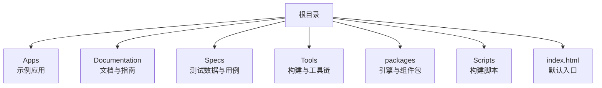
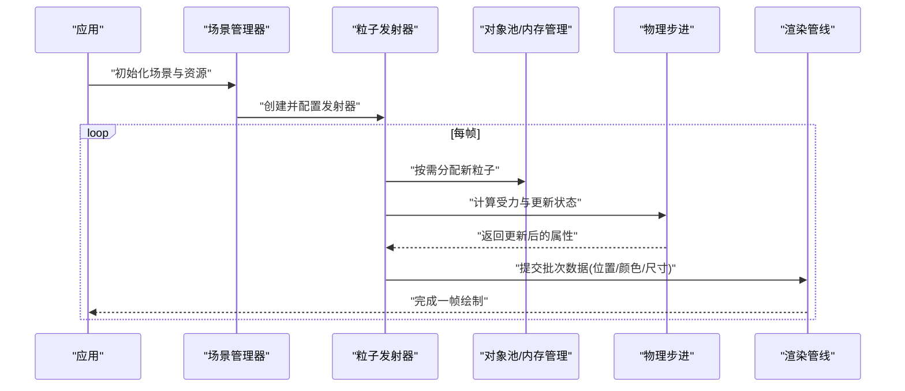
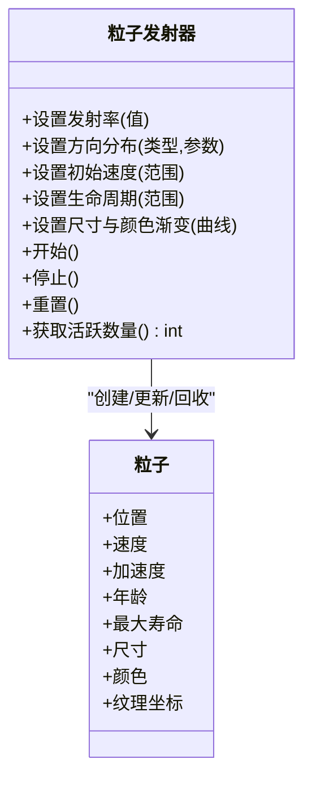
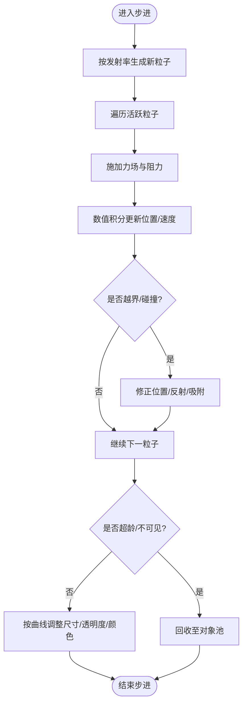
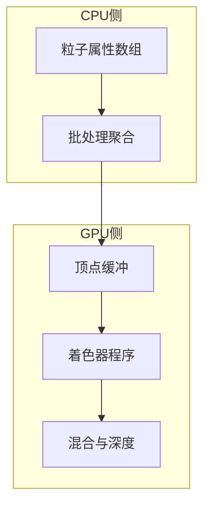
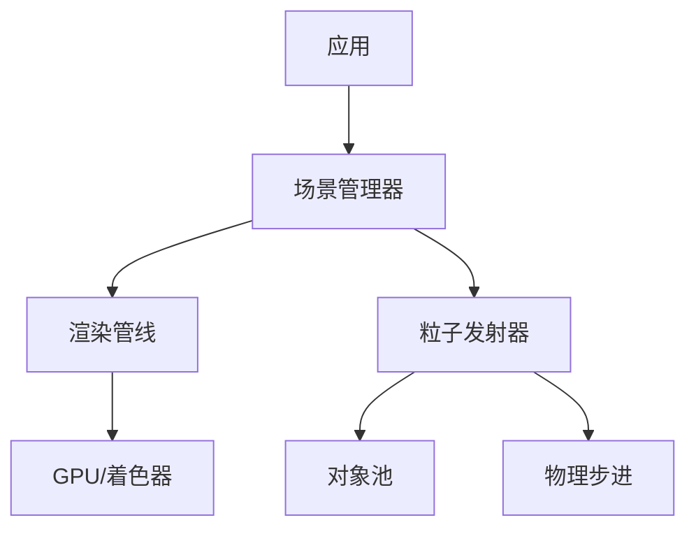

# 粒子系统

<cite>
**本文引用的文件**   
- [README.md](file://README.md)
- [index.html](file://index.html)
- [Apps/CesiumViewer/CesiumViewer.js](file://Apps/CesiumViewer/CesiumViewer.js)
- [Apps/HelloWorld.html](file://Apps/HelloWorld.html)
</cite>

## 目录
1. [简介](#简介)
2. [项目结构](#项目结构)
3. [核心组件](#核心组件)
4. [架构总览](#架构总览)
5. [详细组件分析](#详细组件分析)
6. [依赖关系分析](#依赖关系分析)
7. [性能考虑](#性能考虑)
8. [故障排查指南](#故障排查指南)
9. [结论](#结论)
10. [附录](#附录)

## 简介
本指南面向希望在 CesiumJS 中构建高质量粒子效果的开发者，围绕“粒子发射器、粒子生命周期、物理模拟”等核心概念展开，并结合仓库中的示例与入口文件，给出可操作的实践建议。需要特别说明的是：在当前工作区未检索到名为 ParticleSystem 或 ParticleEmitter 的类定义；因此本文将以通用粒子系统范式为基础，结合 CesiumJS 生态（如点云、材质、着色器）提供实现思路与优化策略，并明确标注哪些内容属于通用知识而非仓库内具体实现。

## 项目结构
仓库包含应用示例、文档、测试与工具链等。与粒子系统相关的参考位置包括：
- 应用入口与示例页面：用于理解如何加载资源、初始化场景与运行演示
- 文档与贡献者指南：了解构建、测试与发布流程，便于在本地复现实验环境

[本节为概览性说明，不直接分析具体源码文件]

## 核心组件
以下从通用粒子系统角度梳理关键组件与职责，帮助快速建立整体认知：
- 粒子发射器（Particle Emitter）
  - 负责粒子的产生策略：发射速率、方向分布、初始速度、初始尺寸、颜色与纹理选择、生命周期范围等
  - 支持多种发射模式：点源、面源、体源、沿路径/曲线发射、随时间变化的动态发射参数
- 粒子生命周期（Particle Lifecycle）
  - 状态机通常包含：生成、活跃、衰减、死亡/回收
  - 每帧更新属性：位置、速度、加速度、旋转、缩放、透明度、颜色、温度/湿度等
- 物理模拟（Physics Simulation）
  - 基础力场：重力、阻力、浮力、湍流/噪声场
  - 碰撞检测：地面贴合、体积碰撞、风切变边界
  - 数值积分：欧拉法、半隐式欧拉、RK4（视精度需求而定）
- 渲染管线（Rendering Pipeline）
  - 批处理与实例化：将大量粒子合并为少量绘制调用
  - GPU 加速：使用顶点缓冲、索引缓冲、GPU 缓存、Compute Shader（若平台支持）
  - 混合与深度：Alpha 混合、深度排序、Billboard 朝向
- 资源管理（Resource Management）
  - 纹理图集、材质复用、对象池、内存回收与阈值控制
- 配置与调试（Configuration & Debugging）
  - 可视化调试：发射器包围盒、速度矢量、热力图
  - 性能指标：FPS、Draw Calls、顶点数、内存占用

[本节为通用概念说明，不直接分析具体源码文件]

## 架构总览
下图展示了一个典型的 CPU+GPU 协同的粒子系统架构，强调数据流与控制流：

[本图为概念性流程图，不映射到具体源码文件]

## 详细组件分析

### 粒子发射器（概念设计）
- 职责
  - 根据时间步长与发射策略，批量产出粒子
  - 维护发射参数随时间的变化曲线（例如强度、扩散角、速度分布）
- 关键接口（概念）
  - 设置发射率、方向分布、初始速度范围、生命周期范围、尺寸与颜色渐变
  - 启用/禁用、暂停/恢复、重置
  - 查询当前活跃粒子数量、统计信息
- 数据结构（概念）
  - 粒子数组：位置、速度、加速度、年龄、最大寿命、尺寸、颜色、纹理坐标
  - 发射器状态：上次更新时间、累计发射计数、随机种子
- 复杂度与优化
  - 每帧 O(N) 更新 N 个活跃粒子
  - 通过对象池避免频繁分配/释放
  - 使用 SIMD/GPU 并行加速（可选）

[本图为概念类图，不映射到具体源码文件]

### 生命周期与物理步进（算法流程）
- 典型流程
  - 生成阶段：按发射率与概率模型创建粒子，赋予初始属性
  - 步进阶段：对每个活跃粒子执行物理更新（力场、阻力、碰撞）
  - 衰减阶段：依据年龄与曲线调整尺寸、透明度、颜色
  - 回收阶段：超过最大寿命或离开可视区域则回收至对象池
- 数值积分
  - 简单场景可用半隐式欧拉；高精度需求可使用 RK4
- 碰撞与约束
  - 地面贴合：投影到地形高度或平面
  - 体积碰撞：球体/轴对齐包围盒检测
  - 边界限制：防止粒子逃逸可视区域

[本图为概念流程图，不映射到具体源码文件]

### 渲染与批处理（概念设计）
- 批处理策略
  - 将同材质/同纹理的粒子合并为单次 Draw Call
  - 使用顶点缓冲与索引缓冲减少 CPU-GPU 传输开销
- GPU 加速
  - 将位置、颜色、尺寸等属性上传至 GPU 缓冲区
  - 在着色器中计算 Billboard 朝向与大小
- Alpha 混合与深度
  - 合理设置混合模式与深度写入，避免闪烁与错误遮挡

[本图为概念图，不映射到具体源码文件]

### 实际效果案例（概念指导）
- 烟雾
  - 特点：缓慢上升、扩散、透明度渐增后渐减、颜色偏灰白
  - 关键点：低初速、强阻力、大尺寸增长、弱重力
- 火焰
  - 特点：向上喷发、亮度高、颜色由黄到红再到暗
  - 关键点：正加速度、湍流噪声、尺寸先增后减、强发光
- 雪花
  - 特点：缓慢飘落、左右摇摆、随机旋转
  - 关键点：负重力、横向扰动、小尺寸、慢衰减
- 爆炸
  - 特点：瞬时爆发、向外扩散、快速衰减
  - 关键点：高初速、短寿命、强衰减、颜色由亮到暗

[本节为通用效果指导，不直接分析具体源码文件]

### 与仓库示例的结合方式
- 入口与示例页面可用于验证上述概念：
  - 通过 index.html 启动应用，观察场景初始化与资源加载过程
  - 参考 Apps/CesiumViewer/CesiumViewer.js 的组织方式，将粒子系统作为独立模块集成到场景中
  - 使用 Apps/HelloWorld.html 进行最小化实验，逐步加入发射器与渲染逻辑

**章节来源**
- [index.html](file://index.html)
- [Apps/CesiumViewer/CesiumViewer.js](file://Apps/CesiumViewer/CesiumViewer.js)
- [Apps/HelloWorld.html](file://Apps/HelloWorld.html)

## 依赖关系分析
- 内部依赖
  - 应用层依赖场景管理器与渲染管线
  - 粒子系统依赖对象池、物理步进与渲染批处理
- 外部依赖
  - WebGL/WebGPU 驱动与着色器编译
  - 纹理与材质资源加载器
- 潜在循环依赖
  - 应避免渲染模块反向依赖发射器逻辑，保持单向数据流

[本图为概念图，不映射到具体源码文件]

## 性能考虑
- 批处理渲染
  - 合并相同材质的粒子，减少 Draw Call
  - 使用 Instancing 或自定义 Buffer 布局提升吞吐
- GPU 加速
  - 将高频更新的属性置于 GPU 缓冲区
  - 在着色器中计算 Billboard 与混合，降低 CPU 负担
- 内存管理
  - 对象池复用粒子实例，避免 GC 抖动
  - 纹理图集与材质共享，减少显存占用
- 数值稳定性
  - 采用固定时间步或自适应步长，保证物理一致性
  - 对极端参数做钳制与归一化，避免溢出
- 可视性与裁剪
  - 基于相机视锥剔除远端粒子
  - 根据距离动态降低粒子密度与细节

[本节为通用性能建议，不直接分析具体源码文件]

## 故障排查指南
- 常见问题
  - 粒子闪烁或重叠错误：检查 Alpha 混合与深度写入顺序
  - 性能骤降：确认是否存在过多 Draw Call 或未批处理
  - 内存泄漏：核查对象池是否正确回收与释放
  - 物理异常：检查力场系数、阻尼与时间步长
- 定位方法
  - 使用 Stats 面板或自定义计数器监控 FPS、Draw Calls、顶点数
  - 开启调试视图，可视化发射器包围盒与粒子速度向量
  - 分模块隔离问题：仅启用发射器、仅启用渲染、仅启用物理

[本节为通用排障建议，不直接分析具体源码文件]

## 结论
尽管当前仓库未提供名为 ParticleSystem 或 ParticleEmitter 的具体实现，但通过通用粒子系统范式与仓库中的示例入口，可以高效地在 CesiumJS 环境中集成与扩展粒子效果。建议以模块化方式组织发射器、物理与渲染逻辑，优先关注批处理与对象池带来的性能收益，并通过可视化调试与指标监控持续优化体验。

[本节为总结性内容，不直接分析具体源码文件]

## 附录
- 术语表
  - 粒子：具有位置、速度、尺寸、颜色等属性的离散实体
  - 发射器：负责产生粒子的控制器
  - 生命周期：从生成到回收的状态序列
  - 批处理：将多个绘制目标合并为一次调用的技术
- 参考入口
  - 默认入口：index.html
  - 示例应用：Apps/CesiumViewer/CesiumViewer.js
  - 最小示例：Apps/HelloWorld.html

**章节来源**
- [README.md](file://README.md)
- [index.html](file://index.html)
- [Apps/CesiumViewer/CesiumViewer.js](file://Apps/CesiumViewer/CesiumViewer.js)
- [Apps/HelloWorld.html](file://Apps/HelloWorld.html)