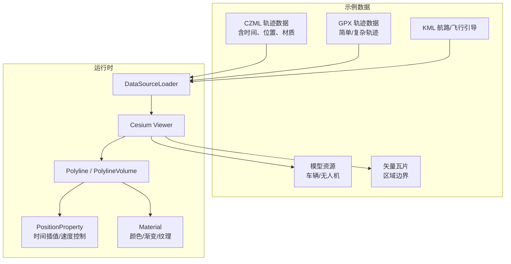
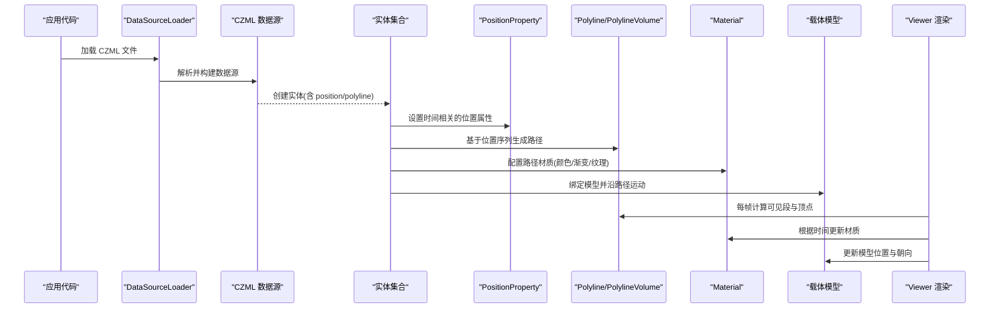
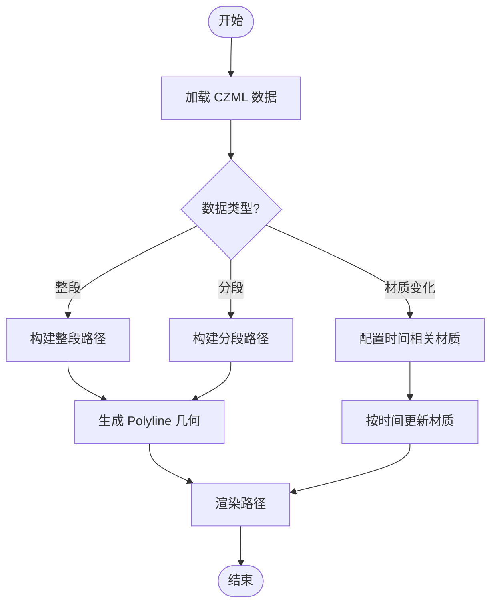
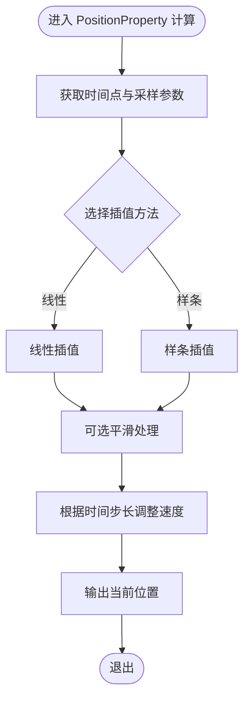
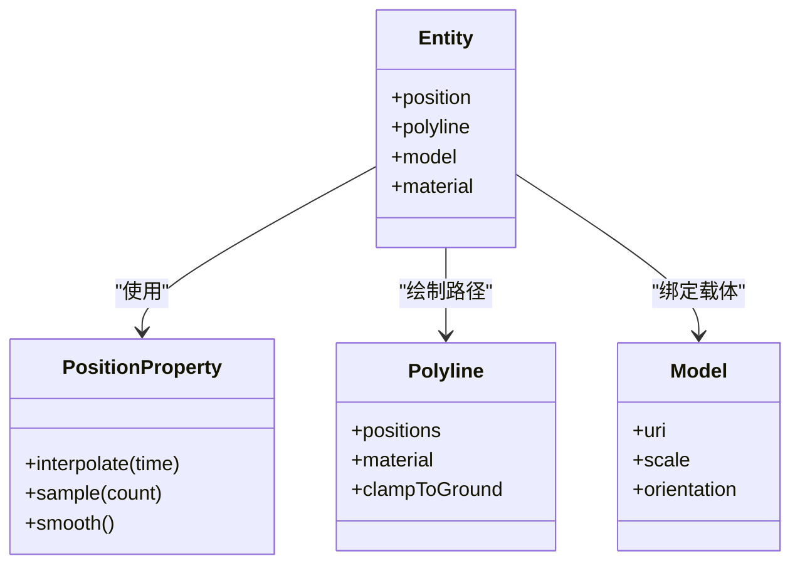
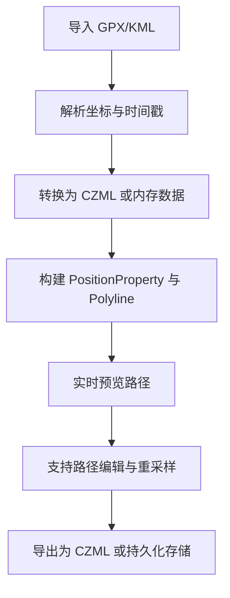
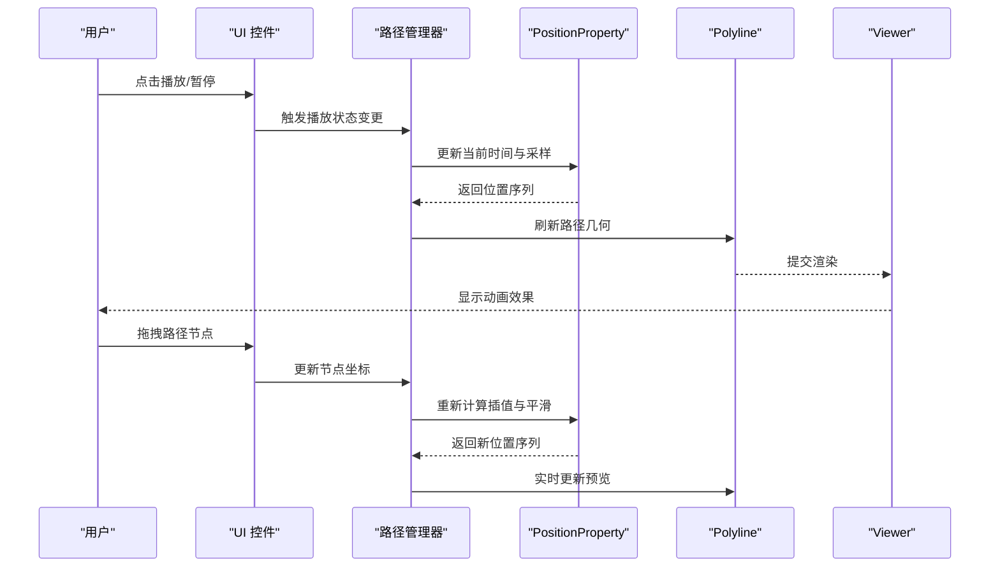
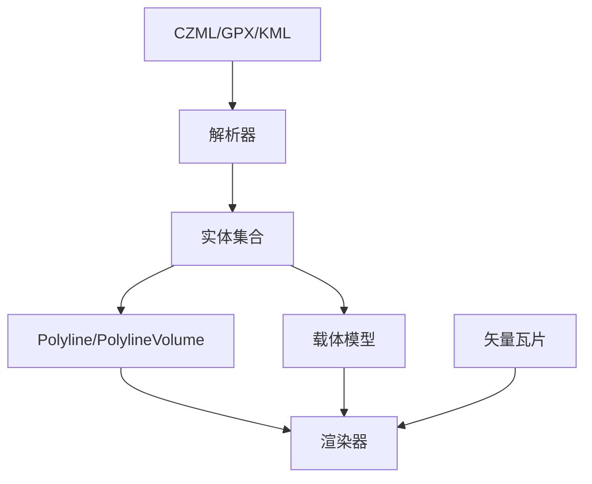

# 路径动画

<cite>
**本文引用的文件**   
- [Apps/SampleData/CZML/TimeDependentPaths_Whole.czml](file://Apps/SampleData/CZML/TimeDependentPaths_Whole.czml)
- [Apps/SampleData/CZML/TimeDependentPaths_Portions.czml](file://Apps/SampleData/CZML/TimeDependentPaths_Portions.czml)
- [Apps/SampleData/CZML/TimeDependentPaths_VaryingMaterialMode.czml](file://Apps/SampleData/CZML/TimeDependentPaths_VaryingMaterialMode.czml)
- [Apps/SampleData/CZML/Vehicle.czml](file://Apps/SampleData/CZML/Vehicle.czml)
- [Apps/SampleData/CZML/Mars.czml](file://Apps/SampleData/CZML/Mars.czml)
- [Apps/SampleData/CZML/TwoSats.czml](file://Apps/SampleData/CZML/TwoSats.czml)
- [Apps/SampleData/CZML/tracking.czml](file://Apps/SampleData/CZML/tracking.czml)
- [Apps/SampleData/CZML/ClampToGround.czml](file://Apps/SampleData/CZML/ClampToGround.czml)
- [Apps/SampleData/gpx/simple.gpx](file://Apps/SampleData/gpx/simple.gpx)
- [Apps/SampleData/gpx/route.gpx](file://Apps/SampleData/gpx/route.gpx)
- [Apps/SampleData/gpx/complexTrk.gpx](file://Apps/SampleData/gpx/complexTrk.gpx)
- [Apps/SampleData/kml/bikeRide.kml](file://Apps/SampleData/kml/bikeRide.kml)
- [Apps/SampleData/kml/eiffel-tower-flyto.kml](file://Apps/SampleData/kml/eiffel-tower-flyto.kml)
- [Apps/SampleData/models/CesiumMilkTruck/CesiumMilkTruck.dae](file://Apps/SampleData/models/CesiumMilkTruck/CesiumMilkTruck.dae)
- [Apps/SampleData/models/GroundVehicle/GroundVehicle.glb](file://Apps/SampleData/models/GroundVehicle/GroundVehicle.glb)
- [Apps/SampleData/models/CesiumDrone/CesiumDrone.glb](file://Apps/SampleData/models/CesiumDrone/CesiumDrone.glb)
- [Apps/SampleData/vector/sample-us-states.tileset.json](file://Apps/SampleData/vector/sample-us-states.tileset.json)
</cite>

## 目录
1. [简介](#简介)
2. [项目结构](#项目结构)
3. [核心组件](#核心组件)
4. [架构总览](#架构总览)
5. [详细组件分析](#详细组件分析)
6. [依赖关系分析](#依赖关系分析)
7. [性能考虑](#性能考虑)
8. [故障排查指南](#故障排查指南)
9. [结论](#结论)
10. [附录](#附录)

## 简介
本指南聚焦于在 CesiumJS 中使用 CZML 定义复杂路径轨迹，覆盖车辆行驶路线、卫星轨道、飞行器路径等动态场景。重点讲解 PositionProperty 的时间插值、速度控制与路径平滑处理，并提供可交互路径动画的完整实现思路（播放控制、路径编辑、实时预览）。同时给出大数据量路径的性能优化策略与落地方案。

## 项目结构
仓库中包含大量用于演示路径与轨迹的数据样例：
- CZML 示例：包含整段路径、分段路径、材质变化路径、多目标跟踪、贴地路径等
- GPX/KML 示例：提供 GPS 轨迹与航路数据，便于转换为路径或作为参考
- 模型资源：卡车、无人机、地面车辆等 glTF/GLB/DAE 模型，可用于沿路径运动的载体
- 矢量瓦片：美国州界矢量数据集，可作为背景或叠加展示

图表来源
- [Apps/SampleData/CZML/TimeDependentPaths_Whole.czml](file://Apps/SampleData/CZML/TimeDependentPaths_Whole.czml)
- [Apps/SampleData/gpx/simple.gpx](file://Apps/SampleData/gpx/simple.gpx)
- [Apps/SampleData/kml/bikeRide.kml](file://Apps/SampleData/kml/bikeRide.kml)
- [Apps/SampleData/models/CesiumMilkTruck/CesiumMilkTruck.dae](file://Apps/SampleData/models/CesiumMilkTruck/CesiumMilkTruck.dae)
- [Apps/SampleData/vector/sample-us-states.tileset.json](file://Apps/SampleData/vector/sample-us-states.tileset.json)

章节来源
- [Apps/SampleData/CZML/TimeDependentPaths_Whole.czml](file://Apps/SampleData/CZML/TimeDependentPaths_Whole.czml)
- [Apps/SampleData/CZML/TimeDependentPaths_Portions.czml](file://Apps/SampleData/CZML/TimeDependentPaths_Portions.czml)
- [Apps/SampleData/CZML/TimeDependentPaths_VaryingMaterialMode.czml](file://Apps/SampleData/CZML/TimeDependentPaths_VaryingMaterialMode.czml)
- [Apps/SampleData/CZML/Vehicle.czml](file://Apps/SampleData/CZML/Vehicle.czml)
- [Apps/SampleData/CZML/Mars.czml](file://Apps/SampleData/CZML/Mars.czml)
- [Apps/SampleData/CZML/TwoSats.czml](file://Apps/SampleData/CZML/TwoSats.czml)
- [Apps/SampleData/CZML/tracking.czml](file://Apps/SampleData/CZML/tracking.czml)
- [Apps/SampleData/CZML/ClampToGround.czml](file://Apps/SampleData/CZML/ClampToGround.czml)
- [Apps/SampleData/gpx/simple.gpx](file://Apps/SampleData/gpx/simple.gpx)
- [Apps/SampleData/gpx/route.gpx](file://Apps/SampleData/gpx/route.gpx)
- [Apps/SampleData/gpx/complexTrk.gpx](file://Apps/SampleData/gpx/complexTrk.gpx)
- [Apps/SampleData/kml/bikeRide.kml](file://Apps/SampleData/kml/bikeRide.kml)
- [Apps/SampleData/kml/eiffel-tower-flyto.kml](file://Apps/SampleData/kml/eiffel-tower-flyto.kml)
- [Apps/SampleData/models/CesiumMilkTruck/CesiumMilkTruck.dae](file://Apps/SampleData/models/CesiumMilkTruck/CesiumMilkTruck.dae)
- [Apps/SampleData/models/GroundVehicle/GroundVehicle.glb](file://Apps/SampleData/models/GroundVehicle/GroundVehicle.glb)
- [Apps/SampleData/models/CesiumDrone/CesiumDrone.glb](file://Apps/SampleData/models/CesiumDrone/CesiumDrone.glb)
- [Apps/SampleData/vector/sample-us-states.tileset.json](file://Apps/SampleData/vector/sample-us-states.tileset.json)

## 核心组件
- CZML 数据源：通过 DataSourceLoader 加载 CZML，解析其中的 entity、position、orientation、polyline 等属性，驱动渲染管线
- PositionProperty：描述随时间变化的位置，支持多种插值方式与采样策略，是路径动画的核心
- Polyline/PolylineVolume：用于绘制路径线体或带体积的路径（如尾迹）
- Material：为路径提供颜色、渐变、纹理等视觉样式，可与时间联动实现动态效果
- 载体模型：glTF/GLB/DAE 模型可绑定到实体上，沿路径运动并自动朝向

章节来源
- [Apps/SampleData/CZML/TimeDependentPaths_Whole.czml](file://Apps/SampleData/CZML/TimeDependentPaths_Whole.czml)
- [Apps/SampleData/CZML/TimeDependentPaths_Portions.czml](file://Apps/SampleData/CZML/TimeDependentPaths_Portions.czml)
- [Apps/SampleData/CZML/TimeDependentPaths_VaryingMaterialMode.czml](file://Apps/SampleData/CZML/TimeDependentPaths_VaryingMaterialMode.czml)
- [Apps/SampleData/CZML/Vehicle.czml](file://Apps/SampleData/CZML/Vehicle.czml)
- [Apps/SampleData/CZML/Mars.czml](file://Apps/SampleData/CZML/Mars.czml)
- [Apps/SampleData/CZML/TwoSats.czml](file://Apps/SampleData/CZML/TwoSats.czml)
- [Apps/SampleData/CZML/tracking.czml](file://Apps/SampleData/CZML/tracking.czml)
- [Apps/SampleData/CZML/ClampToGround.czml](file://Apps/SampleData/CZML/ClampToGround.czml)

## 架构总览
下图展示了从 CZML 数据到最终渲染的关键流程，包括位置插值、路径生成、材质更新与载体模型绑定。

图表来源
- [Apps/SampleData/CZML/TimeDependentPaths_Whole.czml](file://Apps/SampleData/CZML/TimeDependentPaths_Whole.czml)
- [Apps/SampleData/CZML/TimeDependentPaths_VaryingMaterialMode.czml](file://Apps/SampleData/CZML/TimeDependentPaths_VaryingMaterialMode.czml)
- [Apps/SampleData/CZML/Vehicle.czml](file://Apps/SampleData/CZML/Vehicle.czml)
- [Apps/SampleData/models/CesiumMilkTruck/CesiumMilkTruck.dae](file://Apps/SampleData/models/CesiumMilkTruck/CesiumMilkTruck.dae)

## 详细组件分析

### CZML 路径数据组织
- 整段路径：适用于单一连续轨迹，适合车辆行驶、卫星轨道等
- 分段路径：将长轨迹拆分为多个片段，便于按需加载与局部更新
- 材质模式：支持路径材质随时间变化，例如颜色渐变、透明度变化

图表来源
- [Apps/SampleData/CZML/TimeDependentPaths_Whole.czml](file://Apps/SampleData/CZML/TimeDependentPaths_Whole.czml)
- [Apps/SampleData/CZML/TimeDependentPaths_Portions.czml](file://Apps/SampleData/CZML/TimeDependentPaths_Portions.czml)
- [Apps/SampleData/CZML/TimeDependentPaths_VaryingMaterialMode.czml](file://Apps/SampleData/CZML/TimeDependentPaths_VaryingMaterialMode.czml)

章节来源
- [Apps/SampleData/CZML/TimeDependentPaths_Whole.czml](file://Apps/SampleData/CZML/TimeDependentPaths_Whole.czml)
- [Apps/SampleData/CZML/TimeDependentPaths_Portions.czml](file://Apps/SampleData/CZML/TimeDependentPaths_Portions.czml)
- [Apps/SampleData/CZML/TimeDependentPaths_VaryingMaterialMode.czml](file://Apps/SampleData/CZML/TimeDependentPaths_VaryingMaterialMode.czml)

### PositionProperty 使用要点
- 时间插值：选择合适的时间插值算法，确保轨迹平滑且符合物理规律
- 速度控制：通过时间步长与采样密度控制动画速度与流畅度
- 路径平滑：对原始点进行平滑处理，减少抖动与折角
- 采样策略：在大范围或高精度场景中合理降低采样点数量，平衡质量与性能

图表来源
- [Apps/SampleData/CZML/Vehicle.czml](file://Apps/SampleData/CZML/Vehicle.czml)
- [Apps/SampleData/CZML/Mars.czml](file://Apps/SampleData/CZML/Mars.czml)
- [Apps/SampleData/CZML/TwoSats.czml](file://Apps/SampleData/CZML/TwoSats.czml)
- [Apps/SampleData/CZML/tracking.czml](file://Apps/SampleData/CZML/tracking.czml)

章节来源
- [Apps/SampleData/CZML/Vehicle.czml](file://Apps/SampleData/CZML/Vehicle.czml)
- [Apps/SampleData/CZML/Mars.czml](file://Apps/SampleData/CZML/Mars.czml)
- [Apps/SampleData/CZML/TwoSats.czml](file://Apps/SampleData/CZML/TwoSats.czml)
- [Apps/SampleData/CZML/tracking.czml](file://Apps/SampleData/CZML/tracking.czml)

### 载体模型沿路径运动
- 模型绑定：将 glTF/GLB/DAE 模型附加到实体，使其沿路径移动
- 朝向控制：根据路径切线方向自动计算模型朝向，提升真实感
- 高度贴合：结合贴地选项使模型在地形上自然贴合

图表来源
- [Apps/SampleData/models/CesiumMilkTruck/CesiumMilkTruck.dae](file://Apps/SampleData/models/CesiumMilkTruck/CesiumMilkTruck.dae)
- [Apps/SampleData/models/GroundVehicle/GroundVehicle.glb](file://Apps/SampleData/models/GroundVehicle/GroundVehicle.glb)
- [Apps/SampleData/models/CesiumDrone/CesiumDrone.glb](file://Apps/SampleData/models/CesiumDrone/CesiumDrone.glb)
- [Apps/SampleData/CZML/ClampToGround.czml](file://Apps/SampleData/CZML/ClampToGround.czml)

章节来源
- [Apps/SampleData/models/CesiumMilkTruck/CesiumMilkTruck.dae](file://Apps/SampleData/models/CesiumMilkTruck/CesiumMilkTruck.dae)
- [Apps/SampleData/models/GroundVehicle/GroundVehicle.glb](file://Apps/SampleData/models/GroundVehicle/GroundVehicle.glb)
- [Apps/SampleData/models/CesiumDrone/CesiumDrone.glb](file://Apps/SampleData/models/CesiumDrone/CesiumDrone.glb)
- [Apps/SampleData/CZML/ClampToGround.czml](file://Apps/SampleData/CZML/ClampToGround.czml)

### 外部轨迹数据导入（GPX/KML）
- GPX：适合导入 GPS 轨迹，转换为 CZML 或直接驱动路径
- KML：适合导入航路与飞行引导信息，辅助路径规划与可视化

图表来源
- [Apps/SampleData/gpx/simple.gpx](file://Apps/SampleData/gpx/simple.gpx)
- [Apps/SampleData/gpx/route.gpx](file://Apps/SampleData/gpx/route.gpx)
- [Apps/SampleData/gpx/complexTrk.gpx](file://Apps/SampleData/gpx/complexTrk.gpx)
- [Apps/SampleData/kml/bikeRide.kml](file://Apps/SampleData/kml/bikeRide.kml)
- [Apps/SampleData/kml/eiffel-tower-flyto.kml](file://Apps/SampleData/kml/eiffel-tower-flyto.kml)

章节来源
- [Apps/SampleData/gpx/simple.gpx](file://Apps/SampleData/gpx/simple.gpx)
- [Apps/SampleData/gpx/route.gpx](file://Apps/SampleData/gpx/route.gpx)
- [Apps/SampleData/gpx/complexTrk.gpx](file://Apps/SampleData/gpx/complexTrk.gpx)
- [Apps/SampleData/kml/bikeRide.kml](file://Apps/SampleData/kml/bikeRide.kml)
- [Apps/SampleData/kml/eiffel-tower-flyto.kml](file://Apps/SampleData/kml/eiffel-tower-flyto.kml)

### 可交互路径动画（播放控制、路径编辑、实时预览）
- 播放控制：提供播放/暂停、快进/倒退、循环播放等功能
- 路径编辑：支持拖拽节点、插入/删除点、平滑处理与重采样
- 实时预览：在编辑过程中即时反馈路径变化与动画效果

[本节为概念性说明，不直接分析具体文件，故无“章节来源”]

## 依赖关系分析
- 数据层：CZML/GPX/KML 提供轨迹与时间信息
- 解析层：DataSourceLoader 负责解析与构建实体
- 表现层：Polyline/PolylineVolume 与 Material 负责路径与材质渲染
- 载体层：模型资源与实体绑定，实现沿路径运动
- 背景层：矢量瓦片提供地理上下文

图表来源
- [Apps/SampleData/CZML/TimeDependentPaths_Whole.czml](file://Apps/SampleData/CZML/TimeDependentPaths_Whole.czml)
- [Apps/SampleData/gpx/simple.gpx](file://Apps/SampleData/gpx/simple.gpx)
- [Apps/SampleData/kml/bikeRide.kml](file://Apps/SampleData/kml/bikeRide.kml)
- [Apps/SampleData/models/CesiumMilkTruck/CesiumMilkTruck.dae](file://Apps/SampleData/models/CesiumMilkTruck/CesiumMilkTruck.dae)
- [Apps/SampleData/vector/sample-us-states.tileset.json](file://Apps/SampleData/vector/sample-us-states.tileset.json)

章节来源
- [Apps/SampleData/CZML/TimeDependentPaths_Whole.czml](file://Apps/SampleData/CZML/TimeDependentPaths_Whole.czml)
- [Apps/SampleData/gpx/simple.gpx](file://Apps/SampleData/gpx/simple.gpx)
- [Apps/SampleData/kml/bikeRide.kml](file://Apps/SampleData/kml/bikeRide.kml)
- [Apps/SampleData/models/CesiumMilkTruck/CesiumMilkTruck.dae](file://Apps/SampleData/models/CesiumMilkTruck/CesiumMilkTruck.dae)
- [Apps/SampleData/vector/sample-us-states.tileset.json](file://Apps/SampleData/vector/sample-us-states.tileset.json)

## 性能考虑
- 采样与降采样：对大数据量路径进行关键帧抽取，减少顶点数量
- 分段加载：采用分段路径按需加载，避免一次性加载全部数据
- 可视裁剪：仅渲染视口内可见的路径段，降低 GPU 压力
- 材质复用：共享材质实例，减少状态切换开销
- 模型 LOD：根据距离与缩放级别选择合适的模型细节
- 时间步进：合理设置时间步长，避免过密采样导致卡顿

[本节为通用性能建议，不直接分析具体文件，故无“章节来源”]

## 故障排查指南
- 路径不显示：检查 CZML 中位置与时间字段是否完整；确认 Polyline 的 positions 已正确赋值
- 动画不流畅：调整采样密度与插值方法；检查时间步长是否过大或过小
- 模型未沿路径运动：确认模型绑定与朝向计算逻辑；检查贴地选项与地形可用性
- 材质异常：验证材质类型与时间表达式；确保材质资源可用
- 大数据卡顿：启用分段加载与可视裁剪；对路径进行降采样与平滑处理

[本节为通用问题排查建议，不直接分析具体文件，故无“章节来源”]

## 结论
通过 CZML 与 PositionProperty 的组合，可以高效实现复杂路径动画，涵盖车辆、卫星、飞行器等多种场景。结合分段加载、可视裁剪、材质复用与模型 LOD 等策略，可在保证视觉效果的同时显著提升性能。配合可交互的播放控制与路径编辑功能，能够为用户提供直观、实时的路径管理与预览体验。

[本节为总结性内容，不直接分析具体文件，故无“章节来源”]

## 附录
- 示例数据路径：
  - CZML：整段/分段/材质变化路径、多目标跟踪、贴地路径
  - GPX/KML：简单/复杂轨迹与航路
  - 模型：卡车、无人机、地面车辆
  - 矢量：美国州界矢量瓦片

[本节为索引性内容，不直接分析具体文件，故无“章节来源”]