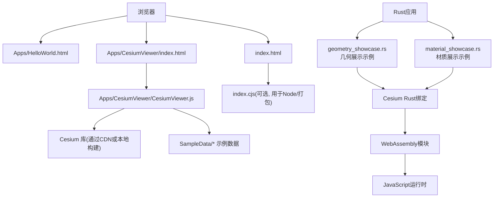
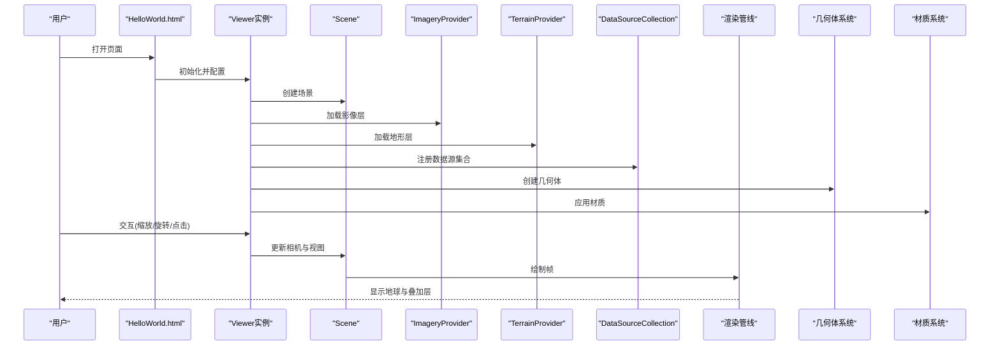
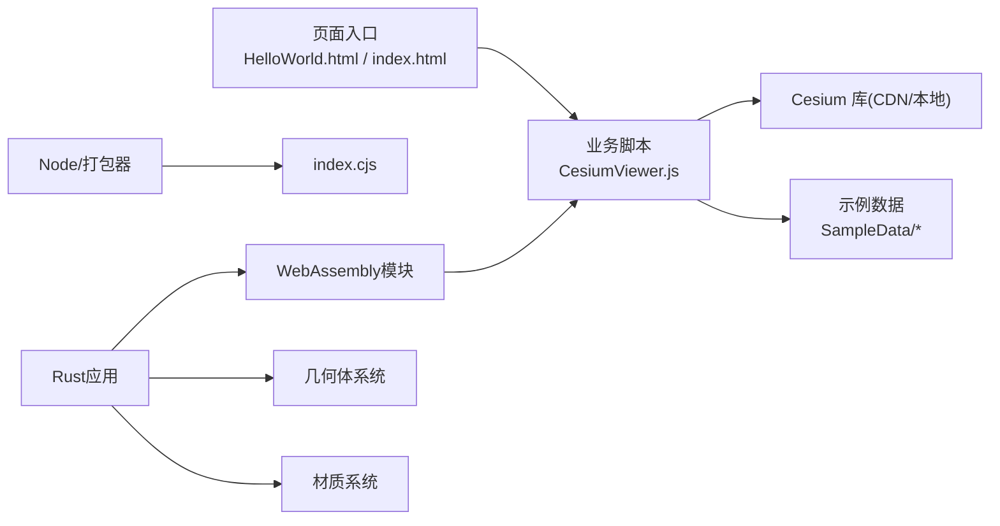

# 基础示例

<cite>
**本文引用的文件**   
- [HelloWorld.html](file://Apps/HelloWorld.html)
- [index.html](file://index.html)
- [CesiumViewer.js](file://Apps/CesiumViewer/CesiumViewer.js)
- [CesiumViewer.css](file://Apps/CesiumViewer/CesiumViewer.css)
- [index.cjs](file://index.cjs)
- [geometry_showcase.rs](file://cesiumrust/application/cesium-app/src/geometry_showcase.rs)
- [material_showcase.rs](file://cesiumrust/application/cesium-app/src/material_showcase.rs)
</cite>

## 更新摘要
**所做更改**   
- 新增几何展示示例章节，介绍Rust实现的3D几何体渲染功能
- 新增材质展示示例章节，展示材质系统的实际应用
- 更新项目结构部分，包含新的Rust应用示例
- 扩展核心组件说明，涵盖几何体和材质系统
- 增加新的架构流程图，展示Rust与JavaScript的集成方式

## 目录
1. [简介](#简介)
2. [项目结构](#项目结构)
3. [核心组件](#核心组件)
4. [架构总览](#架构总览)
5. [详细组件分析](#详细组件分析)
6. [依赖分析](#依赖分析)
7. [性能考虑](#性能考虑)
8. [故障排查指南](#故障排查指南)
9. [结论](#结论)
10. [附录](#附录)

## 简介
本章节面向零基础开发者，提供 Cesium 入门级"基础示例"文档。内容围绕以下目标展开：
- 快速初始化地球（Viewer）
- 相机控制与视角切换
- 添加基础实体（点、线、面、模型等）
- 简单动画（飞行、时间驱动）
- 坐标系统概念（WGS84经纬度、笛卡尔三维坐标）
- 基本数据加载方法（影像、地形、矢量、3D Tiles、glTF 模型）
- 常见配置选项与最佳实践
- **新增**：Rust实现的几何体展示和材质系统应用

所有示例均基于仓库中已有的 HTML 入口与示例资源，可直接复制运行，适合快速上手。

## 项目结构
仓库包含多个可用于学习的基础入口与示例资源：
- Apps/HelloWorld.html：最小化的单页示例入口，便于快速体验
- index.html：仓库根级演示入口，常用于本地开发或构建后预览
- Apps/CesiumViewer/*：一个更完整的 Viewer 示例工程（HTML + JS + CSS），可作为二次开发的起点
- Apps/SampleData/*：丰富的示例数据（KML、GeoJSON、CZML、3DTiles、glTF 模型等）
- cesiumrust/application/cesium-app/src/*：Rust实现的示例应用，包括几何展示和材质展示
- index.cjs：仓库主入口的 CommonJS 导出，用于打包或 Node 环境引用

**图表来源**
- [HelloWorld.html](file://Apps/HelloWorld.html)
- [index.html](file://index.html)
- [CesiumViewer.js](file://Apps/CesiumViewer/CesiumViewer.js)
- [index.cjs](file://index.cjs)
- [geometry_showcase.rs](file://cesiumrust/application/cesium-app/src/geometry_showcase.rs)
- [material_showcase.rs](file://cesiumrust/application/cesium-app/src/material_showcase.rs)

**章节来源**
- [HelloWorld.html](file://Apps/HelloWorld.html)
- [index.html](file://index.html)
- [CesiumViewer.js](file://Apps/CesiumViewer/CesiumViewer.js)
- [index.cjs](file://index.cjs)
- [geometry_showcase.rs](file://cesiumrust/application/cesium-app/src/geometry_showcase.rs)
- [material_showcase.rs](file://cesiumrust/application/cesium-app/src/material_showcase.rs)

## 核心组件
- Viewer 组件
  - 作用：封装了 Scene、Camera、Globe、ImageryProvider、TerrainProvider、DataSourceCollection、Animation、Timeline、InfoBox、SelectionIndicator 等常用功能，是初学者最友好的入口。
  - 关键能力：创建地球、加载影像与地形、管理实体与数据源、提供交互控件（缩放、旋转、倾斜）、时间轴与动画。
- 坐标系统
  - WGS84 经纬度高度：使用弧度制表示经度、纬度，高度单位为米；适用于地理空间数据。
  - 笛卡尔三维坐标（Cartesian3）：世界坐标系下的三维向量，常用于几何计算与变换。
- 数据加载
  - 影像提供者（ImageryProvider）：如默认 OpenStreetMap 或 Cesium Ion 提供的卫星影像。
  - 地形提供者（TerrainProvider）：如 Cesium World Terrain。
  - 矢量数据：GeoJSON、KML、CZML、3D Tiles、glTF 模型等。
- 相机控制
  - 通过 viewer.camera 进行定位、飞行（flyTo）、设置视口范围（setView）。
- 实体与图形
  - 通过 viewer.entities.add() 添加点、线、面、标注、模型等。
- 动画
  - 使用 viewer.clock 的时间驱动或 requestAnimationFrame 实现简单动画。
- **新增**：几何体系统
  - 支持多种3D几何体的创建和渲染，包括球体、立方体、圆柱体等基本形状。
  - 提供几何体的位置、旋转、缩放等变换操作。
- **新增**：材质系统
  - 内置多种材质类型，如纯色、纹理、金属粗糙度等。
  - 支持材质的动态更新和组合效果。

**章节来源**
- [CesiumViewer.js](file://Apps/CesiumViewer/CesiumViewer.js)
- [geometry_showcase.rs](file://cesiumrust/application/cesium-app/src/geometry_showcase.rs)
- [material_showcase.rs](file://cesiumrust/application/cesium-app/src/material_showcase.rs)

## 架构总览
下图展示了从浏览器到 Cesium 渲染的核心流程，以及示例数据在其中的位置。

**图表来源**
- [HelloWorld.html](file://Apps/HelloWorld.html)
- [CesiumViewer.js](file://Apps/CesiumViewer/CesiumViewer.js)
- [geometry_showcase.rs](file://cesiumrust/application/cesium-app/src/geometry_showcase.rs)
- [material_showcase.rs](file://cesiumrust/application/cesium-app/src/material_showcase.rs)

## 详细组件分析

### 示例一：最小化地球初始化（HelloWorld）
- 目标
  - 在浏览器中快速展示地球，理解 Viewer 的基本初始化流程。
- 要点
  - 引入 Cesium 资源（CDN 或本地构建产物）
  - 创建 Viewer 实例，选择默认控件与图层
  - 可选：设置初始视角（flyTo/setView）
- 运行效果说明
  - 页面加载后出现可交互的地球，支持鼠标拖拽旋转、滚轮缩放、右键倾斜。
- 参考路径
  - [HelloWorld.html](file://Apps/HelloWorld.html)

**章节来源**
- [HelloWorld.html](file://Apps/HelloWorld.html)

### 示例二：完整 Viewer 示例工程（CesiumViewer）
- 目标
  - 以 Apps/CesiumViewer 为模板，了解更完整的配置项与组织方式。
- 要点
  - 通过独立 JS 文件集中配置 Viewer、图层、控件、事件处理等
  - 使用 CSS 调整容器样式与全屏行为
  - 结合 SampleData 中的示例数据进行加载演示
- 运行效果说明
  - 启动后呈现带 UI 控件的地球，可在控制台查看日志，逐步扩展功能。
- 参考路径
  - [CesiumViewer.js](file://Apps/CesiumViewer/CesiumViewer.js)
  - [CesiumViewer.css](file://Apps/CesiumViewer/CesiumViewer.css)

**章节来源**
- [CesiumViewer.js](file://Apps/CesiumViewer/CesiumViewer.js)
- [CesiumViewer.css](file://Apps/CesiumViewer/CesiumViewer.css)

### 示例三：相机控制与视角切换
- 目标
  - 掌握 viewer.camera 的常用方法：定位、飞行、设置视口范围。
- 要点
  - setView：直接设置相机位置与朝向
  - flyTo：平滑过渡到目标位置
  - 常用参数：目标位置（经纬度+高度）、偏移量、方向、俯仰角、滚动角
- 运行效果说明
  - 页面加载后自动飞向指定城市或区域，用户可继续手动操控。
- 参考路径
  - [CesiumViewer.js](file://Apps/CesiumViewer/CesiumViewer.js)

**章节来源**
- [CesiumViewer.js](file://Apps/CesiumViewer/CesiumViewer.js)

### 示例四：添加基础实体（点、线、面、标注）
- 目标
  - 学会使用 viewer.entities.add() 添加常见图形与标注。
- 要点
  - 点：设置位置、颜色、大小、标签
  - 线：设置位置序列、宽度、颜色、材质
  - 面：设置轮廓、填充、高度模式（贴地/绝对高度）
  - 标注：文本、字体、背景色、对齐方式
- 运行效果说明
  - 地图上出现点、线、面与文字标注，支持点击高亮与信息框展示。
- 参考路径
  - [CesiumViewer.js](file://Apps/CesiumViewer/CesiumViewer.js)

**章节来源**
- [CesiumViewer.js](file://Apps/CesiumViewer/CesiumViewer.js)

### 示例五：加载外部数据（GeoJSON/KML/CZML/3D Tiles/glTF）
- 目标
  - 掌握多种数据格式的加载方法与注意事项。
- 要点
  - GeoJSON：通过 GeoJsonDataSource 加载
  - KML：通过 KmlDataSource 加载
  - CZML：通过 CzmlDataSource 加载（含时间动态轨迹）
  - 3D Tiles：通过 Cesium3DTileset 加载大规模三维场景
  - glTF 模型：通过 Model 或 Entity.model 加载
- 运行效果说明
  - 根据数据源不同，地图上将叠加矢量要素、时间轨迹、三维建筑或模型。
- 参考路径
  - [CesiumViewer.js](file://Apps/CesiumViewer/CesiumViewer.js)
  - [SampleData](file://Apps/SampleData)

**章节来源**
- [CesiumViewer.js](file://Apps/CesiumViewer/CesiumViewer.js)
- [SampleData](file://Apps/SampleData)

### 示例六：简单动画（飞行与时间驱动）
- 目标
  - 使用相机飞行与时间轴实现简单动画。
- 要点
  - 相机飞行：viewer.camera.flyTo(...)
  - 时间驱动：viewer.clock 控制时间流速，配合数据源的时间属性
  - 循环动画：requestAnimationFrame 或 viewer.clock.onTick 事件
- 运行效果说明
  - 相机按预设路径飞行，或随时间推进播放轨迹动画。
- 参考路径
  - [CesiumViewer.js](file://Apps/CesiumViewer/CesiumViewer.js)

**章节来源**
- [CesiumViewer.js](file://Apps/CesiumViewer/CesiumViewer.js)

### 示例七：坐标系统概念与实践
- 目标
  - 理解 WGS84 经纬度与笛卡尔三维坐标的区别与转换。
- 要点
  - WGS84：经度、纬度（弧度）、高度（米）
  - Cartesian3：世界坐标向量，适合几何运算
  - 转换工具：Cesium 提供的坐标转换函数
- 运行效果说明
  - 同一地理位置在不同坐标系下数值不同，正确转换可避免错位问题。
- 参考路径
  - [CesiumViewer.js](file://Apps/CesiumViewer/CesiumViewer.js)

**章节来源**
- [CesiumViewer.js](file://Apps/CesiumViewer/CesiumViewer.js)

### 示例八：根级入口与打包集成（index.html / index.cjs）
- 目标
  - 了解仓库根级入口与打包导出的关系，便于集成到自有工程。
- 要点
  - index.html：作为演示入口，通常由构建脚本生成或指向构建产物
  - index.cjs：CommonJS 导出，供 Node 或打包器引用
- 运行效果说明
  - 本地启动服务器后访问 index.html 即可看到示例页面。
- 参考路径
  - [index.html](file://index.html)
  - [index.cjs](file://index.cjs)

**章节来源**
- [index.html](file://index.html)
- [index.cjs](file://index.cjs)

### 示例九：几何体展示（Rust实现）
- 目标
  - 通过Rust语言实现3D几何体的创建和渲染，展示Cesium的几何体系统。
- 要点
  - 使用Rust API创建各种几何体：球体、立方体、圆柱体、圆锥体等
  - 设置几何体的位置、旋转、缩放等变换属性
  - 应用不同的材质和视觉效果
  - 实现几何体的动态更新和动画效果
- 运行效果说明
  - 页面加载后显示多种3D几何体，支持交互式操作和实时渲染。
- 技术特点
  - 高性能的Rust后端处理
  - WebAssembly编译优化
  - 与JavaScript前端的良好集成
- 参考路径
  - [geometry_showcase.rs](file://cesiumrust/application/cesium-app/src/geometry_showcase.rs)

**章节来源**
- [geometry_showcase.rs](file://cesiumrust/application/cesium-app/src/geometry_showcase.rs)

### 示例十：材质展示（Rust实现）
- 目标
  - 展示Cesium材质系统的强大功能，通过Rust实现复杂的材质效果。
- 要点
  - 内置材质类型：纯色、纹理贴图、金属粗糙度、法线贴图
  - 自定义材质属性和参数调节
  - 材质的动态更新和混合效果
  - 性能优化的材质渲染策略
- 运行效果说明
  - 展示多种材质效果的对比，用户可以实时调整材质参数观察变化。
- 技术特点
  - 高效的材质管理系统
  - 支持PBR（物理渲染）材质
  - 实时材质参数调节
- 参考路径
  - [material_showcase.rs](file://cesiumrust/application/cesium-app/src/material_showcase.rs)

**章节来源**
- [material_showcase.rs](file://cesiumrust/application/cesium-app/src/material_showcase.rs)

## 依赖分析
- 浏览器端
  - HTML 页面负责引入 Cesium 资源（CDN 或本地构建产物）
  - 业务逻辑集中在 CesiumViewer.js 中，负责 Viewer 初始化、数据加载与交互
- 数据资源
  - SampleData 目录提供大量示例数据，便于快速验证功能
- 打包与导出
  - index.cjs 提供 CommonJS 导出，便于在 Node 或打包环境中引用
- **新增**：Rust集成
  - Rust代码通过WebAssembly编译为JavaScript可执行的模块
  - 提供高性能的几何体和材质处理能力
  - 与现有JavaScript API无缝集成

**图表来源**
- [HelloWorld.html](file://Apps/HelloWorld.html)
- [index.html](file://index.html)
- [CesiumViewer.js](file://Apps/CesiumViewer/CesiumViewer.js)
- [index.cjs](file://index.cjs)
- [geometry_showcase.rs](file://cesiumrust/application/cesium-app/src/geometry_showcase.rs)
- [material_showcase.rs](file://cesiumrust/application/cesium-app/src/material_showcase.rs)

**章节来源**
- [HelloWorld.html](file://Apps/HelloWorld.html)
- [index.html](file://index.html)
- [CesiumViewer.js](file://Apps/CesiumViewer/CesiumViewer.js)
- [index.cjs](file://index.cjs)
- [geometry_showcase.rs](file://cesiumrust/application/cesium-app/src/geometry_showcase.rs)
- [material_showcase.rs](file://cesiumrust/application/cesium-app/src/material_showcase.rs)

## 性能考虑
- 合理设置初始视角与最大/最小缩放级别，避免不必要的重绘
- 按需加载数据源，优先使用流式或分块数据（如 3D Tiles）
- 控制实体数量与复杂度，批量添加时合并操作
- 启用必要的缓存策略（影像、纹理、模型）
- 移动端注意降低阴影、抗锯齿等级与分辨率
- **新增**：Rust性能优化
  - 利用Rust的内存安全和零成本抽象特性
  - WebAssembly编译优化提升渲染性能
  - 异步处理避免阻塞主线程

## 故障排查指南
- 无法加载 Cesium 资源
  - 检查 CDN 地址是否可达，或确认本地构建产物路径是否正确
- 跨域问题（CORS）
  - 确保静态资源与数据服务允许跨域访问
- 影像或地形不显示
  - 检查网络连通性与密钥配置（如使用 Cesium Ion）
- 模型或矢量数据错位
  - 核对坐标系统（WGS84 vs Cartesian3）与高度模式（贴地/绝对高度）
- 动画卡顿
  - 减少同时运行的动画与复杂材质，优化数据规模
- **新增**：Rust相关故障
  - WebAssembly模块加载失败：检查编译输出和模块路径
  - Rust与JavaScript通信问题：确认API接口和数据格式兼容性
  - 内存泄漏：使用Rust调试工具检查内存使用情况

## 结论
通过上述十个基础示例，读者可以快速掌握 Cesium 的核心概念与基本用法：从 Viewer 初始化、相机控制、实体添加，到多格式数据加载与简单动画。**新增的Rust示例**进一步展示了现代WebGIS开发的技术栈，通过高性能的Rust后端和WebAssembly技术，为Cesium应用提供了更强的数据处理能力和更好的用户体验。建议以 HelloWorld.html 为起点，逐步迁移到 CesiumViewer 工程结构，并结合 SampleData 进行扩展练习。

## 附录
- 推荐学习顺序
  - 先跑通 HelloWorld.html，再进入 CesiumViewer 工程
  - 依次尝试相机控制、实体添加、数据加载、动画
  - 最后结合坐标系统与性能调优完善应用
  - **新增**：探索Rust示例，了解现代WebGIS开发技术栈
- 常见问题速查
  - 坐标单位：经纬度用弧度，高度用米
  - 贴地与绝对高度：根据需求选择合适的高度模式
  - 数据格式：优先使用标准格式（GeoJSON、KML、CZML、3D Tiles、glTF）
  - **新增**：Rust开发：确保WebAssembly编译环境和依赖正确配置