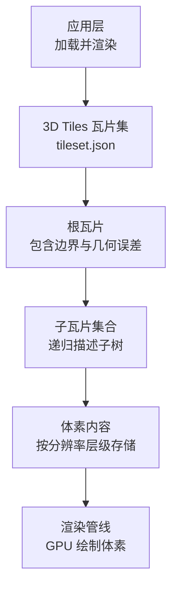
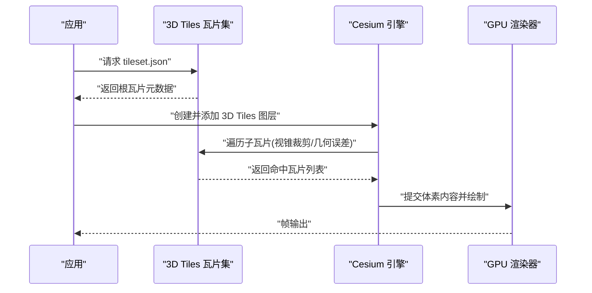
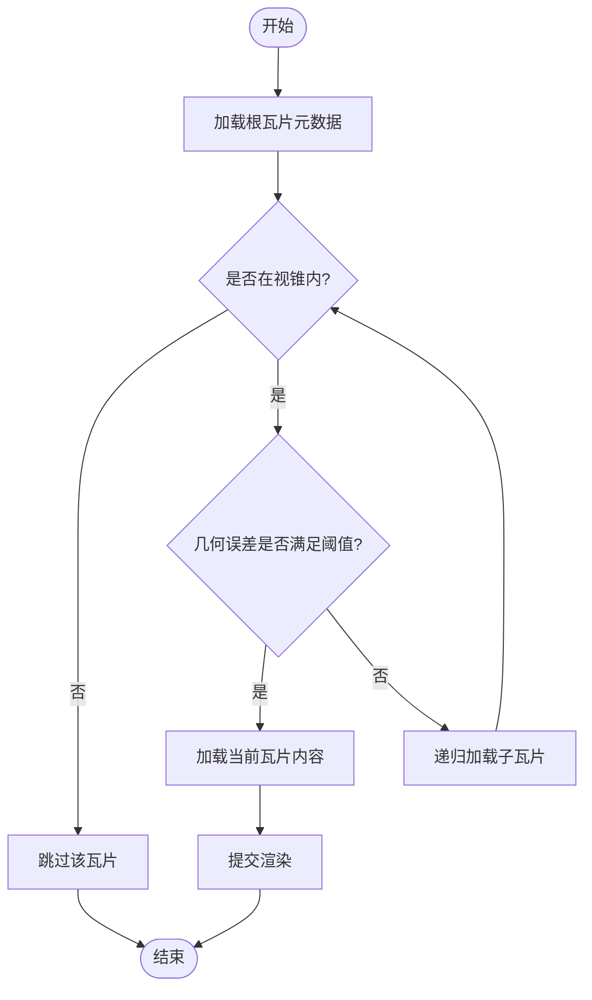
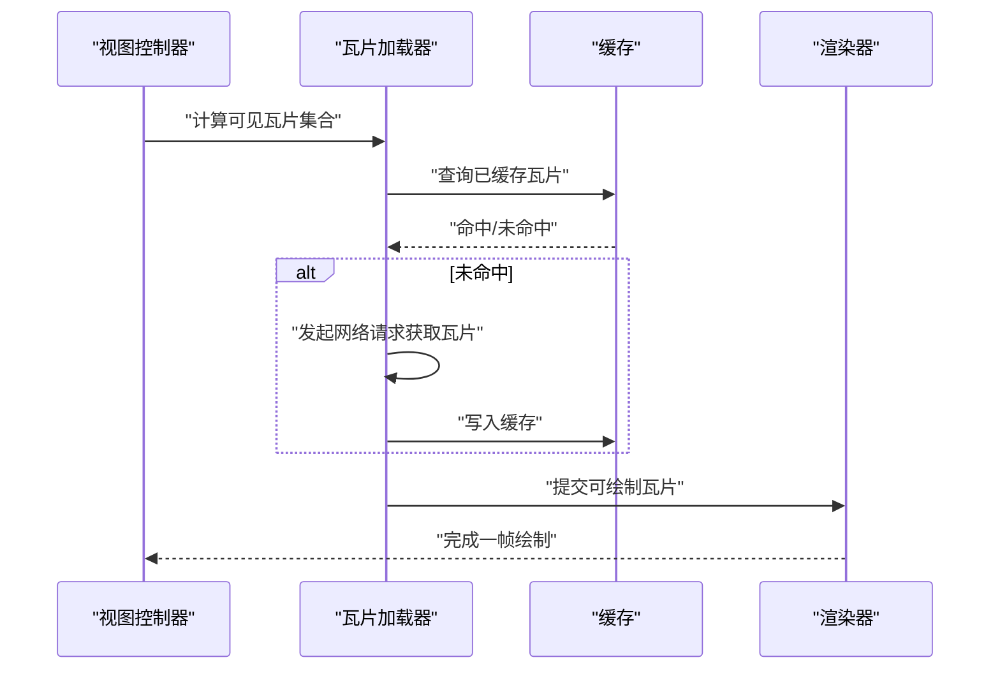
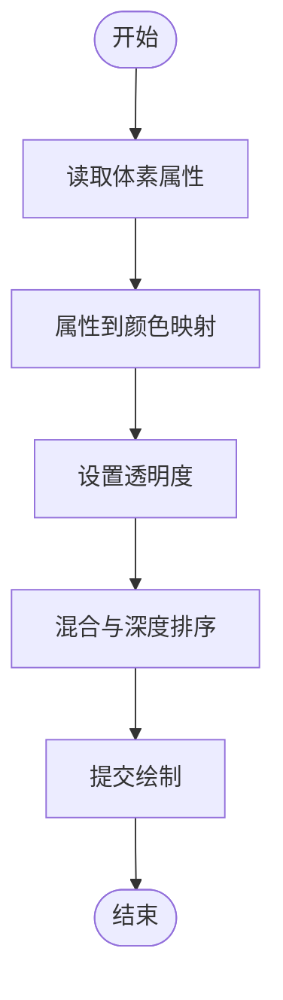
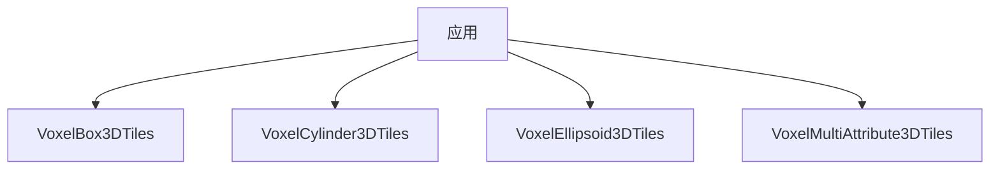

# 体素数据渲染

<cite>
**本文引用的文件**   
- [VoxelBox3DTiles](file://Apps/SampleData/Cesium3DTiles/Voxel/VoxelBox3DTiles/tileset.json)
- [VoxelCylinder3DTiles](file://Apps/SampleData/Cesium3DTiles/Voxel/VoxelCylinder3DTiles/tileset.json)
- [VoxelEllipsoid3DTiles](file://Apps/SampleData/Cesium3DTiles/Voxel/VoxelEllipsoid3DTiles/tileset.json)
- [VoxelMultiAttribute3DTiles](file://Specs/Data/Cesium3DTiles/Voxel/VoxelMultiAttribute3DTiles/tileset.json)
- [voxel-cameras.spec.js](file://Specs/e2e/voxel-cameras.spec.js)
</cite>

## 目录
1. [简介](#简介)
2. [项目结构](#项目结构)
3. [核心组件](#核心组件)
4. [架构总览](#架构总览)
5. [详细组件分析](#详细组件分析)
6. [依赖关系分析](#依赖关系分析)
7. [性能考虑](#性能考虑)
8. [故障排查指南](#故障排查指南)
9. [结论](#结论)
10. [附录](#附录)

## 简介
本示例聚焦于在 CesiumJS 中加载与渲染 3D Tiles 体素数据，覆盖多种几何形状（立方体、圆柱体、椭球体）的体素瓦片集。文档将说明：
- 体素数据的组织结构与子树管理
- 瓦片加载机制与可见性判定
- 样式设置与透明度控制要点
- 性能调优建议
- 典型应用场景（地质建模、医学影像可视化等）

## 项目结构
仓库中包含多组体素 3D Tiles 示例数据，分别对应不同几何形状与属性组织方式。关键路径如下：
- Apps/SampleData/Cesium3DTiles/Voxel/VoxelBox3DTiles
- Apps/SampleData/Cesium3DTiles/Voxel/VoxelCylinder3DTiles
- Apps/SampleData/Cesium3DTiles/Voxel/VoxelEllipsoid3DTiles
- Specs/Data/Cesium3DTiles/Voxel/VoxelMultiAttribute3DTiles

这些目录下的 tileset.json 描述了体素瓦片的层次结构与内容定位，是加载与渲染的核心入口。

图表来源
- [VoxelBox3DTiles](file://Apps/SampleData/Cesium3DTiles/Voxel/VoxelBox3DTiles/tileset.json)
- [VoxelCylinder3DTiles](file://Apps/SampleData/Cesium3DTiles/Voxel/VoxelCylinder3DTiles/tileset.json)
- [VoxelEllipsoid3DTiles](file://Apps/SampleData/Cesium3DTiles/Voxel/VoxelEllipsoid3DTiles/tileset.json)
- [VoxelMultiAttribute3DTiles](file://Specs/Data/Cesium3DTiles/Voxel/VoxelMultiAttribute3DTiles/tileset.json)

章节来源
- [VoxelBox3DTiles](file://Apps/SampleData/Cesium3DTiles/Voxel/VoxelBox3DTiles/tileset.json)
- [VoxelCylinder3DTiles](file://Apps/SampleData/Cesium3DTiles/Voxel/VoxelCylinder3DTiles/tileset.json)
- [VoxelEllipsoid3DTiles](file://Apps/SampleData/Cesium3DTiles/Voxel/VoxelEllipsoid3DTiles/tileset.json)
- [VoxelMultiAttribute3DTiles](file://Specs/Data/Cesium3DTiles/Voxel/VoxelMultiAttribute3DTiles/tileset.json)

## 核心组件
- 体素瓦片集定义：每个 tileset.json 描述一个体素数据集的根节点、子瓦片、边界体积、几何误差与内容引用。
- 几何类型：
  - VoxelBox3DTiles：基于立方体网格的体素数据
  - VoxelCylinder3DTiles：基于圆柱体的体素数据
  - VoxelEllipsoid3DTiles：基于椭球体的体素数据
- 多属性体素：VoxelMultiAttribute3DTiles 展示多通道或多属性的体素组织方式

章节来源
- [VoxelBox3DTiles](file://Apps/SampleData/Cesium3DTiles/Voxel/VoxelBox3DTiles/tileset.json)
- [VoxelCylinder3DTiles](file://Apps/SampleData/Cesium3DTiles/Voxel/VoxelCylinder3DTiles/tileset.json)
- [VoxelEllipsoid3DTiles](file://Apps/SampleData/Cesium3DTiles/Voxel/VoxelEllipsoid3DTiles/tileset.json)
- [VoxelMultiAttribute3DTiles](file://Specs/Data/Cesium3DTiles/Voxel/VoxelMultiAttribute3DTiles/tileset.json)

## 架构总览
下图展示了从应用到渲染的关键流程：应用通过 3D Tiles 接口加载 tileset.json，引擎解析瓦片层次，依据视锥裁剪与几何误差进行按需加载，最终由 GPU 渲染体素。

图表来源
- [VoxelBox3DTiles](file://Apps/SampleData/Cesium3DTiles/Voxel/VoxelBox3DTiles/tileset.json)
- [VoxelCylinder3DTiles](file://Apps/SampleData/Cesium3DTiles/Voxel/VoxelCylinder3DTiles/tileset.json)
- [VoxelEllipsoid3DTiles](file://Apps/SampleData/Cesium3DTiles/Voxel/VoxelEllipsoid3DTiles/tileset.json)
- [VoxelMultiAttribute3DTiles](file://Specs/Data/Cesium3DTiles/Voxel/VoxelMultiAttribute3DTiles/tileset.json)

## 详细组件分析

### 体素瓦片集数据结构与子树管理
- 根瓦片：包含边界体积（如包围盒或区域）、几何误差、子瓦片数组与内容引用。
- 子瓦片：递归描述更细粒度的体素块，通常随分辨率提升而细化。
- 子树管理：引擎根据相机位置、距离与几何误差阈值决定是否加载某子树，避免一次性加载全部数据。

图表来源
- [VoxelBox3DTiles](file://Apps/SampleData/Cesium3DTiles/Voxel/VoxelBox3DTiles/tileset.json)
- [VoxelCylinder3DTiles](file://Apps/SampleData/Cesium3DTiles/Voxel/VoxelCylinder3DTiles/tileset.json)
- [VoxelEllipsoid3DTiles](file://Apps/SampleData/Cesium3DTiles/Voxel/VoxelEllipsoid3DTiles/tileset.json)
- [VoxelMultiAttribute3DTiles](file://Specs/Data/Cesium3DTiles/Voxel/VoxelMultiAttribute3DTiles/tileset.json)

章节来源
- [VoxelBox3DTiles](file://Apps/SampleData/Cesium3DTiles/Voxel/VoxelBox3DTiles/tileset.json)
- [VoxelCylinder3DTiles](file://Apps/SampleData/Cesium3DTiles/Voxel/VoxelCylinder3DTiles/tileset.json)
- [VoxelEllipsoid3DTiles](file://Apps/SampleData/Cesium3DTiles/Voxel/VoxelEllipsoid3DTiles/tileset.json)
- [VoxelMultiAttribute3DTiles](file://Specs/Data/Cesium3DTiles/Voxel/VoxelMultiAttribute3DTiles/tileset.json)

### 瓦片加载机制与可见性判定
- 视锥裁剪：仅对屏幕投影范围内的瓦片进行进一步处理。
- 几何误差：比较瓦片几何误差与相机距离，决定是否需要更细粒度子瓦片。
- 内存与带宽：按需加载与释放策略减少峰值内存占用与网络压力。

图表来源
- [VoxelBox3DTiles](file://Apps/SampleData/Cesium3DTiles/Voxel/VoxelBox3DTiles/tileset.json)
- [VoxelCylinder3DTiles](file://Apps/SampleData/Cesium3DTiles/Voxel/VoxelCylinder3DTiles/tileset.json)
- [VoxelEllipsoid3DTiles](file://Apps/SampleData/Cesium3DTiles/Voxel/VoxelEllipsoid3DTiles/tileset.json)
- [VoxelMultiAttribute3DTiles](file://Specs/Data/Cesium3DTiles/Voxel/VoxelMultiAttribute3DTiles/tileset.json)

章节来源
- [VoxelBox3DTiles](file://Apps/SampleData/Cesium3DTiles/Voxel/VoxelBox3DTiles/tileset.json)
- [VoxelCylinder3DTiles](file://Apps/SampleData/Cesium3DTiles/Voxel/VoxelCylinder3DTiles/tileset.json)
- [VoxelEllipsoid3DTiles](file://Apps/SampleData/Cesium3DTiles/Voxel/VoxelEllipsoid3DTiles/tileset.json)
- [VoxelMultiAttribute3DTiles](file://Specs/Data/Cesium3DTiles/Voxel/VoxelMultiAttribute3DTiles/tileset.json)

### 样式设置与透明度控制
- 颜色映射：根据体素属性值映射为颜色，用于区分不同材质或密度。
- 透明度：通过整体或逐瓦片透明度控制实现半透明效果，注意混合顺序与深度排序。
- 性能权衡：高透明度可能导致更多混合开销，需结合 LOD 与采样率调整。

图表来源
- [VoxelBox3DTiles](file://Apps/SampleData/Cesium3DTiles/Voxel/VoxelBox3DTiles/tileset.json)
- [VoxelCylinder3DTiles](file://Apps/SampleData/Cesium3DTiles/Voxel/VoxelCylinder3DTiles/tileset.json)
- [VoxelEllipsoid3DTiles](file://Apps/SampleData/Cesium3DTiles/Voxel/VoxelEllipsoid3DTiles/tileset.json)
- [VoxelMultiAttribute3DTiles](file://Specs/Data/Cesium3DTiles/Voxel/VoxelMultiAttribute3DTiles/tileset.json)

章节来源
- [VoxelBox3DTiles](file://Apps/SampleData/Cesium3DTiles/Voxel/VoxelBox3DTiles/tileset.json)
- [VoxelCylinder3DTiles](file://Apps/SampleData/Cesium3DTiles/Voxel/VoxelCylinder3DTiles/tileset.json)
- [VoxelEllipsoid3DTiles](file://Apps/SampleData/Cesium3DTiles/Voxel/VoxelEllipsoid3DTiles/tileset.json)
- [VoxelMultiAttribute3DTiles](file://Specs/Data/Cesium3DTiles/Voxel/VoxelMultiAttribute3DTiles/tileset.json)

### 性能调优
- 合理设置几何误差阈值：平衡细节与加载量。
- 控制最大并发请求数：避免网络拥塞。
- 使用合适的体素分辨率：根据场景尺度选择合适层级。
- 优化透明度与混合：减少不必要的混合批次。

章节来源
- [VoxelBox3DTiles](file://Apps/SampleData/Cesium3DTiles/Voxel/VoxelBox3DTiles/tileset.json)
- [VoxelCylinder3DTiles](file://Apps/SampleData/Cesium3DTiles/Voxel/VoxelCylinder3DTiles/tileset.json)
- [VoxelEllipsoid3DTiles](file://Apps/SampleData/Cesium3DTiles/Voxel/VoxelEllipsoid3DTiles/tileset.json)
- [VoxelMultiAttribute3DTiles](file://Specs/Data/Cesium3DTiles/Voxel/VoxelMultiAttribute3DTiles/tileset.json)

### 应用场景
- 地质建模：利用体素表示地层、岩性与物性参数，支持剖面与切片分析。
- 医学影像可视化：CT/MRI 数据以体素形式呈现，便于三维诊断与手术规划。
- 工程与建筑：地下管线、空洞与缺陷检测的三维表达。

[本节为概念性内容，不直接分析具体文件]

## 依赖关系分析
以下图展示了各体素瓦片集之间的并列关系以及它们作为独立数据集被应用加载的方式。

图表来源
- [VoxelBox3DTiles](file://Apps/SampleData/Cesium3DTiles/Voxel/VoxelBox3DTiles/tileset.json)
- [VoxelCylinder3DTiles](file://Apps/SampleData/Cesium3DTiles/Voxel/VoxelCylinder3DTiles/tileset.json)
- [VoxelEllipsoid3DTiles](file://Apps/SampleData/Cesium3DTiles/Voxel/VoxelEllipsoid3DTiles/tileset.json)
- [VoxelMultiAttribute3DTiles](file://Specs/Data/Cesium3DTiles/Voxel/VoxelMultiAttribute3DTiles/tileset.json)

章节来源
- [VoxelBox3DTiles](file://Apps/SampleData/Cesium3DTiles/Voxel/VoxelBox3DTiles/tileset.json)
- [VoxelCylinder3DTiles](file://Apps/SampleData/Cesium3DTiles/Voxel/VoxelCylinder3DTiles/tileset.json)
- [VoxelEllipsoid3DTiles](file://Apps/SampleData/Cesium3DTiles/Voxel/VoxelEllipsoid3DTiles/tileset.json)
- [VoxelMultiAttribute3DTiles](file://Specs/Data/Cesium3DTiles/Voxel/VoxelMultiAttribute3DTiles/tileset.json)

## 性能考虑
- 瓦片粒度与几何误差：过细的粒度会增加加载与绘制成本，应根据目标设备能力与场景需求调整。
- 透明度与混合：大量半透明体素会显著增加混合开销，建议分层渲染或使用遮挡剔除。
- 缓存策略：合理利用瓦片缓存，避免重复下载；必要时限制缓存大小。
- 网络与并发：控制并发请求数量，避免阻塞主线程与 GPU 资源。

[本节提供通用指导，不直接分析具体文件]

## 故障排查指南
- 瓦片未加载：检查 tileset.json 路径与网络可达性，确认视锥与几何误差阈值是否过于严格。
- 渲染异常：验证体素内容与着色器兼容性，检查透明度与混合设置。
- 性能问题：监控瓦片加载数量与 GPU 使用率，适当降低分辨率或提高几何误差阈值。
- 参考用例：可参考端到端测试脚本中的相机与交互逻辑，辅助定位问题。

章节来源
- [voxel-cameras.spec.js](file://Specs/e2e/voxel-cameras.spec.js)

## 结论
通过合理的瓦片组织与加载策略，CesiumJS 能够高效地渲染多种形状的体素数据。结合样式与透明度控制，可在地质建模与医学影像可视化等场景中实现高质量的三维表现。实际部署时，应重点关注几何误差、透明度混合与缓存策略，以获得稳定且流畅的用户体验。

[本节为总结性内容，不直接分析具体文件]

## 附录
- 示例数据清单：
  - VoxelBox3DTiles：立方体体素瓦片集
  - VoxelCylinder3DTiles：圆柱体体素瓦片集
  - VoxelEllipsoid3DTiles：椭球体体素瓦片集
  - VoxelMultiAttribute3DTiles：多属性体素瓦片集

章节来源
- [VoxelBox3DTiles](file://Apps/SampleData/Cesium3DTiles/Voxel/VoxelBox3DTiles/tileset.json)
- [VoxelCylinder3DTiles](file://Apps/SampleData/Cesium3DTiles/Voxel/VoxelCylinder3DTiles/tileset.json)
- [VoxelEllipsoid3DTiles](file://Apps/SampleData/Cesium3DTiles/Voxel/VoxelEllipsoid3DTiles/tileset.json)
- [VoxelMultiAttribute3DTiles](file://Specs/Data/Cesium3DTiles/Voxel/VoxelMultiAttribute3DTiles/tileset.json)