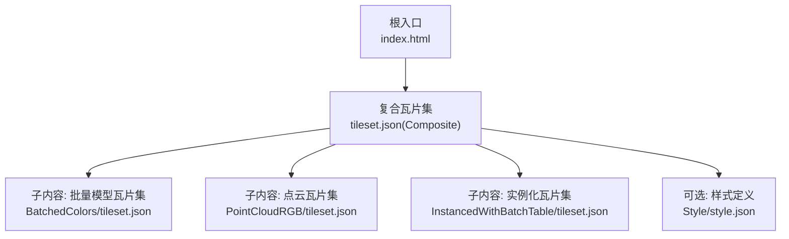
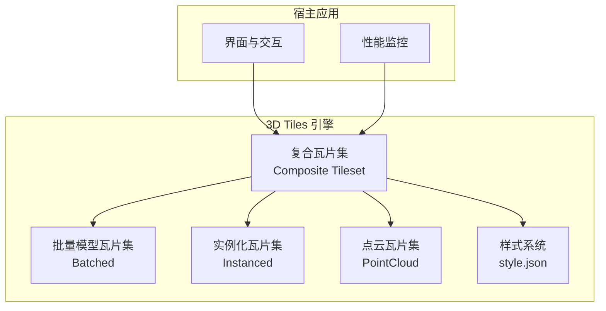
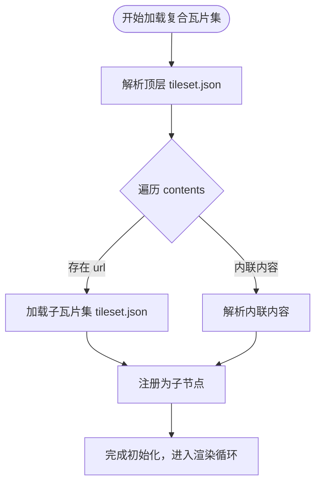
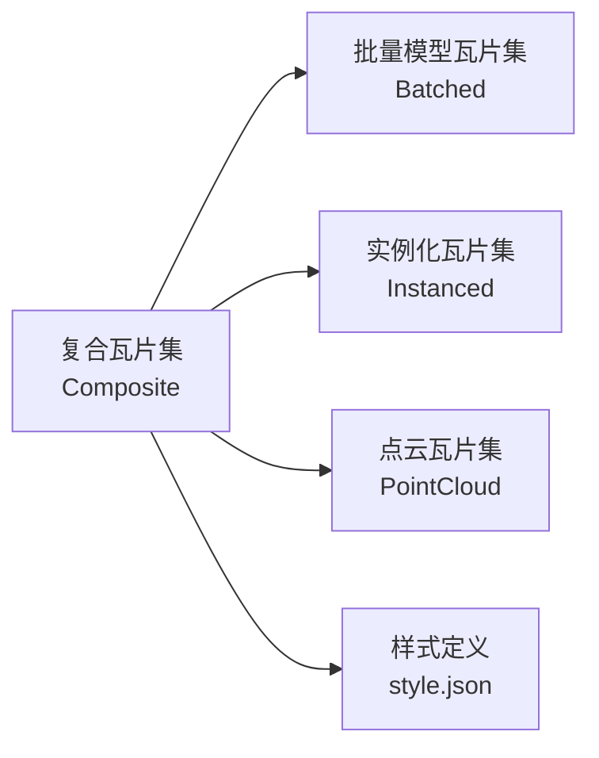

# 复合瓦片集

<cite>
**本文引用的文件**   
- [Apps/SampleData/Cesium3DTiles/Composite/Composite/tileset.json](file://Apps/SampleData/Cesium3DTiles/Composite/Composite/tileset.json)
- [Specs/Data/Cesium3DTiles/Composite/Composite/tileset.json](file://Specs/Data/Cesium3DTiles/Composite/Composite/tileset.json)
- [Specs/Data/Cesium3DTiles/Composite/CompositeOfComposite/tileset.json](file://Specs/Data/Cesium3DTiles/Composite/CompositeOfComposite/tileset.json)
- [Specs/Data/Cesium3DTiles/Composite/CompositeOfInstanced/tileset.json](file://Specs/Data/Cesium3DTiles/Composite/CompositeOfInstanced/tileset.json)
- [Apps/SampleData/Cesium3DTiles/Batched/BatchedColors/tileset.json](file://Apps/SampleData/Cesium3DTiles/Batched/BatchedColors/tileset.json)
- [Apps/SampleData/Cesium3DTiles/PointCloud/PointCloudRGB/tileset.json](file://Apps/SampleData/Cesium3DTiles/PointCloud/PointCloudRGB/tileset.json)
- [Apps/SampleData/Cesium3DTiles/Instanced/InstancedWithBatchTable/tileset.json](file://Apps/SampleData/Cesium3DTiles/Instanced/InstancedWithBatchTable/tileset.json)
- [Apps/SampleData/Cesium3DTiles/Style/style.json](file://Apps/SampleData/Cesium3DTiles/Style/style.json)
- [index.html](file://index.html)
</cite>

## 目录
1. [简介](#简介)
2. [项目结构](#项目结构)
3. [核心组件](#核心组件)
4. [架构总览](#架构总览)
5. [详细组件分析](#详细组件分析)
6. [依赖关系分析](#依赖关系分析)
7. [性能考虑](#性能考虑)
8. [故障排查指南](#故障排查指南)
9. [结论](#结论)
10. [附录](#附录)

## 简介
本文件面向希望构建“复合3D Tiles瓦片集”的开发者，提供从数据组织、配置方法到样式与事件处理、性能监控的完整示例与实践建议。重点演示如何在一个顶层复合瓦片集中组合多种类型的3D Tiles内容：批量模型（Batched）、实例化模型（Instanced）、点云（PointCloud）等，并说明多个内容的定义、引用关系与加载顺序。同时给出复杂场景的组织结构与最佳实践，帮助构建大型3D应用。

## 项目结构
仓库中提供了复合瓦片集的样例数据与测试数据，便于快速理解与验证。关键路径如下：
- 样例复合瓦片集：Apps/SampleData/Cesium3DTiles/Composite/Composite/tileset.json
- 测试用例中的复合瓦片集：Specs/Data/Cesium3DTiles/Composite/...
- 被复合引用的子瓦片集类型：批量模型、实例化模型、点云等

图表来源
- [index.html](file://index.html)
- [Apps/SampleData/Cesium3DTiles/Composite/Composite/tileset.json](file://Apps/SampleData/Cesium3DTiles/Composite/Composite/tileset.json)
- [Apps/SampleData/Cesium3DTiles/Batched/BatchedColors/tileset.json](file://Apps/SampleData/Cesium3DTiles/Batched/BatchedColors/tileset.json)
- [Apps/SampleData/Cesium3DTiles/PointCloud/PointCloudRGB/tileset.json](file://Apps/SampleData/Cesium3DTiles/PointCloud/PointCloudRGB/tileset.json)
- [Apps/SampleData/Cesium3DTiles/Instanced/InstancedWithBatchTable/tileset.json](file://Apps/SampleData/Cesium3DTiles/Instanced/InstancedWithBatchTable/tileset.json)
- [Apps/SampleData/Cesium3DTiles/Style/style.json](file://Apps/SampleData/Cesium3DTiles/Style/style.json)

章节来源
- [index.html](file://index.html)
- [Apps/SampleData/Cesium3DTiles/Composite/Composite/tileset.json](file://Apps/SampleData/Cesium3DTiles/Composite/Composite/tileset.json)

## 核心组件
- 复合瓦片集（Composite Tileset）
  - 作为顶层容器，聚合多个子瓦片集或子内容，形成统一的可渲染场景图。
  - 通过 contents 字段声明多个子项，每个子项可指向一个外部 tileset.json 或内联内容。
- 子瓦片集类型
  - 批量模型（Batched）：适合大量相似几何体合并渲染，具备批表属性能力。
  - 实例化模型（Instanced）：适合重复对象的实例化渲染，支持变换与批表。
  - 点云（PointCloud）：适合大规模点数据，支持颜色、法线、时间动态等扩展。
- 样式系统
  - 使用 style.json 对复合瓦片集及其子内容进行样式控制，包括可见性、着色、过滤等。
- 事件与交互
  - 在宿主页面中对3D Tiles图层注册点击、选择等事件，结合批表属性进行业务逻辑处理。
- 性能监控
  - 利用Cesium内置统计接口观察帧率、内存、绘制调用等指标，指导LOD与资源优化。

章节来源
- [Apps/SampleData/Cesium3DTiles/Composite/Composite/tileset.json](file://Apps/SampleData/Cesium3DTiles/Composite/Composite/tileset.json)
- [Apps/SampleData/Cesium3DTiles/Batched/BatchedColors/tileset.json](file://Apps/SampleData/Cesium3DTiles/Batched/BatchedColors/tileset.json)
- [Apps/SampleData/Cesium3DTiles/PointCloud/PointCloudRGB/tileset.json](file://Apps/SampleData/Cesium3DTiles/PointCloud/PointCloudRGB/tileset.json)
- [Apps/SampleData/Cesium3DTiles/Instanced/InstancedWithBatchTable/tileset.json](file://Apps/SampleData/Cesium3DTiles/Instanced/InstancedWithBatchTable/tileset.json)
- [Apps/SampleData/Cesium3DTiles/Style/style.json](file://Apps/SampleData/Cesium3DTiles/Style/style.json)

## 架构总览
复合瓦片集采用“树形分层 + 多源聚合”的架构：顶层复合瓦片集负责编排与调度，子瓦片集各自管理自身的LOD、裁剪与渲染。样式与事件在宿主层统一管理，确保跨类型内容的一致体验。

图表来源
- [index.html](file://index.html)
- [Apps/SampleData/Cesium3DTiles/Composite/Composite/tileset.json](file://Apps/SampleData/Cesium3DTiles/Composite/Composite/tileset.json)
- [Apps/SampleData/Cesium3DTiles/Batched/BatchedColors/tileset.json](file://Apps/SampleData/Cesium3DTiles/Batched/BatchedColors/tileset.json)
- [Apps/SampleData/Cesium3DTiles/PointCloud/PointCloudRGB/tileset.json](file://Apps/SampleData/Cesium3DTiles/PointCloud/PointCloudRGB/tileset.json)
- [Apps/SampleData/Cesium3DTiles/Instanced/InstancedWithBatchTable/tileset.json](file://Apps/SampleData/Cesium3DTiles/Instanced/InstancedWithBatchTable/tileset.json)
- [Apps/SampleData/Cesium3DTiles/Style/style.json](file://Apps/SampleData/Cesium3DTiles/Style/style.json)

## 详细组件分析

### 复合瓦片集（Composite Tileset）
- 作用
  - 聚合多个子瓦片集，统一坐标与变换，提供统一的视锥裁剪与LOD调度。
- 关键字段
  - contents：数组，包含多个子项；每个子项可指定 url 指向外部 tileset.json，或内联内容。
  - transform：可选，用于整体变换。
  - geometricError / boundingVolume：继承自子瓦片集或顶层估算。
- 加载顺序
  - 引擎按 contents 顺序解析与初始化子瓦片集；但实际渲染受视距与LOD影响。
- 参考样例
  - 顶层复合瓦片集定义：[复合瓦片集](file://Apps/SampleData/Cesium3DTiles/Composite/Composite/tileset.json)
  - 嵌套复合瓦片集（复合套复合）：[复合之复合](file://Specs/Data/Cesium3DTiles/Composite/CompositeOfComposite/tileset.json)
  - 复合中包含实例化瓦片集：[复合含实例化](file://Specs/Data/Cesium3DTiles/Composite/CompositeOfInstanced/tileset.json)

图表来源
- [Apps/SampleData/Cesium3DTiles/Composite/Composite/tileset.json](file://Apps/SampleData/Cesium3DTiles/Composite/Composite/tileset.json)
- [Specs/Data/Cesium3DTiles/Composite/CompositeOfComposite/tileset.json](file://Specs/Data/Cesium3DTiles/Composite/CompositeOfComposite/tileset.json)
- [Specs/Data/Cesium3DTiles/Composite/CompositeOfInstanced/tileset.json](file://Specs/Data/Cesium3DTiles/Composite/CompositeOfInstanced/tileset.json)

章节来源
- [Apps/SampleData/Cesium3DTiles/Composite/Composite/tileset.json](file://Apps/SampleData/Cesium3DTiles/Composite/Composite/tileset.json)
- [Specs/Data/Cesium3DTiles/Composite/CompositeOfComposite/tileset.json](file://Specs/Data/Cesium3DTiles/Composite/CompositeOfComposite/tileset.json)
- [Specs/Data/Cesium3DTiles/Composite/CompositeOfInstanced/tileset.json](file://Specs/Data/Cesium3DTiles/Composite/CompositeOfInstanced/tileset.json)

### 批量模型瓦片集（Batched）
- 特点
  - 将大量相似几何体合并为一个批次，减少绘制调用，提升吞吐。
  - 支持批表（batch table），可为每个对象附加属性，便于样式与交互。
- 典型用途
  - 城市建筑、道路设施、车辆等重复或半重复对象集合。
- 参考样例
  - [批量模型样例瓦片集](file://Apps/SampleData/Cesium3DTiles/Batched/BatchedColors/tileset.json)

章节来源
- [Apps/SampleData/Cesium3DTiles/Batched/BatchedColors/tileset.json](file://Apps/SampleData/Cesium3DTiles/Batched/BatchedColors/tileset.json)

### 实例化模型瓦片集（Instanced）
- 特点
  - 基于同一模型多次实例化渲染，支持每实例的变换与属性。
  - 适合大规模重复对象（如树木、路灯）。
- 参考样例
  - [实例化样例瓦片集](file://Apps/SampleData/Cesium3DTiles/Instanced/InstancedWithBatchTable/tileset.json)

章节来源
- [Apps/SampleData/Cesium3DTiles/Instanced/InstancedWithBatchTable/tileset.json](file://Apps/SampleData/Cesium3DTiles/Instanced/InstancedWithBatchTable/tileset.json)

### 点云瓦片集（PointCloud）
- 特点
  - 高效渲染海量点数据，支持颜色、法线、时间序列等扩展。
  - 适合倾斜摄影、激光雷达扫描等场景。
- 参考样例
  - [点云样例瓦片集](file://Apps/SampleData/Cesium3DTiles/PointCloud/PointCloudRGB/tileset.json)

章节来源
- [Apps/SampleData/Cesium3DTiles/PointCloud/PointCloudRGB/tileset.json](file://Apps/SampleData/Cesium3DTiles/PointCloud/PointCloudRGB/tileset.json)

### 样式管理（Style）
- 作用
  - 通过样式规则对瓦片集内容进行可视化控制，包括颜色、透明度、过滤条件等。
- 使用方式
  - 在宿主应用中加载样式文件，并将其应用到目标瓦片集或图层。
- 参考样例
  - [样式定义样例](file://Apps/SampleData/Cesium3DTiles/Style/style.json)

章节来源
- [Apps/SampleData/Cesium3DTiles/Style/style.json](file://Apps/SampleData/Cesium3DTiles/Style/style.json)

### 事件处理与交互
- 常见需求
  - 点击瓦片集对象获取属性、高亮选中、弹出信息面板。
- 实现要点
  - 在宿主页面监听点击事件，结合批表属性或实例ID定位目标对象。
  - 对于复合瓦片集，需确保事件能穿透到具体子瓦片集的内容。
- 参考入口
  - 宿主页面入口：[index.html](file://index.html)

章节来源
- [index.html](file://index.html)

### 性能监控
- 关注指标
  - 帧率（FPS）、绘制调用次数、顶点数、纹理内存、瓦片缓存大小。
- 常用手段
  - 启用Cesium内置统计面板，或在代码中读取相关统计接口。
- 优化方向
  - 合理设置几何误差（geometricError）、视锥裁剪、按需加载、共享纹理与压缩格式。

章节来源
- [index.html](file://index.html)

## 依赖关系分析
复合瓦片集与其子瓦片集之间是“编排者-被编排者”的关系。顶层仅持有引用，不直接承载渲染数据；子瓦片集各自维护自身的数据与LOD。

图表来源
- [Apps/SampleData/Cesium3DTiles/Composite/Composite/tileset.json](file://Apps/SampleData/Cesium3DTiles/Composite/Composite/tileset.json)
- [Apps/SampleData/Cesium3DTiles/Batched/BatchedColors/tileset.json](file://Apps/SampleData/Cesium3DTiles/Batched/BatchedColors/tileset.json)
- [Apps/SampleData/Cesium3DTiles/Instanced/InstancedWithBatchTable/tileset.json](file://Apps/SampleData/Cesium3DTiles/Instanced/InstancedWithBatchTable/tileset.json)
- [Apps/SampleData/Cesium3DTiles/PointCloud/PointCloudRGB/tileset.json](file://Apps/SampleData/Cesium3DTiles/PointCloud/PointCloudRGB/tileset.json)
- [Apps/SampleData/Cesium3DTiles/Style/style.json](file://Apps/SampleData/Cesium3DTiles/Style/style.json)

章节来源
- [Apps/SampleData/Cesium3DTiles/Composite/Composite/tileset.json](file://Apps/SampleData/Cesium3DTiles/Composite/Composite/tileset.json)

## 性能考虑
- 瓦片粒度与几何误差
  - 根据场景规模与设备能力调整几何误差阈值，平衡细节与性能。
- 批与实例的选择
  - 批量模型适合静态或低频更新的大规模对象；实例化适合高频变换的重复对象。
- 纹理与压缩
  - 使用KTX2等压缩纹理，减少带宽与显存占用。
- 视锥与距离裁剪
  - 合理设置最大可视距离与最小屏幕空间误差，避免不必要的加载。
- 样式与着色
  - 复杂样式可能带来额外计算开销，建议在必要时再启用高级样式。
- 缓存与复用
  - 共享纹理与几何资源，减少重复加载。

## 故障排查指南
- 复合瓦片集无法加载
  - 检查 contents 中各子瓦片集URL是否可达，网络请求是否被拦截。
  - 确认子瓦片集JSON结构符合规范，必要字段齐全。
- 样式未生效
  - 确认样式文件路径正确且已被应用至目标瓦片集。
  - 检查样式规则语法与条件表达式是否正确。
- 事件无响应
  - 确认事件监听器已绑定到正确的图层或瓦片集。
  - 检查批表属性是否存在并可访问。
- 性能问题
  - 打开性能面板查看瓶颈位置（绘制调用、顶点数、纹理大小）。
  - 逐步关闭非必需内容或降低样式复杂度以定位问题。

章节来源
- [index.html](file://index.html)
- [Apps/SampleData/Cesium3DTiles/Composite/Composite/tileset.json](file://Apps/SampleData/Cesium3DTiles/Composite/Composite/tileset.json)
- [Apps/SampleData/Cesium3DTiles/Style/style.json](file://Apps/SampleData/Cesium3DTiles/Style/style.json)

## 结论
复合瓦片集为大型3D场景提供了强大的组合与编排能力。通过合理的组织结构、样式管理与事件处理，并结合性能监控与优化策略，可以构建出既美观又高效的3D应用。建议在实际项目中遵循以下原则：
- 明确分层：用复合瓦片集做编排，子瓦片集专注自身数据与LOD。
- 统一样式：集中管理样式规则，保证视觉一致性。
- 精细监控：持续跟踪性能指标，迭代优化。
- 渐进增强：先保证基础功能与性能，再逐步添加复杂特性。

## 附录
- 快速上手清单
  - 准备子瓦片集（批量/实例化/点云）并确保URL可达。
  - 创建复合瓦片集，contents 中引用各子瓦片集。
  - 在宿主页面加载复合瓦片集，并应用样式与事件。
  - 开启性能面板，观察并调优。
- 参考样例路径
  - 复合瓦片集：[复合瓦片集](file://Apps/SampleData/Cesium3DTiles/Composite/Composite/tileset.json)
  - 嵌套复合：[复合之复合](file://Specs/Data/Cesium3DTiles/Composite/CompositeOfComposite/tileset.json)
  - 复合含实例化：[复合含实例化](file://Specs/Data/Cesium3DTiles/Composite/CompositeOfInstanced/tileset.json)
  - 批量模型样例：[批量模型](file://Apps/SampleData/Cesium3DTiles/Batched/BatchedColors/tileset.json)
  - 实例化样例：[实例化](file://Apps/SampleData/Cesium3DTiles/Instanced/InstancedWithBatchTable/tileset.json)
  - 点云样例：[点云](file://Apps/SampleData/Cesium3DTiles/PointCloud/PointCloudRGB/tileset.json)
  - 样式样例：[样式](file://Apps/SampleData/Cesium3DTiles/Style/style.json)
  - 宿主入口：[index.html](file://index.html)