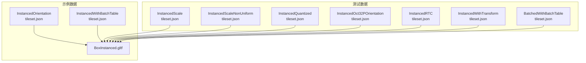
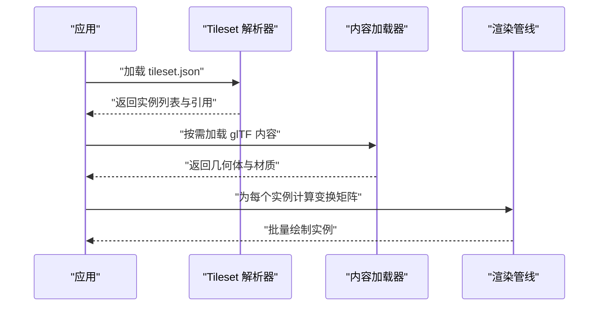
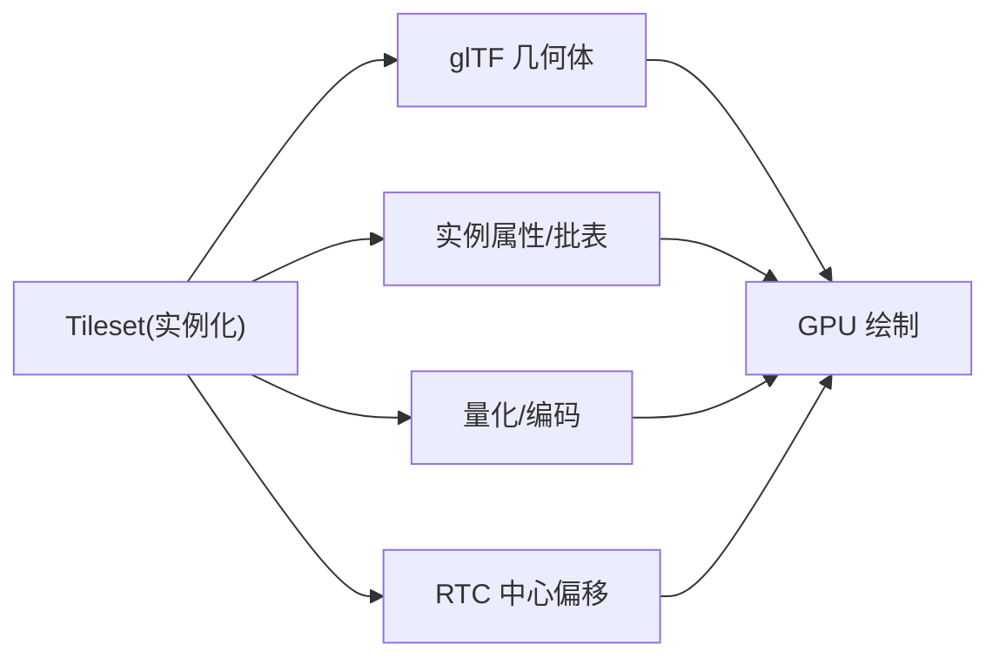

# 实例化模型加载

<cite>
**本文引用的文件**   
- [Apps/SampleData/Cesium3DTiles/Instanced/InstancedOrientation/tileset.json](file://Apps/SampleData/Cesium3DTiles/Instanced/InstancedOrientation/tileset.json)
- [Apps/SampleData/Cesium3DTiles/Instanced/InstancedWithBatchTable/tileset.json](file://Apps/SampleData/Cesium3DTiles/Instanced/InstancedWithBatchTable/tileset.json)
- [Apps/SampleData/models/BoxInstanced/BoxInstanced.gltf](file://Apps/SampleData/models/BoxInstanced/BoxInstanced.gltf)
- [Specs/Data/Cesium3DTiles/Instanced/InstancedOrientation/tileset.json](file://Specs/Data/Cesium3DTiles/Instanced/InstancedOrientation/tileset.json)
- [Specs/Data/Cesium3DTiles/Instanced/InstancedScale/tileset.json](file://Specs/Data/Cesium3DTiles/Instanced/InstancedScale/tileset.json)
- [Specs/Data/Cesium3DTiles/Instanced/InstancedScaleNonUniform/tileset.json](file://Specs/Data/Cesium3DTiles/Instanced/InstancedScaleNonUniform/tileset.json)
- [Specs/Data/Cesium3DTiles/Instanced/InstancedWithBatchTable/tileset.json](file://Specs/Data/Cesium3DTiles/Instanced/InstancedWithBatchTable/tileset.json)
- [Specs/Data/Cesium3DTiles/Instanced/InstancedWithTransform/tileset.json](file://Specs/Data/Cesium3DTiles/Instanced/InstancedWithTransform/tileset.json)
- [Specs/Data/Cesium3DTiles/Instanced/InstancedQuantized/tileset.json](file://Specs/Data/Cesium3DTiles/Instanced/InstancedQuantized/tileset.json)
- [Specs/Data/Cesium3DTiles/Instanced/InstancedOct32POrientation/tileset.json](file://Specs/Data/Cesium3DTiles/Instanced/InstancedOct32POrientation/tileset.json)
- [Specs/Data/Cesium3DTiles/Instanced/InstancedRTC/tileset.json](file://Specs/Data/Cesium3DTiles/Instanced/InstancedRTC/tileset.json)
- [Specs/Data/Cesium3DTiles/Batched/BatchedWithBatchTable/tileset.json](file://Specs/Data/Cesium3DTiles/Batched/BatchedWithBatchTable/tileset.json)
</cite>

## 目录
1. [简介](#简介)
2. [项目结构](#项目结构)
3. [核心组件](#核心组件)
4. [架构总览](#架构总览)
5. [详细组件分析](#详细组件分析)
6. [依赖关系分析](#依赖关系分析)
7. [性能考量](#性能考量)
8. [故障排查指南](#故障排查指南)
9. [结论](#结论)
10. [附录](#附录)

## 简介
本示例聚焦于在 CesiumJS 中加载使用“实例化渲染”的 3D Tiles 数据，覆盖以下关键能力：
- 实例化方向 InstancedOrientation
- 实例化缩放 InstancedScale（含非均匀缩放）
- 实例化带批表 InstancedWithBatchTable
- 实例化变换与量化、八叉编码方向、RTC 等高级特性
- 与批量模型 Batched 的对比分析，帮助选择合适渲染策略

实例化渲染的优势在于：通过复用同一几何体并仅存储每实例的变换与属性，显著降低内存占用与绘制调用次数，适合大规模重复对象场景（如树木、路灯、建筑构件等）。

## 项目结构
仓库中与“实例化模型 3D Tiles”直接相关的资源主要位于：
- Apps/SampleData/Cesium3DTiles/Instanced：演示用 tileset 与内容
- Specs/Data/Cesium3DTiles/Instanced：测试用例与更多变体（缩放、量化、方向编码、RTC 等）
- Apps/SampleData/models/BoxInstanced：用于实例化的 glTF 几何体示例

图表来源
- [Apps/SampleData/Cesium3DTiles/Instanced/InstancedOrientation/tileset.json](file://Apps/SampleData/Cesium3DTiles/Instanced/InstancedOrientation/tileset.json)
- [Apps/SampleData/Cesium3DTiles/Instanced/InstancedWithBatchTable/tileset.json](file://Apps/SampleData/Cesium3DTiles/Instanced/InstancedWithBatchTable/tileset.json)
- [Apps/SampleData/models/BoxInstanced/BoxInstanced.gltf](file://Apps/SampleData/models/BoxInstanced/BoxInstanced.gltf)
- [Specs/Data/Cesium3DTiles/Instanced/InstancedScale/tileset.json](file://Specs/Data/Cesium3DTiles/Instanced/InstancedScale/tileset.json)
- [Specs/Data/Cesium3DTiles/Instanced/InstancedScaleNonUniform/tileset.json](file://Specs/Data/Cesium3DTiles/Instanced/InstancedScaleNonUniform/tileset.json)
- [Specs/Data/Cesium3DTiles/Instanced/InstancedQuantized/tileset.json](file://Specs/Data/Cesium3DTiles/Instanced/InstancedQuantized/tileset.json)
- [Specs/Data/Cesium3DTiles/Instanced/InstancedOct32POrientation/tileset.json](file://Specs/Data/Cesium3DTiles/Instanced/InstancedOct32POrientation/tileset.json)
- [Specs/Data/Cesium3DTiles/Instanced/InstancedRTC/tileset.json](file://Specs/Data/Cesium3DTiles/Instanced/InstancedRTC/tileset.json)
- [Specs/Data/Cesium3DTiles/Instanced/InstancedWithTransform/tileset.json](file://Specs/Data/Cesium3DTiles/Instanced/InstancedWithTransform/tileset.json)
- [Specs/Data/Cesium3DTiles/Batched/BatchedWithBatchTable/tileset.json](file://Specs/Data/Cesium3DTiles/Batched/BatchedWithBatchTable/tileset.json)

章节来源
- [Apps/SampleData/Cesium3DTiles/Instanced/InstancedOrientation/tileset.json](file://Apps/SampleData/Cesium3DTiles/Instanced/InstancedOrientation/tileset.json)
- [Apps/SampleData/Cesium3DTiles/Instanced/InstancedWithBatchTable/tileset.json](file://Apps/SampleData/Cesium3DTiles/Instanced/InstancedWithBatchTable/tileset.json)
- [Apps/SampleData/models/BoxInstanced/BoxInstanced.gltf](file://Apps/SampleData/models/BoxInstanced/BoxInstanced.gltf)

## 核心组件
- 实例化 tileset：描述一组相同几何体的实例集合，每个实例包含位置、方向、缩放等变换信息。
- 实例化内容：glTF 几何体被多次复用，以实例为单位进行绘制，减少 GPU 状态切换与顶点数据冗余。
- 批表（可选）：为每个实例附加属性（如 ID、材质索引、自定义字段），便于交互与着色控制。

章节来源
- [Apps/SampleData/Cesium3DTiles/Instanced/InstancedOrientation/tileset.json](file://Apps/SampleData/Cesium3DTiles/Instanced/InstancedOrientation/tileset.json)
- [Apps/SampleData/Cesium3DTiles/Instanced/InstancedWithBatchTable/tileset.json](file://Apps/SampleData/Cesium3DTiles/Instanced/InstancedWithBatchTable/tileset.json)
- [Apps/SampleData/models/BoxInstanced/BoxInstanced.gltf](file://Apps/SampleData/models/BoxInstanced/BoxInstanced.gltf)

## 架构总览
下图展示了从 tileset 到实例化渲染的关键流程：客户端请求 tileset，解析实例元数据，按需加载 glTF 内容，按实例生成变换矩阵，最终提交绘制。

[此图为概念性流程图，不直接映射具体源码文件]

## 详细组件分析

### 实例化方向 InstancedOrientation
- 目标：为每个实例设置不同的朝向（四元数或旋转矩阵）。
- 典型用法：将同一棵树模型沿不同方向放置，形成森林效果。
- 关键点：
  - 方向通常以标准化四元数或单位四元数形式存储，避免额外归一化开销。
  - 若结合量化或八叉编码方向，可进一步压缩存储体积。
- 参考示例路径：
  - [Apps/SampleData/Cesium3DTiles/Instanced/InstancedOrientation/tileset.json](file://Apps/SampleData/Cesium3DTiles/Instanced/InstancedOrientation/tileset.json)
  - [Specs/Data/Cesium3DTiles/Instanced/InstancedOrientation/tileset.json](file://Specs/Data/Cesium3DTiles/Instanced/InstancedOrientation/tileset.json)
  - [Specs/Data/Cesium3DTiles/Instanced/InstancedOct32POrientation/tileset.json](file://Specs/Data/Cesium3DTiles/Instanced/InstancedOct32POrientation/tileset.json)

章节来源
- [Apps/SampleData/Cesium3DTiles/Instanced/InstancedOrientation/tileset.json](file://Apps/SampleData/Cesium3DTiles/Instanced/InstancedOrientation/tileset.json)
- [Specs/Data/Cesium3DTiles/Instanced/InstancedOrientation/tileset.json](file://Specs/Data/Cesium3DTiles/Instanced/InstancedOrientation/tileset.json)
- [Specs/Data/Cesium3DTiles/Instanced/InstancedOct32POrientation/tileset.json](file://Specs/Data/Cesium3DTiles/Instanced/InstancedOct32POrientation/tileset.json)

### 实例化缩放 InstancedScale / InstancedScaleNonUniform
- 目标：为每个实例设置统一或非均匀缩放。
- 典型用法：模拟不同尺寸的路灯、车辆或建筑构件。
- 关键点：
  - 非均匀缩放会影响法线变换，需确保着色器正确处理。
  - 合理设置缩放范围，避免极端值导致深度精度问题。
- 参考示例路径：
  - [Specs/Data/Cesium3DTiles/Instanced/InstancedScale/tileset.json](file://Specs/Data/Cesium3DTiles/Instanced/InstancedScale/tileset.json)
  - [Specs/Data/Cesium3DTiles/Instanced/InstancedScaleNonUniform/tileset.json](file://Specs/Data/Cesium3DTiles/Instanced/InstancedScaleNonUniform/tileset.json)

章节来源
- [Specs/Data/Cesium3DTiles/Instanced/InstancedScale/tileset.json](file://Specs/Data/Cesium3DTiles/Instanced/InstancedScale/tileset.json)
- [Specs/Data/Cesium3DTiles/Instanced/InstancedScaleNonUniform/tileset.json](file://Specs/Data/Cesium3DTiles/Instanced/InstancedScaleNonUniform/tileset.json)

### 实例化带批表 InstancedWithBatchTable
- 目标：为每个实例附加属性（如类型、ID、颜色索引等），支持按属性筛选与着色。
- 典型用法：对城市要素进行分类显示、点击拾取、动态样式更新。
- 关键点：
  - 批表可与实例属性交错存储，提升缓存命中率。
  - 建议为常用查询字段建立索引或预聚合。
- 参考示例路径：
  - [Apps/SampleData/Cesium3DTiles/Instanced/InstancedWithBatchTable/tileset.json](file://Apps/SampleData/Cesium3DTiles/Instanced/InstancedWithBatchTable/tileset.json)
  - [Specs/Data/Cesium3DTiles/Instanced/InstancedWithBatchTable/tileset.json](file://Specs/Data/Cesium3DTiles/Instanced/InstancedWithBatchTable/tileset.json)

章节来源
- [Apps/SampleData/Cesium3DTiles/Instanced/InstancedWithBatchTable/tileset.json](file://Apps/SampleData/Cesium3DTiles/Instanced/InstancedWithBatchTable/tileset.json)
- [Specs/Data/Cesium3DTiles/Instanced/InstancedWithBatchTable/tileset.json](file://Specs/Data/Cesium3DTiles/Instanced/InstancedWithBatchTable/tileset.json)

### 实例化变换与量化 InstancedWithTransform / InstancedQuantized
- 目标：提供全局或局部变换偏移，以及坐标/属性的量化压缩。
- 典型用法：大范围场景中使用 RTC 中心偏移，配合量化减少带宽与内存。
- 关键点：
  - 量化会引入舍入误差，需权衡精度与体积。
  - 多实例共享同一量化参数时，可进一步提升压缩率。
- 参考示例路径：
  - [Specs/Data/Cesium3DTiles/Instanced/InstancedWithTransform/tileset.json](file://Specs/Data/Cesium3DTiles/Instanced/InstancedWithTransform/tileset.json)
  - [Specs/Data/Cesium3DTiles/Instanced/InstancedQuantized/tileset.json](file://Specs/Data/Cesium3DTiles/Instanced/InstancedQuantized/tileset.json)

章节来源
- [Specs/Data/Cesium3DTiles/Instanced/InstancedWithTransform/tileset.json](file://Specs/Data/Cesium3DTiles/Instanced/InstancedWithTransform/tileset.json)
- [Specs/Data/Cesium3DTiles/Instanced/InstancedQuantized/tileset.json](file://Specs/Data/Cesium3DTiles/Instanced/InstancedQuantized/tileset.json)

### 实例化 RTC InstancedRTC
- 目标：使用相对地心坐标（RTC）中心偏移，提高大尺度场景下的浮点精度。
- 典型用法：全球尺度的城市级实例化场景。
- 参考示例路径：
  - [Specs/Data/Cesium3DTiles/Instanced/InstancedRTC/tileset.json](file://Specs/Data/Cesium3DTiles/Instanced/InstancedRTC/tileset.json)

章节来源
- [Specs/Data/Cesium3DTiles/Instanced/InstancedRTC/tileset.json](file://Specs/Data/Cesium3DTiles/Instanced/InstancedRTC/tileset.json)

### 与批量模型 Batched 的对比
- 批量模型（Batched）：将多个对象合并为一个批次，适合静态或变化较少的对象集合；批表同样可用于属性访问。
- 实例化（Instanced）：更强调“同一几何体 + 每实例变换”，在大量重复对象上具备更好的可扩展性与内存效率。
- 选择建议：
  - 对象高度重复且数量巨大：优先实例化。
  - 对象差异较大但需要合并绘制：考虑批量模型。
  - 需要频繁更新每实例属性：实例化更易扩展。
- 参考示例路径：
  - [Specs/Data/Cesium3DTiles/Batched/BatchedWithBatchTable/tileset.json](file://Specs/Data/Cesium3DTiles/Batched/BatchedWithBatchTable/tileset.json)

章节来源
- [Specs/Data/Cesium3DTiles/Batched/BatchedWithBatchTable/tileset.json](file://Specs/Data/Cesium3DTiles/Batched/BatchedWithBatchTable/tileset.json)

### 代码示例指引（无代码片段）
以下为常见需求的“代码片段路径”指引，便于快速定位实现位置：
- 加载 tileset 并启用实例化渲染
  - [Apps/SampleData/Cesium3DTiles/Instanced/InstancedOrientation/tileset.json](file://Apps/SampleData/Cesium3DTiles/Instanced/InstancedOrientation/tileset.json)
  - [Apps/SampleData/Cesium3DTiles/Instanced/InstancedWithBatchTable/tileset.json](file://Apps/SampleData/Cesium3DTiles/Instanced/InstancedWithBatchTable/tileset.json)
- 设置实例变换矩阵（位置、方向、缩放）
  - [Specs/Data/Cesium3DTiles/Instanced/InstancedWithTransform/tileset.json](file://Specs/Data/Cesium3DTiles/Instanced/InstancedWithTransform/tileset.json)
  - [Specs/Data/Cesium3DTiles/Instanced/InstancedScale/tileset.json](file://Specs/Data/Cesium3DTiles/Instanced/InstancedScale/tileset.json)
  - [Specs/Data/Cesium3DTiles/Instanced/InstancedScaleNonUniform/tileset.json](file://Specs/Data/Cesium3DTiles/Instanced/InstancedScaleNonUniform/tileset.json)
- 配置实例方向（含八叉编码）
  - [Specs/Data/Cesium3DTiles/Instanced/InstancedOrientation/tileset.json](file://Specs/Data/Cesium3DTiles/Instanced/InstancedOrientation/tileset.json)
  - [Specs/Data/Cesium3DTiles/Instanced/InstancedOct32POrientation/tileset.json](file://Specs/Data/Cesium3DTiles/Instanced/InstancedOct32POrientation/tileset.json)
- 使用批表进行属性访问与样式控制
  - [Apps/SampleData/Cesium3DTiles/Instanced/InstancedWithBatchTable/tileset.json](file://Apps/SampleData/Cesium3DTiles/Instanced/InstancedWithBatchTable/tileset.json)
  - [Specs/Data/Cesium3DTiles/Instanced/InstancedWithBatchTable/tileset.json](file://Specs/Data/Cesium3DTiles/Instanced/InstancedWithBatchTable/tileset.json)
- 使用 RTC 与量化优化
  - [Specs/Data/Cesium3DTiles/Instanced/InstancedRTC/tileset.json](file://Specs/Data/Cesium3DTiles/Instanced/InstancedRTC/tileset.json)
  - [Specs/Data/Cesium3DTiles/Instanced/InstancedQuantized/tileset.json](file://Specs/Data/Cesium3DTiles/Instanced/InstancedQuantized/tileset.json)
- 作为实例化的几何体源
  - [Apps/SampleData/models/BoxInstanced/BoxInstanced.gltf](file://Apps/SampleData/models/BoxInstanced/BoxInstanced.gltf)

## 依赖关系分析
- 实例化 tileset 依赖 glTF 几何体作为内容源。
- 批表与实例属性共同决定着色与交互行为。
- 量化与 RTC 影响数值精度与渲染稳定性。

图表来源
- [Apps/SampleData/Cesium3DTiles/Instanced/InstancedOrientation/tileset.json](file://Apps/SampleData/Cesium3DTiles/Instanced/InstancedOrientation/tileset.json)
- [Apps/SampleData/Cesium3DTiles/Instanced/InstancedWithBatchTable/tileset.json](file://Apps/SampleData/Cesium3DTiles/Instanced/InstancedWithBatchTable/tileset.json)
- [Apps/SampleData/models/BoxInstanced/BoxInstanced.gltf](file://Apps/SampleData/models/BoxInstanced/BoxInstanced.gltf)
- [Specs/Data/Cesium3DTiles/Instanced/InstancedQuantized/tileset.json](file://Specs/Data/Cesium3DTiles/Instanced/InstancedQuantized/tileset.json)
- [Specs/Data/Cesium3DTiles/Instanced/InstancedRTC/tileset.json](file://Specs/Data/Cesium3DTiles/Instanced/InstancedRTC/tileset.json)

章节来源
- [Apps/SampleData/Cesium3DTiles/Instanced/InstancedOrientation/tileset.json](file://Apps/SampleData/Cesium3DTiles/Instanced/InstancedOrientation/tileset.json)
- [Apps/SampleData/Cesium3DTiles/Instanced/InstancedWithBatchTable/tileset.json](file://Apps/SampleData/Cesium3DTiles/Instanced/InstancedWithBatchTable/tileset.json)
- [Apps/SampleData/models/BoxInstanced/BoxInstanced.gltf](file://Apps/SampleData/models/BoxInstanced/BoxInstanced.gltf)
- [Specs/Data/Cesium3DTiles/Instanced/InstancedQuantized/tileset.json](file://Specs/Data/Cesium3DTiles/Instanced/InstancedQuantized/tileset.json)
- [Specs/Data/Cesium3DTiles/Instanced/InstancedRTC/tileset.json](file://Specs/Data/Cesium3DTiles/Instanced/InstancedRTC/tileset.json)

## 性能考量
- 内存优化
  - 使用实例化替代重复实例化对象，减少几何体复制。
  - 采用量化与八叉编码方向，降低传输与存储体积。
- 渲染性能
  - 合并绘制调用，减少状态切换。
  - 合理使用批表，避免在着色器中进行昂贵分支判断。
- 精度与稳定性
  - 在大范围场景中启用 RTC，避免浮点抖动。
  - 谨慎使用非均匀缩放，必要时调整法线处理与深度缓冲。

[本节为通用指导，不直接分析具体文件]

## 故障排查指南
- 现象：实例方向异常或翻转
  - 检查方向是否为单位四元数或正确编码格式。
  - 确认着色器是否正确处理八叉编码方向。
- 现象：缩放后阴影或法线异常
  - 验证非均匀缩放下法线变换逻辑。
  - 调整深度偏移或裁剪面以避免 z-fighting。
- 现象：批表属性无法读取
  - 确认 tileset 中批表定义与字段名一致。
  - 检查属性类型与字节对齐。
- 现象：大范围场景出现抖动
  - 启用 RTC 中心偏移，并确保实例坐标基于 RTC 空间。
- 参考示例路径（用于对照正确配置）：
  - [Specs/Data/Cesium3DTiles/Instanced/InstancedOct32POrientation/tileset.json](file://Specs/Data/Cesium3DTiles/Instanced/InstancedOct32POrientation/tileset.json)
  - [Specs/Data/Cesium3DTiles/Instanced/InstancedScaleNonUniform/tileset.json](file://Specs/Data/Cesium3DTiles/Instanced/InstancedScaleNonUniform/tileset.json)
  - [Specs/Data/Cesium3DTiles/Instanced/InstancedWithBatchTable/tileset.json](file://Specs/Data/Cesium3DTiles/Instanced/InstancedWithBatchTable/tileset.json)
  - [Specs/Data/Cesium3DTiles/Instanced/InstancedRTC/tileset.json](file://Specs/Data/Cesium3DTiles/Instanced/InstancedRTC/tileset.json)

章节来源
- [Specs/Data/Cesium3DTiles/Instanced/InstancedOct32POrientation/tileset.json](file://Specs/Data/Cesium3DTiles/Instanced/InstancedOct32POrientation/tileset.json)
- [Specs/Data/Cesium3DTiles/Instanced/InstancedScaleNonUniform/tileset.json](file://Specs/Data/Cesium3DTiles/Instanced/InstancedScaleNonUniform/tileset.json)
- [Specs/Data/Cesium3DTiles/Instanced/InstancedWithBatchTable/tileset.json](file://Specs/Data/Cesium3DTiles/Instanced/InstancedWithBatchTable/tileset.json)
- [Specs/Data/Cesium3DTiles/Instanced/InstancedRTC/tileset.json](file://Specs/Data/Cesium3DTiles/Instanced/InstancedRTC/tileset.json)

## 结论
- 实例化渲染适用于大规模重复对象的场景，能显著提升内存与渲染性能。
- 通过方向、缩放、批表、量化与 RTC 的组合，可在保证精度的同时获得良好性能。
- 与批量模型相比，实例化更适合“同几何体 + 多实例”的场景；批量模型则适合“多对象合并绘制”的需求。

[本节为总结性内容，不直接分析具体文件]

## 附录
- 相关示例与测试数据路径汇总：
  - 实例化方向：[Apps/SampleData/Cesium3DTiles/Instanced/InstancedOrientation/tileset.json](file://Apps/SampleData/Cesium3DTiles/Instanced/InstancedOrientation/tileset.json)、[Specs/Data/Cesium3DTiles/Instanced/InstancedOrientation/tileset.json](file://Specs/Data/Cesium3DTiles/Instanced/InstancedOrientation/tileset.json)
  - 实例化缩放：[Specs/Data/Cesium3DTiles/Instanced/InstancedScale/tileset.json](file://Specs/Data/Cesium3DTiles/Instanced/InstancedScale/tileset.json)、[Specs/Data/Cesium3DTiles/Instanced/InstancedScaleNonUniform/tileset.json](file://Specs/Data/Cesium3DTiles/Instanced/InstancedScaleNonUniform/tileset.json)
  - 实例化批表：[Apps/SampleData/Cesium3DTiles/Instanced/InstancedWithBatchTable/tileset.json](file://Apps/SampleData/Cesium3DTiles/Instanced/InstancedWithBatchTable/tileset.json)、[Specs/Data/Cesium3DTiles/Instanced/InstancedWithBatchTable/tileset.json](file://Specs/Data/Cesium3DTiles/Instanced/InstancedWithBatchTable/tileset.json)
  - 实例化变换与量化：[Specs/Data/Cesium3DTiles/Instanced/InstancedWithTransform/tileset.json](file://Specs/Data/Cesium3DTiles/Instanced/InstancedWithTransform/tileset.json)、[Specs/Data/Cesium3DTiles/Instanced/InstancedQuantized/tileset.json](file://Specs/Data/Cesium3DTiles/Instanced/InstancedQuantized/tileset.json)
  - 实例化 RTC：[Specs/Data/Cesium3DTiles/Instanced/InstancedRTC/tileset.json](file://Specs/Data/Cesium3DTiles/Instanced/InstancedRTC/tileset.json)
  - 批量模型对比：[Specs/Data/Cesium3DTiles/Batched/BatchedWithBatchTable/tileset.json](file://Specs/Data/Cesium3DTiles/Batched/BatchedWithBatchTable/tileset.json)
  - 实例化几何体源：[Apps/SampleData/models/BoxInstanced/BoxInstanced.gltf](file://Apps/SampleData/models/BoxInstanced/BoxInstanced.gltf)