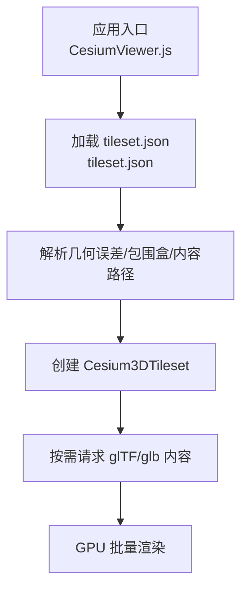
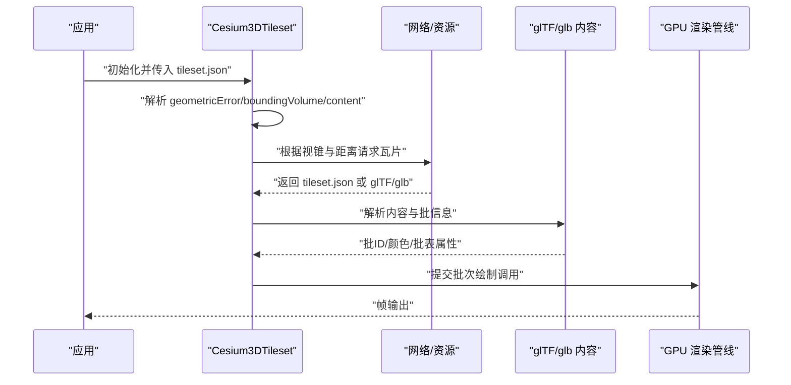
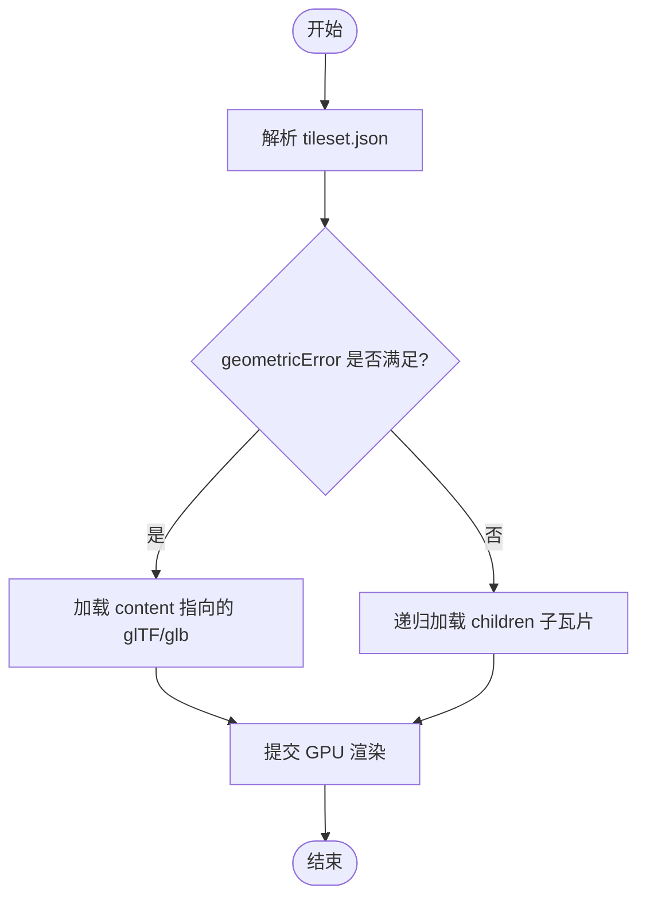
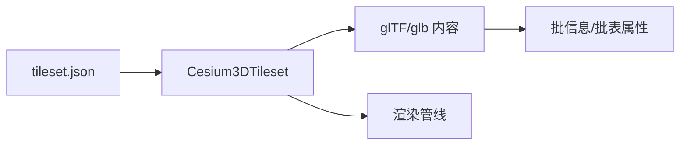

# 批量模型加载

<cite>
**本文引用的文件**   
- [Apps/SampleData/Cesium3DTiles/Batched/BatchedColors/tileset.json](file://Apps/SampleData/Cesium3DTiles/Batched/BatchedColors/tileset.json)
- [Apps/SampleData/Cesium3DTiles/Batched/BatchedTranslucent/tileset.json](file://Apps/SampleData/Cesium3DTiles/Batched/BatchedTranslucent/tileset.json)
- [Apps/SampleData/Cesium3DTiles/Batched/BatchedWithBatchTable/tileset.json](file://Apps/SampleData/Cesium3DTiles/Batched/BatchedWithBatchTable/tileset.json)
- [Apps/SampleData/Cesium3DTiles/Tilesets/Tileset/tileset.json](file://Apps/SampleData/Cesium3DTiles/Tilesets/Tileset/tileset.json)
- [Specs/Data/Cesium3DTiles/Batched/BatchedColors/tileset.json](file://Specs/Data/Cesium3DTiles/Batched/BatchedColors/tileset.json)
- [Specs/Data/Cesium3DTiles/Batched/BatchedTranslucent/tileset.json](file://Specs/Data/Cesium3DTiles/Batched/BatchedTranslucent/tileset.json)
- [Specs/Data/Cesium3DTiles/Batched/BatchedWithBatchTable/tileset.json](file://Specs/Data/Cesium3DTiles/Batched/BatchedWithBatchTable/tileset.json)
- [Specs/Data/Cesium3DTiles/Tilesets/Tileset/tileset.json](file://Specs/Data/Cesium3DTiles/Tilesets/Tileset/tileset.json)
</cite>

## 目录
1. [简介](#简介)
2. [项目结构](#项目结构)
3. [核心组件](#核心组件)
4. [架构总览](#架构总览)
5. [详细组件分析](#详细组件分析)
6. [依赖关系分析](#依赖关系分析)
7. [性能考虑](#性能考虑)
8. [故障排查指南](#故障排查指南)
9. [结论](#结论)
10. [附录](#附录)

## 简介
本示例聚焦于在 CesiumJS 中加载“批量渲染”的 3D Tiles 数据，覆盖以下典型场景：
- 带逐批颜色的批量模型（BatchedColors）
- 半透明批量模型（BatchedTranslucent）
- 包含批表属性的批量模型（BatchedWithBatchTable）

文档将详细说明 tileset.json 的关键字段（几何误差、包围盒、内容路径等），并提供材质设置、透明度控制与批表属性访问的实践要点。同时给出性能优化建议，如 LOD 配置、内存管理与渲染策略。

## 项目结构
仓库中与批量 3D Tiles 相关的示例数据位于 Apps/SampleData/Cesium3DTiles/Batched 与 Specs/Data/Cesium3DTiles/Batched 两个目录下。每个子目录包含一个 tileset.json 与对应的二进制内容（glTF/glb）。此外，通用 Tileset 示例位于 Tilesets/Tileset 目录，便于理解根级 tileset.json 的结构。

图表来源
- [Apps/SampleData/Cesium3DTiles/Batched/BatchedColors/tileset.json](file://Apps/SampleData/Cesium3DTiles/Batched/BatchedColors/tileset.json)
- [Apps/SampleData/Cesium3DTiles/Batched/BatchedTranslucent/tileset.json](file://Apps/SampleData/Cesium3DTiles/Batched/BatchedTranslucent/tileset.json)
- [Apps/SampleData/Cesium3DTiles/Batched/BatchedWithBatchTable/tileset.json](file://Apps/SampleData/Cesium3DTiles/Batched/BatchedWithBatchTable/tileset.json)
- [Apps/SampleData/Cesium3DTiles/Tilesets/Tileset/tileset.json](file://Apps/SampleData/Cesium3DTiles/Tilesets/Tileset/tileset.json)

章节来源
- [Apps/SampleData/Cesium3DTiles/Batched/BatchedColors/tileset.json](file://Apps/SampleData/Cesium3DTiles/Batched/BatchedColors/tileset.json)
- [Apps/SampleData/Cesium3DTiles/Batched/BatchedTranslucent/tileset.json](file://Apps/SampleData/Cesium3DTiles/Batched/BatchedTranslucent/tileset.json)
- [Apps/SampleData/Cesium3DTiles/Batched/BatchedWithBatchTable/tileset.json](file://Apps/SampleData/Cesium3DTiles/Batched/BatchedWithBatchTable/tileset.json)
- [Apps/SampleData/Cesium3DTiles/Tilesets/Tileset/tileset.json](file://Apps/SampleData/Cesium3DTiles/Tilesets/Tileset/tileset.json)

## 核心组件
- 3D Tiles 瓦片集描述文件（tileset.json）
  - 关键属性：geometricError（几何误差）、boundingVolume（包围盒）、content（内容路径）、children（子瓦片）
- 批量模型类型
  - BatchedColors：为每个批分配颜色
  - BatchedTranslucent：支持半透明批
  - BatchedWithBatchTable：包含批表（batch table）以提供每批的属性
- 运行时对象
  - Cesium3DTileset：负责瓦片调度、LOD、可见性裁剪与内容加载
  - 样式与材质：通过样式或材质 API 控制外观与透明度
  - 批表访问：通过选择器或事件回调读取每批属性

章节来源
- [Specs/Data/Cesium3DTiles/Batched/BatchedColors/tileset.json](file://Specs/Data/Cesium3DTiles/Batched/BatchedColors/tileset.json)
- [Specs/Data/Cesium3DTiles/Batched/BatchedTranslucent/tileset.json](file://Specs/Data/Cesium3DTiles/Batched/BatchedTranslucent/tileset.json)
- [Specs/Data/Cesium3DTiles/Batched/BatchedWithBatchTable/tileset.json](file://Specs/Data/Cesium3DTiles/Batched/BatchedWithBatchTable/tileset.json)
- [Specs/Data/Cesium3DTiles/Tilesets/Tileset/tileset.json](file://Specs/Data/Cesium3DTiles/Tilesets/Tileset/tileset.json)

## 架构总览
下图展示了从 tileset.json 到 GPU 渲染的整体流程，以及不同批量类型的差异点。

图表来源
- [Apps/SampleData/Cesium3DTiles/Batched/BatchedColors/tileset.json](file://Apps/SampleData/Cesium3DTiles/Batched/BatchedColors/tileset.json)
- [Apps/SampleData/Cesium3DTiles/Batched/BatchedTranslucent/tileset.json](file://Apps/SampleData/Cesium3DTiles/Batched/BatchedTranslucent/tileset.json)
- [Apps/SampleData/Cesium3DTiles/Batched/BatchedWithBatchTable/tileset.json](file://Apps/SampleData/Cesium3DTiles/Batched/BatchedWithBatchTable/tileset.json)
- [Apps/SampleData/Cesium3DTiles/Tilesets/Tileset/tileset.json](file://Apps/SampleData/Cesium3DTiles/Tilesets/Tileset/tileset.json)

## 详细组件分析

### 批量颜色模型（BatchedColors）
- tileset.json 要点
  - geometricError：控制细节层次切换阈值
  - boundingVolume：定义瓦片空间范围，用于裁剪与调度
  - content：指向 glTF/glb 内容文件
- 渲染特性
  - 每个批具有固定颜色，适合大量重复构件的快速渲染
- 使用建议
  - 合理设置 geometricError 以平衡质量与性能
  - 避免在同一帧内频繁修改批颜色，优先使用样式或材质统一更新

章节来源
- [Apps/SampleData/Cesium3DTiles/Batched/BatchedColors/tileset.json](file://Apps/SampleData/Cesium3DTiles/Batched/BatchedColors/tileset.json)
- [Specs/Data/Cesium3DTiles/Batched/BatchedColors/tileset.json](file://Specs/Data/Cesium3DTiles/Batched/BatchedColors/tileset.json)

### 半透明批量模型（BatchedTranslucent）
- tileset.json 要点
  - 同 BatchedColors，但内容包含半透明批
- 渲染特性
  - 需要启用深度排序与混合，注意绘制顺序对视觉正确性的影响
- 使用建议
  - 尽量将半透明批合并以减少状态切换
  - 谨慎使用高透明度叠加，避免过度混合导致的性能下降

章节来源
- [Apps/SampleData/Cesium3DTiles/Batched/BatchedTranslucent/tileset.json](file://Apps/SampleData/Cesium3DTiles/Batched/BatchedTranslucent/tileset.json)
- [Specs/Data/Cesium3DTiles/Batched/BatchedTranslucent/tileset.json](file://Specs/Data/Cesium3DTiles/Batched/BatchedTranslucent/tileset.json)

### 含批表的批量模型（BatchedWithBatchTable）
- tileset.json 要点
  - 除几何与内容外，还包含批表（batch table）以描述每批的属性
- 批表属性访问
  - 可通过选择器或事件回调获取每批属性，实现按属性筛选、着色或交互
- 使用建议
  - 批表字段命名保持简洁，减少序列化体积
  - 对高频查询的属性建立索引或缓存

章节来源
- [Apps/SampleData/Cesium3DTiles/Batched/BatchedWithBatchTable/tileset.json](file://Apps/SampleData/Cesium3DTiles/Batched/BatchedWithBatchTable/tileset.json)
- [Specs/Data/Cesium3DTiles/Batched/BatchedWithBatchTable/tileset.json](file://Specs/Data/Cesium3DTiles/Batched/BatchedWithBatchTable/tileset.json)

### 根级 tileset.json 结构与关键属性
- geometricError：瓦片几何误差，驱动 LOD 切换
- boundingVolume：包围盒（box/sphere/region），决定瓦片空间范围
- content：内容路径（glTF/glb），可指定多种格式
- children：子瓦片数组，构建层级结构
- 其他可选：transform、extensions、extras 等

图表来源
- [Apps/SampleData/Cesium3DTiles/Tilesets/Tileset/tileset.json](file://Apps/SampleData/Cesium3DTiles/Tilesets/Tileset/tileset.json)
- [Specs/Data/Cesium3DTiles/Tilesets/Tileset/tileset.json](file://Specs/Data/Cesium3DTiles/Tilesets/Tileset/tileset.json)

章节来源
- [Apps/SampleData/Cesium3DTiles/Tilesets/Tileset/tileset.json](file://Apps/SampleData/Cesium3DTiles/Tilesets/Tileset/tileset.json)
- [Specs/Data/Cesium3DTiles/Tilesets/Tileset/tileset.json](file://Specs/Data/Cesium3DTiles/Tilesets/Tileset/tileset.json)

## 依赖关系分析
- tileset.json 作为唯一入口，声明瓦片树与内容路径
- Cesium3DTileset 负责瓦片调度、LOD 计算与内容生命周期管理
- glTF/glb 内容承载几何、材质与批信息
- 批表（如有）提供每批属性，供上层逻辑进行筛选与交互

图表来源
- [Apps/SampleData/Cesium3DTiles/Batched/BatchedColors/tileset.json](file://Apps/SampleData/Cesium3DTiles/Batched/BatchedColors/tileset.json)
- [Apps/SampleData/Cesium3DTiles/Batched/BatchedTranslucent/tileset.json](file://Apps/SampleData/Cesium3DTiles/Batched/BatchedTranslucent/tileset.json)
- [Apps/SampleData/Cesium3DTiles/Batched/BatchedWithBatchTable/tileset.json](file://Apps/SampleData/Cesium3DTiles/Batched/BatchedWithBatchTable/tileset.json)
- [Apps/SampleData/Cesium3DTiles/Tilesets/Tileset/tileset.json](file://Apps/SampleData/Cesium3DTiles/Tilesets/Tileset/tileset.json)

## 性能考虑
- LOD 与几何误差
  - 合理设置 geometricError，使远距低精、近距高精，降低三角面数与带宽
- 批与材质
  - 批量颜色与批表属性可减少 CPU-GPU 同步开销；避免频繁更改批材质
- 半透明渲染
  - 半透明批需额外排序与混合成本，尽量合并同类批，减少状态切换
- 内存管理
  - 控制并发下载数量，避免峰值内存过高；及时释放不可见瓦片
- 网络与缓存
  - 利用浏览器缓存与 CDN；对静态内容开启强缓存
- 可视性与裁剪
  - 确保 boundingVolume 准确，提升视锥与遮挡剔除效率

[本节为通用指导，不直接分析具体文件]

## 故障排查指南
- 瓦片未显示
  - 检查 tileset.json 的 content 路径是否正确，网络是否可达
  - 确认 boundingVolume 与地理坐标一致，避免瓦片超出可视范围
- 半透明异常
  - 检查是否启用了正确的混合与深度排序；避免同一帧内多次切换混合状态
- 批表属性为空
  - 确认 tileset.json 中包含批表且字段名与访问代码一致
- 性能抖动
  - 观察瓦片加载并发与内存峰值；适当限制并发与调整几何误差

[本节为通用指导，不直接分析具体文件]

## 结论
通过 tileset.json 的几何误差、包围盒与内容路径配置，结合 Cesium3DTileset 的瓦片调度机制，可以高效加载与渲染批量 3D 模型。针对颜色、半透明与批表等不同批量类型，应分别采用合适的材质与属性访问策略，并在 LOD、内存与网络层面进行优化，以获得稳定流畅的可视化体验。

[本节为总结性内容，不直接分析具体文件]

## 附录
- 参考示例路径
  - 批量颜色：[BatchedColors](file://Apps/SampleData/Cesium3DTiles/Batched/BatchedColors/tileset.json)
  - 半透明批量：[BatchedTranslucent](file://Apps/SampleData/Cesium3DTiles/Batched/BatchedTranslucent/tileset.json)
  - 含批表批量：[BatchedWithBatchTable](file://Apps/SampleData/Cesium3DTiles/Batched/BatchedWithBatchTable/tileset.json)
  - 根级 Tileset：[Tileset](file://Apps/SampleData/Cesium3DTiles/Tilesets/Tileset/tileset.json)