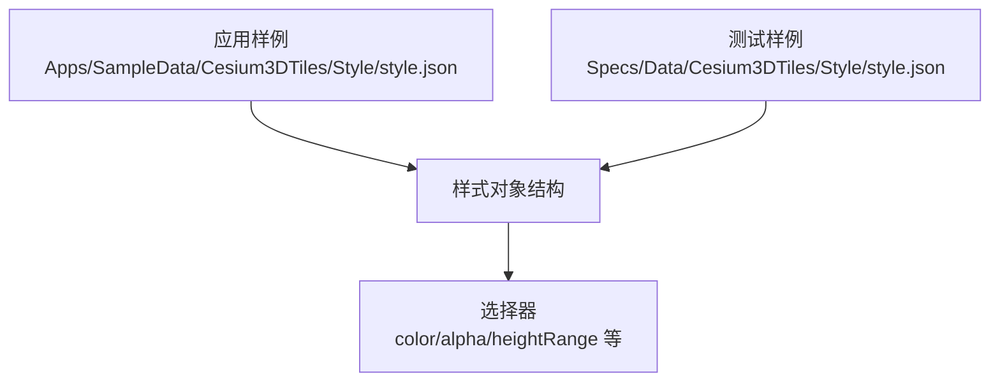
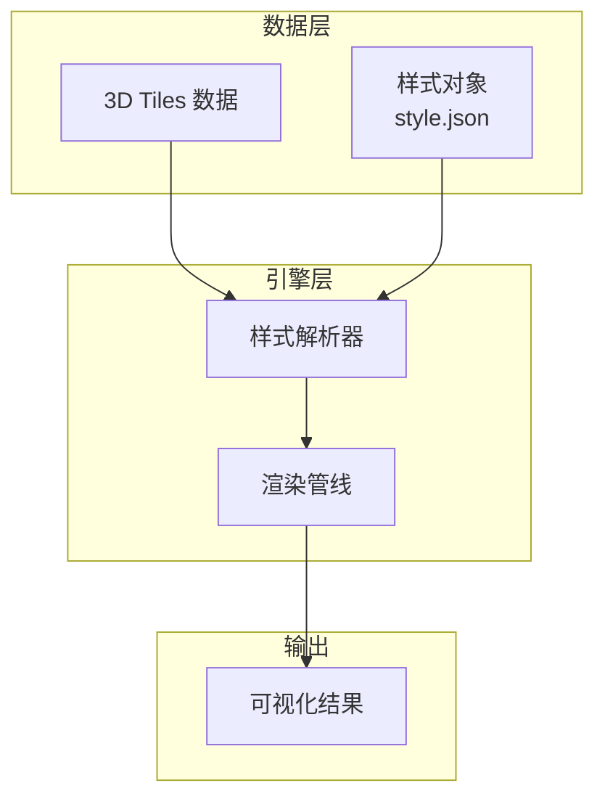
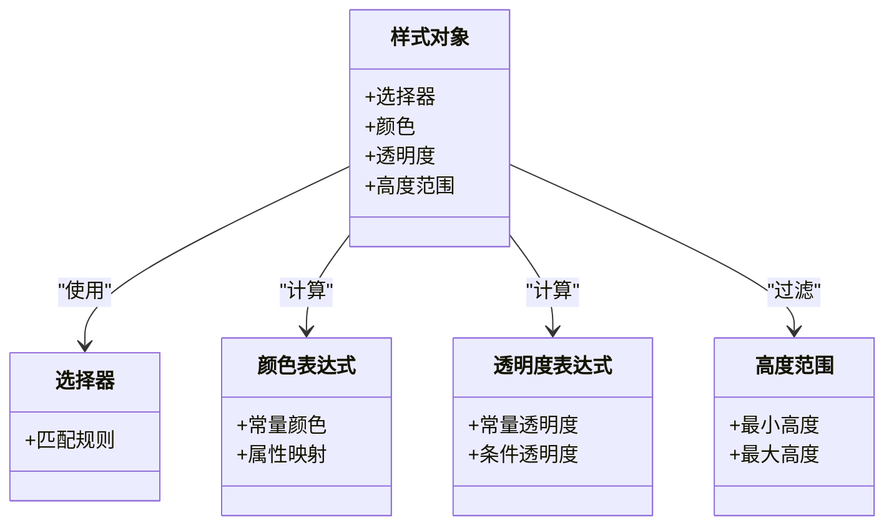
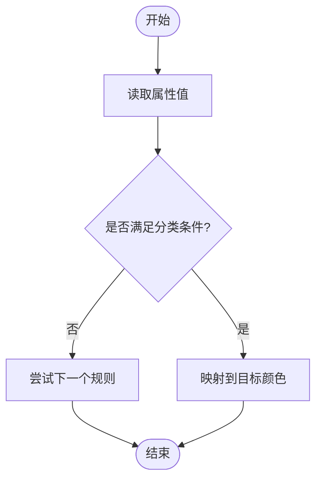
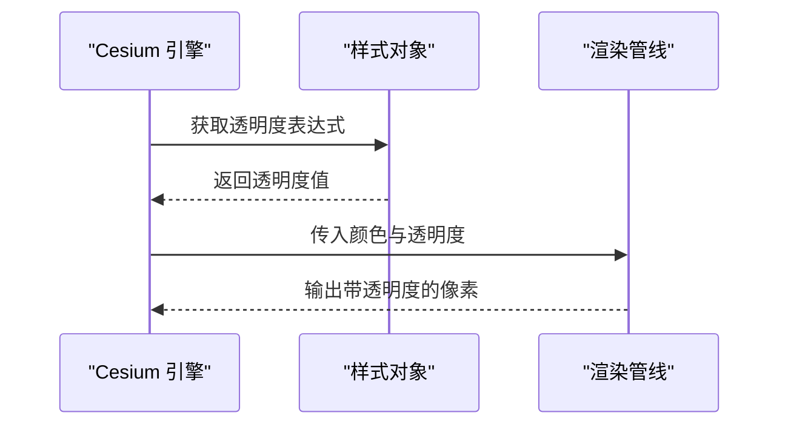
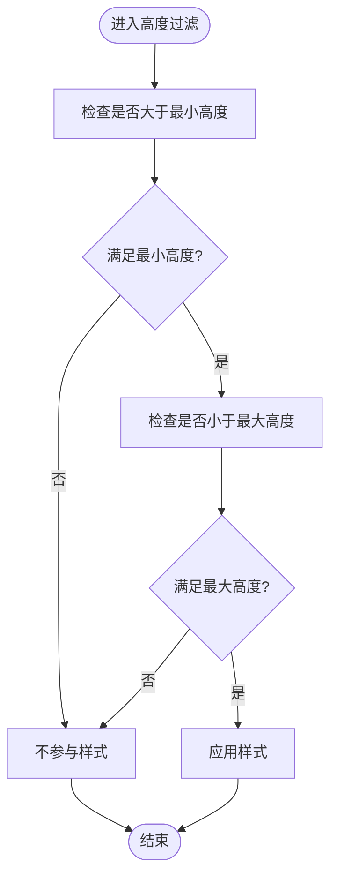
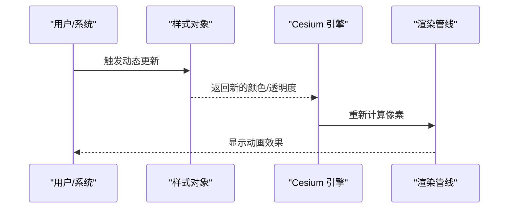
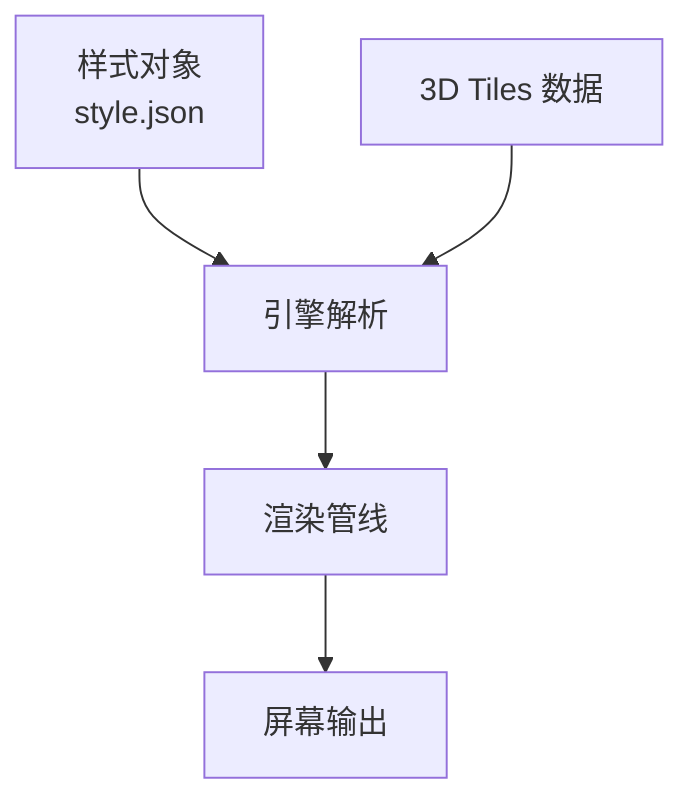

# 样式定制

<cite>
**本文引用的文件**   
- [Apps/SampleData/Cesium3DTiles/Style/style.json](file://Apps/SampleData/Cesium3DTiles/Style/style.json)
- [Specs/Data/Cesium3DTiles/Style/style.json](file://Specs/Data/Cesium3DTiles/Style/style.json)
</cite>

## 目录
1. [简介](#简介)
2. [项目结构](#项目结构)
3. [核心组件](#核心组件)
4. [架构总览](#架构总览)
5. [详细组件分析](#详细组件分析)
6. [依赖分析](#依赖分析)
7. [性能考虑](#性能考虑)
8. [故障排查指南](#故障排查指南)
9. [结论](#结论)
10. [附录](#附录)

## 简介
本文件面向需要在 Cesium 中为 3D Tiles 数据应用样式的开发者，提供基于 Cesium3DTileStyle 的样式定制示例与最佳实践。内容涵盖：
- 颜色表达式、透明度控制、高度过滤等常用样式能力
- 条件样式、动态样式、基于属性的样式设置方法
- 常见视觉效果实现思路（分类着色、热力图风格、动画效果）
- 样式性能优化技巧（缓存、批量渲染、表达式简化）

说明：本仓库包含 3D Tiles 样式样例数据，可用于理解样式表达式的结构与用法。

## 项目结构
与 3D Tiles 样式直接相关的样例位于以下路径：
- 应用样例数据：Apps/SampleData/Cesium3DTiles/Style/style.json
- 测试数据：Specs/Data/Cesium3DTiles/Style/style.json

这些 JSON 文件展示了 3D Tiles 样式对象的基本结构，包括选择器、颜色、透明度、高度范围等字段的使用方式。

图表来源
- [Apps/SampleData/Cesium3DTiles/Style/style.json](file://Apps/SampleData/Cesium3DTiles/Style/style.json)
- [Specs/Data/Cesium3DTiles/Style/style.json](file://Specs/Data/Cesium3DTiles/Style/style.json)

章节来源
- [Apps/SampleData/Cesium3DTiles/Style/style.json](file://Apps/SampleData/Cesium3DTiles/Style/style.json)
- [Specs/Data/Cesium3DTiles/Style/style.json](file://Specs/Data/Cesium3DTiles/Style/style.json)

## 核心组件
- 样式对象：描述如何对 3D Tiles 中的几何体进行视觉呈现，包括选择器、颜色、透明度、高度范围等。
- 选择器：用于匹配目标几何体或属性，支持多种匹配策略。
- 颜色表达式：根据属性或常量计算最终颜色值。
- 透明度控制：通过 alpha 表达式控制可见度。
- 高度过滤：使用 heightRange 限制在特定高度区间内的几何体参与样式计算。

章节来源
- [Apps/SampleData/Cesium3DTiles/Style/style.json](file://Apps/SampleData/Cesium3DTiles/Style/style.json)
- [Specs/Data/Cesium3DTiles/Style/style.json](file://Specs/Data/Cesium3DTiles/Style/style.json)

## 架构总览
下图展示 3D Tiles 样式在渲染管线中的位置与交互关系：样式对象由引擎解析并应用于对应几何体，影响颜色与透明度等外观属性。

图表来源
- [Apps/SampleData/Cesium3DTiles/Style/style.json](file://Apps/SampleData/Cesium3DTiles/Style/style.json)
- [Specs/Data/Cesium3DTiles/Style/style.json](file://Specs/Data/Cesium3DTiles/Style/style.json)

## 详细组件分析

### 样式对象结构分析
- 选择器：定义哪些几何体或属性参与样式计算。
- 颜色：支持常量颜色与表达式，可基于属性值映射到不同颜色。
- 透明度：支持常量与表达式，常用于按条件显示或半透明叠加。
- 高度范围：限定仅在指定高度区间内生效，便于分层显示或过滤。

图表来源
- [Apps/SampleData/Cesium3DTiles/Style/style.json](file://Apps/SampleData/Cesium3DTiles/Style/style.json)
- [Specs/Data/Cesium3DTiles/Style/style.json](file://Specs/Data/Cesium3DTiles/Style/style.json)

章节来源
- [Apps/SampleData/Cesium3DTiles/Style/style.json](file://Apps/SampleData/Cesium3DTiles/Style/style.json)
- [Specs/Data/Cesium3DTiles/Style/style.json](file://Specs/Data/Cesium3DTiles/Style/style.json)

### 颜色表达式与分类着色
- 常量颜色：为所有匹配几何体设置统一颜色。
- 属性映射：根据属性值映射到不同颜色，实现分类着色。
- 表达式组合：结合条件判断与数值映射，实现更复杂的分类逻辑。

图表来源
- [Apps/SampleData/Cesium3DTiles/Style/style.json](file://Apps/SampleData/Cesium3DTiles/Style/style.json)
- [Specs/Data/Cesium3DTiles/Style/style.json](file://Specs/Data/Cesium3DTiles/Style/style.json)

章节来源
- [Apps/SampleData/Cesium3DTiles/Style/style.json](file://Apps/SampleData/Cesium3DTiles/Style/style.json)
- [Specs/Data/Cesium3DTiles/Style/style.json](file://Specs/Data/Cesium3DTiles/Style/style.json)

### 透明度控制与条件显示
- 常量透明度：为所有匹配几何体设置固定透明度。
- 条件透明度：根据属性或环境状态动态调整透明度，实现高亮或淡化效果。
- 与颜色表达式组合：先计算颜色，再乘以透明度得到最终像素颜色。

图表来源
- [Apps/SampleData/Cesium3DTiles/Style/style.json](file://Apps/SampleData/Cesium3DTiles/Style/style.json)
- [Specs/Data/Cesium3DTiles/Style/style.json](file://Specs/Data/Cesium3DTiles/Style/style.json)

章节来源
- [Apps/SampleData/Cesium3DTiles/Style/style.json](file://Apps/SampleData/Cesium3DTiles/Style/style.json)
- [Specs/Data/Cesium3DTiles/Style/style.json](file://Specs/Data/Cesium3DTiles/Style/style.json)

### 高度过滤与分层显示
- 高度范围：仅当几何体高度落在指定区间时参与样式计算。
- 多层级过滤：结合多个高度范围实现分层显示（如地面建筑、空中设施）。
- 与条件样式组合：在不同高度区间应用不同的颜色与透明度。

图表来源
- [Apps/SampleData/Cesium3DTiles/Style/style.json](file://Apps/SampleData/Cesium3DTiles/Style/style.json)
- [Specs/Data/Cesium3DTiles/Style/style.json](file://Specs/Data/Cesium3DTiles/Style/style.json)

章节来源
- [Apps/SampleData/Cesium3DTiles/Style/style.json](file://Apps/SampleData/Cesium3DTiles/Style/style.json)
- [Specs/Data/Cesium3DTiles/Style/style.json](file://Specs/Data/Cesium3DTiles/Style/style.json)

### 动态样式与动画效果
- 时间驱动：基于系统时间或自定义时间变量更新透明度或颜色。
- 循环渐变：通过正弦函数或周期函数实现呼吸灯、闪烁等动画。
- 事件驱动：根据用户交互或业务事件切换样式规则。

图表来源
- [Apps/SampleData/Cesium3DTiles/Style/style.json](file://Apps/SampleData/Cesium3DTiles/Style/style.json)
- [Specs/Data/Cesium3DTiles/Style/style.json](file://Specs/Data/Cesium3DTiles/Style/style.json)

章节来源
- [Apps/SampleData/Cesium3DTiles/Style/style.json](file://Apps/SampleData/Cesium3DTiles/Style/style.json)
- [Specs/Data/Cesium3DTiles/Style/style.json](file://Specs/Data/Cesium3DTiles/Style/style.json)

### 常见视觉效果实现思路
- 分类着色：依据属性值将几何体分为若干类别，并为每类分配不同颜色。
- 热力图风格：根据密度或强度属性映射到暖色系渐变，配合透明度增强层次。
- 动画效果：利用时间变量实现颜色或透明度周期性变化，突出关键要素。

[本节为概念性说明，不直接分析具体文件]

## 依赖分析
- 样式对象与 3D Tiles 数据解耦：样式以独立 JSON 形式存在，便于复用与维护。
- 引擎解析样式：Cesium 引擎负责解析样式对象并将其应用到渲染管线。
- 渲染管线执行：最终的颜色与透明度由渲染管线计算并输出。

图表来源
- [Apps/SampleData/Cesium3DTiles/Style/style.json](file://Apps/SampleData/Cesium3DTiles/Style/style.json)
- [Specs/Data/Cesium3DTiles/Style/style.json](file://Specs/Data/Cesium3DTiles/Style/style.json)

章节来源
- [Apps/SampleData/Cesium3DTiles/Style/style.json](file://Apps/SampleData/Cesium3DTiles/Style/style.json)
- [Specs/Data/Cesium3DTiles/Style/style.json](file://Specs/Data/Cesium3DTiles/Style/style.json)

## 性能考虑
- 表达式缓存：避免重复计算相同表达式结果，减少 CPU/GPU 开销。
- 批量渲染：合并相似样式规则，降低绘制调用次数。
- 简化表达式：优先使用常量与简单映射，复杂逻辑下沉至预处理阶段。
- 高度过滤优化：合理设置高度范围，减少不必要的几何体参与样式计算。
- 分片加载：按需加载样式与数据，提升首屏性能。

[本节提供通用指导，不直接分析具体文件]

## 故障排查指南
- 样式未生效：检查选择器是否正确匹配目标几何体；确认属性名称与类型一致。
- 颜色异常：验证颜色表达式返回值是否在合法范围内；检查透明度是否与颜色混合逻辑冲突。
- 高度过滤无效：确认高度坐标系与数据一致；检查最小/最大高度设置是否合理。
- 动画卡顿：评估表达式复杂度；考虑预计算或使用更高效的函数。

[本节提供通用指导，不直接分析具体文件]

## 结论
通过合理的样式对象设计与表达式优化，可以在 Cesium 中高效地为 3D Tiles 数据添加丰富的视觉效果。建议在实际项目中结合业务需求与性能指标，选择合适的样式策略与优化手段。

[本节为总结性内容，不直接分析具体文件]

## 附录
- 参考样例：
  - [Apps/SampleData/Cesium3DTiles/Style/style.json](file://Apps/SampleData/Cesium3DTiles/Style/style.json)
  - [Specs/Data/Cesium3DTiles/Style/style.json](file://Specs/Data/Cesium3DTiles/Style/style.json)

[本节列出参考文件，不直接分析具体文件]