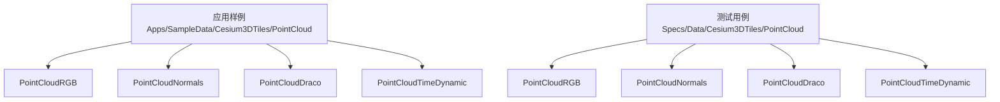
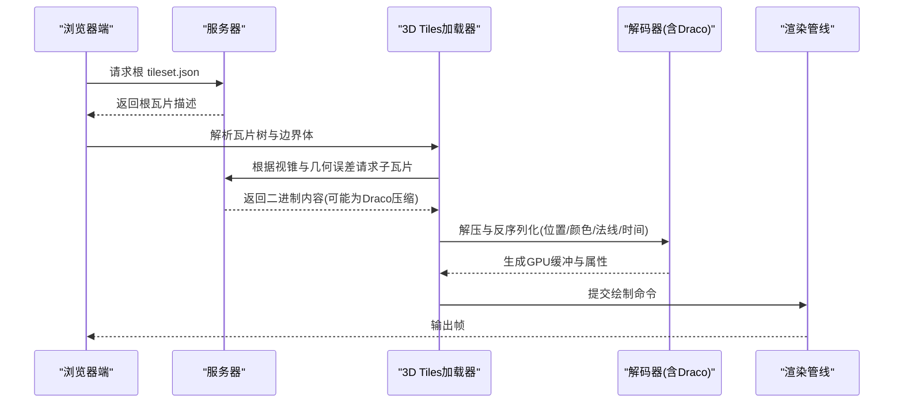
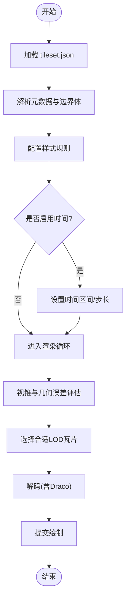
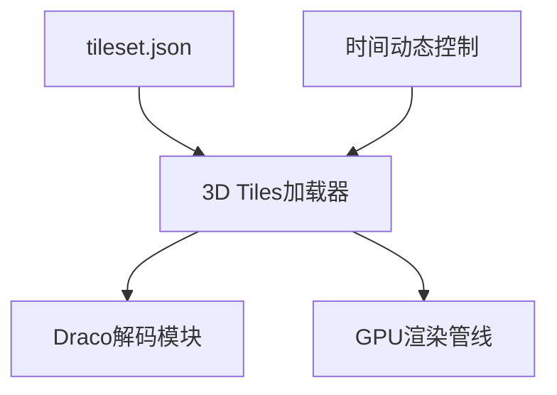

# 点云数据处理

<cite>
**本文引用的文件**   
- [Apps/SampleData/Cesium3DTiles/PointCloud/PointCloudRGB/tileset.json](file://Apps/SampleData/Cesium3DTiles/PointCloud/PointCloudRGB/tileset.json)
- [Apps/SampleData/Cesium3DTiles/PointCloud/PointCloudNormals/tileset.json](file://Apps/SampleData/Cesium3DTiles/PointCloud/PointCloudNormals/tileset.json)
- [Apps/SampleData/Cesium3DTiles/PointCloud/PointCloudDraco/tileset.json](file://Apps/SampleData/Cesium3DTiles/PointCloud/PointCloudDraco/tileset.json)
- [Apps/SampleData/Cesium3DTiles/PointCloud/PointCloudTimeDynamic/tileset.json](file://Apps/SampleData/Cesium3DTiles/PointCloud/PointCloudTimeDynamic/tileset.json)
- [Specs/Data/Cesium3DTiles/PointCloud/PointCloudRGB/tileset.json](file://Specs/Data/Cesium3DTiles/PointCloud/PointCloudRGB/tileset.json)
- [Specs/Data/Cesium3DTiles/PointCloud/PointCloudNormals/tileset.json](file://Specs/Data/Cesium3DTiles/PointCloud/PointCloudNormals/tileset.json)
- [Specs/Data/Cesium3DTiles/PointCloud/PointCloudDraco/tileset.json](file://Specs/Data/Cesium3DTiles/PointCloud/PointCloudDraco/tileset.json)
- [Specs/Data/Cesium3DTiles/PointCloud/PointCloudTimeDynamic/tileset.json](file://Specs/Data/Cesium3DTiles/PointCloud/PointCloudTimeDynamic/tileset.json)
- [Documentation/Contributors/DracoModuleManagement/README.md](file://Documentation/Contributors/DracoModuleManagement/README.md)
</cite>

## 目录
1. [简介](#简介)
2. [项目结构](#项目结构)
3. [核心组件](#核心组件)
4. [架构总览](#架构总览)
5. [详细组件分析](#详细组件分析)
6. [依赖关系分析](#依赖关系分析)
7. [性能考虑](#性能考虑)
8. [故障排查指南](#故障排查指南)
9. [结论](#结论)
10. [附录](#附录)

## 简介
本文件面向需要在Cesium中加载与渲染3D Tiles点云的开发者，提供从数据格式、压缩编码到样式定制与动态更新的完整示例路径。重点覆盖以下类型：
- PointCloudRGB：包含RGB颜色信息的点云
- PointCloudNormals：包含法线信息的点云（可含八叉编码）
- PointCloudDraco：使用Draco压缩的点云
- PointCloudTimeDynamic：带时间维度的动态点云

文档同时给出大数据量场景下的渲染优化策略，如视锥剔除、LOD控制等，并提供基于仓库内样例数据的参考路径，便于快速上手与验证。

## 项目结构
仓库中与点云3D Tiles相关的样例数据主要位于以下目录：
- 应用样例数据：Apps/SampleData/Cesium3DTiles/PointCloud
- 测试用例数据：Specs/Data/Cesium3DTiles/PointCloud

每个子目录对应一种点云类型，并包含tileset.json作为入口描述文件。通过tileset.json可以了解内容格式、几何误差、边界体、子瓦片组织方式以及是否启用压缩或时间维度等元信息。

图表来源
- [Apps/SampleData/Cesium3DTiles/PointCloud/PointCloudRGB/tileset.json](file://Apps/SampleData/Cesium3DTiles/PointCloud/PointCloudRGB/tileset.json)
- [Apps/SampleData/Cesium3DTiles/PointCloud/PointCloudNormals/tileset.json](file://Apps/SampleData/Cesium3DTiles/PointCloud/PointCloudNormals/tileset.json)
- [Apps/SampleData/Cesium3DTiles/PointCloud/PointCloudDraco/tileset.json](file://Apps/SampleData/Cesium3DTiles/PointCloud/PointCloudDraco/tileset.json)
- [Apps/SampleData/Cesium3DTiles/PointCloud/PointCloudTimeDynamic/tileset.json](file://Apps/SampleData/Cesium3DTiles/PointCloud/PointCloudTimeDynamic/tileset.json)
- [Specs/Data/Cesium3DTiles/PointCloud/PointCloudRGB/tileset.json](file://Specs/Data/Cesium3DTiles/PointCloud/PointCloudRGB/tileset.json)
- [Specs/Data/Cesium3DTiles/PointCloud/PointCloudNormals/tileset.json](file://Specs/Data/Cesium3DTiles/PointCloud/PointCloudNormals/tileset.json)
- [Specs/Data/Cesium3DTiles/PointCloud/PointCloudDraco/tileset.json](file://Specs/Data/Cesium3DTiles/PointCloud/PointCloudDraco/tileset.json)
- [Specs/Data/Cesium3DTiles/PointCloud/PointCloudTimeDynamic/tileset.json](file://Specs/Data/Cesium3DTiles/PointCloud/PointCloudTimeDynamic/tileset.json)

章节来源
- [Apps/SampleData/Cesium3DTiles/PointCloud/PointCloudRGB/tileset.json](file://Apps/SampleData/Cesium3DTiles/PointCloud/PointCloudRGB/tileset.json)
- [Apps/SampleData/Cesium3DTiles/PointCloud/PointCloudNormals/tileset.json](file://Apps/SampleData/Cesium3DTiles/PointCloud/PointCloudNormals/tileset.json)
- [Apps/SampleData/Cesium3DTiles/PointCloud/PointCloudDraco/tileset.json](file://Apps/SampleData/Cesium3DTiles/PointCloud/PointCloudDraco/tileset.json)
- [Apps/SampleData/Cesium3DTiles/PointCloud/PointCloudTimeDynamic/tileset.json](file://Apps/SampleData/Cesium3DTiles/PointCloud/PointCloudTimeDynamic/tileset.json)
- [Specs/Data/Cesium3DTiles/PointCloud/PointCloudRGB/tileset.json](file://Specs/Data/Cesium3DTiles/PointCloud/PointCloudRGB/tileset.json)
- [Specs/Data/Cesium3DTiles/PointCloud/PointCloudNormals/tileset.json](file://Specs/Data/Cesium3DTiles/PointCloud/PointCloudNormals/tileset.json)
- [Specs/Data/Cesium3DTiles/PointCloud/PointCloudDraco/tileset.json](file://Specs/Data/Cesium3DTiles/PointCloud/PointCloudDraco/tileset.json)
- [Specs/Data/Cesium3DTiles/PointCloud/PointCloudTimeDynamic/tileset.json](file://Specs/Data/Cesium3DTiles/PointCloud/PointCloudTimeDynamic/tileset.json)

## 核心组件
- 3D Tiles点云入口：tileset.json
  - 描述点云瓦片的层级结构、几何误差、边界体、内容格式与可选的压缩/时间属性。
- 点云内容格式
  - RGB颜色：通常以字节数组形式存储，支持多种位深（例如8位每通道）。
  - 法线：可存储为浮点向量或采用八叉编码进行压缩。
  - Draco压缩：对顶点位置、颜色、法线等进行高效压缩，减少网络传输与内存占用。
  - 时间动态：通过时间区间与时间戳字段实现按时间播放或筛选。
- 样式与着色
  - 可通过3D Tiles样式语言对点云进行条件着色、透明度、大小等控制。
- 运行时加载流程
  - 客户端请求tileset.json，解析后按需加载子瓦片，结合相机视锥与几何误差进行LOD选择与渲染。

章节来源
- [Apps/SampleData/Cesium3DTiles/PointCloud/PointCloudRGB/tileset.json](file://Apps/SampleData/Cesium3DTiles/PointCloud/PointCloudRGB/tileset.json)
- [Apps/SampleData/Cesium3DTiles/PointCloud/PointCloudNormals/tileset.json](file://Apps/SampleData/Cesium3DTiles/PointCloud/PointCloudNormals/tileset.json)
- [Apps/SampleData/Cesium3DTiles/PointCloud/PointCloudDraco/tileset.json](file://Apps/SampleData/Cesium3DTiles/PointCloud/PointCloudDraco/tileset.json)
- [Apps/SampleData/Cesium3DTiles/PointCloud/PointCloudTimeDynamic/tileset.json](file://Apps/SampleData/Cesium3DTiles/PointCloud/PointCloudTimeDynamic/tileset.json)

## 架构总览
下图展示了典型3D Tiles点云在浏览器端的加载与渲染流程，包括瓦片发现、按需下载、解码与绘制。

图表来源
- [Apps/SampleData/Cesium3DTiles/PointCloud/PointCloudRGB/tileset.json](file://Apps/SampleData/Cesium3DTiles/PointCloud/PointCloudRGB/tileset.json)
- [Apps/SampleData/Cesium3DTiles/PointCloud/PointCloudDraco/tileset.json](file://Apps/SampleData/Cesium3DTiles/PointCloud/PointCloudDraco/tileset.json)
- [Apps/SampleData/Cesium3DTiles/PointCloud/PointCloudTimeDynamic/tileset.json](file://Apps/SampleData/Cesium3DTiles/PointCloud/PointCloudTimeDynamic/tileset.json)

## 详细组件分析

### PointCloudRGB 示例
- 数据特征
  - 包含顶点位置与RGB颜色属性；无显式法线时，渲染可采用默认光照或纯色模式。
- 关键配置项
  - 内容格式、几何误差、边界体、子瓦片路径与可选的颜色编码说明。
- 样式建议
  - 可按距离或属性阈值调整点大小与透明度，提升可读性。
- 参考路径
  - 应用样例：[Apps/SampleData/Cesium3DTiles/PointCloud/PointCloudRGB/tileset.json](file://Apps/SampleData/Cesium3DTiles/PointCloud/PointCloudRGB/tileset.json)
  - 测试数据：[Specs/Data/Cesium3DTiles/PointCloud/PointCloudRGB/tileset.json](file://Specs/Data/Cesium3DTiles/PointCloud/PointCloudRGB/tileset.json)

章节来源
- [Apps/SampleData/Cesium3DTiles/PointCloud/PointCloudRGB/tileset.json](file://Apps/SampleData/Cesium3DTiles/PointCloud/PointCloudRGB/tileset.json)
- [Specs/Data/Cesium3DTiles/PointCloud/PointCloudRGB/tileset.json](file://Specs/Data/Cesium3DTiles/PointCloud/PointCloudRGB/tileset.json)

### PointCloudNormals 示例
- 数据特征
  - 除位置与颜色外，还包含法线信息；法线可采用原始浮点或八叉编码以减少体积。
- 关键配置项
  - 法线存储格式、量化范围、是否启用八叉编码等。
- 样式建议
  - 利用法线进行高亮或边缘检测效果；也可将法线映射为颜色增强细节。
- 参考路径
  - 应用样例：[Apps/SampleData/Cesium3DTiles/PointCloud/PointCloudNormals/tileset.json](file://Apps/SampleData/Cesium3DTiles/PointCloud/PointCloudNormals/tileset.json)
  - 测试数据：[Specs/Data/Cesium3DTiles/PointCloud/PointCloudNormals/tileset.json](file://Specs/Data/Cesium3DTiles/PointCloud/PointCloudNormals/tileset.json)

章节来源
- [Apps/SampleData/Cesium3DTiles/PointCloud/PointCloudNormals/tileset.json](file://Apps/SampleData/Cesium3DTiles/PointCloud/PointCloudNormals/tileset.json)
- [Specs/Data/Cesium3DTiles/PointCloud/PointCloudNormals/tileset.json](file://Specs/Data/Cesium3DTiles/PointCloud/PointCloudNormals/tileset.json)

### PointCloudDraco 示例
- 数据特征
  - 使用Draco对顶点位置、颜色、法线等进行压缩，显著降低网络带宽与内存占用。
- 关键配置项
  - 压缩扩展标识、压缩参数、内容URL等。
- 模块管理
  - 需确保Draco解码模块正确加载与初始化，避免解码失败或性能退化。
- 参考路径
  - 应用样例：[Apps/SampleData/Cesium3DTiles/PointCloud/PointCloudDraco/tileset.json](file://Apps/SampleData/Cesium3DTiles/PointCloud/PointCloudDraco/tileset.json)
  - 测试数据：[Specs/Data/Cesium3DTiles/PointCloud/PointCloudDraco/tileset.json](file://Specs/Data/Cesium3DTiles/PointCloud/PointCloudDraco/tileset.json)
  - 模块管理文档：[Documentation/Contributors/DracoModuleManagement/README.md](file://Documentation/Contributors/DracoModuleManagement/README.md)

章节来源
- [Apps/SampleData/Cesium3DTiles/PointCloud/PointCloudDraco/tileset.json](file://Apps/SampleData/Cesium3DTiles/PointCloud/PointCloudDraco/tileset.json)
- [Specs/Data/Cesium3DTiles/PointCloud/PointCloudDraco/tileset.json](file://Specs/Data/Cesium3DTiles/PointCloud/PointCloudDraco/tileset.json)
- [Documentation/Contributors/DracoModuleManagement/README.md](file://Documentation/Contributors/DracoModuleManagement/README.md)

### PointCloudTimeDynamic 示例
- 数据特征
  - 包含时间区间与时间戳，支持按时间播放、暂停、跳转与筛选。
- 关键配置项
  - 时间范围、时间步长、时间相关属性与瓦片的时间可用性。
- 交互建议
  - 提供时间轴控件，支持快进/慢放、关键帧跳转；结合样式随时间变化展示动态现象。
- 参考路径
  - 应用样例：[Apps/SampleData/Cesium3DTiles/PointCloud/PointCloudTimeDynamic/tileset.json](file://Apps/SampleData/Cesium3DTiles/PointCloud/PointCloudTimeDynamic/tileset.json)
  - 测试数据：[Specs/Data/Cesium3DTiles/PointCloud/PointCloudTimeDynamic/tileset.json](file://Specs/Data/Cesium3DTiles/PointCloud/PointCloudTimeDynamic/tileset.json)

章节来源
- [Apps/SampleData/Cesium3DTiles/PointCloud/PointCloudTimeDynamic/tileset.json](file://Apps/SampleData/Cesium3DTiles/PointCloud/PointCloudTimeDynamic/tileset.json)
- [Specs/Data/Cesium3DTiles/PointCloud/PointCloudTimeDynamic/tileset.json](file://Specs/Data/Cesium3DTiles/PointCloud/PointCloudTimeDynamic/tileset.json)

### 概念性概览：点云样式与动态更新
- 样式定制
  - 基于属性的条件着色、按距离衰减透明度、点大小缩放等。
- 动态更新
  - 通过时间维度切换不同时刻的数据；或在运行时替换部分瓦片内容以实现增量更新。
- 可视化工作流

## 依赖关系分析
- 外部依赖
  - Draco解码模块：用于解压Draco压缩的点云内容。
- 内部依赖
  - 3D Tiles加载器：负责瓦片树遍历、资源调度与渲染队列管理。
  - 渲染管线：将点云属性上传至GPU并进行批量绘制。
- 潜在耦合
  - 若Draco模块未正确加载，会导致Draco点云无法显示或回退失败。
  - 时间动态点云需要时间与调度逻辑配合，否则可能出现时间不生效或闪烁。

图表来源
- [Apps/SampleData/Cesium3DTiles/PointCloud/PointCloudDraco/tileset.json](file://Apps/SampleData/Cesium3DTiles/PointCloud/PointCloudDraco/tileset.json)
- [Apps/SampleData/Cesium3DTiles/PointCloud/PointCloudTimeDynamic/tileset.json](file://Apps/SampleData/Cesium3DTiles/PointCloud/PointCloudTimeDynamic/tileset.json)

章节来源
- [Apps/SampleData/Cesium3DTiles/PointCloud/PointCloudDraco/tileset.json](file://Apps/SampleData/Cesium3DTiles/PointCloud/PointCloudDraco/tileset.json)
- [Apps/SampleData/Cesium3DTiles/PointCloud/PointCloudTimeDynamic/tileset.json](file://Apps/SampleData/Cesium3DTiles/PointCloud/PointCloudTimeDynamic/tileset.json)

## 性能考虑
- 视锥剔除
  - 仅加载与渲染相机可见范围内的瓦片，减少无效计算与带宽消耗。
- LOD控制
  - 依据几何误差与屏幕空间误差选择合适的瓦片层级，平衡质量与性能。
- 压缩与量化
  - 优先使用Draco压缩与八叉编码法线，降低网络与内存压力。
- 批处理与合并
  - 合理组织瓦片粒度，避免过细导致频繁调度开销。
- 缓存策略
  - 复用已加载瓦片与纹理，避免重复解码与上传。
- 时间动态优化
  - 预取相邻时间步的瓦片，平滑过渡；必要时限制最大并发请求数。

## 故障排查指南
- Draco解码失败
  - 检查Draco模块是否正确加载与初始化；确认tileset.json中的压缩扩展标识与内容URL有效。
- 颜色或法线异常
  - 核对颜色位深与编码方式；确认法线是否为八叉编码及量化范围。
- 时间动态不生效
  - 检查时间区间与当前时间设置；确认瓦片的时间可用性与步长配置。
- 性能瓶颈
  - 观察瓦片数量与解码耗时；适当增大瓦片粒度或提高几何误差阈值以降低负载。

章节来源
- [Documentation/Contributors/DracoModuleManagement/README.md](file://Documentation/Contributors/DracoModuleManagement/README.md)
- [Apps/SampleData/Cesium3DTiles/PointCloud/PointCloudDraco/tileset.json](file://Apps/SampleData/Cesium3DTiles/PointCloud/PointCloudDraco/tileset.json)
- [Apps/SampleData/Cesium3DTiles/PointCloud/PointCloudNormals/tileset.json](file://Apps/SampleData/Cesium3DTiles/PointCloud/PointCloudNormals/tileset.json)
- [Apps/SampleData/Cesium3DTiles/PointCloud/PointCloudTimeDynamic/tileset.json](file://Apps/SampleData/Cesium3DTiles/PointCloud/PointCloudTimeDynamic/tileset.json)

## 结论
通过仓库内的样例数据与tileset.json描述，可以快速理解并集成不同类型的3D Tiles点云。结合样式定制、时间动态与Draco压缩，可在保证视觉效果的同时显著提升性能。对于大规模点云，应重视视锥剔除、LOD控制与缓存策略，以获得稳定流畅的渲染体验。

## 附录
- 快速上手路径
  - 加载RGB点云：参考 [Apps/SampleData/Cesium3DTiles/PointCloud/PointCloudRGB/tileset.json](file://Apps/SampleData/Cesium3DTiles/PointCloud/PointCloudRGB/tileset.json)
  - 加载法线点云：参考 [Apps/SampleData/Cesium3DTiles/PointCloud/PointCloudNormals/tileset.json](file://Apps/SampleData/Cesium3DTiles/PointCloud/PointCloudNormals/tileset.json)
  - 加载Draco点云：参考 [Apps/SampleData/Cesium3DTiles/PointCloud/PointCloudDraco/tileset.json](file://Apps/SampleData/Cesium3DTiles/PointCloud/PointCloudDraco/tileset.json)
  - 加载时间动态点云：参考 [Apps/SampleData/Cesium3DTiles/PointCloud/PointCloudTimeDynamic/tileset.json](file://Apps/SampleData/Cesium3DTiles/PointCloud/PointCloudTimeDynamic/tileset.json)
- 测试与验证
  - 可使用测试数据目录进行回归验证与对比：
    - [Specs/Data/Cesium3DTiles/PointCloud/PointCloudRGB/tileset.json](file://Specs/Data/Cesium3DTiles/PointCloud/PointCloudRGB/tileset.json)
    - [Specs/Data/Cesium3DTiles/PointCloud/PointCloudNormals/tileset.json](file://Specs/Data/Cesium3DTiles/PointCloud/PointCloudNormals/tileset.json)
    - [Specs/Data/Cesium3DTiles/PointCloud/PointCloudDraco/tileset.json](file://Specs/Data/Cesium3DTiles/PointCloud/PointCloudDraco/tileset.json)
    - [Specs/Data/Cesium3DTiles/PointCloud/PointCloudTimeDynamic/tileset.json](file://Specs/Data/Cesium3DTiles/PointCloud/PointCloudTimeDynamic/tileset.json)