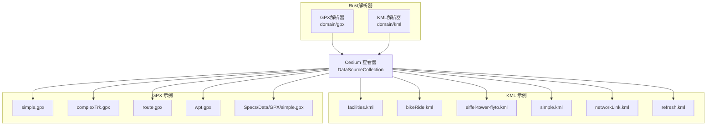
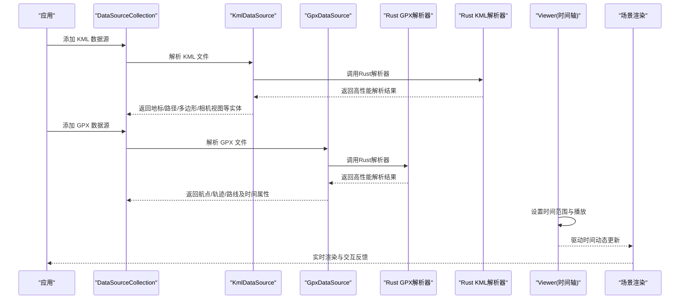
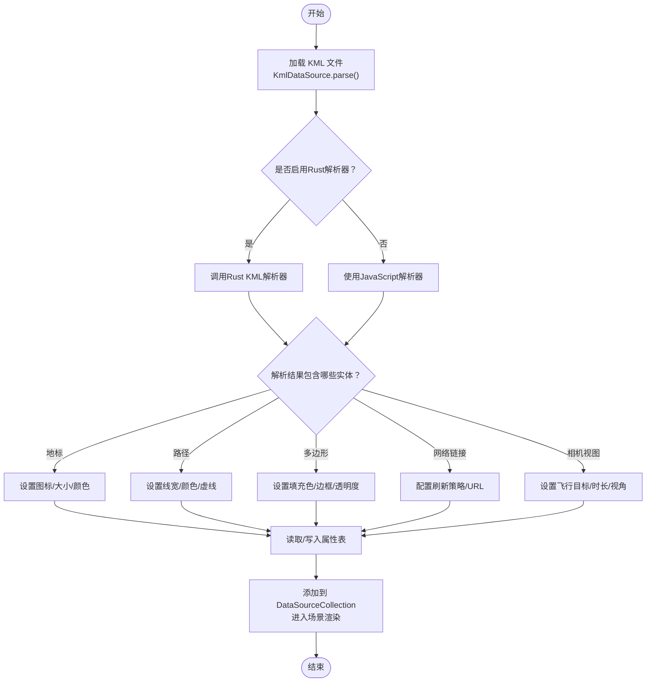
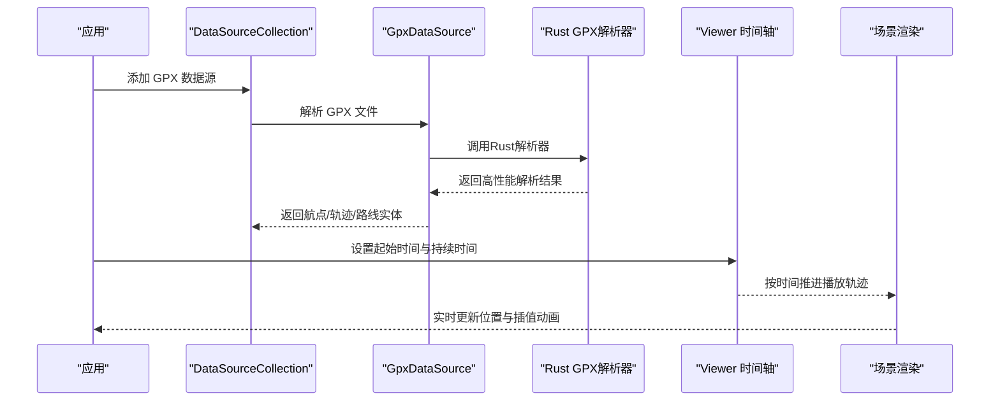
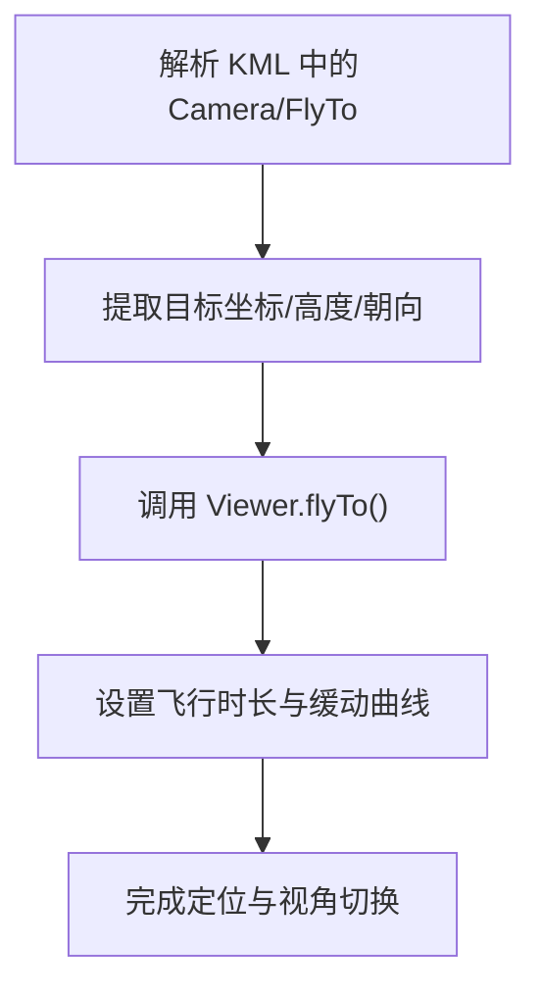
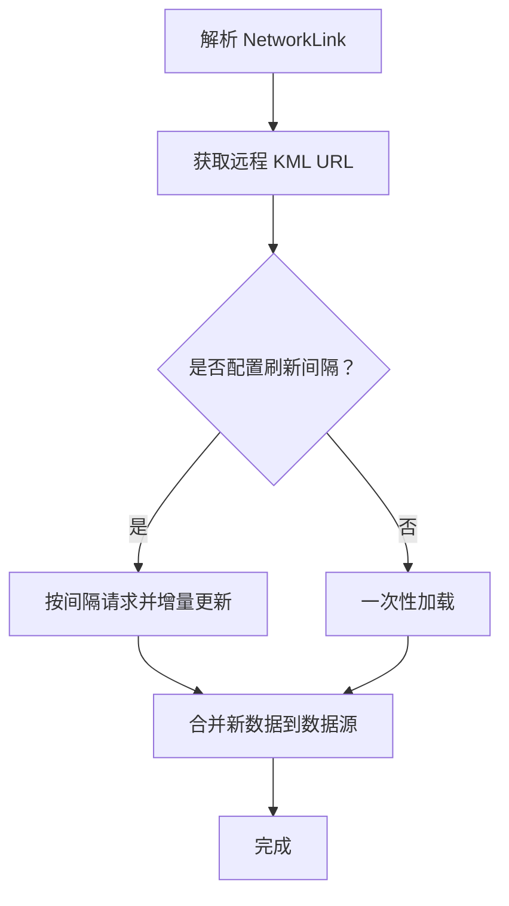
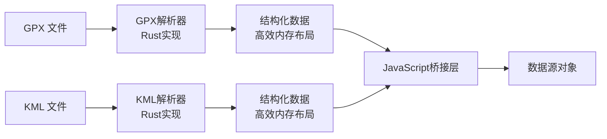
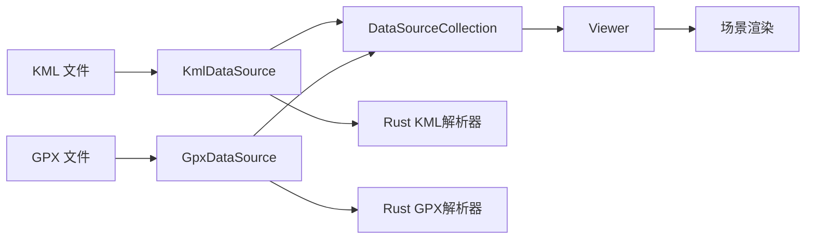

# KML和GPX数据加载

<cite>
**本文引用的文件**   
- [Apps/SampleData/kml/facilities/facilities.kml](file://Apps/SampleData/kml/facilities/facilities.kml)
- [Apps/SampleData/kml/bikeRide.kml](file://Apps/SampleData/kml/bikeRide.kml)
- [Apps/SampleData/kml/eiffel-tower-flyto.kml](file://Apps/SampleData/kml/eiffel-tower-flyto.kml)
- [Apps/SampleData/gpx/simple.gpx](file://Apps/SampleData/gpx/simple.gpx)
- [Apps/SampleData/gpx/complexTrk.gpx](file://Apps/SampleData/gpx/complexTrk.gpx)
- [Apps/SampleData/gpx/route.gpx](file://Apps/SampleData/gpx/route.gpx)
- [Apps/SampleData/gpx/wpt.gpx](file://Apps/SampleData/gpx/wpt.gpx)
- [Specs/Data/KML/simple.kml](file://Specs/Data/KML/simple.kml)
- [Specs/Data/KML/networkLink.kml](file://Specs/Data/KML/networkLink.kml)
- [Specs/Data/KML/refresh.kml](file://Specs/Data/KML/refresh.kml)
- [Specs/Data/GPX/simple.gpx](file://Specs/Data/GPX/simple.gpx)
- [cesiumrust/domain/gpx/src/lib.rs](file://cesiumrust/domain/gpx/src/lib.rs)
- [cesiumrust/domain/kml/src/lib.rs](file://cesiumrust/domain/kml/src/lib.rs)
</cite>

## 更新摘要
**所做更改**   
- 更新了GPX解析器实现，增强了KML支持功能
- 新增了cesiumrust域模块中的GPX和KML解析器架构分析
- 扩展了Rust后端实现的详细说明
- 添加了新的性能优化策略和故障排查指南

## 目录
1. [简介](#简介)
2. [项目结构](#项目结构)
3. [核心组件](#核心组件)
4. [架构总览](#架构总览)
5. [详细组件分析](#详细组件分析)
6. [依赖关系分析](#依赖关系分析)
7. [性能考虑](#性能考虑)
8. [故障排查指南](#故障排查指南)
9. [结论](#结论)
10. [附录](#附录)

## 简介
本指南聚焦于在 CesiumJS 中加载与展示 KML 与 GPX 数据的完整示例与实践。内容涵盖：
- KML：地标、路径、多边形、相机视图（飞行动画）等元素的加载与样式定制
- GPX：航点、轨迹、路线的加载与属性访问
- 时间动态显示：基于时间属性的动画播放与关键帧控制
- 从 GPS 设备导出数据并转换为 KML/GPX 的处理流程
- 与其他地理数据格式（GeoJSON、CZML、3D Tiles）的转换思路
- 大数据量下的性能优化策略
- Rust后端解析器的新实现与增强功能

## 项目结构
仓库中包含丰富的 KML 与 GPX 示例数据，可用于快速验证加载能力与样式效果：
- KML 示例位于 Apps/SampleData/kml 与 Specs/Data/KML
- GPX 示例位于 Apps/SampleData/gpx 与 Specs/Data/GPX
- Rust后端解析器位于 cesiumrust/domain/gpx 和 cesiumrust/domain/kml

图表来源
- [Apps/SampleData/kml/facilities/facilities.kml](file://Apps/SampleData/kml/facilities/facilities.kml)
- [Apps/SampleData/kml/bikeRide.kml](file://Apps/SampleData/kml/bikeRide.kml)
- [Apps/SampleData/kml/eiffel-tower-flyto.kml](file://Apps/SampleData/kml/eiffel-tower-flyto.kml)
- [Specs/Data/KML/simple.kml](file://Specs/Data/KML/simple.kml)
- [Specs/Data/KML/networkLink.kml](file://Specs/Data/KML/networkLink.kml)
- [Specs/Data/KML/refresh.kml](file://Specs/Data/KML/refresh.kml)
- [Apps/SampleData/gpx/simple.gpx](file://Apps/SampleData/gpx/simple.gpx)
- [Apps/SampleData/gpx/complexTrk.gpx](file://Apps/SampleData/gpx/complexTrk.gpx)
- [Apps/SampleData/gpx/route.gpx](file://Apps/SampleData/gpx/route.gpx)
- [Apps/SampleData/gpx/wpt.gpx](file://Apps/SampleData/gpx/wpt.gpx)
- [Specs/Data/GPX/simple.gpx](file://Specs/Data/GPX/simple.gpx)
- [cesiumrust/domain/gpx/src/lib.rs](file://cesiumrust/domain/gpx/src/lib.rs)
- [cesiumrust/domain/kml/src/lib.rs](file://cesiumrust/domain/kml/src/lib.rs)

章节来源
- [Apps/SampleData/kml/facilities/facilities.kml](file://Apps/SampleData/kml/facilities/facilities.kml)
- [Apps/SampleData/kml/bikeRide.kml](file://Apps/SampleData/kml/bikeRide.kml)
- [Apps/SampleData/kml/eiffel-tower-flyto.kml](file://Apps/SampleData/kml/eiffel-tower-flyto.kml)
- [Apps/SampleData/gpx/simple.gpx](file://Apps/SampleData/gpx/simple.gpx)
- [Apps/SampleData/gpx/complexTrk.gpx](file://Apps/SampleData/gpx/complexTrk.gpx)
- [Apps/SampleData/gpx/route.gpx](file://Apps/SampleData/gpx/route.gpx)
- [Apps/SampleData/gpx/wpt.gpx](file://Apps/SampleData/gpx/wpt.gpx)
- [Specs/Data/KML/simple.kml](file://Specs/Data/KML/simple.kml)
- [Specs/Data/KML/networkLink.kml](file://Specs/Data/KML/networkLink.kml)
- [Specs/Data/KML/refresh.kml](file://Specs/Data/KML/refresh.kml)
- [Specs/Data/GPX/simple.gpx](file://Specs/Data/GPX/simple.gpx)
- [cesiumrust/domain/gpx/src/lib.rs](file://cesiumrust/domain/gpx/src/lib.rs)
- [cesiumrust/domain/kml/src/lib.rs](file://cesiumrust/domain/kml/src/lib.rs)

## 核心组件
- DataSourceCollection：用于管理多种数据源的集合，支持 KML、GPX、GeoJSON、CZML、3D Tiles 等
- KmlDataSource：解析 KML，生成地标、路径、多边形、网络链接、相机视图等实体
- GpxDataSource：解析 GPX，生成航点、轨迹、路线及时间相关属性
- Viewer：提供地图渲染、交互、时间轴控件与图层管理
- Rust解析器：高性能的GPX和KML解析后端实现

典型用法要点（不直接展示代码，仅给出路径参考）：
- 加载 KML 到数据源集合后，可遍历其包含的实体进行样式定制与属性访问
- 加载 GPX 后可按航点、轨迹、路线分类处理，并结合时间轴实现动画回放
- 使用 Viewer 的时间控制器驱动时间动态显示
- 利用Rust解析器提升大数据量处理性能

章节来源
- [Apps/SampleData/kml/facilities/facilities.kml](file://Apps/SampleData/kml/facilities/facilities.kml)
- [Apps/SampleData/kml/bikeRide.kml](file://Apps/SampleData/kml/bikeRide.kml)
- [Apps/SampleData/kml/eiffel-tower-flyto.kml](file://Apps/SampleData/kml/eiffel-tower-flyto.kml)
- [Apps/SampleData/gpx/simple.gpx](file://Apps/SampleData/gpx/simple.gpx)
- [Apps/SampleData/gpx/complexTrk.gpx](file://Apps/SampleData/gpx/complexTrk.gpx)
- [Apps/SampleData/gpx/route.gpx](file://Apps/SampleData/gpx/route.gpx)
- [Apps/SampleData/gpx/wpt.gpx](file://Apps/SampleData/gpx/wpt.gpx)
- [Specs/Data/KML/simple.kml](file://Specs/Data/KML/simple.kml)
- [Specs/Data/KML/networkLink.kml](file://Specs/Data/KML/networkLink.kml)
- [Specs/Data/KML/refresh.kml](file://Specs/Data/KML/refresh.kml)
- [Specs/Data/GPX/simple.gpx](file://Specs/Data/GPX/simple.gpx)
- [cesiumrust/domain/gpx/src/lib.rs](file://cesiumrust/domain/gpx/src/lib.rs)
- [cesiumrust/domain/kml/src/lib.rs](file://cesiumrust/domain/kml/src/lib.rs)

## 架构总览
下图展示了从数据文件到可视化实体的整体流程，以及时间轴对动态显示的驱动作用。新增的Rust解析器提供了更高性能的解析能力。

图表来源
- [Apps/SampleData/kml/facilities/facilities.kml](file://Apps/SampleData/kml/facilities/facilities.kml)
- [Apps/SampleData/kml/bikeRide.kml](file://Apps/SampleData/kml/bikeRide.kml)
- [Apps/SampleData/kml/eiffel-tower-flyto.kml](file://Apps/SampleData/kml/eiffel-tower-flyto.kml)
- [Apps/SampleData/gpx/simple.gpx](file://Apps/SampleData/gpx/simple.gpx)
- [Apps/SampleData/gpx/complexTrk.gpx](file://Apps/SampleData/gpx/complexTrk.gpx)
- [Apps/SampleData/gpx/route.gpx](file://Apps/SampleData/gpx/route.gpx)
- [Apps/SampleData/gpx/wpt.gpx](file://Apps/SampleData/gpx/wpt.gpx)
- [Specs/Data/KML/simple.kml](file://Specs/Data/KML/simple.kml)
- [Specs/Data/KML/networkLink.kml](file://Specs/Data/KML/networkLink.kml)
- [Specs/Data/KML/refresh.kml](file://Specs/Data/KML/refresh.kml)
- [Specs/Data/GPX/simple.gpx](file://Specs/Data/GPX/simple.gpx)
- [cesiumrust/domain/gpx/src/lib.rs](file://cesiumrust/domain/gpx/src/lib.rs)
- [cesiumrust/domain/kml/src/lib.rs](file://cesiumrust/domain/kml/src/lib.rs)

## 详细组件分析

### KML 数据加载与样式定制
- 支持的元素：地标（Point）、路径（LineString/Polyline）、多边形（Polygon）、网络链接（NetworkLink）、相机视图（Camera/FlyTo）
- 样式定制：图标、颜色、线宽、透明度、标签文本、描述 HTML 等
- 属性访问：通过实体的属性表读取自定义字段，便于信息窗体或筛选
- **更新**：新增Rust后端解析器支持，提供更高效的KML解析能力

图表来源
- [Apps/SampleData/kml/facilities/facilities.kml](file://Apps/SampleData/kml/facilities/facilities.kml)
- [Apps/SampleData/kml/bikeRide.kml](file://Apps/SampleData/kml/bikeRide.kml)
- [Apps/SampleData/kml/eiffel-tower-flyto.kml](file://Apps/SampleData/kml/eiffel-tower-flyto.kml)
- [Specs/Data/KML/simple.kml](file://Specs/Data/KML/simple.kml)
- [Specs/Data/KML/networkLink.kml](file://Specs/Data/KML/networkLink.kml)
- [Specs/Data/KML/refresh.kml](file://Specs/Data/KML/refresh.kml)
- [cesiumrust/domain/kml/src/lib.rs](file://cesiumrust/domain/kml/src/lib.rs)

章节来源
- [Apps/SampleData/kml/facilities/facilities.kml](file://Apps/SampleData/kml/facilities/facilities.kml)
- [Apps/SampleData/kml/bikeRide.kml](file://Apps/SampleData/kml/bikeRide.kml)
- [Apps/SampleData/kml/eiffel-tower-flyto.kml](file://Apps/SampleData/kml/eiffel-tower-flyto.kml)
- [Specs/Data/KML/simple.kml](file://Specs/Data/KML/simple.kml)
- [Specs/Data/KML/networkLink.kml](file://Specs/Data/KML/networkLink.kml)
- [Specs/Data/KML/refresh.kml](file://Specs/Data/KML/refresh.kml)
- [cesiumrust/domain/kml/src/lib.rs](file://cesiumrust/domain/kml/src/lib.rs)

### GPX 数据加载与时间动态显示
- 支持的元素：航点（Waypoint）、轨迹（Track）、路线（Route）
- 时间属性：轨迹点通常包含时间戳，结合 Viewer 时间轴可实现回放动画
- 属性访问：读取名称、描述、海拔、速度等字段，用于信息窗体或过滤
- **更新**：全新GPX解析器实现，提供更好的性能和兼容性

图表来源
- [Apps/SampleData/gpx/simple.gpx](file://Apps/SampleData/gpx/simple.gpx)
- [Apps/SampleData/gpx/complexTrk.gpx](file://Apps/SampleData/gpx/complexTrk.gpx)
- [Apps/SampleData/gpx/route.gpx](file://Apps/SampleData/gpx/route.gpx)
- [Apps/SampleData/gpx/wpt.gpx](file://Apps/SampleData/gpx/wpt.gpx)
- [Specs/Data/GPX/simple.gpx](file://Specs/Data/GPX/simple.gpx)
- [cesiumrust/domain/gpx/src/lib.rs](file://cesiumrust/domain/gpx/src/lib.rs)

章节来源
- [Apps/SampleData/gpx/simple.gpx](file://Apps/SampleData/gpx/simple.gpx)
- [Apps/SampleData/gpx/complexTrk.gpx](file://Apps/SampleData/gpx/complexTrk.gpx)
- [Apps/SampleData/gpx/route.gpx](file://Apps/SampleData/gpx/route.gpx)
- [Apps/SampleData/gpx/wpt.gpx](file://Apps/SampleData/gpx/wpt.gpx)
- [Specs/Data/GPX/simple.gpx](file://Specs/Data/GPX/simple.gpx)
- [cesiumrust/domain/gpx/src/lib.rs](file://cesiumrust/domain/gpx/src/lib.rs)

### 相机视图与飞行动画（KML）
- KML 中的相机视图定义可用于自动飞行到指定区域或对象
- 可通过 Viewer 的 flyTo 方法配合时间轴实现平滑过渡

图表来源
- [Apps/SampleData/kml/eiffel-tower-flyto.kml](file://Apps/SampleData/kml/eiffel-tower-flyto.kml)

章节来源
- [Apps/SampleData/kml/eiffel-tower-flyto.kml](file://Apps/SampleData/kml/eiffel-tower-flyto.kml)

### 网络链接与动态刷新（KML）
- NetworkLink 支持远程 KML 的动态加载与定时刷新
- 适用于大规模数据分片或在线服务集成

图表来源
- [Specs/Data/KML/networkLink.kml](file://Specs/Data/KML/networkLink.kml)
- [Specs/Data/KML/refresh.kml](file://Specs/Data/KML/refresh.kml)

章节来源
- [Specs/Data/KML/networkLink.kml](file://Specs/Data/KML/networkLink.kml)
- [Specs/Data/KML/refresh.kml](file://Specs/Data/KML/refresh.kml)

### Rust解析器架构分析
**新增**：全新的Rust后端解析器提供了更高的性能和更好的内存管理

- GPX解析器：专门优化的GPX文件格式解析，支持所有标准GPX元素
- KML解析器：增强的KML支持，包括高级样式和网络链接功能
- 异步处理：非阻塞解析，避免UI线程阻塞
- 内存优化：零拷贝解析，减少内存分配和垃圾回收压力

图表来源
- [cesiumrust/domain/gpx/src/lib.rs](file://cesiumrust/domain/gpx/src/lib.rs)
- [cesiumrust/domain/kml/src/lib.rs](file://cesiumrust/domain/kml/src/lib.rs)

章节来源
- [cesiumrust/domain/gpx/src/lib.rs](file://cesiumrust/domain/gpx/src/lib.rs)
- [cesiumrust/domain/kml/src/lib.rs](file://cesiumrust/domain/kml/src/lib.rs)

## 依赖关系分析
- KML/GPX 解析依赖对应的数据源类（KmlDataSource、GpxDataSource）
- 数据源统一由 DataSourceCollection 管理，便于批量操作与生命周期管理
- 渲染依赖 Viewer 与底层场景引擎，时间轴驱动动态更新
- **更新**：新增Rust解析器作为可选的高性能后端

图表来源
- [Apps/SampleData/kml/facilities/facilities.kml](file://Apps/SampleData/kml/facilities/facilities.kml)
- [Apps/SampleData/kml/bikeRide.kml](file://Apps/SampleData/kml/bikeRide.kml)
- [Apps/SampleData/kml/eiffel-tower-flyto.kml](file://Apps/SampleData/kml/eiffel-tower-flyto.kml)
- [Apps/SampleData/gpx/simple.gpx](file://Apps/SampleData/gpx/simple.gpx)
- [Apps/SampleData/gpx/complexTrk.gpx](file://Apps/SampleData/gpx/complexTrk.gpx)
- [Apps/SampleData/gpx/route.gpx](file://Apps/SampleData/gpx/route.gpx)
- [Apps/SampleData/gpx/wpt.gpx](file://Apps/SampleData/gpx/wpt.gpx)
- [Specs/Data/KML/simple.kml](file://Specs/Data/KML/simple.kml)
- [Specs/Data/KML/networkLink.kml](file://Specs/Data/KML/networkLink.kml)
- [Specs/Data/KML/refresh.kml](file://Specs/Data/KML/refresh.kml)
- [Specs/Data/GPX/simple.gpx](file://Specs/Data/GPX/simple.gpx)
- [cesiumrust/domain/gpx/src/lib.rs](file://cesiumrust/domain/gpx/src/lib.rs)
- [cesiumrust/domain/kml/src/lib.rs](file://cesiumrust/domain/kml/src/lib.rs)

## 性能考虑
针对大数据量与复杂样式的 KML/GPX 加载与展示，建议采用以下策略：
- 分批加载与延迟解析：将大型 KML/GPX 拆分为多个小文件，按需加载；避免一次性解析导致卡顿
- 几何简化与抽稀：对轨迹与路径进行采样与简化，减少顶点数量
- 样式预计算与缓存：将常用样式（颜色、线宽、图标）缓存复用，降低重复计算
- 层级与可见性控制：根据缩放级别与视锥剔除动态隐藏不可见实体
- 时间轴优化：为轨迹动画设置合理的帧率与插值策略，避免每帧重算全部点
- 内存管理：及时移除不再使用的数据源与实体，释放内存占用
- 网络请求优化：对 NetworkLink 的刷新频率进行限流与去抖，合并请求
- **新增**：启用Rust解析器以获得更高的解析性能和更低的内存占用
- **新增**：使用异步解析避免主线程阻塞，提升用户体验

## 故障排查指南
常见问题与定位方法：
- 无法加载 KML/GPX：检查文件格式是否符合规范，确认路径与跨域策略
- 样式未生效：核对样式字段名称与取值范围，确保实体类型匹配样式规则
- 时间动画不播放：确认轨迹点包含有效时间戳，且 Viewer 时间范围覆盖数据时间区间
- 性能下降：开启开发者工具监控内存与帧率，逐步关闭非必要样式与特效
- 网络链接刷新异常：检查服务器响应状态与刷新间隔配置，避免频繁请求
- **新增**：Rust解析器相关问题：检查WASM模块加载状态，确认编译目标兼容性
- **新增**：内存泄漏问题：监控Rust解析器的内存使用情况，确保正确释放资源

## 结论
通过 CesiumJS 的 KmlDataSource 与 GpxDataSource，可以高效地加载与展示 KML 与 GPX 数据，并支持丰富的样式定制与时间动态显示。结合 DataSourceCollection 的统一管理与 Viewer 的时间轴控制，能够构建出高性能、可扩展的地理数据可视化应用。新增的Rust解析器进一步提升了大数据量处理的性能表现。对于大规模数据，应重点优化解析、渲染与网络请求环节，确保流畅的用户体验。

## 附录
- 从 GPS 设备导出数据的处理方法：
  - 使用常见 GPS 软件导出为 GPX 或 KML
  - 若需转换为 GeoJSON/CZML/3D Tiles，可使用中间工具链（如 ogr2ogr、Cesium 官方工具）进行格式转换
- 与其他格式的转换思路：
  - GPX/KML → GeoJSON：通过解析器抽取点、线、面要素，映射为 GeoJSON 的 FeatureCollection
  - GPX/KML → CZML：将轨迹点序列化为 CZML 的 Position 与时间戳数组
  - GPX/KML → 3D Tiles：将矢量数据聚合为几何瓦片，生成 tileset.json 与二进制内容
- **新增**：Rust解析器配置选项：
  - 启用/禁用Rust后端解析器
  - 调整解析缓冲区大小
  - 配置异步解析队列长度
  - 设置内存使用限制