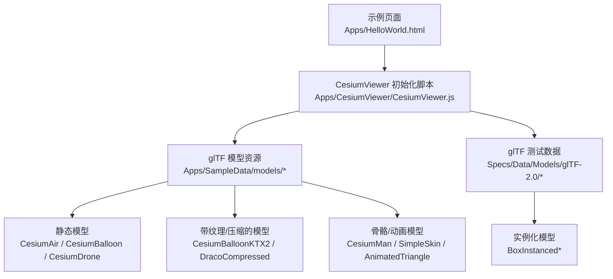
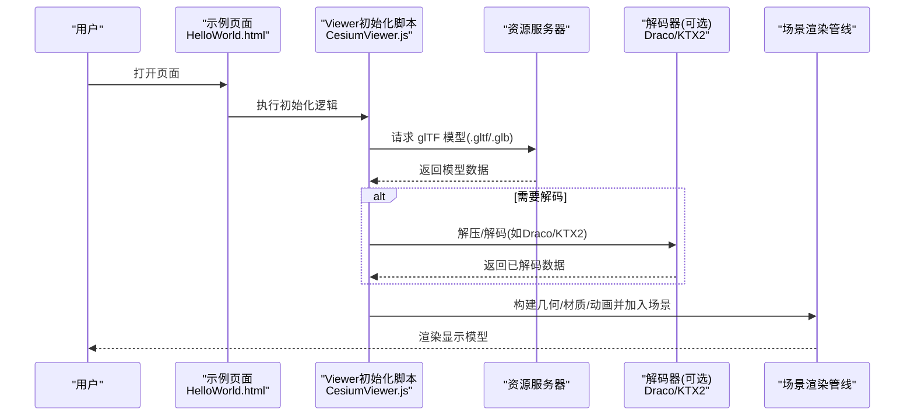
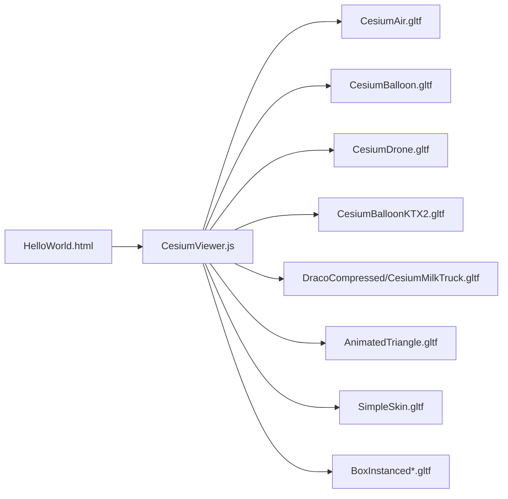

# glTF模型加载

<cite>
**本文引用的文件**   
- [Apps/HelloWorld.html](file://Apps/HelloWorld.html)
- [Apps/CesiumViewer/CesiumViewer.js](file://Apps/CesiumViewer/CesiumViewer.js)
- [Apps/SampleData/models/CesiumAir/CesiumAir.gltf](file://Apps/SampleData/models/CesiumAir/CesiumAir.gltf)
- [Apps/SampleData/models/CesiumBalloon/CesiumBalloon.gltf](file://Apps/SampleData/models/CesiumBalloon/CesiumBalloon.gltf)
- [Apps/SampleData/models/CesiumDrone/CesiumDrone.gltf](file://Apps/SampleData/models/CesiumDrone/CesiumDrone.gltf)
- [Apps/SampleData/models/CesiumMan/CesiumMan.gltf](file://Apps/SampleData/models/CesiumMan/CesiumMan.gltf)
- [Apps/SampleData/models/CesiumMilkTruck/CesiumMilkTruck.dae](file://Apps/SampleData/models/CesiumMilkTruck/CesiumMilkTruck.dae)
- [Apps/SampleData/models/DracoCompressed/CesiumMilkTruck.gltf](file://Apps/SampleData/models/DracoCompressed/CesiumMilkTruck.gltf)
- [Apps/SampleData/models/CesiumBalloonKTX2/CesiumBalloonKTX2.gltf](file://Apps/SampleData/models/CesiumBalloonKTX2/CesiumBalloonKTX2.gltf)
- [Specs/Data/Models/glTF-2.0/SimpleSkin/gltf/SimpleSkin.gltf](file://Specs/Data/Models/glTF-2.0/SimpleSkin/gltf/SimpleSkin.gltf)
- [Specs/Data/Models/glTF-2.0/AnimatedTriangle/gltf/AnimatedTriangle.gltf](file://Specs/Data/Models/glTF-2.0/AnimatedTriangle/gltf/AnimatedTriangle.gltf)
- [Specs/Data/Models/glTF-2.0/BoxTexturedKtx2Basis/gltf/BoxTexturedKtx2Basis.gltf](file://Specs/Data/Models/glTF-2.0/BoxTexturedKtx2Basis/gltf/BoxTexturedKtx2Basis.gltf)
- [Specs/Data/Models/glTF-2.0/BoxWithTangents/glTF-Draco/BoxWithTangents.gltf](file://Specs/Data/Models/glTF-2.0/BoxWithTangents/glTF-Draco/BoxWithTangents.gltf)
- [Specs/Data/Models/glTF-2.0/BoxInstanced/glTF/box-instanced.gltf](file://Specs/Data/Models/glTF-2.0/BoxInstanced/glTF/box-instanced.gltf)
- [Specs/Data/Models/glTF-2.0/BoxInstancedTranslation/glTF/box-instanced-translation.gltf](file://Specs/Data/Models/glTF-2.0/BoxInstancedTranslation/glTF/box-instanced-translation.gltf)
- [Specs/Data/Models/glTF-2.0/BoxInstancedScale/glTF/box-instanced-scale.gltf](file://Specs/Data/Models/glTF-2.0/BoxInstancedScale/glTF/box-instanced-scale.gltf)
- [Specs/Data/Models/glTF-2.0/BoxInstancedOrientation/glTF/box-instanced-orientation.gltf](file://Specs/Data/Models/glTF-2.0/BoxInstancedOrientation/glTF/box-instanced-orientation.gltf)
- [Specs/Data/Models/glTF-2.0/BoxInstancedInterleaved/glTF/box-instanced-interleaved.gltf](file://Specs/Data/Models/glTF-2.0/BoxInstancedInterleaved/glTF/box-instanced-interleaved.gltf)
</cite>

## 目录
1. [简介](#简介)
2. [项目结构](#项目结构)
3. [核心组件](#核心组件)
4. [架构总览](#架构总览)
5. [详细组件分析](#详细组件分析)
6. [依赖分析](#依赖分析)
7. [性能考虑](#性能考虑)
8. [故障排查指南](#故障排查指南)
9. [结论](#结论)
10. [附录](#附录)

## 简介
本文件提供一套完整的glTF模型加载示例集合，覆盖静态模型、动画模型、骨骼动画、材质与纹理、压缩格式（Draco、Basis/KTX2）、位置/缩放/旋转等变换、光照效果、进度监控与错误处理，以及复杂场景中的模型管理与性能优化技巧。内容基于仓库中提供的示例数据与最小可运行页面进行说明，帮助读者快速上手并掌握最佳实践。

## 项目结构
仓库中与glTF模型加载相关的资源主要分布在以下位置：
- 示例页面与演示入口：用于在浏览器中直接加载和展示模型
- 示例模型数据：包含多种glTF变体（静态、动画、骨骼、压缩、实例化等）
- 测试数据：覆盖更多边界情况与特性组合

图表来源
- [Apps/HelloWorld.html](file://Apps/HelloWorld.html)
- [Apps/CesiumViewer/CesiumViewer.js](file://Apps/CesiumViewer/CesiumViewer.js)
- [Apps/SampleData/models/CesiumAir/CesiumAir.gltf](file://Apps/SampleData/models/CesiumAir/CesiumAir.gltf)
- [Apps/SampleData/models/CesiumBalloon/CesiumBalloon.gltf](file://Apps/SampleData/models/CesiumBalloon/CesiumBalloon.gltf)
- [Apps/SampleData/models/CesiumDrone/CesiumDrone.gltf](file://Apps/SampleData/models/CesiumDrone/CesiumDrone.gltf)
- [Apps/SampleData/models/CesiumBalloonKTX2/CesiumBalloonKTX2.gltf](file://Apps/SampleData/models/CesiumBalloonKTX2/CesiumBalloonKTX2.gltf)
- [Apps/SampleData/models/DracoCompressed/CesiumMilkTruck.gltf](file://Apps/SampleData/models/DracoCompressed/CesiumMilkTruck.gltf)
- [Specs/Data/Models/glTF-2.0/SimpleSkin/gltf/SimpleSkin.gltf](file://Specs/Data/Models/glTF-2.0/SimpleSkin/gltf/SimpleSkin.gltf)
- [Specs/Data/Models/glTF-2.0/AnimatedTriangle/gltf/AnimatedTriangle.gltf](file://Specs/Data/Models/glTF-2.0/AnimatedTriangle/gltf/AnimatedTriangle.gltf)
- [Specs/Data/Models/glTF-2.0/BoxInstanced/glTF/box-instanced.gltf](file://Specs/Data/Models/glTF-2.0/BoxInstanced/glTF/box-instanced.gltf)

章节来源
- [Apps/HelloWorld.html](file://Apps/HelloWorld.html)
- [Apps/CesiumViewer/CesiumViewer.js](file://Apps/CesiumViewer/CesiumViewer.js)

## 核心组件
- 示例页面：提供最小化的HTML入口，用于初始化渲染环境并加载模型
- Viewer 初始化脚本：负责创建视图、配置光源、添加模型实体、设置变换与动画
- glTF 模型资源：涵盖静态网格、纹理贴图、KTX2/Basis纹理、Draco压缩、骨骼与动画等

关键要点
- 使用示例页面作为起点，结合Viewer初始化脚本完成模型加载与展示
- 通过模型路径指向不同示例数据，验证各类glTF特性
- 利用测试数据扩展用例，覆盖实例化、切线空间、动画混合等高级特性

章节来源
- [Apps/HelloWorld.html](file://Apps/HelloWorld.html)
- [Apps/CesiumViewer/CesiumViewer.js](file://Apps/CesiumViewer/CesiumViewer.js)

## 架构总览
下图展示了从页面到模型资源的整体加载流程，包括网络请求、解析、解码（如Draco/KTX2）、构建几何与材质、加入场景与渲染。

图表来源
- [Apps/HelloWorld.html](file://Apps/HelloWorld.html)
- [Apps/CesiumViewer/CesiumViewer.js](file://Apps/CesiumViewer/CesiumViewer.js)
- [Apps/SampleData/models/DracoCompressed/CesiumMilkTruck.gltf](file://Apps/SampleData/models/DracoCompressed/CesiumMilkTruck.gltf)
- [Apps/SampleData/models/CesiumBalloonKTX2/CesiumBalloonKTX2.gltf](file://Apps/SampleData/models/CesiumBalloonKTX2/CesiumBalloonKTX2.gltf)

## 详细组件分析

### 静态模型加载
- 目标：加载无动画的简单网格模型，验证基础渲染与材质
- 推荐示例：CesiumAir、CesiumBalloon、CesiumDrone
- 典型步骤：
  - 在页面中引入初始化脚本
  - 调用加载接口传入模型URL
  - 设置初始位置、缩放、旋转等变换
  - 调整光照与环境以观察材质表现

章节来源
- [Apps/SampleData/models/CesiumAir/CesiumAir.gltf](file://Apps/SampleData/models/CesiumAir/CesiumAir.gltf)
- [Apps/SampleData/models/CesiumBalloon/CesiumBalloon.gltf](file://Apps/SampleData/models/CesiumBalloon/CesiumBalloon.gltf)
- [Apps/SampleData/models/CesiumDrone/CesiumDrone.gltf](file://Apps/SampleData/models/CesiumDrone/CesiumDrone.gltf)

### 动画模型与骨骼动画
- 目标：加载含时间轴动画或骨骼动画的模型，控制播放状态与速度
- 推荐示例：
  - 动画三角形：AnimatedTriangle
  - 骨骼动画：SimpleSkin
- 典型步骤：
  - 加载模型后获取动画控制器
  - 设置循环模式、时间偏移、播放速率
  - 在每帧更新时推进动画时间

章节来源
- [Specs/Data/Models/glTF-2.0/AnimatedTriangle/gltf/AnimatedTriangle.gltf](file://Specs/Data/Models/glTF-2.0/AnimatedTriangle/gltf/AnimatedTriangle.gltf)
- [Specs/Data/Models/glTF-2.0/SimpleSkin/gltf/SimpleSkin.gltf](file://Specs/Data/Models/glTF-2.0/SimpleSkin/gltf/SimpleSkin.gltf)

### 材质与纹理（含KTX2/Basis）
- 目标：加载带纹理的模型，并使用高效纹理格式提升性能
- 推荐示例：
  - KTX2纹理：CesiumBalloonKTX2
  - 标准纹理：CesiumBalloon
- 典型步骤：
  - 确保纹理资源可用且跨域策略正确
  - 启用KTX2解码支持（若需要）
  - 调整纹理采样与过滤参数以获得更佳视觉效果

章节来源
- [Apps/SampleData/models/CesiumBalloonKTX2/CesiumBalloonKTX2.gltf](file://Apps/SampleData/models/CesiumBalloonKTX2/CesiumBalloonKTX2.gltf)
- [Apps/SampleData/models/CesiumBalloon/CesiumBalloon.gltf](file://Apps/SampleData/models/CesiumBalloon/CesiumBalloon.gltf)
- [Specs/Data/Models/glTF-2.0/BoxTexturedKtx2Basis/gltf/BoxTexturedKtx2Basis.gltf](file://Specs/Data/Models/glTF-2.0/BoxTexturedKtx2Basis/gltf/BoxTexturedKtx2Basis.gltf)

### 模型压缩（Draco）
- 目标：使用Draco压缩减少模型体积，提高传输与加载效率
- 推荐示例：
  - Draco压缩模型：DracoCompressed/CesiumMilkTruck
  - 带切线的Draco模型：BoxWithTangents
- 典型步骤：
  - 准备Draco解码器模块
  - 在加载配置中启用Draco支持
  - 指定压缩数据的源路径或内嵌二进制

章节来源
- [Apps/SampleData/models/DracoCompressed/CesiumMilkTruck.gltf](file://Apps/SampleData/models/DracoCompressed/CesiumMilkTruck.gltf)
- [Specs/Data/Models/glTF-2.0/BoxWithTangents/glTF-Draco/BoxWithTangents.gltf](file://Specs/Data/Models/glTF-2.0/BoxWithTangents/glTF-Draco/BoxWithTangents.gltf)

### 变换与定位（位置、缩放、旋转）
- 目标：对模型进行空间变换，使其正确放置于场景中
- 建议做法：
  - 使用统一的坐标系与单位约定
  - 先应用缩放与旋转，再设置位置，避免意外形变
  - 对于地球坐标场景，注意局部坐标与地理坐标的转换

章节来源
- [Apps/CesiumViewer/CesiumViewer.js](file://Apps/CesiumViewer/CesiumViewer.js)

### 光照与材质自定义
- 目标：通过调整光源强度、方向与环境光，获得更真实的材质表现
- 建议做法：
  - 为场景添加主光源与补光，模拟真实光照条件
  - 根据模型材质类型（金属/粗糙度、法线贴图）调整光照参数
  - 使用环境贴图增强反射与全局光照效果

章节来源
- [Apps/CesiumViewer/CesiumViewer.js](file://Apps/CesiumViewer/CesiumViewer.js)

### 实例化模型（批量渲染）
- 目标：使用实例化技术高效渲染大量相同或相似模型
- 推荐示例：
  - BoxInstanced系列（基础、平移、缩放、朝向、交错布局）
- 典型步骤：
  - 准备实例化所需的批表与属性数组
  - 按批次提交绘制指令，减少CPU-GPU通信开销
  - 合理组织实例数据以提升缓存命中率

章节来源
- [Specs/Data/Models/glTF-2.0/BoxInstanced/glTF/box-instanced.gltf](file://Specs/Data/Models/glTF-2.0/BoxInstanced/glTF/box-instanced.gltf)
- [Specs/Data/Models/glTF-2.0/BoxInstancedTranslation/glTF/box-instanced-translation.gltf](file://Specs/Data/Models/glTF-2.0/BoxInstancedTranslation/glTF/box-instanced-translation.gltf)
- [Specs/Data/Models/glTF-2.0/BoxInstancedScale/glTF/box-instanced-scale.gltf](file://Specs/Data/Models/glTF-2.0/BoxInstancedScale/glTF/box-instanced-scale.gltf)
- [Specs/Data/Models/glTF-2.0/BoxInstancedOrientation/glTF/box-instanced-orientation.gltf](file://Specs/Data/Models/glTF-2.0/BoxInstancedOrientation/glTF/box-instanced-orientation.gltf)
- [Specs/Data/Models/glTF-2.0/BoxInstancedInterleaved/glTF/box-instanced-interleaved.gltf](file://Specs/Data/Models/glTF-2.0/BoxInstancedInterleaved/glTF/box-instanced-interleaved.gltf)

### 进度监控与错误处理
- 目标：在模型加载过程中提供进度反馈，并对异常进行友好处理
- 建议做法：
  - 监听加载事件，更新进度条或提示文本
  - 捕获网络错误、解码失败、资源缺失等异常
  - 提供重试机制与降级方案（例如回退到未压缩版本）

章节来源
- [Apps/CesiumViewer/CesiumViewer.js](file://Apps/CesiumViewer/CesiumViewer.js)

### 复杂场景中的模型管理
- 目标：在大规模场景中高效管理多个模型的生命周期与可见性
- 建议做法：
  - 按需加载与卸载模型，降低内存占用
  - 使用视锥剔除与距离阈值控制渲染范围
  - 合并相近模型的绘制批次，减少状态切换

章节来源
- [Apps/CesiumViewer/CesiumViewer.js](file://Apps/CesiumViewer/CesiumViewer.js)

## 依赖分析
- 页面与脚本依赖关系：
  - HelloWorld.html 引入 CesiumViewer.js
  - CesiumViewer.js 负责创建视图、加载模型、驱动渲染
- 模型资源依赖：
  - glTF文件可能引用外部纹理、二进制缓冲、压缩数据
  - KTX2/Basis与Draco需要相应解码器支持

图表来源
- [Apps/HelloWorld.html](file://Apps/HelloWorld.html)
- [Apps/CesiumViewer/CesiumViewer.js](file://Apps/CesiumViewer/CesiumViewer.js)
- [Apps/SampleData/models/CesiumAir/CesiumAir.gltf](file://Apps/SampleData/models/CesiumAir/CesiumAir.gltf)
- [Apps/SampleData/models/CesiumBalloon/CesiumBalloon.gltf](file://Apps/SampleData/models/CesiumBalloon/CesiumBalloon.gltf)
- [Apps/SampleData/models/CesiumDrone/CesiumDrone.gltf](file://Apps/SampleData/models/CesiumDrone/CesiumDrone.gltf)
- [Apps/SampleData/models/CesiumBalloonKTX2/CesiumBalloonKTX2.gltf](file://Apps/SampleData/models/CesiumBalloonKTX2/CesiumBalloonKTX2.gltf)
- [Apps/SampleData/models/DracoCompressed/CesiumMilkTruck.gltf](file://Apps/SampleData/models/DracoCompressed/CesiumMilkTruck.gltf)
- [Specs/Data/Models/glTF-2.0/AnimatedTriangle/gltf/AnimatedTriangle.gltf](file://Specs/Data/Models/glTF-2.0/AnimatedTriangle/gltf/AnimatedTriangle.gltf)
- [Specs/Data/Models/glTF-2.0/SimpleSkin/gltf/SimpleSkin.gltf](file://Specs/Data/Models/glTF-2.0/SimpleSkin/gltf/SimpleSkin.gltf)
- [Specs/Data/Models/glTF-2.0/BoxInstanced/glTF/box-instanced.gltf](file://Specs/Data/Models/glTF-2.0/BoxInstanced/glTF/box-instanced.gltf)

## 性能考虑
- 纹理与压缩
  - 优先使用KTX2/Basis纹理以减少带宽与解码时间
  - 对大模型启用Draco压缩，权衡质量与体积
- 实例化与批处理
  - 使用实例化渲染减少绘制调用次数
  - 将相似材质与状态的模型合并批次
- 资源生命周期
  - 按需加载与及时释放，避免内存泄漏
  - 使用LOD与视锥剔除控制渲染范围
- 动画与材质
  - 限制同时播放的动画数量与复杂度
  - 避免过高的纹理分辨率与多重采样

[本节为通用指导，不直接分析具体文件]

## 故障排查指南
- 常见问题
  - 模型无法加载：检查URL、跨域策略与资源可用性
  - 纹理缺失或黑屏：确认纹理路径与格式支持
  - 压缩失败：确保Draco/KTX2解码器已正确加载
  - 动画不播放：检查时间轴与播放状态设置
- 调试建议
  - 开启控制台日志，查看网络请求与错误堆栈
  - 使用开发者工具检查GPU资源与绘制统计
  - 逐步简化模型与材质，定位问题根源

章节来源
- [Apps/CesiumViewer/CesiumViewer.js](file://Apps/CesiumViewer/CesiumViewer.js)

## 结论
通过本示例集合，您可以快速掌握glTF模型在Web端的加载与展示方法，涵盖静态与动画模型、材质与纹理、压缩与实例化、进度监控与错误处理等关键主题。建议在复杂场景中结合实例化、LOD与资源生命周期管理，实现高性能与良好用户体验的平衡。

[本节为总结性内容，不直接分析具体文件]

## 附录
- 示例模型清单
  - 静态模型：CesiumAir、CesiumBalloon、CesiumDrone
  - 动画与骨骼：AnimatedTriangle、SimpleSkin
  - 压缩与纹理：DracoCompressed/CesiumMilkTruck、CesiumBalloonKTX2、BoxTexturedKtx2Basis
  - 实例化：BoxInstanced系列
- 参考路径
  - 示例页面与脚本：Apps/HelloWorld.html、Apps/CesiumViewer/CesiumViewer.js
  - 模型资源：Apps/SampleData/models/*
  - 测试数据：Specs/Data/Models/glTF-2.0/*

章节来源
- [Apps/HelloWorld.html](file://Apps/HelloWorld.html)
- [Apps/CesiumViewer/CesiumViewer.js](file://Apps/CesiumViewer/CesiumViewer.js)
- [Apps/SampleData/models/CesiumAir/CesiumAir.gltf](file://Apps/SampleData/models/CesiumAir/CesiumAir.gltf)
- [Apps/SampleData/models/CesiumBalloon/CesiumBalloon.gltf](file://Apps/SampleData/models/CesiumBalloon/CesiumBalloon.gltf)
- [Apps/SampleData/models/CesiumDrone/CesiumDrone.gltf](file://Apps/SampleData/models/CesiumDrone/CesiumDrone.gltf)
- [Apps/SampleData/models/CesiumBalloonKTX2/CesiumBalloonKTX2.gltf](file://Apps/SampleData/models/CesiumBalloonKTX2/CesiumBalloonKTX2.gltf)
- [Apps/SampleData/models/DracoCompressed/CesiumMilkTruck.gltf](file://Apps/SampleData/models/DracoCompressed/CesiumMilkTruck.gltf)
- [Specs/Data/Models/glTF-2.0/AnimatedTriangle/gltf/AnimatedTriangle.gltf](file://Specs/Data/Models/glTF-2.0/AnimatedTriangle/gltf/AnimatedTriangle.gltf)
- [Specs/Data/Models/glTF-2.0/SimpleSkin/gltf/SimpleSkin.gltf](file://Specs/Data/Models/glTF-2.0/SimpleSkin/gltf/SimpleSkin.gltf)
- [Specs/Data/Models/glTF-2.0/BoxTexturedKtx2Basis/gltf/BoxTexturedKtx2Basis.gltf](file://Specs/Data/Models/glTF-2.0/BoxTexturedKtx2Basis/gltf/BoxTexturedKtx2Basis.gltf)
- [Specs/Data/Models/glTF-2.0/BoxInstanced/glTF/box-instanced.gltf](file://Specs/Data/Models/glTF-2.0/BoxInstanced/glTF/box-instanced.gltf)